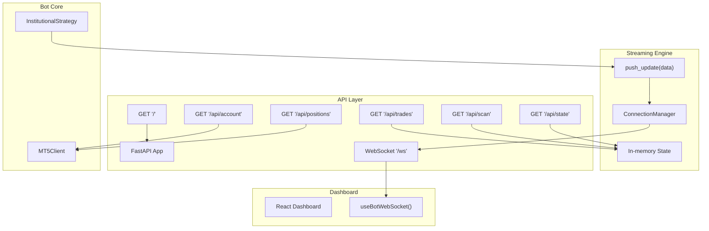
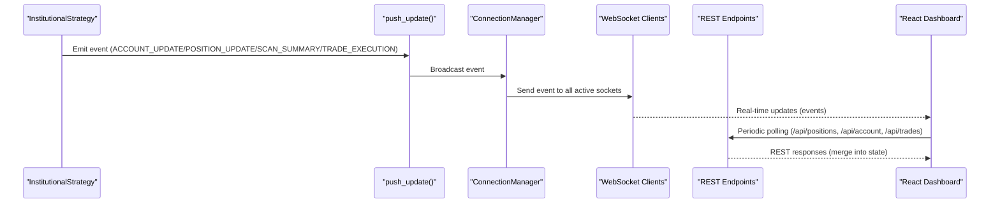
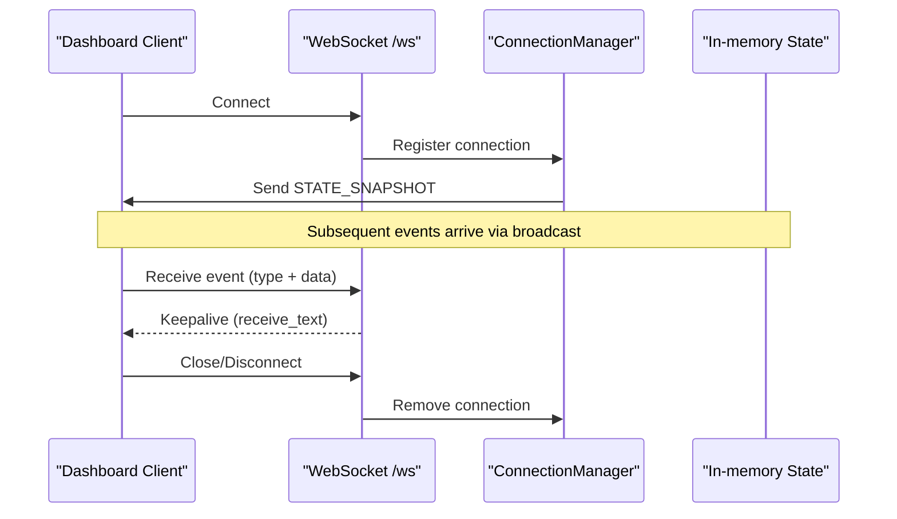
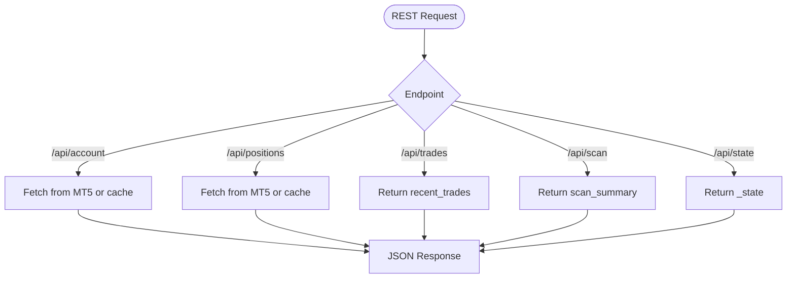
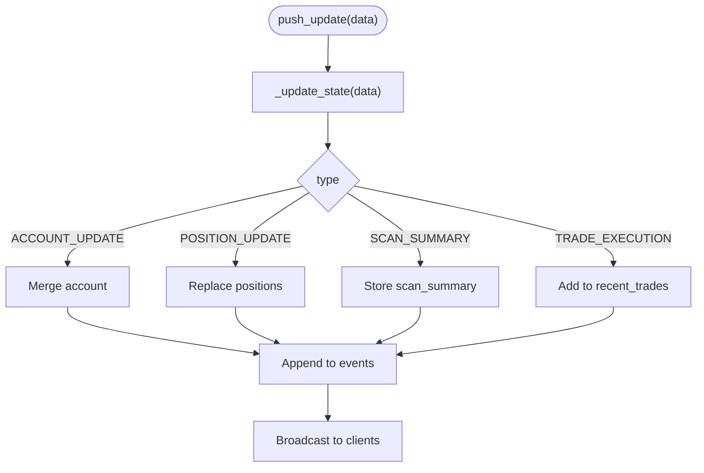
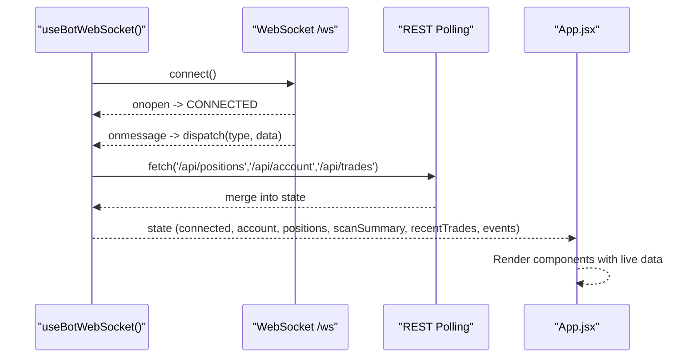
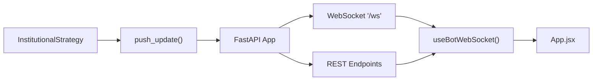

# API Reference

<cite>
**Referenced Files in This Document**
- [stream_server.py](file://api/stream_server.py)
- [useBotWebSocket.js](file://dashboard/src/hooks/useBotWebSocket.js)
- [main.py](file://main.py)
- [settings.py](file://config/settings.py)
- [institutional_strategy.py](file://strategy/institutional_strategy.py)
- [mt5_client.py](file://execution/mt5_client.py)
- [App.jsx](file://dashboard/src/App.jsx)
- [package.json](file://dashboard/package.json)
- [debug_async.py](file://debug_async.py)
</cite>

## Table of Contents
1. [Introduction](#introduction)
2. [Project Structure](#project-structure)
3. [Core Components](#core-components)
4. [Architecture Overview](#architecture-overview)
5. [Detailed Component Analysis](#detailed-component-analysis)
6. [Dependency Analysis](#dependency-analysis)
7. [Performance Considerations](#performance-considerations)
8. [Troubleshooting Guide](#troubleshooting-guide)
9. [Conclusion](#conclusion)
10. [Appendices](#appendices)

## Introduction
This document provides a complete API reference for the WebSocket and REST endpoints that power the MT5 Algo Trading Dashboard. It covers:
- WebSocket API connection handling, message formats, event types, and real-time interaction patterns
- REST API endpoints: /api/account, /api/positions, /api/trades, /api/scan, and /api/state
- Event broadcasting system, client integration examples, and real-time data streaming protocols
- Technical implementation details for API authentication, rate limiting, and error handling
- WebSocket client integration in the React dashboard, event subscription mechanisms, and data synchronization patterns
- API versioning, backwards compatibility, and client-side error handling
- Practical examples of API usage, integration patterns, and performance optimization techniques

## Project Structure
The API surface is implemented in a FastAPI application that exposes:
- A WebSocket endpoint for real-time updates
- REST endpoints for live account, positions, recent trades, scan summaries, and full state snapshots
- A background server starter that runs the API on an automatically selected port

**Diagram sources**
- [stream_server.py](file://api/stream_server.py#L17-L173)
- [useBotWebSocket.js](file://dashboard/src/hooks/useBotWebSocket.js#L105-L155)
- [institutional_strategy.py](file://strategy/institutional_strategy.py#L185-L236)
- [mt5_client.py](file://execution/mt5_client.py#L106-L135)

**Section sources**
- [stream_server.py](file://api/stream_server.py#L17-L173)
- [main.py](file://main.py#L66-L73)

## Core Components
- WebSocket endpoint: /ws
  - Accepts connections and broadcasts real-time events to all connected clients
  - Sends a state snapshot on initial connect
- REST endpoints:
  - GET /api/account: Live account info from MT5 or cached state
  - GET /api/positions: Live open positions from MT5 or cached state
  - GET /api/trades: Recent trade executions (rolling window)
  - GET /api/scan: Latest scan summary (symbols, counts, timestamps)
  - GET /api/state: Complete in-memory state snapshot
- Event broadcasting:
  - push_update(data) updates internal state and broadcasts to all WebSocket clients
  - ConnectionManager manages active connections and handles disconnections

**Section sources**
- [stream_server.py](file://api/stream_server.py#L68-L141)
- [stream_server.py](file://api/stream_server.py#L176-L212)

## Architecture Overview
The system integrates the trading bot with the dashboard via a streaming server. The bot emits structured events that are pushed to the streaming server, which then broadcasts them to WebSocket clients. The React dashboard consumes these events and periodically polls REST endpoints for reconciliation.

**Diagram sources**
- [institutional_strategy.py](file://strategy/institutional_strategy.py#L185-L236)
- [stream_server.py](file://api/stream_server.py#L176-L183)
- [useBotWebSocket.js](file://dashboard/src/hooks/useBotWebSocket.js#L87-L103)

## Detailed Component Analysis

### WebSocket API
- Endpoint: /ws
- Behavior:
  - Accepts WebSocket connections
  - On connect, sends a STATE_SNAPSHOT containing the current in-memory state
  - Maintains a list of active connections
  - Broadcasts messages to all clients, removing dead connections
- Message format:
  - JSON object with a type field indicating the event type
  - Additional data fields vary by type (see Event Types below)
- Keep-alive:
  - Server reads incoming messages to detect disconnects

**Diagram sources**
- [stream_server.py](file://api/stream_server.py#L68-L79)
- [stream_server.py](file://api/stream_server.py#L37-L63)

**Section sources**
- [stream_server.py](file://api/stream_server.py#L68-L79)
- [stream_server.py](file://api/stream_server.py#L37-L63)

### REST API Endpoints
- GET /
  - Returns service health and version metadata
- GET /api/account
  - Returns live account info from MT5 or cached state
  - Fields: balance, equity, profit, currency, leverage, day_pl
- GET /api/positions
  - Returns live open positions from MT5 or cached state
  - Fields per position: ticket, symbol, type, direction, volume, entry_price, price_current, sl_price, tp_price, profit
- GET /api/trades
  - Returns recent trade executions (rolling window)
  - Fields per trade: symbol, direction, price, lot, timestamp
- GET /api/scan
  - Returns latest scan summary
  - Fields: symbols (map of symbol to reason/status), timestamp, count
- GET /api/state
  - Returns complete in-memory state snapshot

**Diagram sources**
- [stream_server.py](file://api/stream_server.py#L82-L141)

**Section sources**
- [stream_server.py](file://api/stream_server.py#L82-L141)

### Event Broadcasting System
- push_update(data)
  - Updates in-memory state according to event type
  - Broadcasts the event to all WebSocket clients
- Internal state structure:
  - account: latest account snapshot
  - positions: list of open positions
  - scan_summary: latest scan summary
  - recent_trades: rolling list of recent trade executions (max 50)
  - events: rolling list of raw events (max 200)
- Event types handled:
  - ACCOUNT_UPDATE: merges account data into state
  - POSITION_UPDATE: replaces positions list
  - SCAN_SUMMARY: stores symbols map, timestamp, and count
  - TRADE_EXECUTION: appends trade to recent_trades

**Diagram sources**
- [stream_server.py](file://api/stream_server.py#L176-L212)

**Section sources**
- [stream_server.py](file://api/stream_server.py#L176-L212)

### Client Integration: React Dashboard
- WebSocket client hook: useBotWebSocket()
  - Connects to ws://localhost:8000/ws
  - On connect/disconnect, updates state accordingly
  - On message, dispatches actions based on event type
  - Maintains rolling lists for events and recentTrades
  - Periodically polls REST endpoints to reconcile state
- Dashboard App integration:
  - Uses the hook to render AccountCard, ScannerGrid, PositionsTable, TradeFeed, and EventLog
  - Displays connection status and live counters

**Diagram sources**
- [useBotWebSocket.js](file://dashboard/src/hooks/useBotWebSocket.js#L105-L155)
- [App.jsx](file://dashboard/src/App.jsx#L12-L100)

**Section sources**
- [useBotWebSocket.js](file://dashboard/src/hooks/useBotWebSocket.js#L105-L155)
- [App.jsx](file://dashboard/src/App.jsx#L12-L100)

### Real-time Data Streaming Protocols
- WebSocket message protocol:
  - JSON object with required type field
  - Additional fields depend on event type
- REST polling:
  - Dashboard polls REST endpoints every 5 seconds
  - Merges REST responses into state without overwriting WebSocket events
- State synchronization:
  - WebSocket events update state immediately
  - REST polling reconciles missing or stale data

**Section sources**
- [useBotWebSocket.js](file://dashboard/src/hooks/useBotWebSocket.js#L87-L103)
- [useBotWebSocket.js](file://dashboard/src/hooks/useBotWebSocket.js#L111-L115)

### API Authentication, Rate Limiting, and Error Handling
- Authentication:
  - No API authentication is implemented in the streaming server
  - CORS is configured to allow origins for development
- Rate Limiting:
  - No built-in rate limiting is present
  - Consider adding AsyncRateLimiter for REST endpoints if needed
- Error Handling:
  - WebSocket: on disconnect, clients reconnect automatically
  - REST: dashboard polls with try/catch and ignores transient failures
  - Server gracefully falls back to cached state when MT5 calls fail

**Section sources**
- [stream_server.py](file://api/stream_server.py#L20-L25)
- [useBotWebSocket.js](file://dashboard/src/hooks/useBotWebSocket.js#L136-L142)
- [useBotWebSocket.js](file://dashboard/src/hooks/useBotWebSocket.js#L87-L103)

### API Versioning and Backwards Compatibility
- Versioning:
  - The root endpoint returns a version field suitable for client-side version checks
- Backwards compatibility:
  - REST endpoints return stable JSON schemas
  - WebSocket event types are additive; clients should ignore unknown types

**Section sources**
- [stream_server.py](file://api/stream_server.py#L82-L84)

### Practical Usage Examples and Integration Patterns
- Starting the API server:
  - The bot starts the server on an auto-selected port in the 8000–8009 range
- Emitting events from the bot:
  - Use push_update(data) with event-type keys to broadcast updates
- Dashboard integration:
  - Import useBotWebSocket() and render components with the returned state
  - Use polling to ensure eventual consistency with live MT5 data

**Section sources**
- [main.py](file://main.py#L66-L73)
- [debug_async.py](file://debug_async.py#L30-L30)
- [useBotWebSocket.js](file://dashboard/src/hooks/useBotWebSocket.js#L105-L155)

## Dependency Analysis
The streaming server depends on:
- FastAPI for routing and WebSocket handling
- Uvicorn for asynchronous server hosting
- MT5 client for live data retrieval
- React dashboard for consuming events and polling REST endpoints

**Diagram sources**
- [institutional_strategy.py](file://strategy/institutional_strategy.py#L185-L236)
- [stream_server.py](file://api/stream_server.py#L68-L141)
- [useBotWebSocket.js](file://dashboard/src/hooks/useBotWebSocket.js#L105-L155)
- [App.jsx](file://dashboard/src/App.jsx#L12-L100)

**Section sources**
- [institutional_strategy.py](file://strategy/institutional_strategy.py#L185-L236)
- [stream_server.py](file://api/stream_server.py#L68-L141)
- [useBotWebSocket.js](file://dashboard/src/hooks/useBotWebSocket.js#L105-L155)
- [App.jsx](file://dashboard/src/App.jsx#L12-L100)

## Performance Considerations
- WebSocket throughput:
  - Broadcasts occur per-event; consider batching if high-frequency updates are emitted
- Memory usage:
  - In-memory state maintains rolling windows; tune sizes for your workload
- REST polling:
  - 5-second intervals balance freshness and load; adjust based on network conditions
- MT5 calls:
  - REST endpoints fall back to cached state if MT5 calls fail; ensure robust retry logic in production

[No sources needed since this section provides general guidance]

## Troubleshooting Guide
- WebSocket connection issues:
  - Verify the server URL and port; the server prints the URL on startup
  - Reconnection logic retries every 3 seconds on close
- REST endpoint errors:
  - Dashboard polls with try/catch; transient failures are ignored
  - Confirm MT5 connectivity and credentials if REST returns empty data
- Event delivery gaps:
  - WebSocket delivers real-time updates; REST polling ensures eventual consistency

**Section sources**
- [stream_server.py](file://api/stream_server.py#L172-L172)
- [useBotWebSocket.js](file://dashboard/src/hooks/useBotWebSocket.js#L136-L142)
- [useBotWebSocket.js](file://dashboard/src/hooks/useBotWebSocket.js#L87-L103)

## Conclusion
The API provides a lightweight, real-time streaming interface for the MT5 trading dashboard. WebSocket events deliver live updates, while REST endpoints offer reconciliation and state snapshots. The system is designed for simplicity and resilience, with automatic reconnection and graceful fallback to cached state.

[No sources needed since this section summarizes without analyzing specific files]

## Appendices

### Event Types and Payloads
- ACCOUNT_UPDATE
  - Fields: account (object with balance, equity, profit, currency, leverage, day_pl)
- POSITION_UPDATE
  - Fields: positions (array of position objects)
- SCAN_SUMMARY
  - Fields: symbols (map of symbol to reason/status), timestamp, count
- TRADE_EXECUTION
  - Fields: symbol, direction, price, lot, timestamp
- STATE_SNAPSHOT
  - Fields: data (object containing account, positions, scan_summary, recent_trades, events)

**Section sources**
- [stream_server.py](file://api/stream_server.py#L185-L212)
- [institutional_strategy.py](file://strategy/institutional_strategy.py#L185-L236)

### Environment and Configuration Notes
- MT5 connection settings are loaded from environment variables
- The dashboard package.json defines the frontend toolchain and scripts

**Section sources**
- [settings.py](file://config/settings.py#L7-L11)
- [package.json](file://dashboard/package.json#L6-L10)