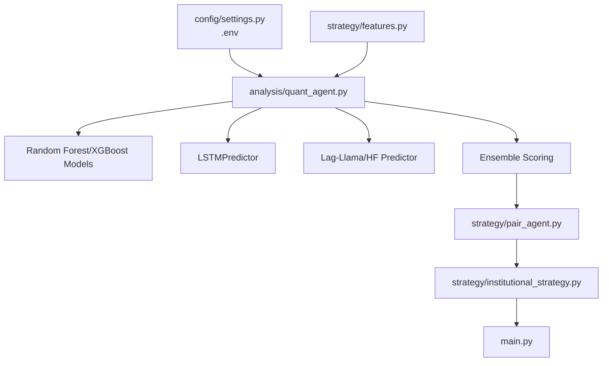
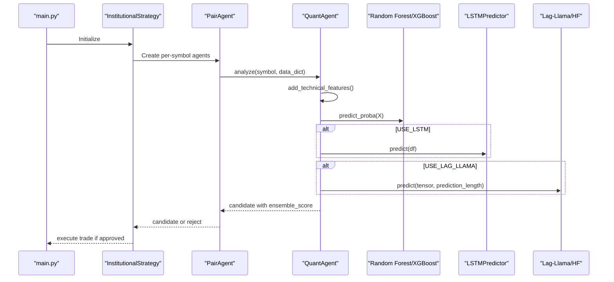
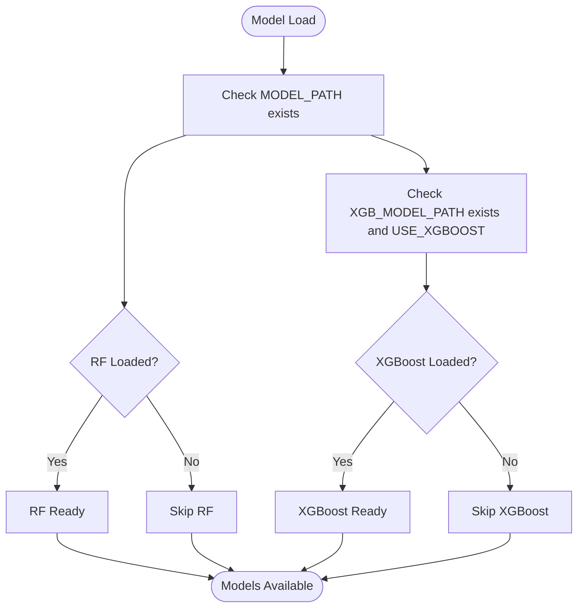
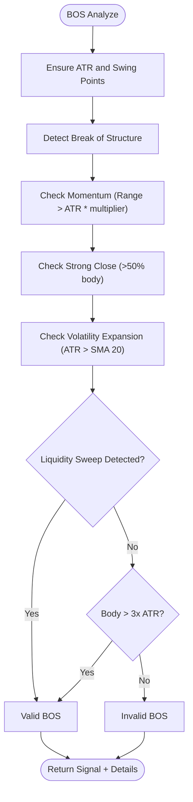
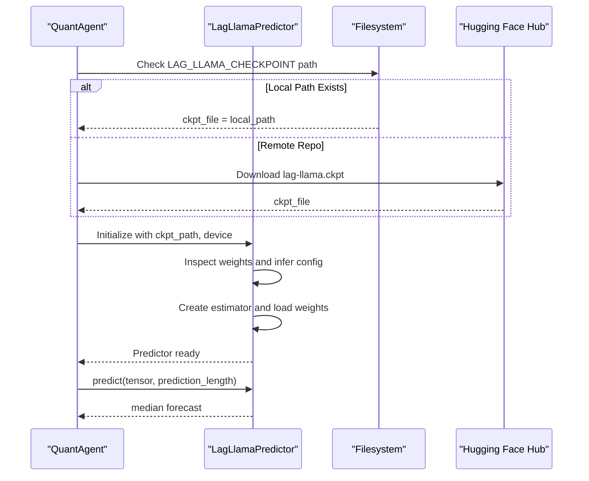
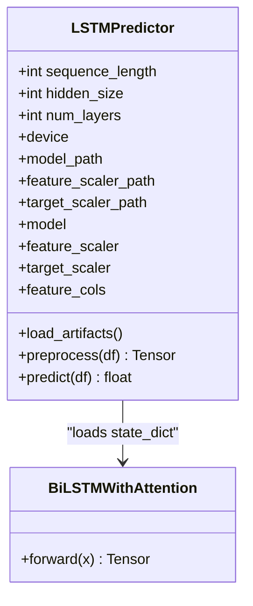
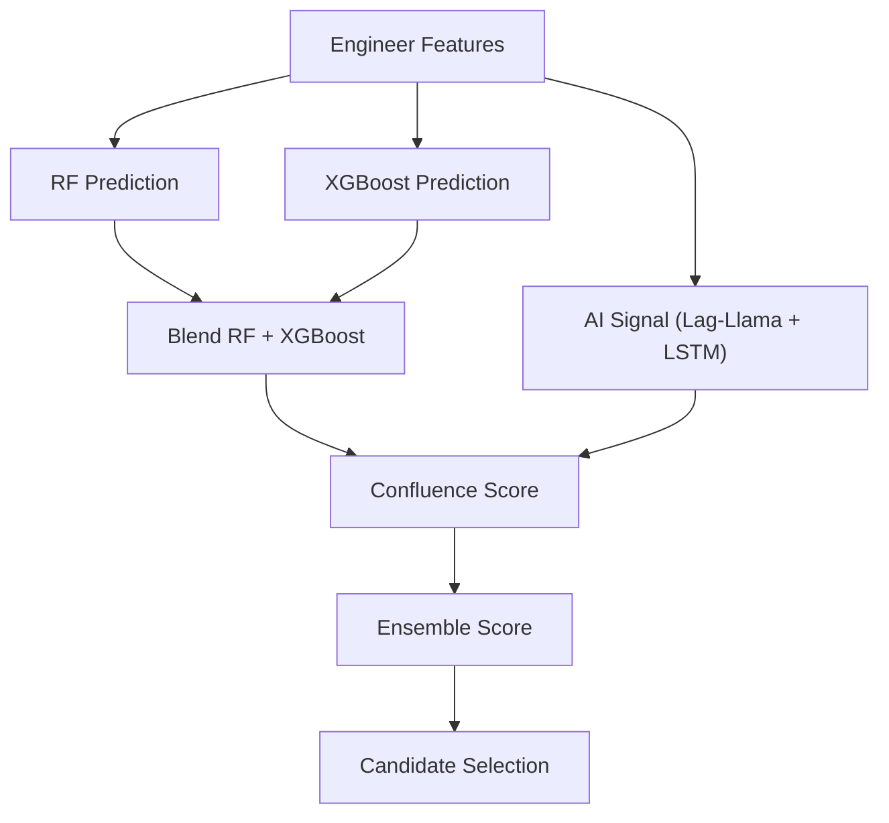
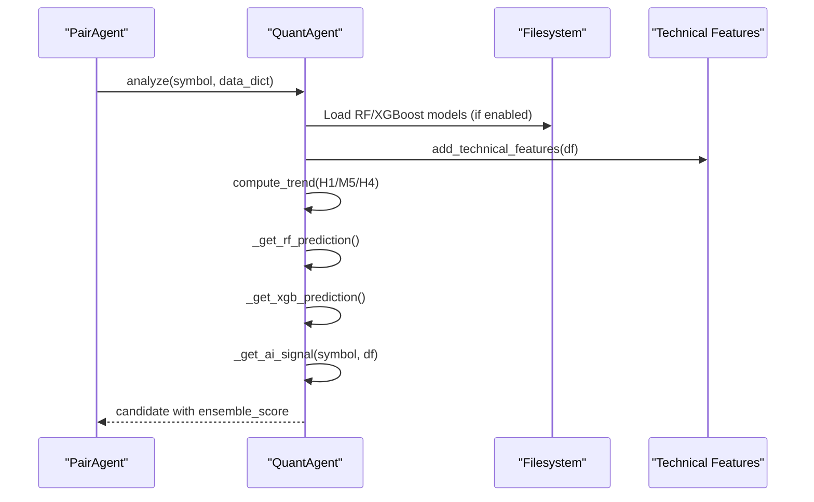
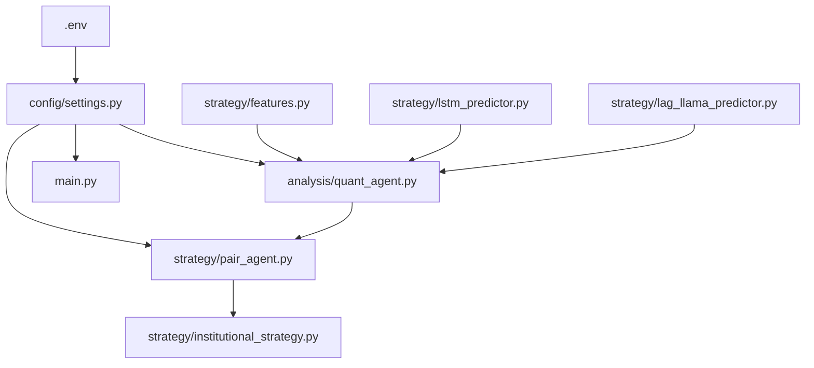

# AI Integration Configuration

<cite>
**Referenced Files in This Document**
- [settings.py](file://config/settings.py)
- [.env](file://.env)
- [quant_agent.py](file://analysis/quant_agent.py)
- [lstm_predictor.py](file://strategy/lstm_predictor.py)
- [lstm_model.py](file://strategy/lstm_model.py)
- [lag_llama_predictor.py](file://strategy/lag_llama_predictor.py)
- [bos_strategy.py](file://strategy/bos_strategy.py)
- [features.py](file://strategy/features.py)
- [institutional_strategy.py](file://strategy/institutional_strategy.py)
- [pair_agent.py](file://strategy/pair_agent.py)
- [main.py](file://main.py)
</cite>

## Table of Contents
1. [Introduction](#introduction)
2. [Project Structure](#project-structure)
3. [Core Components](#core-components)
4. [Architecture Overview](#architecture-overview)
5. [Detailed Component Analysis](#detailed-component-analysis)
6. [Dependency Analysis](#dependency-analysis)
7. [Performance Considerations](#performance-considerations)
8. [Troubleshooting Guide](#troubleshooting-guide)
9. [Conclusion](#conclusion)

## Introduction
This document explains the AI model integration configuration for the Institutional SureShot Scanner. It covers machine learning model settings for Random Forest/XGBoost, Lag-Llama/XGBoost integration, LSTM model configuration, model loading mechanisms, ensemble scoring, and how these components integrate with the quant agent system and the broader trading pipeline.

## Project Structure
The AI integration spans several modules:
- Configuration and environment variables define model paths, flags, and strategy parameters.
- Quantitative analysis is performed by the Quant Agent, which orchestrates ML inference and AI signal fusion.
- LSTM and Lag-Llama predictors provide additional forecasting signals.
- Feature engineering enriches the input data for ML models.
- The Institutional Strategy coordinates scanning and execution across multiple symbols.

**Diagram sources**
- [settings.py](file://config/settings.py#L173-L196)
- [.env](file://.env#L1-L59)
- [quant_agent.py](file://analysis/quant_agent.py#L34-L108)
- [features.py](file://strategy/features.py#L6-L98)
- [lstm_predictor.py](file://strategy/lstm_predictor.py#L9-L36)
- [lag_llama_predictor.py](file://strategy/lag_llama_predictor.py#L31-L45)
- [pair_agent.py](file://strategy/pair_agent.py#L22-L54)
- [institutional_strategy.py](file://strategy/institutional_strategy.py#L49-L86)
- [main.py](file://main.py#L19-L63)

**Section sources**
- [settings.py](file://config/settings.py#L173-L196)
- [.env](file://.env#L1-L59)
- [quant_agent.py](file://analysis/quant_agent.py#L34-L108)
- [features.py](file://strategy/features.py#L6-L98)
- [lstm_predictor.py](file://strategy/lstm_predictor.py#L9-L36)
- [lag_llama_predictor.py](file://strategy/lag_llama_predictor.py#L31-L45)
- [pair_agent.py](file://strategy/pair_agent.py#L22-L54)
- [institutional_strategy.py](file://strategy/institutional_strategy.py#L49-L86)
- [main.py](file://main.py#L19-L63)

## Core Components
- Random Forest/XGBoost model settings:
  - MODEL_PATH: Path to the primary Random Forest model.
  - XGB_MODEL_PATH: Path to the XGBoost model.
  - USE_XGBOOST: Flag to enable XGBoost alongside Random Forest.
- BOS strategy parameters:
  - BOS_ENABLE: Enable Break of Structure filtering.
  - BOS_MOMENTUM_MULTIPLIER: Minimum ATR multiplier for breakout momentum filter.
  - BOS_SWEEP_LOOKBACK: Lookback window for liquidity sweep detection.
- Lag-Llama integration:
  - USE_LAG_LLAMA: Enable Lag-Llama/XGBoost time series forecasting.
  - LAG_LLAMA_CHECKPOINT: Hugging Face repository or local checkpoint path.
  - LAG_LLAMA_REPO_PATH: Local vendor path for Lag-Llama source.
- LSTM model configuration:
  - USE_LSTM: Enable LSTM forecasting.
  - LSTM_MODEL_PATH: Path template for per-symbol LSTM model.
  - LSTM_SCALER_PATH: Path template for per-symbol feature/target scalers.
  - LSTM_SEQ_LENGTH: Sequence length for LSTM input.
- Model loading and automatic detection:
  - Quant Agent loads models based on settings and availability.
  - LSTM models are auto-detected per symbol and fall back to a default model.
  - Lag-Llama predictor is conditionally loaded when enabled.

**Section sources**
- [settings.py](file://config/settings.py#L173-L196)
- [quant_agent.py](file://analysis/quant_agent.py#L52-L108)
- [lstm_predictor.py](file://strategy/lstm_predictor.py#L37-L78)
- [lag_llama_predictor.py](file://strategy/lag_llama_predictor.py#L46-L179)

## Architecture Overview
The AI integration follows a layered approach:
- Configuration layer defines model paths, flags, and strategy parameters.
- Quant Agent performs feature engineering, loads models, runs inference, and computes ensemble scores.
- LSTM and Lag-Llama predictors provide complementary signals.
- Pair Agents apply regime-aware filters and construct actionable candidates.
- Institutional Strategy coordinates scanning and execution.

**Diagram sources**
- [main.py](file://main.py#L57-L85)
- [institutional_strategy.py](file://strategy/institutional_strategy.py#L99-L330)
- [pair_agent.py](file://strategy/pair_agent.py#L71-L295)
- [quant_agent.py](file://analysis/quant_agent.py#L109-L293)
- [features.py](file://strategy/features.py#L6-L98)
- [lstm_predictor.py](file://strategy/lstm_predictor.py#L115-L141)
- [lag_llama_predictor.py](file://strategy/lag_llama_predictor.py#L181-L228)

## Detailed Component Analysis

### Machine Learning Model Settings (Random Forest/XGBoost)
- Paths and flags:
  - MODEL_PATH and XGB_MODEL_PATH resolve to model artifacts under the models directory.
  - USE_XGBOOST toggles dual-model inference.
- Loading mechanism:
  - Quant Agent loads models at initialization if files exist.
  - XGBoost is optimized for CPU inference to avoid warnings.
- Inference:
  - Both models predict probabilities for the last row of engineered features.
  - Ensemble probability is averaged when XGBoost is enabled.

**Diagram sources**
- [settings.py](file://config/settings.py#L173-L176)
- [quant_agent.py](file://analysis/quant_agent.py#L52-L70)

**Section sources**
- [settings.py](file://config/settings.py#L173-L176)
- [quant_agent.py](file://analysis/quant_agent.py#L52-L70)

### BOS Strategy Parameters and Logic
- Parameters:
  - BOS_ENABLE: Enables BOS filtering.
  - BOS_MOMENTUM_MULTIPLIER: Minimum breakout range relative to ATR.
  - BOS_SWEEP_LOOKBACK: Window for liquidity sweep detection.
- Feature engineering:
  - ATR and swing points are computed if missing.
  - Liquidity sweep flags are checked when available.
- Validation:
  - Requires strong breakout candle body and volatility expansion.
  - Optional override for extremely strong momentum without sweep.

**Diagram sources**
- [bos_strategy.py](file://strategy/bos_strategy.py#L26-L161)
- [settings.py](file://config/settings.py#L178-L185)

**Section sources**
- [bos_strategy.py](file://strategy/bos_strategy.py#L26-L161)
- [settings.py](file://config/settings.py#L178-L185)

### Lag-Llama Integration Settings and Loading
- Flags and paths:
  - USE_LAG_LLAMA controls loading.
  - LAG_LLAMA_CHECKPOINT supports local path or Hugging Face repository.
  - LAG_LLAMA_REPO_PATH points to the vendor directory containing Lag-Llama source.
- Loading mechanism:
  - Predictor is conditionally created; weights are inspected and manually loaded.
  - Torch load is patched to support older checkpoints.
  - Estimator configuration is inferred from checkpoint keys.
- Inference:
  - Converts recent close prices to a GluonTS dataset and predicts medians.

**Diagram sources**
- [settings.py](file://config/settings.py#L187-L190)
- [lag_llama_predictor.py](file://strategy/lag_llama_predictor.py#L46-L179)
- [quant_agent.py](file://analysis/quant_agent.py#L75-L83)

**Section sources**
- [settings.py](file://config/settings.py#L187-L190)
- [lag_llama_predictor.py](file://strategy/lag_llama_predictor.py#L46-L179)
- [quant_agent.py](file://analysis/quant_agent.py#L75-L83)

### LSTM Model Configuration and Loading
- Flags and paths:
  - USE_LSTM enables LSTM predictions.
  - LSTM_MODEL_PATH and LSTM_SCALER_PATH are templates resolved per symbol.
  - LSTM_SEQ_LENGTH sets the sequence length for inference.
- Loading mechanism:
  - Quant Agent auto-detects per-symbol models for EURUSD, XAUUSD, BTCUSD, GBPUSD.
  - Falls back to a default model using the configured symbol.
  - Loads feature columns, feature scaler, and target scaler if available.
- Inference:
  - Preprocesses data using the scaler and creates sequences of LSTM_SEQ_LENGTH.
  - Applies inverse transform on target if a target scaler exists.

**Diagram sources**
- [lstm_predictor.py](file://strategy/lstm_predictor.py#L9-L36)
- [lstm_model.py](file://strategy/lstm_model.py#L27-L70)
- [quant_agent.py](file://analysis/quant_agent.py#L85-L107)

**Section sources**
- [settings.py](file://config/settings.py#L192-L196)
- [lstm_predictor.py](file://strategy/lstm_predictor.py#L37-L141)
- [lstm_model.py](file://strategy/lstm_model.py#L27-L70)
- [quant_agent.py](file://analysis/quant_agent.py#L85-L107)

### Ensemble Approach and Model Path Resolution
- Feature engineering:
  - Quant Agent applies technical features to the incoming data frame.
- Model inference:
  - Random Forest and XGBoost predictions are combined (averaged when XGBoost is enabled).
  - AI signal is derived from Lag-Llama and LSTM predictions.
- Scoring:
  - Confluence score considers trend filters, ML probability, AI signal, and structure events.
  - Ensemble score blends RF probability, AI signal, and confluence score.
- Automatic detection:
  - LSTM models are auto-detected per symbol; defaults are applied when per-symbol models are missing.
  - Lag-Llama predictor is conditionally loaded based on settings.

**Diagram sources**
- [quant_agent.py](file://analysis/quant_agent.py#L109-L293)
- [features.py](file://strategy/features.py#L6-L98)

**Section sources**
- [quant_agent.py](file://analysis/quant_agent.py#L109-L293)
- [features.py](file://strategy/features.py#L6-L98)

### Integration with the Quant Agent System
- Initialization:
  - Quant Agent loads models at startup and prepares feature columns.
- Analysis:
  - Computes trends across M5/H1/H4, engineers features, and runs ML inference.
  - Generates AI signal from Lag-Llama and LSTM.
  - Calculates confluence score and ensemble score.
- Pair Agent integration:
  - Pair Agent requests analysis, applies regime filters, validates volatility and spread constraints, and constructs candidates.
  - BOS overrides can elevate candidate quality and modify entry type.

**Diagram sources**
- [pair_agent.py](file://strategy/pair_agent.py#L145-L295)
- [quant_agent.py](file://analysis/quant_agent.py#L109-L293)
- [features.py](file://strategy/features.py#L6-L98)

**Section sources**
- [pair_agent.py](file://strategy/pair_agent.py#L145-L295)
- [quant_agent.py](file://analysis/quant_agent.py#L109-L293)
- [features.py](file://strategy/features.py#L6-L98)

## Dependency Analysis
Key dependencies and relationships:
- Configuration depends on environment variables (.env) and settings.py for model flags and paths.
- Quant Agent depends on feature engineering, model artifacts, and optional AI predictors.
- Pair Agent depends on Quant Agent for candidate generation and applies regime and retail filters.
- Institutional Strategy coordinates scanning and execution across agents.

**Diagram sources**
- [.env](file://.env#L1-L59)
- [settings.py](file://config/settings.py#L1-L201)
- [quant_agent.py](file://analysis/quant_agent.py#L34-L108)
- [features.py](file://strategy/features.py#L6-L98)
- [lstm_predictor.py](file://strategy/lstm_predictor.py#L9-L36)
- [lag_llama_predictor.py](file://strategy/lag_llama_predictor.py#L31-L45)
- [pair_agent.py](file://strategy/pair_agent.py#L22-L54)
- [institutional_strategy.py](file://strategy/institutional_strategy.py#L49-L86)
- [main.py](file://main.py#L19-L63)

**Section sources**
- [.env](file://.env#L1-L59)
- [settings.py](file://config/settings.py#L1-L201)
- [quant_agent.py](file://analysis/quant_agent.py#L34-L108)
- [features.py](file://strategy/features.py#L6-L98)
- [lstm_predictor.py](file://strategy/lstm_predictor.py#L9-L36)
- [lag_llama_predictor.py](file://strategy/lag_llama_predictor.py#L31-L45)
- [pair_agent.py](file://strategy/pair_agent.py#L22-L54)
- [institutional_strategy.py](file://strategy/institutional_strategy.py#L49-L86)
- [main.py](file://main.py#L19-L63)

## Performance Considerations
- Model inference:
  - Random Forest/XGBoost inference is lightweight and fast.
  - XGBoost is tuned for CPU inference to avoid overhead.
- LSTM inference:
  - Uses GPU when available; ensure sufficient VRAM for batch inference.
  - Sequence length affects memory usage; tune LSTM_SEQ_LENGTH accordingly.
- Lag-Llama inference:
  - Requires GPU for optimal speed; fallback to CPU is supported.
  - Prediction length and context length influence latency.
- Feature engineering:
  - Adding features increases computation; ensure only necessary features are used.
- Ensemble blending:
  - Combine probabilities and signals carefully to avoid overfitting to specific models.

[No sources needed since this section provides general guidance]

## Troubleshooting Guide
- Models not loading:
  - Verify MODEL_PATH and XGB_MODEL_PATH exist and are readable.
  - Check USE_XGBOOST flag and ensure XGBoost model is present when enabled.
- LSTM models missing:
  - Confirm per-symbol LSTM models exist for EURUSD, XAUUSD, BTCUSD, GBPUSD.
  - Ensure LSTM_MODEL_PATH and LSTM_SCALER_PATH templates resolve correctly.
  - A default model is loaded if per-symbol models are unavailable.
- Lag-Llama predictor errors:
  - Ensure LAG_LLAMA_CHECKPOINT points to a valid local path or Hugging Face repository.
  - Confirm vendor/lag-llama is present at LAG_LLAMA_REPO_PATH.
  - Check for torch.load compatibility and patched weights loading.
- BOS filtering too restrictive:
  - Adjust BOS_MOMENTUM_MULTIPLIER and BOS_SWEEP_LOOKBACK based on market conditions.
  - Consider disabling BOS_ENABLE temporarily to isolate issues.
- Ensemble score anomalies:
  - Validate feature columns alignment between training and inference.
  - Ensure confluence filters are appropriate for the current market regime.

**Section sources**
- [quant_agent.py](file://analysis/quant_agent.py#L52-L108)
- [lstm_predictor.py](file://strategy/lstm_predictor.py#L37-L78)
- [lag_llama_predictor.py](file://strategy/lag_llama_predictor.py#L46-L179)
- [settings.py](file://config/settings.py#L178-L196)
- [bos_strategy.py](file://strategy/bos_strategy.py#L26-L161)

## Conclusion
The Institutional SureShot Scanner integrates multiple AI models through a modular configuration system. Random Forest/XGBoost provide robust ML predictions, while Lag-Llama and LSTM add complementary forecasting signals. The Quant Agent orchestrates model loading, inference, and ensemble scoring, feeding actionable candidates to Pair Agents that apply regime-aware filters and BOS overrides. Proper configuration of model paths, flags, and parameters ensures reliable and adaptive trading performance across diverse market conditions.