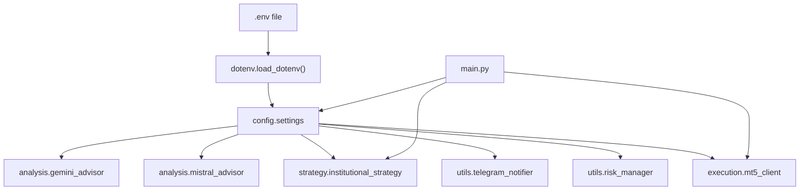
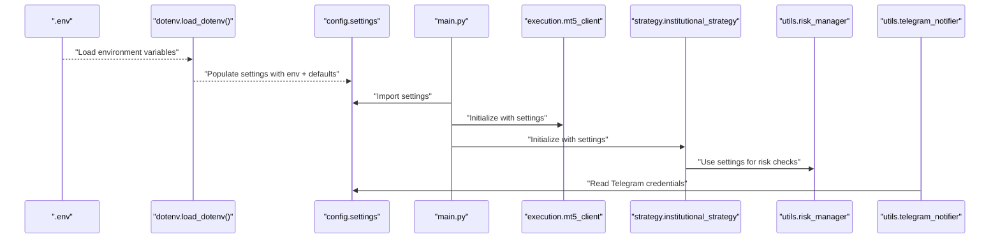
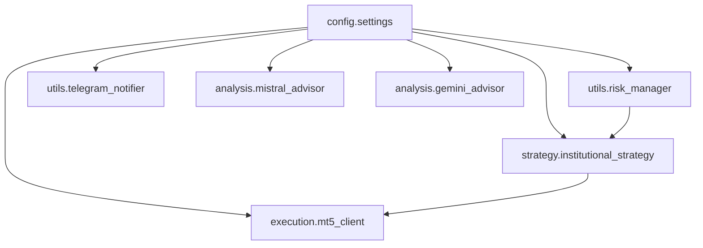

# Configuration Management

<cite>
**Referenced Files in This Document**
- [settings.py](file://config/settings.py)
- [.env](file://.env)
- [mt5_client.py](file://execution/mt5_client.py)
- [risk_manager.py](file://utils/risk_manager.py)
- [telegram_notifier.py](file://utils/telegram_notifier.py)
- [institutional_strategy.py](file://strategy/institutional_strategy.py)
- [mistral_advisor.py](file://analysis/mistral_advisor.py)
- [gemini_advisor.py](file://analysis/gemini_advisor.py)
- [main.py](file://main.py)
</cite>

## Table of Contents
1. [Introduction](#introduction)
2. [Project Structure](#project-structure)
3. [Core Components](#core-components)
4. [Architecture Overview](#architecture-overview)
5. [Detailed Component Analysis](#detailed-component-analysis)
6. [Dependency Analysis](#dependency-analysis)
7. [Performance Considerations](#performance-considerations)
8. [Troubleshooting Guide](#troubleshooting-guide)
9. [Conclusion](#conclusion)

## Introduction
This document provides comprehensive configuration management documentation for the Institutional SureShot Scanner. It explains the centralized settings system, environment variable loading, and how configuration parameters influence system behavior across MT5 connectivity, trading parameters, risk controls, AI integration, and Telegram notifications. It also covers parameter interdependencies, recommended ranges, validation behavior, environment precedence, and best practices for different market conditions.

## Project Structure
The configuration system is organized around a central settings module that loads environment variables from a .env file and exposes them to all subsystems. Key components include:
- Centralized settings loader with defaults
- Environment variable precedence and validation
- MT5 connection parameters
- Trading and risk parameters
- Strategy tuning parameters
- AI advisor configuration
- Telegram notification setup

**Diagram sources**
- [settings.py](file://config/settings.py#L1-L10)
- [mt5_client.py](file://execution/mt5_client.py#L13-L27)
- [risk_manager.py](file://utils/risk_manager.py#L14-L18)
- [institutional_strategy.py](file://strategy/institutional_strategy.py#L49-L86)
- [telegram_notifier.py](file://utils/telegram_notifier.py#L30-L39)
- [mistral_advisor.py](file://analysis/mistral_advisor.py#L12-L25)
- [gemini_advisor.py](file://analysis/gemini_advisor.py#L10-L26)
- [main.py](file://main.py#L19-L58)

**Section sources**
- [settings.py](file://config/settings.py#L1-L10)
- [main.py](file://main.py#L19-L58)

## Core Components
- Centralized settings loader: Loads environment variables from .env with sensible defaults.
- MT5 client: Reads connection credentials and initializes the MetaTrader 5 terminal.
- Risk manager: Applies pre-trade checks, position sizing, trailing stops, and daily limits.
- Strategy orchestrator: Coordinates scanning, research, and execution using configured parameters.
- Telegram notifier: Sends trade alerts and summaries when credentials are provided.
- AI advisors: Integrate Mistral and Gemini APIs for qualitative analysis when keys are present.

**Section sources**
- [settings.py](file://config/settings.py#L7-L201)
- [mt5_client.py](file://execution/mt5_client.py#L12-L27)
- [risk_manager.py](file://utils/risk_manager.py#L14-L549)
- [institutional_strategy.py](file://strategy/institutional_strategy.py#L49-L500)
- [telegram_notifier.py](file://utils/telegram_notifier.py#L30-L174)
- [mistral_advisor.py](file://analysis/mistral_advisor.py#L12-L115)
- [gemini_advisor.py](file://analysis/gemini_advisor.py#L10-L101)

## Architecture Overview
The configuration architecture follows a layered approach:
- Environment layer (.env) provides base values.
- Settings layer (settings.py) defines defaults and loads environment variables.
- Runtime layer (modules) reads settings and applies them to behavior.

**Diagram sources**
- [settings.py](file://config/settings.py#L1-L10)
- [main.py](file://main.py#L19-L58)
- [mt5_client.py](file://execution/mt5_client.py#L13-L27)
- [institutional_strategy.py](file://strategy/institutional_strategy.py#L49-L86)
- [risk_manager.py](file://utils/risk_manager.py#L14-L18)
- [telegram_notifier.py](file://utils/telegram_notifier.py#L30-L39)

## Detailed Component Analysis

### Centralized Settings System
- Purpose: Provide a single source of truth for all configurable parameters.
- Loading: Uses dotenv to load .env variables and falls back to defaults defined in settings.py.
- Scope: Covers MT5 connection, trading parameters, risk management, AI integration, and Telegram.

Key categories and representative parameters:
- MT5 connection: MT5_LOGIN, MT5_PASSWORD, MT5_SERVER, MT5_PATH
- Trading: SYMBOL, TIMEFRAME, LOT_SIZE, DEVIATION, LEVERAGE
- Risk management: RISK_PERCENT, MAX_RISK_PERCENT, COOLDOWN_SECONDS, MAX_DAILY_TRADES, MAX_DAILY_LOSS_USD, MAX_OPEN_POSITIONS, MAX_CONCURRENT_TRADES, MAX_SPREAD_PIPS, MAX_SPREAD_PIPS_CRYPTO, MAX_SPREAD_PIPS_COMMODITY
- Position sizing: USE_KELLY, KELLY_FRACTION, KELLY_MIN_TRADES
- Strategy tuning: MIN_CONFLUENCE_SCORE, SURESHOT_MIN_SCORE, RF_PROB_THRESHOLD, MIN_RISK_REWARD_RATIO, ATR_SL_MULTIPLIER, ATR_TP_MULTIPLIER
- Session filters: SCALP_SESSION_FILTER, SCALP_SESSIONS, SESSION_FILTER, TRADE_SESSIONS
- Trend filters: M5_TREND_FILTER, H1_TREND_FILTER, H4_TREND_FILTER
- Volatility entry: VOLATILITY_ATR_MIN, VOLATILITY_ATR_MIN_CRYPTO, VOLATILITY_ATR_MIN_COMMODITY
- Kill switch and payoff mandate: KILL_SWITCH_LOOKBACK_TRADES, KILL_SWITCH_LOSS_THRESHOLD, AVG_LOSS_RATIO_THRESHOLD, RISK_OVERRIDE_SYMBOLS
- Trailing stops: TRAILING_STOP_ATR_ACTIVATE, TRAILING_STOP_ATR_STEP, TRAILING_STOP_ACTIVATE_PERCENT, TRAILING_STOP_STEP_PERCENT
- Partial profit taking: PARTIAL_CLOSE_FRACTION, BREAKEVEN_RR
- News integration: NEWS_CALENDAR_URL, NEWS_CALENDAR_CACHE_MINUTES, NEWS_PRE_MINUTES, NEWS_POST_MINUTES
- Data/model settings: HISTORY_BARS, TRAIN_TEST_SPLIT, MODEL_PATH, XGB_MODEL_PATH, USE_XGBOOST, USE_LAG_LLAMA, LAG_LLAMA_CHECKPOINT, LAG_LLAMA_REPO_PATH, USE_LSTM, LSTM_MODEL_PATH, LSTM_SCALER_PATH, LSTM_SEQ_LENGTH
- Telegram: TELEGRAM_BOT_TOKEN, TELEGRAM_CHAT_ID

Environment variable precedence:
- Values in .env override defaults in settings.py.
- If a variable is missing in .env, the default from settings.py is used.

Validation behavior:
- Many parameters are parsed to numeric types with defaults; invalid values may cause runtime errors or unexpected behavior.
- Some parameters are boolean toggles using string comparisons (e.g., USE_KELLY).

Recommended ranges and impacts:
- RISK_PERCENT and MAX_RISK_PERCENT: Higher values increase per-trade risk; ensure account size and drawdown limits accommodate.
- COOLDOWN_SECONDS: Controls minimum time between trades per symbol; affects scan frequency.
- MAX_DAILY_TRADES: Daily trade cap; prevents overtrading.
- MAX_DAILY_LOSS_USD: Daily loss threshold; triggers trading halt when exceeded.
- MAX_OPEN_POSITIONS and MAX_CONCURRENT_TRADES: Position caps; prevent excessive exposure.
- MAX_SPREAD_PIPS and asset-class thresholds: Protect against high-spread entries; especially important for forex.
- MIN_CONFLUENCE_SCORE and SURESHOT_MIN_SCORE: Lower values increase aggressiveness; higher values improve reliability.
- RF_PROB_THRESHOLD: Threshold for machine learning probability gating.
- MIN_RISK_REWARD_RATIO: Enforces minimum reward-to-risk; reduces poor setups.
- ATR_SL_MULTIPLIER and ATR_TP_MULTIPLIER: Control volatility-based SL/TP distances; higher TP multipliers increase reward potential.
- USE_KELLY and KELLY_FRACTION: Enables adaptive sizing; quarter-kelly reduces drawdown risk.
- TRAILING_STOP_ATR_ACTIVATE and TRAILING_STOP_ATR_STEP: Dynamic trailing stop activation and step sizes; protect profits as price moves favorably.
- PARTIAL_CLOSE_FRACTION and BREAKEVEN_RR: Partial profit-taking and break-even mechanics; lock in gains and reduce risk.
- SCALP_SESSION_FILTER and SCALP_SESSIONS: Restrict trading to London/NY sessions for tighter spreads and liquidity.
- SESSION_FILTER and TRADE_SESSIONS: General session gating for broader trading windows.
- VOLATILITY_ATR_MIN and asset-class thresholds: Require minimum volatility for entries; avoids ranging markets.
- KILL_SWITCH_LOOKBACK_TRADES and KILL_SWITCH_LOSS_THRESHOLD: Kill switch protects against sustained losing streaks.
- AVG_LOSS_RATIO_THRESHOLD: Payoff mandate; blocks symbols with poor average outcomes.
- RISK_OVERRIDE_SYMBOLS: Allows exceptions for highly liquid instruments.

Best practices by market condition:
- High volatility regimes: Increase ATR multipliers and consider higher MAX_RISK_PERCENT for strong setups; enable trailing stops.
- Low volatility regimes: Raise VOLATILITY_ATR_MIN thresholds; avoid entries; rely on trend filters.
- News-heavy periods: Enable news blackout filters; increase NEWS_PRE_MINUTES and NEWS_POST_MINUTES; temporarily disable trading.
- Thin liquidity: Increase MAX_SPREAD thresholds cautiously; avoid trading during off-hours; reduce MAX_CONCURRENT_TRADES.
- Strong trends: Lower MIN_CONFLUENCE_SCORE and RF_PROB_THRESHOLD; increase ATR_TP_MULTIPLIER; enable trend filters.

**Section sources**
- [settings.py](file://config/settings.py#L7-L201)
- [.env](file://.env#L1-L59)

### MT5 Connection Parameters
- MT5_LOGIN: Account login number.
- MT5_PASSWORD: Account password.
- MT5_SERVER: Broker server name.
- MT5_PATH: Path to MT5 terminal executable.

Behavior:
- The MT5 client connects using these parameters and initializes the terminal.
- If initialization or login fails, the system logs errors and halts.

Interdependencies:
- Incorrect credentials or server mismatch prevent connection.
- PATH must point to a valid MT5 installation.

**Section sources**
- [settings.py](file://config/settings.py#L8-L11)
- [mt5_client.py](file://execution/mt5_client.py#L18-L27)

### Trading Parameters
- SYMBOL: Primary symbol for training when using single-model setups.
- TIMEFRAME: Hardcoded to M1 for scalping.
- LOT_SIZE: Baseline lot size for bulk sizing.
- DEVIATION: Maximum slippage tolerance for orders.
- LEVERAGE: Account leverage used for calculations.

Impact:
- TIMEFRAME determines scanning cadence and model inputs.
- LOT_SIZE serves as a baseline; dynamic sizing may override.
- DEVIATION affects order fills under fast price movements.
- LEVERAGE influences margin and risk calculations.

**Section sources**
- [settings.py](file://config/settings.py#L15-L16)
- [settings.py](file://config/settings.py#L63-L67)
- [mt5_client.py](file://execution/mt5_client.py#L13-L16)

### Risk Management Settings
- RISK_PERCENT and MAX_RISK_PERCENT: Per-trade risk percentage with adaptive scaling for high-confluence setups.
- COOLDOWN_SECONDS: Minimum time between trades per symbol.
- MAX_DAILY_TRADES: Daily trade cap.
- MAX_DAILY_LOSS_USD: Daily loss threshold; trading halts when exceeded.
- MAX_OPEN_POSITIONS: Total simultaneous positions cap.
- MAX_CONCURRENT_TRADES: Hard cap on concurrent scalp trades.
- MAX_SPREAD_PIPS and asset-class thresholds: Spread protection for forex, crypto, and commodities.
- KILL_SWITCH_LOOKBACK_TRADES and KILL_SWITCH_LOSS_THRESHOLD: Kill switch for symbols with recent losses.
- AVG_LOSS_RATIO_THRESHOLD and MANDATE_MIN_RR: Payoff mandate and R:R enforcement.
- RISK_OVERRIDE_SYMBOLS: Exceptions for highly liquid instruments.
- TRAILING_STOP_ATR_ACTIVATE and TRAILING_STOP_ATR_STEP: Dynamic trailing stops.
- PARTIAL_CLOSE_FRACTION and BREAKEVEN_RR: Partial profit-taking and break-even mechanics.
- SCALP_SESSION_FILTER and SCALP_SESSIONS: Restrict trading to London/NY sessions.
- SESSION_FILTER and TRADE_SESSIONS: General session gating.
- VOLATILITY_ATR_MIN and asset-class thresholds: Volatility gating for entries.

Validation and behavior:
- Risk manager enforces daily limits, spread checks, correlation conflicts, and profitability gates.
- Kill switch and payoff mandate dynamically evaluate recent performance.
- Position sizing uses either Kelly Criterion or confluence tiers.

**Section sources**
- [settings.py](file://config/settings.py#L69-L149)
- [risk_manager.py](file://utils/risk_manager.py#L51-L163)
- [risk_manager.py](file://utils/risk_manager.py#L207-L235)
- [risk_manager.py](file://utils/risk_manager.py#L341-L396)

### Strategy Tuning Parameters
- MIN_CONFLUENCE_SCORE: Minimum confluence score for entries.
- SURESHOT_MIN_SCORE: Threshold for turnkey execution.
- RF_PROB_THRESHOLD: Machine learning probability threshold.
- MIN_RISK_REWARD_RATIO: Enforced minimum reward-to-risk.
- ATR_SL_MULTIPLIER and ATR_TP_MULTIPLIER: Volatility-based SL/TP multipliers.
- M5_TREND_FILTER, H1_TREND_FILTER, H4_TREND_FILTER: Multi-timeframe trend filters.
- BOS_ENABLE and related parameters: Basis of Origin strategy settings.

Interdependencies:
- MIN_CONFLUENCE_SCORE and SURESHOT_MIN_SCORE determine entry aggressiveness.
- RF_PROB_THRESHOLD gates ML-driven signals.
- Trend filters reduce counter-trend entries.

**Section sources**
- [settings.py](file://config/settings.py#L77-L81)
- [settings.py](file://config/settings.py#L150-L153)
- [settings.py](file://config/settings.py#L178-L185)
- [institutional_strategy.py](file://strategy/institutional_strategy.py#L299-L310)

### AI Integration Configuration
- Mistral: MISTRAL_API_KEY enables MistralAdvisor for qualitative analysis.
- Gemini: GEMINI_API_KEY enables GeminiAdvisor for qualitative analysis.
- Both advisors parse pipe-formatted responses and return sentiment, confidence, and reason.

Behavior:
- If API keys are absent, advisors return neutral results and log warnings.
- Requests include technical indicators and model-specific configurations.

**Section sources**
- [.env](file://.env#L53-L54)
- [mistral_advisor.py](file://analysis/mistral_advisor.py#L12-L25)
- [gemini_advisor.py](file://analysis/gemini_advisor.py#L10-L26)

### Telegram Notification Setup
- TELEGRAM_BOT_TOKEN and TELEGRAM_CHAT_ID: Required for notifications.
- TelegramNotifier sends formatted alerts for trades, daily summaries, and kill switches.
- Notifications are disabled if tokens are missing.

Behavior:
- Non-blocking asynchronous sends.
- Formatted HTML messages with emojis and structured content.

**Section sources**
- [.env](file://.env#L56-L58)
- [telegram_notifier.py](file://utils/telegram_notifier.py#L30-L39)
- [telegram_notifier.py](file://utils/telegram_notifier.py#L66-L128)

## Dependency Analysis
Configuration dependencies across modules:
- settings.py is imported by MT5 client, risk manager, strategy, telegram notifier, and AI advisors.
- Risk manager depends on settings for daily limits, spread thresholds, trailing stops, and payoff mandates.
- Strategy orchestrator uses settings for session filters, trend filters, and execution gating.
- Telegram notifier reads settings for credentials.
- AI advisors read API keys from environment.

**Diagram sources**
- [settings.py](file://config/settings.py#L1-L201)
- [mt5_client.py](file://execution/mt5_client.py#L9-L16)
- [risk_manager.py](file://utils/risk_manager.py#L9-L17)
- [institutional_strategy.py](file://strategy/institutional_strategy.py#L23-L35)
- [telegram_notifier.py](file://utils/telegram_notifier.py#L24-L35)
- [mistral_advisor.py](file://analysis/mistral_advisor.py#L10-L14)
- [gemini_advisor.py](file://analysis/gemini_advisor.py#L8-L12)

**Section sources**
- [settings.py](file://config/settings.py#L1-L201)
- [mt5_client.py](file://execution/mt5_client.py#L9-L16)
- [risk_manager.py](file://utils/risk_manager.py#L9-L17)
- [institutional_strategy.py](file://strategy/institutional_strategy.py#L23-L35)
- [telegram_notifier.py](file://utils/telegram_notifier.py#L24-L35)
- [mistral_advisor.py](file://analysis/mistral_advisor.py#L10-L14)
- [gemini_advisor.py](file://analysis/gemini_advisor.py#L8-L12)

## Performance Considerations
- Parameter interplay: Tightening spread and volatility filters reduces false positives but may miss opportunities; loosening increases scans but risks more losses.
- Position sizing: Kelly Criterion adapts to historical performance; ensure sufficient trade history before enabling.
- Session filters: Restricting to London/NY improves spread and liquidity but reduces total scans.
- Trend filters: Multi-timeframe filters reduce counter-trend entries but may delay entries in choppy markets.
- Daily limits and kill switches: Prevent drawdown spikes and protect capital during adverse conditions.

[No sources needed since this section provides general guidance]

## Troubleshooting Guide
Common configuration issues and resolutions:
- MT5 connection failures:
  - Verify MT5_LOGIN, MT5_PASSWORD, MT5_SERVER, and MT5_PATH in .env.
  - Ensure MT5 terminal is installed at the specified PATH.
- Telegram notifications not sending:
  - Confirm TELEGRAM_BOT_TOKEN and TELEGRAM_CHAT_ID are set.
  - Use the built-in helper to discover chat ID if needed.
- AI advisor warnings:
  - Ensure MISTRAL_API_KEY or GEMINI_API_KEY is set in .env.
  - Check network connectivity and API quotas.
- Unexpected risk behavior:
  - Review RISK_PERCENT, MAX_RISK_PERCENT, and position caps.
  - Check kill switch and payoff mandate thresholds.
- Spread and session gating:
  - Adjust MAX_SPREAD thresholds for asset classes.
  - Toggle SCALP_SESSION_FILTER and SESSION_FILTER based on market conditions.

**Section sources**
- [mt5_client.py](file://execution/mt5_client.py#L18-L27)
- [telegram_notifier.py](file://utils/telegram_notifier.py#L30-L39)
- [mistral_advisor.py](file://analysis/mistral_advisor.py#L14-L17)
- [gemini_advisor.py](file://analysis/gemini_advisor.py#L12-L15)
- [risk_manager.py](file://utils/risk_manager.py#L107-L163)

## Conclusion
The Institutional SureShot Scanner’s configuration system centralizes control over MT5 connectivity, trading behavior, risk management, AI integration, and notifications. By leveraging environment variables with sensible defaults, the system remains flexible across deployments while maintaining robust safety nets. Proper tuning of parameters ensures adaptability to various market conditions, balancing aggressiveness with risk control.