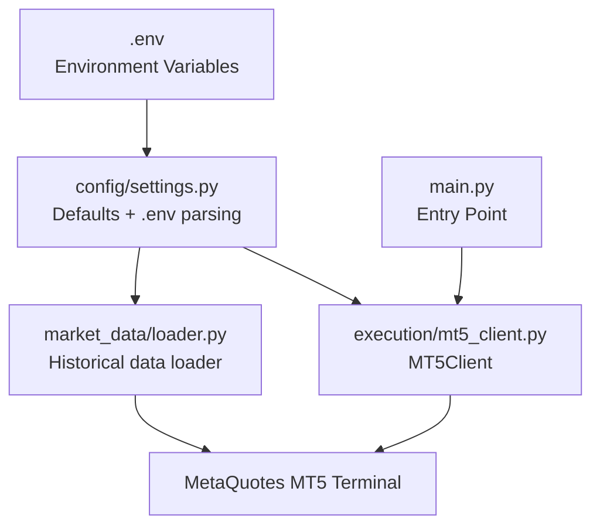
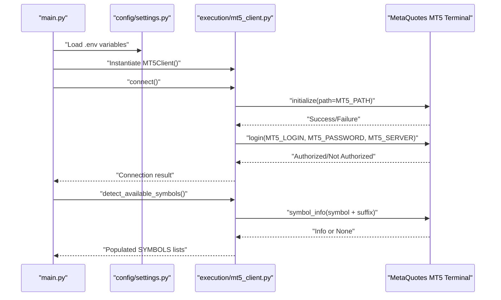
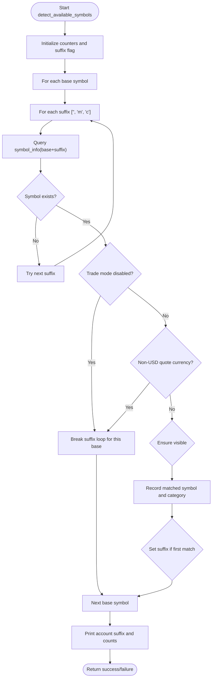
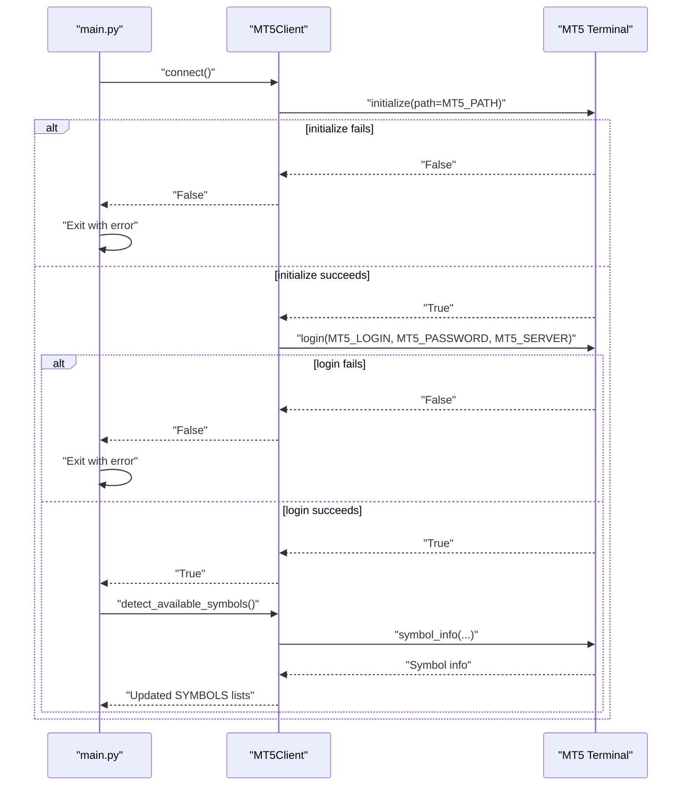
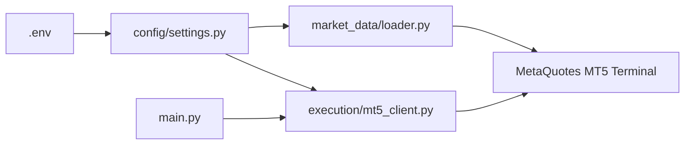

# MT5 Connection Settings

<cite>
**Referenced Files in This Document**
- [execution/mt5_client.py](file://execution/mt5_client.py)
- [config/settings.py](file://config/settings.py)
- [.env](file://.env)
- [main.py](file://main.py)
- [market_data/loader.py](file://market_data/loader.py)
- [README.md](file://README.md)
</cite>

## Table of Contents
1. [Introduction](#introduction)
2. [Project Structure](#project-structure)
3. [Core Components](#core-components)
4. [Architecture Overview](#architecture-overview)
5. [Detailed Component Analysis](#detailed-component-analysis)
6. [Dependency Analysis](#dependency-analysis)
7. [Performance Considerations](#performance-considerations)
8. [Troubleshooting Guide](#troubleshooting-guide)
9. [Conclusion](#conclusion)

## Introduction
This document explains how the Institutional SureShot Scanner integrates with MetaTrader 5 (MT5) using environment-based configuration. It focuses on the four core connection parameters (MT5_LOGIN, MT5_PASSWORD, MT5_SERVER, MT5_PATH), the Exness account auto-detection mechanism for standard/micro/cent suffixes, connection establishment, error handling, and how connection settings relate to symbol detection and trading.

## Project Structure
The MT5 integration spans a small set of focused modules:
- Configuration loading and defaults are centralized in settings.py with environment variable overrides from .env.
- The MT5 client encapsulates connection, symbol detection, and order lifecycle.
- The main entry point orchestrates connection, symbol detection, and runtime behavior.

**Diagram sources**
- [execution/mt5_client.py](file://execution/mt5_client.py#L1-L30)
- [config/settings.py](file://config/settings.py#L1-L20)
- [.env](file://.env#L1-L10)
- [main.py](file://main.py#L19-L35)
- [market_data/loader.py](file://market_data/loader.py#L24-L37)

**Section sources**
- [README.md](file://README.md#L107-L137)
- [config/settings.py](file://config/settings.py#L1-L20)
- [.env](file://.env#L1-L10)

## Core Components
- MT5 connection parameters are defined and loaded from environment variables:
  - MT5_LOGIN: integer account number
  - MT5_PASSWORD: string password
  - MT5_SERVER: string server name
  - MT5_PATH: string path to MT5 terminal executable
- The MT5Client class handles:
  - Initialization of the MT5 terminal with the configured path
  - Login with credentials and server
  - Auto-detection of available symbols on the Exness account, including suffix handling
  - Shutdown and account info retrieval
- The main entry point connects to MT5, auto-detects symbols, and proceeds to run the scanner.

**Section sources**
- [config/settings.py](file://config/settings.py#L7-L11)
- [execution/mt5_client.py](file://execution/mt5_client.py#L12-L27)
- [execution/mt5_client.py](file://execution/mt5_client.py#L29-L101)
- [main.py](file://main.py#L19-L35)

## Architecture Overview
The MT5 integration follows a straightforward flow:
- Load environment variables into settings.
- Initialize MT5 terminal with MT5_PATH.
- Log in with MT5_LOGIN, MT5_PASSWORD, and MT5_SERVER.
- Detect available symbols on the account, accounting for Exness suffixes.
- Proceed with strategy execution and trading.

**Diagram sources**
- [main.py](file://main.py#L19-L35)
- [config/settings.py](file://config/settings.py#L7-L11)
- [execution/mt5_client.py](file://execution/mt5_client.py#L18-L27)
- [execution/mt5_client.py](file://execution/mt5_client.py#L29-L101)

## Detailed Component Analysis

### MT5 Connection Parameters
- MT5_LOGIN: Integer account identifier. Defaults to a placeholder value if not present in .env.
- MT5_PASSWORD: String password. Defaults to a placeholder if not present.
- MT5_SERVER: String server name. Defaults to a realistic Exness server name if not present.
- MT5_PATH: String path to the MT5 terminal executable. Defaults to a typical Windows installation path.

These values are loaded from .env and exposed via config/settings.py, which reads environment variables at import time.

**Section sources**
- [config/settings.py](file://config/settings.py#L7-L11)
- [.env](file://.env#L1-L5)

### Exness Account Auto-Detection and Suffix Handling
The MT5Client performs auto-detection of available symbols on the connected Exness account. It tries three suffixes for each base symbol:
- Raw Spread/Pro: empty suffix
- Standard: suffix "m"
- Standard Cent: suffix "c"

Detection logic:
- Iterates over base symbols and suffixes in order.
- Queries symbol availability and visibility.
- Skips disabled symbols and non-USD-denominated exotic quotes.
- Enables symbols in Market Watch if hidden.
- Records which suffix was detected for the account.
- Populates categorized lists (majors, minors, crypto, commodities) and runtime settings.

**Diagram sources**
- [execution/mt5_client.py](file://execution/mt5_client.py#L29-L101)
- [config/settings.py](file://config/settings.py#L47-L53)

**Section sources**
- [execution/mt5_client.py](file://execution/mt5_client.py#L29-L101)
- [config/settings.py](file://config/settings.py#L47-L53)

### Connection Establishment Procedure
- Initialization: The MT5 terminal is initialized with the configured MT5_PATH.
- Login: The client logs in using MT5_LOGIN, MT5_PASSWORD, and MT5_SERVER.
- Validation: The main entry point checks the connection result and exits early if unsuccessful.
- Symbol Detection: After a successful connection, the client auto-detects available symbols and updates runtime settings.

**Diagram sources**
- [main.py](file://main.py#L19-L35)
- [execution/mt5_client.py](file://execution/mt5_client.py#L18-L27)
- [execution/mt5_client.py](file://execution/mt5_client.py#L29-L101)

**Section sources**
- [main.py](file://main.py#L19-L35)
- [execution/mt5_client.py](file://execution/mt5_client.py#L18-L27)

### Relationship Between Connection Settings and Symbol Detection
- The connection settings (MT5_LOGIN, MT5_PASSWORD, MT5_SERVER, MT5_PATH) determine which account and terminal are accessed.
- The symbol detection routine queries symbols on that specific account and server, applying Exness suffix rules to map base symbols to the account’s actual available instruments.
- The detected symbols populate runtime lists (SYMBOLS, SYMBOLS_FOREX_MAJORS, etc.), which the strategy uses to scan and trade.

**Section sources**
- [execution/mt5_client.py](file://execution/mt5_client.py#L29-L101)
- [config/settings.py](file://config/settings.py#L55-L60)

### Error Handling for Connection Failures
- Initialization failure: The client reports a failure to initialize the terminal and returns False.
- Login failure: The client reports a failure to log in and returns False.
- The main entry point checks the connection result and exits immediately if either step fails.
- Additional modules (e.g., market_data/loader.py) demonstrate the use of mt5.last_error() to capture detailed error codes when initialization or login fails.

**Section sources**
- [execution/mt5_client.py](file://execution/mt5_client.py#L18-L27)
- [main.py](file://main.py#L25-L35)
- [market_data/loader.py](file://market_data/loader.py#L24-L37)

## Dependency Analysis
- The MT5Client depends on config/settings for connection parameters and symbol categories.
- The main entry point depends on MT5Client for connection and symbol detection.
- market_data/loader.py demonstrates an alternate initialization pattern and error reporting using mt5.last_error().

**Diagram sources**
- [config/settings.py](file://config/settings.py#L1-L20)
- [execution/mt5_client.py](file://execution/mt5_client.py#L1-L20)
- [market_data/loader.py](file://market_data/loader.py#L24-L37)
- [main.py](file://main.py#L12-L20)

**Section sources**
- [config/settings.py](file://config/settings.py#L1-L20)
- [execution/mt5_client.py](file://execution/mt5_client.py#L1-L20)
- [market_data/loader.py](file://market_data/loader.py#L24-L37)
- [main.py](file://main.py#L12-L20)

## Performance Considerations
- Connection attempts are lightweight but should be retried judiciously to avoid blocking the main loop.
- Symbol detection iterates over a predefined set of base symbols and suffixes; keep the base symbol list minimal to reduce unnecessary queries.
- Using the MT5 terminal path that matches the installed architecture (64-bit vs 32-bit) ensures optimal performance.

## Troubleshooting Guide

### Common MT5 Connectivity Issues
- Wrong MT5_PATH: Ensure the path points to the correct terminal executable for your OS architecture.
- Incorrect credentials: Verify MT5_LOGIN, MT5_PASSWORD, and MT5_SERVER match your Exness account.
- Terminal not running: The MT5 terminal must be installed and accessible at the configured path.
- Server mismatch: Confirm MT5_SERVER corresponds to the correct Exness server instance.

### How to Verify Connection
- Use the provided scripts to test initialization and login, which show how to capture and display error codes from mt5.last_error().

**Section sources**
- [market_data/loader.py](file://market_data/loader.py#L24-L37)
- [README.md](file://README.md#L176-L184)

### Credential Setup Examples
- Proper credential setup requires:
  - MT5_LOGIN: Your Exness account number (integer).
  - MT5_PASSWORD: Your Exness account password.
  - MT5_SERVER: Your Exness server name (e.g., Exness-MT5Real8).
  - MT5_PATH: Path to the MT5 terminal executable (Windows default path included in .env).

**Section sources**
- [.env](file://.env#L1-L5)
- [config/settings.py](file://config/settings.py#L7-L11)

### Server Selection for Demo vs Real
- Real accounts: Use a server name that matches your Exness real server (e.g., Exness-MT5Real8).
- Demo accounts: Use a demo server name that matches your Exness demo server instance.

**Section sources**
- [.env](file://.env#L3-L4)
- [config/settings.py](file://config/settings.py#L10)

### Path Configuration Across Operating Systems
- Windows: Use the default path to the 64-bit terminal executable.
- Linux/macOS: Use the appropriate terminal path for your platform and ensure the MT5 terminal is installed and accessible.

**Section sources**
- [.env](file://.env#L4-L5)
- [config/settings.py](file://config/settings.py#L10)

### How Connection Settings Impact Symbol Detection
- The connection settings determine which account and server are queried.
- The auto-detection routine tries suffixes "", "m", and "c" to map base symbols to the account’s actual instruments.
- Disabled symbols and non-USD-denominated exotic quotes are filtered out automatically.

**Section sources**
- [execution/mt5_client.py](file://execution/mt5_client.py#L29-L101)
- [config/settings.py](file://config/settings.py#L47-L53)

## Conclusion
The Institutional SureShot Scanner relies on clean separation of concerns for MT5 integration:
- Environment variables define connection parameters.
- The MT5Client manages connection, symbol detection, and account info.
- The main entry point orchestrates startup, symbol detection, and runtime operation.

By correctly configuring MT5_LOGIN, MT5_PASSWORD, MT5_SERVER, and MT5_PATH, and leveraging the Exness suffix-aware symbol detection, the system adapts to different account types and provides a robust foundation for automated trading.