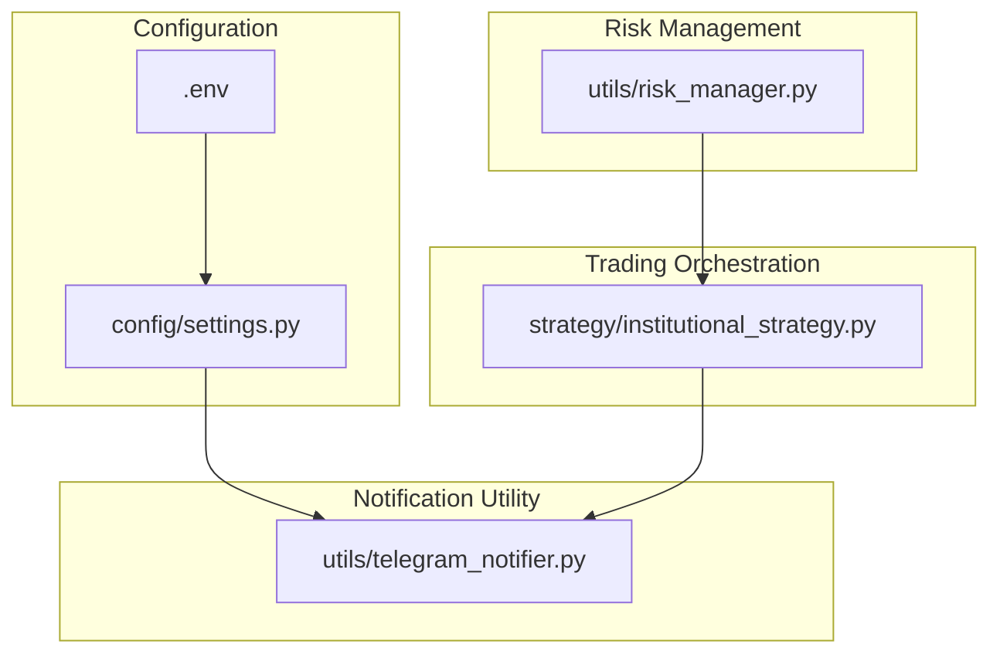
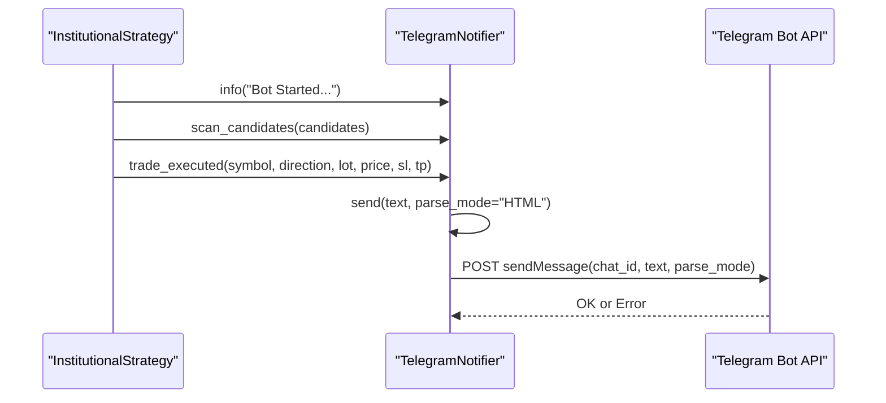
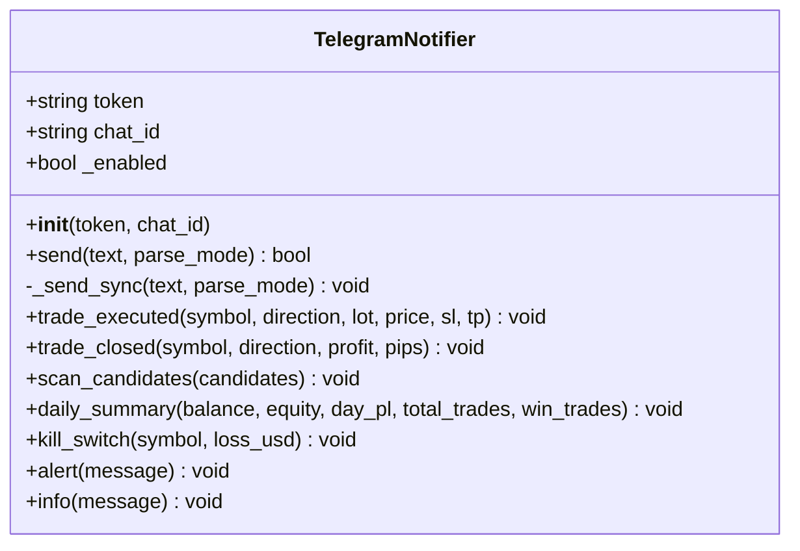
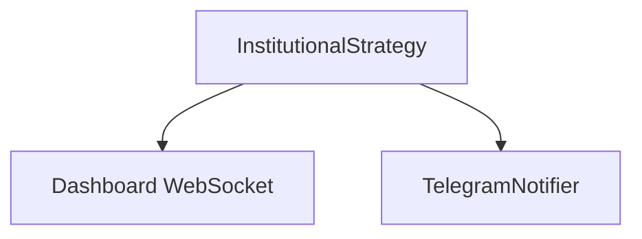
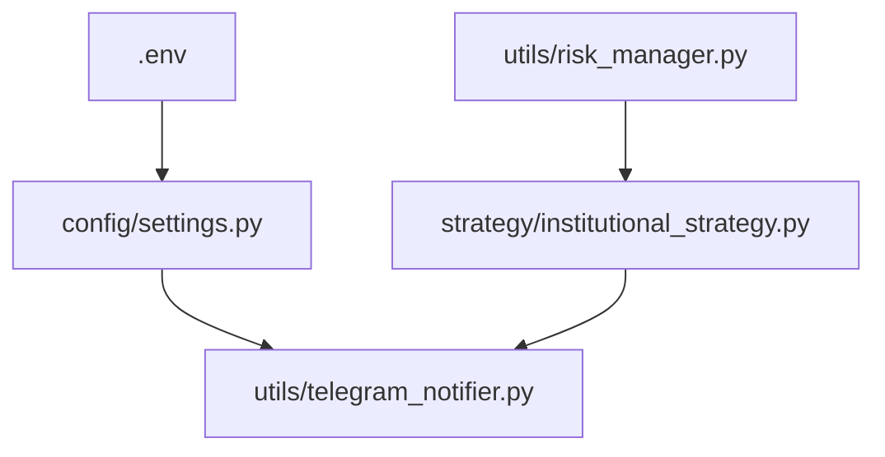

# Notification Configuration

<cite>
**Referenced Files in This Document**
- [telegram_notifier.py](file://utils/telegram_notifier.py)
- [settings.py](file://config/settings.py)
- [.env](file://.env)
- [README.md](file://README.md)
- [institutional_strategy.py](file://strategy/institutional_strategy.py)
- [risk_manager.py](file://utils/risk_manager.py)
</cite>

## Table of Contents
1. [Introduction](#introduction)
2. [Project Structure](#project-structure)
3. [Core Components](#core-components)
4. [Architecture Overview](#architecture-overview)
5. [Detailed Component Analysis](#detailed-component-analysis)
6. [Dependency Analysis](#dependency-analysis)
7. [Performance Considerations](#performance-considerations)
8. [Troubleshooting Guide](#troubleshooting-guide)
9. [Conclusion](#conclusion)
10. [Appendices](#appendices)

## Introduction
This document explains how to configure and operate the Telegram notification system for the Institutional SureShot Scanner. It covers the two required parameters (TELEGRAM_BOT_TOKEN and TELEGRAM_CHAT_ID), the notification architecture, supported alert types, message formatting, and operational procedures. It also describes how notifications integrate with the real-time monitoring dashboard and provides troubleshooting guidance for common Telegram integration issues.

## Project Structure
The Telegram notification system is implemented as a reusable utility module and integrated into the trading orchestration layer. Configuration is centralized in environment variables and loaded at runtime.

**Diagram sources**
- [telegram_notifier.py](file://utils/telegram_notifier.py#L1-L174)
- [settings.py](file://config/settings.py#L198-L201)
- [.env](file://.env#L56-L59)
- [institutional_strategy.py](file://strategy/institutional_strategy.py#L88-L93)
- [risk_manager.py](file://utils/risk_manager.py#L1-L200)

**Section sources**
- [telegram_notifier.py](file://utils/telegram_notifier.py#L1-L174)
- [settings.py](file://config/settings.py#L198-L201)
- [.env](file://.env#L56-L59)

## Core Components
- TelegramNotifier: A non-blocking, thread-based sender that posts formatted messages to a Telegram chat via the Telegram Bot API. It supports multiple alert types and a convenience notify function.
- Configuration: TELEGRAM_BOT_TOKEN and TELEGRAM_CHAT_ID are loaded from environment variables and validated at initialization.
- Integration: The InstitutionalStrategy sends startup, scan, and trade execution notifications. Risk controls can trigger kill switch alerts indirectly through the risk management layer.

Key responsibilities:
- Non-blocking message dispatch
- HTML-formatted messages with emojis and structured fields
- Centralized configuration via environment variables
- Optional singleton pattern for reuse

**Section sources**
- [telegram_notifier.py](file://utils/telegram_notifier.py#L30-L137)
- [settings.py](file://config/settings.py#L198-L201)
- [institutional_strategy.py](file://strategy/institutional_strategy.py#L88-L93)
- [institutional_strategy.py](file://strategy/institutional_strategy.py#L264-L266)
- [institutional_strategy.py](file://strategy/institutional_strategy.py#L399-L400)

## Architecture Overview
The Telegram notification pipeline is event-driven and decoupled from the trading loop to avoid blocking performance.

**Diagram sources**
- [institutional_strategy.py](file://strategy/institutional_strategy.py#L88-L93)
- [institutional_strategy.py](file://strategy/institutional_strategy.py#L264-L266)
- [institutional_strategy.py](file://strategy/institutional_strategy.py#L399-L400)
- [telegram_notifier.py](file://utils/telegram_notifier.py#L41-L63)

## Detailed Component Analysis

### TelegramNotifier Class
The notifier encapsulates:
- Initialization with TELEGRAM_BOT_TOKEN and TELEGRAM_CHAT_ID from configuration
- Non-blocking send via background thread
- Helper methods for common alert types
- Logging of failures for diagnostics

**Diagram sources**
- [telegram_notifier.py](file://utils/telegram_notifier.py#L30-L137)

**Section sources**
- [telegram_notifier.py](file://utils/telegram_notifier.py#L30-L137)

### Configuration and Environment
- TELEGRAM_BOT_TOKEN and TELEGRAM_CHAT_ID are loaded from the environment and exposed as settings.
- The .env file contains example values for quick setup.

Configuration locations:
- Environment variables loaded by settings.py
- Example values in .env

**Section sources**
- [settings.py](file://config/settings.py#L198-L201)
- [.env](file://.env#L56-L59)

### Alert Types and Formatting
Supported alert categories:
- Bot Started: Startup greeting with pair count and session info
- Scan Signals: List of candidate symbols with direction and scores
- Trade Executed: Symbol, direction, lot size, price, SL, TP, and timestamp
- Trade Closed: Symbol, direction, P&L, optional pips
- Daily Summary: Balance, equity, day P&L, trade counts, and win rate
- Kill Switch: Symbol and recent loss threshold exceeded
- Generic Alert/Info: Convenience wrappers for arbitrary messages

Formatting characteristics:
- HTML parse mode with bold, code tags, and line breaks
- Emojis for visual emphasis
- Structured fields for readability

**Section sources**
- [telegram_notifier.py](file://utils/telegram_notifier.py#L66-L137)
- [institutional_strategy.py](file://strategy/institutional_strategy.py#L88-L93)
- [institutional_strategy.py](file://strategy/institutional_strategy.py#L264-L266)
- [institutional_strategy.py](file://strategy/institutional_strategy.py#L399-L400)

### Integration with Real-Time Monitoring
- The InstitutionalStrategy emits events to the dashboard (scan summary, position updates, account info).
- Telegram notifications complement the dashboard by delivering push alerts to a Telegram chat.
- The TelegramNotifier is invoked from strategic points in the scanning and execution loops.

**Diagram sources**
- [institutional_strategy.py](file://strategy/institutional_strategy.py#L185-L236)
- [institutional_strategy.py](file://strategy/institutional_strategy.py#L88-L93)
- [institutional_strategy.py](file://strategy/institutional_strategy.py#L264-L266)
- [institutional_strategy.py](file://strategy/institutional_strategy.py#L399-L400)

**Section sources**
- [institutional_strategy.py](file://strategy/institutional_strategy.py#L185-L236)

## Dependency Analysis
- TelegramNotifier depends on settings for credentials and uses the Telegram Bot API endpoint.
- InstitutionalStrategy integrates TelegramNotifier for operational alerts.
- RiskManager coordinates trading decisions; while it does not directly call TelegramNotifier, it influences when notifications are triggered (e.g., by gating executions).

**Diagram sources**
- [settings.py](file://config/settings.py#L198-L201)
- [.env](file://.env#L56-L59)
- [telegram_notifier.py](file://utils/telegram_notifier.py#L30-L137)
- [institutional_strategy.py](file://strategy/institutional_strategy.py#L88-L93)
- [risk_manager.py](file://utils/risk_manager.py#L1-L200)

**Section sources**
- [settings.py](file://config/settings.py#L198-L201)
- [telegram_notifier.py](file://utils/telegram_notifier.py#L30-L137)
- [institutional_strategy.py](file://strategy/institutional_strategy.py#L88-L93)
- [risk_manager.py](file://utils/risk_manager.py#L1-L200)

## Performance Considerations
- Non-blocking design: Messages are sent asynchronously to avoid stalling the trading loop.
- Minimal overhead: Each send spawns a background thread; ensure message volume is reasonable to prevent thread pool saturation.
- Timeout handling: Requests are bounded by a short timeout to maintain responsiveness.

[No sources needed since this section provides general guidance]

## Troubleshooting Guide
Common issues and resolutions:
- Missing credentials: If TELEGRAM_BOT_TOKEN or TELEGRAM_CHAT_ID is empty, notifications are disabled and a warning is logged.
- Invalid chat ID: Ensure the chat ID corresponds to the intended recipient and matches the bot’s updates.
- No messages received: Confirm the bot was started and a message was sent to it before retrieving the chat ID.
- Network errors: Inspect network connectivity and API response logs; the notifier logs warnings on non-OK responses.
- Message formatting: HTML parse mode requires valid markup; avoid malformed tags to prevent rendering issues.

Verification steps:
- Retrieve chat ID using the built-in helper script and follow the prompts.
- Send a test message via the convenience notify function to validate delivery.

**Section sources**
- [telegram_notifier.py](file://utils/telegram_notifier.py#L33-L39)
- [telegram_notifier.py](file://utils/telegram_notifier.py#L52-L63)
- [telegram_notifier.py](file://utils/telegram_notifier.py#L154-L174)

## Conclusion
The Telegram notification system provides timely, formatted alerts for key trading events. By configuring TELEGRAM_BOT_TOKEN and TELEGRAM_CHAT_ID, integrating the notifier into the trading workflow, and leveraging the dashboard for live monitoring, operators can stay informed of system activity and trade outcomes in real time.

[No sources needed since this section summarizes without analyzing specific files]

## Appendices

### Setup Procedures
- Obtain a Telegram bot token and chat ID:
  - Start the Telegram notifier helper to fetch your chat ID after messaging the bot and sending /start.
- Add credentials to environment:
  - Set TELEGRAM_BOT_TOKEN and TELEGRAM_CHAT_ID in .env.
- Verify configuration:
  - Confirm settings load correctly and the notifier is enabled.

**Section sources**
- [README.md](file://README.md#L72-L83)
- [README.md](file://README.md#L139-L145)
- [.env](file://.env#L56-L59)
- [telegram_notifier.py](file://utils/telegram_notifier.py#L154-L174)

### Notification Scheduling
- The notifier is invoked at strategic points:
  - Startup greeting
  - Signal discovery (scan candidates)
  - Trade execution
- The system does not schedule recurring notifications; alerts are event-driven.

**Section sources**
- [institutional_strategy.py](file://strategy/institutional_strategy.py#L88-L93)
- [institutional_strategy.py](file://strategy/institutional_strategy.py#L264-L266)
- [institutional_strategy.py](file://strategy/institutional_strategy.py#L399-L400)

### Relationship to Real-Time Monitoring Dashboard
- Dashboard receives live events from the InstitutionalStrategy (scan summary, positions, account info).
- Telegram notifications augment the dashboard by sending push alerts to a Telegram chat.
- Both channels share the same operational context; use the dashboard for continuous monitoring and Telegram for immediate alerts.

**Section sources**
- [institutional_strategy.py](file://strategy/institutional_strategy.py#L185-L236)