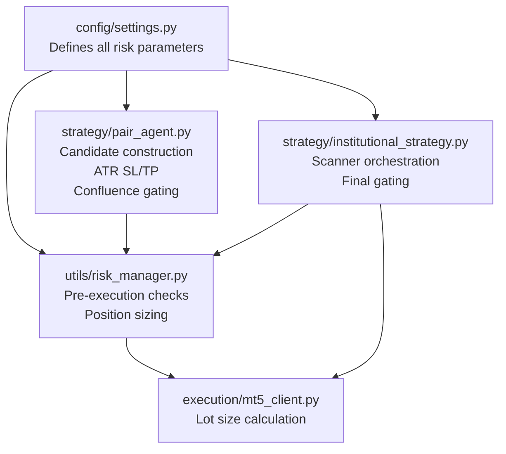
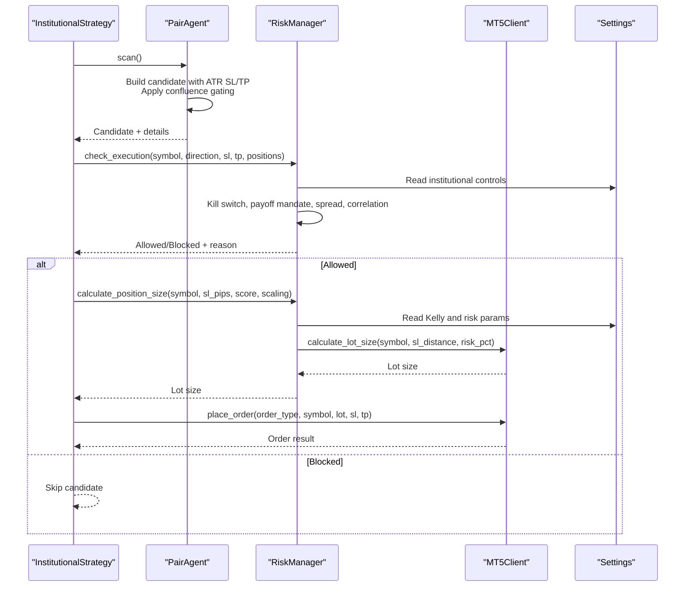
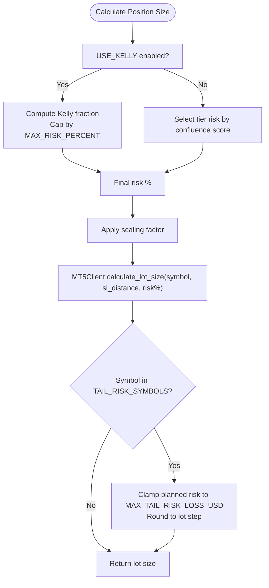
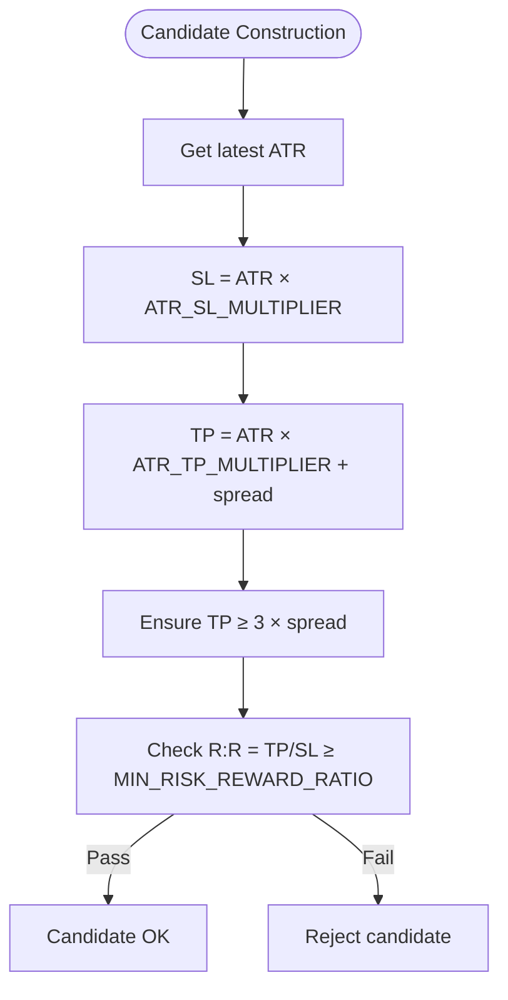
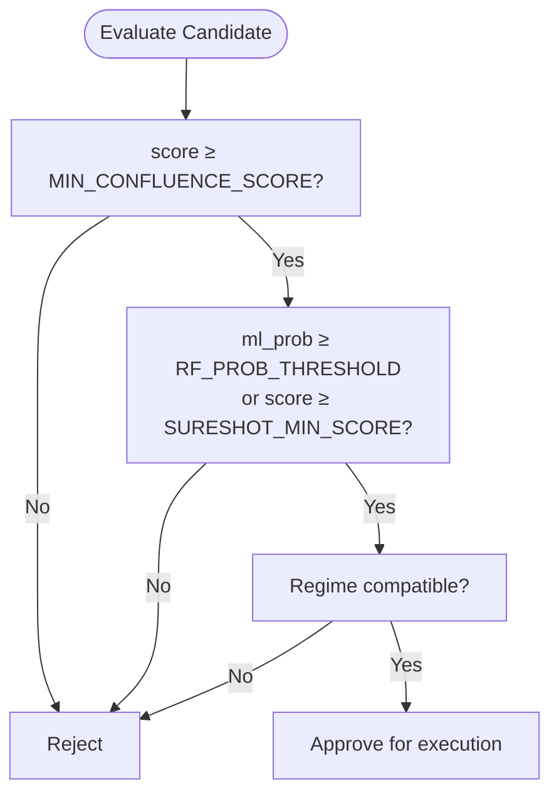
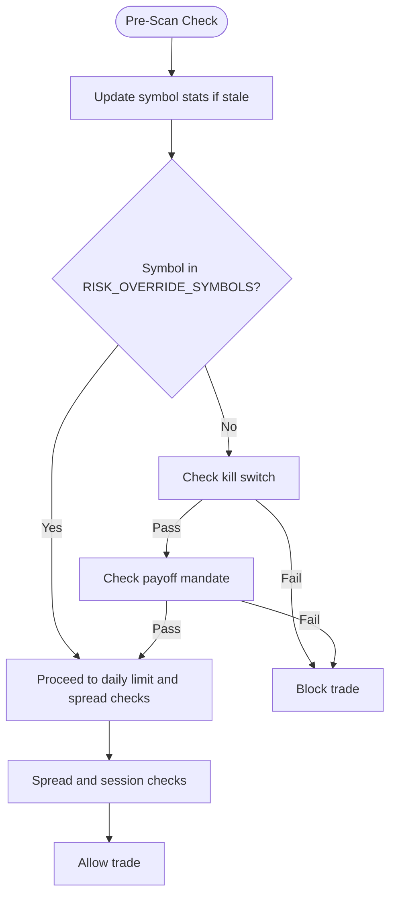
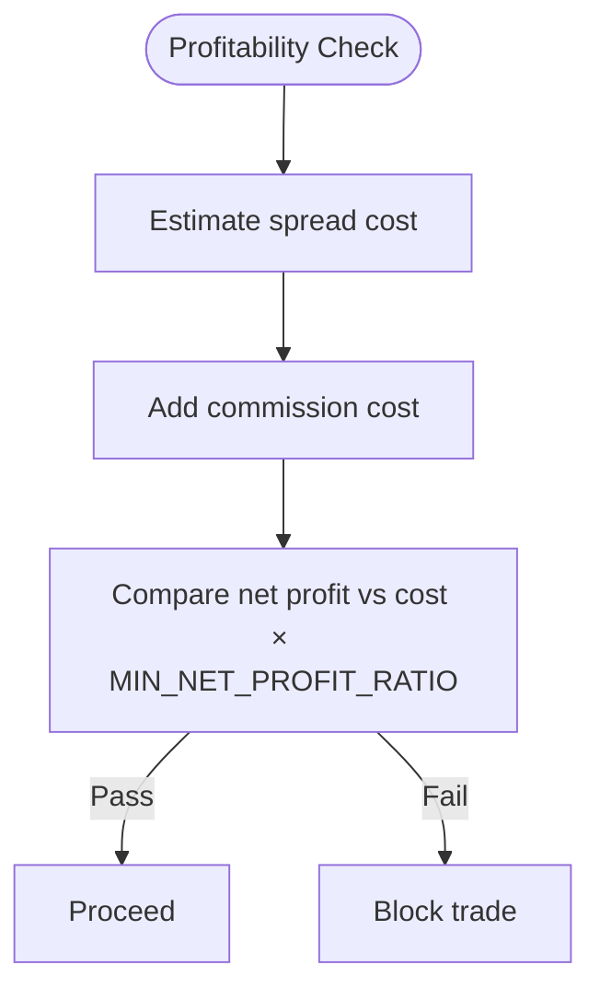
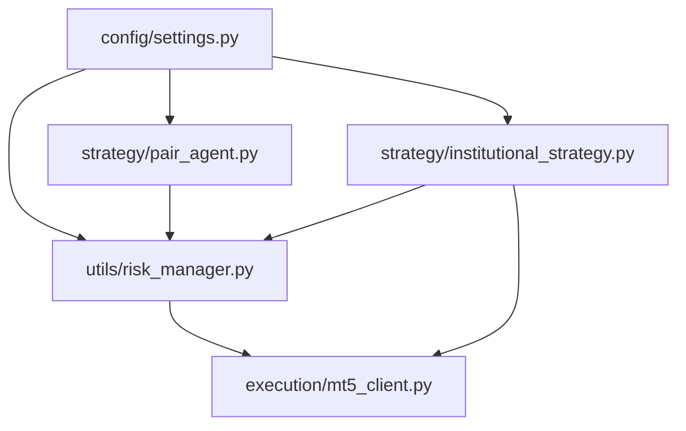

# Risk Management Parameters

<cite>
**Referenced Files in This Document**
- [settings.py](file://config/settings.py)
- [risk_manager.py](file://utils/risk_manager.py)
- [pair_agent.py](file://strategy/pair_agent.py)
- [institutional_strategy.py](file://strategy/institutional_strategy.py)
- [mt5_client.py](file://execution/mt5_client.py)
- [best_params.json](file://models/best_params.json)
- [README.md](file://README.md)
</cite>

## Table of Contents
1. [Introduction](#introduction)
2. [Project Structure](#project-structure)
3. [Core Components](#core-components)
4. [Architecture Overview](#architecture-overview)
5. [Detailed Component Analysis](#detailed-component-analysis)
6. [Dependency Analysis](#dependency-analysis)
7. [Performance Considerations](#performance-considerations)
8. [Troubleshooting Guide](#troubleshooting-guide)
9. [Conclusion](#conclusion)

## Introduction
This document provides comprehensive documentation for the Institutional SureShot Scanner's risk management configuration parameters. It covers position sizing controls, volatility-adjusted stop-loss and take-profit mechanics, confluence gating, institutional risk controls, payoff mandates, cost awareness, and advanced position sizing with the Kelly Criterion. It also includes parameter tuning guidelines and effectiveness considerations.

## Project Structure
The risk management system spans several modules:
- Configuration: centralizes all risk-related parameters
- Risk Manager: performs pre-execution checks and position sizing
- Pair Agent: constructs candidates with ATR-based SL/TP and applies confluence gating
- Institutional Strategy: orchestrates scanning, applies confluence gating, and executes trades
- MT5 Client: calculates lot sizes based on account risk and SL distance

**Diagram sources**
- [settings.py](file://config/settings.py#L69-L140)
- [risk_manager.py](file://utils/risk_manager.py#L14-L549)
- [pair_agent.py](file://strategy/pair_agent.py#L145-L295)
- [institutional_strategy.py](file://strategy/institutional_strategy.py#L99-L336)
- [mt5_client.py](file://execution/mt5_client.py#L146-L195)

**Section sources**
- [settings.py](file://config/settings.py#L69-L140)
- [risk_manager.py](file://utils/risk_manager.py#L14-L549)
- [pair_agent.py](file://strategy/pair_agent.py#L145-L295)
- [institutional_strategy.py](file://strategy/institutional_strategy.py#L99-L336)
- [mt5_client.py](file://execution/mt5_client.py#L146-L195)

## Core Components
This section documents the key risk management parameters and their roles:

- Position sizing and risk allocation
  - RISK_PERCENT: Base risk percentage of account per trade
  - MAX_RISK_PERCENT: Maximum risk for high-confluence setups
  - MAX_OPEN_POSITIONS: Total simultaneous positions cap
  - MAX_CONCURRENT_TRADES: Hard cap on concurrent scalp trades
  - USE_KELLY: Enable Kelly Criterion position sizing
  - KELLY_FRACTION: Fraction of full Kelly to use (quarter-kelly)
  - KELLY_MIN_TRADES: Minimum trades before Kelly activates

- ATR-based SL/TP multipliers
  - ATR_SL_MULTIPLIER: Stop loss distance in ATR multiples
  - ATR_TP_MULTIPLIER: Take profit distance in ATR multiples
  - MIN_RISK_REWARD_RATIO: Minimum acceptable R:R ratio

- Confluence gating
  - MIN_CONFLUENCE_SCORE: Minimum confluence score threshold
  - SURESHOT_MIN_SCORE: Sureshot threshold for automatic execution
  - RF_PROB_THRESHOLD: Minimum machine learning probability threshold

- Institutional risk controls
  - KILL_SWITCH_LOOKBACK_TRADES: Number of recent trades for kill switch
  - KILL_SWITCH_LOSS_THRESHOLD: Net loss threshold to trigger kill switch
  - AVG_LOSS_RATIO_THRESHOLD: Asymmetric payoff mandate threshold
  - MANDATE_MIN_RR: Enforce minimum R:R requirement
  - MAX_DAILY_LOSS_USD: Daily drawdown cap
  - MAX_DAILY_TRADES: Daily trade count cap

- Cost awareness and position sizing controls
  - COMMISSION_PER_LOT: Estimated commission per lot round-turn
  - MIN_NET_PROFIT_RATIO: Minimum net profit multiplier over costs
  - MAX_SPREAD_PIPS, MAX_SPREAD_PIPS_CRYPTO, MAX_SPREAD_PIPS_COMMODITY: Spread caps by asset class

- Tail risk isolation and payoff mandates
  - TAIL_RISK_SYMBOLS: High-volatility symbols subject to isolation
  - MAX_TAIL_RISK_LOSS_USD: Maximum loss per trade for tail-risk symbols

- Partial profit taking and trailing stops
  - PARTIAL_CLOSE_FRACTION: Fraction to partially close upon reaching profit thresholds
  - BREAKEVEN_RR: Move stop to break-even at this R:R level
  - TRAILING_STOP_ATR_ACTIVATE: ATR multiple to activate trailing stop
  - TRAILING_STOP_ATR_STEP: ATR step to trail behind price

**Section sources**
- [settings.py](file://config/settings.py#L69-L140)
- [risk_manager.py](file://utils/risk_manager.py#L341-L396)
- [pair_agent.py](file://strategy/pair_agent.py#L217-L234)
- [institutional_strategy.py](file://strategy/institutional_strategy.py#L351-L356)

## Architecture Overview
The risk management pipeline integrates configuration-driven gating with dynamic position sizing and institutional controls:

**Diagram sources**
- [institutional_strategy.py](file://strategy/institutional_strategy.py#L132-L336)
- [pair_agent.py](file://strategy/pair_agent.py#L145-L295)
- [risk_manager.py](file://utils/risk_manager.py#L237-L295)
- [mt5_client.py](file://execution/mt5_client.py#L146-L195)

## Detailed Component Analysis

### Position Sizing and Risk Allocation
- Base risk and caps
  - RISK_PERCENT defines the baseline risk per trade as a percentage of account equity.
  - MAX_RISK_PERCENT increases risk for high-confluence setups (score ≥ 6).
  - MAX_OPEN_POSITIONS and MAX_CONCURRENT_TRADES cap exposure across symbols and within a timeframe.
- Kelly Criterion integration
  - When enabled, position size adapts dynamically using historical win rate and R:R.
  - KELLY_FRACTION scales full Kelly to a safer quarter-Kelly.
  - KELLY_MIN_TRADES ensures sufficient history before enabling Kelly.
- Tail risk isolation
  - For symbols in TAIL_RISK_SYMBOLS, planned risk is clamped to MAX_TAIL_RISK_LOSS_USD and rounded to lot step.

**Diagram sources**
- [risk_manager.py](file://utils/risk_manager.py#L341-L396)
- [mt5_client.py](file://execution/mt5_client.py#L146-L195)
- [settings.py](file://config/settings.py#L69-L140)

**Section sources**
- [risk_manager.py](file://utils/risk_manager.py#L341-L396)
- [mt5_client.py](file://execution/mt5_client.py#L146-L195)
- [settings.py](file://config/settings.py#L69-L140)

### ATR-Based SL/TP Multipliers
- PairAgent constructs candidates with:
  - SL distance = ATR × ATR_SL_MULTIPLIER
  - TP distance = (ATR × ATR_TP_MULTIPLIER) + spread cost
  - Enforces minimum TP ≥ 3 × spread to ensure profitability
  - Enforces MIN_RISK_REWARD_RATIO to prevent low-reward setups
- InstitutionalStrategy enforces R:R mandate post-candidate selection.

**Diagram sources**
- [pair_agent.py](file://strategy/pair_agent.py#L217-L234)
- [institutional_strategy.py](file://strategy/institutional_strategy.py#L351-L356)
- [settings.py](file://config/settings.py#L73-L81)

**Section sources**
- [pair_agent.py](file://strategy/pair_agent.py#L217-L234)
- [institutional_strategy.py](file://strategy/institutional_strategy.py#L351-L356)
- [settings.py](file://config/settings.py#L73-L81)

### Confluence Gating Parameters
- MIN_CONFLUENCE_SCORE: Minimum score required to qualify as a candidate.
- SURESHOT_MIN_SCORE: Automatic execution threshold for strong setups.
- RF_PROB_THRESHOLD: Minimum machine learning probability for directional alignment.
- InstitutionalStrategy applies these gates during candidate evaluation and execution decisions.

**Diagram sources**
- [pair_agent.py](file://strategy/pair_agent.py#L171-L191)
- [institutional_strategy.py](file://strategy/institutional_strategy.py#L298-L310)
- [settings.py](file://config/settings.py#L77-L81)

**Section sources**
- [pair_agent.py](file://strategy/pair_agent.py#L171-L191)
- [institutional_strategy.py](file://strategy/institutional_strategy.py#L298-L310)
- [settings.py](file://config/settings.py#L77-L81)

### Institutional Risk Controls
- Kill Switch
  - Tracks recent trades over KILL_SWITCH_LOOKBACK_TRADES and disables trading if net loss exceeds KILL_SWITCH_LOSS_THRESHOLD.
  - Requires minimum trade count (≥ 10) to trigger.
- Payoff Mandate
  - Enforces AVG_LOSS_RATIO_THRESHOLD for symbols not in RISK_OVERRIDE_SYMBOLS.
  - Requires minimum trade count (≥ 20) before applying.
- Risk Override
  - Whitelists specific symbols to bypass kill switch and payoff mandate.

**Diagram sources**
- [risk_manager.py](file://utils/risk_manager.py#L51-L163)
- [risk_manager.py](file://utils/risk_manager.py#L207-L235)
- [settings.py](file://config/settings.py#L119-L137)

**Section sources**
- [risk_manager.py](file://utils/risk_manager.py#L51-L163)
- [risk_manager.py](file://utils/risk_manager.py#L207-L235)
- [settings.py](file://config/settings.py#L119-L137)

### Cost Awareness and Position Sizing Controls
- COMMISSION_PER_LOT and MIN_NET_PROFIT_RATIO ensure profitability after estimated costs.
- Spread caps vary by asset class to protect against illiquid instruments.
- MAX_DAILY_LOSS_USD and MAX_DAILY_TRADES cap daily drawdown and frequency.

**Diagram sources**
- [risk_manager.py](file://utils/risk_manager.py#L252-L294)
- [settings.py](file://config/settings.py#L88-L102)

**Section sources**
- [risk_manager.py](file://utils/risk_manager.py#L252-L294)
- [settings.py](file://config/settings.py#L88-L102)

### Parameter Tuning Guidelines
- Position sizing
  - Start with RISK_PERCENT around 1–2% and MAX_RISK_PERCENT at 3–5% for conservative setups.
  - Enable USE_KELLY with KELLY_FRACTION at 0.25 (quarter-Kelly) and KELLY_MIN_TRADES at 20–50.
  - Adjust MAX_OPEN_POSITIONS and MAX_CONCURRENT_TRADES based on symbol universe and liquidity.
- ATR SL/TP
  - Begin with ATR_SL_MULTIPLIER ≈ 1.5 and ATR_TP_MULTIPLIER ≈ 3.0–3.5.
  - Increase ATR_TP_MULTIPLIER cautiously to improve R:R while maintaining realistic targets.
  - Ensure MIN_RISK_REWARD_RATIO prevents overly risky setups.
- Confluence gating
  - Lower MIN_CONFLUENCE_SCORE to increase signal frequency; raise SURESHOT_MIN_SCORE for stricter execution.
  - Tune RF_PROB_THRESHOLD to balance ML confidence and signal quality.
- Institutional controls
  - Calibrate KILL_SWITCH_LOOKBACK_TRADES and KILL_SWITCH_LOSS_THRESHOLD based on historical drawdowns.
  - Set AVG_LOSS_RATIO_THRESHOLD to 2.0 for strict payoff discipline; adjust upward for volatile instruments.
  - Use MAX_DAILY_LOSS_USD and MAX_DAILY_TRADES to align with capital and risk capacity.
- Cost awareness
  - COMMISSION_PER_LOT should reflect actual broker costs; adjust MIN_NET_PROFIT_RATIO to cover costs plus buffer.
  - Spread caps should reflect bid-ask volatility; tighten for illiquid instruments.
- Tail risk isolation
  - Set MAX_TAIL_RISK_LOSS_USD conservatively for highly volatile symbols (e.g., gold, oil, crypto).
  - Monitor performance and adjust per symbol.

**Section sources**
- [settings.py](file://config/settings.py#L69-L140)
- [best_params.json](file://models/best_params.json#L1-L6)

### Risk Control Effectiveness
- Kill Switch and Payoff Mandate reduce exposure to persistently poor-performing symbols by enforcing statistical thresholds.
- ATR-based SL/TP improves risk-adjusted outcomes by adapting to volatility.
- Confluence gating reduces false positives by requiring multiple confirmations.
- Daily caps and cost awareness prevent excessive drawdowns and ensure profitability after costs.
- Tail risk isolation protects capital during extreme market moves for high-volatility instruments.

**Section sources**
- [risk_manager.py](file://utils/risk_manager.py#L207-L235)
- [pair_agent.py](file://strategy/pair_agent.py#L217-L234)
- [institutional_strategy.py](file://strategy/institutional_strategy.py#L351-L356)
- [README.md](file://README.md#L51-L64)

## Dependency Analysis
Risk parameters flow through the system as follows:

**Diagram sources**
- [settings.py](file://config/settings.py#L69-L140)
- [pair_agent.py](file://strategy/pair_agent.py#L145-L295)
- [institutional_strategy.py](file://strategy/institutional_strategy.py#L99-L336)
- [risk_manager.py](file://utils/risk_manager.py#L14-L549)
- [mt5_client.py](file://execution/mt5_client.py#L146-L195)

**Section sources**
- [settings.py](file://config/settings.py#L69-L140)
- [risk_manager.py](file://utils/risk_manager.py#L14-L549)
- [pair_agent.py](file://strategy/pair_agent.py#L145-L295)
- [institutional_strategy.py](file://strategy/institutional_strategy.py#L99-L336)
- [mt5_client.py](file://execution/mt5_client.py#L146-L195)

## Performance Considerations
- Parameter sensitivity: Small changes in ATR multipliers or confluence thresholds can significantly impact signal frequency and risk-adjusted returns.
- Computational overhead: Real-time correlation checks and daily stats updates add latency; tune update intervals to balance responsiveness and performance.
- Broker constraints: Lot rounding and step sizes can affect precise sizing; ensure parameters align with broker limits.

## Troubleshooting Guide
- Frequent rejections under pre-scan checks
  - Verify spread caps and session filters; ensure symbols meet volatility thresholds.
  - Confirm kill switch and payoff mandate are not overly restrictive for your symbol set.
- Low signal frequency
  - Lower MIN_CONFLUENCE_SCORE and RF_PROB_THRESHOLD; increase ATR multipliers cautiously.
- Poor risk-adjusted performance
  - Tighten MIN_RISK_REWARD_RATIO and increase ATR_TP_MULTIPLIER; review KELLY_MIN_TRADES and KELLY_FRACTION.
- Excessive drawdowns
  - Reduce RISK_PERCENT and MAX_RISK_PERCENT; tighten MAX_DAILY_LOSS_USD and MAX_DAILY_TRADES.
  - Reassess tail risk isolation for volatile symbols.

**Section sources**
- [risk_manager.py](file://utils/risk_manager.py#L51-L163)
- [pair_agent.py](file://strategy/pair_agent.py#L217-L234)
- [institutional_strategy.py](file://strategy/institutional_strategy.py#L351-L356)

## Conclusion
The Institutional SureShot Scanner’s risk management framework combines configuration-driven gating, volatility-aware SL/TP, institutional controls, and adaptive position sizing. By tuning parameters thoughtfully—starting with conservative defaults and iteratively adjusting based on performance—you can achieve robust risk-adjusted outcomes across diverse market conditions.