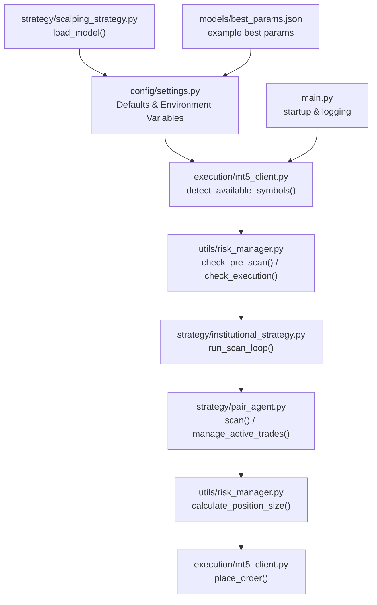
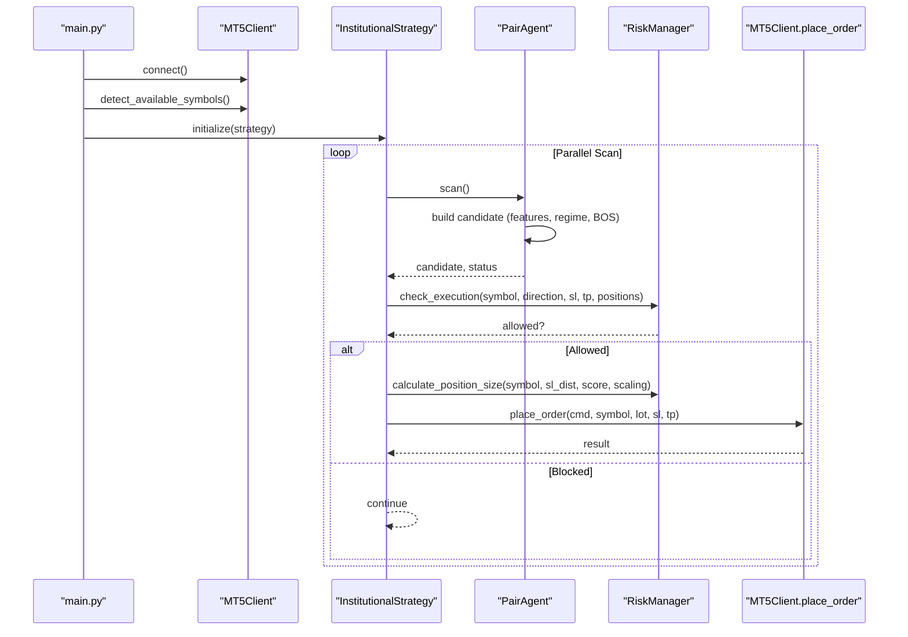
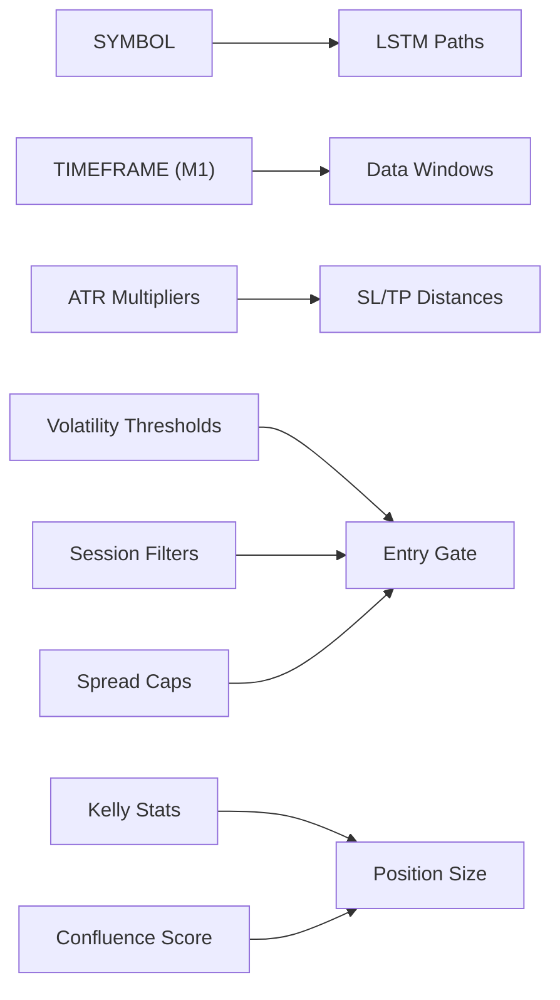

# Trading Parameters

<cite>
**Referenced Files in This Document**
- [settings.py](file://config/settings.py)
- [mt5_client.py](file://execution/mt5_client.py)
- [risk_manager.py](file://utils/risk_manager.py)
- [institutional_strategy.py](file://strategy/institutional_strategy.py)
- [pair_agent.py](file://strategy/pair_agent.py)
- [scalping_strategy.py](file://strategy/scalping_strategy.py)
- [main.py](file://main.py)
- [best_params.json](file://models/best_params.json)
</cite>

## Table of Contents
1. [Introduction](#introduction)
2. [Project Structure](#project-structure)
3. [Core Components](#core-components)
4. [Architecture Overview](#architecture-overview)
5. [Detailed Component Analysis](#detailed-component-analysis)
6. [Dependency Analysis](#dependency-analysis)
7. [Performance Considerations](#performance-considerations)
8. [Troubleshooting Guide](#troubleshooting-guide)
9. [Conclusion](#conclusion)

## Introduction
This document explains the trading parameters configuration for the Institutional SureShot Scanner, focusing on how SYMBOL selection, timeframe settings, lot sizing, deviation tolerance, and leverage are configured and enforced. It also covers the multi-asset universe, symbol auto-detection, account suffix handling, and the relationship between SYMBOL and model loading. Parameter interdependencies, recommended ranges for different market conditions, and the pruning strategy for expectancy improvement are documented alongside practical guidance for optimizing trading performance.

## Project Structure
The trading parameter configuration spans several modules:
- Centralized configuration and defaults: config/settings.py
- Symbol discovery and account suffix handling: execution/mt5_client.py
- Risk controls and position sizing: utils/risk_manager.py
- Strategy orchestration and execution: strategy/institutional_strategy.py and strategy/pair_agent.py
- Scalping-specific logic and model loading: strategy/scalping_strategy.py
- Application entry point: main.py
- Example best-fit parameters: models/best_params.json

**Diagram sources**
- [settings.py](file://config/settings.py#L1-L201)
- [mt5_client.py](file://execution/mt5_client.py#L29-L101)
- [risk_manager.py](file://utils/risk_manager.py#L51-L163)
- [institutional_strategy.py](file://strategy/institutional_strategy.py#L99-L330)
- [pair_agent.py](file://strategy/pair_agent.py#L71-L295)
- [scalping_strategy.py](file://strategy/scalping_strategy.py#L95-L106)
- [main.py](file://main.py#L19-L75)
- [best_params.json](file://models/best_params.json#L1-L6)

**Section sources**
- [settings.py](file://config/settings.py#L1-L201)
- [mt5_client.py](file://execution/mt5_client.py#L29-L101)
- [risk_manager.py](file://utils/risk_manager.py#L51-L163)
- [institutional_strategy.py](file://strategy/institutional_strategy.py#L99-L330)
- [pair_agent.py](file://strategy/pair_agent.py#L71-L295)
- [scalping_strategy.py](file://strategy/scalping_strategy.py#L95-L106)
- [main.py](file://main.py#L19-L75)
- [best_params.json](file://models/best_params.json#L1-L6)

## Core Components
- SYMBOL and multi-asset universe
  - SYMBOL defines the training symbol when a single model is used.
  - The multi-asset universe is pruned for expectancy improvement and includes forex majors/minors, crypto pairs, and commodity instruments.
  - Account suffixes (Standard/Cent) are auto-detected and applied to base symbols.

- Timeframe settings
  - TIMEFRAME is hardcoded to M1 for scalping.

- Lot sizing and deviation
  - LOT_SIZE is the baseline bulk sizing.
  - DEVIATION controls order acceptance tolerance.
  - LEVERAGE is read from the account and influences risk calculations.

- Risk and volatility controls
  - ATR-based SL/TP multipliers, minimum R:R, session filters, and volatility thresholds adapt entries to market conditions.

**Section sources**
- [settings.py](file://config/settings.py#L13-L103)
- [settings.py](file://config/settings.py#L173-L196)
- [mt5_client.py](file://execution/mt5_client.py#L29-L101)
- [risk_manager.py](file://utils/risk_manager.py#L341-L396)

## Architecture Overview
The system initializes MT5, auto-detects available symbols, builds a pruned multi-asset universe, and runs a parallel scanning loop across agents. Each agent constructs candidates using ML and regime filters, then passes them through risk gates before execution. Position sizing integrates Kelly Criterion and confluence tiers, and orders are placed with deviation tolerance and leverage-aware calculations.

**Diagram sources**
- [main.py](file://main.py#L19-L122)
- [mt5_client.py](file://execution/mt5_client.py#L29-L101)
- [institutional_strategy.py](file://strategy/institutional_strategy.py#L99-L330)
- [pair_agent.py](file://strategy/pair_agent.py#L71-L295)
- [risk_manager.py](file://utils/risk_manager.py#L237-L295)

## Detailed Component Analysis

### SYMBOL Selection and Multi-Asset Universe
- Training symbol
  - SYMBOL is used as the training symbol when a single model is selected.
  - When multiple models are used, the system scans across the pruned multi-asset universe.

- Multi-asset universe
  - The universe is pruned for expectancy improvement and focuses on majors/crypto.
  - Base lists include forex majors/minors, crypto pairs, and commodity instruments.
  - At runtime, the system categorizes discovered symbols into groups.

- Pruning strategy
  - Negative expectancy pairs are commented out in the base lists to reduce expectancy drag.
  - The pruned set improves overall performance by avoiding poor-performing instruments.

- Relationship to model loading
  - LSTM model paths are constructed using the current SYMBOL.
  - When SYMBOL changes, LSTM model paths change accordingly.

**Section sources**
- [settings.py](file://config/settings.py#L14-L15)
- [settings.py](file://config/settings.py#L17-L60)
- [settings.py](file://config/settings.py#L194-L196)
- [mt5_client.py](file://execution/mt5_client.py#L29-L101)

### Symbol Auto-Detection and Account Suffix Handling
- Auto-detection flow
  - The system iterates over base symbols and tries suffixes '', 'm', 'c'.
  - It validates trade mode, visibility, and quote currency constraints.
  - Discovered symbols are categorized and stored in settings.

- Account suffix handling
  - The detected suffix is recorded and used to populate the final symbol list.
  - Risk controls and session filters adapt to the discovered suffix.

- Impact on execution
  - Orders are placed on the actual discovered symbol (e.g., EURUSDm vs EURUSDc).
  - Position sizing and risk checks operate on the discovered symbol.

**Section sources**
- [mt5_client.py](file://execution/mt5_client.py#L29-L101)
- [risk_manager.py](file://utils/risk_manager.py#L147-L161)

### Timeframe Settings (Hardcoded M1 for Scalping)
- TIMEFRAME is hardcoded to "M1".
- The scanner operates exclusively on M1 bars for scalping.
- Multi-timeframe filters (M5/H1/H4) are applied conditionally in agents.

**Section sources**
- [settings.py](file://config/settings.py#L63-L64)
- [pair_agent.py](file://strategy/pair_agent.py#L124-L137)

### LOT_SIZE, DEVIATION, and LEVERAGE
- LOT_SIZE
  - Baseline lot size used in sizing logic.
  - Dynamic sizing considers Kelly Criterion and confluence tiers.

- DEVIATION
  - Controls order acceptance tolerance when sending orders.
  - Used in order placement requests.

- LEVERAGE
  - Read from the account and influences risk calculations.
  - Position sizing accounts for leverage indirectly via account risk.

**Section sources**
- [settings.py](file://config/settings.py#L65-L67)
- [mt5_client.py](file://execution/mt5_client.py#L14-L16)
- [mt5_client.py](file://execution/mt5_client.py#L216-L289)
- [risk_manager.py](file://utils/risk_manager.py#L341-L396)

### Risk Controls and Volatility Filters
- ATR-based SL/TP
  - SL and TP distances are computed using ATR multipliers.
  - Minimum TP is enforced to exceed 3x spread to ensure profitability.

- Session and volatility gating
  - Session filter restricts trading to London/NY opens for scalping.
  - Volatility thresholds vary by asset class (forex, crypto, commodities).

- R:R mandate and payoff checks
  - Asymmetric payoff mandates ensure minimum R:R ratios.
  - Kill switch and payoff mandate protect against consistently losing symbols.

**Section sources**
- [settings.py](file://config/settings.py#L74-L75)
- [settings.py](file://config/settings.py#L105-L108)
- [settings.py](file://config/settings.py#L112-L116)
- [pair_agent.py](file://strategy/pair_agent.py#L221-L233)
- [risk_manager.py](file://utils/risk_manager.py#L147-L161)
- [risk_manager.py](file://utils/risk_manager.py#L207-L235)

### Position Sizing and Model Loading
- Position sizing
  - Kelly Criterion is applied when sufficient statistics are available.
  - Otherwise, confluence tiers determine risk percentage.
  - Tail-risk symbols receive additional clamp to protect capital.

- Model loading
  - The RF/XGBoost model path is independent of SYMBOL.
  - LSTM model paths are constructed using SYMBOL, so changing SYMBOL changes the model loaded.

**Section sources**
- [risk_manager.py](file://utils/risk_manager.py#L341-L396)
- [settings.py](file://config/settings.py#L174-L176)
- [settings.py](file://config/settings.py#L194-L196)
- [scalping_strategy.py](file://strategy/scalping_strategy.py#L95-L106)

### Parameter Interdependencies and Recommended Ranges
- Interdependencies
  - TIMEFRAME drives data availability and indicator windows.
  - ATR multipliers define SL/TP distances; volatility thresholds gate entries.
  - Session filters and spread caps prevent trading in unfavorable conditions.
  - Position sizing depends on risk percent, confluence score, and Kelly stats.

- Recommended ranges by market conditions
  - Volatile regimes: increase ATR_TP_MULTIPLIER and reduce MIN_CONFLUENCE_SCORE cautiously.
  - Low volatility: raise VOLATILITY_ATR_MIN thresholds to avoid dead zones.
  - High spread environments: tighten MAX_SPREAD_PIPS and enable session filters.
  - Tail-risk assets: apply tail-risk clamp and reduce position size.

- Example best-fit parameters
  - The example best_params.json shows typical settings for scalping performance.

**Section sources**
- [settings.py](file://config/settings.py#L74-L81)
- [settings.py](file://config/settings.py#L105-L108)
- [settings.py](file://config/settings.py#L112-L116)
- [best_params.json](file://models/best_params.json#L1-L6)

### Symbol Prioritization and Expectancy Improvement
- Pruning strategy
  - Negative expectancy pairs are excluded from the base lists to improve expectancy.
  - Focus on majors and crypto reduces noise and improves signal quality.

- Prioritization logic
  - Candidates are sorted by score and ML probability.
  - Agents with higher scores and stronger ML probabilities are prioritized.

**Section sources**
- [settings.py](file://config/settings.py#L21-L23)
- [institutional_strategy.py](file://strategy/institutional_strategy.py#L239-L240)

## Dependency Analysis
Key dependencies among trading parameters:
- SYMBOL affects LSTM model paths and agent initialization.
- TIMEFRAME determines data windows and indicator stability.
- ATR multipliers and volatility thresholds gate entries and define SL/TP.
- Session filters and spread caps constrain when and where entries occur.
- Position sizing integrates Kelly stats and confluence tiers.

**Diagram sources**
- [settings.py](file://config/settings.py#L14-L15)
- [settings.py](file://config/settings.py#L63-L64)
- [settings.py](file://config/settings.py#L74-L75)
- [settings.py](file://config/settings.py#L105-L108)
- [settings.py](file://config/settings.py#L112-L116)
- [risk_manager.py](file://utils/risk_manager.py#L341-L396)

**Section sources**
- [settings.py](file://config/settings.py#L14-L15)
- [settings.py](file://config/settings.py#L63-L64)
- [settings.py](file://config/settings.py#L74-L75)
- [settings.py](file://config/settings.py#L105-L108)
- [settings.py](file://config/settings.py#L112-L116)
- [risk_manager.py](file://utils/risk_manager.py#L341-L396)

## Performance Considerations
- Prefer M1 for scalping to align with the hardcoded timeframe and ensure responsive entries.
- Tighten spread caps and enable session filters to avoid illiquid periods.
- Adjust ATR multipliers to match volatility regimes; avoid overly tight SL/TP in low-vol environments.
- Use confluence tiers and Kelly Criterion to dynamically size positions based on performance.
- Monitor kill switch and payoff mandate to protect against persistently losing symbols.

[No sources needed since this section provides general guidance]

## Troubleshooting Guide
- No symbols detected
  - Verify account suffixes and ensure symbols are visible in MarketWatch.
  - Check blocked quote currencies and trade modes.

- Orders rejected due to deviation
  - Increase DEVIATION if slippage is high; ensure symbol visibility.

- Excessive spread costs
  - Confirm session filters and spread caps are active.
  - Avoid trading outside London/NY opens for scalping.

- Position sizing too small/large
  - Adjust RISK_PERCENT and MAX_RISK_PERCENT; review Kelly stats and confluence tiers.

- Model mismatch
  - Ensure SYMBOL matches the intended model; LSTM paths depend on SYMBOL.

**Section sources**
- [mt5_client.py](file://execution/mt5_client.py#L29-L101)
- [mt5_client.py](file://execution/mt5_client.py#L216-L289)
- [risk_manager.py](file://utils/risk_manager.py#L112-L161)
- [risk_manager.py](file://utils/risk_manager.py#L341-L396)
- [settings.py](file://config/settings.py#L194-L196)

## Conclusion
The Institutional SureShot Scanner’s trading parameters are designed for adaptive, expectancy-driven scalping on M1. SYMBOL selection and auto-detection ensure the system trades only available instruments, while pruned universes and session/spread filters improve performance. ATR-based SL/TP, volatility thresholds, and dynamic position sizing integrate Kelly Criterion and confluence tiers to optimize risk-reward. Tuning ATR multipliers, session filters, and spread caps according to market conditions yields robust results across diverse environments.