# Volatility and Session Controls

<cite>
**Referenced Files in This Document**
- [settings.py](file://config/settings.py)
- [risk_manager.py](file://utils/risk_manager.py)
- [pair_agent.py](file://strategy/pair_agent.py)
- [quant_agent.py](file://analysis/quant_agent.py)
- [institutional_strategy.py](file://strategy/institutional_strategy.py)
</cite>

## Table of Contents
1. [Introduction](#introduction)
2. [Project Structure](#project-structure)
3. [Core Components](#core-components)
4. [Architecture Overview](#architecture-overview)
5. [Detailed Component Analysis](#detailed-component-analysis)
6. [Dependency Analysis](#dependency-analysis)
7. [Performance Considerations](#performance-considerations)
8. [Troubleshooting Guide](#troubleshooting-guide)
9. [Conclusion](#conclusion)

## Introduction
This document explains the volatility adaptation and session filtering controls used by the Institutional SureShot Scanner. It focuses on:
- Volatility-adaptive entry thresholds for different asset classes (forex, crypto, commodities)
- Spread gating parameters
- Multi-timeframe trend filters
- Trade session management and London/NY open hour restrictions
- Parameter recommendations and tuning strategies for various market conditions

## Project Structure
The volatility and session controls are configured centrally and enforced across scanning and risk management layers:
- Central configuration defines thresholds and session windows
- Risk manager enforces spread, session, and other pre-execution gates
- Pair agent applies volatility-adaptive entry and constructs trade setups
- Quant agent computes multi-timeframe trends and confluence scores
- Institutional strategy coordinates scanning and enforces global session/session-filter logic

**Diagram sources**
- [settings.py](file://config/settings.py#L100-L167)
- [risk_manager.py](file://utils/risk_manager.py#L112-L163)
- [pair_agent.py](file://strategy/pair_agent.py#L206-L234)
- [quant_agent.py](file://analysis/quant_agent.py#L231-L293)
- [institutional_strategy.py](file://strategy/institutional_strategy.py#L455-L460)

**Section sources**
- [settings.py](file://config/settings.py#L100-L167)
- [risk_manager.py](file://utils/risk_manager.py#L112-L163)
- [pair_agent.py](file://strategy/pair_agent.py#L206-L234)
- [quant_agent.py](file://analysis/quant_agent.py#L231-L293)
- [institutional_strategy.py](file://strategy/institutional_strategy.py#L455-L460)

## Core Components
- Volatility-Adaptive Entry
  - Uses Average True Range (ATR) to gate entries and dynamically size stops/profits
  - Asset-class-specific minimum ATR thresholds prevent trading in low-volatility environments
- Spread Gating
  - Dynamic spread checks against per-asset-class thresholds
  - Enforced both pre-scan and during execution risk checks
- Multi-Timeframe Trend Filters
  - Optional alignment with M5/H1/H4 trends to reduce counter-trend entries
- Trade Session Management
  - Two-layer session control:
    - Strict scalp session filter (London Open and NY Open only)
    - General trade session awareness (London, New York, overlap windows)

**Section sources**
- [settings.py](file://config/settings.py#L100-L167)
- [risk_manager.py](file://utils/risk_manager.py#L112-L163)
- [pair_agent.py](file://strategy/pair_agent.py#L206-L234)
- [quant_agent.py](file://analysis/quant_agent.py#L231-L293)

## Architecture Overview
The volatility and session controls are orchestrated as follows:
- Configuration defines defaults and environment overrides
- Risk manager performs fast pre-scan checks (spread, session, news, kill switch)
- Pair agent validates volatility and constructs trade setups with spread-adjusted targets
- Quant agent computes trend filters and confluence scores
- Institutional strategy coordinates scanning and enforces global session/session-filter logic

**Diagram sources**
- [institutional_strategy.py](file://strategy/institutional_strategy.py#L455-L460)
- [risk_manager.py](file://utils/risk_manager.py#L112-L163)
- [pair_agent.py](file://strategy/pair_agent.py#L206-L234)
- [quant_agent.py](file://analysis/quant_agent.py#L231-L293)

## Detailed Component Analysis

### Volatility-Adaptive Entry Controls
- Purpose: Avoid trading in low-volatility (dead/ranging) markets by requiring a minimum ATR threshold per asset class
- Configuration
  - Forex minimum ATR threshold
  - Crypto minimum ATR threshold
  - Commodities minimum ATR threshold
- Enforcement
  - Pair agent reads the latest ATR from analysis features and compares against the appropriate asset-class threshold
  - If ATR is below threshold, entry is blocked with a descriptive reason

**Diagram sources**
- [pair_agent.py](file://strategy/pair_agent.py#L206-L215)
- [settings.py](file://config/settings.py#L104-L108)

**Section sources**
- [pair_agent.py](file://strategy/pair_agent.py#L206-L215)
- [settings.py](file://config/settings.py#L104-L108)

### Spread Gating Parameters
- Purpose: Prevent trading when spreads are too wide for the chosen asset class
- Configuration
  - Maximum spread thresholds for forex, crypto, and commodities
- Enforcement
  - Risk manager calculates spread in pips using point sizes and compares against the appropriate threshold
  - If spread exceeds threshold, entry is blocked with a descriptive reason

```mermaid
flowchart TD
Start(["Spread Check"]) --> Tick["Get symbol tick"]
Tick --> Info["Get symbol info (point)"]
Info --> Calc["Compute spread in points and convert to pips"]
Calc --> Classify["Classify Symbol (Forex/Crypto/Commodity)"]
Classify --> FX{"Forex?"}
Classify --> Crypto{"Crypto?"}
Classify --> Commo{"Commodities?"}
FX --> |Yes| ThreshFX["Use MAX_SPREAD_PIPS"]
Crypto --> |Yes| ThreshCrypto["Use MAX_SPREAD_PIPS_CRYPTO"]
Commo --> |Yes| ThreshComm["Use MAX_SPREAD_PIPS_COMMODITY"]
ThreshFX --> Compare{"Spread (pips) > Threshold?"}
ThreshCrypto --> Compare
ThreshComm --> Compare
Compare --> |Yes| BlockHighSpread["Block: High Spread"]
Compare --> |No| Proceed["Proceed"]
BlockHighSpread --> End(["Exit"])
Proceed --> End
```

**Diagram sources**
- [risk_manager.py](file://utils/risk_manager.py#L119-L138)
- [settings.py](file://config/settings.py#L100-L102)

**Section sources**
- [risk_manager.py](file://utils/risk_manager.py#L119-L138)
- [settings.py](file://config/settings.py#L100-L102)

### Multi-Timeframe Trend Filter System
- Purpose: Reduce counter-trend entries by aligning the trade direction with higher timeframe trends
- Configuration
  - M5 trend filter
  - H1 trend filter
  - H4 trend filter
- Enforcement
  - Quant agent computes trend signals per timeframe and incorporates them into a confluence score
  - Pair agent conditionally fetches additional timeframes when filters are enabled

**Diagram sources**
- [quant_agent.py](file://analysis/quant_agent.py#L231-L293)
- [pair_agent.py](file://strategy/pair_agent.py#L124-L137)
- [settings.py](file://config/settings.py#L150-L153)

**Section sources**
- [quant_agent.py](file://analysis/quant_agent.py#L231-L293)
- [pair_agent.py](file://strategy/pair_agent.py#L124-L137)
- [settings.py](file://config/settings.py#L150-L153)

### Trade Session Management and London/NY Open Hour Restrictions
- Strict Scalp Session Filter
  - Purpose: Limit scalping to London Open and New York Open hours for tighter spreads and higher liquidity
  - Configuration
    - Boolean enable flag
    - Session windows (start/end hours in UTC)
  - Enforcement
    - Risk manager checks current UTC hour against configured windows (exempt for crypto)
- General Trade Session Awareness
  - Purpose: Provide broader session context for logging and diagnostics
  - Configuration
    - Named windows: London, New York, Overlap
    - Boolean enable flag
  - Enforcement
    - Institutional strategy determines current session and enforces loop-level session gating

**Diagram sources**
- [risk_manager.py](file://utils/risk_manager.py#L145-L161)
- [settings.py](file://config/settings.py#L110-L116)
- [institutional_strategy.py](file://strategy/institutional_strategy.py#L455-L460)

**Section sources**
- [risk_manager.py](file://utils/risk_manager.py#L145-L161)
- [settings.py](file://config/settings.py#L110-L116)
- [institutional_strategy.py](file://strategy/institutional_strategy.py#L455-L460)

## Dependency Analysis
- Configuration dependencies
  - Risk manager depends on spread thresholds and session flags
  - Pair agent depends on volatility thresholds and trend filter flags
  - Quant agent depends on trend filter flags
  - Institutional strategy depends on session windows and session filter flags
- Coupling and cohesion
  - Centralized configuration improves cohesion and reduces duplication
  - Risk manager encapsulates pre-execution checks, promoting separation of concerns
  - Trend filters are opt-in and only add overhead when enabled

**Diagram sources**
- [settings.py](file://config/settings.py#L100-L167)
- [risk_manager.py](file://utils/risk_manager.py#L112-L163)
- [pair_agent.py](file://strategy/pair_agent.py#L206-L234)
- [quant_agent.py](file://analysis/quant_agent.py#L231-L293)
- [institutional_strategy.py](file://strategy/institutional_strategy.py#L455-L460)

**Section sources**
- [settings.py](file://config/settings.py#L100-L167)
- [risk_manager.py](file://utils/risk_manager.py#L112-L163)
- [pair_agent.py](file://strategy/pair_agent.py#L206-L234)
- [quant_agent.py](file://analysis/quant_agent.py#L231-L293)
- [institutional_strategy.py](file://strategy/institutional_strategy.py#L455-L460)

## Performance Considerations
- Spread and session checks are lightweight and executed early to avoid unnecessary computation
- Trend filters add minimal overhead when disabled; enabling them increases data fetch costs
- Volatility checks rely on cached ATR values to minimize indicator recomputation
- Execution risk checks estimate profitability to avoid blocking on transient failures

[No sources needed since this section provides general guidance]

## Troubleshooting Guide
- “Low Volatility” blocks
  - Cause: ATR below configured minimum for the asset class
  - Resolution: Wait for higher volatility or adjust thresholds
- “High Spread” blocks
  - Cause: Spread exceeds asset-class threshold
  - Resolution: Trade during tighter spread periods or adjust thresholds
- “Off-Session” blocks
  - Cause: Current UTC hour outside configured scalp windows
  - Resolution: Enable session filter only when trading during London/NY opens
- Trend filter conflicts
  - Cause: Direction misalignment with higher timeframe trends
  - Resolution: Disable filters temporarily or tune confluence scoring

**Section sources**
- [pair_agent.py](file://strategy/pair_agent.py#L214-L215)
- [risk_manager.py](file://utils/risk_manager.py#L136-L138)
- [risk_manager.py](file://utils/risk_manager.py#L156-L161)
- [quant_agent.py](file://analysis/quant_agent.py#L237-L255)

## Parameter Recommendations and Tuning Strategies
- Volatility thresholds
  - Forex: Start with the default minimum ATR; increase for choppy markets, decrease for trending environments
  - Crypto: Use the crypto-specific threshold; adjust based on funding rate and volatility clustering
  - Commodities: Use the commodity-specific threshold; consider seasonal and contango effects
- Spread thresholds
  - Forex: Conservative defaults suitable for major pairs; increase for exotic pairs or illiquid sessions
  - Crypto: Higher thresholds reflect wider spreads and funding costs
  - Commodities: Moderate thresholds; consider storage and convenience yield impacts
- Trend filters
  - Enable M5 filter for scalping to reduce counter-trend entries
  - Enable H1/H4 filters for swing-style setups; disable for ranging markets
- Session windows
  - Use strict scalp session filter for tight spreads and high liquidity
  - Consider broader trade session windows for logging and diagnostics
- Session overlap considerations
  - London/NY overlap can offer strong liquidity; monitor for news events that disrupt liquidity
- Tuning strategies
  - Backtest parameter combinations across regimes (trending, ranging, volatile)
  - Monitor drawdown and win rate to validate threshold effectiveness
  - Adjust thresholds seasonally for asset classes with predictable volatility shifts

[No sources needed since this section provides general guidance]

## Conclusion
The Institutional SureShot Scanner’s volatility and session controls are designed to reduce false entries and improve expectancy by:
- Filtering low-volatility environments using asset-class-specific ATR thresholds
- Preventing trades during high-spread periods with dynamic thresholds
- Aligning entries with higher timeframe trends
- Restricting scalping to optimal session windows

These controls are configurable and can be tuned to match market conditions and trading styles.