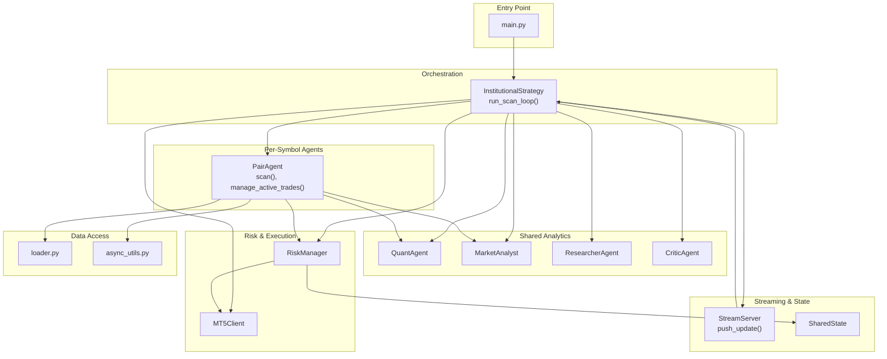
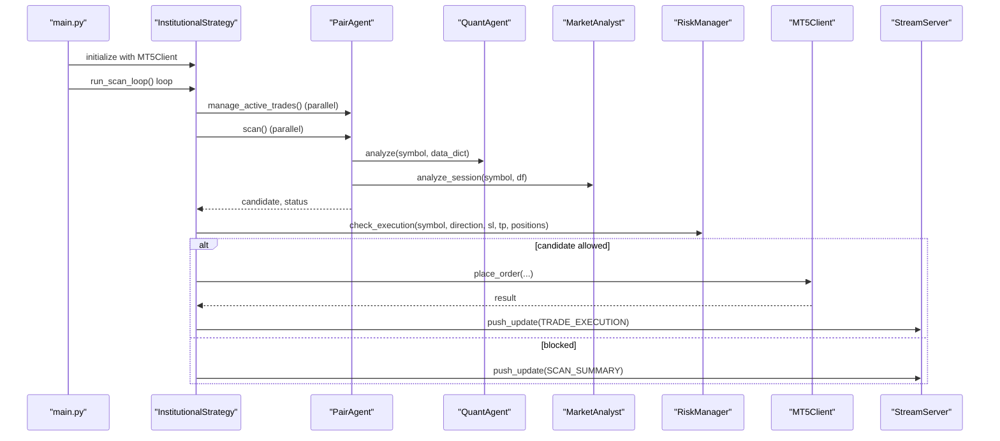
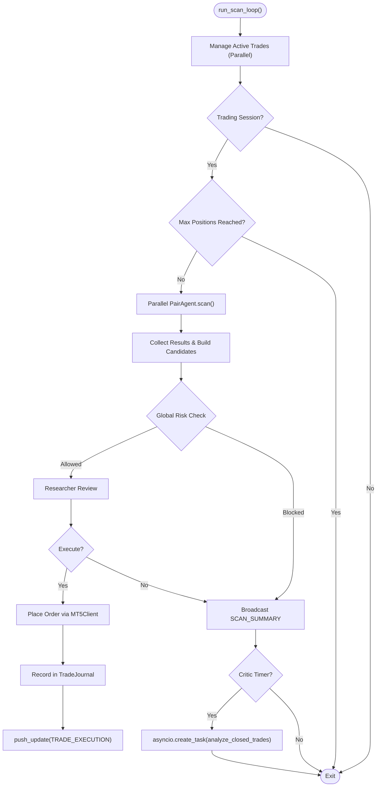
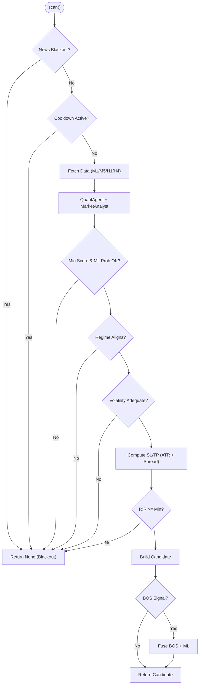
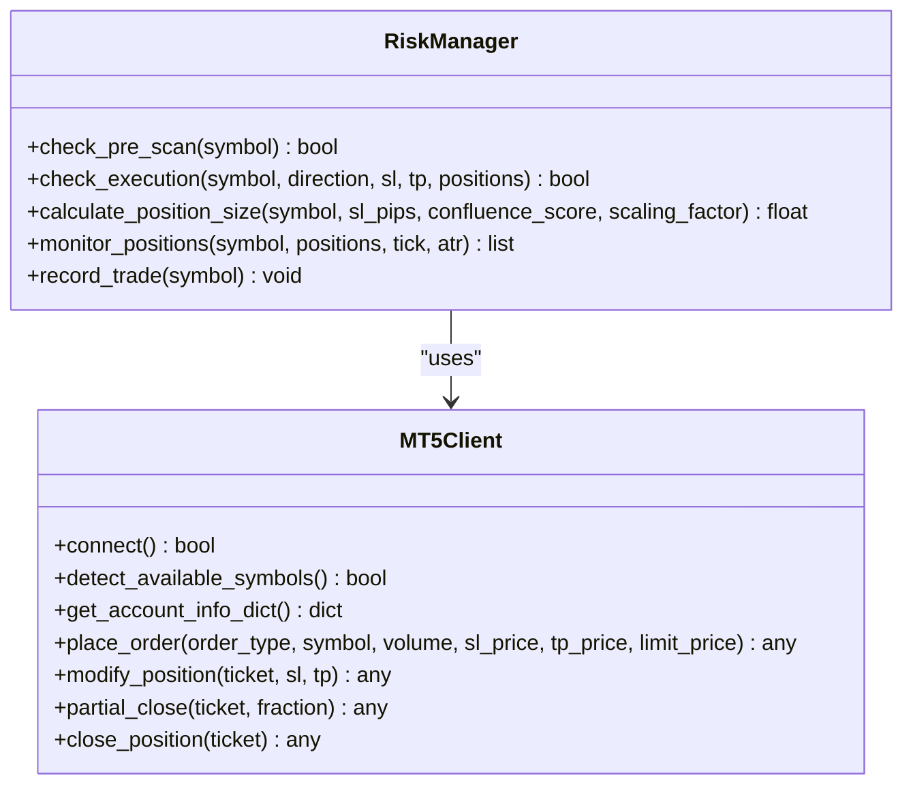
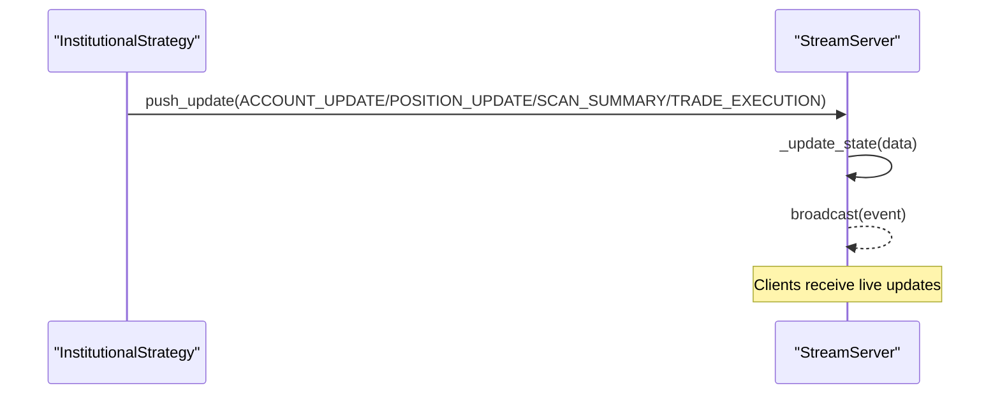
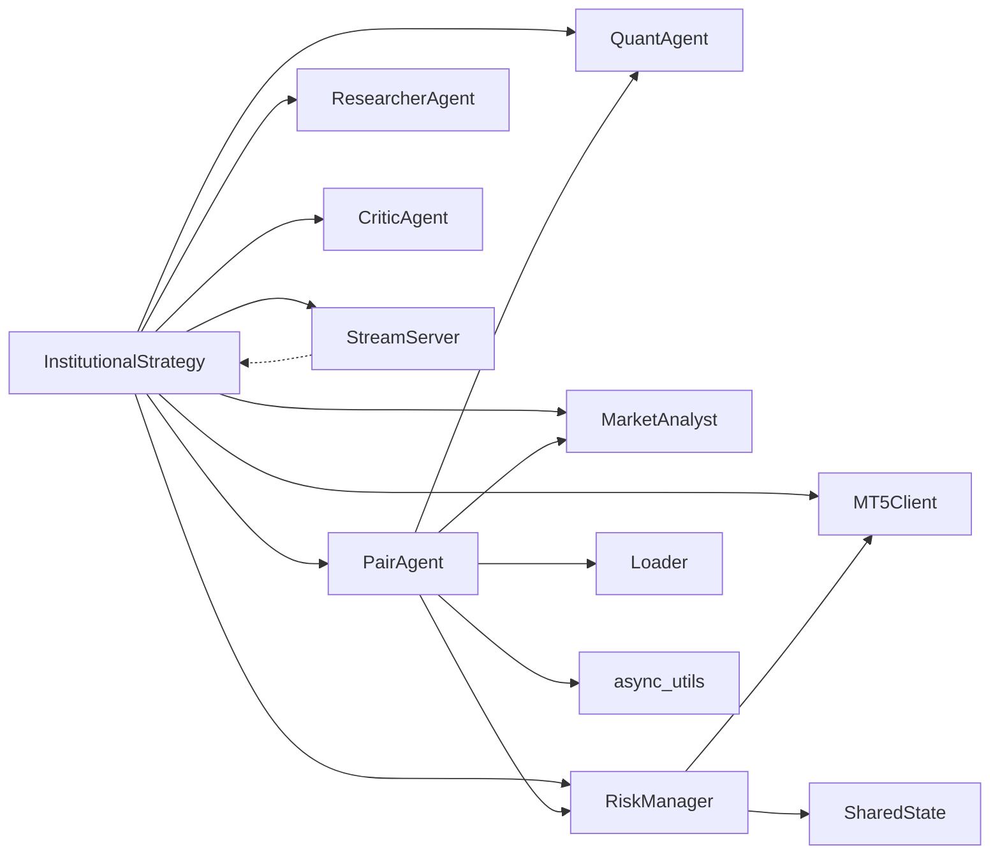

# Core Architecture

<cite>
**Referenced Files in This Document**
- [main.py](file://main.py)
- [institutional_strategy.py](file://strategy/institutional_strategy.py)
- [pair_agent.py](file://strategy/pair_agent.py)
- [shared_state.py](file://utils/shared_state.py)
- [mt5_client.py](file://execution/mt5_client.py)
- [market_analyst.py](file://analysis/market_analyst.py)
- [quant_agent.py](file://analysis/quant_agent.py)
- [researcher_agent.py](file://analysis/researcher_agent.py)
- [critic_agent.py](file://analysis/critic_agent.py)
- [stream_server.py](file://api/stream_server.py)
- [risk_manager.py](file://utils/risk_manager.py)
- [loader.py](file://market_data/loader.py)
- [async_utils.py](file://utils/async_utils.py)
- [settings.py](file://config/settings.py)
</cite>

## Table of Contents
1. [Introduction](#introduction)
2. [Project Structure](#project-structure)
3. [Core Components](#core-components)
4. [Architecture Overview](#architecture-overview)
5. [Detailed Component Analysis](#detailed-component-analysis)
6. [Dependency Analysis](#dependency-analysis)
7. [Performance Considerations](#performance-considerations)
8. [Troubleshooting Guide](#troubleshooting-guide)
9. [Conclusion](#conclusion)

## Introduction
This document describes the core architecture of the Institutional SureShot Scanner, a multi-agent system designed for automated institutional-grade trading. The system centers on InstitutionalStrategy as the orchestrator that coordinates per-symbol PairAgent instances, shared analytical agents (QuantAgent, MarketAnalyst, ResearcherAgent, CriticAgent), and risk management. It integrates with MetaTrader 5 for live market data and order execution, exposes a WebSocket server for real-time dashboards, and persists shared state for cross-agent coordination.

## Project Structure
The repository follows a feature-based layout with clear separation of concerns:
- Strategy orchestration and per-symbol agents
- Shared analytics and risk management
- Execution and market data integration
- API and dashboard streaming
- Configuration and utilities

**Diagram sources**
- [main.py](file://main.py#L19-L122)
- [institutional_strategy.py](file://strategy/institutional_strategy.py#L99-L330)
- [pair_agent.py](file://strategy/pair_agent.py#L71-L295)
- [quant_agent.py](file://analysis/quant_agent.py#L109-L159)
- [market_analyst.py](file://analysis/market_analyst.py#L25-L71)
- [researcher_agent.py](file://analysis/researcher_agent.py#L17-L82)
- [critic_agent.py](file://analysis/critic_agent.py#L17-L52)
- [risk_manager.py](file://utils/risk_manager.py#L14-L396)
- [mt5_client.py](file://execution/mt5_client.py#L12-L385)
- [stream_server.py](file://api/stream_server.py#L176-L212)
- [shared_state.py](file://utils/shared_state.py#L23-L110)
- [loader.py](file://market_data/loader.py#L40-L59)
- [async_utils.py](file://utils/async_utils.py#L9-L16)

**Section sources**
- [main.py](file://main.py#L19-L122)
- [settings.py](file://config/settings.py#L1-L201)

## Core Components
- InstitutionalStrategy: Central orchestrator managing scan loops, global risk gates, candidate evaluation, and event broadcasting. It maintains per-symbol PairAgent instances and coordinates shared agents.
- PairAgent: Per-symbol autonomous agent performing data fetching, quant analysis, regime checks, and active trade management with circuit breaking and retail viability filters.
- Shared Agents:
  - QuantAgent: Technical analysis and ML inference across multiple models (Random Forest, XGBoost, LSTM, Lag-Llama).
  - MarketAnalyst: Regime detection and optional AI opinion synthesis with shared state persistence.
  - ResearcherAgent: Debates quant and analyst outputs asynchronously to produce a final conviction decision.
  - CriticAgent: Periodically reviews closed trades and records post-mortem insights.
- RiskManager: Centralized pre-trade risk checks, position sizing, trailing stops, partial closes, and correlation filtering.
- MT5Client: MetaTrader 5 integration for connection, symbol detection, account info, order placement, and position management.
- StreamServer: WebSocket and REST endpoints for real-time dashboard updates.
- SharedState: Persistent key-value store for cross-agent state sharing.
- Loader and async_utils: MT5 data access and async thread pool utilities.

**Section sources**
- [institutional_strategy.py](file://strategy/institutional_strategy.py#L49-L330)
- [pair_agent.py](file://strategy/pair_agent.py#L22-L432)
- [quant_agent.py](file://analysis/quant_agent.py#L34-L294)
- [market_analyst.py](file://analysis/market_analyst.py#L7-L81)
- [researcher_agent.py](file://analysis/researcher_agent.py#L5-L132)
- [critic_agent.py](file://analysis/critic_agent.py#L10-L141)
- [risk_manager.py](file://utils/risk_manager.py#L14-L549)
- [mt5_client.py](file://execution/mt5_client.py#L12-L385)
- [stream_server.py](file://api/stream_server.py#L1-L212)
- [shared_state.py](file://utils/shared_state.py#L23-L110)
- [loader.py](file://market_data/loader.py#L40-L83)
- [async_utils.py](file://utils/async_utils.py#L1-L45)

## Architecture Overview
The system operates as an event-driven, asynchronous multi-agent platform:
- InstitutionalStrategy drives periodic scan cycles, invoking all PairAgent instances concurrently.
- Each PairAgent independently fetches multi-timeframe data, runs QuantAgent and MarketAnalyst, constructs candidates, and enforces per-symbol risk and regime filters.
- Candidates are aggregated, filtered by global risk gates, and optionally reviewed by ResearcherAgent before execution decisions.
- RiskManager performs final execution checks and calculates position sizes; MT5Client executes orders and manages positions.
- Events are broadcast to the StreamServer for dashboard consumption and persisted via SharedState for cross-agent visibility.

**Diagram sources**
- [main.py](file://main.py#L75-L105)
- [institutional_strategy.py](file://strategy/institutional_strategy.py#L99-L330)
- [pair_agent.py](file://strategy/pair_agent.py#L71-L295)
- [quant_agent.py](file://analysis/quant_agent.py#L109-L159)
- [market_analyst.py](file://analysis/market_analyst.py#L25-L71)
- [risk_manager.py](file://utils/risk_manager.py#L237-L295)
- [mt5_client.py](file://execution/mt5_client.py#L216-L292)
- [stream_server.py](file://api/stream_server.py#L176-L212)

## Detailed Component Analysis

### InstitutionalStrategy: Central Orchestrator
Responsibilities:
- Initialize shared agents (QuantAgent, MarketAnalyst, ResearcherAgent, CriticAgent) and RiskManager.
- Manage daily trade counts, session gating, and global position caps.
- Orchestrate parallel scans across all PairAgent instances.
- Aggregate candidates, apply global risk checks, and decide execution.
- Broadcast events to the dashboard and persist account/positions updates.
- Periodically trigger self-reflection via CriticAgent.

Key behaviors:
- Parallelism: Uses asyncio gather to run all PairAgent scans concurrently.
- Candidate selection: Sorts by score and ML probability, then applies ResearcherAgent review.
- Execution gating: Validates direction, trade mode, R:R mandate, and risk checks before placing orders.
- Eventing: Emits SCAN_START, SCAN_SUMMARY, POSITION_UPDATE, ACCOUNT_UPDATE, TRADE_EXECUTION, RESEARCH_START, RESEARCH_RESULT, CRITIC_REVIEW.

**Diagram sources**
- [institutional_strategy.py](file://strategy/institutional_strategy.py#L99-L330)

**Section sources**
- [institutional_strategy.py](file://strategy/institutional_strategy.py#L49-L330)

### PairAgent: Per-Symbol Autonomous Agent
Responsibilities:
- Fetch multi-timeframe OHLCV data asynchronously.
- Run QuantAgent and MarketAnalyst to produce a candidate with direction, score, and risk parameters.
- Apply per-symbol risk filters (cooldown, spread, volatility thresholds).
- Enforce regime guard logic for active positions.
- Circuit breaker to pause after consecutive losses.
- Retail viability filters for BOS-only candidates.

Processing logic highlights:
- Data fetching: Uses run_in_executor to avoid blocking the event loop.
- Candidate construction: Computes ATR-based SL/TP, enforces minimum R:R, and applies volatility thresholds per asset class.
- BOS fusion: If Bullish/Oversold signals align with ML direction, boosts score and sets limit entry with liquidity sweep.
- Active trade management: Uses cached ATR when recent, otherwise recomputes features; triggers trailing stops, partial closes, and regime exits.

**Diagram sources**
- [pair_agent.py](file://strategy/pair_agent.py#L71-L295)

**Section sources**
- [pair_agent.py](file://strategy/pair_agent.py#L22-L432)

### Shared Agents

#### QuantAgent
- Loads ML models (Random Forest, XGBoost, LSTM, Lag-Llama) and computes technical features.
- Generates confluence scores across M5/H1/H4 trends, ML probabilities, AI signals, and SMC patterns.
- Produces ensemble score and returns features/data for downstream use.

**Section sources**
- [quant_agent.py](file://analysis/quant_agent.py#L34-L294)

#### MarketAnalyst
- Performs regime detection and optional AI sentiment analysis.
- Persists regime state to SharedState for cross-agent access.

**Section sources**
- [market_analyst.py](file://analysis/market_analyst.py#L7-L81)

#### ResearcherAgent
- Conducts a structured debate synthesizing quant and analyst inputs.
- Returns action (BUY/SELL/HOLD), confidence, and reason; falls back to technical confidence if no LLM key.

**Section sources**
- [researcher_agent.py](file://analysis/researcher_agent.py#L5-L132)

#### CriticAgent
- Reviews closed trades without post-mortem and writes lessons and scores back to the trade journal database.

**Section sources**
- [critic_agent.py](file://analysis/critic_agent.py#L10-L141)

### Risk Management and Execution
- RiskManager centralizes:
  - Pre-scan checks: circuit breaker, daily limits, kill switch, payoff mandate, spread, news, session filters.
  - Execution checks: concurrent position caps, live correlation conflicts, profitability buffers.
  - Position sizing: Kelly Criterion fallback with confluence tiers; tail risk clamps for volatile symbols.
  - Active management: trailing stops (ATR or percent), partial closes, break-even moves.
- MT5Client wraps MetaTrader 5 operations: connection, symbol detection, account info, order placement (market/limit), SL/TP modifications, partial closes, and full closes.

**Diagram sources**
- [risk_manager.py](file://utils/risk_manager.py#L14-L549)
- [mt5_client.py](file://execution/mt5_client.py#L12-L385)

**Section sources**
- [risk_manager.py](file://utils/risk_manager.py#L14-L549)
- [mt5_client.py](file://execution/mt5_client.py#L12-L385)

### Streaming and State Coordination
- StreamServer:
  - WebSocket endpoint for real-time updates and REST endpoints for account, positions, trades, and scan summaries.
  - push_update broadcasts events to connected clients and maintains an in-memory rolling log.
- SharedState:
  - Persistent key-value store for cross-agent state (e.g., regime per symbol) using SQLite.

**Diagram sources**
- [stream_server.py](file://api/stream_server.py#L176-L212)
- [institutional_strategy.py](file://strategy/institutional_strategy.py#L185-L236)

**Section sources**
- [stream_server.py](file://api/stream_server.py#L1-L212)
- [shared_state.py](file://utils/shared_state.py#L23-L110)

### Data Access and Asynchronous Utilities
- Loader:
  - Provides historical data retrieval from MT5 with timeframe mapping and multi-timeframe convenience.
- async_utils:
  - Thread pool executor wrapper to run blocking operations without blocking the event loop.

**Section sources**
- [loader.py](file://market_data/loader.py#L40-L83)
- [async_utils.py](file://utils/async_utils.py#L1-L45)

## Dependency Analysis
High-level dependencies:
- InstitutionalStrategy depends on PairAgent, QuantAgent, MarketAnalyst, ResearcherAgent, CriticAgent, RiskManager, MT5Client, StreamServer, and SharedState.
- PairAgent depends on QuantAgent, MarketAnalyst, RiskManager, Loader, and async_utils.
- RiskManager depends on MT5Client and SharedState.
- StreamServer depends on FastAPI and uvicorn; it is invoked by InstitutionalStrategy.

**Diagram sources**
- [institutional_strategy.py](file://strategy/institutional_strategy.py#L49-L330)
- [pair_agent.py](file://strategy/pair_agent.py#L22-L432)
- [risk_manager.py](file://utils/risk_manager.py#L14-L549)
- [mt5_client.py](file://execution/mt5_client.py#L12-L385)
- [stream_server.py](file://api/stream_server.py#L1-L212)
- [shared_state.py](file://utils/shared_state.py#L23-L110)
- [loader.py](file://market_data/loader.py#L40-L83)
- [async_utils.py](file://utils/async_utils.py#L1-L45)

**Section sources**
- [institutional_strategy.py](file://strategy/institutional_strategy.py#L49-L330)
- [pair_agent.py](file://strategy/pair_agent.py#L22-L432)
- [risk_manager.py](file://utils/risk_manager.py#L14-L549)

## Performance Considerations
- Concurrency:
  - InstitutionalStrategy runs all PairAgent scans concurrently using asyncio gather, minimizing cycle time.
  - PairAgent uses run_in_executor for blocking data loading to avoid event loop stalls.
- Resource management:
  - Thread pool executor is configured globally; ensure worker count matches CPU cores and I/O patterns.
  - RiskManager caches symbol stats and ATR values to reduce repeated computations.
- Scalability:
  - PairAgent specialization allows independent scaling per symbol; consider per-symbol resource isolation if needed.
  - StreamServer uses a background thread for uvicorn; ensure port availability and firewall rules.
- Model inference:
  - QuantAgent supports multiple models; enable only necessary predictors to reduce latency.
  - Use GPU acceleration where available (LSTM predictor device selection).

[No sources needed since this section provides general guidance]

## Troubleshooting Guide
Common issues and diagnostics:
- MT5 connectivity:
  - Verify credentials and terminal path in settings; ensure symbol visibility and trade modes.
- Data retrieval:
  - Confirm Loader can connect and fetch rates; check timeframe mapping and bar counts.
- Risk gating:
  - Review daily limits, spread thresholds, and session filters; adjust settings for current market conditions.
- Execution failures:
  - Inspect order responses and retcodes; confirm deviation and magic numbers; verify symbol info and lot steps.
- Dashboard connectivity:
  - Ensure StreamServer is reachable and ports are open; confirm WebSocket handshake and CORS settings.
- Shared state:
  - Validate SharedState database path and permissions; check JSON serialization/deserialization.

**Section sources**
- [mt5_client.py](file://execution/mt5_client.py#L18-L28)
- [loader.py](file://market_data/loader.py#L24-L59)
- [risk_manager.py](file://utils/risk_manager.py#L51-L163)
- [stream_server.py](file://api/stream_server.py#L153-L173)
- [shared_state.py](file://utils/shared_state.py#L23-L110)

## Conclusion
The Institutional SureShot Scanner employs a robust multi-agent architecture centered on InstitutionalStrategy, enabling parallel per-symbol processing, shared analytics, and disciplined risk management. The system’s event-driven design, asynchronous processing model, and modular components support scalability and adaptability for institutional trading environments. Integration with MT5, WebSocket streaming, and optional AI services provides a comprehensive foundation for continuous learning and real-time monitoring.