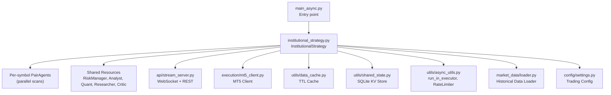
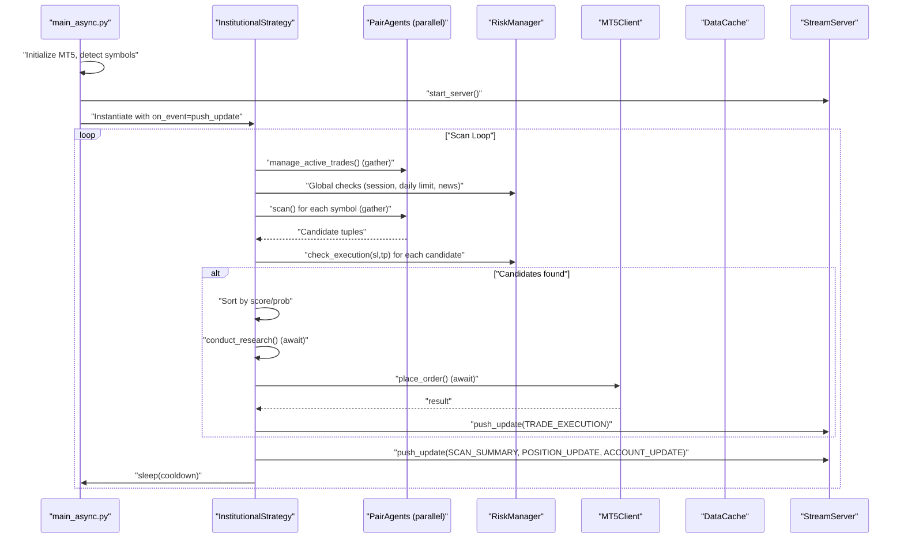
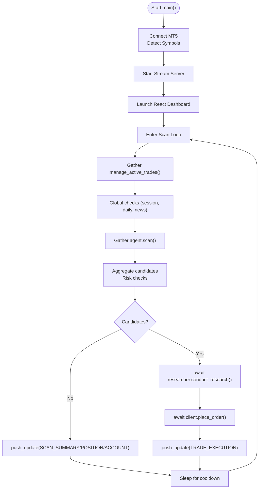
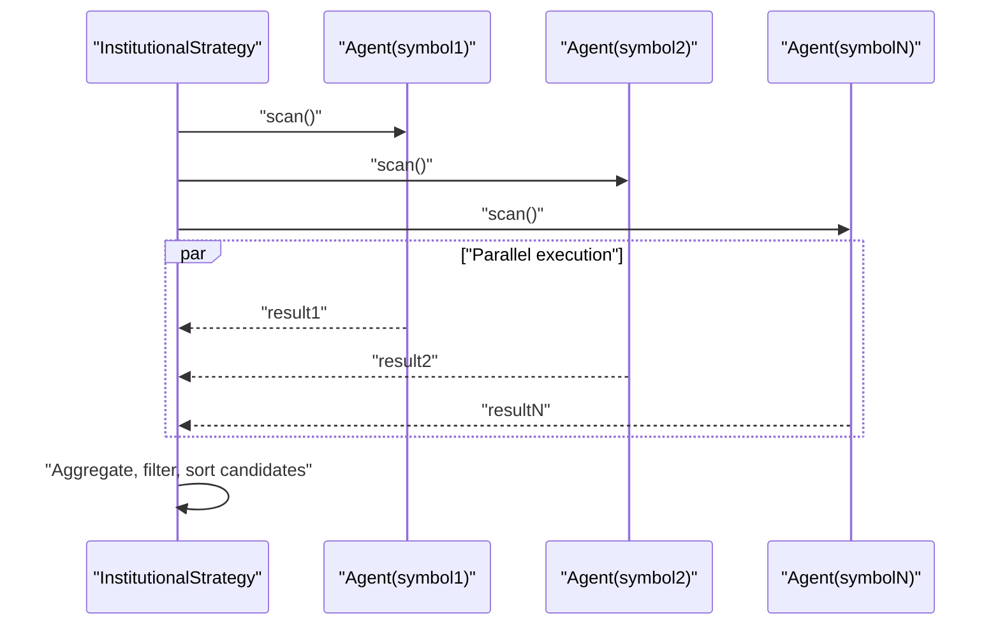
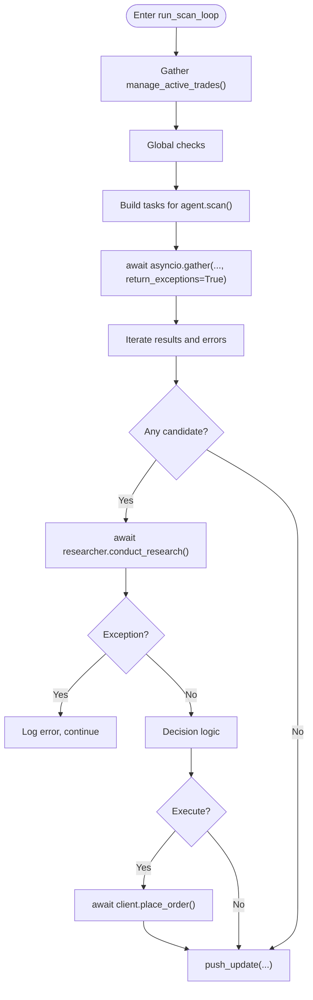
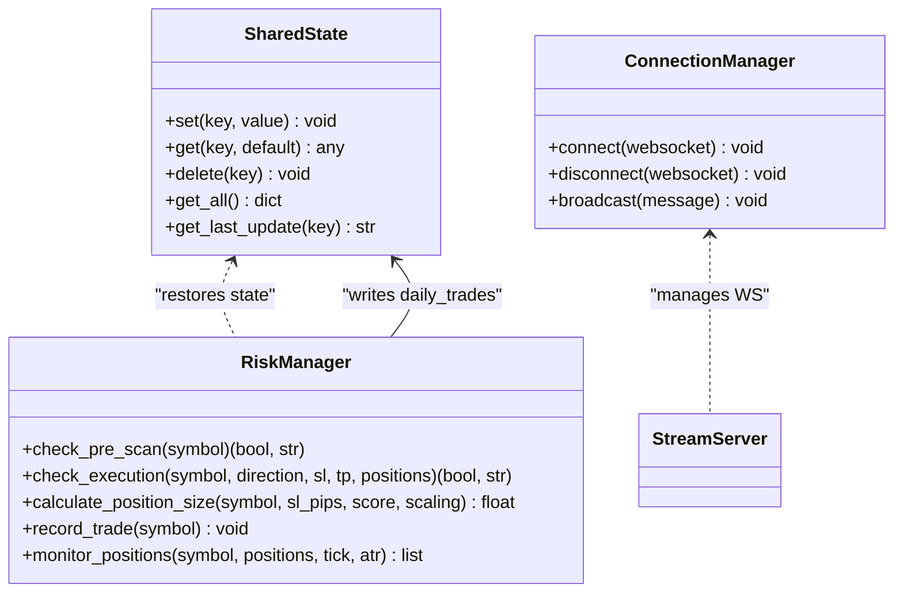
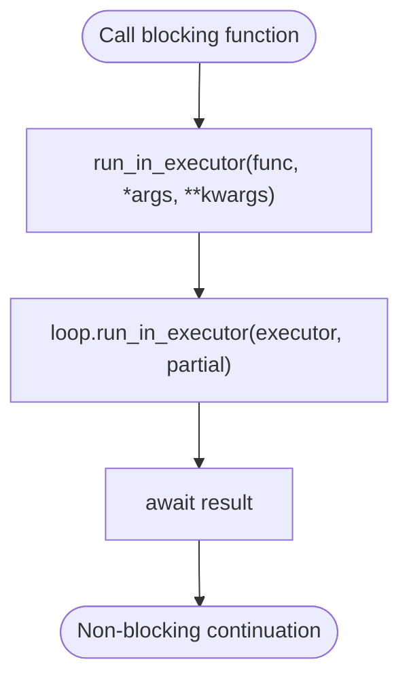
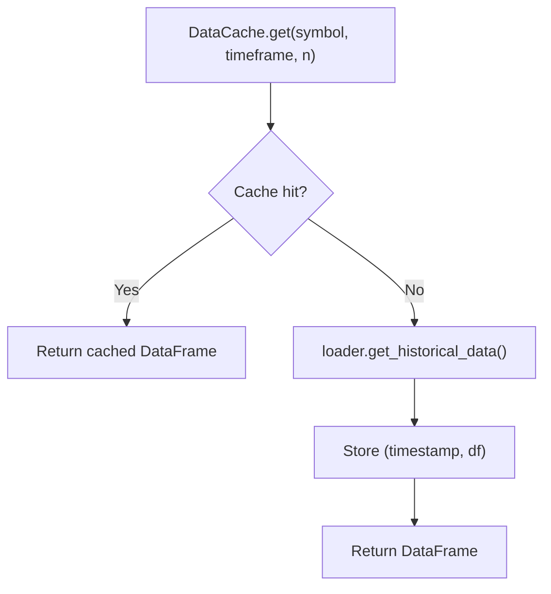
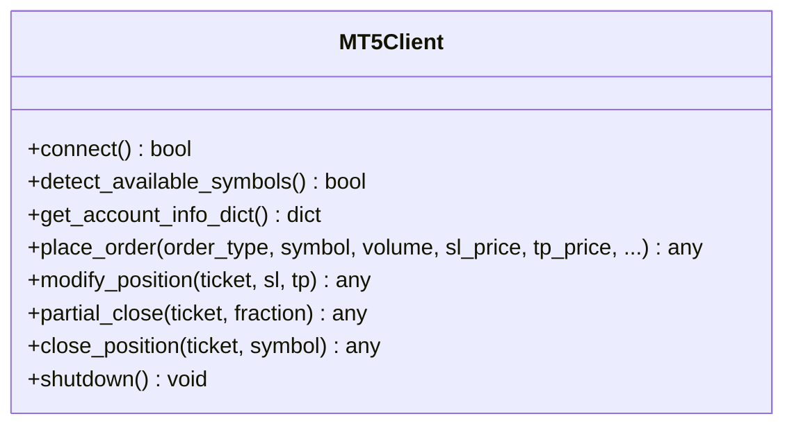
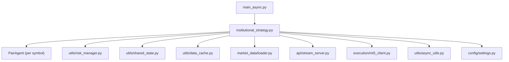

# Asynchronous Processing Model

<cite>
**Referenced Files in This Document**
- [main_async.py](file://main_async.py)
- [institutional_strategy.py](file://strategy/institutional_strategy.py)
- [stream_server.py](file://api/stream_server.py)
- [async_utils.py](file://utils/async_utils.py)
- [shared_state.py](file://utils/shared_state.py)
- [mt5_client.py](file://execution/mt5_client.py)
- [settings.py](file://config/settings.py)
- [loader.py](file://market_data/loader.py)
- [data_cache.py](file://utils/data_cache.py)
- [risk_manager.py](file://utils/risk_manager.py)
- [debug_async.py](file://debug_async.py)
</cite>

## Table of Contents
1. [Introduction](#introduction)
2. [Project Structure](#project-structure)
3. [Core Components](#core-components)
4. [Architecture Overview](#architecture-overview)
5. [Detailed Component Analysis](#detailed-component-analysis)
6. [Dependency Analysis](#dependency-analysis)
7. [Performance Considerations](#performance-considerations)
8. [Troubleshooting Guide](#troubleshooting-guide)
9. [Conclusion](#conclusion)

## Introduction
This document explains the asynchronous processing model and concurrent data handling patterns implemented in the project. It focuses on the asyncio-based architecture enabling parallel execution across multiple trading agents and data streams, event loop management, concurrent task scheduling, exception handling in asynchronous contexts, shared state management, thread-safe operations, and practical guidance for debugging and performance tuning.

## Project Structure
The system centers around an async main entry point that orchestrates:
- An InstitutionalStrategy coordinator that runs a scanning loop
- Per-symbol PairAgent instances operating concurrently
- Shared resources (RiskManager, MarketAnalyst, QuantAgent, ResearcherAgent, CriticAgent)
- Real-time streaming via a FastAPI WebSocket server
- MT5 client integration for live market data and order execution
- Utilities for async execution, shared state persistence, and caching



**Diagram sources**
- [main_async.py](file://main_async.py#L20-L97)
- [institutional_strategy.py](file://strategy/institutional_strategy.py#L99-L330)
- [stream_server.py](file://api/stream_server.py#L143-L174)
- [mt5_client.py](file://execution/mt5_client.py#L12-L104)
- [data_cache.py](file://utils/data_cache.py#L16-L77)
- [shared_state.py](file://utils/shared_state.py#L23-L110)
- [async_utils.py](file://utils/async_utils.py#L9-L44)
- [loader.py](file://market_data/loader.py#L40-L83)
- [settings.py](file://config/settings.py#L1-L201)

**Section sources**
- [main_async.py](file://main_async.py#L1-L103)
- [institutional_strategy.py](file://strategy/institutional_strategy.py#L49-L330)
- [stream_server.py](file://api/stream_server.py#L143-L174)

## Core Components
- Async main loop and orchestration:
  - Initializes MT5, detects symbols, starts the stream server, launches the React dashboard, and runs the InstitutionalStrategy scanning loop with periodic cooldown.
- InstitutionalStrategy:
  - Coordinates per-symbol PairAgents, performs global checks, aggregates results, and executes trades when conditions are met.
  - Uses asyncio.gather to run agent scans concurrently and asyncio.create_task for background tasks.
- Async utilities:
  - run_in_executor to run blocking operations without blocking the event loop.
  - AsyncRateLimiter for token-bucket throttling.
- Shared state:
  - SQLite-backed key-value store for cross-agent coordination and persistence across restarts.
- Stream server:
  - FastAPI app with WebSocket broadcasting and REST endpoints; push_update updates state and broadcasts to clients from threads safely.
- MT5 client:
  - Provides connection, symbol detection, account info, order placement, and position management.
- Data cache:
  - TTL-based caching to reduce redundant MT5 API calls.
- Risk manager:
  - Centralized pre-trade checks, position sizing, correlation filtering, and trailing/stop management.

**Section sources**
- [main_async.py](file://main_async.py#L20-L97)
- [institutional_strategy.py](file://strategy/institutional_strategy.py#L99-L330)
- [async_utils.py](file://utils/async_utils.py#L9-L44)
- [shared_state.py](file://utils/shared_state.py#L23-L110)
- [stream_server.py](file://api/stream_server.py#L177-L212)
- [mt5_client.py](file://execution/mt5_client.py#L12-L385)
- [data_cache.py](file://utils/data_cache.py#L16-L77)
- [risk_manager.py](file://utils/risk_manager.py#L14-L549)

## Architecture Overview
The system uses a single-threaded asyncio event loop for coordination, with explicit concurrency via:
- asyncio.gather for parallel scans across agents
- asyncio.create_task for fire-and-forget background work
- run_in_executor for blocking IO and CPU-bound tasks
- Thread-safe push_update to publish events from background threads to the event loop



**Diagram sources**
- [main_async.py](file://main_async.py#L75-L91)
- [institutional_strategy.py](file://strategy/institutional_strategy.py#L99-L330)
- [stream_server.py](file://api/stream_server.py#L177-L212)
- [mt5_client.py](file://execution/mt5_client.py#L216-L292)

## Detailed Component Analysis

### Async Main Loop and Event Loop Management
- The main coroutine initializes MT5, starts the stream server, launches the dashboard, and enters a continuous loop.
- The loop measures elapsed time and sleeps for the remainder of the configured cooldown to maintain cadence.
- Exceptions are caught and logged; the MT5 client is shut down in the finally block.



**Diagram sources**
- [main_async.py](file://main_async.py#L20-L97)
- [institutional_strategy.py](file://strategy/institutional_strategy.py#L99-L330)
- [stream_server.py](file://api/stream_server.py#L177-L212)

**Section sources**
- [main_async.py](file://main_async.py#L20-L97)

### Concurrent Task Scheduling and Parallel Scans
- InstitutionalStrategy schedules:
  - Per-symbol agent scans using asyncio.gather to run in parallel and collect results.
  - Background self-reflection via asyncio.create_task to avoid delaying the main loop.
- This pattern maximizes throughput across many symbols while preserving responsiveness.



**Diagram sources**
- [institutional_strategy.py](file://strategy/institutional_strategy.py#L132-L140)

**Section sources**
- [institutional_strategy.py](file://strategy/institutional_strategy.py#L99-L140)

### Exception Handling in Asynchronous Contexts
- The main loop catches exceptions during the scan loop and logs them without stopping the process.
- gather is called with return_exceptions=True to prevent one failing agent from canceling others.
- Individual agent scans and research steps are wrapped in try/except to isolate failures and continue operation.



**Diagram sources**
- [institutional_strategy.py](file://strategy/institutional_strategy.py#L99-L330)

**Section sources**
- [institutional_strategy.py](file://strategy/institutional_strategy.py#L99-L140)

### Shared State Management and Thread-Safe Operations
- SharedState persists key-value pairs in an SQLite database and supports set/get/delete/get_all.
- RiskManager restores daily trade counts and dates from SharedState and updates them atomically.
- StreamServer maintains an in-memory state snapshot and broadcasts updates to WebSocket clients.
- push_update safely bridges from background threads to the asyncio event loop using run_coroutine_threadsafe.



**Diagram sources**
- [shared_state.py](file://utils/shared_state.py#L23-L110)
- [risk_manager.py](file://utils/risk_manager.py#L14-L302)
- [stream_server.py](file://api/stream_server.py#L37-L65)

**Section sources**
- [shared_state.py](file://utils/shared_state.py#L23-L110)
- [risk_manager.py](file://utils/risk_manager.py#L14-L302)
- [stream_server.py](file://api/stream_server.py#L177-L212)

### Thread-Safe Event Broadcasting
- push_update updates the in-memory state and schedules a broadcast on the event loop using run_coroutine_threadsafe.
- The ConnectionManager keeps track of active connections and removes dead sockets.

```mermaid
sequenceDiagram
participant Bot as "Bot Thread"
participant Push as "push_update(data)"
participant Loop as "Event Loop"
participant CM as "ConnectionManager"
participant WS as "WebSocket Clients"
Bot->>Push : "push_update(event)"
Push->>Push : "_update_state(data)"
Push->>Loop : "run_coroutine_threadsafe(broadcast, loop)"
Loop->>CM : "broadcast(message)"
CM->>WS : "send_text(message)"
```

**Diagram sources**
- [stream_server.py](file://api/stream_server.py#L177-L183)
- [stream_server.py](file://api/stream_server.py#L51-L62)

**Section sources**
- [stream_server.py](file://api/stream_server.py#L177-L183)

### Blocking Calls and Concurrency Boundaries
- run_in_executor wraps blocking functions (e.g., ML inference, file IO) to avoid blocking the event loop.
- AsyncRateLimiter provides token-bucket throttling with an asyncio.Lock to guard state transitions.



**Diagram sources**
- [async_utils.py](file://utils/async_utils.py#L9-L16)

**Section sources**
- [async_utils.py](file://utils/async_utils.py#L9-L16)
- [async_utils.py](file://utils/async_utils.py#L18-L44)

### Data Streams and Caching
- DataCache reduces MT5 API calls by caching per-symbol/timeframe datasets with TTLs.
- loader.get_historical_data fetches bars and converts timestamps, while loader.get_multi_timeframe_data consolidates multiple timeframes.



**Diagram sources**
- [data_cache.py](file://utils/data_cache.py#L30-L48)
- [loader.py](file://market_data/loader.py#L40-L59)

**Section sources**
- [data_cache.py](file://utils/data_cache.py#L16-L77)
- [loader.py](file://market_data/loader.py#L40-L83)

### MT5 Client Integration
- MT5Client handles initialization, login, symbol detection, account info retrieval, order placement, position modification, partial close, and full close.
- It integrates with settings for credentials, path, and risk parameters.



**Diagram sources**
- [mt5_client.py](file://execution/mt5_client.py#L12-L385)

**Section sources**
- [mt5_client.py](file://execution/mt5_client.py#L12-L385)

### Configuration and Environment
- settings.py centralizes trading parameters, risk controls, session windows, and thresholds used across the system.

**Section sources**
- [settings.py](file://config/settings.py#L1-L201)

### Debugging Asynchronous Execution
- debug_async.py demonstrates a minimal async debug loop to validate the scanning pipeline and event publishing.

**Section sources**
- [debug_async.py](file://debug_async.py#L13-L46)

## Dependency Analysis
The system exhibits clear separation of concerns:
- Control flow: main_async.py orchestrates startup and the scanning loop.
- Coordination: InstitutionalStrategy composes agents and shared resources.
- Data path: loader and DataCache mediate MT5 access; SharedState persists state.
- Communication: StreamServer exposes WebSocket and REST endpoints; push_update coordinates event publication.



**Diagram sources**
- [main_async.py](file://main_async.py#L15-L66)
- [institutional_strategy.py](file://strategy/institutional_strategy.py#L54-L86)
- [stream_server.py](file://api/stream_server.py#L177-L212)

**Section sources**
- [main_async.py](file://main_async.py#L15-L66)
- [institutional_strategy.py](file://strategy/institutional_strategy.py#L54-L86)

## Performance Considerations
- Parallelism:
  - Use asyncio.gather for I/O-bound tasks (agent scans, research) to maximize throughput.
  - Avoid long-running CPU-bound work in the event loop; use run_in_executor for blocking operations.
- Throttling:
  - Apply AsyncRateLimiter to external APIs or rate-sensitive operations to prevent bursts.
- Caching:
  - Leverage DataCache TTLs to minimize MT5 calls and reduce latency.
- Backpressure:
  - Consider limiting concurrent trades via RiskManager’s execution checks and MAX_CONCURRENT_TRADES.
- Monitoring:
  - Instrument timing around gather and sleep to ensure the cooldown aligns with measured durations.

[No sources needed since this section provides general guidance]

## Troubleshooting Guide
- Deadlocks and starvation:
  - Ensure all blocking calls are wrapped with run_in_executor.
  - Avoid synchronous calls to MT5 or disk IO on the event loop.
- Resource contention:
  - Use asyncio.Lock in rate-limiters and protect shared mutable state.
  - Keep SharedState writes minimal and transactional where possible.
- Debugging async code:
  - Use debug_async.py to run a small number of iterations and observe event flow.
  - Add structured logs around gather and sleep intervals to validate cadence.
- WebSocket connectivity:
  - Verify push_update is invoked from the same thread as the event loop or use run_coroutine_threadsafe.
  - Confirm the server is reachable and the dashboard connects to the correct URL.

**Section sources**
- [debug_async.py](file://debug_async.py#L13-L46)
- [async_utils.py](file://utils/async_utils.py#L9-L16)
- [stream_server.py](file://api/stream_server.py#L177-L183)

## Conclusion
The project implements a robust asyncio-based architecture that scales across many trading agents and data streams. By combining parallel task scheduling, thread-safe event broadcasting, and careful handling of blocking operations, it achieves responsive, reliable, and observable trading automation. Adhering to the patterns outlined here ensures safe concurrency, predictable performance, and effective debugging.