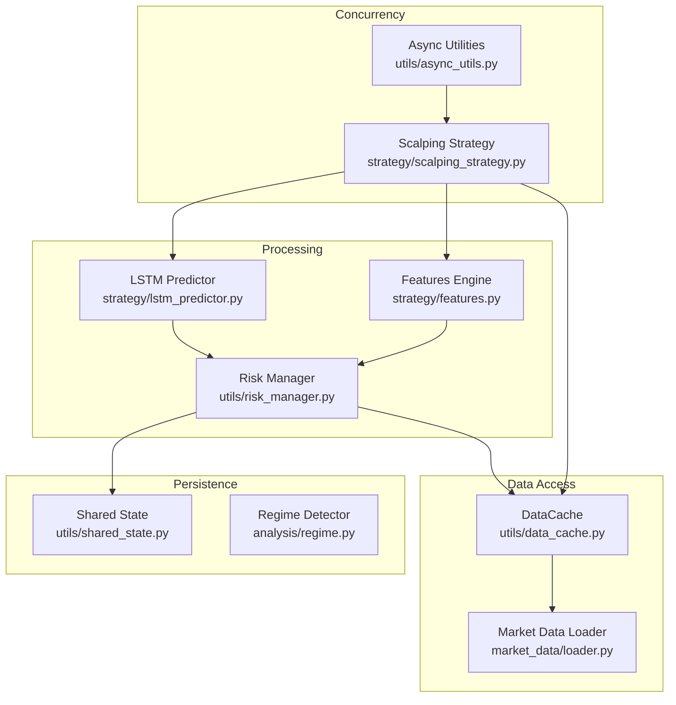
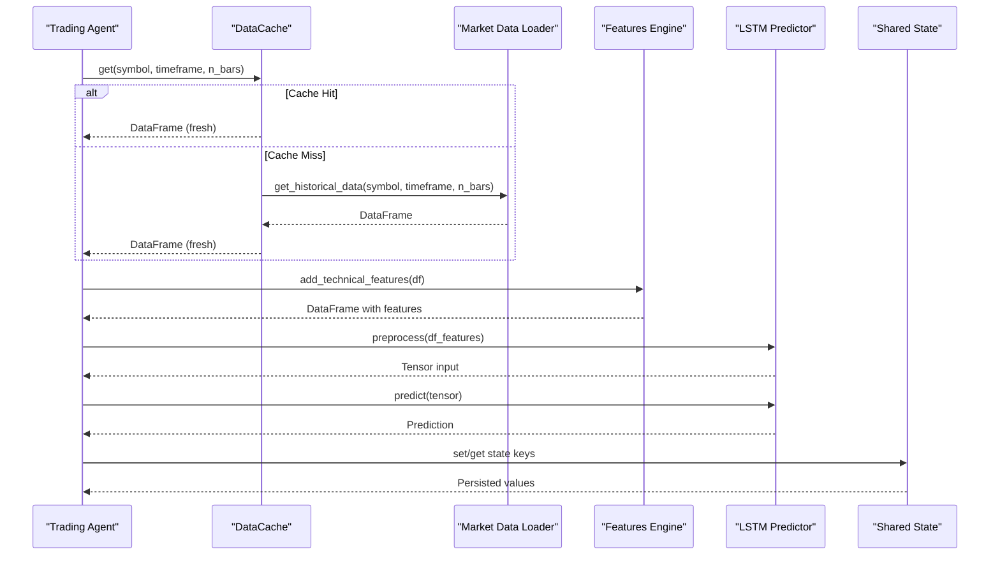
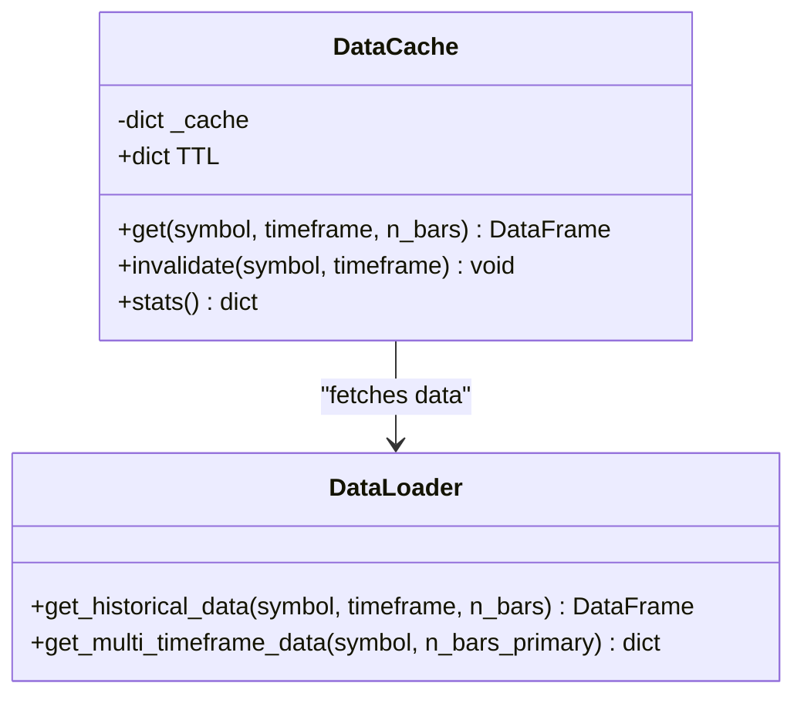
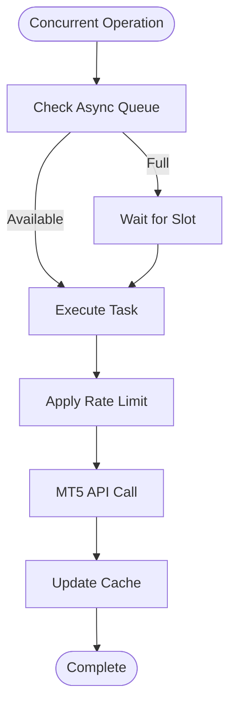
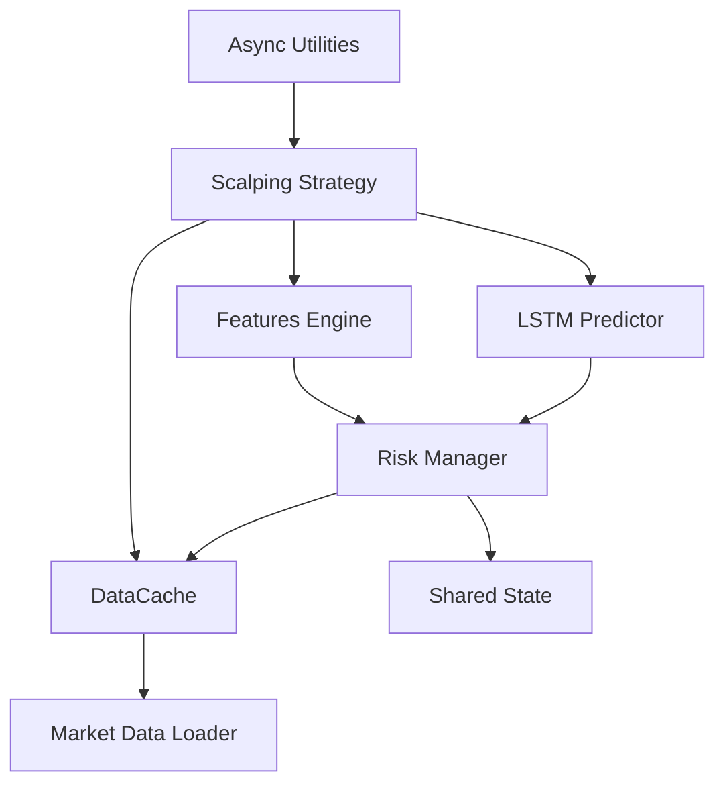

# Data Caching and Memory Management

<cite>
**Referenced Files in This Document**
- [data_cache.py](file://utils/data_cache.py)
- [loader.py](file://market_data/loader.py)
- [features.py](file://strategy/features.py)
- [lstm_predictor.py](file://strategy/lstm_predictor.py)
- [shared_state.py](file://utils/shared_state.py)
- [risk_manager.py](file://utils/risk_manager.py)
- [async_utils.py](file://utils/async_utils.py)
- [scalping_strategy.py](file://strategy/scalping_strategy.py)
- [regime.py](file://analysis/regime.py)
- [settings.py](file://config/settings.py)
</cite>

## Table of Contents
1. [Introduction](#introduction)
2. [Project Structure](#project-structure)
3. [Core Components](#core-components)
4. [Architecture Overview](#architecture-overview)
5. [Detailed Component Analysis](#detailed-component-analysis)
6. [Dependency Analysis](#dependency-analysis)
7. [Performance Considerations](#performance-considerations)
8. [Troubleshooting Guide](#troubleshooting-guide)
9. [Conclusion](#conclusion)

## Introduction
This document provides a comprehensive guide to the data caching strategies and memory management implementation used in the trading system. It focuses on the DataCache class architecture, cache invalidation policies, and memory optimization techniques for handling large market datasets. The document explains the caching hierarchy from raw market data to processed features, including cache expiration rules and size limits. It also details memory management strategies for concurrent access across multiple trading agents, and provides examples of cache hit/miss scenarios, performance metrics, and troubleshooting cache-related issues. Finally, it covers cache warming strategies, background refresh mechanisms, and cache persistence options.

## Project Structure
The caching and memory management system spans several modules:
- Data caching for raw market data
- Feature engineering and model inference
- Persistent shared state for cross-agent coordination
- Risk management and concurrency controls
- Asynchronous utilities for non-blocking operations

**Diagram sources**
- [data_cache.py](file://utils/data_cache.py#L16-L76)
- [loader.py](file://market_data/loader.py#L40-L82)
- [features.py](file://strategy/features.py#L6-L98)
- [lstm_predictor.py](file://strategy/lstm_predictor.py#L9-L142)
- [shared_state.py](file://utils/shared_state.py#L23-L110)
- [risk_manager.py](file://utils/risk_manager.py#L14-L549)
- [async_utils.py](file://utils/async_utils.py#L18-L45)
- [scalping_strategy.py](file://strategy/scalping_strategy.py#L49-L291)
- [regime.py](file://analysis/regime.py#L8-L58)

**Section sources**
- [data_cache.py](file://utils/data_cache.py#L1-L77)
- [loader.py](file://market_data/loader.py#L1-L83)
- [features.py](file://strategy/features.py#L1-L242)
- [lstm_predictor.py](file://strategy/lstm_predictor.py#L1-L142)
- [shared_state.py](file://utils/shared_state.py#L1-L110)
- [risk_manager.py](file://utils/risk_manager.py#L1-L549)
- [async_utils.py](file://utils/async_utils.py#L1-L45)
- [scalping_strategy.py](file://strategy/scalping_strategy.py#L1-L291)
- [regime.py](file://analysis/regime.py#L1-L58)

## Core Components
- DataCache: Thread-safe TTL-based cache for multi-timeframe market data, reducing redundant MT5 API calls.
- Market Data Loader: Provides historical data fetching and multi-timeframe aggregation.
- Features Engine: Computes technical indicators and derived features for model consumption.
- LSTM Predictor: Loads trained models and performs inference on processed features.
- Shared State: Persistent key-value store using SQLite for cross-agent coordination.
- Risk Manager: Centralized risk control with daily limits, correlation checks, and position monitoring.
- Async Utilities: Non-blocking execution and rate limiting for concurrent operations.
- Scalping Strategy: Orchestrates data retrieval, feature computation, model inference, and order placement.

**Section sources**
- [data_cache.py](file://utils/data_cache.py#L16-L76)
- [loader.py](file://market_data/loader.py#L40-L82)
- [features.py](file://strategy/features.py#L6-L98)
- [lstm_predictor.py](file://strategy/lstm_predictor.py#L9-L142)
- [shared_state.py](file://utils/shared_state.py#L23-L110)
- [risk_manager.py](file://utils/risk_manager.py#L14-L549)
- [async_utils.py](file://utils/async_utils.py#L18-L45)
- [scalping_strategy.py](file://strategy/scalping_strategy.py#L49-L291)

## Architecture Overview
The system implements a layered caching strategy:
- Raw market data cache: TTL-based storage keyed by symbol and timeframe.
- Feature cache: Implicit in the processing pipeline; computed features are reused until data changes.
- Model cache: Artifacts (model weights, scalers) are loaded once and reused across runs.
- Shared state cache: Persistent storage for cross-agent state and counters.

**Diagram sources**
- [data_cache.py](file://utils/data_cache.py#L30-L48)
- [loader.py](file://market_data/loader.py#L40-L59)
- [features.py](file://strategy/features.py#L6-L98)
- [lstm_predictor.py](file://strategy/lstm_predictor.py#L79-L142)
- [shared_state.py](file://utils/shared_state.py#L42-L93)

## Detailed Component Analysis

### DataCache Class Architecture
The DataCache class provides a thread-safe, TTL-based cache for multi-timeframe market data. It reduces redundant MT5 API calls by storing fetched DataFrames with timestamps and applying per-timeframe TTL rules.

Key characteristics:
- Storage: Dictionary keyed by "symbol_timeframe".
- TTLs: Configurable per timeframe (seconds).
- Invalidation: Selective or global clearing.
- Statistics: Fresh/stale counts for monitoring.

**Diagram sources**
- [data_cache.py](file://utils/data_cache.py#L16-L76)
- [loader.py](file://market_data/loader.py#L40-L82)

Implementation highlights:
- Cache hit logic compares current time against stored timestamp plus TTL.
- Cache miss triggers a loader call and updates the cache entry.
- Invalidation supports symbol/timeframe filtering or full clear.
- Stats provide visibility into cache freshness.

**Section sources**
- [data_cache.py](file://utils/data_cache.py#L16-L76)
- [loader.py](file://market_data/loader.py#L40-L82)

### Cache Invalidation Policies
The DataCache supports targeted and broad invalidation:
- Symbol-based invalidation removes entries containing a given symbol.
- Timeframe-based invalidation removes entries matching a timeframe.
- Global invalidation clears the entire cache.

These policies enable proactive cache refreshes during regime changes or after significant events.

**Section sources**
- [data_cache.py](file://utils/data_cache.py#L50-L64)

### Memory Optimization Techniques
Memory optimization is achieved through:
- Lightweight caching: Only timestamps and DataFrames are stored; no deep copies of raw data.
- Feature reuse: Computed features persist until underlying data changes.
- Model artifact reuse: Models and scalers are loaded once and reused across runs.
- Concurrency controls: Async utilities prevent blocking the event loop and manage resource contention.

**Section sources**
- [data_cache.py](file://utils/data_cache.py#L30-L48)
- [features.py](file://strategy/features.py#L6-L98)
- [lstm_predictor.py](file://strategy/lstm_predictor.py#L37-L78)
- [async_utils.py](file://utils/async_utils.py#L9-L16)

### Caching Hierarchy and Expiration Rules
The caching hierarchy operates as follows:
- Raw market data: Cached with TTL per timeframe.
- Processed features: Derived from cached raw data; recomputed when raw data changes.
- Model artifacts: Loaded once and reused; no TTL.
- Shared state: Persistent across restarts.

Expiration rules:
- M15: 5 minutes
- H1: 15 minutes
- H4: 60 minutes
- D1: 2 hours

These intervals balance responsiveness with API cost reduction.

**Section sources**
- [data_cache.py](file://utils/data_cache.py#L23-L28)
- [loader.py](file://market_data/loader.py#L62-L82)

### Concurrent Access and Memory Management
Concurrent access is managed through:
- Async utilities: Non-blocking execution for MT5 calls and model inference.
- Rate limiting: Token bucket limiter to control API usage.
- Risk manager: Centralized state and concurrency checks to prevent over-trading.

**Diagram sources**
- [async_utils.py](file://utils/async_utils.py#L18-L45)
- [risk_manager.py](file://utils/risk_manager.py#L242-L246)

**Section sources**
- [async_utils.py](file://utils/async_utils.py#L18-L45)
- [risk_manager.py](file://utils/risk_manager.py#L242-L246)

### Cache Hit/Miss Scenarios and Performance Metrics
Typical scenarios:
- Cache hit: Data returned immediately without MT5 API calls.
- Cache miss: Data fetched from MT5, cached, and returned.
- Stale data: TTL exceeded; triggers a refresh on next access.

Performance metrics:
- Total entries, fresh entries, stale entries.
- Hit rate estimation from stats.

**Section sources**
- [data_cache.py](file://utils/data_cache.py#L30-L48)
- [data_cache.py](file://utils/data_cache.py#L66-L76)

### Cache Warming and Background Refresh
Cache warming:
- Pre-populate caches during initialization by requesting recent bars for key symbols/timeframes.
- Use multi-timeframe data aggregation to warm multiple frames simultaneously.

Background refresh:
- Periodic cache refresh can be scheduled to proactively update stale entries.
- Combine with rate limiting to avoid overloading MT5.

**Section sources**
- [loader.py](file://market_data/loader.py#L62-L82)
- [async_utils.py](file://utils/async_utils.py#L18-L45)

### Cache Persistence Options
Persistence is handled via:
- Shared State: SQLite-backed persistent key-value store for cross-agent state.
- Model artifacts: Saved model weights and scalers for reuse across sessions.

**Section sources**
- [shared_state.py](file://utils/shared_state.py#L23-L110)
- [lstm_predictor.py](file://strategy/lstm_predictor.py#L37-L78)

## Dependency Analysis
The components interact as follows:
- DataCache depends on Market Data Loader for fetching raw data.
- Scalping Strategy orchestrates DataCache, Features Engine, and LSTM Predictor.
- Risk Manager coordinates with Shared State and DataCache for stateful decisions.
- Async Utilities support non-blocking operations across the stack.

**Diagram sources**
- [data_cache.py](file://utils/data_cache.py#L16-L76)
- [loader.py](file://market_data/loader.py#L40-L82)
- [features.py](file://strategy/features.py#L6-L98)
- [lstm_predictor.py](file://strategy/lstm_predictor.py#L9-L142)
- [shared_state.py](file://utils/shared_state.py#L23-L110)
- [risk_manager.py](file://utils/risk_manager.py#L14-L549)
- [async_utils.py](file://utils/async_utils.py#L18-L45)
- [scalping_strategy.py](file://strategy/scalping_strategy.py#L49-L291)

**Section sources**
- [data_cache.py](file://utils/data_cache.py#L16-L76)
- [loader.py](file://market_data/loader.py#L40-L82)
- [features.py](file://strategy/features.py#L6-L98)
- [lstm_predictor.py](file://strategy/lstm_predictor.py#L9-L142)
- [shared_state.py](file://utils/shared_state.py#L23-L110)
- [risk_manager.py](file://utils/risk_manager.py#L14-L549)
- [async_utils.py](file://utils/async_utils.py#L18-L45)
- [scalping_strategy.py](file://strategy/scalping_strategy.py#L49-L291)

## Performance Considerations
- Reduce API calls: Use DataCache with appropriate TTLs to minimize MT5 requests.
- Optimize feature computation: Compute features once per data change; reuse results.
- Control concurrency: Apply rate limiting and concurrency caps to avoid overload.
- Monitor cache health: Use stats to track hit rates and adjust TTLs accordingly.
- Persist critical state: Use Shared State for continuity across restarts.

[No sources needed since this section provides general guidance]

## Troubleshooting Guide
Common issues and resolutions:
- Cache misses on startup: Warm cache by pre-fetching recent bars for key symbols/timeframes.
- High stale ratios: Adjust TTLs based on symbol volatility and timeframe importance.
- Memory growth: Ensure DataFrames are not retained longer than necessary; invalidate selectively.
- Concurrency bottlenecks: Use Async Utilities to offload blocking operations; apply rate limits.
- Persistence failures: Verify database path and permissions; confirm JSON serialization for Shared State.

**Section sources**
- [data_cache.py](file://utils/data_cache.py#L50-L76)
- [shared_state.py](file://utils/shared_state.py#L42-L93)
- [async_utils.py](file://utils/async_utils.py#L18-L45)

## Conclusion
The system employs a layered caching strategy with TTL-based raw data caching, feature reuse, and persistent shared state to optimize performance and reliability. DataCache reduces MT5 API usage, while Shared State ensures continuity across restarts. Risk Manager and Async Utilities provide concurrency controls and stateful decision-making. By tuning TTLs, warming caches, and monitoring cache health, the system achieves efficient handling of large market datasets under concurrent access.