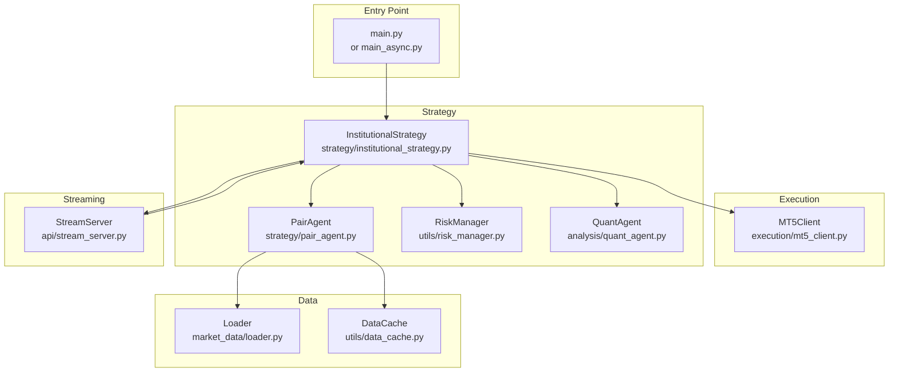
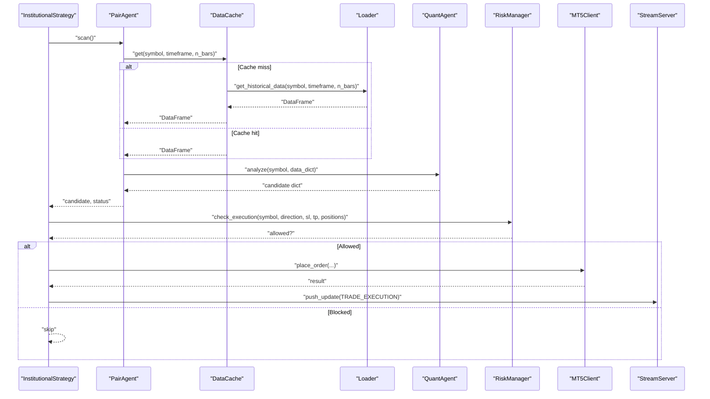
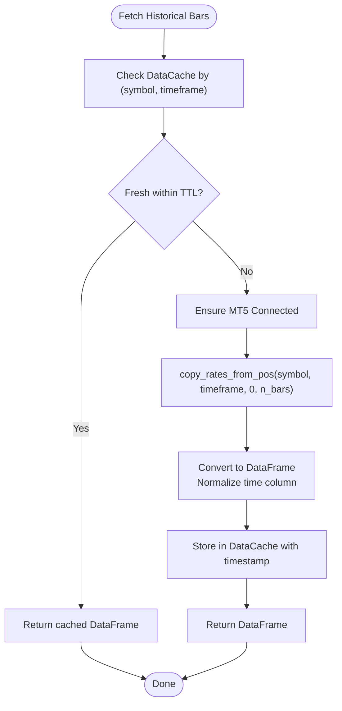
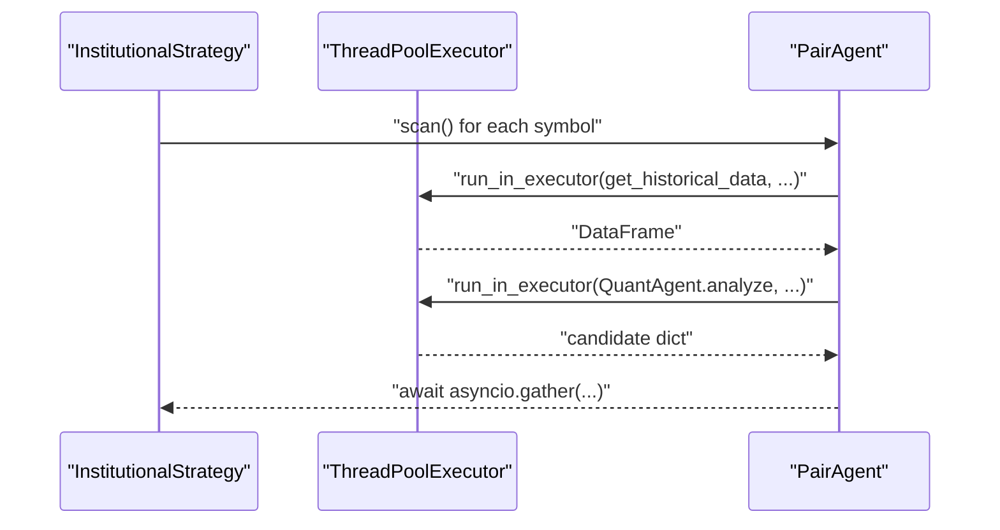
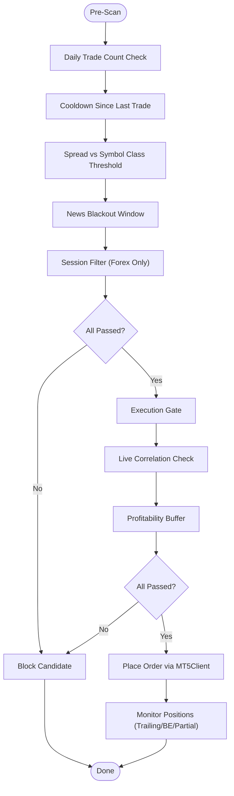
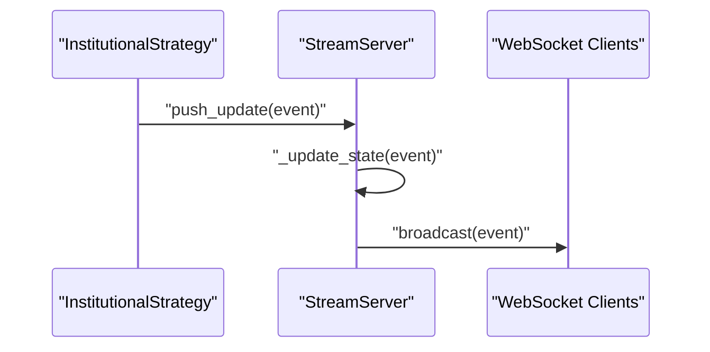
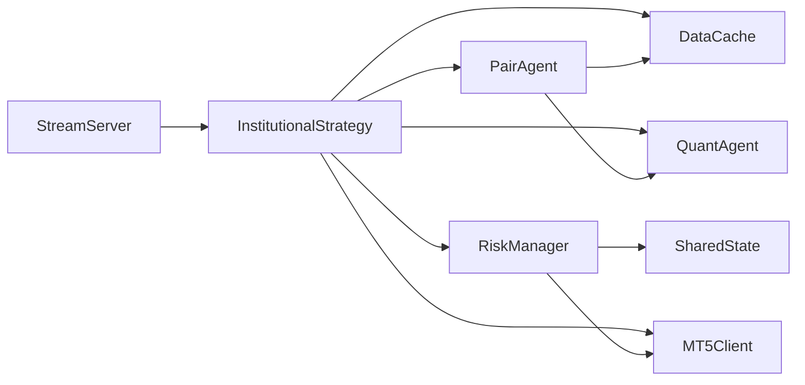

# Data Flow and Processing Patterns

<cite>
**Referenced Files in This Document**
- [main.py](file://main.py)
- [main_async.py](file://main_async.py)
- [stream_server.py](file://api/stream_server.py)
- [mt5_client.py](file://execution/mt5_client.py)
- [loader.py](file://market_data/loader.py)
- [data_cache.py](file://utils/data_cache.py)
- [institutional_strategy.py](file://strategy/institutional_strategy.py)
- [pair_agent.py](file://strategy/pair_agent.py)
- [async_utils.py](file://utils/async_utils.py)
- [shared_state.py](file://utils/shared_state.py)
- [settings.py](file://config/settings.py)
- [risk_manager.py](file://utils/risk_manager.py)
- [quant_agent.py](file://analysis/quant_agent.py)
</cite>

## Table of Contents
1. [Introduction](#introduction)
2. [Project Structure](#project-structure)
3. [Core Components](#core-components)
4. [Architecture Overview](#architecture-overview)
5. [Detailed Component Analysis](#detailed-component-analysis)
6. [Dependency Analysis](#dependency-analysis)
7. [Performance Considerations](#performance-considerations)
8. [Troubleshooting Guide](#troubleshooting-guide)
9. [Conclusion](#conclusion)

## Introduction
This document explains the data flow architecture and processing patterns of the trading system. It covers the pipeline from market data ingestion to trade execution, including caching strategies, asynchronous processing, concurrent data handling, validation, error handling, and recovery mechanisms. It also provides practical guidance for optimizing throughput and managing memory in production.

## Project Structure
The system is organized around a central orchestrator that coordinates per-symbol agents, a shared risk manager, and a streaming API for dashboards. Data acquisition is decoupled via a loader and cache layer, while execution integrates with MetaTrader 5.

**Diagram sources**
- [main.py](file://main.py#L19-L122)
- [main_async.py](file://main_async.py#L20-L97)
- [mt5_client.py](file://execution/mt5_client.py#L12-L385)
- [loader.py](file://market_data/loader.py#L40-L83)
- [data_cache.py](file://utils/data_cache.py#L16-L77)
- [institutional_strategy.py](file://strategy/institutional_strategy.py#L49-L500)
- [pair_agent.py](file://strategy/pair_agent.py#L22-L432)
- [risk_manager.py](file://utils/risk_manager.py#L14-L549)
- [quant_agent.py](file://analysis/quant_agent.py#L34-L294)
- [stream_server.py](file://api/stream_server.py#L176-L212)

**Section sources**
- [main.py](file://main.py#L19-L122)
- [main_async.py](file://main_async.py#L20-L97)
- [settings.py](file://config/settings.py#L1-L201)

## Core Components
- Data ingestion and caching: Loader fetches historical bars and DataCache applies TTL-based caching to reduce MT5 API calls.
- Strategy orchestration: InstitutionalStrategy coordinates per-symbol PairAgent instances, performs global gating, and executes trades.
- Asynchronous execution: run_in_executor runs blocking operations (e.g., MT5 calls) in threads to avoid blocking the event loop.
- Streaming and state: StreamServer maintains an in-memory state and broadcasts updates to connected clients.
- Risk management: RiskManager enforces pre-scan and execution gates, monitors positions, and tracks daily limits.
- Execution: MT5Client encapsulates MT5 connectivity, symbol detection, order placement, and position management.

**Section sources**
- [loader.py](file://market_data/loader.py#L40-L83)
- [data_cache.py](file://utils/data_cache.py#L16-L77)
- [institutional_strategy.py](file://strategy/institutional_strategy.py#L99-L330)
- [pair_agent.py](file://strategy/pair_agent.py#L71-L295)
- [async_utils.py](file://utils/async_utils.py#L9-L45)
- [stream_server.py](file://api/stream_server.py#L176-L212)
- [risk_manager.py](file://utils/risk_manager.py#L51-L295)
- [mt5_client.py](file://execution/mt5_client.py#L18-L385)

## Architecture Overview
The system follows a pipeline pattern:
- Ingestion: Loader retrieves historical bars; DataCache serves fresh data or refreshes on TTL expiration.
- Analysis: PairAgent fetches data asynchronously, delegates ML and technical analysis to QuantAgent, and applies regime filters.
- Decision: InstitutionalStrategy aggregates per-symbol candidates, applies global risk checks, and selects the best candidate.
- Execution: RiskManager validates and sizes positions; MT5Client places orders; StreamServer pushes updates.
- Monitoring: RiskManager continuously monitors active positions and triggers trailing/BE/partial exits.

**Diagram sources**
- [institutional_strategy.py](file://strategy/institutional_strategy.py#L99-L330)
- [pair_agent.py](file://strategy/pair_agent.py#L71-L295)
- [data_cache.py](file://utils/data_cache.py#L30-L48)
- [loader.py](file://market_data/loader.py#L40-L83)
- [quant_agent.py](file://analysis/quant_agent.py#L109-L159)
- [risk_manager.py](file://utils/risk_manager.py#L237-L295)
- [mt5_client.py](file://execution/mt5_client.py#L216-L292)
- [stream_server.py](file://api/stream_server.py#L176-L212)

## Detailed Component Analysis

### Data Ingestion Pipeline
- Loader initializes MT5 and fetches historical bars per symbol/timeframe, returning DataFrames with normalized timestamps.
- Multi-timeframe support consolidates M15/H1/H4 datasets for trend and confluence analysis.
- DataCache wraps Loader with TTL-based caching keyed by symbol and timeframe, reducing repeated MT5 calls.

**Diagram sources**
- [loader.py](file://market_data/loader.py#L24-L83)
- [data_cache.py](file://utils/data_cache.py#L30-L48)

**Section sources**
- [loader.py](file://market_data/loader.py#L40-L83)
- [data_cache.py](file://utils/data_cache.py#L16-L77)

### Asynchronous Processing and Concurrency
- run_in_executor runs blocking MT5 calls inside a thread pool, preventing event loop stalls.
- InstitutionalStrategy scans all PairAgent instances concurrently using asyncio.gather, aggregating results and exceptions.
- PairAgent performs multi-timeframe fetching and analysis asynchronously, then constructs candidates with volatility-adjusted TP/SL distances.

**Diagram sources**
- [async_utils.py](file://utils/async_utils.py#L9-L16)
- [institutional_strategy.py](file://strategy/institutional_strategy.py#L132-L140)
- [pair_agent.py](file://strategy/pair_agent.py#L116-L139)

**Section sources**
- [async_utils.py](file://utils/async_utils.py#L9-L45)
- [institutional_strategy.py](file://strategy/institutional_strategy.py#L99-L140)
- [pair_agent.py](file://strategy/pair_agent.py#L71-L139)

### Risk Management and Execution Validation
- Pre-scan checks include daily limits, cooldowns, spread thresholds, news blackout windows, and session filters.
- Execution checks enforce correlation conflicts, profitability buffers, and concurrent trade caps.
- Position management supports trailing stops, break-even moves, and partial closes based on ATR or fixed percentages.

**Diagram sources**
- [risk_manager.py](file://utils/risk_manager.py#L51-L163)
- [risk_manager.py](file://utils/risk_manager.py#L237-L295)
- [risk_manager.py](file://utils/risk_manager.py#L399-L548)

**Section sources**
- [risk_manager.py](file://utils/risk_manager.py#L51-L295)
- [risk_manager.py](file://utils/risk_manager.py#L399-L548)

### Streaming and Real-Time Updates
- StreamServer maintains an in-memory state snapshot and broadcasts updates to WebSocket clients upon events.
- push_update updates state atomically and schedules broadcast on the running event loop from background threads.

**Diagram sources**
- [stream_server.py](file://api/stream_server.py#L176-L212)
- [institutional_strategy.py](file://strategy/institutional_strategy.py#L185-L236)

**Section sources**
- [stream_server.py](file://api/stream_server.py#L176-L212)
- [institutional_strategy.py](file://strategy/institutional_strategy.py#L185-L236)

### Data Transformation Workflows and Batch Techniques
- Feature engineering is applied in QuantAgent prior to scoring, ensuring consistent input for ML models.
- Multi-timeframe data is fetched in batches per symbol and merged into a dictionary keyed by timeframe.
- Position and account snapshots are transformed into compact dictionaries for the dashboard.

**Section sources**
- [quant_agent.py](file://analysis/quant_agent.py#L109-L159)
- [pair_agent.py](file://strategy/pair_agent.py#L123-L137)
- [stream_server.py](file://api/stream_server.py#L105-L140)

### Real-Time Data Streaming
- The dashboard subscribes to WebSocket endpoints and receives live updates for account, positions, trades, and scan summaries.
- The server auto-discovers an open port and starts Uvicorn in a background thread.

**Section sources**
- [stream_server.py](file://api/stream_server.py#L69-L80)
- [stream_server.py](file://api/stream_server.py#L153-L173)

### Error Handling and Recovery
- Exceptions in parallel scans are captured and reported per symbol without failing the entire cycle.
- Data fetch failures return None with a status message; downstream logic skips candidates accordingly.
- RiskManager’s execution checks suppress noisy re-quotes and gracefully handle missing data.
- SharedState persists daily counts and circuit breakers across restarts to maintain continuity.

**Section sources**
- [institutional_strategy.py](file://strategy/institutional_strategy.py#L144-L150)
- [pair_agent.py](file://strategy/pair_agent.py#L141-L143)
- [risk_manager.py](file://utils/risk_manager.py#L289-L293)
- [shared_state.py](file://utils/shared_state.py#L42-L75)

## Dependency Analysis
Key dependencies and coupling:
- InstitutionalStrategy depends on PairAgent, RiskManager, QuantAgent, DataCache, and MT5Client.
- PairAgent depends on Loader/DataCache, QuantAgent, MarketAnalyst, and TradeJournal.
- StreamServer depends on push_update and FastAPI/Uvicorn; it is decoupled from MT5 execution.
- RiskManager depends on SharedState and MT5Client for history queries.

**Diagram sources**
- [institutional_strategy.py](file://strategy/institutional_strategy.py#L49-L86)
- [pair_agent.py](file://strategy/pair_agent.py#L22-L53)
- [risk_manager.py](file://utils/risk_manager.py#L14-L38)
- [shared_state.py](file://utils/shared_state.py#L23-L40)
- [stream_server.py](file://api/stream_server.py#L176-L212)

**Section sources**
- [institutional_strategy.py](file://strategy/institutional_strategy.py#L49-L86)
- [pair_agent.py](file://strategy/pair_agent.py#L22-L53)
- [risk_manager.py](file://utils/risk_manager.py#L14-L38)
- [shared_state.py](file://utils/shared_state.py#L23-L40)
- [stream_server.py](file://api/stream_server.py#L176-L212)

## Performance Considerations
- Reduce MT5 API calls: leverage DataCache TTLs to reuse recent datasets; tune TTLs per timeframe to balance freshness and cost.
- Parallelism: keep the number of concurrent PairAgent scans aligned with CPU and MT5 capacity; use return_exceptions to prevent cascade failures.
- I/O-bound work: continue offloading MT5 calls via run_in_executor; avoid long-running CPU work in the event loop.
- Memory: avoid retaining unnecessary historical slices; trim rolling buffers (e.g., last 200 events) to bound memory growth.
- Network: StreamServer broadcasts only essential fields; compress payloads if bandwidth becomes constrained.
- Position sizing: use Kelly-based scaling judiciously; clamp tail-risk symbols to protect capital.

[No sources needed since this section provides general guidance]

## Troubleshooting Guide
Common issues and remedies:
- MT5 connection failures: verify credentials and terminal path; ensure initialize/login succeed before proceeding.
- No symbols detected: confirm Exness suffix availability and symbol visibility; the detector enables symbols automatically.
- High latency or timeouts: reduce concurrent fetches; increase COOLDOWN_SECONDS; monitor spread thresholds.
- Dashboard not updating: check WebSocket endpoint health and CORS configuration; confirm push_update is invoked with proper event types.
- Excessive API calls: review DataCache TTLs and invalidation patterns; invalidate selectively by symbol or timeframe.
- Risk gates blocking trades: inspect daily loss limits, kill switches, payoff mandates, and correlation conflicts.

**Section sources**
- [mt5_client.py](file://execution/mt5_client.py#L18-L27)
- [mt5_client.py](file://execution/mt5_client.py#L29-L101)
- [stream_server.py](file://api/stream_server.py#L153-L173)
- [data_cache.py](file://utils/data_cache.py#L50-L64)
- [risk_manager.py](file://utils/risk_manager.py#L51-L163)

## Conclusion
The system employs a robust pipeline combining asynchronous concurrency, intelligent caching, and strict risk controls. By leveraging DataCache, run_in_executor, and per-symbol agents, it scales across many instruments while maintaining responsiveness. The StreamServer provides real-time observability, and SharedState ensures continuity across restarts. For production, focus on tuning cache TTLs, controlling concurrency, and monitoring risk gates to achieve optimal throughput and safety.