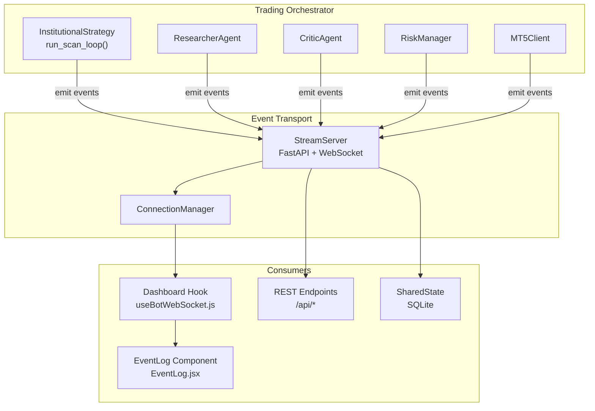
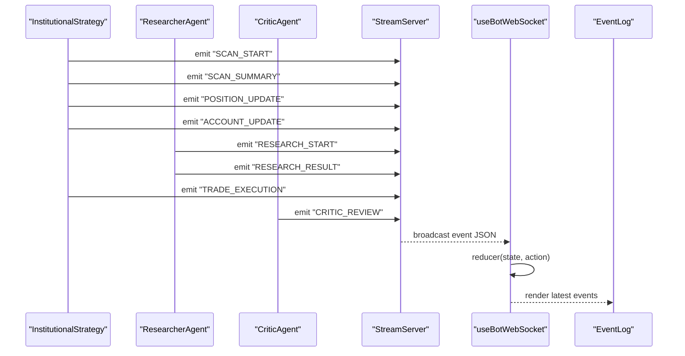
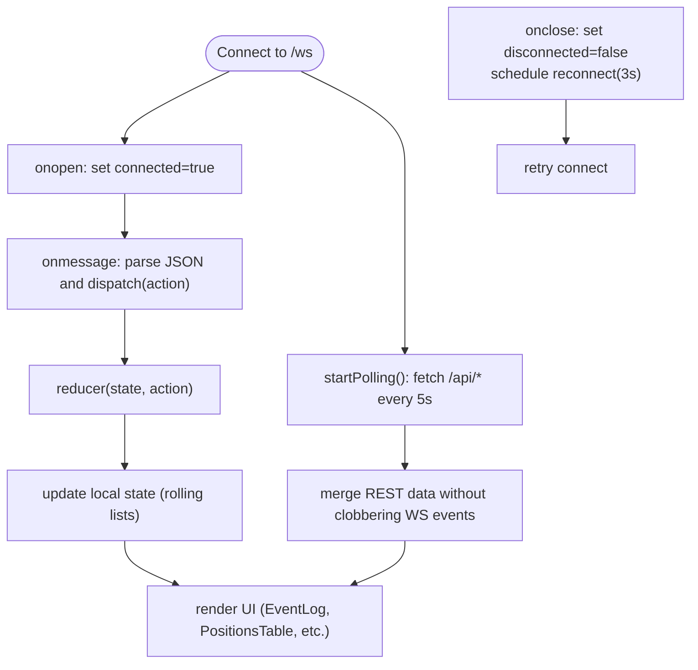
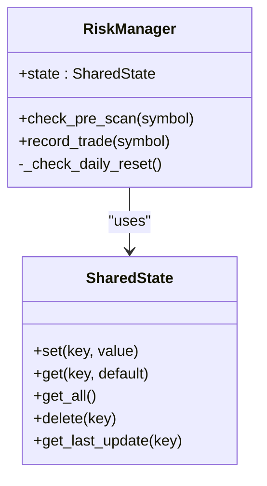
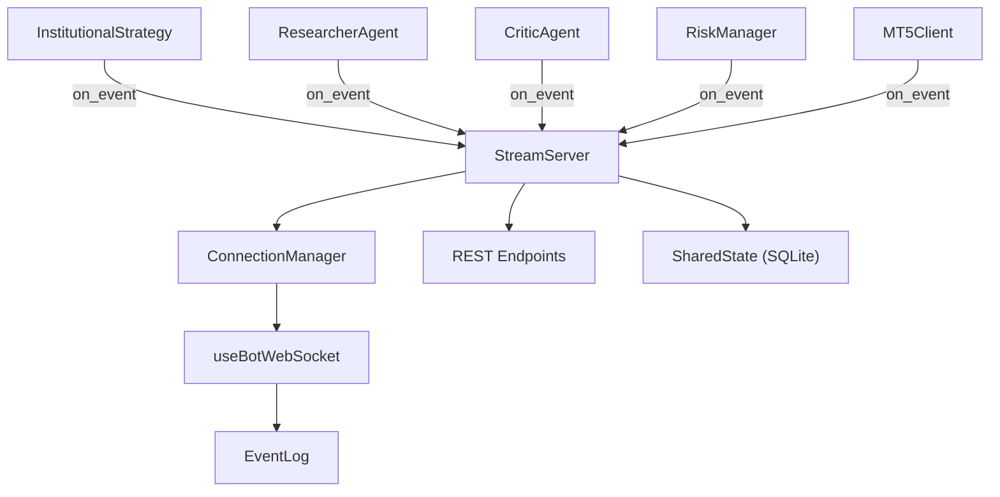

# Event-Driven Communication Patterns

<cite>
**Referenced Files in This Document**
- [stream_server.py](file://api/stream_server.py)
- [useBotWebSocket.js](file://dashboard/src/hooks/useBotWebSocket.js)
- [EventLog.jsx](file://dashboard/src/components/EventLog.jsx)
- [institutional_strategy.py](file://strategy/institutional_strategy.py)
- [risk_manager.py](file://utils/risk_manager.py)
- [mt5_client.py](file://execution/mt5_client.py)
- [shared_state.py](file://utils/shared_state.py)
- [main.py](file://main.py)
- [researcher_agent.py](file://analysis/researcher_agent.py)
- [critic_agent.py](file://analysis/critic_agent.py)
</cite>

## Table of Contents
1. [Introduction](#introduction)
2. [Project Structure](#project-structure)
3. [Core Components](#core-components)
4. [Architecture Overview](#architecture-overview)
5. [Detailed Component Analysis](#detailed-component-analysis)
6. [Dependency Analysis](#dependency-analysis)
7. [Performance Considerations](#performance-considerations)
8. [Troubleshooting Guide](#troubleshooting-guide)
9. [Conclusion](#conclusion)

## Introduction
This document explains the event-driven communication patterns powering the trading system. It covers how events are created by the trading orchestrator, propagated to the WebSocket dashboard, and consumed by monitoring and risk systems. It also documents event types, message formats, routing strategies, ordering guarantees, fault tolerance, and performance considerations for high-frequency streams.

## Project Structure
The event system spans three primary layers:
- Event producers: Trading orchestrator and agents emit structured events.
- Event transport: A FastAPI WebSocket server broadcasts events to connected clients.
- Event consumers: The React dashboard subscribes and renders live updates; REST endpoints provide snapshots; shared state persists cross-agent coordination.



**Diagram sources**
- [stream_server.py](file://api/stream_server.py#L37-L65)
- [useBotWebSocket.js](file://dashboard/src/hooks/useBotWebSocket.js#L105-L155)
- [EventLog.jsx](file://dashboard/src/components/EventLog.jsx#L35-L60)
- [institutional_strategy.py](file://strategy/institutional_strategy.py#L99-L236)
- [researcher_agent.py](file://analysis/researcher_agent.py#L17-L82)
- [critic_agent.py](file://analysis/critic_agent.py#L17-L52)
- [risk_manager.py](file://utils/risk_manager.py#L14-L40)
- [mt5_client.py](file://execution/mt5_client.py#L12-L27)
- [shared_state.py](file://utils/shared_state.py#L23-L94)

**Section sources**
- [stream_server.py](file://api/stream_server.py#L1-L212)
- [useBotWebSocket.js](file://dashboard/src/hooks/useBotWebSocket.js#L1-L156)
- [EventLog.jsx](file://dashboard/src/components/EventLog.jsx#L1-L60)
- [institutional_strategy.py](file://strategy/institutional_strategy.py#L1-L500)
- [risk_manager.py](file://utils/risk_manager.py#L1-L549)
- [mt5_client.py](file://execution/mt5_client.py#L1-L385)
- [shared_state.py](file://utils/shared_state.py#L1-L110)
- [main.py](file://main.py#L1-L122)
- [researcher_agent.py](file://analysis/researcher_agent.py#L1-L132)
- [critic_agent.py](file://analysis/critic_agent.py#L1-L141)

## Core Components
- StreamServer: FastAPI app hosting WebSocket and REST endpoints; maintains in-memory state and broadcasts events.
- ConnectionManager: Tracks active WebSocket connections and performs broadcast with cleanup.
- useBotWebSocket: React hook that connects to WebSocket, polls REST endpoints, merges state, and manages reconnection.
- InstitutionalStrategy: Emits lifecycle and operational events (scan, research, trade execution, position/account updates).
- ResearcherAgent and CriticAgent: Emit research outcomes and post-mortem reviews.
- RiskManager and MT5Client: Participate in risk gating and order execution; can emit events via the orchestrator.
- SharedState: Persistent key-value store enabling cross-agent coordination and circuit breaker signaling.

**Section sources**
- [stream_server.py](file://api/stream_server.py#L37-L65)
- [useBotWebSocket.js](file://dashboard/src/hooks/useBotWebSocket.js#L105-L155)
- [institutional_strategy.py](file://strategy/institutional_strategy.py#L99-L236)
- [researcher_agent.py](file://analysis/researcher_agent.py#L17-L82)
- [critic_agent.py](file://analysis/critic_agent.py#L17-L52)
- [risk_manager.py](file://utils/risk_manager.py#L14-L40)
- [mt5_client.py](file://execution/mt5_client.py#L12-L27)
- [shared_state.py](file://utils/shared_state.py#L23-L94)

## Architecture Overview
The system uses a publish-subscribe model:
- Producers call a common event emission interface (on_event) to enqueue events.
- The StreamServer stores a rolling snapshot of recent events and pushes them to all WebSocket clients.
- The dashboard consumes WebSocket messages and periodically refreshes from REST endpoints to ensure eventual consistency.



**Diagram sources**
- [institutional_strategy.py](file://strategy/institutional_strategy.py#L122-L236)
- [researcher_agent.py](file://analysis/researcher_agent.py#L26-L82)
- [critic_agent.py](file://analysis/critic_agent.py#L37-L52)
- [stream_server.py](file://api/stream_server.py#L51-L62)
- [useBotWebSocket.js](file://dashboard/src/hooks/useBotWebSocket.js#L129-L134)
- [EventLog.jsx](file://dashboard/src/components/EventLog.jsx#L35-L60)

## Detailed Component Analysis

### Event Types and Message Formats
Events are JSON objects with a type field and a timestamp. The following event types are emitted:

- SCAN_START
  - Fields: type, count, timestamp
  - Emitted by: InstitutionalStrategy at the start of a scanning cycle

- SCAN_SUMMARY
  - Fields: type, symbols (mapping of symbol to reason/status), count, candidates, timestamp
  - Emitted by: InstitutionalStrategy after scanning

- POSITION_UPDATE
  - Fields: type, positions (array of position objects), timestamp
  - Emitted by: InstitutionalStrategy with live positions

- ACCOUNT_UPDATE
  - Fields: type, account (balance, equity, profit, currency, leverage, day_pl), timestamp
  - Emitted by: InstitutionalStrategy with live account info

- RESEARCH_START
  - Fields: type, symbol, data (candidate), timestamp
  - Emitted by: InstitutionalStrategy before research

- RESEARCH_RESULT
  - Fields: type, symbol, action, confidence, reason, timestamp
  - Emitted by: ResearcherAgent after analysis

- TRADE_EXECUTION
  - Fields: type, symbol, direction, price, lot, timestamp
  - Emitted by: InstitutionalStrategy after order placement

- CRITIC_REVIEW
  - Fields: type, symbol, score, lesson, analysis, timestamp
  - Emitted by: CriticAgent after post-mortem

Routing and delivery:
- All events are broadcast via WebSocket and stored in the server’s rolling event log.
- REST endpoints (/api/account, /api/positions, /api/trades, /api/scan, /api/state) serve snapshots for clients that poll.

**Section sources**
- [institutional_strategy.py](file://strategy/institutional_strategy.py#L122-L236)
- [researcher_agent.py](file://analysis/researcher_agent.py#L26-L82)
- [critic_agent.py](file://analysis/critic_agent.py#L37-L52)
- [stream_server.py](file://api/stream_server.py#L86-L141)
- [stream_server.py](file://api/stream_server.py#L185-L212)

### WebSocket Event System (Dashboard Integration)
The React dashboard uses a WebSocket hook to subscribe to live events and a polling mechanism to refresh account and positions.

Subscription pattern:
- Connect to ws://localhost:8000/ws on mount.
- On message, parse JSON and dispatch to a reducer keyed by event type.
- On open/close, track connection state and auto-reconnect.

Rolling state:
- Events are kept in a rolling list (max 200).
- Recent trades are kept in a rolling list (max 50).
- Snapshot on connect sends STATE_SNAPSHOT with current account, positions, scan summary, recent trades, and events.

REST fallback:
- Every 5 seconds, fetch /api/positions, /api/account, and /api/trades to merge and keep UI fresh.



**Diagram sources**
- [useBotWebSocket.js](file://dashboard/src/hooks/useBotWebSocket.js#L118-L152)
- [useBotWebSocket.js](file://dashboard/src/hooks/useBotWebSocket.js#L87-L103)
- [stream_server.py](file://api/stream_server.py#L44-L45)

**Section sources**
- [useBotWebSocket.js](file://dashboard/src/hooks/useBotWebSocket.js#L1-L156)
- [EventLog.jsx](file://dashboard/src/components/EventLog.jsx#L1-L60)
- [stream_server.py](file://api/stream_server.py#L37-L65)

### Event Creation and Propagation Workflow
The orchestrator emits events at key moments in the trading cycle. These events propagate to the WebSocket server and are broadcast to all subscribers.

```mermaid
sequenceDiagram
participant Loop as "run_scan_loop()"
participant Strat as "InstitutionalStrategy"
participant Server as "StreamServer"
participant Hook as "useBotWebSocket"
participant Store as "In-Memory State"
Loop->>Strat : start cycle
Strat->>Server : push_update({type : "SCAN_START", ...})
Strat->>Server : push_update({type : "SCAN_SUMMARY", ...})
Strat->>Server : push_update({type : "POSITION_UPDATE", ...})
Strat->>Server : push_update({type : "ACCOUNT_UPDATE", ...})
Note over Strat,Server : During candidate selection and research
Strat->>Server : push_update({type : "RESEARCH_START", ...})
Strat->>Server : push_update({type : "RESEARCH_RESULT", ...})
alt trade executes
Strat->>Server : push_update({type : "TRADE_EXECUTION", ...})
end
Server->>Store : _update_state(data)
Server->>Hook : broadcast(event)
```

**Diagram sources**
- [institutional_strategy.py](file://strategy/institutional_strategy.py#L122-L236)
- [stream_server.py](file://api/stream_server.py#L177-L183)
- [stream_server.py](file://api/stream_server.py#L185-L212)

**Section sources**
- [institutional_strategy.py](file://strategy/institutional_strategy.py#L99-L236)
- [stream_server.py](file://api/stream_server.py#L176-L212)

### Cross-Agent Coordination via Shared State
SharedState provides a persistent whiteboard for agents to coordinate without tight coupling. It supports:
- set(key, value): persist JSON-serializable values with timestamps
- get(key): retrieve last-known value
- get_all(): snapshot all keys
- delete(key): remove entries
- get_last_update(key): last updated timestamp

RiskManager reads/writes shared state for:
- Circuit breaker controls (e.g., global trading pause)
- Daily trade counts and reset logic
- Kill switch and payoff mandate enforcement



**Diagram sources**
- [shared_state.py](file://utils/shared_state.py#L23-L110)
- [risk_manager.py](file://utils/risk_manager.py#L14-L40)

**Section sources**
- [shared_state.py](file://utils/shared_state.py#L1-L110)
- [risk_manager.py](file://utils/risk_manager.py#L1-L549)

### Real-Time Data Distribution and REST Snapshots
The StreamServer exposes REST endpoints for clients that cannot or prefer not to use WebSocket:
- GET /api/account: live account snapshot
- GET /api/positions: live positions snapshot
- GET /api/trades: recent trades rolling list
- GET /api/scan: scan summary snapshot
- GET /api/state: full in-memory state snapshot

These endpoints read from the same in-memory state updated by push_update/_update_state, ensuring consistency with WebSocket events.

**Section sources**
- [stream_server.py](file://api/stream_server.py#L86-L141)
- [stream_server.py](file://api/stream_server.py#L185-L212)

### Event Ordering Guarantees and Fault Tolerance
- Ordering: Events are emitted in the order produced by the orchestrator and agents. The WebSocket broadcast is synchronous per-client within the loop iteration. There is no inter-client ordering guarantee beyond per-iteration emission order.
- Delivery: The ConnectionManager attempts to send to each client and removes dead sockets. Clients reconnect automatically after a delay.
- Consistency: The dashboard merges REST polling results with WebSocket events to mitigate transient failures.

**Section sources**
- [stream_server.py](file://api/stream_server.py#L51-L62)
- [useBotWebSocket.js](file://dashboard/src/hooks/useBotWebSocket.js#L136-L142)
- [useBotWebSocket.js](file://dashboard/src/hooks/useBotWebSocket.js#L87-L103)

## Dependency Analysis
The event system depends on:
- FastAPI and Uvicorn for the WebSocket server
- asyncio for asynchronous orchestration
- React hooks for client-side subscription and state management
- SQLite-backed SharedState for cross-agent persistence



**Diagram sources**
- [institutional_strategy.py](file://strategy/institutional_strategy.py#L54-L94)
- [researcher_agent.py](file://analysis/researcher_agent.py#L13-L16)
- [critic_agent.py](file://analysis/critic_agent.py#L11-L15)
- [risk_manager.py](file://utils/risk_manager.py#L14-L18)
- [mt5_client.py](file://execution/mt5_client.py#L12-L27)
- [stream_server.py](file://api/stream_server.py#L37-L65)
- [shared_state.py](file://utils/shared_state.py#L23-L94)

**Section sources**
- [institutional_strategy.py](file://strategy/institutional_strategy.py#L1-L500)
- [researcher_agent.py](file://analysis/researcher_agent.py#L1-L132)
- [critic_agent.py](file://analysis/critic_agent.py#L1-L141)
- [risk_manager.py](file://utils/risk_manager.py#L1-L549)
- [mt5_client.py](file://execution/mt5_client.py#L1-L385)
- [stream_server.py](file://api/stream_server.py#L1-L212)
- [shared_state.py](file://utils/shared_state.py#L1-L110)

## Performance Considerations
- Event volume: The server maintains rolling logs (events: 200, recent_trades: 50). Keep payload sizes reasonable to avoid memory pressure.
- Broadcast overhead: Broadcasting to many clients increases CPU usage. Consider client-side filtering or partitioned channels if scaling.
- REST polling: The dashboard polls every 5s; adjust interval based on network and UI responsiveness needs.
- WebSocket keep-alive: The endpoint ignores received messages; ensure clients handle ping/pong at the framework level if needed.
- Thread-safety: push_update updates state and schedules broadcast on the running loop using asyncio.run_coroutine_threadsafe.

[No sources needed since this section provides general guidance]

## Troubleshooting Guide
Common issues and remedies:
- WebSocket disconnects: The client reconnects automatically after 3 seconds. Verify server availability and firewall rules.
- Missing live updates: Ensure the orchestrator is emitting events and push_update is invoked. Confirm REST endpoints are reachable.
- Stale account/positions: The dashboard polls REST endpoints; if the server is down, REST will fail silently. Check server logs and restart if necessary.
- Shared state anomalies: Verify SharedState database path and permissions. Confirm keys used by RiskManager exist and are updated.

**Section sources**
- [useBotWebSocket.js](file://dashboard/src/hooks/useBotWebSocket.js#L136-L142)
- [stream_server.py](file://api/stream_server.py#L177-L183)
- [shared_state.py](file://utils/shared_state.py#L23-L94)

## Conclusion
The system employs a straightforward, robust event-driven architecture:
- Producers emit typed events with timestamps.
- A WebSocket server distributes events to clients and serves REST snapshots.
- The dashboard merges WebSocket and REST data for resilience.
- SharedState enables cross-agent coordination without tight coupling.
This design balances simplicity, observability, and scalability for real-time trading dashboards and monitoring.