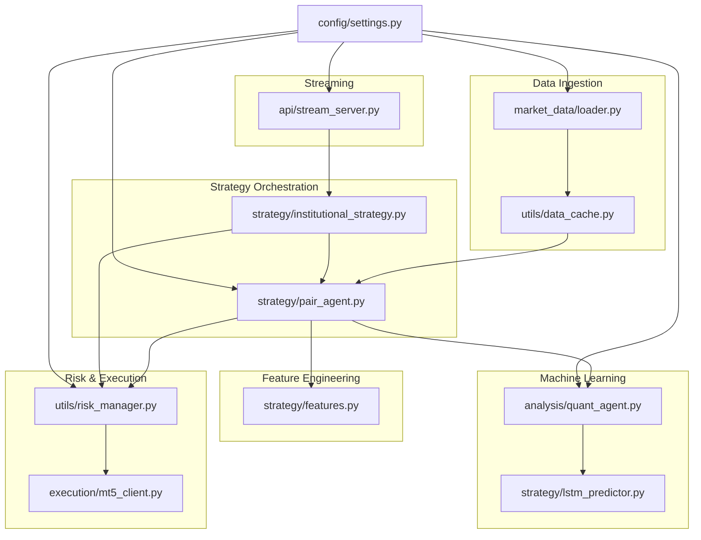
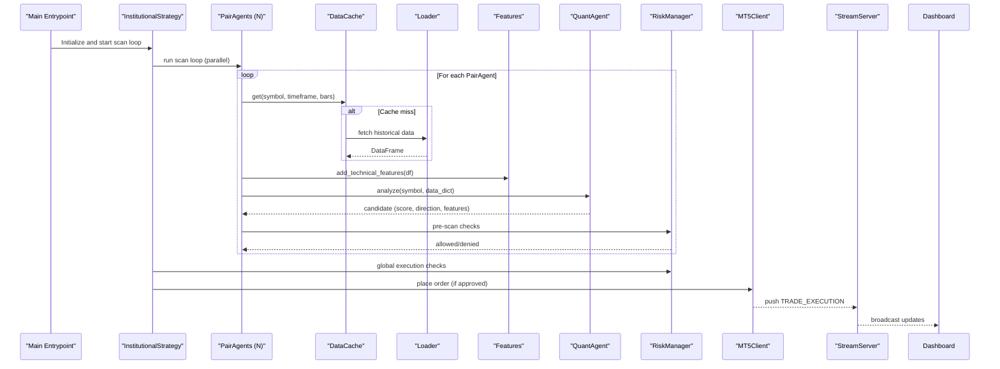
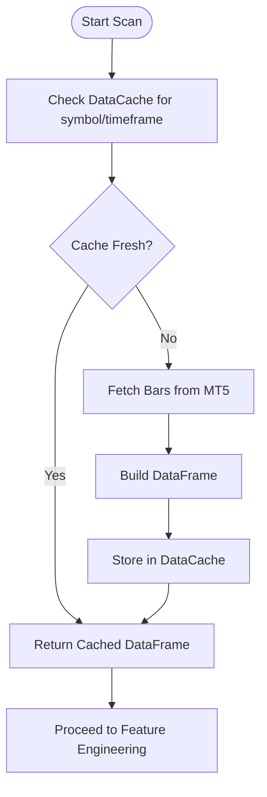
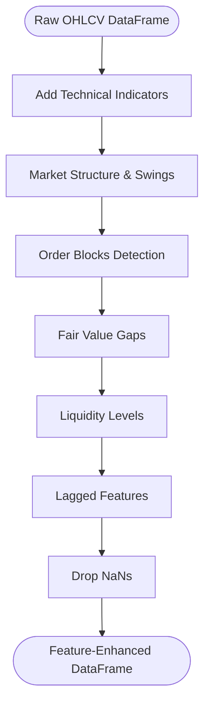
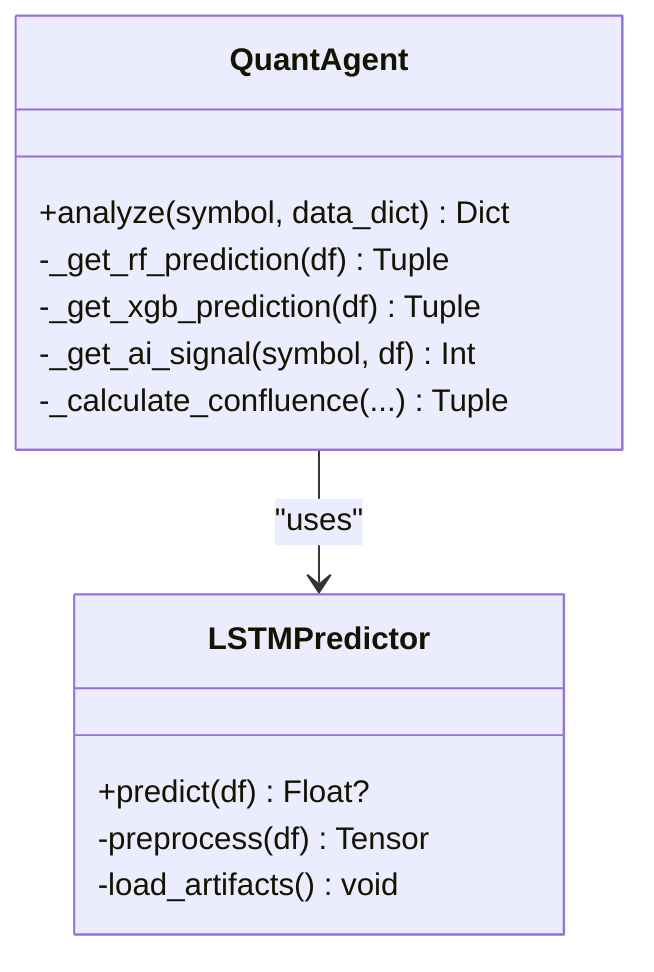
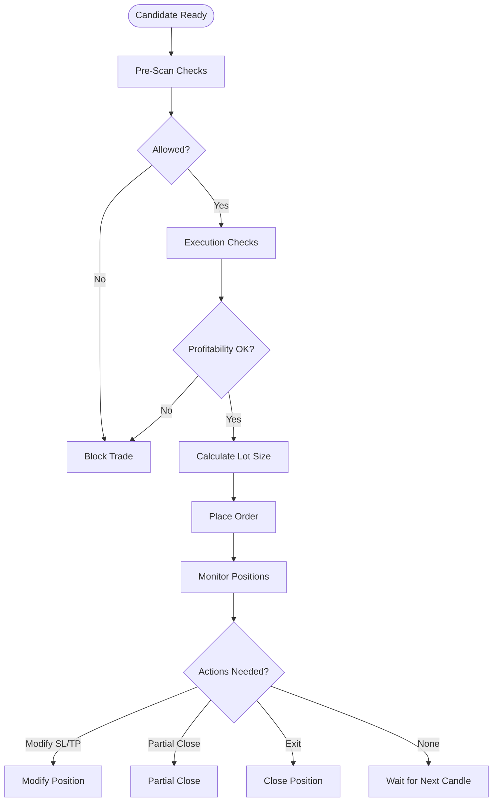
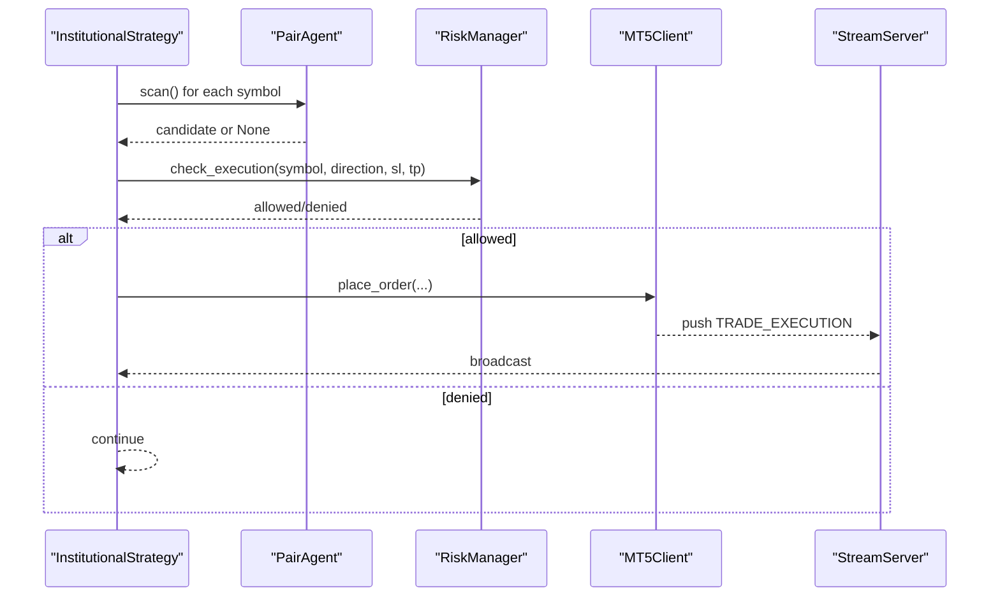
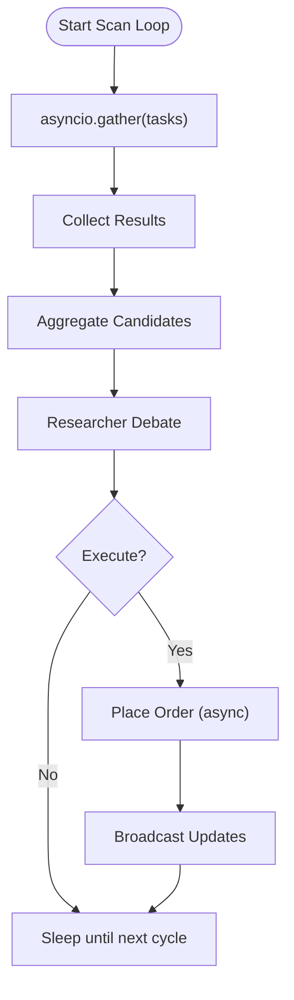
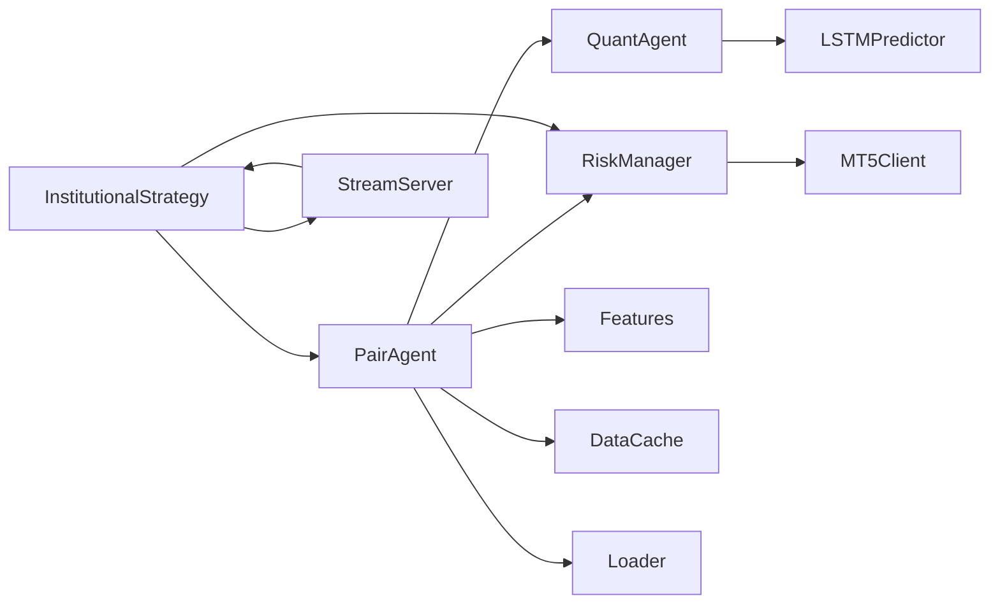

# Pipeline Processing Architecture

<cite>
**Referenced Files in This Document**
- [main.py](file://main.py)
- [main_async.py](file://main_async.py)
- [market_data/loader.py](file://market_data/loader.py)
- [strategy/features.py](file://strategy/features.py)
- [strategy/lstm_predictor.py](file://strategy/lstm_predictor.py)
- [strategy/institutional_strategy.py](file://strategy/institutional_strategy.py)
- [strategy/pair_agent.py](file://strategy/pair_agent.py)
- [analysis/quant_agent.py](file://analysis/quant_agent.py)
- [execution/mt5_client.py](file://execution/mt5_client.py)
- [utils/risk_manager.py](file://utils/risk_manager.py)
- [utils/async_utils.py](file://utils/async_utils.py)
- [utils/data_cache.py](file://utils/data_cache.py)
- [api/stream_server.py](file://api/stream_server.py)
- [config/settings.py](file://config/settings.py)
</cite>

## Table of Contents
1. [Introduction](#introduction)
2. [Project Structure](#project-structure)
3. [Core Components](#core-components)
4. [Architecture Overview](#architecture-overview)
5. [Detailed Component Analysis](#detailed-component-analysis)
6. [Dependency Analysis](#dependency-analysis)
7. [Performance Considerations](#performance-considerations)
8. [Troubleshooting Guide](#troubleshooting-guide)
9. [Conclusion](#conclusion)

## Introduction
This document describes the pipeline processing architecture used in the trading system. It explains the end-to-end workflow from market data ingestion through analysis to trade execution, detailing each stage’s responsibilities, data transformations, and integration points. The system employs an asynchronous model enabling parallel processing across multiple trading pairs, with robust risk controls, ML inference, and real-time dashboards.

## Project Structure
The system is organized around a modular architecture:
- Data ingestion and caching: market_data loader and data cache
- Feature engineering: technical indicators and derived signals
- Machine learning inference: Random Forest/XGBoost and optional LSTM/Lag-Llama
- Strategy orchestration: InstitutionalStrategy coordinates PairAgents
- Risk management: centralized checks and position sizing
- Execution: MT5 client wrapper for orders and position management
- Streaming: WebSocket server for live dashboard updates
- Configuration: environment-driven settings

**Diagram sources**
- [market_data/loader.py](file://market_data/loader.py#L1-L83)
- [utils/data_cache.py](file://utils/data_cache.py#L1-L77)
- [strategy/features.py](file://strategy/features.py#L1-L242)
- [analysis/quant_agent.py](file://analysis/quant_agent.py#L1-L294)
- [strategy/lstm_predictor.py](file://strategy/lstm_predictor.py#L1-L142)
- [strategy/pair_agent.py](file://strategy/pair_agent.py#L1-L432)
- [strategy/institutional_strategy.py](file://strategy/institutional_strategy.py#L1-L500)
- [utils/risk_manager.py](file://utils/risk_manager.py#L1-L549)
- [execution/mt5_client.py](file://execution/mt5_client.py#L1-L385)
- [api/stream_server.py](file://api/stream_server.py#L1-L212)
- [config/settings.py](file://config/settings.py#L1-L201)

**Section sources**
- [main.py](file://main.py#L1-L122)
- [main_async.py](file://main_async.py#L1-L103)
- [config/settings.py](file://config/settings.py#L1-L201)

## Core Components
- Market Data Loader: fetches historical bars from MT5 and supports multi-timeframe requests.
- Data Cache: TTL-based caching to reduce redundant MT5 calls.
- Feature Engineering: computes technical indicators and higher-level constructs (order blocks, fair value gaps, liquidity).
- Quant Agent: orchestrates ML inference (Random Forest/XGBoost), trend filters, and confluence scoring.
- Pair Agent: per-symbol agent that runs scans, applies filters, and constructs trade candidates.
- Institutional Strategy: coordinates scanning across all symbols, aggregates results, and executes decisions.
- Risk Manager: enforces pre-scan and execution checks, manages position sizing, and monitors open positions.
- MT5 Client: wrapper for MT5 operations including order placement, position modification, and account info.
- Stream Server: FastAPI WebSocket server broadcasting live updates to the dashboard.
- Async Utilities: thread pool executor and rate limiter for non-async operations.

**Section sources**
- [market_data/loader.py](file://market_data/loader.py#L1-L83)
- [utils/data_cache.py](file://utils/data_cache.py#L1-L77)
- [strategy/features.py](file://strategy/features.py#L1-L242)
- [analysis/quant_agent.py](file://analysis/quant_agent.py#L1-L294)
- [strategy/pair_agent.py](file://strategy/pair_agent.py#L1-L432)
- [strategy/institutional_strategy.py](file://strategy/institutional_strategy.py#L1-L500)
- [utils/risk_manager.py](file://utils/risk_manager.py#L1-L549)
- [execution/mt5_client.py](file://execution/mt5_client.py#L1-L385)
- [api/stream_server.py](file://api/stream_server.py#L1-L212)
- [utils/async_utils.py](file://utils/async_utils.py#L1-L45)

## Architecture Overview
The system operates as an asynchronous pipeline:
- Initialization connects to MT5, detects symbols, starts the stream server, and initializes the InstitutionalStrategy.
- The InstitutionalStrategy periodically runs a scan loop across all PairAgents concurrently.
- Each PairAgent fetches data (with caching), performs feature engineering, runs ML inference, applies regime and trend filters, and constructs a candidate with SL/TP distances.
- The InstitutionalStrategy aggregates candidates, applies global risk checks, and executes the best candidate after Researcher debate.
- Risk Manager continuously monitors open positions and triggers trailing stops, partial closes, and break-even moves.
- Stream Server broadcasts live updates to the dashboard.

**Diagram sources**
- [main.py](file://main.py#L19-L122)
- [strategy/institutional_strategy.py](file://strategy/institutional_strategy.py#L99-L330)
- [strategy/pair_agent.py](file://strategy/pair_agent.py#L71-L295)
- [utils/data_cache.py](file://utils/data_cache.py#L30-L48)
- [market_data/loader.py](file://market_data/loader.py#L40-L82)
- [strategy/features.py](file://strategy/features.py#L6-L98)
- [analysis/quant_agent.py](file://analysis/quant_agent.py#L109-L159)
- [utils/risk_manager.py](file://utils/risk_manager.py#L51-L163)
- [execution/mt5_client.py](file://execution/mt5_client.py#L216-L292)
- [api/stream_server.py](file://api/stream_server.py#L177-L212)

## Detailed Component Analysis

### Data Loading and Caching
- Loader: fetches historical bars for a given symbol/timeframe and converts to DataFrame with normalized timestamps.
- Multi-timeframe support: retrieves M15/H1/H4 datasets for regime and trend analysis.
- DataCache: caches datasets with per-timeframe TTLs to minimize MT5 API calls.

**Diagram sources**
- [utils/data_cache.py](file://utils/data_cache.py#L30-L48)
- [market_data/loader.py](file://market_data/loader.py#L40-L82)

**Section sources**
- [market_data/loader.py](file://market_data/loader.py#L40-L82)
- [utils/data_cache.py](file://utils/data_cache.py#L16-L77)

### Feature Engineering
- Computes institutional-grade technical indicators: RSI, stochastic RSI, Bollinger Bands, ATR, SMAs/EMAs, MACD, ADX, volume indicators, order flow delta, market structure, order blocks, fair value gaps, liquidity levels.
- Adds lagged features and cleans NaNs.
- Provides session-awareness for trading windows.

**Diagram sources**
- [strategy/features.py](file://strategy/features.py#L6-L98)
- [strategy/features.py](file://strategy/features.py#L101-L128)
- [strategy/features.py](file://strategy/features.py#L131-L170)
- [strategy/features.py](file://strategy/features.py#L173-L203)
- [strategy/features.py](file://strategy/features.py#L206-L224)

**Section sources**
- [strategy/features.py](file://strategy/features.py#L1-L242)

### Machine Learning Inference
- QuantAgent orchestrates:
  - Trend computation across M5/H1/H4.
  - Random Forest/XGBoost predictions for direction probability.
  - Optional AI signals from Lag-Llama or LSTM predictors.
  - Confluence scoring combining trend alignment, ML probability, AI signal, SMC (order blocks/FVG/liquidity), and ADX strength.
- LSTM predictor loads PyTorch models and scalers, preprocesses sequences, and returns predictions.

**Diagram sources**
- [analysis/quant_agent.py](file://analysis/quant_agent.py#L34-L294)
- [strategy/lstm_predictor.py](file://strategy/lstm_predictor.py#L9-L142)

**Section sources**
- [analysis/quant_agent.py](file://analysis/quant_agent.py#L109-L294)
- [strategy/lstm_predictor.py](file://strategy/lstm_predictor.py#L37-L142)

### Risk Assessment and Position Sizing
- Pre-scan checks: daily limit, kill switch, payoff mandate, daily loss cap, cooldown, spread thresholds, news blackout, session filters.
- Execution checks: max concurrent trades, live correlation conflicts, profitability estimation.
- Position sizing: dynamic lot calculation using account risk percent, confluence tiers, optional Kelly Criterion, and tail-risk caps.
- Active trade management: trailing stops, partial closes, break-even moves, and regime exits.

**Diagram sources**
- [utils/risk_manager.py](file://utils/risk_manager.py#L51-L163)
- [utils/risk_manager.py](file://utils/risk_manager.py#L237-L295)
- [utils/risk_manager.py](file://utils/risk_manager.py#L341-L396)
- [utils/risk_manager.py](file://utils/risk_manager.py#L399-L548)

**Section sources**
- [utils/risk_manager.py](file://utils/risk_manager.py#L1-L549)

### Execution Decision Making
- InstitutionalStrategy aggregates candidates, sorts by score and ML probability, and consults Researcher for debate.
- Executes when researcher agrees with direction or when score meets Sureshot threshold.
- Logs trades and updates shared state for daily counts and circuit breakers.

**Diagram sources**
- [strategy/institutional_strategy.py](file://strategy/institutional_strategy.py#L132-L184)
- [strategy/institutional_strategy.py](file://strategy/institutional_strategy.py#L331-L436)
- [utils/risk_manager.py](file://utils/risk_manager.py#L237-L295)
- [execution/mt5_client.py](file://execution/mt5_client.py#L216-L292)
- [api/stream_server.py](file://api/stream_server.py#L177-L212)

**Section sources**
- [strategy/institutional_strategy.py](file://strategy/institutional_strategy.py#L99-L330)
- [execution/mt5_client.py](file://execution/mt5_client.py#L216-L292)

### Asynchronous Processing Model
- PairAgents are scanned concurrently using asyncio.gather.
- Blocking operations (MT5 calls) are executed in a thread pool via run_in_executor.
- Stream server runs in a background thread and broadcasts updates to WebSocket clients.

**Diagram sources**
- [strategy/institutional_strategy.py](file://strategy/institutional_strategy.py#L132-L140)
- [utils/async_utils.py](file://utils/async_utils.py#L9-L16)
- [api/stream_server.py](file://api/stream_server.py#L153-L173)

**Section sources**
- [strategy/institutional_strategy.py](file://strategy/institutional_strategy.py#L99-L140)
- [utils/async_utils.py](file://utils/async_utils.py#L1-L45)
- [api/stream_server.py](file://api/stream_server.py#L1-L212)

## Dependency Analysis
Key dependencies and coupling:
- PairAgent depends on QuantAgent, MarketAnalyst, and RiskManager.
- InstitutionalStrategy composes PairAgents and coordinates with RiskManager and StreamServer.
- QuantAgent depends on feature engineering and optional LSTM/Lag-Llama predictors.
- RiskManager depends on MT5Client and shared state for daily tracking.
- StreamServer depends on FastAPI and asyncio loop for broadcasting.

**Diagram sources**
- [strategy/pair_agent.py](file://strategy/pair_agent.py#L27-L54)
- [strategy/institutional_strategy.py](file://strategy/institutional_strategy.py#L77-L86)
- [analysis/quant_agent.py](file://analysis/quant_agent.py#L34-L49)
- [strategy/lstm_predictor.py](file://strategy/lstm_predictor.py#L9-L35)
- [utils/risk_manager.py](file://utils/risk_manager.py#L14-L17)
- [execution/mt5_client.py](file://execution/mt5_client.py#L12-L27)
- [api/stream_server.py](file://api/stream_server.py#L1-L25)

**Section sources**
- [strategy/pair_agent.py](file://strategy/pair_agent.py#L1-L432)
- [strategy/institutional_strategy.py](file://strategy/institutional_strategy.py#L1-L500)
- [analysis/quant_agent.py](file://analysis/quant_agent.py#L1-L294)
- [utils/risk_manager.py](file://utils/risk_manager.py#L1-L549)
- [execution/mt5_client.py](file://execution/mt5_client.py#L1-L385)
- [api/stream_server.py](file://api/stream_server.py#L1-L212)

## Performance Considerations
- Parallelism: scanning all symbols concurrently reduces cycle time; ensure CPU/GPU resources can handle parallel inference.
- Caching: DataCache TTL minimizes MT5 API calls; tune TTLs per timeframe for accuracy/performance balance.
- Asynchronous execution: run_in_executor prevents blocking the event loop for MT5 calls; adjust thread pool size if needed.
- Memory management:
  - Drop unused columns before inference to reduce memory footprint.
  - Use scaled arrays and tensors efficiently; avoid repeated copies.
  - Clear or invalidate cache entries when switching symbols/timeframes.
- GPU acceleration: LSTM predictor selects CUDA if available; ensure drivers and torch are configured.
- Rate limiting: AsyncRateLimiter can throttle external API calls if integrated.
- Logging and telemetry: emit metrics for cycle duration, cache hit ratios, and inference latency.

[No sources needed since this section provides general guidance]

## Troubleshooting Guide
Common issues and debugging approaches:
- MT5 connectivity failures: verify credentials and terminal path; reconnect and retry.
- Insufficient data: increase bar counts or adjust minimum length checks; confirm loader returns non-empty DataFrames.
- Model loading errors: ensure model files exist and feature column lists match; handle missing scalers gracefully.
- High spread or volatility thresholds: adjust VOLATILITY_ATR_MIN_* and MAX_SPREAD_PIPS_* per asset class.
- Execution blocked by correlation or payoff mandate: review RiskManager logs and adjust thresholds or whitelist symbols.
- Dashboard not updating: check stream server startup and WebSocket connections; verify push_update is invoked.
- Performance bottlenecks:
  - Profile cycle durations and cache hit ratios.
  - Reduce concurrent threads if CPU-bound; leverage GPU for LSTM inference.
  - Disable optional predictors (Lag-Llama) if inference is slow.

**Section sources**
- [execution/mt5_client.py](file://execution/mt5_client.py#L18-L27)
- [market_data/loader.py](file://market_data/loader.py#L24-L59)
- [analysis/quant_agent.py](file://analysis/quant_agent.py#L52-L84)
- [utils/risk_manager.py](file://utils/risk_manager.py#L51-L163)
- [api/stream_server.py](file://api/stream_server.py#L153-L173)

## Conclusion
The pipeline integrates robust data ingestion, feature engineering, ML inference, and risk-aware execution into a scalable, asynchronous framework. By leveraging parallelism, caching, and centralized risk controls, the system maintains responsiveness while enforcing strict discipline across multiple trading pairs. Tuning configuration parameters and monitoring performance metrics ensures reliable operation under varying market conditions.