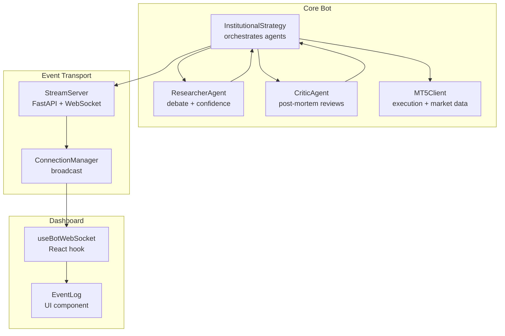
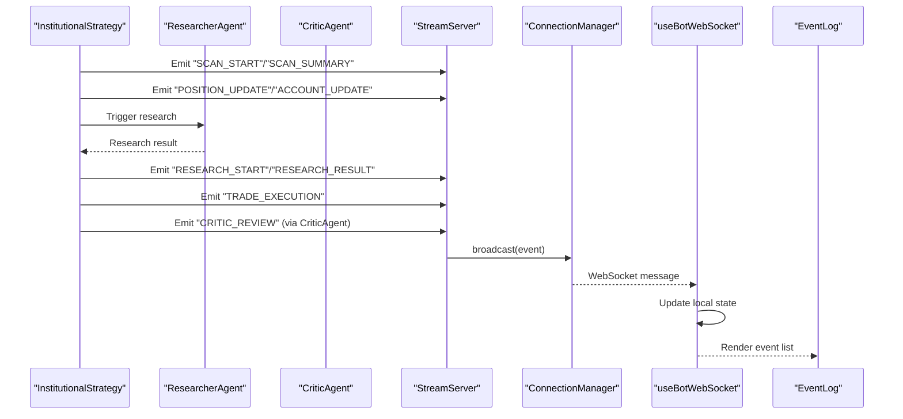
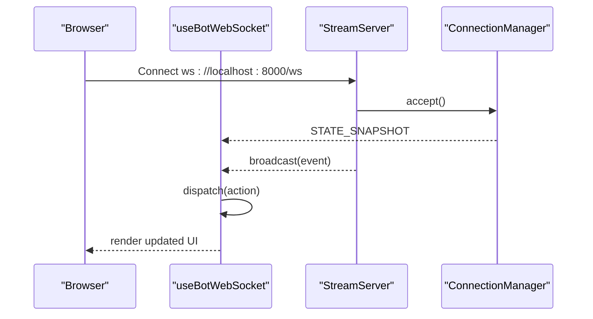
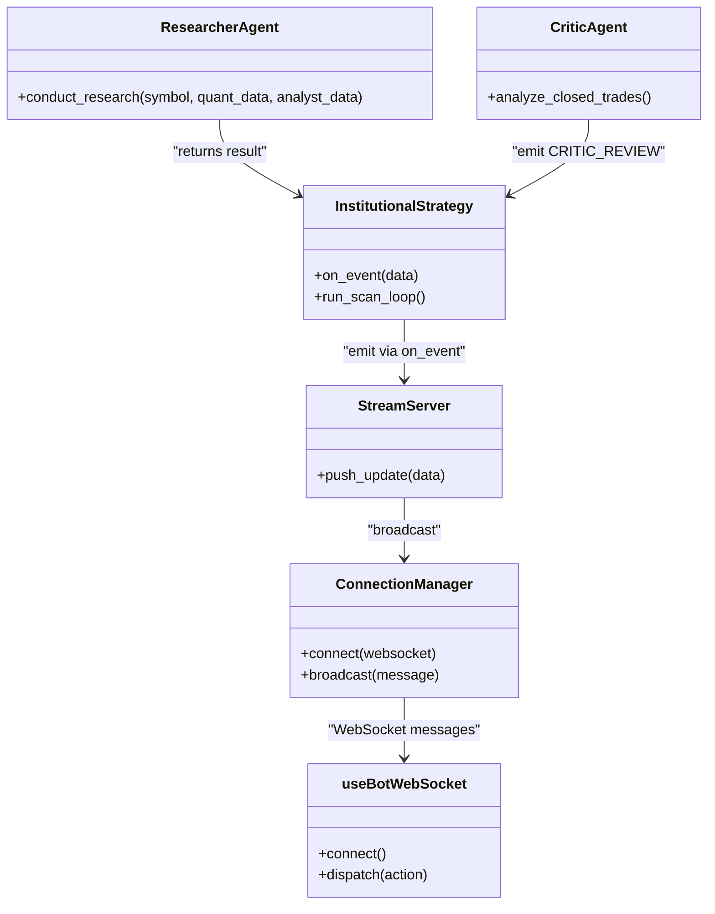
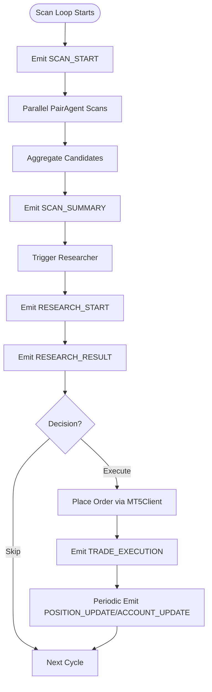
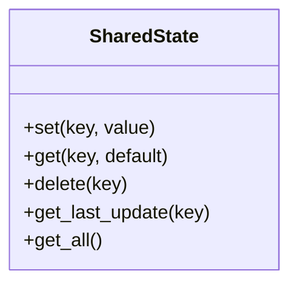
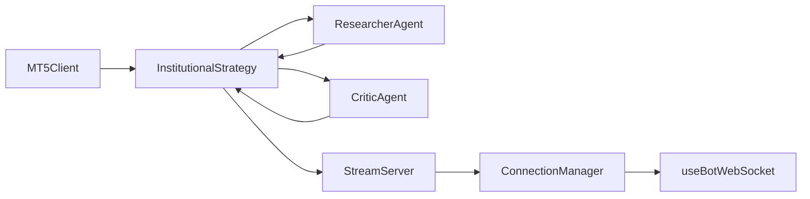

# Event-Driven Communication

<cite>
**Referenced Files in This Document**
- [README.md](file://README.md)
- [main.py](file://main.py)
- [stream_server.py](file://api/stream_server.py)
- [useBotWebSocket.js](file://dashboard/src/hooks/useBotWebSocket.js)
- [EventLog.jsx](file://dashboard/src/components/EventLog.jsx)
- [institutional_strategy.py](file://strategy/institutional_strategy.py)
- [researcher_agent.py](file://analysis/researcher_agent.py)
- [critic_agent.py](file://analysis/critic_agent.py)
- [shared_state.py](file://utils/shared_state.py)
- [async_utils.py](file://utils/async_utils.py)
- [mt5_client.py](file://execution/mt5_client.py)
- [settings.py](file://config/settings.py)
</cite>

## Table of Contents
1. [Introduction](#introduction)
2. [Project Structure](#project-structure)
3. [Core Components](#core-components)
4. [Architecture Overview](#architecture-overview)
5. [Detailed Component Analysis](#detailed-component-analysis)
6. [Dependency Analysis](#dependency-analysis)
7. [Performance Considerations](#performance-considerations)
8. [Troubleshooting Guide](#troubleshooting-guide)
9. [Conclusion](#conclusion)

## Introduction
This document describes the event-driven communication system used by the institutional trading bot. It explains how events are created, propagated, and handled across agents, the WebSocket-based real-time dashboard, and the external monitoring pipeline. It also documents event types, message formats, routing patterns, ordering guarantees, error handling, and performance considerations for high-frequency event processing.

## Project Structure
The event system spans three major areas:
- Orchestrator and agents that emit domain events during scanning, research, execution, and reflection.
- A WebSocket server that broadcasts events and exposes REST endpoints for dashboard and external systems.
- A React dashboard that subscribes to WebSocket events and polls REST endpoints for periodic updates.

**Diagram sources**
- [institutional_strategy.py](file://strategy/institutional_strategy.py#L99-L330)
- [researcher_agent.py](file://analysis/researcher_agent.py#L17-L82)
- [critic_agent.py](file://analysis/critic_agent.py#L17-L52)
- [stream_server.py](file://api/stream_server.py#L37-L80)
- [useBotWebSocket.js](file://dashboard/src/hooks/useBotWebSocket.js#L1-L155)
- [EventLog.jsx](file://dashboard/src/components/EventLog.jsx#L1-L60)

**Section sources**
- [README.md](file://README.md#L1-L25)
- [main.py](file://main.py#L66-L73)

## Core Components
- InstitutionalStrategy: Emits lifecycle and domain events (scan start/summary, research start/result, trade execution, position/account snapshots).
- ResearcherAgent: Produces a research result event with action, confidence, and reasoning.
- CriticAgent: Emits post-mortem events for closed trades.
- StreamServer: Central event broadcaster via WebSocket and REST endpoints; maintains rolling state buffers.
- useBotWebSocket: React hook that connects to WebSocket, merges REST polling, and updates local state.
- MT5Client: Provides live market data and executes orders; used by the orchestrator to enrich events with live positions and account info.

**Section sources**
- [institutional_strategy.py](file://strategy/institutional_strategy.py#L122-L236)
- [researcher_agent.py](file://analysis/researcher_agent.py#L17-L82)
- [critic_agent.py](file://analysis/critic_agent.py#L37-L52)
- [stream_server.py](file://api/stream_server.py#L27-L34)
- [useBotWebSocket.js](file://dashboard/src/hooks/useBotWebSocket.js#L1-L155)
- [mt5_client.py](file://execution/mt5_client.py#L18-L28)

## Architecture Overview
The event system follows a publish-subscribe pattern:
- Publishers: InstitutionalStrategy, ResearcherAgent, CriticAgent, MT5Client (when updating positions/account).
- Transport: StreamServer’s ConnectionManager broadcasts events to all connected WebSocket clients.
- Subscribers: Dashboard React components subscribe via useBotWebSocket; external systems can poll REST endpoints.

**Diagram sources**
- [institutional_strategy.py](file://strategy/institutional_strategy.py#L122-L296)
- [researcher_agent.py](file://analysis/researcher_agent.py#L17-L82)
- [critic_agent.py](file://analysis/critic_agent.py#L37-L52)
- [stream_server.py](file://api/stream_server.py#L51-L63)
- [useBotWebSocket.js](file://dashboard/src/hooks/useBotWebSocket.js#L118-L152)
- [EventLog.jsx](file://dashboard/src/components/EventLog.jsx#L35-L60)

## Detailed Component Analysis

### Event Types, Message Formats, and Routing Patterns
- Event type: string discriminator (e.g., SCAN_START, SCAN_SUMMARY, RESEARCH_START, RESEARCH_RESULT, TRADE_EXECUTION, POSITION_UPDATE, ACCOUNT_UPDATE, CRITIC_REVIEW).
- Common fields:
  - type: event discriminator
  - timestamp: ISO 8601 UTC
  - Optional payload fields vary by type (e.g., symbol, direction, price, lot, positions, account).
- Routing:
  - InstitutionalStrategy emits events during scan lifecycle and after execution.
  - ResearcherAgent emits a research result event after debate.
  - CriticAgent emits a post-mortem review event for closed trades.
  - StreamServer routes events to all WebSocket clients and updates in-memory rolling buffers.

Examples of emitted events:
- Scan lifecycle: SCAN_START, SCAN_SUMMARY
- Research lifecycle: RESEARCH_START, RESEARCH_RESULT
- Execution lifecycle: TRADE_EXECUTION
- State snapshots: POSITION_UPDATE, ACCOUNT_UPDATE
- Reflection lifecycle: CRITIC_REVIEW

**Section sources**
- [institutional_strategy.py](file://strategy/institutional_strategy.py#L122-L296)
- [researcher_agent.py](file://analysis/researcher_agent.py#L17-L82)
- [critic_agent.py](file://analysis/critic_agent.py#L37-L52)
- [stream_server.py](file://api/stream_server.py#L185-L212)

### WebSocket Event System for Real-Time Dashboard Updates
- ConnectionManager accepts WebSocket connections and maintains a list of active connections.
- On connect, the server sends a STATE_SNAPSHOT with current account, positions, scan_summary, recent_trades, and events buffers.
- broadcast(message) serializes the message and sends it to all active connections, removing dead sockets.
- useBotWebSocket:
  - Establishes a WebSocket connection and handles CONNECTED/DISCONNECTED states.
  - Parses incoming events and dispatches actions to update local state.
  - Merges REST polling for positions and account to complement WebSocket updates.
  - Maintains rolling buffers for events, recent_trades, and scan_summary.

**Diagram sources**
- [stream_server.py](file://api/stream_server.py#L37-L80)
- [useBotWebSocket.js](file://dashboard/src/hooks/useBotWebSocket.js#L118-L152)

**Section sources**
- [stream_server.py](file://api/stream_server.py#L27-L63)
- [useBotWebSocket.js](file://dashboard/src/hooks/useBotWebSocket.js#L1-L155)

### Observer Pattern and Subscription Mechanisms
- Observer pattern:
  - InstitutionalStrategy optionally accepts an on_event callback and forwards domain events to it.
  - StreamServer exposes push_update(data) to thread-safe broadcast of events to WebSocket clients.
  - useBotWebSocket acts as a subscriber, registering handlers for event types and updating UI state.
- Subscription:
  - WebSocket clients subscribe implicitly by connecting to the endpoint.
  - REST endpoints (/api/account, /api/positions, /api/trades, /api/scan, /api/state) provide pull-based subscriptions for external systems.

**Diagram sources**
- [institutional_strategy.py](file://strategy/institutional_strategy.py#L54-L64)
- [researcher_agent.py](file://analysis/researcher_agent.py#L17-L82)
- [critic_agent.py](file://analysis/critic_agent.py#L11-L15)
- [stream_server.py](file://api/stream_server.py#L37-L65)
- [useBotWebSocket.js](file://dashboard/src/hooks/useBotWebSocket.js#L118-L152)

**Section sources**
- [institutional_strategy.py](file://strategy/institutional_strategy.py#L54-L64)
- [stream_server.py](file://api/stream_server.py#L176-L183)
- [useBotWebSocket.js](file://dashboard/src/hooks/useBotWebSocket.js#L118-L152)

### Event Creation, Propagation, and Handling
- Creation:
  - InstitutionalStrategy emits SCAN_START at the beginning of a scan cycle.
  - After scanning, emits SCAN_SUMMARY with per-symbol reasons and candidate counts.
  - On trade execution, emits TRADE_EXECUTION with symbol, direction, price, and lot.
  - Periodically emits POSITION_UPDATE and ACCOUNT_UPDATE snapshots.
  - ResearcherAgent emits RESEARCH_START and RESEARCH_RESULT after debate.
  - CriticAgent emits CRITIC_REVIEW for closed trades.
- Propagation:
  - Events are forwarded to StreamServer via the on_event callback.
  - StreamServer updates in-memory rolling state and broadcasts to WebSocket clients.
- Handling:
  - useBotWebSocket parses incoming events and updates local state slices (events, recent_trades, positions, scan_summary, account).
  - EventLog renders formatted event entries with icons and timestamps.

**Diagram sources**
- [institutional_strategy.py](file://strategy/institutional_strategy.py#L99-L330)
- [researcher_agent.py](file://analysis/researcher_agent.py#L17-L82)
- [mt5_client.py](file://execution/mt5_client.py#L214-L292)

**Section sources**
- [institutional_strategy.py](file://strategy/institutional_strategy.py#L122-L296)
- [researcher_agent.py](file://analysis/researcher_agent.py#L17-L82)
- [useBotWebSocket.js](file://dashboard/src/hooks/useBotWebSocket.js#L17-L80)
- [EventLog.jsx](file://dashboard/src/components/EventLog.jsx#L13-L33)

### Shared State and Persistence (Whiteboard)
While not an event transport, SharedState provides a persistent key-value store used by agents to coordinate without tight coupling. It persists values to SQLite and supports get/set/delete operations with JSON serialization.

**Diagram sources**
- [shared_state.py](file://utils/shared_state.py#L23-L110)

**Section sources**
- [shared_state.py](file://utils/shared_state.py#L1-L110)

## Dependency Analysis
- Coupling:
  - InstitutionalStrategy depends on MT5Client for market data and order placement; it optionally delegates event emission via on_event.
  - ResearcherAgent and CriticAgent are invoked by InstitutionalStrategy and emit events via the same callback.
  - StreamServer is decoupled from publishers; it only requires a dictionary with a type field.
- Cohesion:
  - Event creation is cohesive within each agent/strategy method.
  - Event consumption is cohesive in the WebSocket hook and REST endpoints.
- External dependencies:
  - FastAPI/Uvicorn for WebSocket and REST.
  - React/Redux-style reducer for dashboard state management.

**Diagram sources**
- [mt5_client.py](file://execution/mt5_client.py#L12-L28)
- [institutional_strategy.py](file://strategy/institutional_strategy.py#L54-L64)
- [researcher_agent.py](file://analysis/researcher_agent.py#L13-L15)
- [critic_agent.py](file://analysis/critic_agent.py#L11-L15)
- [stream_server.py](file://api/stream_server.py#L37-L65)
- [useBotWebSocket.js](file://dashboard/src/hooks/useBotWebSocket.js#L118-L152)

**Section sources**
- [institutional_strategy.py](file://strategy/institutional_strategy.py#L54-L64)
- [stream_server.py](file://api/stream_server.py#L37-L65)

## Performance Considerations
- Event frequency:
  - The system emits frequent events during scans and research cycles. Use rolling buffers to cap memory usage (e.g., last 200 events, last 50 recent trades).
- WebSocket throughput:
  - broadcast loops over active connections; dead sockets are removed. Ensure clients reconnect on close to maintain low-latency delivery.
- REST polling:
  - The dashboard polls REST endpoints periodically to supplement WebSocket updates. Tune polling intervals to balance freshness and load.
- Concurrency:
  - InstitutionalStrategy runs PairAgent scans concurrently; ensure event emission does not block the main loop.
- Thread safety:
  - push_update updates state and schedules broadcast on the running asyncio loop using run_coroutine_threadsafe to avoid cross-thread issues.
- Rate limiting:
  - Consider AsyncRateLimiter for external integrations (e.g., Telegram) to avoid throttling.

[No sources needed since this section provides general guidance]

## Troubleshooting Guide
- WebSocket disconnects:
  - useBotWebSocket attempts automatic reconnection on close. Verify server logs and network connectivity.
- Missing events in dashboard:
  - Confirm the server is running and broadcasting. Check rolling buffers for truncation.
- REST endpoints returning stale data:
  - REST endpoints fall back to in-memory state if MT5 queries fail. Ensure MT5 terminal is connected and operational.
- Event ordering:
  - Events are emitted in-order within the orchestrator’s scan loop. There is no cross-event ordering guarantee across multiple agents; rely on timestamp fields for ordering.
- Error handling:
  - StreamServer catches exceptions during WebSocket handling and removes dead connections. Publishers should guard against exceptions when emitting events.

**Section sources**
- [useBotWebSocket.js](file://dashboard/src/hooks/useBotWebSocket.js#L136-L142)
- [stream_server.py](file://api/stream_server.py#L70-L79)
- [stream_server.py](file://api/stream_server.py#L185-L212)

## Conclusion
The event-driven system coordinates the multi-agent trading bot with a clean separation between producers (agents and orchestrator), a central transport (WebSocket + REST), and subscribers (dashboard and external systems). Events carry minimal, consistent metadata with type and timestamp, enabling straightforward routing and UI rendering. The design emphasizes scalability and resilience through asynchronous processing, rolling buffers, and robust reconnection logic.