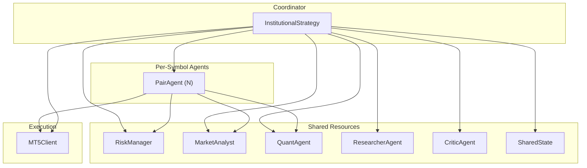
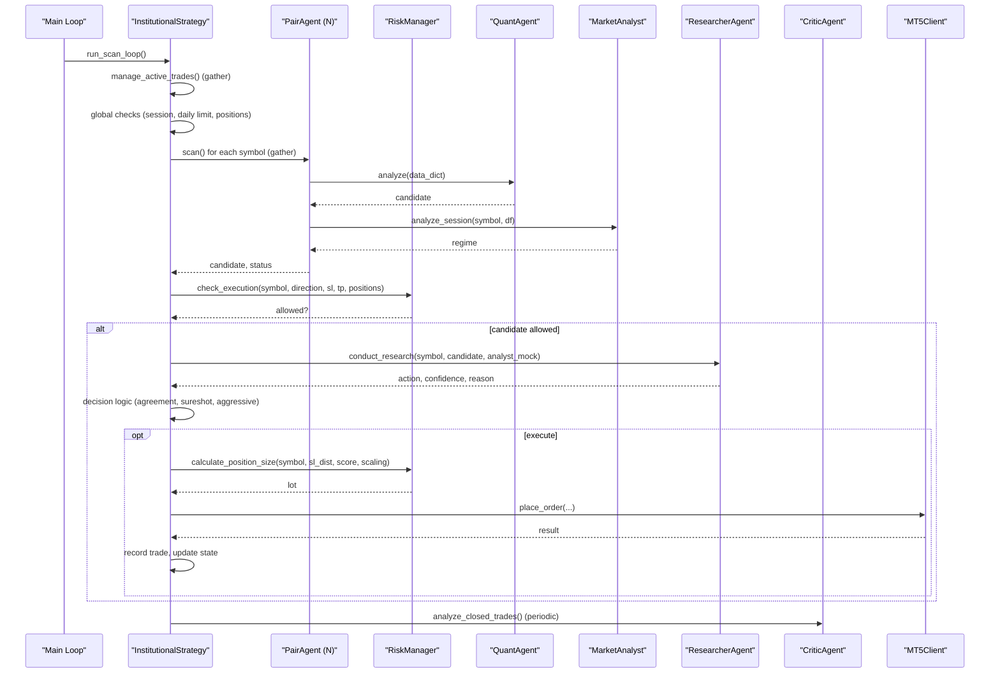
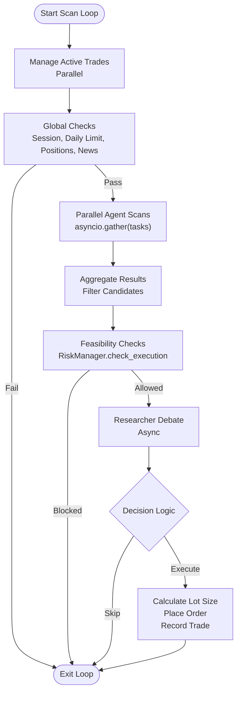
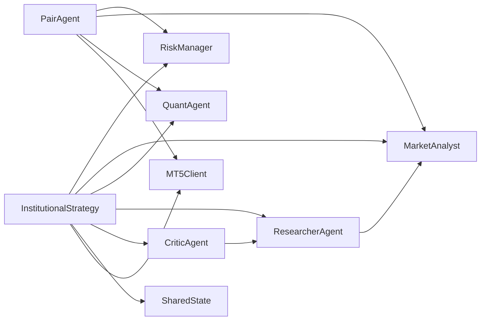

# Agent Coordination and Orchestration

<cite>
**Referenced Files in This Document**
- [institutional_strategy.py](file://strategy/institutional_strategy.py)
- [pair_agent.py](file://strategy/pair_agent.py)
- [risk_manager.py](file://utils/risk_manager.py)
- [market_analyst.py](file://analysis/market_analyst.py)
- [quant_agent.py](file://analysis/quant_agent.py)
- [researcher_agent.py](file://analysis/researcher_agent.py)
- [critic_agent.py](file://analysis/critic_agent.py)
- [shared_state.py](file://utils/shared_state.py)
- [async_utils.py](file://utils/async_utils.py)
- [settings.py](file://config/settings.py)
- [mt5_client.py](file://execution/mt5_client.py)
- [main.py](file://main.py)
</cite>

## Table of Contents
1. [Introduction](#introduction)
2. [Project Structure](#project-structure)
3. [Core Components](#core-components)
4. [Architecture Overview](#architecture-overview)
5. [Detailed Component Analysis](#detailed-component-analysis)
6. [Dependency Analysis](#dependency-analysis)
7. [Performance Considerations](#performance-considerations)
8. [Troubleshooting Guide](#troubleshooting-guide)
9. [Conclusion](#conclusion)

## Introduction
This document explains the agent coordination system within InstitutionalStrategy, focusing on how the central coordinator orchestrates parallel PairAgents, manages shared resources, and coordinates inter-agent communication. It details the scanning loop architecture that runs multiple PairAgents concurrently, the task scheduling and result aggregation pipeline, and the decision-making workflow that culminates in trade execution. It also covers shared resource management (RiskManager, MarketAnalyst, QuantAgent) and provides implementation examples for agent lifecycle, execution queues, and cross-agent dependencies. Finally, it outlines performance optimization strategies, error handling mechanisms, and graceful degradation patterns when agents fail.

## Project Structure
The system is organized around a central coordinator (InstitutionalStrategy) that instantiates and supervises per-symbol PairAgents. Shared resources are injected into each PairAgent to enable parallelism and reduce coupling. The scanning loop executes in cycles, invoking PairAgents concurrently, aggregating results, and applying global risk controls before deciding whether to execute trades.

**Diagram sources**
- [institutional_strategy.py](file://strategy/institutional_strategy.py#L49-L87)
- [pair_agent.py](file://strategy/pair_agent.py#L22-L54)
- [risk_manager.py](file://utils/risk_manager.py#L14-L17)
- [market_analyst.py](file://analysis/market_analyst.py#L7-L19)
- [quant_agent.py](file://analysis/quant_agent.py#L34-L50)
- [researcher_agent.py](file://analysis/researcher_agent.py#L5-L15)
- [critic_agent.py](file://analysis/critic_agent.py#L10-L15)
- [shared_state.py](file://utils/shared_state.py#L23-L26)
- [mt5_client.py](file://execution/mt5_client.py#L12-L27)

**Section sources**
- [institutional_strategy.py](file://strategy/institutional_strategy.py#L49-L87)
- [pair_agent.py](file://strategy/pair_agent.py#L22-L54)
- [risk_manager.py](file://utils/risk_manager.py#L14-L17)
- [market_analyst.py](file://analysis/market_analyst.py#L7-L19)
- [quant_agent.py](file://analysis/quant_agent.py#L34-L50)
- [researcher_agent.py](file://analysis/researcher_agent.py#L5-L15)
- [critic_agent.py](file://analysis/critic_agent.py#L10-L15)
- [shared_state.py](file://utils/shared_state.py#L23-L26)
- [mt5_client.py](file://execution/mt5_client.py#L12-L27)

## Core Components
- InstitutionalStrategy: Central coordinator that initializes shared resources, creates PairAgents, runs the scanning loop, aggregates results, applies global risk checks, and executes trades.
- PairAgent: Per-symbol agent responsible for fetching data, performing quant and market regime analysis, constructing candidates, and managing active trades.
- RiskManager: Shared risk control layer enforcing pre-scan gating, daily limits, correlation conflicts, and execution feasibility checks.
- MarketAnalyst: Shared market regime detector and AI advisor integration.
- QuantAgent: Shared machine learning inference engine for technical analysis and signal generation.
- ResearcherAgent: Shared debate engine that synthesizes quant and analyst outputs into a final conviction.
- CriticAgent: Shared post-mortem analyzer that reviews closed trades and records lessons.
- SharedState: Persistent key-value store enabling cross-agent communication without tight coupling.
- Async utilities: Thread pool executor and rate limiter to safely run blocking operations and control concurrency.
- Settings: Central configuration for trading parameters, filters, and thresholds.

**Section sources**
- [institutional_strategy.py](file://strategy/institutional_strategy.py#L49-L87)
- [pair_agent.py](file://strategy/pair_agent.py#L22-L54)
- [risk_manager.py](file://utils/risk_manager.py#L14-L17)
- [market_analyst.py](file://analysis/market_analyst.py#L7-L19)
- [quant_agent.py](file://analysis/quant_agent.py#L34-L50)
- [researcher_agent.py](file://analysis/researcher_agent.py#L5-L15)
- [critic_agent.py](file://analysis/critic_agent.py#L10-L15)
- [shared_state.py](file://utils/shared_state.py#L23-L26)
- [async_utils.py](file://utils/async_utils.py#L6-L16)
- [settings.py](file://config/settings.py#L63-L102)

## Architecture Overview
The scanning loop is the heart of the orchestration. It performs:
- Pre-scan position management across all PairAgents
- Global session and daily trade checks
- Parallel scanning of all PairAgents
- Candidate filtering and execution feasibility checks
- Optional Researcher debate for final decision
- Periodic self-reflection via CriticAgent
- Trade execution with shared RiskManager and MT5Client

**Diagram sources**
- [institutional_strategy.py](file://strategy/institutional_strategy.py#L99-L330)
- [pair_agent.py](file://strategy/pair_agent.py#L71-L105)
- [risk_manager.py](file://utils/risk_manager.py#L237-L295)
- [quant_agent.py](file://analysis/quant_agent.py#L109-L159)
- [market_analyst.py](file://analysis/market_analyst.py#L25-L71)
- [researcher_agent.py](file://analysis/researcher_agent.py#L17-L82)
- [critic_agent.py](file://analysis/critic_agent.py#L17-L52)
- [mt5_client.py](file://execution/mt5_client.py#L216-L292)

## Detailed Component Analysis

### InstitutionalStrategy: Central Coordinator
- Initialization:
  - Creates shared RiskManager, MarketAnalyst, QuantAgent, ResearcherAgent, and CriticAgent.
  - Builds a dictionary of PairAgent instances keyed by symbol.
  - Initializes DataCache and TradeJournal.
- Scanning loop:
  - Pre-scan position management across all agents.
  - Global checks: trading session, daily trade limit, max open positions, active news events.
  - Parallel scanning: collects tasks for all agents and awaits results.
  - Candidate aggregation: filters candidates by execution feasibility using RiskManager.
  - Decision-making: sorts candidates, invokes ResearcherAgent for debate, applies decision rules.
  - Trade execution: validates direction/symbol, enforces R:R mandate, calculates position size, places order, logs, and notifies agents.
  - Periodic self-reflection: runs CriticAgent periodically to review closed trades.

Implementation examples:
- Parallel scanning and result aggregation: [institutional_strategy.py](file://strategy/institutional_strategy.py#L132-L183)
- Execution gating and feasibility checks: [institutional_strategy.py](file://strategy/institutional_strategy.py#L170-L181)
- Decision logic and Researcher integration: [institutional_strategy.py](file://strategy/institutional_strategy.py#L267-L324)
- Trade execution and logging: [institutional_strategy.py](file://strategy/institutional_strategy.py#L331-L436)

**Section sources**
- [institutional_strategy.py](file://strategy/institutional_strategy.py#L49-L87)
- [institutional_strategy.py](file://strategy/institutional_strategy.py#L99-L330)
- [institutional_strategy.py](file://strategy/institutional_strategy.py#L331-L436)

### PairAgent: Per-Symbol Agent
- Lifecycle:
  - Loads state from TradeJournal to restore consecutive losses and circuit breaker.
  - Maintains internal state (loss streak, P&L, regime, ATR cache).
- Scanning pipeline:
  - Pre-scan risk checks (cooldown, spread, news blackout).
  - Data fetching (primary timeframe plus optional multi-timeframes).
  - Quant analysis (ML/XGBoost/LSTM/Lag-Llama), regime analysis, optional BOS fusion.
  - Candidate construction with volatility-adaptive SL/TP and R:R enforcement.
  - Optional retail viability checks for BOS-only candidates.
- Active trade management:
  - Uses cached ATR when fresh; otherwise recomputes features.
  - Delegates standard risk actions (BE, partial close, trailing stop) to RiskManager.
  - Agent-specific regime guard logic to exit positions when regime shifts against holdings.

Implementation examples:
- Scanning orchestration: [pair_agent.py](file://strategy/pair_agent.py#L71-L105)
- Data fetching with multi-timeframes: [pair_agent.py](file://strategy/pair_agent.py#L107-L139)
- Quant and regime synthesis: [pair_agent.py](file://strategy/pair_agent.py#L145-L164)
- Candidate construction and filters: [pair_agent.py](file://strategy/pair_agent.py#L204-L295)
- Active trade management and trailing stops: [pair_agent.py](file://strategy/pair_agent.py#L297-L376)

**Section sources**
- [pair_agent.py](file://strategy/pair_agent.py#L22-L54)
- [pair_agent.py](file://strategy/pair_agent.py#L71-L105)
- [pair_agent.py](file://strategy/pair_agent.py#L107-L139)
- [pair_agent.py](file://strategy/pair_agent.py#L145-L164)
- [pair_agent.py](file://strategy/pair_agent.py#L204-L295)
- [pair_agent.py](file://strategy/pair_agent.py#L297-L376)

### Shared Resource Management
- RiskManager:
  - Pre-scan gating: circuit breaker, daily limit, kill switch, payoff mandate, daily loss cap, cooldown, spread, news blackout, session filter.
  - Execution gating: max concurrent trades, live correlation conflict, profitability check.
  - Position sizing: Kelly criterion fallback to confluence tiers; tail risk clamping for high-volatility symbols.
  - Trade management: BE, partial close, trailing stop with ATR or fixed percent.
- MarketAnalyst:
  - Regime detection and AI opinion retrieval.
  - Persists regime to SharedState for cross-agent visibility.
- QuantAgent:
  - Loads ML/XGBoost models and optional LSTM/Lag-Llama predictors.
  - Computes trend signals across multiple timeframes, ML probabilities, and ensemble scores.
  - Generates confluence-based scoring and AI signal fusion.
- ResearcherAgent:
  - Conducts asynchronous debate synthesis using MistralAdvisor.
  - Parses structured output to produce action, confidence, and reason.
- CriticAgent:
  - Reviews closed trades without post-mortem, grades outcomes, and persists lessons.
- SharedState:
  - Provides a persistent key-value store for sharing state across agents.

Implementation examples:
- Pre-scan gating and stats updates: [risk_manager.py](file://utils/risk_manager.py#L51-L163)
- Execution gating and correlation checks: [risk_manager.py](file://utils/risk_manager.py#L237-L339)
- Position sizing and trailing stops: [risk_manager.py](file://utils/risk_manager.py#L341-L548)
- Market regime and AI opinion: [market_analyst.py](file://analysis/market_analyst.py#L25-L81)
- Quant analysis and ensemble scoring: [quant_agent.py](file://analysis/quant_agent.py#L109-L159)
- Researcher debate parsing: [researcher_agent.py](file://analysis/researcher_agent.py#L84-L132)
- Post-mortem and persistence: [critic_agent.py](file://analysis/critic_agent.py#L17-L52)
- Shared state persistence: [shared_state.py](file://utils/shared_state.py#L42-L75)

**Section sources**
- [risk_manager.py](file://utils/risk_manager.py#L51-L163)
- [risk_manager.py](file://utils/risk_manager.py#L237-L339)
- [risk_manager.py](file://utils/risk_manager.py#L341-L548)
- [market_analyst.py](file://analysis/market_analyst.py#L25-L81)
- [quant_agent.py](file://analysis/quant_agent.py#L109-L159)
- [researcher_agent.py](file://analysis/researcher_agent.py#L84-L132)
- [critic_agent.py](file://analysis/critic_agent.py#L17-L52)
- [shared_state.py](file://utils/shared_state.py#L42-L75)

### Scanning Loop Architecture and Task Scheduling
The scanning loop is designed for high concurrency:
- Phase 1: Parallel agent scans using asyncio.gather to collect futures for all PairAgents.
- Phase 2: Aggregate results, apply execution feasibility checks, and sort candidates.
- Phase 3: Optional Researcher debate and decision-making.
- Periodic: Self-reflection via CriticAgent.

**Diagram sources**
- [institutional_strategy.py](file://strategy/institutional_strategy.py#L99-L330)

**Section sources**
- [institutional_strategy.py](file://strategy/institutional_strategy.py#L99-L183)
- [institutional_strategy.py](file://strategy/institutional_strategy.py#L183-L330)

### Inter-Agent Communication and Cross-Agent Dependencies
- Shared resources: InstitutionalStrategy injects shared RiskManager, MarketAnalyst, QuantAgent, ResearcherAgent, and CriticAgent into each PairAgent.
- SharedState: MarketAnalyst persists regime data; other agents can read it to coordinate decisions.
- PairAgent-to-RiskManager: Pre-scan gating and active trade management.
- InstitutionalStrategy-to-RiskManager: Execution gating and position sizing.
- InstitutionalStrategy-to-MarketAnalyst: Regime context for Researcher debate.
- InstitutionalStrategy-to-QuantAgent: Candidate data for Researcher debate.
- InstitutionalStrategy-to-ResearcherAgent: Best candidate for debate.
- InstitutionalStrategy-to-CriticAgent: Periodic closed trade analysis.

Implementation examples:
- Shared resource injection: [institutional_strategy.py](file://strategy/institutional_strategy.py#L77-L86)
- Market regime persistence: [market_analyst.py](file://analysis/market_analyst.py#L50-L57)
- PairAgent pre-scan gating: [pair_agent.py](file://strategy/pair_agent.py#L85-L92)
- InstitutionalStrategy execution gating: [institutional_strategy.py](file://strategy/institutional_strategy.py#L170-L181)

**Section sources**
- [institutional_strategy.py](file://strategy/institutional_strategy.py#L77-L86)
- [market_analyst.py](file://analysis/market_analyst.py#L50-L57)
- [pair_agent.py](file://strategy/pair_agent.py#L85-L92)
- [institutional_strategy.py](file://strategy/institutional_strategy.py#L170-L181)

### Agent Lifecycle Management
- Initialization: PairAgent loads recent trade history to restore state and circuit breaker.
- Active trade management: Periodic monitoring and modifications via RiskManager.
- Trade execution: InstitutionalStrategy updates state and notifies agents.
- Circuit breaker: Pauses agent after consecutive losses.

Implementation examples:
- State restoration: [pair_agent.py](file://strategy/pair_agent.py#L56-L70)
- Active trade management: [pair_agent.py](file://strategy/pair_agent.py#L297-L376)
- Trade notification: [institutional_strategy.py](file://strategy/institutional_strategy.py#L413-L416)
- Circuit breaker: [pair_agent.py](file://strategy/pair_agent.py#L390-L398)

**Section sources**
- [pair_agent.py](file://strategy/pair_agent.py#L56-L70)
- [pair_agent.py](file://strategy/pair_agent.py#L297-L376)
- [institutional_strategy.py](file://strategy/institutional_strategy.py#L413-L416)
- [pair_agent.py](file://strategy/pair_agent.py#L390-L398)

### Execution Queue Management
- Parallel execution: asyncio.gather schedules all PairAgent scans concurrently.
- Blocking operations: run_in_executor wraps blocking data loading and model inference.
- Rate limiting: AsyncRateLimiter provides token-bucket throttling for external calls.

Implementation examples:
- Parallel scans: [institutional_strategy.py](file://strategy/institutional_strategy.py#L132-L140)
- Blocking data loading: [pair_agent.py](file://strategy/pair_agent.py#L116-L135)
- Model inference: [pair_agent.py](file://strategy/pair_agent.py#L147)
- Rate limiter: [async_utils.py](file://utils/async_utils.py#L18-L45)

**Section sources**
- [institutional_strategy.py](file://strategy/institutional_strategy.py#L132-L140)
- [pair_agent.py](file://strategy/pair_agent.py#L116-L135)
- [pair_agent.py](file://strategy/pair_agent.py#L147)
- [async_utils.py](file://utils/async_utils.py#L18-L45)

## Dependency Analysis
The system exhibits low coupling through shared resource injection and a persistent shared state mechanism. InstitutionalStrategy depends on MT5Client for execution and MarketData loader for historical data. PairAgents depend on shared RiskManager, MarketAnalyst, and QuantAgent. ResearcherAgent and CriticAgent depend on MistralAdvisor for LLM integration.

**Diagram sources**
- [institutional_strategy.py](file://strategy/institutional_strategy.py#L49-L87)
- [pair_agent.py](file://strategy/pair_agent.py#L22-L54)
- [risk_manager.py](file://utils/risk_manager.py#L14-L17)
- [market_analyst.py](file://analysis/market_analyst.py#L7-L19)
- [quant_agent.py](file://analysis/quant_agent.py#L34-L50)
- [researcher_agent.py](file://analysis/researcher_agent.py#L5-L15)
- [critic_agent.py](file://analysis/critic_agent.py#L10-L15)
- [shared_state.py](file://utils/shared_state.py#L23-L26)
- [mt5_client.py](file://execution/mt5_client.py#L12-L27)

**Section sources**
- [institutional_strategy.py](file://strategy/institutional_strategy.py#L49-L87)
- [pair_agent.py](file://strategy/pair_agent.py#L22-L54)
- [risk_manager.py](file://utils/risk_manager.py#L14-L17)
- [market_analyst.py](file://analysis/market_analyst.py#L7-L19)
- [quant_agent.py](file://analysis/quant_agent.py#L34-L50)
- [researcher_agent.py](file://analysis/researcher_agent.py#L5-L15)
- [critic_agent.py](file://analysis/critic_agent.py#L10-L15)
- [shared_state.py](file://utils/shared_state.py#L23-L26)
- [mt5_client.py](file://execution/mt5_client.py#L12-L27)

## Performance Considerations
- Concurrency:
  - Use asyncio.gather for parallel PairAgent scans to maximize throughput.
  - Wrap blocking IO and model inference with run_in_executor to avoid blocking the event loop.
- Data caching:
  - Cache ATR and regime data in PairAgent to avoid recomputation.
  - Use SharedState for cross-agent regime persistence.
- Risk checks:
  - Perform fast pre-scan checks (cooldown, spread, news) before heavy analysis.
  - Use cached stats in RiskManager for kill switch and payoff mandate checks.
- Execution gating:
  - Apply correlation conflict checks and profitability thresholds to prevent low-probability trades.
- Adaptive sleep:
  - Adjust sleep between scan cycles based on elapsed time to maintain target cadence.

[No sources needed since this section provides general guidance]

## Troubleshooting Guide
- Parallel scan failures:
  - Exceptions are captured and logged per symbol; ensure logging is enabled to diagnose issues.
  - Validate that run_in_executor is used for blocking operations.
- Risk gating:
  - If trades are frequently blocked, review daily loss cap, kill switch, payoff mandate, and spread thresholds.
  - Confirm that SharedState is accessible and that daily reset logic is functioning.
- Execution issues:
  - Verify MT5Client connectivity and symbol availability.
  - Check order request parameters (SL/TP, deviation, magic).
- Researcher debate:
  - If no LLM key is configured, the system falls back to technical confidence; ensure MistralAdvisor is configured if needed.
- Self-reflection:
  - Ensure CriticAgent has access to the trade journal database and that tickets are properly marked as reviewed.

**Section sources**
- [institutional_strategy.py](file://strategy/institutional_strategy.py#L144-L149)
- [risk_manager.py](file://utils/risk_manager.py#L41-L50)
- [mt5_client.py](file://execution/mt5_client.py#L18-L27)
- [researcher_agent.py](file://analysis/researcher_agent.py#L34-L41)
- [critic_agent.py](file://analysis/critic_agent.py#L54-L69)

## Conclusion
The InstitutionalStrategy agent coordination system achieves high-throughput parallelism by centralizing orchestration in InstitutionalStrategy while distributing responsibilities to specialized agents. Shared resources (RiskManager, MarketAnalyst, QuantAgent) enable consistent risk control and analysis across all PairAgents. The scanning loop efficiently schedules tasks, aggregates results, and applies global decision-making with optional Researcher debate. Robust error handling and graceful degradation ensure resilience under failure conditions. By leveraging shared state, persistent risk controls, and adaptive execution gating, the system balances performance with safety and adaptability.