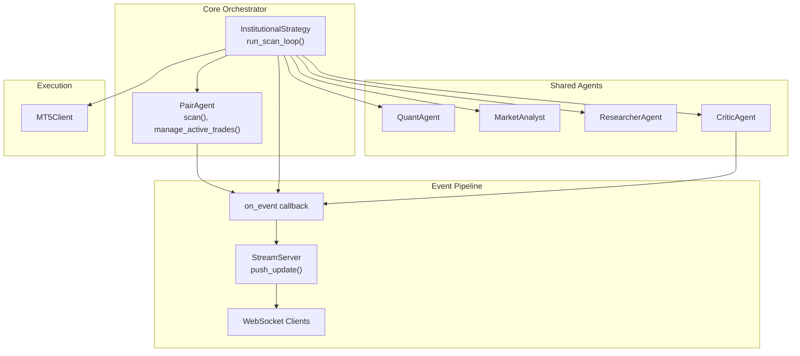
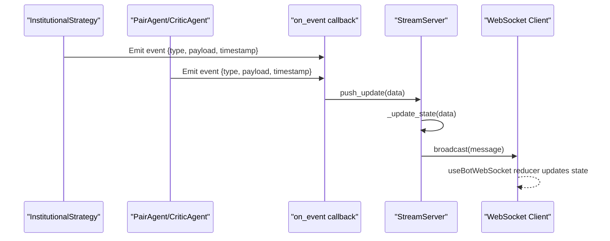
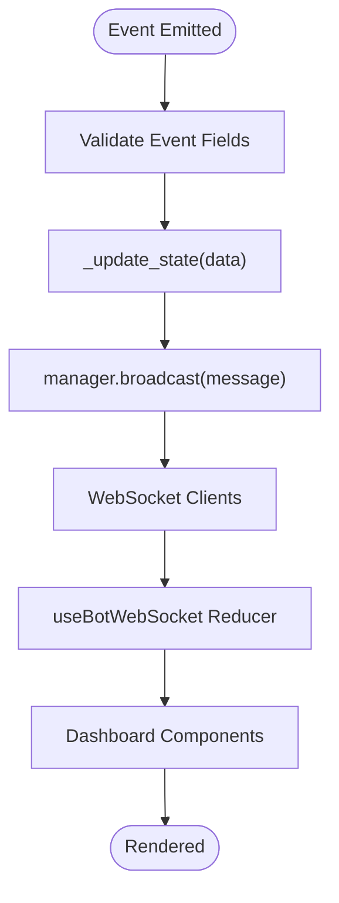
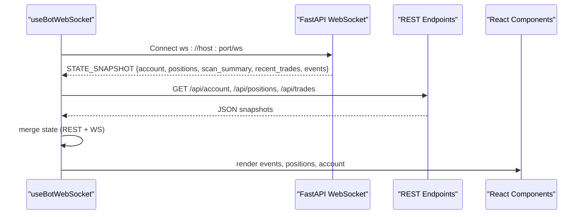
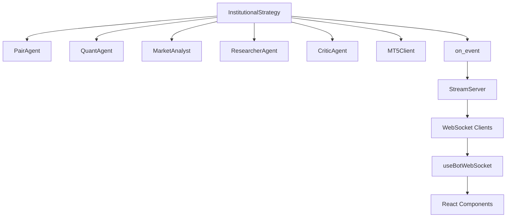

# Inter-Agent Communication and Event System

<cite>
**Referenced Files in This Document**
- [institutional_strategy.py](file://strategy/institutional_strategy.py)
- [stream_server.py](file://api/stream_server.py)
- [shared_state.py](file://utils/shared_state.py)
- [useBotWebSocket.js](file://dashboard/src/hooks/useBotWebSocket.js)
- [EventLog.jsx](file://dashboard/src/components/EventLog.jsx)
- [App.jsx](file://dashboard/src/App.jsx)
- [main.py](file://main.py)
- [pair_agent.py](file://strategy/pair_agent.py)
- [critic_agent.py](file://analysis/critic_agent.py)
- [settings.py](file://config/settings.py)
- [async_utils.py](file://utils/async_utils.py)
- [news_filter.py](file://utils/news_filter.py)
- [mt5_client.py](file://execution/mt5_client.py)
</cite>

## Table of Contents
1. [Introduction](#introduction)
2. [Project Structure](#project-structure)
3. [Core Components](#core-components)
4. [Architecture Overview](#architecture-overview)
5. [Detailed Component Analysis](#detailed-component-analysis)
6. [Dependency Analysis](#dependency-analysis)
7. [Performance Considerations](#performance-considerations)
8. [Troubleshooting Guide](#troubleshooting-guide)
9. [Conclusion](#conclusion)
10. [Appendices](#appendices)

## Introduction
This document explains the inter-agent communication protocols and event-driven architecture used by the InstitutionalStrategy-based multi-agent system. It covers:
- How agents emit and consume events through a central event callback
- The WebSocket-based real-time dashboard integration and external monitoring pipeline
- The event lifecycle from emission to processing, including queuing, filtering, and delivery guarantees
- Implementation examples for creating custom events, registering handlers, and asynchronous processing
- Shared state management coordinating agent activities across distributed agents
- Guidance for building custom communication channels, extending the event system, and debugging multi-agent environments

## Project Structure
The system is organized around a central InstitutionalStrategy orchestrator that coordinates per-symbol PairAgent instances and shared agents (Quant, Market Analyst, Researcher, Critic). Events are emitted via a callback and broadcast to a FastAPI WebSocket server, which the React dashboard consumes.

**Diagram sources**
- [institutional_strategy.py](file://strategy/institutional_strategy.py#L99-L330)
- [pair_agent.py](file://strategy/pair_agent.py#L71-L105)
- [critic_agent.py](file://analysis/critic_agent.py#L17-L52)
- [stream_server.py](file://api/stream_server.py#L176-L183)

**Section sources**
- [institutional_strategy.py](file://strategy/institutional_strategy.py#L49-L94)
- [main.py](file://main.py#L57-L85)

## Core Components
- InstitutionalStrategy: Central coordinator that runs the scanning loop, delegates to PairAgent instances, and emits structured events for dashboard and monitoring.
- PairAgent: Per-symbol agent that performs data fetching, quant analysis, regime analysis, and candidate construction; also manages active trades.
- Shared Agents: QuantAgent, MarketAnalyst, ResearcherAgent, and CriticAgent provide domain-specific intelligence and periodic reviews.
- StreamServer: FastAPI WebSocket server that maintains in-memory state and broadcasts events to connected clients.
- useBotWebSocket: React hook that connects to the WebSocket, merges REST polling, and updates local state.
- SharedState: Persistent key-value store for cross-agent coordination without tight coupling.
- MT5Client: Broker connectivity and order management.

**Section sources**
- [institutional_strategy.py](file://strategy/institutional_strategy.py#L49-L94)
- [pair_agent.py](file://strategy/pair_agent.py#L22-L54)
- [stream_server.py](file://api/stream_server.py#L27-L34)
- [useBotWebSocket.js](file://dashboard/src/hooks/useBotWebSocket.js#L1-L156)
- [shared_state.py](file://utils/shared_state.py#L23-L110)
- [mt5_client.py](file://execution/mt5_client.py#L12-L105)

## Architecture Overview
The event-driven architecture centers on a single event emission point. InstitutionalStrategy and agents call an event callback with a dictionary containing a type field and payload. The StreamServer updates an in-memory state and broadcasts the message to all WebSocket clients. The React dashboard consumes messages via a WebSocket connection and REST polling, maintaining a rolling log of events.

**Diagram sources**
- [institutional_strategy.py](file://strategy/institutional_strategy.py#L122-L236)
- [critic_agent.py](file://analysis/critic_agent.py#L37-L46)
- [stream_server.py](file://api/stream_server.py#L176-L183)

## Detailed Component Analysis

### Event Types and Message Formats
Events are Python dictionaries with a required type field and optional payload fields. The system emits the following event types during normal operation:
- SCAN_START: Emitted at the beginning of a scanning cycle. Payload includes count and timestamp.
- SCAN_SUMMARY: Emitted after scanning completes. Payload includes per-symbol statuses, counts, and timestamp.
- RESEARCH_START: Emitted before ResearcherAgent evaluates a candidate. Payload includes symbol and candidate data.
- RESEARCH_RESULT: Emitted after ResearcherAgent completes evaluation. Payload includes symbol, action, confidence, reason, and timestamp.
- POSITION_UPDATE: Emitted periodically with current open positions and derived metrics.
- ACCOUNT_UPDATE: Emitted periodically with account balance, equity, profit, currency, leverage, and day P&L.
- TRADE_EXECUTION: Emitted upon successful order placement. Payload includes symbol, direction, price, lot, and timestamp.
- CRITIC_REVIEW: Emitted by CriticAgent after reviewing closed trades. Payload includes symbol, score, lesson, analysis, and timestamp.

Message format schema:
- type: string (required)
- timestamp: ISO 8601 string (recommended)
- Additional fields depend on event type (e.g., positions, account, symbol, direction, etc.)

Delivery guarantees:
- Best-effort delivery via WebSocket broadcast.
- REST endpoints serve cached snapshots of state for resilience against transient WebSocket issues.

**Section sources**
- [institutional_strategy.py](file://strategy/institutional_strategy.py#L122-L236)
- [stream_server.py](file://api/stream_server.py#L185-L212)
- [useBotWebSocket.js](file://dashboard/src/hooks/useBotWebSocket.js#L17-L84)
- [EventLog.jsx](file://dashboard/src/components/EventLog.jsx#L1-L61)
- [critic_agent.py](file://analysis/critic_agent.py#L37-L46)

### Event Lifecycle: Emission Through Processing
- Emission: Agents and InstitutionalStrategy call the on_event callback with a structured dictionary.
- Queuing: The callback forwards to StreamServer’s push_update, which updates in-memory state and schedules a broadcast on the running asyncio loop.
- Filtering: StreamServer maintains rolling buffers for events, positions, trades, and account data; filters are applied based on event type.
- Delivery: WebSocket broadcast sends the message to all connected clients; the React hook parses and merges into local state.

**Diagram sources**
- [stream_server.py](file://api/stream_server.py#L176-L183)
- [stream_server.py](file://api/stream_server.py#L185-L212)
- [useBotWebSocket.js](file://dashboard/src/hooks/useBotWebSocket.js#L17-L84)

**Section sources**
- [stream_server.py](file://api/stream_server.py#L176-L212)
- [useBotWebSocket.js](file://dashboard/src/hooks/useBotWebSocket.js#L105-L155)

### WebSocket Real-Time Communication
- Server: FastAPI app with a WebSocket endpoint and REST endpoints for account, positions, trades, and scan summaries. Maintains an in-memory state snapshot and broadcasts updates.
- Client: React hook establishes a WebSocket connection, merges REST polling, and updates local state. The dashboard renders events, positions, and account data.

**Diagram sources**
- [stream_server.py](file://api/stream_server.py#L68-L84)
- [stream_server.py](file://api/stream_server.py#L86-L141)
- [useBotWebSocket.js](file://dashboard/src/hooks/useBotWebSocket.js#L105-L155)
- [App.jsx](file://dashboard/src/App.jsx#L12-L104)

**Section sources**
- [stream_server.py](file://api/stream_server.py#L17-L25)
- [useBotWebSocket.js](file://dashboard/src/hooks/useBotWebSocket.js#L1-L156)
- [App.jsx](file://dashboard/src/App.jsx#L12-L104)

### Asynchronous Event Processing Patterns
- InstitutionalStrategy uses asyncio.gather to run PairAgent scans concurrently, then emits SCAN_SUMMARY and periodic POSITION_UPDATE/ACCOUNT_UPDATE events.
- CriticAgent asynchronously reviews closed trades and emits CRITIC_REVIEW events.
- useBotWebSocket uses a reducer to merge incoming WebSocket messages with REST polling results.

Implementation patterns:
- Use run_in_executor for blocking operations (e.g., data loading) to avoid blocking the event loop.
- Use asyncio.create_task for fire-and-forget background tasks (e.g., periodic critic analysis).

**Section sources**
- [institutional_strategy.py](file://strategy/institutional_strategy.py#L132-L140)
- [institutional_strategy.py](file://strategy/institutional_strategy.py#L326-L329)
- [async_utils.py](file://utils/async_utils.py#L9-L16)
- [useBotWebSocket.js](file://dashboard/src/hooks/useBotWebSocket.js#L111-L155)

### Shared State Management
SharedState provides a persistent key-value store backed by SQLite, enabling agents to coordinate without tight coupling. It supports set, get, delete, and listing operations with JSON serialization.

Usage patterns:
- Store market regime indicators, risk flags, or cross-symbol signals.
- Retrieve last update timestamps for cache invalidation.
- Use for whiteboard-style coordination across agents.

**Section sources**
- [shared_state.py](file://utils/shared_state.py#L23-L110)

### Custom Event Creation and Handler Registration
To emit a custom event:
- Build a dictionary with type and payload fields.
- Call the on_event callback passed to InstitutionalStrategy.
- Ensure the event includes a timestamp for ordering.

To register a handler:
- Provide a callable to InstitutionalStrategy.__init__ as on_event.
- The callable receives the event dictionary and can forward to StreamServer.push_update or implement custom routing.

Example paths:
- Emission sites: [SCAN_START](file://strategy/institutional_strategy.py#L122-L127), [SCAN_SUMMARY](file://strategy/institutional_strategy.py#L186-L194), [TRADE_EXECUTION](file://strategy/institutional_strategy.py#L401-L409), [CRITIC_REVIEW](file://analysis/critic_agent.py#L37-L46).
- Handler registration: [on_event parameter](file://strategy/institutional_strategy.py#L54-L56), [push_update forwarding](file://api/stream_server.py#L176-L183).

**Section sources**
- [institutional_strategy.py](file://strategy/institutional_strategy.py#L54-L56)
- [stream_server.py](file://api/stream_server.py#L176-L183)

### Agent Coordination and Cross-Agent Communication
- InstitutionalStrategy constructs shared agents once and passes references to PairAgent instances for analysis and risk checks.
- PairAgent encapsulates per-symbol logic and state, reducing cross-agent coupling.
- SharedState enables cross-agent coordination without direct dependencies.
- News blackout filtering integrates with PairAgent scanning to avoid volatile periods.

**Section sources**
- [institutional_strategy.py](file://strategy/institutional_strategy.py#L77-L86)
- [pair_agent.py](file://strategy/pair_agent.py#L71-L105)
- [news_filter.py](file://utils/news_filter.py#L159-L205)

## Dependency Analysis
The event system relies on several key dependencies:
- InstitutionalStrategy depends on PairAgent, shared agents, MT5Client, and the on_event callback.
- StreamServer depends on FastAPI, uvicorn, and asyncio for thread-safe broadcasting.
- React dashboard depends on useBotWebSocket for connection management and state updates.

**Diagram sources**
- [institutional_strategy.py](file://strategy/institutional_strategy.py#L49-L94)
- [stream_server.py](file://api/stream_server.py#L176-L183)
- [useBotWebSocket.js](file://dashboard/src/hooks/useBotWebSocket.js#L105-L155)

**Section sources**
- [institutional_strategy.py](file://strategy/institutional_strategy.py#L49-L94)
- [stream_server.py](file://api/stream_server.py#L17-L25)
- [useBotWebSocket.js](file://dashboard/src/hooks/useBotWebSocket.js#L1-L156)

## Performance Considerations
- Concurrency: InstitutionalStrategy runs PairAgent scans concurrently using asyncio.gather to maximize throughput.
- Blocking I/O: run_in_executor wraps blocking data loading to prevent event loop starvation.
- Rate limiting: AsyncRateLimiter provides a token-bucket mechanism for throttling external calls.
- WebSocket broadcasting: StreamServer broadcasts to all connections; monitor latency and backpressure under heavy load.
- REST fallback: useBotWebSocket polls REST endpoints periodically to ensure UI remains responsive if WebSocket is delayed.

[No sources needed since this section provides general guidance]

## Troubleshooting Guide
Common issues and remedies:
- WebSocket disconnections: The React hook automatically reconnects; verify server logs and network stability.
- Missing events in dashboard: Confirm on_event is wired and push_update is invoked; check StreamServer’s broadcast loop.
- Out-of-order events: Timestamps help order events; ensure clients parse ISO timestamps consistently.
- REST vs WebSocket divergence: useBotWebSocket merges REST snapshots; if discrepancies persist, restart the server or refresh the page.
- CriticAgent delays: Reviews are rate-limited; expect staggered CRITIC_REVIEW events.

Debugging steps:
- Inspect event logs in the dashboard’s EventLog component.
- Verify event types and payloads in the React state managed by useBotWebSocket.
- Confirm StreamServer state snapshots via REST endpoints (/api/state, /api/events).
- Check InstitutionalStrategy emissions for SCAN_START, SCAN_SUMMARY, TRADE_EXECUTION, and CRITIC_REVIEW.

**Section sources**
- [useBotWebSocket.js](file://dashboard/src/hooks/useBotWebSocket.js#L117-L155)
- [EventLog.jsx](file://dashboard/src/components/EventLog.jsx#L35-L60)
- [stream_server.py](file://api/stream_server.py#L138-L141)

## Conclusion
The InstitutionalStrategy-based system employs a clean, event-driven architecture with a central event callback and a WebSocket-based dashboard pipeline. Events are emitted by agents and the orchestrator, queued and filtered by the StreamServer, and delivered to clients for real-time monitoring. SharedState enables loose coupling across agents, while concurrency and async utilities ensure responsiveness. Extending the system involves adding new event types, handlers, and state updates, following the established patterns.

[No sources needed since this section summarizes without analyzing specific files]

## Appendices

### Appendix A: Event Type Reference
- SCAN_START: Emitted at scan start; includes count and timestamp.
- SCAN_SUMMARY: Emitted after scanning; includes per-symbol statuses, counts, and timestamp.
- RESEARCH_START: Emitted before research; includes symbol and candidate data.
- RESEARCH_RESULT: Emitted after research; includes symbol, action, confidence, reason, and timestamp.
- POSITION_UPDATE: Emitted periodically; includes positions array.
- ACCOUNT_UPDATE: Emitted periodically; includes account metrics.
- TRADE_EXECUTION: Emitted on order fill; includes symbol, direction, price, lot, and timestamp.
- CRITIC_REVIEW: Emitted after closed trade review; includes symbol, score, lesson, analysis, and timestamp.

**Section sources**
- [institutional_strategy.py](file://strategy/institutional_strategy.py#L122-L236)
- [stream_server.py](file://api/stream_server.py#L185-L212)
- [critic_agent.py](file://analysis/critic_agent.py#L37-L46)

### Appendix B: Configuration Impact on Communication
Settings influence event generation and filtering:
- Session awareness and trading windows affect when scans occur and whether news blackouts apply.
- Risk controls gate execution and can suppress candidate emissions.
- Timeframe and symbol universe impact the number of events and scan frequency.

**Section sources**
- [settings.py](file://config/settings.py#L162-L167)
- [settings.py](file://config/settings.py#L155-L186)
- [news_filter.py](file://utils/news_filter.py#L159-L205)