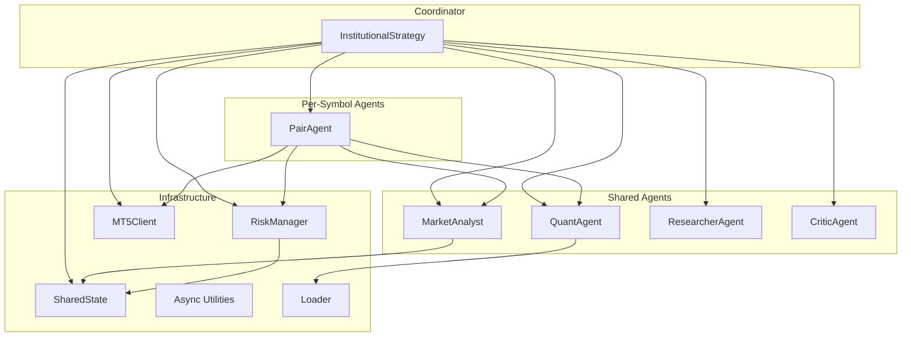
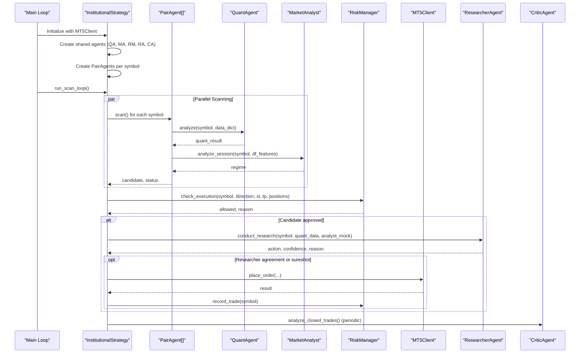
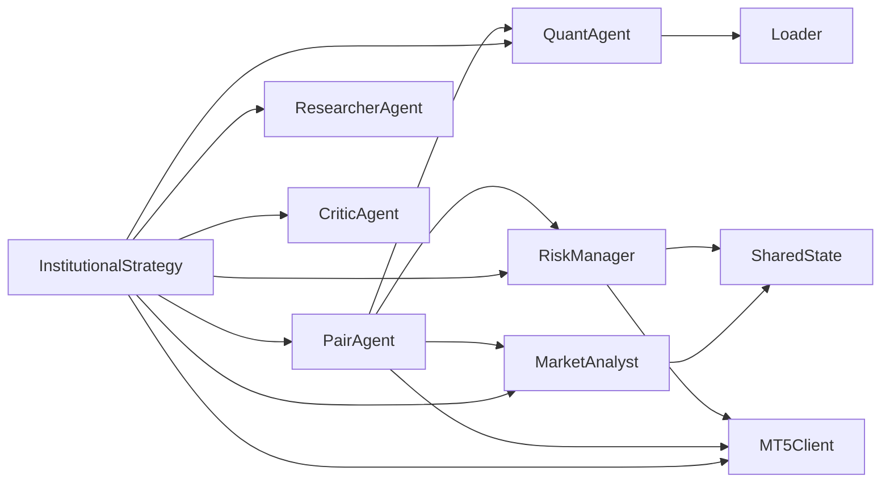

# Multi-Agent System

<cite>
**Referenced Files in This Document**
- [institutional_strategy.py](file://strategy/institutional_strategy.py)
- [pair_agent.py](file://strategy/pair_agent.py)
- [shared_state.py](file://utils/shared_state.py)
- [risk_manager.py](file://utils/risk_manager.py)
- [main.py](file://main.py)
- [market_analyst.py](file://analysis/market_analyst.py)
- [quant_agent.py](file://analysis/quant_agent.py)
- [researcher_agent.py](file://analysis/researcher_agent.py)
- [critic_agent.py](file://analysis/critic_agent.py)
- [settings.py](file://config/settings.py)
- [mt5_client.py](file://execution/mt5_client.py)
- [async_utils.py](file://utils/async_utils.py)
- [bos_strategy.py](file://strategy/bos_strategy.py)
- [loader.py](file://market_data/loader.py)
</cite>

## Table of Contents
1. [Introduction](#introduction)
2. [Project Structure](#project-structure)
3. [Core Components](#core-components)
4. [Architecture Overview](#architecture-overview)
5. [Detailed Component Analysis](#detailed-component-analysis)
6. [Dependency Analysis](#dependency-analysis)
7. [Performance Considerations](#performance-considerations)
8. [Troubleshooting Guide](#troubleshooting-guide)
9. [Conclusion](#conclusion)
10. [Appendices](#appendices)

## Introduction
This document describes the multi-agent architecture used by the InstitutionalStrategy system. The system orchestrates a central InstitutionalStrategy coordinator that manages multiple specialized agents operating independently per trading symbol. The core agents include:
- InstitutionalStrategy: Central coordinator that runs the scanning loop, aggregates results, and executes trades.
- PairAgent: Per-symbol agent responsible for scanning, analysis, and active trade management.
- Shared agents: QuantAgent (ML/technical analysis), MarketAnalyst (regime detection), ResearcherAgent (debate synthesis), CriticAgent (self-reflection).
- Shared infrastructure: RiskManager (global risk controls), SharedState (persistent whiteboard), MT5Client (execution), async utilities.

The architecture emphasizes agent specialization, resource sharing, isolation, fault tolerance, and performance optimization through asynchronous orchestration and parallelism.

## Project Structure
The system is organized around a clear separation of concerns:
- Strategy layer: Central orchestrator and per-symbol agents.
- Analysis layer: Specialized agents for quant, market regime, debate, and self-critique.
- Infrastructure: Risk management, shared state, execution, async utilities, and market data loading.
- Configuration: Centralized settings controlling behavior and thresholds.

**Diagram sources**
- [institutional_strategy.py](file://strategy/institutional_strategy.py#L49-L94)
- [pair_agent.py](file://strategy/pair_agent.py#L22-L54)
- [quant_agent.py](file://analysis/quant_agent.py#L34-L50)
- [market_analyst.py](file://analysis/market_analyst.py#L7-L20)
- [researcher_agent.py](file://analysis/researcher_agent.py#L5-L16)
- [critic_agent.py](file://analysis/critic_agent.py#L10-L16)
- [risk_manager.py](file://utils/risk_manager.py#L14-L39)
- [shared_state.py](file://utils/shared_state.py#L23-L27)
- [mt5_client.py](file://execution/mt5_client.py#L12-L28)
- [async_utils.py](file://utils/async_utils.py#L9-L17)
- [loader.py](file://market_data/loader.py#L40-L59)

**Section sources**
- [institutional_strategy.py](file://strategy/institutional_strategy.py#L49-L94)
- [pair_agent.py](file://strategy/pair_agent.py#L22-L54)
- [quant_agent.py](file://analysis/quant_agent.py#L34-L50)
- [market_analyst.py](file://analysis/market_analyst.py#L7-L20)
- [researcher_agent.py](file://analysis/researcher_agent.py#L5-L16)
- [critic_agent.py](file://analysis/critic_agent.py#L10-L16)
- [risk_manager.py](file://utils/risk_manager.py#L14-L39)
- [shared_state.py](file://utils/shared_state.py#L23-L27)
- [mt5_client.py](file://execution/mt5_client.py#L12-L28)
- [async_utils.py](file://utils/async_utils.py#L9-L17)
- [loader.py](file://market_data/loader.py#L40-L59)

## Core Components
- InstitutionalStrategy: Initializes shared agents and PairAgents per symbol, runs the scanning loop, aggregates candidates, applies global risk checks, and executes trades. It also coordinates periodic self-reflection via the CriticAgent.
- PairAgent: Independent agent per symbol performing data fetching, quant and regime analysis, candidate construction, and active trade management including trailing stops and regime exits.
- Shared agents:
  - QuantAgent: Performs ML inference and technical scoring across multiple timeframes.
  - MarketAnalyst: Detects market regimes and persists state to SharedState.
  - ResearcherAgent: Conducts a structured debate to synthesize quantitative and qualitative insights.
  - CriticAgent: Reviews closed trades and records lessons learned.
- RiskManager: Centralizes pre-scan and pre-execution risk checks, position sizing, and trade management actions.
- SharedState: Persistent key-value store enabling cross-agent state sharing without tight coupling.
- MT5Client: Provides unified access to MetaTrader 5 for data, orders, and position management.
- Async utilities: Thread pool executor and rate limiter to keep the event loop responsive.
- Loader: Historical data retrieval from MT5.

**Section sources**
- [institutional_strategy.py](file://strategy/institutional_strategy.py#L49-L94)
- [pair_agent.py](file://strategy/pair_agent.py#L22-L54)
- [quant_agent.py](file://analysis/quant_agent.py#L34-L50)
- [market_analyst.py](file://analysis/market_analyst.py#L7-L20)
- [researcher_agent.py](file://analysis/researcher_agent.py#L5-L16)
- [critic_agent.py](file://analysis/critic_agent.py#L10-L16)
- [risk_manager.py](file://utils/risk_manager.py#L14-L39)
- [shared_state.py](file://utils/shared_state.py#L23-L27)
- [mt5_client.py](file://execution/mt5_client.py#L12-L28)
- [async_utils.py](file://utils/async_utils.py#L9-L17)
- [loader.py](file://market_data/loader.py#L40-L59)

## Architecture Overview
The multi-agent system follows a centralized coordinator pattern with per-symbol specialization:
- Central coordinator (InstitutionalStrategy) initializes shared resources and PairAgents.
- PairAgents operate independently, each fetching data, running quant and regime analysis, and constructing candidates.
- InstitutionalStrategy aggregates results, applies global risk checks, and executes trades.
- Shared agents (QuantAgent, MarketAnalyst, ResearcherAgent, CriticAgent) are reused across symbols and coordinate via SharedState and RiskManager.
- RiskManager enforces global and per-symbol risk controls and performs position management.

**Diagram sources**
- [main.py](file://main.py#L75-L105)
- [institutional_strategy.py](file://strategy/institutional_strategy.py#L99-L330)
- [pair_agent.py](file://strategy/pair_agent.py#L71-L106)
- [quant_agent.py](file://analysis/quant_agent.py#L109-L159)
- [market_analyst.py](file://analysis/market_analyst.py#L25-L71)
- [risk_manager.py](file://utils/risk_manager.py#L237-L295)
- [mt5_client.py](file://execution/mt5_client.py#L216-L292)
- [researcher_agent.py](file://analysis/researcher_agent.py#L17-L82)
- [critic_agent.py](file://analysis/critic_agent.py#L17-L52)

## Detailed Component Analysis

### InstitutionalStrategy
- Initialization: Creates shared agents (QuantAgent, MarketAnalyst, RiskManager, ResearcherAgent, CriticAgent), DataCache, TradeJournal, and PairAgents for each symbol.
- Scanning loop: Manages active trades per symbol, performs global checks (session, daily limit, news), scans all PairAgents in parallel, applies execution risk checks, sorts candidates, consults ResearcherAgent, and executes trades.
- Execution: Validates direction, symbol tradeability, R:R mandate, and final risk checks before placing orders and recording trades.
- Self-reflection: Periodically triggers CriticAgent to review closed trades and emit events.

Key implementation references:
- Initialization and agent creation: [institutional_strategy.py](file://strategy/institutional_strategy.py#L54-L87)
- Scanning loop and candidate aggregation: [institutional_strategy.py](file://strategy/institutional_strategy.py#L99-L184)
- Researcher debate and decision logic: [institutional_strategy.py](file://strategy/institutional_strategy.py#L267-L324)
- Trade execution and risk checks: [institutional_strategy.py](file://strategy/institutional_strategy.py#L331-L436)
- Periodic critic analysis: [institutional_strategy.py](file://strategy/institutional_strategy.py#L326-L329)

**Section sources**
- [institutional_strategy.py](file://strategy/institutional_strategy.py#L54-L87)
- [institutional_strategy.py](file://strategy/institutional_strategy.py#L99-L184)
- [institutional_strategy.py](file://strategy/institutional_strategy.py#L267-L324)
- [institutional_strategy.py](file://strategy/institutional_strategy.py#L331-L436)
- [institutional_strategy.py](file://strategy/institutional_strategy.py#L326-L329)

### PairAgent
- Purpose: Per-symbol agent handling scanning, analysis, and active trade management.
- Lifecycle: Initializes with shared agents (QuantAgent, MarketAnalyst, RiskManager), loads state from TradeJournal, and maintains internal state (consecutive losses, P&L, regime).
- Scanning: Applies news blackout, cooldown, and pre-scan risk checks, fetches multi-timeframe data, runs quant and regime analysis, constructs candidate with volatility-adjusted SL/TP, and applies regime and retail viability filters.
- Active trade management: Uses RiskManager to monitor positions, trailing stops, partial closes, and regime exits.
- Circuit breaker: Pauses agent after consecutive losses exceeding threshold.

Key implementation references:
- Initialization and state loading: [pair_agent.py](file://strategy/pair_agent.py#L27-L70)
- Scanning pipeline: [pair_agent.py](file://strategy/pair_agent.py#L71-L106)
- Data fetching: [pair_agent.py](file://strategy/pair_agent.py#L107-L144)
- Quant and regime analysis: [pair_agent.py](file://strategy/pair_agent.py#L145-L295)
- Active trade management: [pair_agent.py](file://strategy/pair_agent.py#L297-L376)
- Circuit breaker and performance updates: [pair_agent.py](file://strategy/pair_agent.py#L382-L398)
- Retail viability filters: [pair_agent.py](file://strategy/pair_agent.py#L400-L428)

**Section sources**
- [pair_agent.py](file://strategy/pair_agent.py#L27-L70)
- [pair_agent.py](file://strategy/pair_agent.py#L71-L106)
- [pair_agent.py](file://strategy/pair_agent.py#L107-L144)
- [pair_agent.py](file://strategy/pair_agent.py#L145-L295)
- [pair_agent.py](file://strategy/pair_agent.py#L297-L376)
- [pair_agent.py](file://strategy/pair_agent.py#L382-L398)
- [pair_agent.py](file://strategy/pair_agent.py#L400-L428)

### Shared Agents

#### QuantAgent
- Responsibilities: ML inference (Random Forest/XGBoost), technical analysis, and signal generation with confluence scoring.
- Features: Loads models, computes trends across M5/H1/H4, calculates ML probabilities, integrates AI signals, and produces ensemble scores.

Key implementation references:
- Model loading and feature engineering: [quant_agent.py](file://analysis/quant_agent.py#L52-L108)
- Analysis pipeline: [quant_agent.py](file://analysis/quant_agent.py#L109-L159)
- Confluence scoring: [quant_agent.py](file://analysis/quant_agent.py#L231-L293)

**Section sources**
- [quant_agent.py](file://analysis/quant_agent.py#L52-L108)
- [quant_agent.py](file://analysis/quant_agent.py#L109-L159)
- [quant_agent.py](file://analysis/quant_agent.py#L231-L293)

#### MarketAnalyst
- Responsibilities: Regime detection, AI opinion requests, and persistence of regime state to SharedState.
- Integration: Uses RegimeDetector and MistralAdvisor; shares state via SharedState.

Key implementation references:
- Regime analysis and persistence: [market_analyst.py](file://analysis/market_analyst.py#L25-L71)

**Section sources**
- [market_analyst.py](file://analysis/market_analyst.py#L25-L71)

#### ResearcherAgent
- Responsibilities: Conducts structured debate synthesis to produce action/confidence/reason.
- Integration: Parses LLM responses and falls back to technical confidence when API key is missing.

Key implementation references:
- Debate orchestration and parsing: [researcher_agent.py](file://analysis/researcher_agent.py#L17-L132)

**Section sources**
- [researcher_agent.py](file://analysis/researcher_agent.py#L17-L132)

#### CriticAgent
- Responsibilities: Reviews closed trades without post-mortem, grades outcomes, and updates records.
- Integration: Emits events for dashboard and updates TradeJournal.

Key implementation references:
- Closed trade analysis and updates: [critic_agent.py](file://analysis/critic_agent.py#L17-L141)

**Section sources**
- [critic_agent.py](file://analysis/critic_agent.py#L17-L141)

### RiskManager
- Responsibilities: Pre-scan risk checks, execution risk checks, position sizing, and trade management actions (trailing stops, partial closes, BE).
- State: Uses SharedState for daily trade counts and circuit breaker.
- Controls: Daily limits, kill switch, payoff mandate, spread checks, session gating, correlation filtering, and profitability checks.

Key implementation references:
- Pre-scan checks: [risk_manager.py](file://utils/risk_manager.py#L51-L163)
- Execution checks and position sizing: [risk_manager.py](file://utils/risk_manager.py#L237-L396)
- Position monitoring and actions: [risk_manager.py](file://utils/risk_manager.py#L399-L548)

**Section sources**
- [risk_manager.py](file://utils/risk_manager.py#L51-L163)
- [risk_manager.py](file://utils/risk_manager.py#L237-L396)
- [risk_manager.py](file://utils/risk_manager.py#L399-L548)

### SharedState
- Purpose: Persistent key-value store enabling cross-agent state sharing (e.g., regime, daily trade counts).
- Schema: key, value (JSON serialized), updated_at.

Key implementation references:
- Store operations: [shared_state.py](file://utils/shared_state.py#L42-L109)

**Section sources**
- [shared_state.py](file://utils/shared_state.py#L42-L109)

### MT5Client
- Responsibilities: Connection management, symbol detection, account info, order placement, position modification/close, and dynamic lot sizing.
- Integration: Used by RiskManager and InstitutionalStrategy for execution and risk calculations.

Key implementation references:
- Connection and symbol detection: [mt5_client.py](file://execution/mt5_client.py#L18-L101)
- Order placement and position management: [mt5_client.py](file://execution/mt5_client.py#L216-L384)
- Lot sizing: [mt5_client.py](file://execution/mt5_client.py#L146-L195)

**Section sources**
- [mt5_client.py](file://execution/mt5_client.py#L18-L101)
- [mt5_client.py](file://execution/mt5_client.py#L216-L384)
- [mt5_client.py](file://execution/mt5_client.py#L146-L195)

### Async Utilities
- run_in_executor: Runs blocking functions in a thread pool to avoid blocking the asyncio loop.
- AsyncRateLimiter: Token bucket rate limiter for async operations.

Key implementation references:
- Executor wrapper: [async_utils.py](file://utils/async_utils.py#L9-L16)

**Section sources**
- [async_utils.py](file://utils/async_utils.py#L9-L16)

### Loader
- Responsibilities: Historical data retrieval from MT5 for single and multi-timeframe datasets.
- Integration: Used by PairAgent and QuantAgent for data fetching.

Key implementation references:
- Single timeframe data: [loader.py](file://market_data/loader.py#L40-L59)
- Multi-timeframe data: [loader.py](file://market_data/loader.py#L62-L82)

**Section sources**
- [loader.py](file://market_data/loader.py#L40-L59)
- [loader.py](file://market_data/loader.py#L62-L82)

### BOSStrategy
- Purpose: Institutional BOS strategy with momentum, liquidity sweep, and volatility expansion filters.
- Integration: Used by PairAgent to enhance candidates.

Key implementation references:
- BOS analysis: [bos_strategy.py](file://strategy/bos_strategy.py#L26-L161)

**Section sources**
- [bos_strategy.py](file://strategy/bos_strategy.py#L26-L161)

## Dependency Analysis
The system exhibits clear layered dependencies:
- InstitutionalStrategy depends on shared agents, RiskManager, MT5Client, and PairAgents.
- PairAgent depends on QuantAgent, MarketAnalyst, RiskManager, MT5Client, and TradeJournal.
- Shared agents depend on SharedState, Loader, and external advisors/models.
- RiskManager depends on SharedState and MT5Client.
- Async utilities support non-blocking operations across agents.

**Diagram sources**
- [institutional_strategy.py](file://strategy/institutional_strategy.py#L54-L87)
- [pair_agent.py](file://strategy/pair_agent.py#L27-L54)
- [quant_agent.py](file://analysis/quant_agent.py#L109-L159)
- [market_analyst.py](file://analysis/market_analyst.py#L25-L71)
- [risk_manager.py](file://utils/risk_manager.py#L14-L39)
- [mt5_client.py](file://execution/mt5_client.py#L12-L28)
- [loader.py](file://market_data/loader.py#L40-L59)
- [shared_state.py](file://utils/shared_state.py#L23-L27)

**Section sources**
- [institutional_strategy.py](file://strategy/institutional_strategy.py#L54-L87)
- [pair_agent.py](file://strategy/pair_agent.py#L27-L54)
- [quant_agent.py](file://analysis/quant_agent.py#L109-L159)
- [market_analyst.py](file://analysis/market_analyst.py#L25-L71)
- [risk_manager.py](file://utils/risk_manager.py#L14-L39)
- [mt5_client.py](file://execution/mt5_client.py#L12-L28)
- [loader.py](file://market_data/loader.py#L40-L59)
- [shared_state.py](file://utils/shared_state.py#L23-L27)

## Performance Considerations
- Parallelism: InstitutionalStrategy scans all PairAgents concurrently using asyncio.gather, maximizing throughput on multi-symbol universes.
- Asynchronous I/O: run_in_executor offloads blocking MT5 and model inference calls to thread pools, preventing event loop stalls.
- Multi-timeframe data: PairAgent fetches M5/H1/H4 data selectively based on settings to reduce overhead while preserving trend context.
- Position sizing: RiskManager’s calculate_position_size uses Kelly criterion fallbacks and confluence tiers to balance risk and reward.
- Trade management: Trailing stops and partial closes are computed dynamically using ATR or fixed percentages, reducing drawdowns.
- Circuit breaker: PairAgent’s consecutive loss threshold prevents prolonged losing streaks on individual symbols.

[No sources needed since this section provides general guidance]

## Troubleshooting Guide
Common issues and mitigations:
- No candidates found: Verify settings thresholds (MIN_CONFLUENCE_SCORE, RF_PROB_THRESHOLD) and regime filters; check news blackout and session filters.
- Execution blocked: Review RiskManager pre-scan and execution checks (daily limit, spread, correlation, payoff mandate).
- MT5 connectivity: Ensure MT5Client connects and symbols are detected; confirm account credentials and server settings.
- Model loading failures: Confirm model paths and feature columns exist; verify environment variables for model locations.
- SharedState persistence: Ensure shared_state.db is writable and accessible; check JSON serialization/deserialization.

**Section sources**
- [institutional_strategy.py](file://strategy/institutional_strategy.py#L105-L121)
- [risk_manager.py](file://utils/risk_manager.py#L51-L163)
- [risk_manager.py](file://utils/risk_manager.py#L237-L295)
- [mt5_client.py](file://execution/mt5_client.py#L18-L28)
- [quant_agent.py](file://analysis/quant_agent.py#L52-L84)
- [shared_state.py](file://utils/shared_state.py#L42-L109)

## Conclusion
The multi-agent system centers InstitutionalStrategy as a robust coordinator that delegates specialized tasks to per-symbol PairAgents while leveraging shared agents and infrastructure. The architecture achieves scalability, isolation, and resilience through:
- Centralized coordination with parallel per-symbol processing
- Shared risk management and state persistence
- Structured decision-making via quant, regime, and debate agents
- Continuous self-reflection and adaptation

This design enables adaptive, high-throughput trading across a broad symbol universe with strong fault tolerance and performance characteristics.

[No sources needed since this section summarizes without analyzing specific files]

## Appendices

### Implementation Examples

- Agent creation and lifecycle
  - InstitutionalStrategy initializes shared agents and PairAgents per symbol: [institutional_strategy.py](file://strategy/institutional_strategy.py#L54-L87)
  - PairAgent loads state from TradeJournal and maintains internal state: [pair_agent.py](file://strategy/pair_agent.py#L56-L70)

- Task delegation and result aggregation
  - InstitutionalStrategy runs PairAgent scans in parallel and aggregates results: [institutional_strategy.py](file://strategy/institutional_strategy.py#L132-L184)
  - PairAgent constructs candidates with volatility-adjusted SL/TP and regime filters: [pair_agent.py](file://strategy/pair_agent.py#L204-L295)

- Execution and risk management
  - InstitutionalStrategy validates direction and symbol tradeability, enforces R:R mandate, and places orders: [institutional_strategy.py](file://strategy/institutional_strategy.py#L331-L436)
  - RiskManager performs pre-scan and execution checks and monitors positions: [risk_manager.py](file://utils/risk_manager.py#L51-L163), [risk_manager.py](file://utils/risk_manager.py#L237-L548)

- Communication and state synchronization
  - MarketAnalyst persists regime to SharedState for cross-agent visibility: [market_analyst.py](file://analysis/market_analyst.py#L50-L57)
  - SharedState provides set/get/delete operations for key-value state: [shared_state.py](file://utils/shared_state.py#L42-L109)

- Fault tolerance and isolation
  - PairAgent circuit breaker pauses after consecutive losses: [pair_agent.py](file://strategy/pair_agent.py#L390-L398)
  - InstitutionalStrategy continues scanning despite exceptions via gather with return_exceptions: [institutional_strategy.py](file://strategy/institutional_strategy.py#L140-L149)

- Performance optimization strategies
  - run_in_executor offloads blocking calls: [async_utils.py](file://utils/async_utils.py#L9-L16)
  - PairAgent caches ATR for dynamic trailing to reduce indicator recomputation: [pair_agent.py](file://strategy/pair_agent.py#L318-L336)
  - InstitutionalStrategy adapts sleep based on cycle duration: [main.py](file://main.py#L103-L105)

**Section sources**
- [institutional_strategy.py](file://strategy/institutional_strategy.py#L54-L87)
- [pair_agent.py](file://strategy/pair_agent.py#L56-L70)
- [institutional_strategy.py](file://strategy/institutional_strategy.py#L132-L184)
- [pair_agent.py](file://strategy/pair_agent.py#L204-L295)
- [institutional_strategy.py](file://strategy/institutional_strategy.py#L331-L436)
- [risk_manager.py](file://utils/risk_manager.py#L51-L163)
- [risk_manager.py](file://utils/risk_manager.py#L237-L548)
- [market_analyst.py](file://analysis/market_analyst.py#L50-L57)
- [shared_state.py](file://utils/shared_state.py#L42-L109)
- [async_utils.py](file://utils/async_utils.py#L9-L16)
- [pair_agent.py](file://strategy/pair_agent.py#L318-L336)
- [main.py](file://main.py#L103-L105)