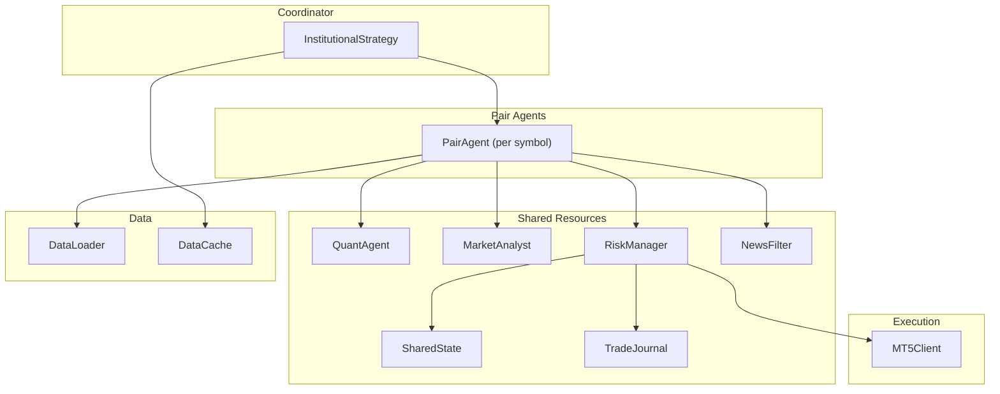
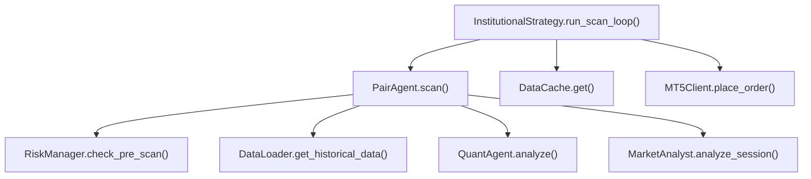
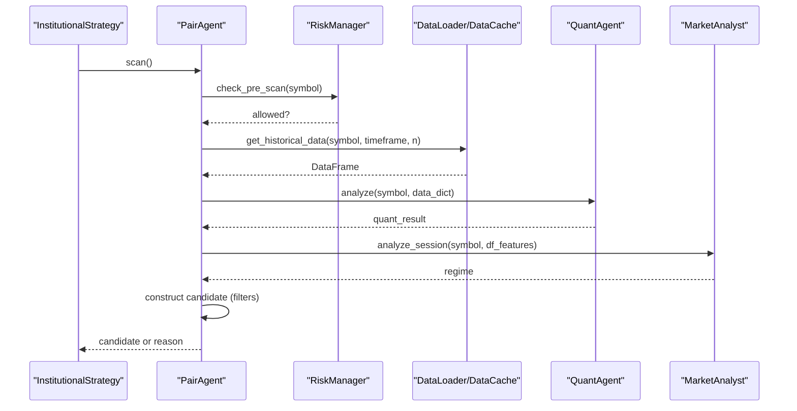
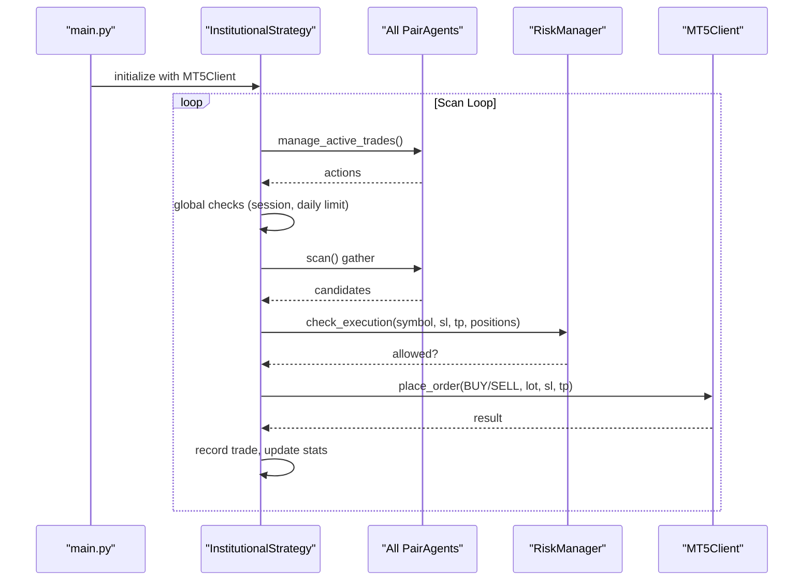
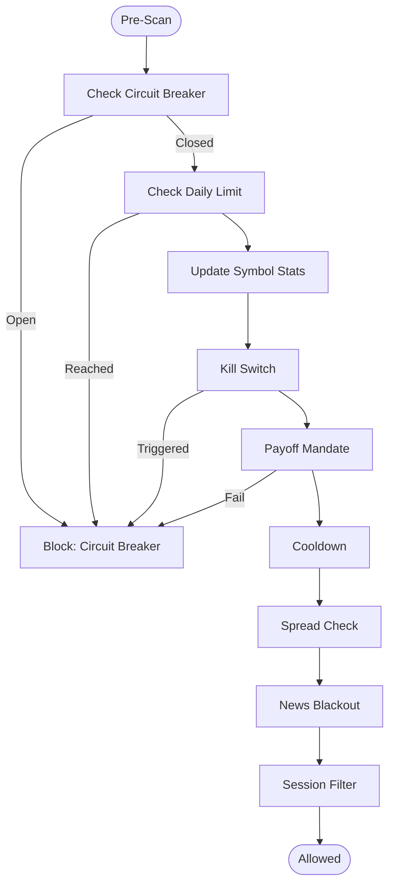
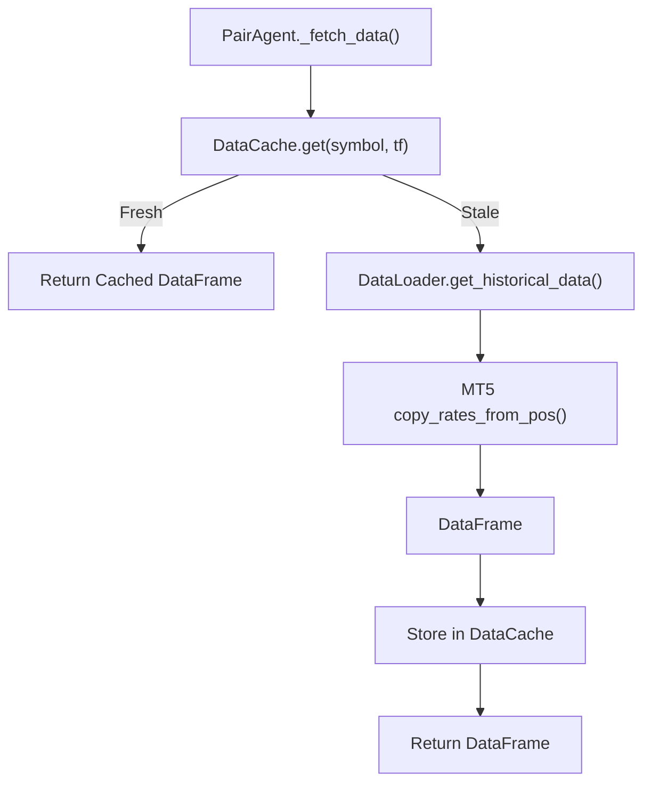
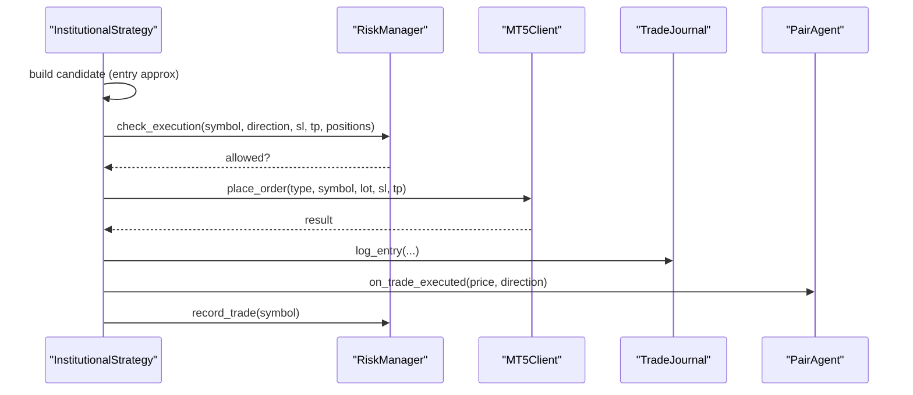
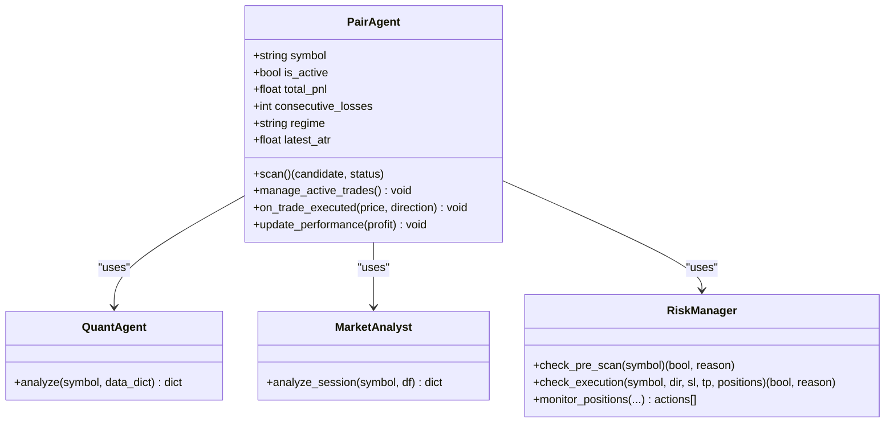
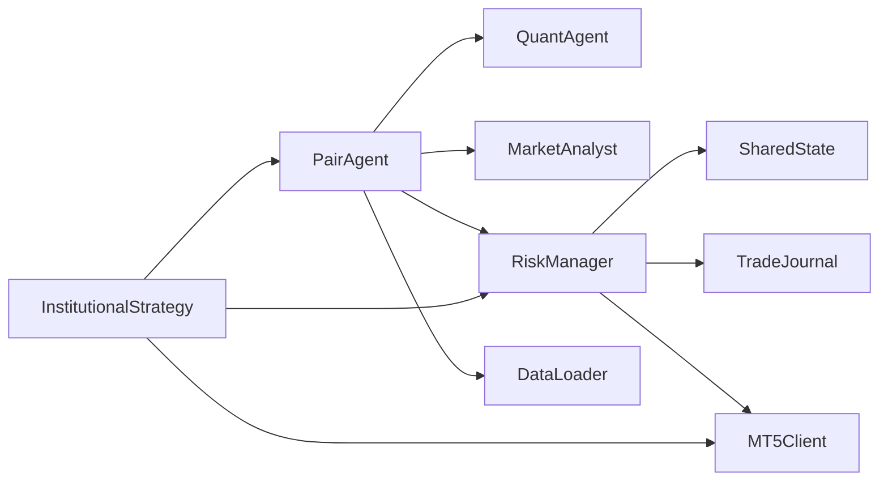

# Pair Agent Pattern and Lifecycle

<cite>
**Referenced Files in This Document**
- [strategy/pair_agent.py](file://strategy/pair_agent.py)
- [strategy/institutional_strategy.py](file://strategy/institutional_strategy.py)
- [execution/mt5_client.py](file://execution/mt5_client.py)
- [market_data/loader.py](file://market_data/loader.py)
- [utils/risk_manager.py](file://utils/risk_manager.py)
- [utils/shared_state.py](file://utils/shared_state.py)
- [utils/news_filter.py](file://utils/news_filter.py)
- [analysis/market_analyst.py](file://analysis/market_analyst.py)
- [analysis/quant_agent.py](file://analysis/quant_agent.py)
- [analysis/bos_strategy.py](file://analysis/bos_strategy.py)
- [utils/trade_journal.py](file://utils/trade_journal.py)
- [config/settings.py](file://config/settings.py)
- [main.py](file://main.py)
</cite>

## Table of Contents
1. [Introduction](#introduction)
2. [Project Structure](#project-structure)
3. [Core Components](#core-components)
4. [Architecture Overview](#architecture-overview)
5. [Detailed Component Analysis](#detailed-component-analysis)
6. [Dependency Analysis](#dependency-analysis)
7. [Performance Considerations](#performance-considerations)
8. [Troubleshooting Guide](#troubleshooting-guide)
9. [Conclusion](#conclusion)
10. [Appendices](#appendices)

## Introduction
This document explains the PairAgent architecture and lifecycle management for a multi-agent trading system. Each PairAgent specializes in a single trading pair, operating independently while sharing common resources through dependency injection. The system coordinates scanning, analysis, execution, and active trade management across many pairs concurrently, with robust risk controls, state persistence, and performance monitoring.

## Project Structure
The system centers on a coordinator that instantiates a PairAgent per symbol and orchestrates scanning and execution. Shared resources include a risk manager, quant agent, market analyst, and common utilities for data loading, caching, journaling, and state.

**Diagram sources**
- [strategy/institutional_strategy.py](file://strategy/institutional_strategy.py#L49-L94)
- [strategy/pair_agent.py](file://strategy/pair_agent.py#L22-L54)
- [utils/risk_manager.py](file://utils/risk_manager.py#L14-L39)
- [utils/shared_state.py](file://utils/shared_state.py#L23-L40)
- [utils/trade_journal.py](file://utils/trade_journal.py#L23-L31)
- [utils/news_filter.py](file://utils/news_filter.py#L159-L205)
- [market_data/loader.py](file://market_data/loader.py#L40-L59)
- [utils/data_cache.py](file://utils/data_cache.py#L16-L28)
- [execution/mt5_client.py](file://execution/mt5_client.py#L12-L27)

**Section sources**
- [strategy/institutional_strategy.py](file://strategy/institutional_strategy.py#L49-L94)
- [strategy/pair_agent.py](file://strategy/pair_agent.py#L22-L54)
- [execution/mt5_client.py](file://execution/mt5_client.py#L12-L27)
- [market_data/loader.py](file://market_data/loader.py#L40-L59)
- [utils/risk_manager.py](file://utils/risk_manager.py#L14-L39)
- [utils/shared_state.py](file://utils/shared_state.py#L23-L40)
- [utils/news_filter.py](file://utils/news_filter.py#L159-L205)
- [analysis/market_analyst.py](file://analysis/market_analyst.py#L7-L20)
- [analysis/quant_agent.py](file://analysis/quant_agent.py#L34-L50)
- [analysis/bos_strategy.py](file://analysis/bos_strategy.py#L20-L25)
- [utils/trade_journal.py](file://utils/trade_journal.py#L23-L31)
- [config/settings.py](file://config/settings.py#L1-L201)
- [main.py](file://main.py#L19-L122)

## Core Components
- PairAgent: Per-symbol agent responsible for scanning, candidate construction, and active trade management. It holds per-symbol state and enforces self-correction circuit breakers.
- InstitutionalStrategy: Coordinator that initializes shared agents and orchestrates scanning across all PairAgents, performs global checks, and executes trades.
- QuantAgent: Shared ML and technical analysis engine providing confluence scoring and probability estimates.
- MarketAnalyst: Shared regime detector and AI opinion provider.
- RiskManager: Centralized risk control with pre-scan checks, execution gating, position sizing, trailing, partial closes, and shared state persistence.
- SharedState: Persistent key-value store enabling cross-agent coordination without tight coupling.
- MT5Client: Broker connectivity and order management.
- DataLoader/DataCache: Efficient historical data fetching with TTL caching.
- TradeJournal: Persistent trade logging and performance analytics.
- NewsFilter: High-impact event avoidance logic.

**Section sources**
- [strategy/pair_agent.py](file://strategy/pair_agent.py#L22-L54)
- [strategy/institutional_strategy.py](file://strategy/institutional_strategy.py#L49-L94)
- [analysis/quant_agent.py](file://analysis/quant_agent.py#L34-L50)
- [analysis/market_analyst.py](file://analysis/market_analyst.py#L7-L20)
- [utils/risk_manager.py](file://utils/risk_manager.py#L14-L39)
- [utils/shared_state.py](file://utils/shared_state.py#L23-L40)
- [execution/mt5_client.py](file://execution/mt5_client.py#L12-L27)
- [market_data/loader.py](file://market_data/loader.py#L40-L59)
- [utils/data_cache.py](file://utils/data_cache.py#L16-L28)
- [utils/trade_journal.py](file://utils/trade_journal.py#L23-L31)
- [utils/news_filter.py](file://utils/news_filter.py#L159-L205)

## Architecture Overview
The system follows a multi-agent architecture:
- Each PairAgent encapsulates per-symbol intelligence and state.
- Shared agents (QuantAgent, MarketAnalyst, RiskManager) are injected into each PairAgent.
- InstitutionalStrategy coordinates scanning, applies global constraints, and executes trades.
- RiskManager centralizes risk checks and persists state to SharedState.
- Data access is optimized via DataLoader and DataCache.

**Diagram sources**
- [strategy/institutional_strategy.py](file://strategy/institutional_strategy.py#L99-L141)
- [strategy/pair_agent.py](file://strategy/pair_agent.py#L71-L105)
- [analysis/quant_agent.py](file://analysis/quant_agent.py#L109-L159)
- [analysis/market_analyst.py](file://analysis/market_analyst.py#L25-L71)
- [utils/risk_manager.py](file://utils/risk_manager.py#L51-L163)
- [market_data/loader.py](file://market_data/loader.py#L40-L59)
- [utils/data_cache.py](file://utils/data_cache.py#L30-L48)
- [execution/mt5_client.py](file://execution/mt5_client.py#L216-L292)

## Detailed Component Analysis

### PairAgent Lifecycle and Responsibilities
- Initialization: Receives shared resources (QuantAgent, MarketAnalyst, RiskManager) and loads per-symbol state from TradeJournal. Initializes internal state (consecutive losses, P&L, regime, ATR cache).
- Scanning: Executes pre-scan risk checks, data fetch, quant and regime analysis, and constructs a candidate with volatility-adjusted SL/TP and filters.
- Active Trade Management: Uses cached or fetched ATR to trail stops, break-even, and partial closes; enforces regime exits.
- Execution Hooks: Notified on order fills and updates performance state; supports circuit breaker pause and reset.
- Retail Filters: Enforces retail viability checks for BOS-only candidates.

**Diagram sources**
- [strategy/institutional_strategy.py](file://strategy/institutional_strategy.py#L132-L181)
- [strategy/pair_agent.py](file://strategy/pair_agent.py#L71-L105)
- [strategy/pair_agent.py](file://strategy/pair_agent.py#L107-L144)
- [strategy/pair_agent.py](file://strategy/pair_agent.py#L145-L295)
- [utils/risk_manager.py](file://utils/risk_manager.py#L51-L163)
- [market_data/loader.py](file://market_data/loader.py#L40-L59)
- [analysis/quant_agent.py](file://analysis/quant_agent.py#L109-L159)
- [analysis/market_analyst.py](file://analysis/market_analyst.py#L25-L71)

**Section sources**
- [strategy/pair_agent.py](file://strategy/pair_agent.py#L27-L54)
- [strategy/pair_agent.py](file://strategy/pair_agent.py#L71-L105)
- [strategy/pair_agent.py](file://strategy/pair_agent.py#L107-L144)
- [strategy/pair_agent.py](file://strategy/pair_agent.py#L145-L295)
- [strategy/pair_agent.py](file://strategy/pair_agent.py#L297-L376)
- [strategy/pair_agent.py](file://strategy/pair_agent.py#L377-L398)
- [strategy/pair_agent.py](file://strategy/pair_agent.py#L400-L428)

### InstitutionalStrategy Orchestration
- Initializes shared agents and PairAgents per symbol.
- Runs active trade management for all agents concurrently.
- Performs global session and daily trade checks.
- Gathers scan results, applies execution risk checks, sorts candidates, and executes the best candidate after optional debate.
- Emits events for dashboard and telemetry.

**Diagram sources**
- [main.py](file://main.py#L75-L105)
- [strategy/institutional_strategy.py](file://strategy/institutional_strategy.py#L99-L141)
- [strategy/institutional_strategy.py](file://strategy/institutional_strategy.py#L331-L436)
- [utils/risk_manager.py](file://utils/risk_manager.py#L237-L295)
- [execution/mt5_client.py](file://execution/mt5_client.py#L216-L292)

**Section sources**
- [strategy/institutional_strategy.py](file://strategy/institutional_strategy.py#L49-L94)
- [strategy/institutional_strategy.py](file://strategy/institutional_strategy.py#L99-L141)
- [strategy/institutional_strategy.py](file://strategy/institutional_strategy.py#L331-L436)
- [main.py](file://main.py#L75-L105)

### RiskManager and Shared State
- Pre-scan checks include circuit breaker, daily limit, kill switch, payoff mandate, cooldown, spread, news blackout, and session gating.
- Execution checks include concurrent trade caps, live correlation conflicts, and profitability thresholds.
- Position sizing uses Kelly Criterion fallback to confluence tiers.
- SharedState persists daily counts, circuit breaker, and regime metadata.

**Diagram sources**
- [utils/risk_manager.py](file://utils/risk_manager.py#L51-L163)
- [utils/shared_state.py](file://utils/shared_state.py#L42-L75)
- [utils/news_filter.py](file://utils/news_filter.py#L159-L205)

**Section sources**
- [utils/risk_manager.py](file://utils/risk_manager.py#L14-L39)
- [utils/risk_manager.py](file://utils/risk_manager.py#L51-L163)
- [utils/risk_manager.py](file://utils/risk_manager.py#L237-L295)
- [utils/risk_manager.py](file://utils/risk_manager.py#L341-L396)
- [utils/shared_state.py](file://utils/shared_state.py#L42-L75)
- [utils/news_filter.py](file://utils/news_filter.py#L159-L205)

### Data Access and Caching
- DataLoader fetches historical bars from MT5 and normalizes timestamps.
- DataCache caches multi-timeframe datasets with TTLs to reduce API calls.
- PairAgent uses DataCache and DataLoader to fetch M1/M5/H1/H4 as configured.

**Diagram sources**
- [strategy/pair_agent.py](file://strategy/pair_agent.py#L107-L139)
- [utils/data_cache.py](file://utils/data_cache.py#L30-L48)
- [market_data/loader.py](file://market_data/loader.py#L40-L59)

**Section sources**
- [strategy/pair_agent.py](file://strategy/pair_agent.py#L107-L139)
- [utils/data_cache.py](file://utils/data_cache.py#L16-L28)
- [market_data/loader.py](file://market_data/loader.py#L40-L59)

### Trade Execution and Post-Execution
- InstitutionalStrategy validates candidate SL/TP against execution risk and places orders via MT5Client.
- RiskManager records trades and updates counters; TradeJournal logs entries and exits.
- PairAgent is notified on execution to update last trade time and action.

**Diagram sources**
- [strategy/institutional_strategy.py](file://strategy/institutional_strategy.py#L331-L436)
- [utils/risk_manager.py](file://utils/risk_manager.py#L297-L301)
- [utils/trade_journal.py](file://utils/trade_journal.py#L103-L131)
- [execution/mt5_client.py](file://execution/mt5_client.py#L216-L292)

**Section sources**
- [strategy/institutional_strategy.py](file://strategy/institutional_strategy.py#L331-L436)
- [utils/risk_manager.py](file://utils/risk_manager.py#L297-L301)
- [utils/trade_journal.py](file://utils/trade_journal.py#L103-L131)
- [execution/mt5_client.py](file://execution/mt5_client.py#L216-L292)

### Specialization Patterns and Independent Decision-Making
- Per-symbol specialization: PairAgent holds symbol-specific state and filters, ensuring independent decision-making per pair.
- Shared intelligence: QuantAgent and MarketAnalyst are injected, enabling consistent analysis across pairs while preserving per-symbol autonomy.
- BOS fusion: PairAgent optionally augments ML candidates with BOS setups, maintaining independent logic for regime exits and trailing.

**Diagram sources**
- [strategy/pair_agent.py](file://strategy/pair_agent.py#L22-L54)
- [analysis/quant_agent.py](file://analysis/quant_agent.py#L109-L159)
- [analysis/market_analyst.py](file://analysis/market_analyst.py#L25-L71)
- [utils/risk_manager.py](file://utils/risk_manager.py#L51-L163)

**Section sources**
- [strategy/pair_agent.py](file://strategy/pair_agent.py#L22-L54)
- [analysis/quant_agent.py](file://analysis/quant_agent.py#L109-L159)
- [analysis/market_analyst.py](file://analysis/market_analyst.py#L25-L71)
- [utils/risk_manager.py](file://utils/risk_manager.py#L51-L163)

### Resource Isolation and State Synchronization
- Per-agent isolation: PairAgent maintains independent state (consecutive losses, P&L, last scan/trade times, regime, ATR cache).
- Shared isolation: RiskManager and MarketAnalyst are singletons injected into each PairAgent; SharedState persists global state (daily trades, circuit breaker).
- TradeJournal provides centralized persistence for performance tracking and post-mortem analysis.

**Section sources**
- [strategy/pair_agent.py](file://strategy/pair_agent.py#L34-L43)
- [utils/shared_state.py](file://utils/shared_state.py#L42-L75)
- [utils/trade_journal.py](file://utils/trade_journal.py#L32-L101)

### Performance Monitoring Strategies
- Metrics: Daily trade counts, win rate, average R:R, confluence analysis, and per-factor win rates.
- Real-time dashboards: Events emitted for scan summaries, positions, and account updates.
- Self-reflection: Periodic post-mortem reviews via CriticAgent.

**Section sources**
- [strategy/institutional_strategy.py](file://strategy/institutional_strategy.py#L185-L236)
- [utils/trade_journal.py](file://utils/trade_journal.py#L166-L195)
- [utils/trade_journal.py](file://utils/trade_journal.py#L197-L246)
- [analysis/critic_agent.py](file://analysis/critic_agent.py#L17-L52)

## Dependency Analysis
- Coupling: PairAgent depends on shared agents and utilities; InstitutionalStrategy composes PairAgents and RiskManager.
- Cohesion: Each component has a focused responsibility (scanning, analysis, risk, execution, persistence).
- External dependencies: MT5 terminal, pandas, NumPy, XGBoost, PyTorch, TA-Lib, SQLite.

**Diagram sources**
- [strategy/pair_agent.py](file://strategy/pair_agent.py#L27-L54)
- [strategy/institutional_strategy.py](file://strategy/institutional_strategy.py#L54-L86)
- [utils/risk_manager.py](file://utils/risk_manager.py#L14-L39)
- [utils/shared_state.py](file://utils/shared_state.py#L23-L40)
- [utils/trade_journal.py](file://utils/trade_journal.py#L23-L31)
- [execution/mt5_client.py](file://execution/mt5_client.py#L12-L27)
- [market_data/loader.py](file://market_data/loader.py#L40-L59)

**Section sources**
- [strategy/pair_agent.py](file://strategy/pair_agent.py#L27-L54)
- [strategy/institutional_strategy.py](file://strategy/institutional_strategy.py#L54-L86)
- [utils/risk_manager.py](file://utils/risk_manager.py#L14-L39)

## Performance Considerations
- Concurrency: Scanning runs in parallel across all PairAgents; active trade management also runs concurrently.
- Caching: DataCache reduces MT5 API calls; TTL tuning balances freshness and cost.
- Risk gating: Pre-scan and execution checks prevent costly mistakes and reduce latency by failing fast.
- Position sizing: Kelly Criterion with confluence fallback optimizes capital usage.

[No sources needed since this section provides general guidance]

## Troubleshooting Guide
- No candidates found: Check news blackout, session filters, spread thresholds, and daily limits.
- Execution blocked: Review correlation conflicts, payoff mandate, and minimum net profit thresholds.
- Circuit breaker paused: Inspect consecutive losses and TradeJournal recent outcomes.
- Data fetch failures: Verify MT5 connectivity and symbol availability; confirm DataLoader initialization.

**Section sources**
- [strategy/pair_agent.py](file://strategy/pair_agent.py#L71-L105)
- [utils/risk_manager.py](file://utils/risk_manager.py#L51-L163)
- [utils/risk_manager.py](file://utils/risk_manager.py#L237-L295)
- [utils/news_filter.py](file://utils/news_filter.py#L159-L205)
- [market_data/loader.py](file://market_data/loader.py#L24-L37)

## Conclusion
The PairAgent pattern enables scalable, independent trading across many symbols while leveraging shared intelligence and centralized risk controls. The lifecycle spans initialization, scanning, execution, and active management, with robust state persistence and performance monitoring. Extensions can integrate new analytical capabilities through shared agents and maintain resource isolation via dependency injection.

[No sources needed since this section summarizes without analyzing specific files]

## Appendices

### Configuration Highlights
- Timeframes, risk parameters, and gating thresholds are defined centrally for consistent behavior across agents.

**Section sources**
- [config/settings.py](file://config/settings.py#L63-L108)
- [config/settings.py](file://config/settings.py#L77-L81)
- [config/settings.py](file://config/settings.py#L94-L103)
- [config/settings.py](file://config/settings.py#L104-L108)
- [config/settings.py](file://config/settings.py#L150-L167)
- [config/settings.py](file://config/settings.py#L178-L185)