# Shared Resources and Dependencies

<cite>
**Referenced Files in This Document**
- [quant_agent.py](file://analysis/quant_agent.py)
- [market_analyst.py](file://analysis/market_analyst.py)
- [researcher_agent.py](file://analysis/researcher_agent.py)
- [critic_agent.py](file://analysis/critic_agent.py)
- [risk_manager.py](file://utils/risk_manager.py)
- [pair_agent.py](file://strategy/pair_agent.py)
- [institutional_strategy.py](file://strategy/institutional_strategy.py)
- [shared_state.py](file://utils/shared_state.py)
- [settings.py](file://config/settings.py)
- [data_cache.py](file://utils/data_cache.py)
- [main.py](file://main.py)
</cite>

## Table of Contents
1. [Introduction](#introduction)
2. [Project Structure](#project-structure)
3. [Core Components](#core-components)
4. [Architecture Overview](#architecture-overview)
5. [Detailed Component Analysis](#detailed-component-analysis)
6. [Dependency Analysis](#dependency-analysis)
7. [Performance Considerations](#performance-considerations)
8. [Troubleshooting Guide](#troubleshooting-guide)
9. [Conclusion](#conclusion)

## Introduction
This document explains the shared resource architecture enabling efficient, concurrent, and coordinated operation across multiple agents. It focuses on how shared components—QuantAgent for machine learning inference, MarketAnalyst for regime detection, RiskManager for global controls, ResearcherAgent for debate coordination, and CriticAgent for post-mortem analysis—are initialized, injected, and reused by all PairAgents. It covers dependency injection patterns, resource lifecycle, thread safety, concurrency, and performance implications.

## Project Structure
The system is organized around an agentic architecture:
- InstitutionalStrategy coordinates shared resources and instantiates PairAgent instances per symbol.
- PairAgent orchestrates scanning and execution for a single symbol, delegating to shared agents.
- Shared agents encapsulate specialized logic and persist state via SharedState.

**Diagram sources**
- [institutional_strategy.py](file://strategy/institutional_strategy.py#L54-L94)
- [pair_agent.py](file://strategy/pair_agent.py#L27-L54)
- [shared_state.py](file://utils/shared_state.py#L23-L110)

**Section sources**
- [institutional_strategy.py](file://strategy/institutional_strategy.py#L54-L94)
- [pair_agent.py](file://strategy/pair_agent.py#L27-L54)
- [shared_state.py](file://utils/shared_state.py#L23-L110)

## Core Components
- QuantAgent: Loads and runs ML models (Random Forest, XGBoost, LSTM, Lag-Llama), computes technical trends, and produces a unified signal.
- MarketAnalyst: Performs regime detection, integrates AI sentiment, and persists state to SharedState.
- RiskManager: Centralizes pre- and post-execution risk checks, position sizing, correlation filtering, and live monitoring.
- ResearcherAgent: Conducts a structured debate between bullish/bearish arguments and synthesizes a recommendation.
- CriticAgent: Reviews closed trades asynchronously and updates the trade journal.
- SharedState: Persistent key-value store for cross-agent communication and state persistence.
- PairAgent: Per-symbol agent that composes shared resources to scan, evaluate, and manage trades.

**Section sources**
- [quant_agent.py](file://analysis/quant_agent.py#L34-L294)
- [market_analyst.py](file://analysis/market_analyst.py#L7-L81)
- [risk_manager.py](file://utils/risk_manager.py#L14-L549)
- [researcher_agent.py](file://analysis/researcher_agent.py#L5-L132)
- [critic_agent.py](file://analysis/critic_agent.py#L10-L141)
- [shared_state.py](file://utils/shared_state.py#L23-L110)
- [pair_agent.py](file://strategy/pair_agent.py#L22-L432)

## Architecture Overview
The architecture follows a dependency injection pattern:
- InstitutionalStrategy constructs shared agents and injects them into each PairAgent.
- PairAgent holds references to shared agents and delegates analysis and risk checks.
- SharedState is used by MarketAnalyst to persist regime and risk-related state.

**Diagram sources**
- [institutional_strategy.py](file://strategy/institutional_strategy.py#L59-L86)
- [pair_agent.py](file://strategy/pair_agent.py#L71-L295)
- [market_analyst.py](file://analysis/market_analyst.py#L25-L71)
- [risk_manager.py](file://utils/risk_manager.py#L51-L340)
- [shared_state.py](file://utils/shared_state.py#L42-L76)

## Detailed Component Analysis

### Dependency Injection Pattern and Initialization
- InstitutionalStrategy initializes shared agents once and passes them to each PairAgent constructor.
- PairAgent stores references to shared agents and uses them for analysis and risk checks.
- RiskManager restores persisted state from SharedState on construction.

```mermaid
classDiagram
class InstitutionalStrategy {
+client
+risk_manager : RiskManager
+analyst : MarketAnalyst
+quant : QuantAgent
+researcher : ResearcherAgent
+critic : CriticAgent
+agents : dict<PairAgent>
+run_scan_loop()
}
class PairAgent {
+symbol : str
+quant : QuantAgent
+analyst : MarketAnalyst
+risk_manager : RiskManager
+journal : TradeJournal
+scan() async
+manage_active_trades() async
}
class RiskManager {
+state : SharedState
+check_pre_scan()
+check_execution()
+monitor_positions()
+calculate_position_size()
}
class MarketAnalyst {
+state : SharedState
+regime_detector
+mistral
+analyze_session()
}
class QuantAgent {
+model
+xgb_model
+hf_predictor
+lstm_predictors
+analyze()
}
class ResearcherAgent {
+advisor
+conduct_research() async
}
class CriticAgent {
+advisor
+analyze_closed_trades() async
}
InstitutionalStrategy --> RiskManager : "inject"
InstitutionalStrategy --> MarketAnalyst : "inject"
InstitutionalStrategy --> QuantAgent : "inject"
InstitutionalStrategy --> ResearcherAgent : "inject"
InstitutionalStrategy --> CriticAgent : "inject"
InstitutionalStrategy --> PairAgent : "instantiate"
PairAgent --> QuantAgent : "uses"
PairAgent --> MarketAnalyst : "uses"
PairAgent --> RiskManager : "uses"
MarketAnalyst --> SharedState : "persists"
RiskManager --> SharedState : "restores"
```

**Diagram sources**
- [institutional_strategy.py](file://strategy/institutional_strategy.py#L54-L94)
- [pair_agent.py](file://strategy/pair_agent.py#L27-L54)
- [risk_manager.py](file://utils/risk_manager.py#L14-L50)
- [market_analyst.py](file://analysis/market_analyst.py#L15-L19)
- [shared_state.py](file://utils/shared_state.py#L23-L110)

**Section sources**
- [institutional_strategy.py](file://strategy/institutional_strategy.py#L59-L86)
- [pair_agent.py](file://strategy/pair_agent.py#L27-L54)
- [risk_manager.py](file://utils/risk_manager.py#L14-L50)
- [market_analyst.py](file://analysis/market_analyst.py#L15-L19)

### Resource Lifecycle Management
- Initialization ordering:
  - InstitutionalStrategy constructs shared agents first, then creates PairAgents.
  - RiskManager restores persisted state (daily trades, last trade timestamps) from SharedState.
- Cleanup and failure recovery:
  - RiskManager resets daily counters on date change and continues on exceptions.
  - MarketAnalyst persists regime data to SharedState; failures are handled gracefully.
  - QuantAgent loads models lazily and tolerates missing artifacts.
  - DataCache provides TTL-based caching to reduce repeated MT5 calls.

**Section sources**
- [institutional_strategy.py](file://strategy/institutional_strategy.py#L59-L86)
- [risk_manager.py](file://utils/risk_manager.py#L41-L106)
- [market_analyst.py](file://analysis/market_analyst.py#L50-L57)
- [quant_agent.py](file://analysis/quant_agent.py#L52-L107)
- [data_cache.py](file://utils/data_cache.py#L16-L77)

### Thread Safety and Concurrency
- SharedState uses SQLite with synchronous writes; it is not thread-safe for concurrent writers. However, it is used primarily for read-mostly persistence and occasional updates, minimizing contention.
- RiskManager maintains in-memory state (e.g., last_stats_update, symbol_stats) keyed by symbol; these are local to the RiskManager instance and safe for concurrent access by agents.
- QuantAgent’s model loading occurs once at initialization; inference calls are stateless and safe for concurrent use.
- InstitutionalStrategy runs scans concurrently via asyncio.gather; PairAgent methods are designed to be non-blocking and delegate blocking operations to executor pools where applicable.

**Section sources**
- [shared_state.py](file://utils/shared_state.py#L42-L76)
- [risk_manager.py](file://utils/risk_manager.py#L36-L40)
- [quant_agent.py](file://analysis/quant_agent.py#L42-L49)
- [institutional_strategy.py](file://strategy/institutional_strategy.py#L132-L140)

### Access Patterns, Caching, and Synchronization
- DataCache caches multi-timeframe datasets with TTL to reduce MT5 API calls and improve throughput.
- SharedState is used to publish regime data for cross-agent visibility.
- PairAgent caches derived features (e.g., ATR) locally to avoid recomputation.

**Diagram sources**
- [pair_agent.py](file://strategy/pair_agent.py#L107-L295)
- [market_analyst.py](file://analysis/market_analyst.py#L25-L71)
- [risk_manager.py](file://utils/risk_manager.py#L51-L340)
- [shared_state.py](file://utils/shared_state.py#L42-L76)
- [data_cache.py](file://utils/data_cache.py#L30-L48)

**Section sources**
- [pair_agent.py](file://strategy/pair_agent.py#L107-L295)
- [data_cache.py](file://utils/data_cache.py#L16-L77)
- [shared_state.py](file://utils/shared_state.py#L42-L76)

### Implementation Examples
- Dependency injection in InstitutionalStrategy:
  - [institutional_strategy.py](file://strategy/institutional_strategy.py#L59-L86)
- PairAgent usage of shared resources:
  - [pair_agent.py](file://strategy/pair_agent.py#L90-L105)
  - [pair_agent.py](file://strategy/pair_agent.py#L147-L161)
- RiskManager state restoration:
  - [risk_manager.py](file://utils/risk_manager.py#L19-L34)
- MarketAnalyst persistence:
  - [market_analyst.py](file://analysis/market_analyst.py#L50-L57)
- QuantAgent model loading:
  - [quant_agent.py](file://analysis/quant_agent.py#L52-L107)

**Section sources**
- [institutional_strategy.py](file://strategy/institutional_strategy.py#L59-L86)
- [pair_agent.py](file://strategy/pair_agent.py#L90-L161)
- [risk_manager.py](file://utils/risk_manager.py#L19-L34)
- [market_analyst.py](file://analysis/market_analyst.py#L50-L57)
- [quant_agent.py](file://analysis/quant_agent.py#L52-L107)

## Dependency Analysis
- Coupling:
  - PairAgent depends on shared agents; coupling is controlled via constructor injection.
  - RiskManager depends on SharedState and MT5 client; MarketAnalyst depends on SharedState and external advisors.
- Cohesion:
  - Each shared agent encapsulates a single responsibility (ML inference, regime detection, risk, debate, critique).
- External dependencies:
  - MT5 client for live data and order execution.
  - SQLite-backed SharedState for persistence.
  - Optional external LLM providers via advisor components.

**Diagram sources**
- [pair_agent.py](file://strategy/pair_agent.py#L27-L54)
- [risk_manager.py](file://utils/risk_manager.py#L14-L17)
- [market_analyst.py](file://analysis/market_analyst.py#L15-L19)
- [shared_state.py](file://utils/shared_state.py#L23-L110)

**Section sources**
- [pair_agent.py](file://strategy/pair_agent.py#L27-L54)
- [risk_manager.py](file://utils/risk_manager.py#L14-L17)
- [market_analyst.py](file://analysis/market_analyst.py#L15-L19)
- [shared_state.py](file://utils/shared_state.py#L23-L110)

## Performance Considerations
- Model inference:
  - QuantAgent loads models once and reuses them; consider GPU acceleration for LSTM and Lag-Llama where available.
- Data fetching:
  - DataCache reduces MT5 API calls with TTL-based caching; tune TTLs per timeframe for latency vs freshness.
- Concurrency:
  - InstitutionalStrategy runs scans concurrently; ensure thread-safe access to shared resources and avoid blocking I/O in hot paths.
- Persistence:
  - SharedState writes are synchronous; batch or rate-limit updates to minimize contention.
- Position sizing:
  - RiskManager’s Kelly-based sizing requires sufficient historical data; fallback to confluence tiers when insufficient.

[No sources needed since this section provides general guidance]

## Troubleshooting Guide
- SharedState persistence:
  - Verify database path and permissions; confirm JSON serialization/deserialization.
  - Reference: [shared_state.py](file://utils/shared_state.py#L21-L110)
- RiskManager state restoration:
  - Confirm daily reset logic and date boundary handling.
  - Reference: [risk_manager.py](file://utils/risk_manager.py#L41-L50)
- MarketAnalyst regime persistence:
  - Ensure SharedState key naming convention and error handling.
  - Reference: [market_analyst.py](file://analysis/market_analyst.py#L50-L57)
- QuantAgent model loading:
  - Check model paths and feature column compatibility; handle missing artifacts gracefully.
  - Reference: [quant_agent.py](file://analysis/quant_agent.py#L52-L107)
- InstitutionalStrategy orchestration:
  - Validate shared agent initialization and PairAgent instantiation.
  - Reference: [institutional_strategy.py](file://strategy/institutional_strategy.py#L59-L86)
- DataCache invalidation:
  - Clear cache selectively to refresh stale data after regime changes or configuration updates.
  - Reference: [data_cache.py](file://utils/data_cache.py#L50-L64)

**Section sources**
- [shared_state.py](file://utils/shared_state.py#L21-L110)
- [risk_manager.py](file://utils/risk_manager.py#L41-L50)
- [market_analyst.py](file://analysis/market_analyst.py#L50-L57)
- [quant_agent.py](file://analysis/quant_agent.py#L52-L107)
- [institutional_strategy.py](file://strategy/institutional_strategy.py#L59-L86)
- [data_cache.py](file://utils/data_cache.py#L50-L64)

## Conclusion
The shared resource architecture centralizes expensive computations and global controls while enabling scalable, per-symbol agents. InstitutionalStrategy performs dependency injection, RiskManager enforces global risk policies, MarketAnalyst persists regime insights, QuantAgent delivers ML-driven signals, ResearcherAgent synthesizes decisions, and CriticAgent drives continuous improvement. With careful lifecycle management, thread-safe patterns, and caching strategies, the system achieves efficient resource utilization across many agents.