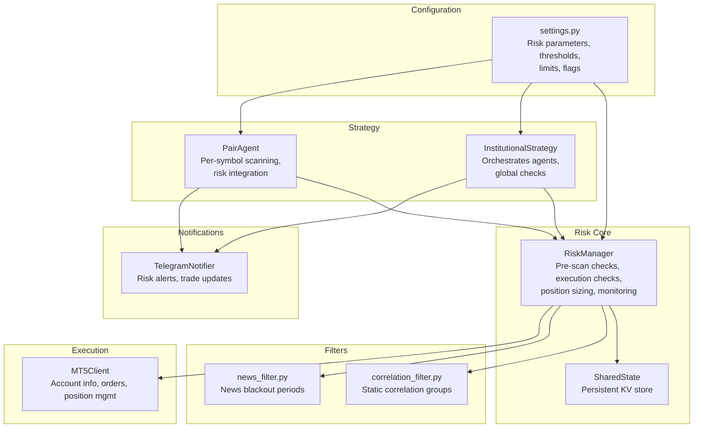
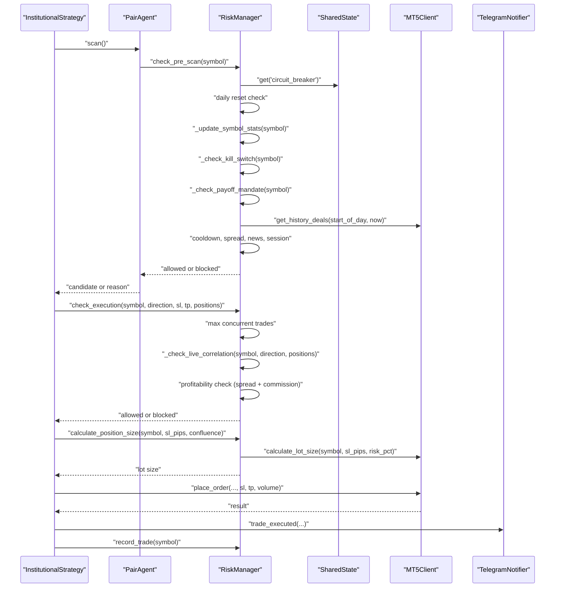
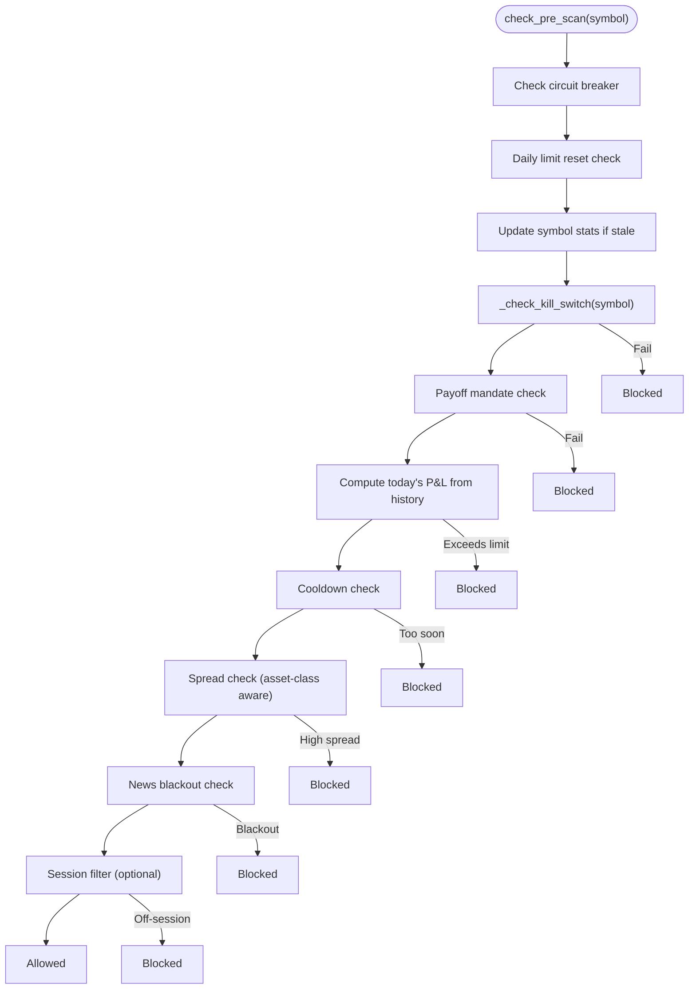
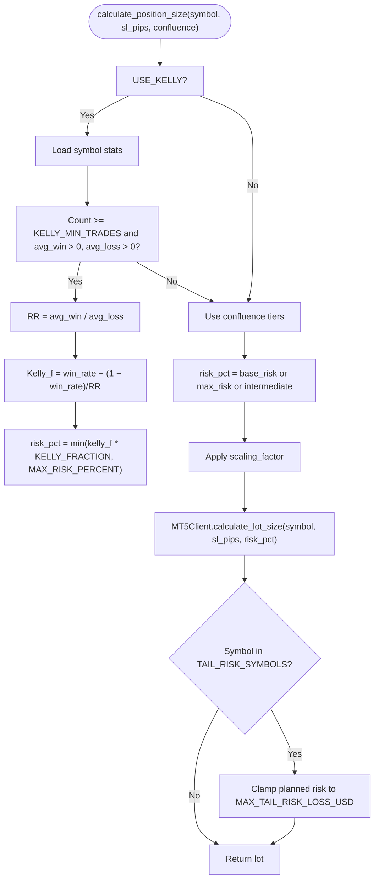
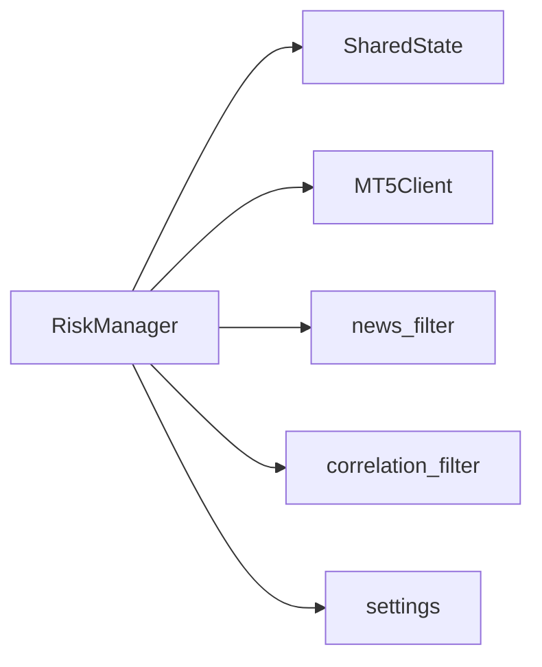

# Global Risk Management

<cite>
**Referenced Files in This Document**
- [risk_manager.py](file://utils/risk_manager.py)
- [telegram_notifier.py](file://utils/telegram_notifier.py)
- [shared_state.py](file://utils/shared_state.py)
- [settings.py](file://config/settings.py)
- [correlation_filter.py](file://utils/correlation_filter.py)
- [news_filter.py](file://utils/news_filter.py)
- [mt5_client.py](file://execution/mt5_client.py)
- [institutional_strategy.py](file://strategy/institutional_strategy.py)
- [pair_agent.py](file://strategy/pair_agent.py)
- [main.py](file://main.py)
</cite>

## Table of Contents
1. [Introduction](#introduction)
2. [Project Structure](#project-structure)
3. [Core Components](#core-components)
4. [Architecture Overview](#architecture-overview)
5. [Detailed Component Analysis](#detailed-component-analysis)
6. [Dependency Analysis](#dependency-analysis)
7. [Performance Considerations](#performance-considerations)
8. [Troubleshooting Guide](#troubleshooting-guide)
9. [Conclusion](#conclusion)
10. [Appendices](#appendices)

## Introduction
This document explains the Global Risk Management system that enforces kill switches, payoff mandates, and position sizing algorithms across all trading agents. It covers institutional-grade risk controls including daily loss limits, correlation filtering to prevent simultaneous losses, and news blackout periods. It documents position sizing calculations using the Kelly Criterion and other risk management formulas, the inter-agent communication for risk coordination, and centralized risk state management. It also includes examples of risk parameter configuration, dynamic risk adjustment based on market conditions, emergency shutdown procedures, and integration with the Telegram notification system for risk alerts.

## Project Structure
The risk management system spans several modules:
- Centralized risk enforcement and state management
- Configuration-driven risk parameters
- Real-time risk checks and position sizing
- Inter-agent coordination and monitoring
- Telegram-based risk alerts

**Diagram sources**
- [risk_manager.py](file://utils/risk_manager.py#L14-L549)
- [shared_state.py](file://utils/shared_state.py#L23-L110)
- [settings.py](file://config/settings.py#L69-L201)
- [correlation_filter.py](file://utils/correlation_filter.py#L14-L117)
- [news_filter.py](file://utils/news_filter.py#L18-L239)
- [mt5_client.py](file://execution/mt5_client.py#L12-L385)
- [institutional_strategy.py](file://strategy/institutional_strategy.py#L49-L500)
- [pair_agent.py](file://strategy/pair_agent.py#L22-L432)
- [telegram_notifier.py](file://utils/telegram_notifier.py#L30-L174)

**Section sources**
- [risk_manager.py](file://utils/risk_manager.py#L1-L549)
- [settings.py](file://config/settings.py#L1-L201)
- [institutional_strategy.py](file://strategy/institutional_strategy.py#L1-L500)
- [pair_agent.py](file://strategy/pair_agent.py#L1-L432)
- [mt5_client.py](file://execution/mt5_client.py#L1-L385)
- [shared_state.py](file://utils/shared_state.py#L1-L110)
- [correlation_filter.py](file://utils/correlation_filter.py#L1-L117)
- [news_filter.py](file://utils/news_filter.py#L1-L239)
- [telegram_notifier.py](file://utils/telegram_notifier.py#L1-L174)

## Core Components
- RiskManager: Central orchestrator for pre-scan checks, execution gating, position sizing, and position monitoring.
- SharedState: Persistent key-value store enabling cross-agent risk coordination and emergency controls.
- MT5Client: Provides account data, historical deals, order placement, and position management.
- InstitutionalStrategy: Coordinates scanning and execution across agents, integrating risk checks and notifications.
- PairAgent: Per-symbol agent performing pre-scan risk checks and managing active positions via RiskManager.
- TelegramNotifier: Sends real-time risk alerts and trade notifications.
- Configuration: settings.py defines all risk parameters, thresholds, and flags.

**Section sources**
- [risk_manager.py](file://utils/risk_manager.py#L14-L549)
- [shared_state.py](file://utils/shared_state.py#L23-L110)
- [mt5_client.py](file://execution/mt5_client.py#L12-L385)
- [institutional_strategy.py](file://strategy/institutional_strategy.py#L49-L500)
- [pair_agent.py](file://strategy/pair_agent.py#L22-L432)
- [telegram_notifier.py](file://utils/telegram_notifier.py#L30-L174)
- [settings.py](file://config/settings.py#L69-L201)

## Architecture Overview
The system enforces risk at two stages:
- Pre-scan checks: kill switches, payoff mandates, daily limits, spread, news blackout, session filters, and correlation conflicts.
- Execution checks: concurrent trade caps, correlation conflicts, profitability checks, and spread/commision costs.

RiskManager maintains centralized state and calculates position sizes using Kelly Criterion and confluence tiers. TelegramNotifier emits risk alerts and trade confirmations. InstitutionalStrategy and PairAgent coordinate scanning and execution while respecting global risk controls.

**Diagram sources**
- [institutional_strategy.py](file://strategy/institutional_strategy.py#L99-L436)
- [pair_agent.py](file://strategy/pair_agent.py#L71-L105)
- [risk_manager.py](file://utils/risk_manager.py#L51-L295)
- [mt5_client.py](file://execution/mt5_client.py#L137-L195)
- [telegram_notifier.py](file://utils/telegram_notifier.py#L66-L81)
- [shared_state.py](file://utils/shared_state.py#L42-L76)

## Detailed Component Analysis

### RiskManager
Responsibilities:
- Pre-scan checks: circuit breaker, daily trade limit, kill switch, payoff mandate, daily loss limit, cooldown, spread, news blackout, session filters.
- Execution checks: concurrent trade caps, live correlation conflict, profitability check.
- Position sizing: Kelly Criterion fallback to confluence tiers, tail risk clamp.
- Position monitoring: break-even, partial profit taking, trailing stops (ATR or fixed percent).
- State persistence: daily trades, last trade timestamps, symbol stats.

Key behaviors:
- Kill Switch: Net loss over recent trades triggers a per-symbol pause until stats refresh.
- Payoff Mandate: Asymmetry check against average win/loss ratio.
- Daily Loss Limit: Realized P&L today computed from history deals.
- Correlation Filtering: Live correlation using M1 returns; falls back to static groups.
- Position Sizing: Quarter-Kelly scaled by confluence tiers; tail risk clamp for high-volatility symbols.
- Position Monitoring: Dynamic trailing stop activation and modification with pip thresholds.

**Diagram sources**
- [risk_manager.py](file://utils/risk_manager.py#L51-L163)

**Section sources**
- [risk_manager.py](file://utils/risk_manager.py#L14-L549)

### SharedState
Purpose:
- Persistent key-value store for cross-agent state sharing (e.g., circuit breaker).
- JSON-serialized values with timestamps for auditability.

Usage:
- RiskManager reads/writes "circuit_breaker" and "daily_trades".
- Other agents can read/write keys for coordinated risk controls.

**Section sources**
- [shared_state.py](file://utils/shared_state.py#L23-L110)
- [risk_manager.py](file://utils/risk_manager.py#L15-L40)

### MT5Client
Role:
- Account info, history deals, positions, order placement, position modifications, partial closes, and full closes.
- Position sizing using institutional formula: risk amount equals balance × risk percent; convert to lot size using SL distance in ticks and tick value.

Integration:
- RiskManager delegates lot size calculation to MT5Client.
- InstitutionalStrategy and PairAgent use MT5Client for order placement and position management.

**Section sources**
- [mt5_client.py](file://execution/mt5_client.py#L12-L385)
- [risk_manager.py](file://utils/risk_manager.py#L377-L396)

### InstitutionalStrategy
Role:
- Orchestrates scanning across agents, enforces global session and daily limits, and coordinates execution.
- Integrates risk checks before placing orders and sends Telegram alerts.

Execution flow:
- Validates session and daily limits.
- Collects active positions for correlation checks.
- Calls RiskManager.check_execution for each candidate.
- Calculates lot size via RiskManager and places order via MT5Client.
- Emits Telegram notifications and updates TradeJournal.

**Section sources**
- [institutional_strategy.py](file://strategy/institutional_strategy.py#L99-L436)

### PairAgent
Role:
- Performs pre-scan risk checks (news blackout, cooldown, RiskManager.check_pre_scan).
- Manages active positions via RiskManager.monitor_positions.
- Applies regime-aware exits and retail viability filters.

**Section sources**
- [pair_agent.py](file://strategy/pair_agent.py#L71-L105)
- [pair_agent.py](file://strategy/pair_agent.py#L297-L376)

### TelegramNotifier
Capabilities:
- Non-blocking threaded messaging to Telegram chat.
- Formatted helpers for trade execution, trade closure, scan candidates, daily summary, kill switch alerts, and generic alerts/info.

Integration:
- InstitutionalStrategy and PairAgent call TelegramNotifier methods for alerts.

**Section sources**
- [telegram_notifier.py](file://utils/telegram_notifier.py#L30-L174)
- [institutional_strategy.py](file://strategy/institutional_strategy.py#L88-L94)
- [institutional_strategy.py](file://strategy/institutional_strategy.py#L399-L401)

### Configuration (settings.py)
Risk parameters and thresholds:
- Daily trade and loss limits, spread caps per asset class, session filters, volatility thresholds, trailing stops, partial close fractions, break-even ratios, and payoff mandates.
- Kelly Criterion enablement and fraction, minimum trades for Kelly activation.
- Correlation groups and tail risk symbols with per-symbol loss caps.
- Telegram credentials for notifications.

Examples of risk parameter configuration:
- Daily trade cap and loss limit: MAX_DAILY_TRADES, MAX_DAILY_LOSS_USD
- Spread caps: MAX_SPREAD_PIPS, MAX_SPREAD_PIPS_CRYPTO, MAX_SPREAD_PIPS_COMMODITY
- Session filters: SCALP_SESSION_FILTER, SCALP_SESSIONS
- Kill switch: KILL_SWITCH_LOOKBACK_TRADES, KILL_SWITCH_LOSS_THRESHOLD
- Payoff mandate: MANDATE_MIN_RR, AVG_LOSS_RATIO_THRESHOLD
- Position sizing: RISK_PERCENT, MAX_RISK_PERCENT, KELLY_FRACTION, KELLY_MIN_TRADES
- Correlation tail risk: TAIL_RISK_SYMBOLS, MAX_TAIL_RISK_LOSS_USD
- Trailing stops: TRAILING_STOP_ATR_ACTIVATE, TRAILING_STOP_ATR_STEP, TRAILING_STOP_ACTIVATE_PERCENT, TRAILING_STOP_STEP_PERCENT
- Partial profit taking: PARTIAL_CLOSE_FRACTION, BREAKEVEN_RR

**Section sources**
- [settings.py](file://config/settings.py#L69-L201)

### Position Sizing Calculations
- Institutional formula: risk amount = balance × risk percent; lot size = risk amount / (SL distance in ticks × tick value); clamped to broker min/max and rounded to step.
- Kelly Criterion fallback:
  - Compute reward-to-risk ratio from average win/loss.
  - Full Kelly fraction = win rate − (1 − win rate) / RR; quarter-Kelly scaled by KELLY_FRACTION.
  - Cap at MAX_RISK_PERCENT; apply confluence tiers if Kelly not applicable.
- Tail risk clamp: For TAIL_RISK_SYMBOLS, scale lot so planned risk does not exceed MAX_TAIL_RISK_LOSS_USD.

**Diagram sources**
- [risk_manager.py](file://utils/risk_manager.py#L341-L396)
- [mt5_client.py](file://execution/mt5_client.py#L146-L195)
- [settings.py](file://config/settings.py#L83-L122)

**Section sources**
- [risk_manager.py](file://utils/risk_manager.py#L341-L396)
- [mt5_client.py](file://execution/mt5_client.py#L146-L195)
- [settings.py](file://config/settings.py#L83-L122)

### Inter-Agent Communication and Centralized Risk State
- SharedState enables cross-agent coordination (e.g., circuit breaker).
- RiskManager persists daily trade counts and dates to enforce daily resets.
- PairAgent and InstitutionalStrategy both consult RiskManager for pre-scan and execution checks.
- TelegramNotifier is globally accessible via singleton for risk alerts.

**Section sources**
- [shared_state.py](file://utils/shared_state.py#L42-L76)
- [risk_manager.py](file://utils/risk_manager.py#L19-L40)
- [institutional_strategy.py](file://strategy/institutional_strategy.py#L88-L94)
- [pair_agent.py](file://strategy/pair_agent.py#L71-L105)

### Institutional-Grade Risk Controls
- Daily Loss Limit: Realized P&L computed from MT5 history deals for the current day; blocks further trading if exceeded.
- Kill Switch: Per-symbol net loss over recent trades disables trading for that symbol until stats refresh.
- Payoff Mandate: Asymmetry check against average win/loss; blocks setups with excessive average loss relative to average win.
- Correlation Filtering: Live correlation using M1 returns; falls back to static groups if data unavailable. Blocks same-direction exposure for positively correlated symbols and opposite-direction exposure for inversely correlated symbols.
- News Blackout Periods: Uses live calendar feed and hardcoded schedules to avoid trading during high-impact events.
- Session Filters: Optional strict London/NY session windows for tight spreads and liquidity.
- Tail Risk Clamp: Caps planned risk for high-volatility symbols to protect capital.

**Section sources**
- [risk_manager.py](file://utils/risk_manager.py#L82-L163)
- [risk_manager.py](file://utils/risk_manager.py#L207-L235)
- [risk_manager.py](file://utils/risk_manager.py#L303-L339)
- [news_filter.py](file://utils/news_filter.py#L159-L205)
- [correlation_filter.py](file://utils/correlation_filter.py#L77-L117)
- [settings.py](file://config/settings.py#L118-L148)

### Emergency Shutdown Procedures
- Circuit Breaker: SharedState key "circuit_breaker" set to "OPEN" blocks all trading across agents.
- Kill Switch: Per-symbol net loss over recent trades triggers a pause for that symbol.
- Daily Reset: On new day, daily trade counts reset; enforced by RiskManager and SharedState.

**Section sources**
- [risk_manager.py](file://utils/risk_manager.py#L56-L60)
- [risk_manager.py](file://utils/risk_manager.py#L207-L216)
- [risk_manager.py](file://utils/risk_manager.py#L41-L50)
- [shared_state.py](file://utils/shared_state.py#L42-L76)

### Integration with Telegram Notifications
- Startup greeting and scan summaries are sent via TelegramNotifier.
- Trade execution and closure alerts are emitted upon order fills.
- Kill switch activation triggers a Telegram alert.

**Section sources**
- [telegram_notifier.py](file://utils/telegram_notifier.py#L66-L128)
- [institutional_strategy.py](file://strategy/institutional_strategy.py#L88-L94)
- [institutional_strategy.py](file://strategy/institutional_strategy.py#L399-L401)

## Dependency Analysis
RiskManager depends on:
- SharedState for persistent state
- MT5Client for account data and order placement
- NewsFilter and CorrelationFilter for pre-scan gating
- Settings for thresholds and parameters

**Diagram sources**
- [risk_manager.py](file://utils/risk_manager.py#L14-L17)
- [shared_state.py](file://utils/shared_state.py#L23-L110)
- [mt5_client.py](file://execution/mt5_client.py#L12-L385)
- [news_filter.py](file://utils/news_filter.py#L18-L239)
- [correlation_filter.py](file://utils/correlation_filter.py#L14-L117)
- [settings.py](file://config/settings.py#L69-L201)

**Section sources**
- [risk_manager.py](file://utils/risk_manager.py#L14-L17)
- [shared_state.py](file://utils/shared_state.py#L23-L110)
- [mt5_client.py](file://execution/mt5_client.py#L12-L385)
- [news_filter.py](file://utils/news_filter.py#L18-L239)
- [correlation_filter.py](file://utils/correlation_filter.py#L14-L117)
- [settings.py](file://config/settings.py#L69-L201)

## Performance Considerations
- RiskManager caches symbol stats and last update timestamps to reduce computation overhead.
- Live correlation uses recent M1 returns; falls back to static groups if insufficient data.
- Spread and commission checks use approximate calculations to avoid blocking on errors.
- Position monitoring applies pip thresholds to minimize unnecessary modifications.
- TelegramNotifier uses non-blocking threads for alerts.

[No sources needed since this section provides general guidance]

## Troubleshooting Guide
Common issues and resolutions:
- Daily limit reached: Wait until next day or adjust MAX_DAILY_TRADES.
- Kill switch active: Allow stats to refresh or adjust KILL_SWITCH parameters.
- Payoff mandate failure: Improve average win/loss profile or adjust AVG_LOSS_RATIO_THRESHOLD.
- High spread blocking: Trade during tighter spreads or increase MAX_SPREAD_PIPS_*.
- News blackout: Wait for blackout period to end or disable NEWS_FILTER_ENABLE.
- Correlation conflict: Avoid same-direction exposure with correlated symbols.
- Execution blocked by profitability: Increase TP or reduce SL to meet MIN_NET_PROFIT_RATIO.
- Telegram notifications disabled: Set TELEGRAM_BOT_TOKEN and TELEGRAM_CHAT_ID.

**Section sources**
- [risk_manager.py](file://utils/risk_manager.py#L62-L101)
- [risk_manager.py](file://utils/risk_manager.py#L207-L235)
- [risk_manager.py](file://utils/risk_manager.py#L242-L294)
- [news_filter.py](file://utils/news_filter.py#L159-L205)
- [telegram_notifier.py](file://utils/telegram_notifier.py#L33-L39)

## Conclusion
The Global Risk Management system centralizes pre-trade checks, execution gating, and position sizing across agents. It enforces institutional-grade controls including daily loss limits, kill switches, payoff mandates, correlation filtering, and news blackout periods. RiskManager integrates with SharedState for cross-agent coordination, with MT5Client providing account and order management. TelegramNotifier ensures timely risk alerts. Configuration-driven parameters enable dynamic risk adjustment and emergency shutdown procedures.

## Appendices

### Risk Parameter Configuration Examples
- Daily trade cap: MAX_DAILY_TRADES
- Daily loss cap: MAX_DAILY_LOSS_USD
- Spread caps: MAX_SPREAD_PIPS, MAX_SPREAD_PIPS_CRYPTO, MAX_SPREAD_PIPS_COMMODITY
- Session filters: SCALP_SESSION_FILTER, SCALP_SESSIONS
- Kill switch: KILL_SWITCH_LOOKBACK_TRADES, KILL_SWITCH_LOSS_THRESHOLD
- Payoff mandate: MANDATE_MIN_RR, AVG_LOSS_RATIO_THRESHOLD
- Position sizing: RISK_PERCENT, MAX_RISK_PERCENT, KELLY_FRACTION, KELLY_MIN_TRADES
- Correlation tail risk: TAIL_RISK_SYMBOLS, MAX_TAIL_RISK_LOSS_USD
- Trailing stops: TRAILING_STOP_ATR_ACTIVATE, TRAILING_STOP_ATR_STEP, TRAILING_STOP_ACTIVATE_PERCENT, TRAILING_STOP_STEP_PERCENT
- Partial profit taking: PARTIAL_CLOSE_FRACTION, BREAKEVEN_RR

**Section sources**
- [settings.py](file://config/settings.py#L69-L201)