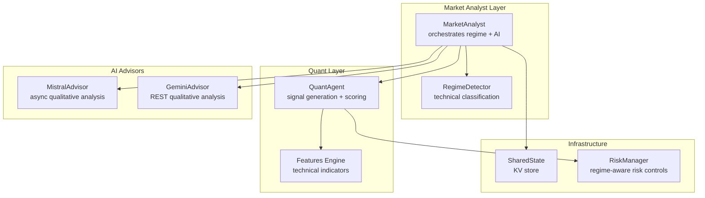
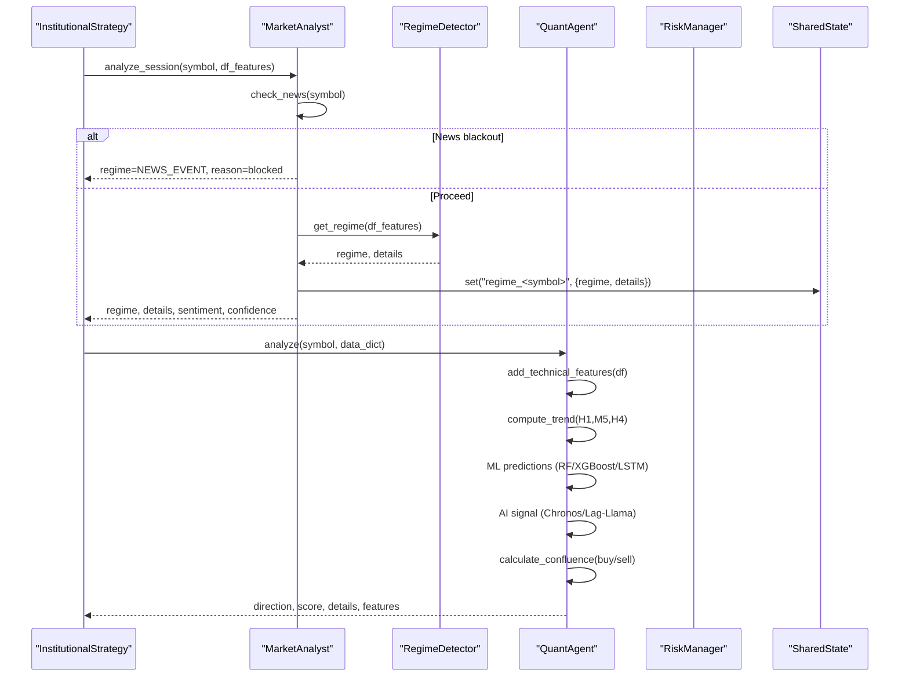
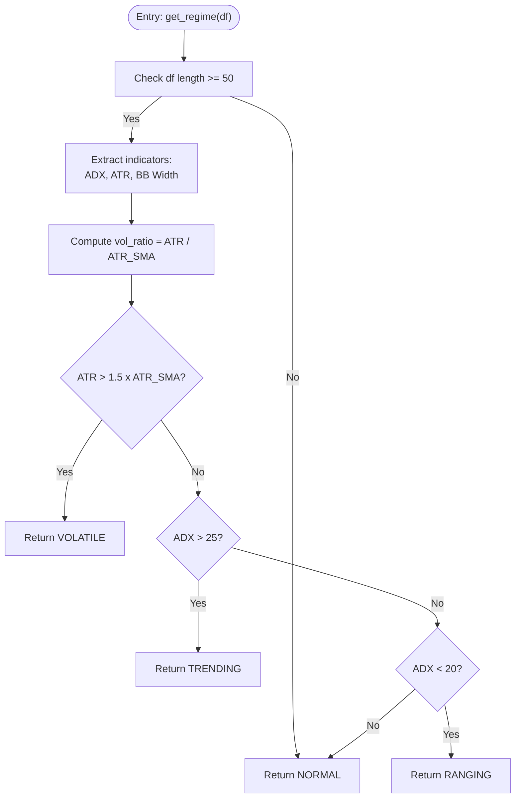
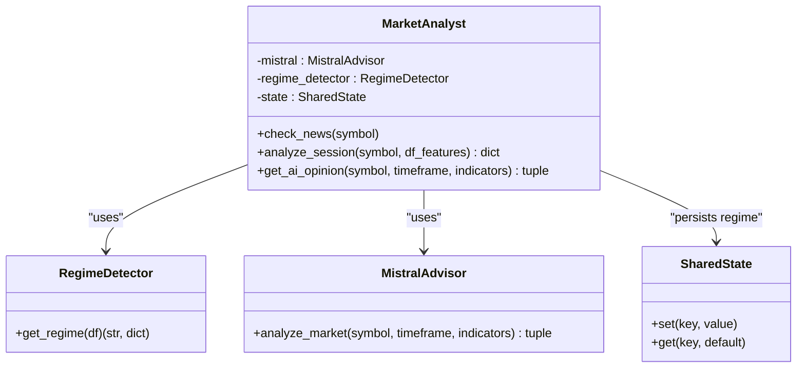
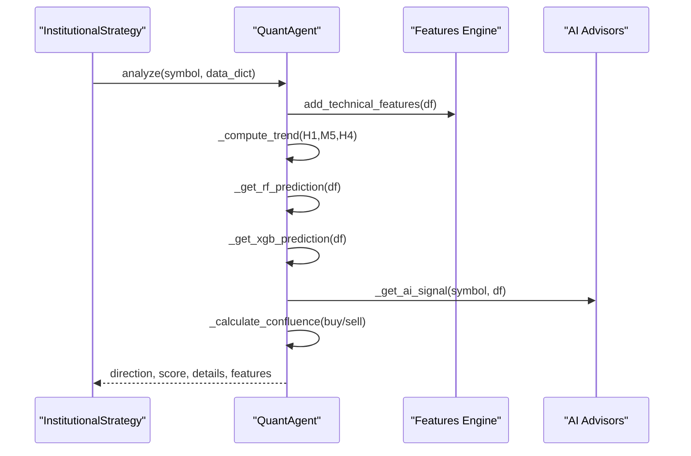
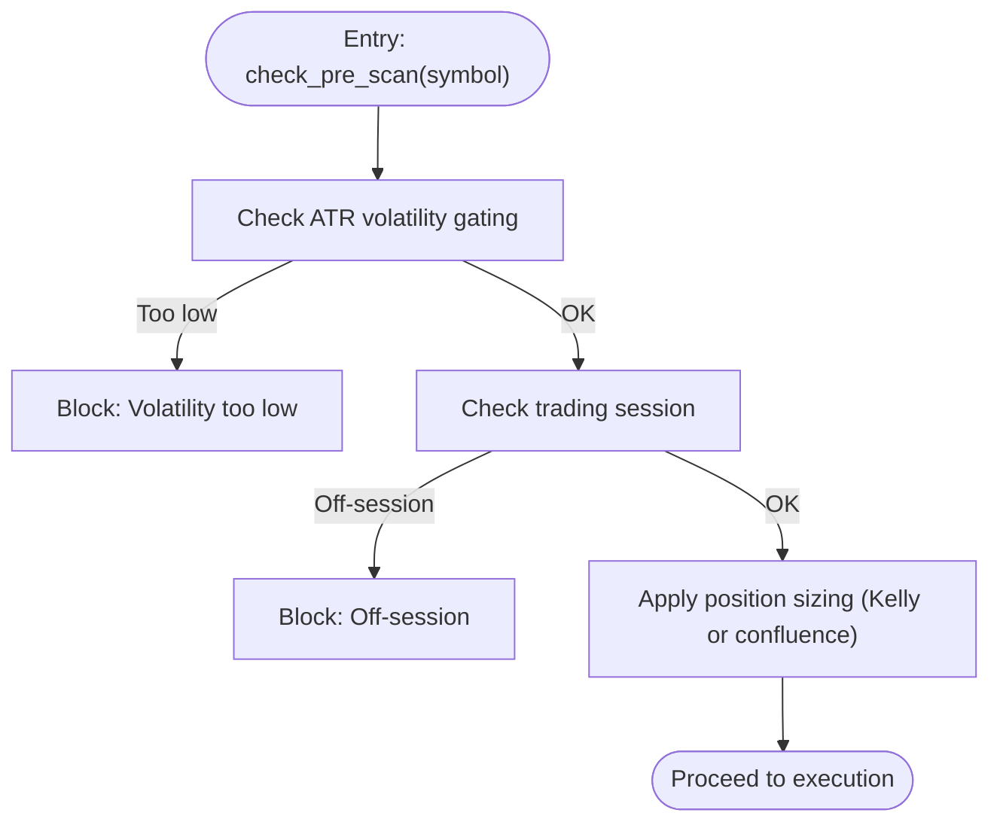
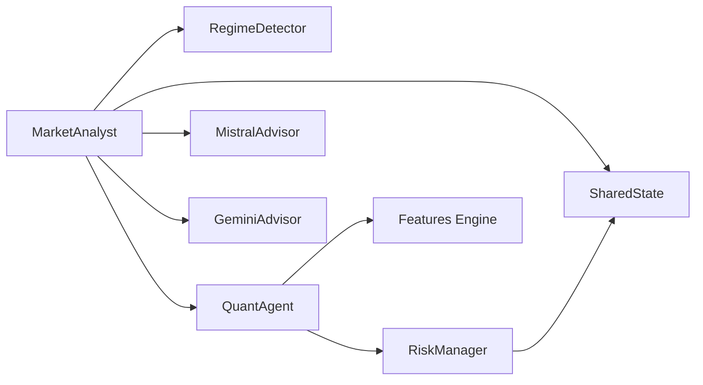

# Market Condition Analyst

<cite>
**Referenced Files in This Document**
- [market_analyst.py](file://analysis/market_analyst.py)
- [regime.py](file://analysis/regime.py)
- [quant_agent.py](file://analysis/quant_agent.py)
- [features.py](file://strategy/features.py)
- [mistral_advisor.py](file://analysis/mistral_advisor.py)
- [gemini_advisor.py](file://analysis/gemini_advisor.py)
- [shared_state.py](file://utils/shared_state.py)
- [risk_manager.py](file://utils/risk_manager.py)
- [institutional_strategy.py](file://strategy/institutional_strategy.py)
- [settings.py](file://config/settings.py)
</cite>

## Table of Contents
1. [Introduction](#introduction)
2. [Project Structure](#project-structure)
3. [Core Components](#core-components)
4. [Architecture Overview](#architecture-overview)
5. [Detailed Component Analysis](#detailed-component-analysis)
6. [Dependency Analysis](#dependency-analysis)
7. [Performance Considerations](#performance-considerations)
8. [Troubleshooting Guide](#troubleshooting-guide)
9. [Conclusion](#conclusion)

## Introduction
This document describes the MarketAnalyst subsystem responsible for regime detection and market condition assessment. It explains how the system classifies trending versus ranging market conditions across multiple timeframes, documents the technical analysis components used for market state determination (including volatility measures, trend strength indicators, and market structure analysis), and covers the integration with the QuantAgent for regime-aware signal generation. It also provides examples of regime detection workflows, market condition scoring, and adaptive strategy adjustments based on detected regimes, along with the relationship between market conditions and trading parameters such as position sizing and stop-loss placement.

## Project Structure
The MarketAnalyst subsystem is part of a multi-agent trading architecture. The key files involved are:
- MarketAnalyst orchestrator that coordinates regime detection and AI analysis
- RegimeDetector that performs technical classification
- QuantAgent that generates signals and scores
- Technical features engine that computes indicators
- AI advisors (Mistral/Gemini) for qualitative analysis
- Shared state persistence for cross-agent communication
- Risk manager that applies regime-aware risk controls

**Diagram sources**
- [market_analyst.py](file://analysis/market_analyst.py#L7-L20)
- [regime.py](file://analysis/regime.py#L8-L11)
- [quant_agent.py](file://analysis/quant_agent.py#L34-L50)
- [features.py](file://strategy/features.py#L6-L12)
- [mistral_advisor.py](file://analysis/mistral_advisor.py#L12-L26)
- [gemini_advisor.py](file://analysis/gemini_advisor.py#L10-L27)
- [shared_state.py](file://utils/shared_state.py#L23-L27)
- [risk_manager.py](file://utils/risk_manager.py#L14-L18)

**Section sources**
- [market_analyst.py](file://analysis/market_analyst.py#L7-L20)
- [regime.py](file://analysis/regime.py#L8-L11)
- [quant_agent.py](file://analysis/quant_agent.py#L34-L50)
- [features.py](file://strategy/features.py#L6-L12)
- [mistral_advisor.py](file://analysis/mistral_advisor.py#L12-L26)
- [gemini_advisor.py](file://analysis/gemini_advisor.py#L10-L27)
- [shared_state.py](file://utils/shared_state.py#L23-L27)
- [risk_manager.py](file://utils/risk_manager.py#L14-L18)

## Core Components
- MarketAnalyst: Central coordinator that performs news blackout checks, delegates regime detection, persists results to shared state, and optionally requests AI analysis.
- RegimeDetector: Computes market regime classification using ADX, ATR, and Bollinger Band width thresholds.
- QuantAgent: Generates quantitative signals, computes trend filters across multiple timeframes, and produces a composite score with ML and AI components.
- Features Engine: Adds institutional-grade technical indicators including ADX, ATR, Bollinger Bands, MACD, and market structure features.
- AI Advisors: Provide qualitative sentiment and confidence for regime-aware decision-making.
- SharedState: Persistent key-value store enabling cross-agent communication of regime and risk status.
- RiskManager: Applies regime-aware risk controls, including volatility gating, session filtering, and position sizing adjustments.

**Section sources**
- [market_analyst.py](file://analysis/market_analyst.py#L7-L20)
- [regime.py](file://analysis/regime.py#L8-L58)
- [quant_agent.py](file://analysis/quant_agent.py#L34-L294)
- [features.py](file://strategy/features.py#L6-L242)
- [mistral_advisor.py](file://analysis/mistral_advisor.py#L12-L115)
- [gemini_advisor.py](file://analysis/gemini_advisor.py#L10-L101)
- [shared_state.py](file://utils/shared_state.py#L23-L110)
- [risk_manager.py](file://utils/risk_manager.py#L14-L549)

## Architecture Overview
The MarketAnalyst subsystem operates within an agentic architecture where MarketAnalyst and QuantAgent collaborate to produce regime-aware trading decisions. MarketAnalyst focuses on macro-level market state (regime) and AI sentiment, while QuantAgent focuses on technical confluence and ML predictions. Both feed into RiskManager, which enforces regime-aware risk controls.

**Diagram sources**
- [institutional_strategy.py](file://strategy/institutional_strategy.py#L99-L330)
- [market_analyst.py](file://analysis/market_analyst.py#L25-L71)
- [regime.py](file://analysis/regime.py#L12-L58)
- [quant_agent.py](file://analysis/quant_agent.py#L109-L159)
- [shared_state.py](file://utils/shared_state.py#L42-L59)

## Detailed Component Analysis

### Regime Detection Algorithm
The RegimeDetector class classifies market conditions using three primary technical measures:
- Volatility spike detection via ATR relative to its 20-period average
- Trend strength via ADX thresholds
- Sideways/flat conditions via ADX and Bollinger Band width

**Diagram sources**
- [regime.py](file://analysis/regime.py#L12-L58)

**Section sources**
- [regime.py](file://analysis/regime.py#L12-L58)

### Technical Analysis Components for Market State Determination
The features engine adds comprehensive technical indicators used by both regime detection and signal scoring:
- Volatility: ATR and Bollinger Bands
- Trend: ADX (+DI/-DI), EMA/MAs, MACD
- Momentum: RSI, Stochastic RSI
- Market structure: swing highs/lows, BOS, order blocks, fair value gaps, liquidity sweeps
- Volume: VWAP, delta volume, volume anomalies

These features enable:
- Regime classification (ADX, ATR, BB width)
- Trend alignment across timeframes (M5/H1/H4)
- Confluence scoring (SMC, ML, AI, ADX)

**Section sources**
- [features.py](file://strategy/features.py#L6-L98)
- [features.py](file://strategy/features.py#L101-L128)
- [features.py](file://strategy/features.py#L131-L170)
- [features.py](file://strategy/features.py#L173-L203)
- [features.py](file://strategy/features.py#L206-L224)

### MarketAnalyst Orchestration and Integration with QuantAgent
MarketAnalyst coordinates:
- News blackout checks
- Regime detection via RegimeDetector
- Persistence of regime state to SharedState
- Optional AI opinion via MistralAdvisor
- Passing regime and features to QuantAgent for scoring

**Diagram sources**
- [market_analyst.py](file://analysis/market_analyst.py#L7-L20)
- [regime.py](file://analysis/regime.py#L8-L11)
- [mistral_advisor.py](file://analysis/mistral_advisor.py#L12-L26)
- [shared_state.py](file://utils/shared_state.py#L23-L59)

**Section sources**
- [market_analyst.py](file://analysis/market_analyst.py#L25-L71)
- [mistral_advisor.py](file://analysis/mistral_advisor.py#L27-L63)

### QuantAgent Signal Generation and Confluence Scoring
QuantAgent performs:
- Feature engineering using the features engine
- Trend computation across H1, M5, H4
- ML predictions (Random Forest/XGBoost) and LSTM/Chronos/Lag-Llama forecasts
- AI signal aggregation
- Confluence scoring combining ML, AI, trend filters, and structure signals
- Ensemble score for decision-making

**Diagram sources**
- [quant_agent.py](file://analysis/quant_agent.py#L109-L159)
- [features.py](file://strategy/features.py#L6-L98)
- [mistral_advisor.py](file://analysis/mistral_advisor.py#L27-L63)
- [gemini_advisor.py](file://analysis/gemini_advisor.py#L28-L55)

**Section sources**
- [quant_agent.py](file://analysis/quant_agent.py#L109-L294)

### Regime-Aware Risk Controls and Position Sizing
RiskManager applies regime-aware controls:
- Volatility gating using ATR thresholds per asset class
- Session filtering aligned with market liquidity windows
- Position sizing using Kelly Criterion when sufficient history is available, otherwise confluence tiers
- Dynamic trailing stops and partial profit taking based on ATR

**Diagram sources**
- [risk_manager.py](file://utils/risk_manager.py#L51-L163)
- [risk_manager.py](file://utils/risk_manager.py#L341-L396)

**Section sources**
- [risk_manager.py](file://utils/risk_manager.py#L51-L163)
- [risk_manager.py](file://utils/risk_manager.py#L341-L396)

### Market Condition Scoring and Adaptive Strategy Adjustments
- Regime classification influences:
  - Trend filters (M5/H1/H4) in confluence scoring
  - Volatility gating thresholds
  - Position sizing tiers and Kelly-based scaling
- Adaptive strategy adjustments:
  - Higher confluence scores increase position size
  - Regime-aware trailing stops and partial profit taking
  - Session-aware entry windows

**Section sources**
- [quant_agent.py](file://analysis/quant_agent.py#L231-L293)
- [risk_manager.py](file://utils/risk_manager.py#L341-L396)

### Examples of Regime Detection Workflows
- Workflow A: News blackout
  - MarketAnalyst.check_news returns blocked; MarketAnalyst returns NEWS_EVENT regime with neutral sentiment.
- Workflow B: Volatile regime
  - RegimeDetector identifies ATR spike; returns VOLATILE; MarketAnalyst persists and QuantAgent reduces aggressive entries.
- Workflow C: Trending regime
  - RegimeDetector identifies ADX > 25; returns TRENDING; MarketAnalyst persists; QuantAgent increases trend-aligned confluence weight.
- Workflow D: Ranging regime
  - RegimeDetector identifies ADX < 20 and narrow bands; returns RANGING; MarketAnalyst persists; RiskManager applies stricter volatility gating.

**Section sources**
- [market_analyst.py](file://analysis/market_analyst.py#L21-L71)
- [regime.py](file://analysis/regime.py#L12-L58)

## Dependency Analysis
The MarketAnalyst subsystem exhibits:
- Loose coupling via SharedState for inter-agent communication
- Clear separation of concerns: MarketAnalyst handles macro regime and AI, QuantAgent handles technical confluence and ML
- External dependencies: AI advisor APIs, MT5 client, SQLite-backed shared state

**Diagram sources**
- [market_analyst.py](file://analysis/market_analyst.py#L7-L20)
- [quant_agent.py](file://analysis/quant_agent.py#L34-L50)
- [shared_state.py](file://utils/shared_state.py#L23-L59)
- [risk_manager.py](file://utils/risk_manager.py#L14-L18)

**Section sources**
- [market_analyst.py](file://analysis/market_analyst.py#L7-L20)
- [quant_agent.py](file://analysis/quant_agent.py#L34-L50)
- [shared_state.py](file://utils/shared_state.py#L23-L59)
- [risk_manager.py](file://utils/risk_manager.py#L14-L18)

## Performance Considerations
- Regime detection uses lightweight rolling statistics and threshold comparisons; suitable for real-time M1 scanning.
- QuantAgent’s feature engineering and ML inference are optimized for single-row prediction to minimize latency.
- SharedState uses SQLite for persistence; ensure minimal write contention by updating only when necessary.
- AI advisor calls are asynchronous; configure timeouts and fallbacks to avoid blocking the scanning loop.

## Troubleshooting Guide
Common issues and resolutions:
- AI advisor failures: MarketAnalyst gracefully falls back to neutral sentiment and zero confidence when AI requests fail.
- Regime detection returns NORMAL: Occurs when insufficient data or missing indicators; ensure features engine is applied before regime detection.
- SharedState persistence errors: Verify database path and permissions; SharedState handles JSON serialization and retrieval safely.
- RiskManager blocking trades: Check volatility gating thresholds, session filters, and kill switch conditions; adjust settings accordingly.

**Section sources**
- [market_analyst.py](file://analysis/market_analyst.py#L73-L81)
- [regime.py](file://analysis/regime.py#L23-L24)
- [shared_state.py](file://utils/shared_state.py#L42-L75)
- [risk_manager.py](file://utils/risk_manager.py#L51-L163)

## Conclusion
The MarketAnalyst subsystem provides a robust, regime-aware foundation for market condition assessment. By combining technical indicators, volatility measures, and trend strength with AI-driven sentiment, it enables QuantAgent to generate adaptive, multi-timeframe signals. Integrated with SharedState and RiskManager, the system ensures that trading parameters such as position sizing and stop-loss placement are dynamically adjusted according to detected market regimes, enhancing risk-adjusted performance across diverse market conditions.