# Quantitative Analysis Agent

<cite>
**Referenced Files in This Document**
- [quant_agent.py](file://analysis/quant_agent.py)
- [features.py](file://strategy/features.py)
- [lstm_predictor.py](file://strategy/lstm_predictor.py)
- [lstm_model.py](file://strategy/lstm_model.py)
- [lag_llama_predictor.py](file://strategy/lag_llama_predictor.py)
- [hf_predictor.py](file://strategy/hf_predictor.py)
- [settings.py](file://config/settings.py)
- [pair_agent.py](file://strategy/pair_agent.py)
- [institutional_strategy.py](file://strategy/institutional_strategy.py)
- [xgboost_v1_symbols.txt](file://models/xgboost_v1_symbols.txt)
</cite>

## Table of Contents
1. [Introduction](#introduction)
2. [Project Structure](#project-structure)
3. [Core Components](#core-components)
4. [Architecture Overview](#architecture-overview)
5. [Detailed Component Analysis](#detailed-component-analysis)
6. [Dependency Analysis](#dependency-analysis)
7. [Performance Considerations](#performance-considerations)
8. [Troubleshooting Guide](#troubleshooting-guide)
9. [Conclusion](#conclusion)

## Introduction
The QuantAgent subsystem serves as the central quantitative analysis engine responsible for generating predictions and confluence-based trading signals for all pair agents. It orchestrates a multi-model ensemble combining classical machine learning (Random Forest and XGBoost), deep learning (LSTM neural networks), and modern foundation models (transformer-based forecasting via Lag-Llama/Chronos). The agent performs technical analysis, computes trend signals across multiple timeframes, and synthesizes an ensemble score that guides trade decisions.

Key responsibilities:
- Load and maintain trained models (RF/XGBoost, LSTM, Lag-Llama/Chronos)
- Engineer rich technical features from OHLCV data
- Compute trend signals across M5/H1/H4
- Generate AI signals from high-frequency forecasting models
- Score confluence combining trend, technical indicators, and ML predictions
- Produce an ensemble signal suitable for downstream pair agents

## Project Structure
The QuantAgent integrates with several modules:
- Analysis: QuantAgent orchestrates inference and scoring
- Strategy: Feature engineering, LSTM predictor/model, Lag-Llama/Chronos predictors
- Config: Centralized settings controlling model availability and thresholds
- Models: Saved artifacts for RF/XGBoost and LSTM

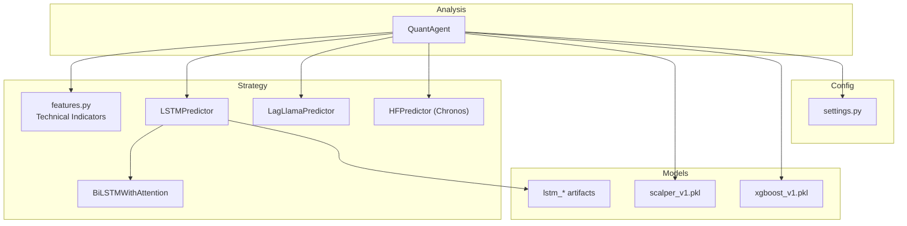

**Diagram sources**
- [quant_agent.py](file://analysis/quant_agent.py#L34-L159)
- [features.py](file://strategy/features.py#L6-L98)
- [lstm_predictor.py](file://strategy/lstm_predictor.py#L9-L36)
- [lstm_model.py](file://strategy/lstm_model.py#L27-L69)
- [lag_llama_predictor.py](file://strategy/lag_llama_predictor.py#L31-L44)
- [hf_predictor.py](file://strategy/hf_predictor.py#L15-L32)
- [settings.py](file://config/settings.py#L173-L200)

**Section sources**
- [quant_agent.py](file://analysis/quant_agent.py#L34-L159)
- [settings.py](file://config/settings.py#L173-L200)

## Core Components
- QuantAgent: Central orchestrator for model loading, feature engineering, trend computation, AI signal generation, and confluence scoring.
- Feature Engine: Comprehensive TA pipeline adding momentum, volatility, trend, volume, order blocks, fair value gaps, liquidity sweeps, and structure scores.
- LSTM Predictor: Loads pre-trained BiLSTM with attention and scales/sequences input for inference.
- Transformer-based Predictors: Lag-Llama and Chronos pipelines for long-horizon forecasting.
- Settings: Controls model availability, thresholds, and multi-timeframe filters.

**Section sources**
- [quant_agent.py](file://analysis/quant_agent.py#L34-L159)
- [features.py](file://strategy/features.py#L6-L98)
- [lstm_predictor.py](file://strategy/lstm_predictor.py#L9-L36)
- [lag_llama_predictor.py](file://strategy/lag_llama_predictor.py#L31-L44)
- [hf_predictor.py](file://strategy/hf_predictor.py#L15-L32)
- [settings.py](file://config/settings.py#L173-L200)

## Architecture Overview
The QuantAgent receives multi-timeframe data dictionaries, engineers features, computes trends, queries ML models, generates AI signals, and returns a structured analysis including direction, score, and details.

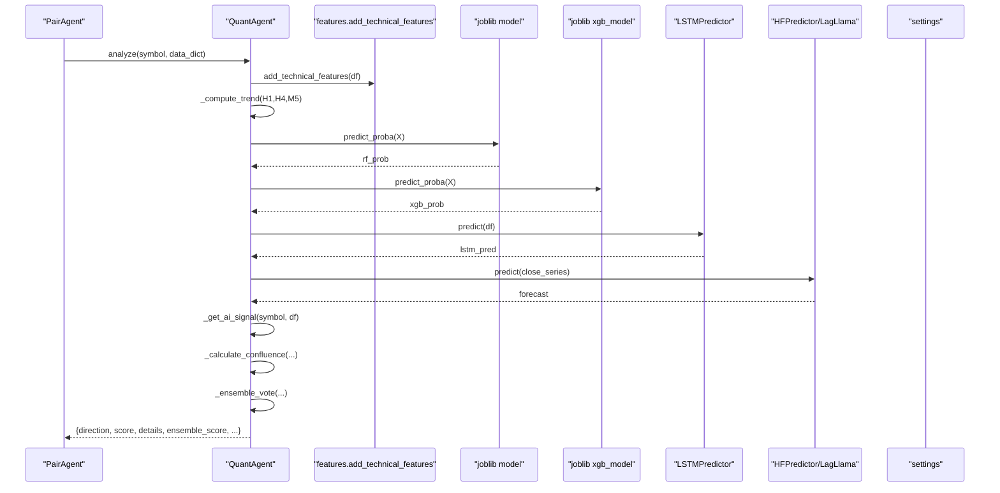

**Diagram sources**
- [quant_agent.py](file://analysis/quant_agent.py#L109-L159)
- [features.py](file://strategy/features.py#L6-L98)
- [lstm_predictor.py](file://strategy/lstm_predictor.py#L115-L142)
- [hf_predictor.py](file://strategy/hf_predictor.py#L34-L52)
- [lag_llama_predictor.py](file://strategy/lag_llama_predictor.py#L181-L228)
- [settings.py](file://config/settings.py#L150-L154)

## Detailed Component Analysis

### QuantAgent: Multi-Model Ensemble and Confluence Scoring
Responsibilities:
- Model loading for RF/XGBoost, LSTM, and transformer-based forecasting
- Feature engineering via technical indicators
- Trend computation across M5/H1/H4
- AI signal generation from high-frequency models
- Confluence scoring combining trend, technical signals, and ML probability
- Ensemble aggregation of ML probability, AI signal, and confluence score

Key methods and flows:
- Initialization loads models based on settings and availability
- Analysis orchestrates feature engineering, trend computation, ML predictions, AI signals, and scoring
- Confluence scoring applies configurable trend filters and evaluates ML probability and AI alignment
- Ensemble vote blends ML, AI, and confluence into a normalized score

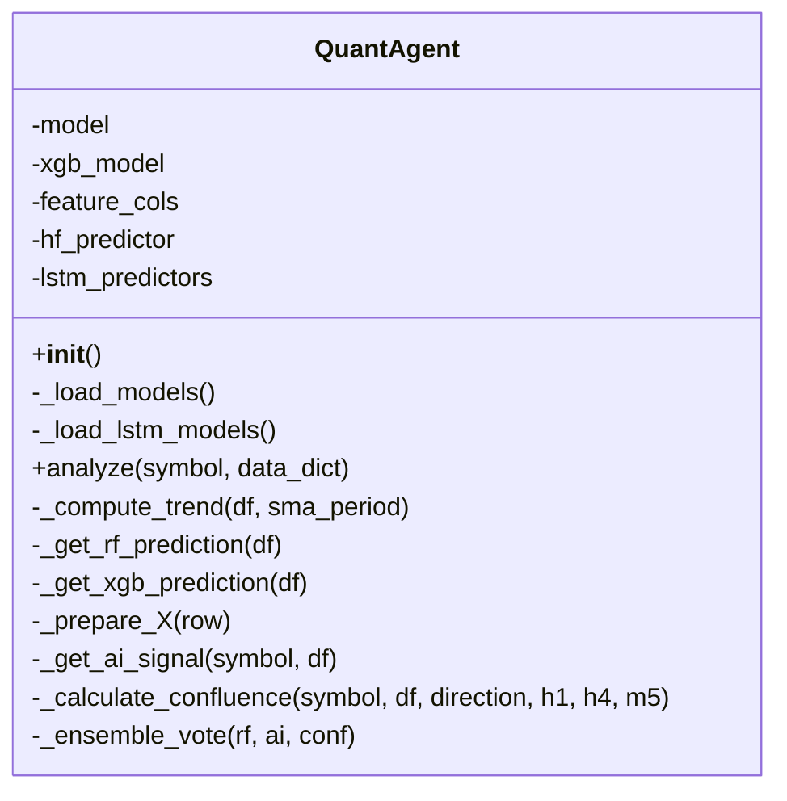

**Diagram sources**
- [quant_agent.py](file://analysis/quant_agent.py#L34-L159)

**Section sources**
- [quant_agent.py](file://analysis/quant_agent.py#L42-L84)
- [quant_agent.py](file://analysis/quant_agent.py#L109-L159)
- [quant_agent.py](file://analysis/quant_agent.py#L231-L293)

### Feature Engineering Pipeline
The feature engine adds:
- Price returns and derived series
- Momentum: RSI, Stochastic RSI
- Volatility: Bollinger Bands, ATR
- Trend: SMAs, EMAs, MACD, ADX (+DI/-DI)
- Volume: VWAP, delta volume, volume ratios
- Market structure: swing highs/lows, BOS
- Order blocks and fair value gaps
- Liquidity sweeps
- Lagged features for temporal dependencies

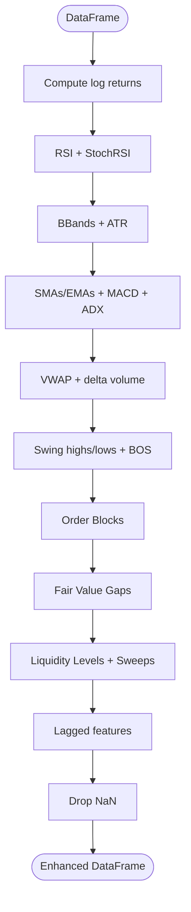

**Diagram sources**
- [features.py](file://strategy/features.py#L6-L98)
- [features.py](file://strategy/features.py#L101-L128)
- [features.py](file://strategy/features.py#L131-L170)
- [features.py](file://strategy/features.py#L173-L203)
- [features.py](file://strategy/features.py#L206-L224)

**Section sources**
- [features.py](file://strategy/features.py#L6-L98)

### LSTM Neural Network Predictor
The LSTM predictor loads a trained BiLSTM with attention and associated scalers and feature columns. It sequences recent data and predicts the next value, optionally inverse-transforming the target scale.

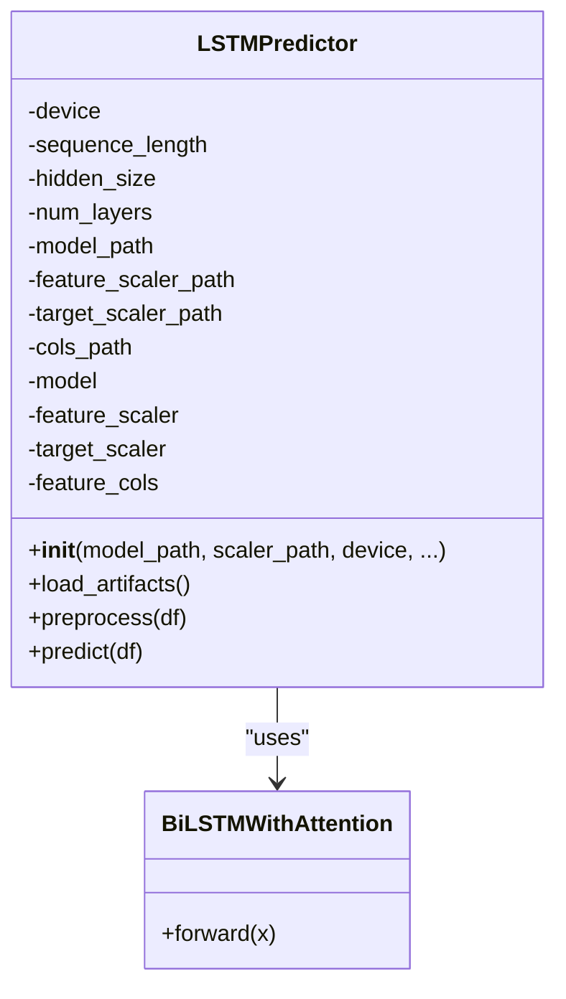

**Diagram sources**
- [lstm_predictor.py](file://strategy/lstm_predictor.py#L9-L36)
- [lstm_model.py](file://strategy/lstm_model.py#L27-L69)

**Section sources**
- [lstm_predictor.py](file://strategy/lstm_predictor.py#L37-L78)
- [lstm_predictor.py](file://strategy/lstm_predictor.py#L79-L142)
- [lstm_model.py](file://strategy/lstm_model.py#L27-L69)

### Transformer-Based Forecasting (Lag-Llama/Chronos)
Two pathways are supported:
- Lag-Llama: Loads a foundation model checkpoint, reconstructs estimator/module, and creates a predictor for median forecasts
- Chronos (Hugging Face): Uses the ChronosPipeline for fast inference and median quantile forecasts

Both feed into the AI signal calculation by comparing a short-horizon forecast to the current price.

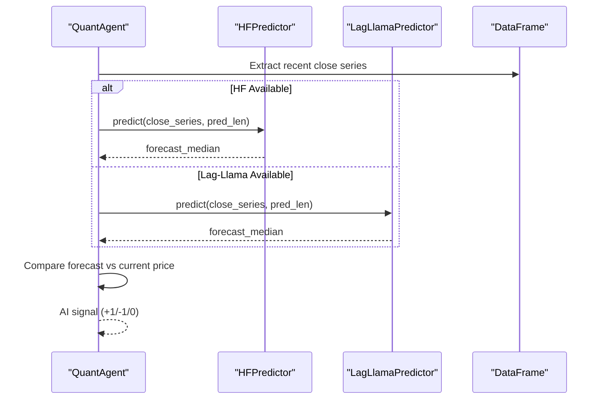

**Diagram sources**
- [quant_agent.py](file://analysis/quant_agent.py#L202-L226)
- [hf_predictor.py](file://strategy/hf_predictor.py#L34-L52)
- [lag_llama_predictor.py](file://strategy/lag_llama_predictor.py#L181-L228)

**Section sources**
- [quant_agent.py](file://analysis/quant_agent.py#L202-L226)
- [hf_predictor.py](file://strategy/hf_predictor.py#L15-L52)
- [lag_llama_predictor.py](file://strategy/lag_llama_predictor.py#L31-L180)

### Confluence Scoring System
The confluence score aggregates:
- Trend filters: optional M5/H1/H4 alignment gating
- Machine Learning: RF/XGBoost probability thresholds
- AI signal: alignment with transformer forecasts
- Structure signals: near-order-block/fair-value-gap and liquidity sweep confirmations
- ADX strength filter

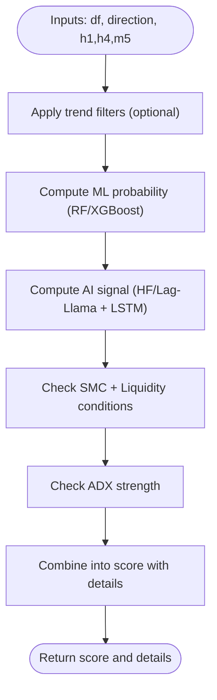

**Diagram sources**
- [quant_agent.py](file://analysis/quant_agent.py#L231-L293)

**Section sources**
- [quant_agent.py](file://analysis/quant_agent.py#L231-L293)

### Ensemble Voting Mechanism
The ensemble combines three components:
- ML probability (RF/XGBoost)
- AI signal (normalized to 0..1 scale)
- Confluence score (0..6 scale)

Weights are applied and normalized to produce a final ensemble score.

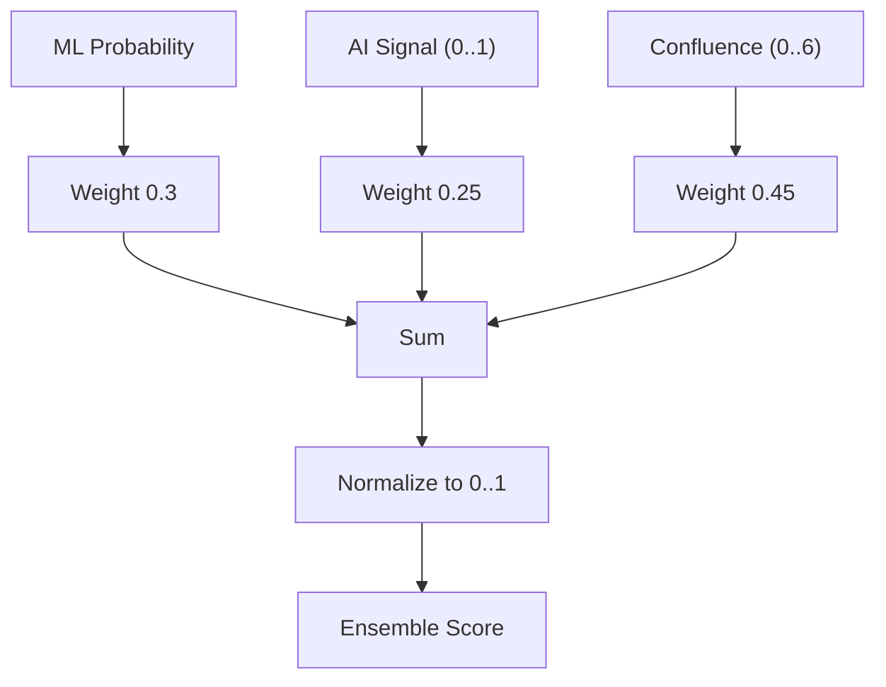

**Diagram sources**
- [quant_agent.py](file://analysis/quant_agent.py#L228-L229)

**Section sources**
- [quant_agent.py](file://analysis/quant_agent.py#L228-L229)

### Model Loading Mechanism
- RF/XGBoost: Loaded via joblib from configured paths; XGBoost is optimized for CPU inference
- LSTM: Attempts to load per-symbol predictors for EURUSD, XAUUSD, BTCUSD, GBPUSD, with a fallback default model
- Transformers: Attempts Lag-Llama predictor factory or Chronos pipeline depending on availability

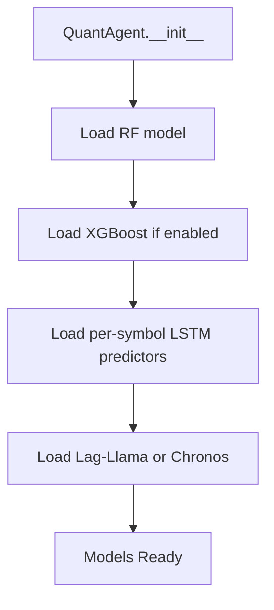

**Diagram sources**
- [quant_agent.py](file://analysis/quant_agent.py#L52-L84)
- [settings.py](file://config/settings.py#L173-L200)

**Section sources**
- [quant_agent.py](file://analysis/quant_agent.py#L52-L84)
- [settings.py](file://config/settings.py#L173-L200)

### Signal Generation Workflow
- Feature engineering on the primary timeframe
- Trend computation across M5/H1/H4
- ML predictions (RF/XGBoost)
- AI signal from transformer/LSTM forecasts
- Confluence scoring and gating
- Ensemble aggregation
- Direction and score returned to pair agents

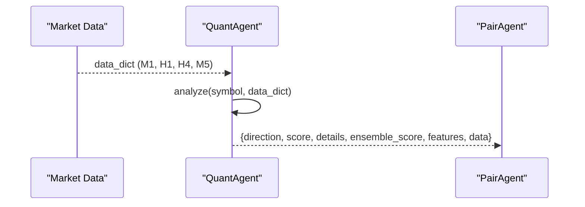

**Diagram sources**
- [quant_agent.py](file://analysis/quant_agent.py#L109-L159)
- [institutional_strategy.py](file://strategy/institutional_strategy.py#L252-L279)

**Section sources**
- [quant_agent.py](file://analysis/quant_agent.py#L109-L159)
- [institutional_strategy.py](file://strategy/institutional_strategy.py#L252-L279)

## Dependency Analysis
- QuantAgent depends on:
  - settings for model paths and gating flags
  - features for TA engineering
  - LSTM predictor/model for sequence-based forecasting
  - HuggingFace/Chronos or Lag-Llama for transformer-based forecasting
  - Joblib for model persistence

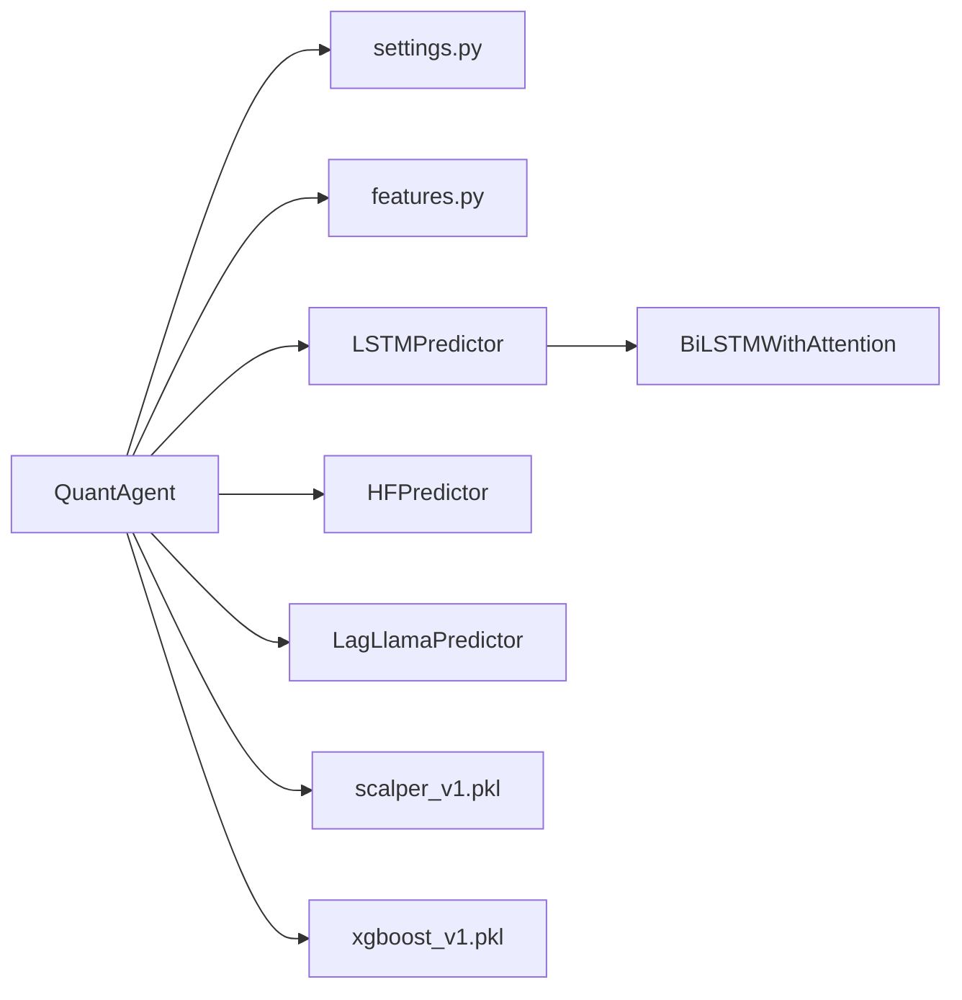

**Diagram sources**
- [quant_agent.py](file://analysis/quant_agent.py#L34-L159)
- [settings.py](file://config/settings.py#L173-L200)
- [lstm_predictor.py](file://strategy/lstm_predictor.py#L9-L36)
- [lstm_model.py](file://strategy/lstm_model.py#L27-L69)
- [hf_predictor.py](file://strategy/hf_predictor.py#L15-L32)
- [lag_llama_predictor.py](file://strategy/lag_llama_predictor.py#L31-L44)

**Section sources**
- [quant_agent.py](file://analysis/quant_agent.py#L34-L159)
- [settings.py](file://config/settings.py#L173-L200)

## Performance Considerations
- Device selection: LSTM and transformers automatically use GPU if available; RF/XGBoost is forced to CPU to avoid warnings
- Efficient preprocessing: LSTM requires sufficient historical bars; ensure sequence length is met
- Feature stability: Keep feature columns aligned between training and inference
- Concurrency: Pair agents coordinate calls to QuantAgent; avoid redundant computations by caching recent features when appropriate

[No sources needed since this section provides general guidance]

## Troubleshooting Guide
Common issues and resolutions:
- Missing models or artifacts:
  - Verify model paths in settings and that files exist
  - Ensure feature columns and scalers match the model’s expectations
- LSTM preprocessing failures:
  - Confirm sufficient history length relative to sequence length
  - Validate presence of required feature columns
- Transformer model loading:
  - Lag-Llama requires a patched checkpoint loading path; ensure vendor path exists
  - Chronos requires explicit installation; ensure library is available
- Confluence gating:
  - Adjust trend filters and thresholds in settings to reduce false blocks
- Ensemble sensitivity:
  - Tune weights in ensemble vote to balance ML, AI, and confluence contributions

**Section sources**
- [lstm_predictor.py](file://strategy/lstm_predictor.py#L79-L113)
- [lag_llama_predictor.py](file://strategy/lag_llama_predictor.py#L46-L179)
- [hf_predictor.py](file://strategy/hf_predictor.py#L15-L32)
- [settings.py](file://config/settings.py#L150-L154)
- [quant_agent.py](file://analysis/quant_agent.py#L228-L229)

## Conclusion
The QuantAgent subsystem consolidates multiple modeling modalities—classical ML, deep learning, and transformer-based forecasting—into a unified confluence-driven decision framework. By combining robust technical indicators, trend filters, and ensemble weighting, it provides reliable, interpretable signals for pair agents. Proper configuration of model paths, feature engineering, and gating parameters ensures consistent performance across diverse instruments and market regimes.