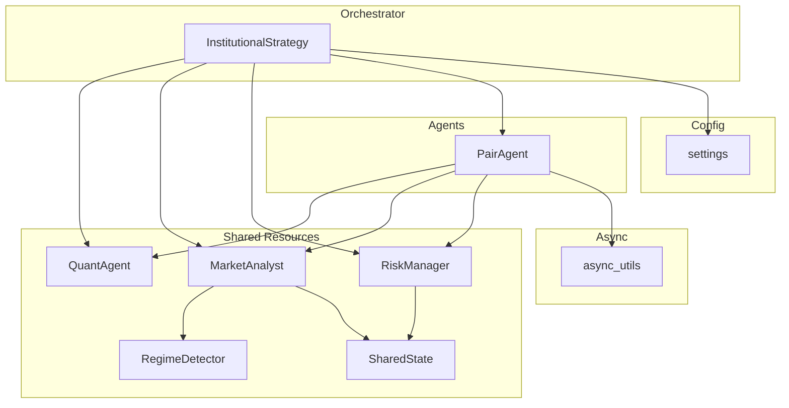
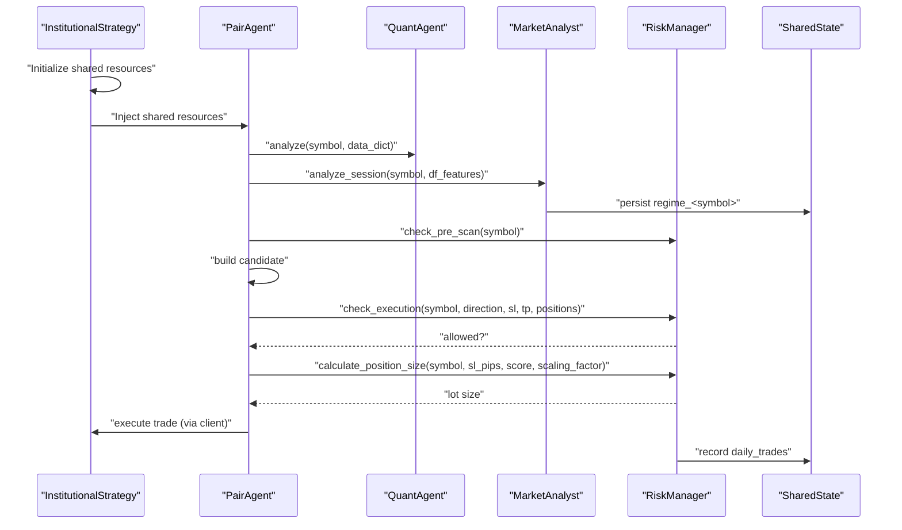
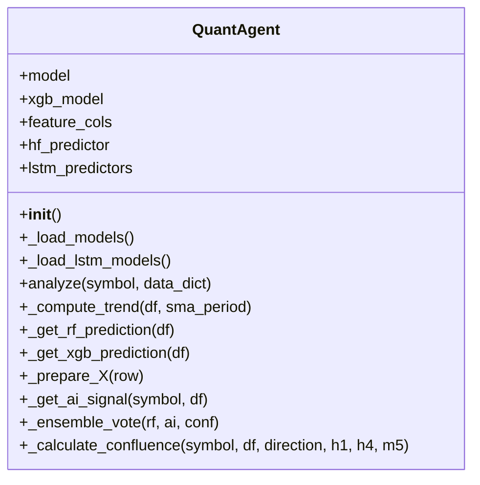
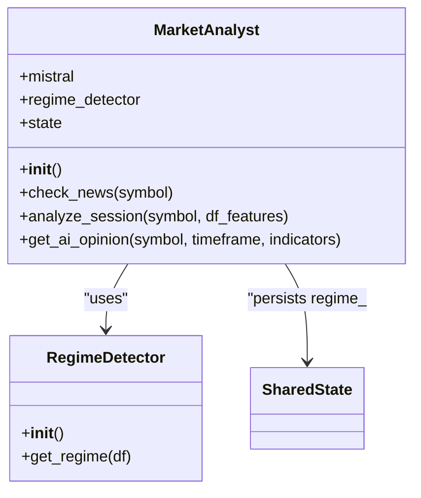
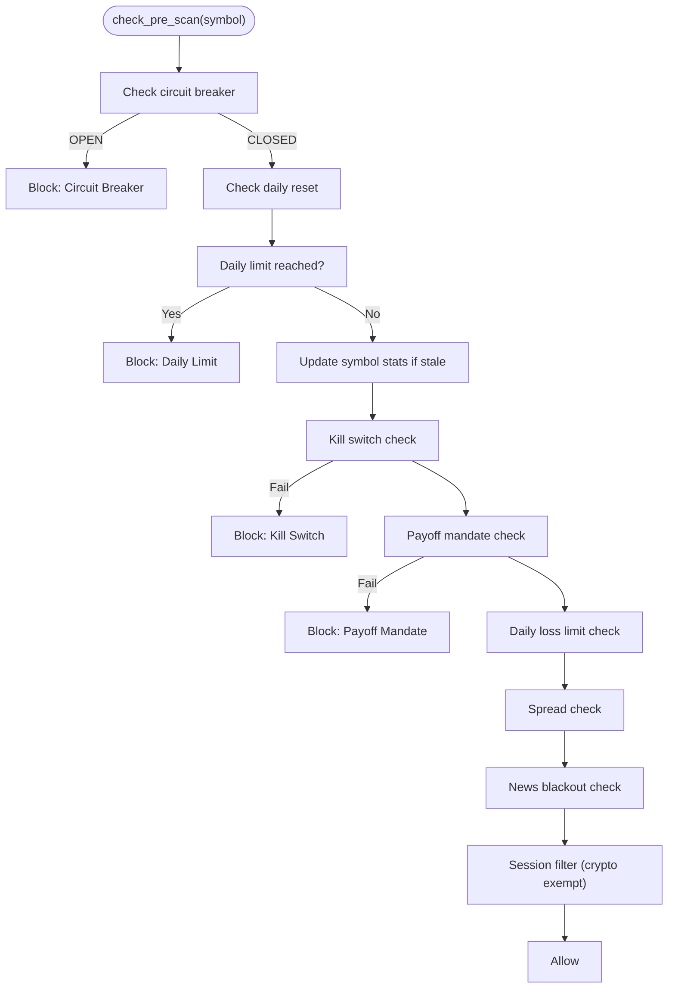
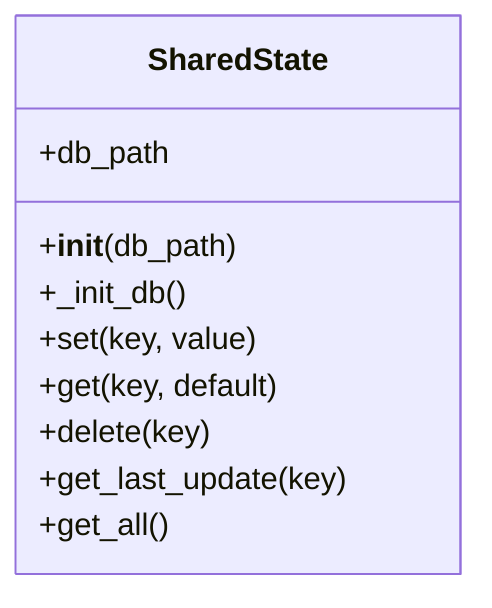
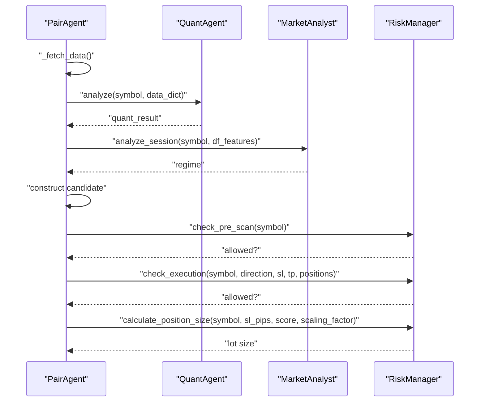
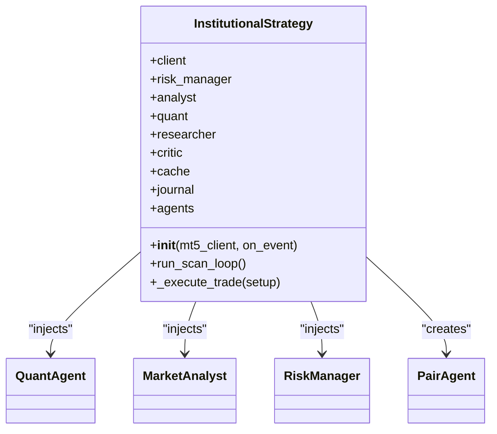
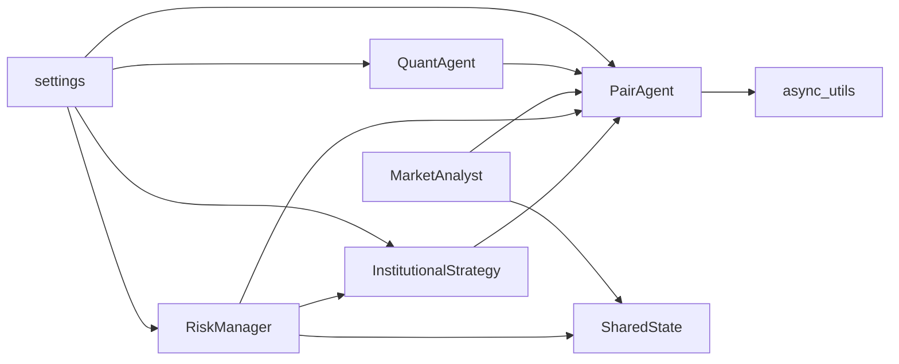

# Shared Resources Management

<cite>
**Referenced Files in This Document**
- [quant_agent.py](file://analysis/quant_agent.py)
- [market_analyst.py](file://analysis/market_analyst.py)
- [regime.py](file://analysis/regime.py)
- [risk_manager.py](file://utils/risk_manager.py)
- [shared_state.py](file://utils/shared_state.py)
- [pair_agent.py](file://strategy/pair_agent.py)
- [institutional_strategy.py](file://strategy/institutional_strategy.py)
- [settings.py](file://config/settings.py)
- [async_utils.py](file://utils/async_utils.py)
- [debug_shared_memory.py](file://debug_shared_memory.py)
</cite>

## Table of Contents
1. [Introduction](#introduction)
2. [Project Structure](#project-structure)
3. [Core Components](#core-components)
4. [Architecture Overview](#architecture-overview)
5. [Detailed Component Analysis](#detailed-component-analysis)
6. [Dependency Analysis](#dependency-analysis)
7. [Performance Considerations](#performance-considerations)
8. [Troubleshooting Guide](#troubleshooting-guide)
9. [Conclusion](#conclusion)

## Introduction
This document describes the shared resources subsystem that powers the multi-agent trading system. It covers how the QuantAgent serves as the centralized machine learning resource, how MarketAnalyst performs regime detection and market condition assessment, how RiskManager centralizes global risk controls and position sizing, and how shared state enables inter-agent communication. It also documents resource allocation strategies, thread safety considerations, performance optimizations, and dependency injection patterns used throughout the system.

## Project Structure
The shared resources subsystem spans several modules:
- Centralized ML and analysis: QuantAgent
- Market regime and sentiment: MarketAnalyst + RegimeDetector
- Global risk control and position sizing: RiskManager
- Inter-agent communication and persistence: SharedState
- Per-symbol orchestration: PairAgent
- Orchestration and dependency injection: InstitutionalStrategy
- Configuration: settings
- Async utilities: async_utils

**Diagram sources**
- [institutional_strategy.py](file://strategy/institutional_strategy.py#L54-L87)
- [pair_agent.py](file://strategy/pair_agent.py#L27-L32)
- [market_analyst.py](file://analysis/market_analyst.py#L15-L19)
- [risk_manager.py](file://utils/risk_manager.py#L14-L18)
- [shared_state.py](file://utils/shared_state.py#L23-L27)
- [regime.py](file://analysis/regime.py#L8-L11)
- [async_utils.py](file://utils/async_utils.py#L9-L16)
- [settings.py](file://config/settings.py#L1-L201)

**Section sources**
- [institutional_strategy.py](file://strategy/institutional_strategy.py#L54-L87)
- [pair_agent.py](file://strategy/pair_agent.py#L27-L32)
- [market_analyst.py](file://analysis/market_analyst.py#L15-L19)
- [risk_manager.py](file://utils/risk_manager.py#L14-L18)
- [shared_state.py](file://utils/shared_state.py#L23-L27)
- [regime.py](file://analysis/regime.py#L8-L11)
- [async_utils.py](file://utils/async_utils.py#L9-L16)
- [settings.py](file://config/settings.py#L1-L201)

## Core Components
- QuantAgent: Centralized ML inference engine providing technical analysis, trend computation, and ensemble scoring for all pair agents.
- MarketAnalyst: Provides market regime classification, AI sentiment, and news blackout filtering, persisting regime data to shared state.
- RiskManager: Global risk controller performing pre-scan checks, position sizing via Kelly criterion and confluence tiers, correlation filtering, and live trailing/BE/partial management.
- SharedState: Persistent key-value store enabling cross-agent communication and state persistence across restarts.
- PairAgent: Per-symbol agent orchestrating data fetching, quant analysis, regime checks, and candidate construction with shared resources.
- InstitutionalStrategy: Coordinates agents, injects shared resources, and manages execution decisions.

**Section sources**
- [quant_agent.py](file://analysis/quant_agent.py#L34-L50)
- [market_analyst.py](file://analysis/market_analyst.py#L7-L20)
- [risk_manager.py](file://utils/risk_manager.py#L14-L50)
- [shared_state.py](file://utils/shared_state.py#L23-L76)
- [pair_agent.py](file://strategy/pair_agent.py#L22-L54)
- [institutional_strategy.py](file://strategy/institutional_strategy.py#L49-L87)

## Architecture Overview
The system follows an agentic architecture with shared resources:
- InstitutionalStrategy constructs shared instances (QuantAgent, MarketAnalyst, RiskManager) and injects them into each PairAgent.
- PairAgent uses shared resources to build candidates and executes trades via RiskManager.
- MarketAnalyst persists regime data to SharedState for other agents to consume.
- RiskManager uses SharedState for global state like circuit breaker and daily trade counts.

**Diagram sources**
- [institutional_strategy.py](file://strategy/institutional_strategy.py#L54-L87)
- [pair_agent.py](file://strategy/pair_agent.py#L71-L106)
- [quant_agent.py](file://analysis/quant_agent.py#L109-L159)
- [market_analyst.py](file://analysis/market_analyst.py#L25-L71)
- [risk_manager.py](file://utils/risk_manager.py#L51-L163)
- [shared_state.py](file://utils/shared_state.py#L42-L59)

## Detailed Component Analysis

### QuantAgent
Responsibilities:
- Loads and maintains ML models (Random Forest, XGBoost, LSTM, and optional Hugging Face/Lag-Llama).
- Computes technical trends across multiple timeframes.
- Generates ML probabilities and AI signals.
- Calculates confluence scores and ensemble scores.

Key behaviors:
- Model loading with fallbacks and device selection.
- Feature preparation and dimensionality alignment.
- Trend computation using SMA comparisons.
- Ensemble voting combining ML and AI signals with confluence.
- Confluence scoring across M5/H1/H4 and ML/AI/SMC/ADX filters.

**Diagram sources**
- [quant_agent.py](file://analysis/quant_agent.py#L34-L294)

**Section sources**
- [quant_agent.py](file://analysis/quant_agent.py#L34-L50)
- [quant_agent.py](file://analysis/quant_agent.py#L109-L159)
- [quant_agent.py](file://analysis/quant_agent.py#L231-L294)

### MarketAnalyst and RegimeDetector
Responsibilities:
- MarketAnalyst integrates news blackout checks, regime detection, and AI sentiment.
- RegimeDetector classifies market regimes (TRENDING, RANGING, VOLATILE, NORMAL) using ADX, ATR, and Bollinger Bands.

Key behaviors:
- MarketAnalyst persists regime data keyed by symbol to SharedState.
- RegimeDetector computes regime from technical indicators and returns details for downstream use.

**Diagram sources**
- [market_analyst.py](file://analysis/market_analyst.py#L7-L20)
- [regime.py](file://analysis/regime.py#L8-L58)
- [shared_state.py](file://utils/shared_state.py#L42-L59)

**Section sources**
- [market_analyst.py](file://analysis/market_analyst.py#L7-L20)
- [market_analyst.py](file://analysis/market_analyst.py#L25-L71)
- [regime.py](file://analysis/regime.py#L12-L58)

### RiskManager
Responsibilities:
- Global pre-scan risk checks (daily limits, kill switch, payoff mandate, spread, news blackout, session gating).
- Execution-time checks (concurrent trades, correlation conflicts, profitability).
- Position sizing using Kelly criterion with fallback to confluence tiers.
- Live trailing stops, break-even moves, and partial profit taking.

Key behaviors:
- Daily trade count restoration from SharedState with UTC date boundary checks.
- Symbol stats caching with 300-second refresh cadence.
- Correlation conflict detection using live returns with fallback to static groups.
- Position sizing combining Kelly fraction and confluence tiers, with tail-risk clamping for high-volatility symbols.

**Diagram sources**
- [risk_manager.py](file://utils/risk_manager.py#L51-L163)

**Section sources**
- [risk_manager.py](file://utils/risk_manager.py#L14-L50)
- [risk_manager.py](file://utils/risk_manager.py#L51-L163)
- [risk_manager.py](file://utils/risk_manager.py#L341-L397)
- [risk_manager.py](file://utils/risk_manager.py#L399-L549)

### SharedState
Responsibilities:
- Persistent key-value store using SQLite for inter-agent communication and state persistence.
- JSON serialization for arbitrary values with timestamps.

Key behaviors:
- Initialization creates kv_store table if missing.
- set operation inserts or replaces key with JSON value and updated timestamp.
- get retrieves and deserializes values; get_all returns all key-value pairs.

**Diagram sources**
- [shared_state.py](file://utils/shared_state.py#L23-L110)

**Section sources**
- [shared_state.py](file://utils/shared_state.py#L23-L76)
- [shared_state.py](file://utils/shared_state.py#L77-L110)

### PairAgent
Responsibilities:
- Per-symbol orchestration: data fetching, quant analysis, regime checks, candidate construction, and active trade management.
- Integrates with shared resources: QuantAgent, MarketAnalyst, RiskManager.

Key behaviors:
- Parallel data fetching across multiple timeframes.
- Candidate construction using ML score, regime, volatility thresholds, and spread-adjusted TP/SL.
- Active trade management: trailing stops, break-even moves, partial closes, and regime exits.

**Diagram sources**
- [pair_agent.py](file://strategy/pair_agent.py#L71-L106)
- [pair_agent.py](file://strategy/pair_agent.py#L145-L295)
- [pair_agent.py](file://strategy/pair_agent.py#L297-L376)

**Section sources**
- [pair_agent.py](file://strategy/pair_agent.py#L71-L106)
- [pair_agent.py](file://strategy/pair_agent.py#L145-L295)
- [pair_agent.py](file://strategy/pair_agent.py#L297-L376)

### InstitutionalStrategy (Dependency Injection)
Responsibilities:
- Creates and injects shared resources into PairAgents.
- Coordinates scanning loops, candidate evaluation, and trade execution.
- Manages global state and event broadcasting.

Key behaviors:
- Constructs shared instances (QuantAgent, MarketAnalyst, RiskManager) and initializes PairAgents with them.
- Executes scans in parallel across all symbols and applies global risk checks before execution.

**Diagram sources**
- [institutional_strategy.py](file://strategy/institutional_strategy.py#L49-L87)
- [institutional_strategy.py](file://strategy/institutional_strategy.py#L99-L330)

**Section sources**
- [institutional_strategy.py](file://strategy/institutional_strategy.py#L49-L87)
- [institutional_strategy.py](file://strategy/institutional_strategy.py#L99-L330)

## Dependency Analysis
- QuantAgent depends on settings for model paths and feature columns, and on feature engineering utilities.
- MarketAnalyst depends on RegimeDetector and SharedState for persistence.
- RiskManager depends on MT5 client for market data and account info, and on SharedState for global counters.
- PairAgent depends on async utilities for non-blocking operations and on MarketAnalyst/QuantAgent/RiskManager.
- InstitutionalStrategy coordinates all components and injects shared resources.

**Diagram sources**
- [settings.py](file://config/settings.py#L1-L201)
- [quant_agent.py](file://analysis/quant_agent.py#L52-L84)
- [risk_manager.py](file://utils/risk_manager.py#L14-L18)
- [pair_agent.py](file://strategy/pair_agent.py#L27-L32)
- [institutional_strategy.py](file://strategy/institutional_strategy.py#L54-L87)
- [shared_state.py](file://utils/shared_state.py#L23-L27)
- [async_utils.py](file://utils/async_utils.py#L9-L16)

**Section sources**
- [settings.py](file://config/settings.py#L1-L201)
- [quant_agent.py](file://analysis/quant_agent.py#L52-L84)
- [risk_manager.py](file://utils/risk_manager.py#L14-L18)
- [pair_agent.py](file://strategy/pair_agent.py#L27-L32)
- [institutional_strategy.py](file://strategy/institutional_strategy.py#L54-L87)
- [shared_state.py](file://utils/shared_state.py#L23-L27)
- [async_utils.py](file://utils/async_utils.py#L9-L16)

## Performance Considerations
- Asynchronous orchestration: PairAgent scans run concurrently using asyncio.gather, reducing total scan latency.
- Thread pool for blocking operations: run_in_executor prevents blocking the event loop for data fetching and model inference.
- Cached symbol stats: RiskManager updates symbol statistics every 300 seconds to reduce MT5 calls.
- Lightweight regime persistence: MarketAnalyst writes regime data to SharedState only when needed.
- Position sizing fallbacks: RiskManager uses confluence tiers when Kelly stats are unavailable.
- ATR caching: PairAgent caches recent ATR to avoid recomputation.

Optimization recommendations:
- Use batched MT5 calls where possible to reduce overhead.
- Consider model warm-up and GPU utilization for LSTM/HF predictors.
- Tune async worker pool size based on CPU and I/O characteristics.
- Monitor database I/O for SharedState under high-frequency updates.

**Section sources**
- [pair_agent.py](file://strategy/pair_agent.py#L132-L140)
- [async_utils.py](file://utils/async_utils.py#L9-L16)
- [risk_manager.py](file://utils/risk_manager.py#L68-L70)
- [market_analyst.py](file://analysis/market_analyst.py#L50-L57)
- [pair_agent.py](file://strategy/pair_agent.py#L318-L336)

## Troubleshooting Guide
Common issues and resolutions:
- Model loading failures: QuantAgent catches exceptions during model load; verify MODEL_PATH and XGB_MODEL_PATH existence and permissions.
- Missing features: QuantAgent prepares features and falls back gracefully if feature engineering fails.
- Regime persistence errors: MarketAnalyst wraps persistence in try/except; ensure SharedState database is writable.
- Risk manager counters: RiskManager restores daily_trades from SharedState; confirm UTC date boundary handling.
- Circuit breaker: SharedState stores circuit_breaker; use debug script to verify persistence and restoration.
- Execution checks: RiskManager.check_execution validates spread, correlation, and profitability; review logs for blocking reasons.

Diagnostic utilities:
- debug_shared_memory.py demonstrates SharedState persistence and RiskManager restoration.

**Section sources**
- [quant_agent.py](file://analysis/quant_agent.py#L68-L70)
- [market_analyst.py](file://analysis/market_analyst.py#L50-L57)
- [risk_manager.py](file://utils/risk_manager.py#L19-L35)
- [debug_shared_memory.py](file://debug_shared_memory.py#L8-L50)

## Conclusion
The shared resources subsystem provides a robust foundation for multi-agent trading:
- QuantAgent centralizes ML inference and technical analysis.
- MarketAnalyst delivers regime-aware insights and persists state for others.
- RiskManager enforces global risk controls and adaptive position sizing.
- SharedState enables loose coupling and persistence across restarts.
- InstitutionalStrategy coordinates agents and injects shared resources, while PairAgent orchestrates per-symbol execution.

This architecture balances modularity, scalability, and resilience, with careful attention to thread safety, performance, and inter-agent communication.