# State Management System

<cite>
**Referenced Files in This Document**
- [shared_state.py](file://utils/shared_state.py)
- [data_cache.py](file://utils/data_cache.py)
- [stream_server.py](file://api/stream_server.py)
- [useBotWebSocket.js](file://dashboard/src/hooks/useBotWebSocket.js)
- [main.py](file://main.py)
- [institutional_strategy.py](file://strategy/institutional_strategy.py)
- [pair_agent.py](file://strategy/pair_agent.py)
- [risk_manager.py](file://utils/risk_manager.py)
- [trade_journal.py](file://utils/trade_journal.py)
- [market_analyst.py](file://analysis/market_analyst.py)
- [quant_agent.py](file://analysis/quant_agent.py)
- [mt5_client.py](file://execution/mt5_client.py)
- [loader.py](file://market_data/loader.py)
- [settings.py](file://config/settings.py)
</cite>

## Table of Contents
1. [Introduction](#introduction)
2. [Project Structure](#project-structure)
3. [Core Components](#core-components)
4. [Architecture Overview](#architecture-overview)
5. [Detailed Component Analysis](#detailed-component-analysis)
6. [Dependency Analysis](#dependency-analysis)
7. [Performance Considerations](#performance-considerations)
8. [Troubleshooting Guide](#troubleshooting-guide)
9. [Conclusion](#conclusion)

## Introduction
This document describes the Shared State Management system that coordinates data sharing and state synchronization across all trading agents. It covers:
- Inter-process communication mechanisms
- Thread-safe data structures
- Real-time state updates
- Data caching strategies for market data, model predictions, and trade execution status
- State persistence and recovery
- Event-driven communication patterns and centralized broadcasting
- Examples of state synchronization workflows, cache invalidation strategies, and performance optimizations for high-frequency data sharing
- Integration with the WebSocket server for real-time dashboard updates

## Project Structure
The state management spans several modules:
- Shared state persistence using a SQLite-backed key-value store
- In-memory caches for high-frequency data and rolling event logs
- Centralized WebSocket server for real-time dashboards
- Risk manager and agents that publish events to the stream server
- MT5 client for live market data and order execution

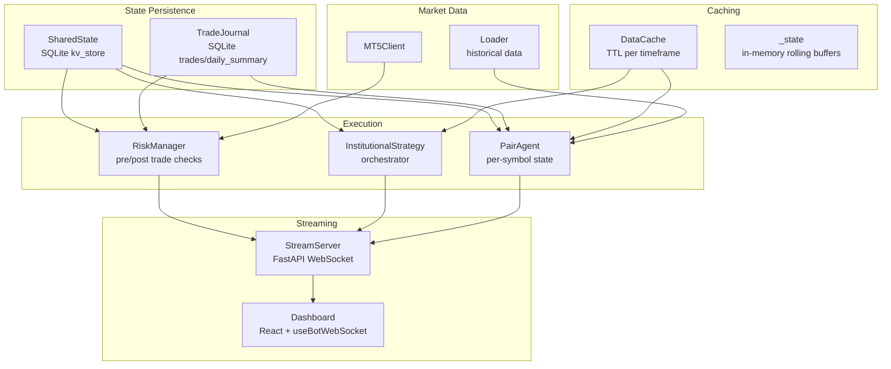

**Diagram sources**
- [shared_state.py](file://utils/shared_state.py#L23-L110)
- [trade_journal.py](file://utils/trade_journal.py#L23-L274)
- [data_cache.py](file://utils/data_cache.py#L16-L77)
- [stream_server.py](file://api/stream_server.py#L27-L212)
- [useBotWebSocket.js](file://dashboard/src/hooks/useBotWebSocket.js#L1-L156)
- [institutional_strategy.py](file://strategy/institutional_strategy.py#L49-L500)
- [pair_agent.py](file://strategy/pair_agent.py#L22-L432)
- [risk_manager.py](file://utils/risk_manager.py#L14-L549)
- [mt5_client.py](file://execution/mt5_client.py#L12-L385)
- [loader.py](file://market_data/loader.py#L40-L83)

**Section sources**
- [shared_state.py](file://utils/shared_state.py#L1-L110)
- [data_cache.py](file://utils/data_cache.py#L1-L77)
- [stream_server.py](file://api/stream_server.py#L1-L212)
- [useBotWebSocket.js](file://dashboard/src/hooks/useBotWebSocket.js#L1-L156)
- [institutional_strategy.py](file://strategy/institutional_strategy.py#L1-L500)
- [pair_agent.py](file://strategy/pair_agent.py#L1-L432)
- [risk_manager.py](file://utils/risk_manager.py#L1-L549)
- [trade_journal.py](file://utils/trade_journal.py#L1-L274)
- [market_analyst.py](file://analysis/market_analyst.py#L1-L81)
- [quant_agent.py](file://analysis/quant_agent.py#L1-L294)
- [mt5_client.py](file://execution/mt5_client.py#L1-L385)
- [loader.py](file://market_data/loader.py#L1-L83)
- [settings.py](file://config/settings.py#L1-L201)

## Core Components
- SharedState: Persistent key-value store using SQLite for cross-agent whiteboard data (e.g., market regime, risk flags).
- DataCache: Thread-safe TTL cache for multi-timeframe market data to reduce MT5 API calls.
- StreamServer: FastAPI WebSocket server broadcasting state snapshots and rolling event logs to the dashboard.
- RiskManager: Centralizes pre-trade checks and maintains shared daily trade counts and circuit breaker state.
- InstitutionalStrategy: Coordinates agents, orchestrates scans, and publishes structured events to the stream server.
- PairAgent: Per-symbol agent managing local state (performance, regime, ATR cache) and coordinating active trade management.
- TradeJournal: SQLite-backed journal for logging entries/exits and performance analytics.
- MT5Client: Provides live market data and order execution APIs.
- Loader: Historical data fetcher with MT5 initialization and multi-timeframe support.

**Section sources**
- [shared_state.py](file://utils/shared_state.py#L23-L110)
- [data_cache.py](file://utils/data_cache.py#L16-L77)
- [stream_server.py](file://api/stream_server.py#L27-L212)
- [risk_manager.py](file://utils/risk_manager.py#L14-L549)
- [institutional_strategy.py](file://strategy/institutional_strategy.py#L49-L500)
- [pair_agent.py](file://strategy/pair_agent.py#L22-L432)
- [trade_journal.py](file://utils/trade_journal.py#L23-L274)
- [mt5_client.py](file://execution/mt5_client.py#L12-L385)
- [loader.py](file://market_data/loader.py#L40-L83)

## Architecture Overview
The system uses a hybrid architecture:
- Persistent state via SharedState for long-lived coordination tokens (e.g., circuit breaker, daily trade counts).
- In-memory caches for high-frequency data and rolling event logs for low-latency dashboards.
- Event-driven publishing from agents and strategy to the stream server.
- WebSocket-based real-time updates to the React dashboard.

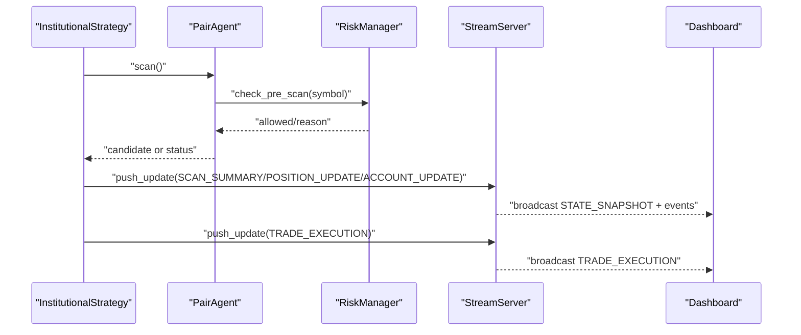

**Diagram sources**
- [institutional_strategy.py](file://strategy/institutional_strategy.py#L99-L330)
- [pair_agent.py](file://strategy/pair_agent.py#L71-L106)
- [risk_manager.py](file://utils/risk_manager.py#L51-L163)
- [stream_server.py](file://api/stream_server.py#L177-L212)
- [useBotWebSocket.js](file://dashboard/src/hooks/useBotWebSocket.js#L105-L156)

## Detailed Component Analysis

### SharedState (Persistent Key-Value Store)
SharedState persists arbitrary JSON-serializable values keyed by strings. It initializes a kv_store table and supports set/get/delete operations with timestamps. This enables agents to coordinate without tight coupling.

Key characteristics:
- Schema: key (TEXT PRIMARY KEY), value (TEXT), updated_at (TIMESTAMP)
- Thread-safety: Not thread-safe; callers should serialize access if used across threads
- Use cases: Circuit breaker flags, daily trade counters, regime metadata

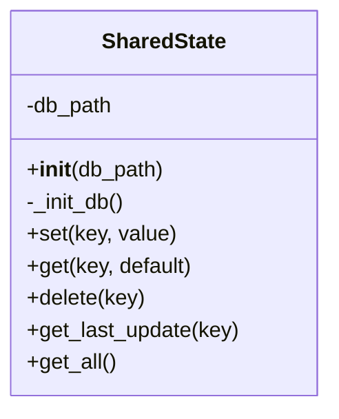

**Diagram sources**
- [shared_state.py](file://utils/shared_state.py#L23-L110)

**Section sources**
- [shared_state.py](file://utils/shared_state.py#L23-L110)

### DataCache (High-Frequency Market Data Caching)
DataCache provides thread-safe caching with TTL per timeframe to minimize MT5 API calls. It stores tuples of (timestamp, DataFrame) and invalidates selectively by symbol or timeframe.

Key characteristics:
- TTLs: M15 (5 min), H1 (15 min), H4 (60 min), D1 (2 hours)
- Methods: get(symbol, timeframe, n_bars), invalidate(symbol, timeframe), stats()
- Thread-safety: Uses a single in-memory dictionary; suitable for single-threaded access or guarded usage

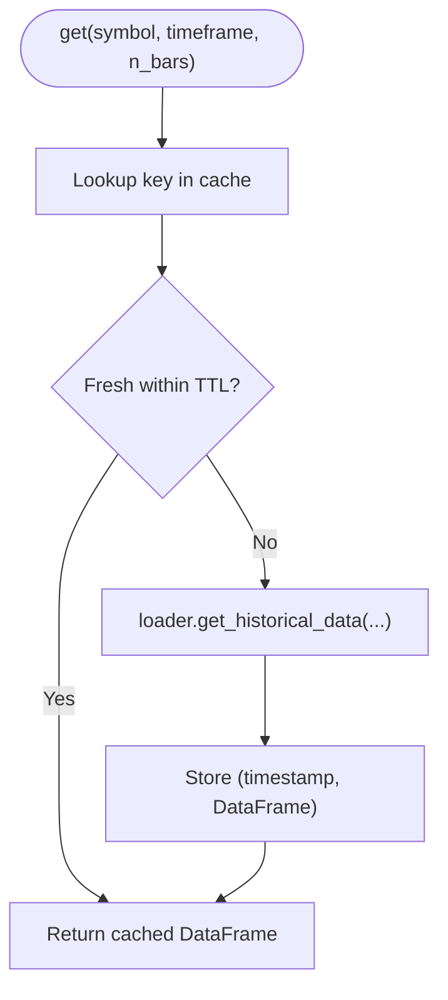

**Diagram sources**
- [data_cache.py](file://utils/data_cache.py#L30-L48)

**Section sources**
- [data_cache.py](file://utils/data_cache.py#L16-L77)
- [loader.py](file://market_data/loader.py#L40-L83)

### StreamServer (Real-Time Broadcasting)
StreamServer exposes:
- WebSocket endpoint for real-time updates
- REST endpoints for account, positions, trades, scan summary, and full state
- In-memory state snapshot with rolling buffers for events, positions, recent trades, and account info
- push_update for thread-safe updates and broadcasts

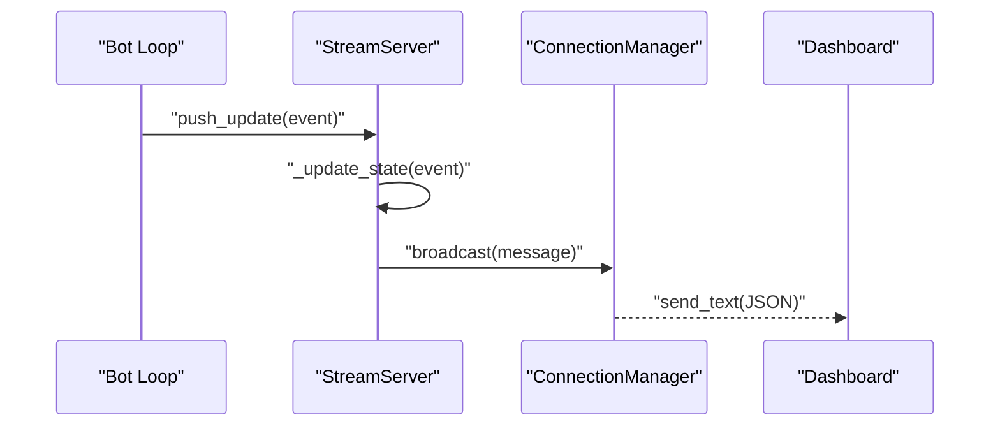

**Diagram sources**
- [stream_server.py](file://api/stream_server.py#L177-L212)
- [useBotWebSocket.js](file://dashboard/src/hooks/useBotWebSocket.js#L118-L142)

**Section sources**
- [stream_server.py](file://api/stream_server.py#L27-L212)
- [useBotWebSocket.js](file://dashboard/src/hooks/useBotWebSocket.js#L1-L156)

### RiskManager (Pre-Trade Coordination)
RiskManager centralizes:
- Daily trade counting with persistence via SharedState
- Pre-scan checks (circuit breaker, daily limit, kill switch, payoff mandate, spread, news blackout, session filter)
- Execution checks (concurrent caps, correlation conflicts, profitability)
- Position monitoring with trailing stops, partial closes, and break-even logic
- Position sizing using Kelly criterion or confluence tiers

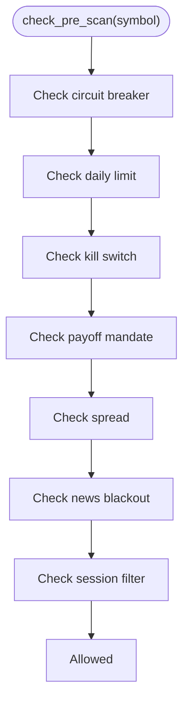

**Diagram sources**
- [risk_manager.py](file://utils/risk_manager.py#L51-L163)

**Section sources**
- [risk_manager.py](file://utils/risk_manager.py#L14-L549)
- [shared_state.py](file://utils/shared_state.py#L23-L110)

### InstitutionalStrategy (Orchestrator and Event Publisher)
InstitutionalStrategy:
- Initializes shared agents and infrastructure
- Runs parallel scans across PairAgents
- Publishes SCAN_SUMMARY, POSITION_UPDATE, ACCOUNT_UPDATE, RESEARCH_START/RESULT, and TRADE_EXECUTION events
- Integrates with MT5Client for live data and order placement

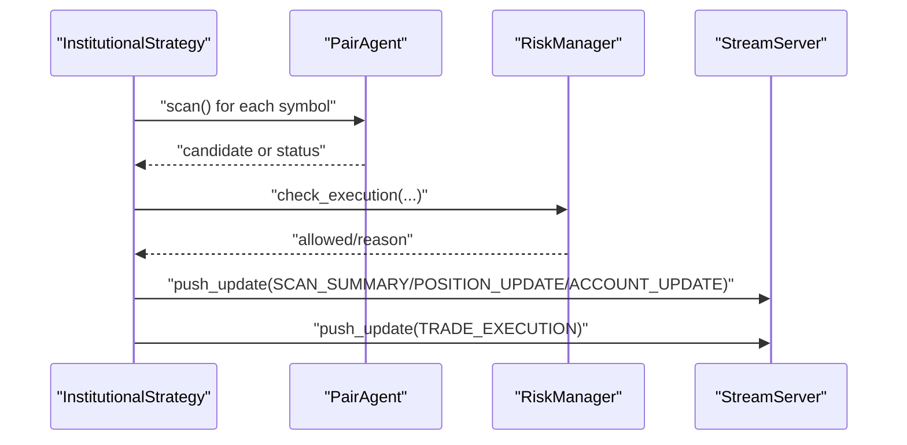

**Diagram sources**
- [institutional_strategy.py](file://strategy/institutional_strategy.py#L99-L330)
- [stream_server.py](file://api/stream_server.py#L177-L212)

**Section sources**
- [institutional_strategy.py](file://strategy/institutional_strategy.py#L49-L500)

### PairAgent (Per-Symbol State and Active Management)
PairAgent maintains:
- Local state: active flag, consecutive losses, total PnL, last scan/trade times, regime, cached ATR
- Performs pre-scan risk checks, data fetching, quant/regime analysis, and candidate construction
- Active trade management: trailing stops, partial closes, and regime-based exits
- Updates performance and can pause itself after consecutive losses

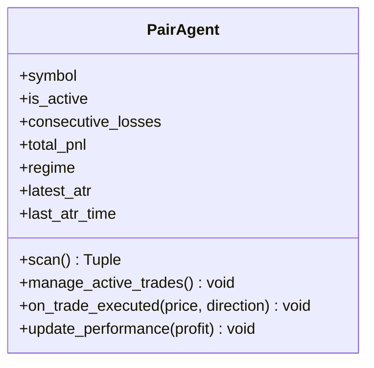

**Diagram sources**
- [pair_agent.py](file://strategy/pair_agent.py#L22-L432)

**Section sources**
- [pair_agent.py](file://strategy/pair_agent.py#L22-L432)

### TradeJournal (Persistence of Trade Lifecycle)
TradeJournal persists:
- Trade entries with confluence scores, directions, lot sizes, SL/TP, researcher metadata
- Trade exits with realized PnL, durations, outcomes
- Daily summaries and confluence analysis for post-mortem insights

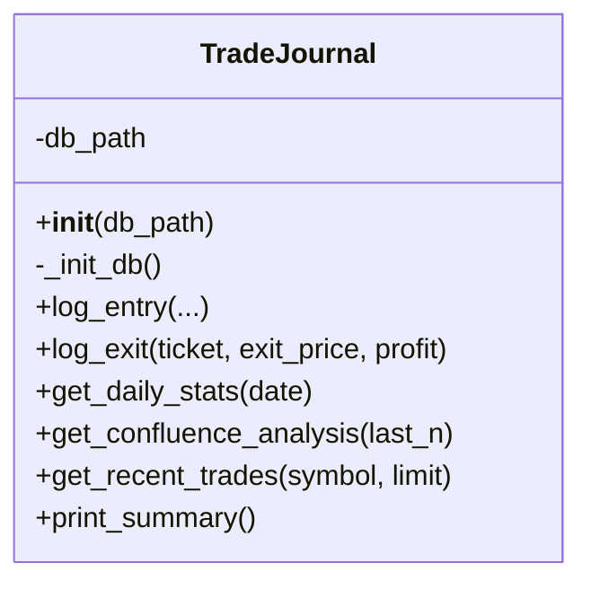

**Diagram sources**
- [trade_journal.py](file://utils/trade_journal.py#L23-L274)

**Section sources**
- [trade_journal.py](file://utils/trade_journal.py#L23-L274)

### MarketAnalyst and QuantAgent (Model Predictions and Regime)
- MarketAnalyst: Regime detection and AI opinion; persists regime metadata to SharedState
- QuantAgent: Technical analysis, ML/XGBoost/LSTM inference, trend computation, and confluence scoring

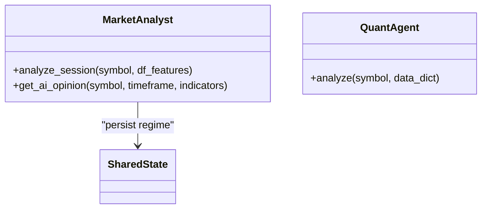

**Diagram sources**
- [market_analyst.py](file://analysis/market_analyst.py#L7-L81)
- [quant_agent.py](file://analysis/quant_agent.py#L34-L294)
- [shared_state.py](file://utils/shared_state.py#L23-L110)

**Section sources**
- [market_analyst.py](file://analysis/market_analyst.py#L1-L81)
- [quant_agent.py](file://analysis/quant_agent.py#L1-L294)
- [shared_state.py](file://utils/shared_state.py#L1-L110)

### MT5Client and Loader (Market Data Access)
- MT5Client: Connection management, symbol detection, account info, order placement, position management
- Loader: Historical data retrieval with MT5 initialization and multi-timeframe aggregation

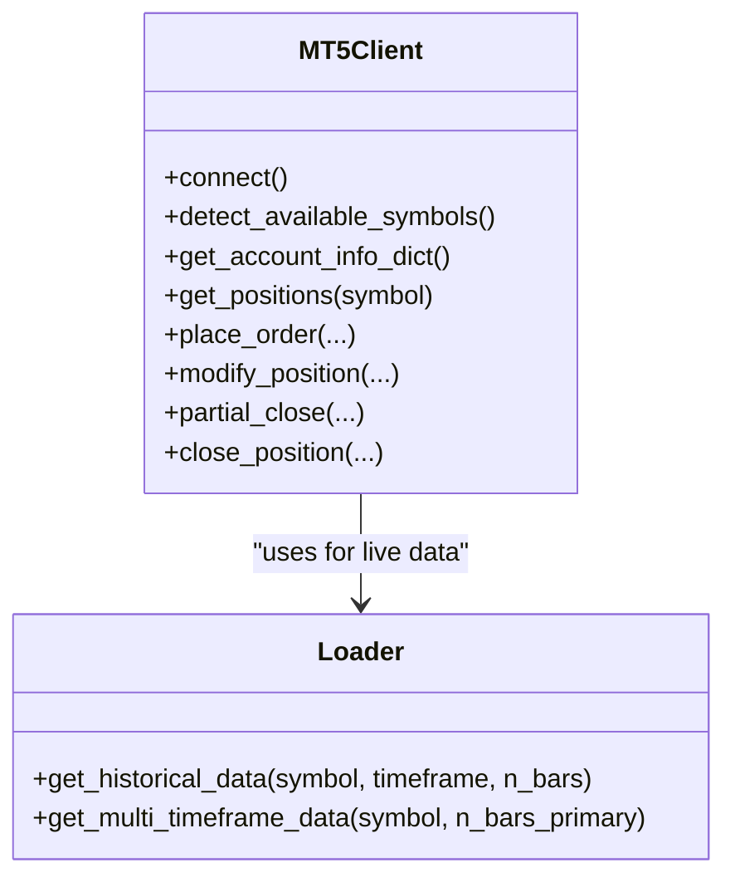

**Diagram sources**
- [mt5_client.py](file://execution/mt5_client.py#L12-L385)
- [loader.py](file://market_data/loader.py#L40-L83)

**Section sources**
- [mt5_client.py](file://execution/mt5_client.py#L1-L385)
- [loader.py](file://market_data/loader.py#L1-L83)

## Dependency Analysis
Inter-module dependencies relevant to state management:
- RiskManager depends on SharedState for daily trade counts and circuit breaker
- InstitutionalStrategy publishes events consumed by StreamServer and used by dashboard
- PairAgent relies on DataCache for multi-timeframe data and on RiskManager for pre-scan checks
- MarketAnalyst and QuantAgent contribute to candidate generation and persist regime metadata
- TradeJournal persists lifecycle events for post-hoc analysis

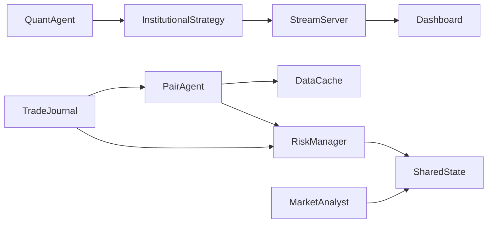

**Diagram sources**
- [risk_manager.py](file://utils/risk_manager.py#L14-L549)
- [shared_state.py](file://utils/shared_state.py#L23-L110)
- [institutional_strategy.py](file://strategy/institutional_strategy.py#L49-L500)
- [stream_server.py](file://api/stream_server.py#L27-L212)
- [pair_agent.py](file://strategy/pair_agent.py#L22-L432)
- [data_cache.py](file://utils/data_cache.py#L16-L77)
- [market_analyst.py](file://analysis/market_analyst.py#L7-L81)
- [quant_agent.py](file://analysis/quant_agent.py#L34-L294)
- [trade_journal.py](file://utils/trade_journal.py#L23-L274)
- [useBotWebSocket.js](file://dashboard/src/hooks/useBotWebSocket.js#L1-L156)

**Section sources**
- [risk_manager.py](file://utils/risk_manager.py#L14-L549)
- [shared_state.py](file://utils/shared_state.py#L23-L110)
- [institutional_strategy.py](file://strategy/institutional_strategy.py#L49-L500)
- [stream_server.py](file://api/stream_server.py#L27-L212)
- [pair_agent.py](file://strategy/pair_agent.py#L22-L432)
- [data_cache.py](file://utils/data_cache.py#L16-L77)
- [market_analyst.py](file://analysis/market_analyst.py#L1-L81)
- [quant_agent.py](file://analysis/quant_agent.py#L1-L294)
- [trade_journal.py](file://utils/trade_journal.py#L1-L274)
- [useBotWebSocket.js](file://dashboard/src/hooks/useBotWebSocket.js#L1-L156)

## Performance Considerations
- DataCache TTL minimizes redundant MT5 API calls; tune TTLs per timeframe to balance freshness vs. latency.
- RiskManager pre-checks short-circuit expensive operations; circuit breaker and daily limits prevent overload.
- StreamServer uses in-memory state with rolling buffers; broadcast is optimized for frequent updates.
- PairAgent caches ATR locally to avoid repeated indicator computations.
- Use thread-safe patterns for SharedState access if accessed from multiple threads; otherwise, serialize access.
- Prefer batched event publishing to reduce WebSocket overhead.

[No sources needed since this section provides general guidance]

## Troubleshooting Guide
Common issues and remedies:
- WebSocket disconnects: The dashboard hook reconnects automatically; verify server startup and firewall settings.
- High latency in dashboard updates: Ensure push_update is called from the event loop; StreamServer uses asyncio.run_coroutine_threadsafe for thread-safe broadcasts.
- MT5 connectivity failures: Initial_connect handles re-initialization; confirm credentials and terminal path.
- Cache misses causing spikes: Increase cache TTLs or pre-warm caches during off-hours.
- Risk gating preventing trades: Review kill switch thresholds, payoff mandate, and session filters; adjust settings accordingly.

**Section sources**
- [useBotWebSocket.js](file://dashboard/src/hooks/useBotWebSocket.js#L118-L156)
- [stream_server.py](file://api/stream_server.py#L177-L212)
- [loader.py](file://market_data/loader.py#L24-L37)
- [risk_manager.py](file://utils/risk_manager.py#L51-L163)
- [settings.py](file://config/settings.py#L1-L201)

## Conclusion
The Shared State Management system integrates persistent coordination (SharedState), high-frequency caching (DataCache), and real-time streaming (StreamServer) to enable scalable, event-driven trading across multiple agents. It balances performance with reliability through careful caching, pre-trade gating, and robust persistence for both operational state and trade lifecycle tracking.