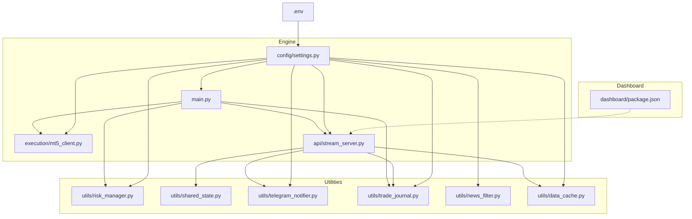
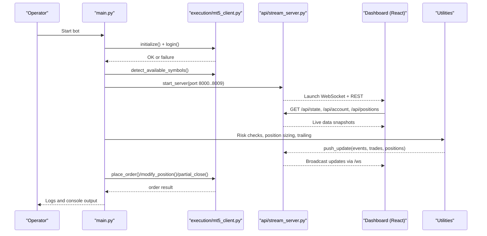
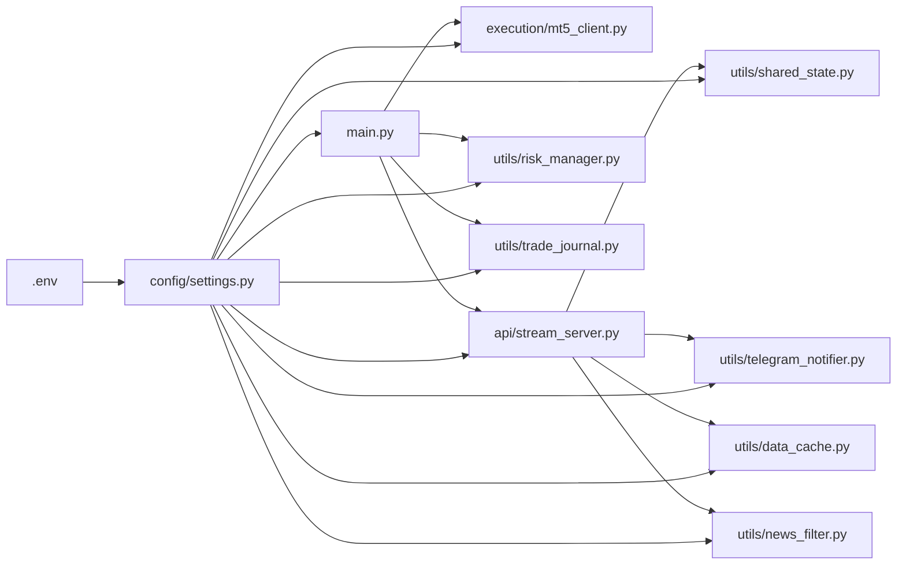

# Deployment and Operations

<cite>
**Referenced Files in This Document**
- [README.md](file://README.md)
- [requirements.txt](file://requirements.txt)
- [.env](file://.env)
- [config/settings.py](file://config/settings.py)
- [main.py](file://main.py)
- [api/stream_server.py](file://api/stream_server.py)
- [execution/mt5_client.py](file://execution/mt5_client.py)
- [utils/risk_manager.py](file://utils/risk_manager.py)
- [utils/shared_state.py](file://utils/shared_state.py)
- [utils/telegram_notifier.py](file://utils/telegram_notifier.py)
- [utils/trade_journal.py](file://utils/trade_journal.py)
- [utils/news_filter.py](file://utils/news_filter.py)
- [utils/data_cache.py](file://utils/data_cache.py)
- [dashboard/package.json](file://dashboard/package.json)
</cite>

## Table of Contents
1. [Introduction](#introduction)
2. [Project Structure](#project-structure)
3. [Core Components](#core-components)
4. [Architecture Overview](#architecture-overview)
5. [Detailed Component Analysis](#detailed-component-analysis)
6. [Dependency Analysis](#dependency-analysis)
7. [Performance Considerations](#performance-considerations)
8. [Troubleshooting Guide](#troubleshooting-guide)
9. [Conclusion](#conclusion)
10. [Appendices](#appendices)

## Introduction
This document provides comprehensive deployment and operations guidance for the Institutional SureShot Scanner. It covers production deployment procedures, system monitoring, maintenance workflows, and operational security. It explains the operational environment setup, dependency management, service configuration, monitoring and alerting, log management, performance tracking, graceful degradation handling, backup and disaster recovery, and best practices for scaling.

## Project Structure
The system is composed of:
- A Python trading engine orchestrating MT5 connectivity, asynchronous scanning, and WebSocket/REST APIs
- A React/Vite dashboard that consumes the API and WebSocket for real-time updates
- Utilities for risk management, shared state persistence, Telegram notifications, trade journaling, news filtering, and data caching

**Diagram sources**
- [main.py](file://main.py#L1-L122)
- [config/settings.py](file://config/settings.py#L1-L201)
- [execution/mt5_client.py](file://execution/mt5_client.py#L1-L385)
- [api/stream_server.py](file://api/stream_server.py#L1-L212)
- [utils/risk_manager.py](file://utils/risk_manager.py#L1-L549)
- [utils/shared_state.py](file://utils/shared_state.py#L1-L110)
- [utils/telegram_notifier.py](file://utils/telegram_notifier.py#L1-L174)
- [utils/trade_journal.py](file://utils/trade_journal.py#L1-L274)
- [utils/news_filter.py](file://utils/news_filter.py#L1-L239)
- [utils/data_cache.py](file://utils/data_cache.py#L1-L77)
- [dashboard/package.json](file://dashboard/package.json#L1-L24)
- [.env](file://.env#L1-L59)

**Section sources**
- [README.md](file://README.md#L187-L235)
- [dashboard/package.json](file://dashboard/package.json#L1-L24)

## Core Components
- Configuration and Environment
  - Centralized via environment variables and settings module
  - Includes MT5 credentials, trading parameters, risk controls, AI keys, and Telegram settings
- MT5 Client
  - Handles connection, symbol detection, account info, order placement, position management, and dynamic lot sizing
- Risk Manager
  - Implements pre-trade checks, daily limits, kill switch, payoff mandate, correlation filter, and trailing/position management
- Stream Server (FastAPI)
  - Provides REST endpoints and WebSocket for the dashboard; maintains in-memory state and broadcasts updates
- Shared State
  - Persistent key-value store for inter-agent coordination
- Telegram Notifier
  - Non-blocking Telegram alerts for trade events and summaries
- Trade Journal
  - SQLite-backed logging and analytics for trades and daily summaries
- News Filter
  - Scheduled and live calendar integration to avoid high-impact events
- Data Cache
  - TTL-based caching for multi-timeframe historical data
- Dashboard
  - React/Vite app that auto-launches and connects to the API

**Section sources**
- [.env](file://.env#L1-L59)
- [config/settings.py](file://config/settings.py#L1-L201)
- [execution/mt5_client.py](file://execution/mt5_client.py#L1-L385)
- [utils/risk_manager.py](file://utils/risk_manager.py#L1-L549)
- [api/stream_server.py](file://api/stream_server.py#L1-L212)
- [utils/shared_state.py](file://utils/shared_state.py#L1-L110)
- [utils/telegram_notifier.py](file://utils/telegram_notifier.py#L1-L174)
- [utils/trade_journal.py](file://utils/trade_journal.py#L1-L274)
- [utils/news_filter.py](file://utils/news_filter.py#L1-L239)
- [utils/data_cache.py](file://utils/data_cache.py#L1-L77)
- [dashboard/package.json](file://dashboard/package.json#L1-L24)

## Architecture Overview
The system runs as a single-process trading engine with:
- An MT5 client for brokerage connectivity
- An asynchronous scanning loop that coordinates agents per symbol
- A FastAPI server exposing REST and WebSocket endpoints
- A React dashboard consuming the API and WebSocket
- Utilities for risk, persistence, notifications, and analytics

**Diagram sources**
- [main.py](file://main.py#L1-L122)
- [execution/mt5_client.py](file://execution/mt5_client.py#L1-L385)
- [api/stream_server.py](file://api/stream_server.py#L1-L212)

## Detailed Component Analysis

### Configuration and Environment
- Environment variables are loaded into the settings module and control all runtime behavior
- Critical variables include MT5 credentials, trading parameters, risk thresholds, session filters, AI keys, and Telegram tokens
- Best practice: store secrets externally (e.g., OS environment or secret manager) and mount them at runtime

Operational checklist:
- Validate MT5 login, server, and terminal path
- Set risk parameters appropriate for the account size and strategy
- Configure Telegram tokens and chat ID for alerts
- Enable/disable session filters and trend filters per market regime

**Section sources**
- [.env](file://.env#L1-L59)
- [config/settings.py](file://config/settings.py#L1-L201)

### MT5 Client
Responsibilities:
- Initialize and authenticate with MT5
- Auto-detect available symbols on the account and categorize them
- Provide account info, history, and order lifecycle operations
- Calculate dynamic lot sizes based on risk percent and SL distance

Operational notes:
- Ensure the MT5 terminal is running and logged in
- Verify symbol visibility and trade modes
- Handle fallbacks for missing tick data or symbol info

**Section sources**
- [execution/mt5_client.py](file://execution/mt5_client.py#L1-L385)

### Risk Manager
Responsibilities:
- Pre-scan checks: daily limits, cooldowns, spread gates, news blackouts, session filters
- Kill switch and payoff mandate enforcement
- Execution checks: concurrent trade caps, correlation conflicts, profitability thresholds
- Position monitoring: trailing stops, breakeven moves, partial closes
- Position sizing: Kelly criterion with confluence tiers fallback

Operational notes:
- Daily trade counts persist across restarts via shared state
- Stats are refreshed periodically to balance accuracy and performance
- Correlation checks fall back to static grouping if live data is unavailable

**Section sources**
- [utils/risk_manager.py](file://utils/risk_manager.py#L1-L549)
- [utils/shared_state.py](file://utils/shared_state.py#L1-L110)

### Stream Server (FastAPI + WebSocket)
Responsibilities:
- REST endpoints for account, positions, recent trades, scan summary, and state
- WebSocket endpoint for real-time updates
- In-memory state maintained and broadcasted to clients
- Background server startup with automatic port selection

Operational notes:
- CORS is enabled for development; restrict origins in production
- Logging level is set to warning; adjust for diagnostics
- Port selection loops through 8000–8009 to find an open port

**Section sources**
- [api/stream_server.py](file://api/stream_server.py#L1-L212)

### Shared State
Responsibilities:
- Persistent key-value store using SQLite for inter-agent coordination
- Stores circuit breaker, daily counters, and other cross-module state

Operational notes:
- Database file path is derived from the project root
- Use for flags like circuit breaker and daily counters

**Section sources**
- [utils/shared_state.py](file://utils/shared_state.py#L1-L110)

### Telegram Notifier
Responsibilities:
- Non-blocking Telegram messaging for trade events, scan summaries, and daily reports
- Helper methods for formatted messages

Operational notes:
- Requires bot token and chat ID
- Uses background threads to avoid blocking the trading loop

**Section sources**
- [utils/telegram_notifier.py](file://utils/telegram_notifier.py#L1-L174)

### Trade Journal
Responsibilities:
- Logs every trade entry and exit with rich metadata
- Maintains daily summary table and supports analysis queries
- Enables post-hoc confluence analysis

Operational notes:
- SQLite database file path is derived from the project root
- Provides convenience methods for daily stats and recent trades

**Section sources**
- [utils/trade_journal.py](file://utils/trade_journal.py#L1-L274)

### News Filter
Responsibilities:
- Avoids trading during high-impact economic events using live calendar and scheduled fallbacks
- Supports configurable pre/post buffers and affected currency lists

Operational notes:
- Live calendar is cached to reduce network overhead
- Daily windows and recurring events are supported

**Section sources**
- [utils/news_filter.py](file://utils/news_filter.py#L1-L239)

### Data Cache
Responsibilities:
- Caches multi-timeframe historical data with TTLs to reduce MT5 API calls
- Supports invalidation and statistics

Operational notes:
- TTLs tuned for scan frequency and market regimes
- Helps maintain responsive scans under high concurrency

**Section sources**
- [utils/data_cache.py](file://utils/data_cache.py#L1-L77)

### Dashboard
Responsibilities:
- React/Vite app that auto-launches and connects to the API
- Panels for account stats, scanner grid, positions, trade feed, and event log
- WebSocket subscription and periodic REST polling

Operational notes:
- Dev server binds to 0.0.0.0:5173 by default
- Production builds are supported via Vite

**Section sources**
- [dashboard/package.json](file://dashboard/package.json#L1-L24)

## Dependency Analysis
External dependencies include Python packages for MT5, machine learning, HTTP, and React tooling. The system relies on:
- MT5 terminal for live market data and order routing
- Telegram API for notifications
- SQLite for local persistence
- Optional AI providers for macro and sentiment analysis

**Diagram sources**
- [main.py](file://main.py#L1-L122)
- [execution/mt5_client.py](file://execution/mt5_client.py#L1-L385)
- [api/stream_server.py](file://api/stream_server.py#L1-L212)
- [utils/risk_manager.py](file://utils/risk_manager.py#L1-L549)
- [utils/trade_journal.py](file://utils/trade_journal.py#L1-L274)
- [utils/shared_state.py](file://utils/shared_state.py#L1-L110)
- [utils/telegram_notifier.py](file://utils/telegram_notifier.py#L1-L174)
- [utils/data_cache.py](file://utils/data_cache.py#L1-L77)
- [utils/news_filter.py](file://utils/news_filter.py#L1-L239)
- [.env](file://.env#L1-L59)
- [config/settings.py](file://config/settings.py#L1-L201)

**Section sources**
- [requirements.txt](file://requirements.txt#L1-L17)
- [README.md](file://README.md#L85-L105)

## Performance Considerations
- Asynchronous scanning loop with adaptive sleep balances throughput and responsiveness
- Data caching reduces MT5 API pressure; tune TTLs per scan cadence
- Risk checks short-circuit expensive computations when possible
- WebSocket broadcasting is thread-safe and resilient to disconnected clients
- Position management applies trailing and partial close only when changes exceed a minimal threshold

Recommendations:
- Monitor CPU and memory usage during peak scan cycles
- Adjust scan intervals and concurrent trade limits to match hardware capacity
- Use GPU acceleration for ML models if available and supported by frameworks
- Consider horizontal scaling by running multiple instances per account with distinct sessions

[No sources needed since this section provides general guidance]

## Troubleshooting Guide
Common operational issues and resolutions:
- MT5 connection failures
  - Verify login credentials, server name, and terminal path
  - Ensure the MT5 terminal is running and logged in
- No symbols detected
  - Confirm account has tradable instruments and visibility is enabled
  - Check blocked quote currencies and trade modes
- High spread or off-session errors
  - Review spread thresholds and session filters
  - Disable session filters temporarily for testing
- Telegram notifications not received
  - Validate bot token and chat ID
  - Use the helper script to retrieve chat ID
- Dashboard not loading
  - Confirm API server is running and listening on the expected port
  - Check browser console for WebSocket connection errors
- Risk checks blocking trades excessively
  - Inspect daily trade counts and last trade timestamps
  - Review kill switch and payoff mandate thresholds
- Performance bottlenecks
  - Enable verbose logs temporarily to identify hotspots
  - Reduce concurrent trades or increase scan intervals

**Section sources**
- [execution/mt5_client.py](file://execution/mt5_client.py#L1-L385)
- [utils/risk_manager.py](file://utils/risk_manager.py#L1-L549)
- [utils/telegram_notifier.py](file://utils/telegram_notifier.py#L1-L174)
- [api/stream_server.py](file://api/stream_server.py#L1-L212)

## Conclusion
The Institutional SureShot Scanner is designed for production-grade autonomy with robust risk controls, real-time observability, and modular utilities. By following the deployment and operations procedures outlined here—ensuring secure environment configuration, reliable MT5 connectivity, resilient monitoring and alerting, and disciplined maintenance—you can operate the system safely and effectively at scale.

[No sources needed since this section summarizes without analyzing specific files]

## Appendices

### A. Production Deployment Procedures
- Prepare the host
  - Install Windows OS, Python 3.10+, Node.js 18+, and MetaTrader 5 terminal
  - Ensure firewall allows outbound HTTPS and inbound WebSocket/REST traffic
- Clone and install
  - Install Python dependencies from requirements.txt
  - Install dashboard dependencies from dashboard/package.json
- Configure environment
  - Populate .env with MT5 credentials, trading parameters, risk controls, AI keys, and Telegram settings
  - Validate configuration via settings module
- Start services
  - Launch the trading engine; it will connect to MT5, start the API server, and optionally launch the dashboard
  - Monitor console output for initialization and error messages
- Secure access
  - Restrict API origins and enforce authentication at the platform level if needed
  - Store secrets externally and avoid committing sensitive data to repositories

**Section sources**
- [README.md](file://README.md#L85-L105)
- [.env](file://.env#L1-L59)
- [config/settings.py](file://config/settings.py#L1-L201)

### B. System Monitoring Requirements
- Metrics to track
  - API response latency and error rates
  - WebSocket client counts and broadcast throughput
  - MT5 API call frequency and latency
  - Trade execution success rate and average fill time
  - Risk manager decision outcomes (blocked vs. allowed)
  - Dashboard availability and page load times
- Logging
  - Capture API logs at INFO/WARNING level
  - Archive engine logs and dashboard logs separately
  - Retain Telegram delivery logs for compliance verification
- Alerting
  - Critical: MT5 disconnections, API failures, kill switch activations
  - Warning: High error rates, long scan durations, low liquidity events
  - Info: Daily summaries, new symbol detections, model retraining triggers

**Section sources**
- [api/stream_server.py](file://api/stream_server.py#L1-L212)
- [utils/telegram_notifier.py](file://utils/telegram_notifier.py#L1-L174)
- [utils/trade_journal.py](file://utils/trade_journal.py#L1-L274)

### C. Maintenance Procedures
- Daily
  - Review daily trade counts and P/L via dashboard and journal
  - Validate Telegram alerts are flowing
- Weekly
  - Audit risk thresholds and session filters
  - Revisit walk-forward optimized parameters
- Monthly
  - Back up shared_state.db and trade_journal.db
  - Rotate AI API keys and verify connectivity
- Quarterly
  - Re-evaluate model performance and retrain as needed
  - Review and update news blackout schedules

**Section sources**
- [utils/shared_state.py](file://utils/shared_state.py#L1-L110)
- [utils/trade_journal.py](file://utils/trade_journal.py#L1-L274)
- [utils/news_filter.py](file://utils/news_filter.py#L1-L239)

### D. Backup and Disaster Recovery
- Backups
  - Database backups: shared_state.db and trade_journal.db
  - Configuration backups: .env and settings-derived parameters
  - Model artifacts: ensure reproducibility via training scripts and best_params.json
- Recovery
  - Restore databases and re-initialize state
  - Re-provision environment variables and restart services
  - Validate MT5 connectivity and API server health

**Section sources**
- [utils/shared_state.py](file://utils/shared_state.py#L1-L110)
- [utils/trade_journal.py](file://utils/trade_journal.py#L1-L274)
- [config/settings.py](file://config/settings.py#L1-L201)

### E. Operational Security Considerations
- Secrets management
  - Store MT5 passwords, Telegram tokens, and AI API keys in secure vaults
  - Avoid embedding secrets in code or configuration files
- Network security
  - Restrict API access to trusted networks or VPN
  - Use TLS termination at the platform boundary
- Access control
  - Limit who can start/stop the bot and modify configuration
  - Enforce audit logging for all administrative actions
- Audit logging
  - Log all risk overrides, manual interventions, and configuration changes
  - Retain logs for regulatory and compliance needs

**Section sources**
- [.env](file://.env#L1-L59)
- [utils/telegram_notifier.py](file://utils/telegram_notifier.py#L1-L174)

### F. Graceful Degradation Handling
- Circuit breaker
  - Use shared state to pause trading across the swarm when conditions deteriorate
- Reduced functionality mode
  - Disable non-critical features (e.g., AI integrations) to preserve core trading
- Graceful shutdown
  - Ensure orders are closed and positions managed before termination
  - Persist state and print summaries for diagnostics

**Section sources**
- [utils/shared_state.py](file://utils/shared_state.py#L1-L110)
- [utils/risk_manager.py](file://utils/risk_manager.py#L1-L549)
- [main.py](file://main.py#L107-L114)

### G. Scaling Considerations
- Horizontal scaling
  - Run multiple instances per account with disjoint symbol sets and session gating
- Vertical scaling
  - Upgrade CPU/RAM and GPU if ML inference becomes a bottleneck
- Cloud deployment
  - Host API and dashboard on managed platforms with autoscaling and load balancing
- Observability
  - Instrument key metrics and traces to guide capacity planning

[No sources needed since this section provides general guidance]