# Development Guidelines

<cite>
**Referenced Files in This Document**
- [README.md](file://README.md)
- [main.py](file://main.py)
- [config/settings.py](file://config/settings.py)
- [strategy/institutional_strategy.py](file://strategy/institutional_strategy.py)
- [strategy/pair_agent.py](file://strategy/pair_agent.py)
- [analysis/quant_agent.py](file://analysis/quant_agent.py)
- [analysis/researcher_agent.py](file://analysis/researcher_agent.py)
- [analysis/market_analyst.py](file://analysis/market_analyst.py)
- [utils/risk_manager.py](file://utils/risk_manager.py)
- [api/stream_server.py](file://api/stream_server.py)
- [dashboard/src/App.jsx](file://dashboard/src/App.jsx)
- [execution/mt5_client.py](file://execution/mt5_client.py)
- [market_data/loader.py](file://market_data/loader.py)
- [utils/async_utils.py](file://utils/async_utils.py)
- [requirements.txt](file://requirements.txt)
</cite>

## Table of Contents
1. [Introduction](#introduction)
2. [Project Structure](#project-structure)
3. [Core Components](#core-components)
4. [Architecture Overview](#architecture-overview)
5. [Detailed Component Analysis](#detailed-component-analysis)
6. [Dependency Analysis](#dependency-analysis)
7. [Performance Considerations](#performance-considerations)
8. [Troubleshooting Guide](#troubleshooting-guide)
9. [Contribution Guidelines](#contribution-guidelines)
10. [Conclusion](#conclusion)
11. [Appendices](#appendices)

## Introduction
This document provides comprehensive development guidelines for extending and customizing the Institutional SureShot Scanner. It covers code style standards, architectural patterns, extension points, plugin systems, contribution and testing processes, debugging and profiling techniques, and best practices for multi-agent systems, asynchronous programming, and MT5 integration. The goal is to enable developers to safely introduce new agent types, integrate external AI services, extend trading strategies, and maintain system quality and team collaboration workflows.

## Project Structure
The project follows a modular, feature-based layout with clear separation of concerns:
- Entry point orchestrating MT5 connection, strategy initialization, auto-training, and the streaming server
- Strategy orchestration coordinating per-symbol PairAgents and shared agents
- Analysis agents implementing quantitative, macro regime, and debate logic
- Utilities for risk management, async execution, data loading, and telemetry
- API server exposing WebSocket and REST endpoints for the React dashboard
- Dashboard frontend components consuming real-time events and polling REST endpoints
- Execution layer wrapping MT5 operations and position management
- Market data loader for OHLCV retrieval

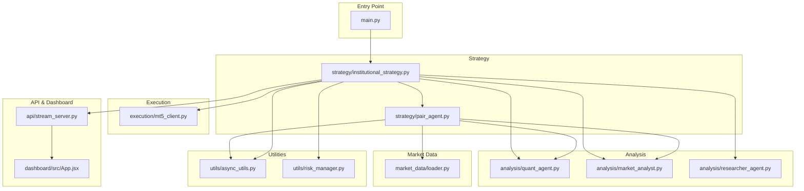

**Diagram sources**
- [main.py](file://main.py#L1-L122)
- [strategy/institutional_strategy.py](file://strategy/institutional_strategy.py#L1-L500)
- [strategy/pair_agent.py](file://strategy/pair_agent.py#L1-L432)
- [analysis/quant_agent.py](file://analysis/quant_agent.py#L1-L294)
- [analysis/market_analyst.py](file://analysis/market_analyst.py#L1-L81)
- [analysis/researcher_agent.py](file://analysis/researcher_agent.py#L1-L132)
- [execution/mt5_client.py](file://execution/mt5_client.py#L1-L385)
- [market_data/loader.py](file://market_data/loader.py#L1-L83)
- [utils/async_utils.py](file://utils/async_utils.py#L1-L45)
- [utils/risk_manager.py](file://utils/risk_manager.py#L1-L549)
- [api/stream_server.py](file://api/stream_server.py#L1-L212)
- [dashboard/src/App.jsx](file://dashboard/src/App.jsx#L1-L104)

**Section sources**
- [README.md](file://README.md#L187-L235)
- [main.py](file://main.py#L1-L122)
- [config/settings.py](file://config/settings.py#L1-L201)

## Core Components
- InstitutionalStrategy: Orchestrator managing shared resources, per-symbol PairAgents, and the end-to-end scanning and execution loop
- PairAgent: Per-symbol agent performing data fetching, quant analysis, regime checks, BOS fusion, and candidate construction
- QuantAgent: Technical analyzer combining ML models (Random Forest, XGBoost), AI predictors (Lag-Llama, LSTM), and confluence scoring
- MarketAnalyst: Macro regime detector and optional AI opinion provider
- ResearcherAgent: Async debate synthesizer combining quant and analyst outputs into a final action with confidence
- RiskManager: Centralized pre-trade checks, position sizing, trailing stops, partial closes, and correlation filtering
- MT5Client: MT5 wrapper for symbol detection, account info, order placement, position management, and lot sizing
- DataLoader: Historical data fetcher for single and multi-timeframe datasets
- Async utilities: Thread pool executor and rate limiter for non-async operations
- StreamServer: FastAPI WebSocket + REST endpoints broadcasting state to the React dashboard
- Dashboard: React components rendering account stats, scanner grid, positions, trade feed, and event log

**Section sources**
- [strategy/institutional_strategy.py](file://strategy/institutional_strategy.py#L49-L330)
- [strategy/pair_agent.py](file://strategy/pair_agent.py#L22-L295)
- [analysis/quant_agent.py](file://analysis/quant_agent.py#L34-L160)
- [analysis/market_analyst.py](file://analysis/market_analyst.py#L7-L71)
- [analysis/researcher_agent.py](file://analysis/researcher_agent.py#L5-L82)
- [utils/risk_manager.py](file://utils/risk_manager.py#L14-L396)
- [execution/mt5_client.py](file://execution/mt5_client.py#L12-L195)
- [market_data/loader.py](file://market_data/loader.py#L40-L83)
- [utils/async_utils.py](file://utils/async_utils.py#L9-L45)
- [api/stream_server.py](file://api/stream_server.py#L17-L212)
- [dashboard/src/App.jsx](file://dashboard/src/App.jsx#L12-L103)

## Architecture Overview
The system is a multi-agent asynchronous framework:
- InstitutionalStrategy initializes shared agents and PairAgents per symbol
- PairAgent performs independent scanning and candidate generation
- QuantAgent computes technical signals and confluence scores
- MarketAnalyst provides macro regime context
- ResearcherAgent performs an async debate and returns a final recommendation
- RiskManager enforces pre-trade and active-position controls
- MT5Client executes orders and manages positions
- StreamServer publishes state snapshots and live updates to the dashboard

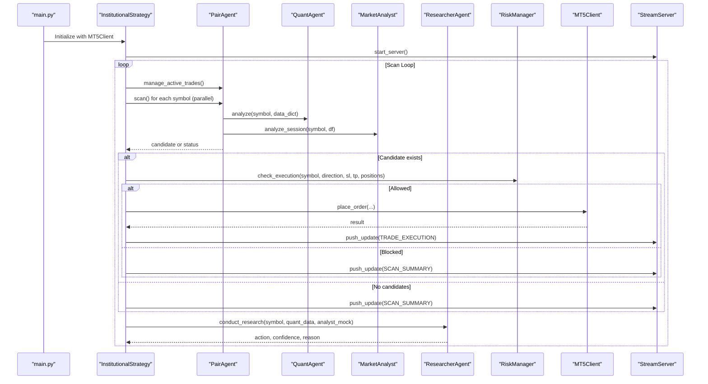

**Diagram sources**
- [main.py](file://main.py#L19-L121)
- [strategy/institutional_strategy.py](file://strategy/institutional_strategy.py#L99-L330)
- [strategy/pair_agent.py](file://strategy/pair_agent.py#L71-L295)
- [analysis/quant_agent.py](file://analysis/quant_agent.py#L109-L159)
- [analysis/market_analyst.py](file://analysis/market_analyst.py#L25-L71)
- [analysis/researcher_agent.py](file://analysis/researcher_agent.py#L17-L82)
- [utils/risk_manager.py](file://utils/risk_manager.py#L237-L295)
- [execution/mt5_client.py](file://execution/mt5_client.py#L216-L292)
- [api/stream_server.py](file://api/stream_server.py#L177-L212)

## Detailed Component Analysis

### InstitutionalStrategy
Responsibilities:
- Initialize shared agents (Quant, MarketAnalyst, RiskManager, Critic)
- Create PairAgents per symbol
- Orchestrate scanning loop with parallelism and global gating
- Execute trades after ResearcherAgent approval
- Broadcast events to the dashboard

Key extension points:
- Add new shared agents by instantiating and wiring them in __init__
- Modify gating logic in run_scan_loop for new constraints
- Introduce new post-trade reflection via CriticAgent

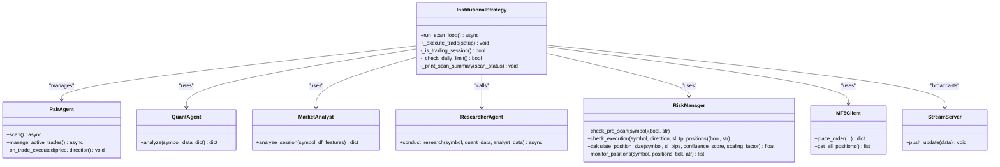

**Diagram sources**
- [strategy/institutional_strategy.py](file://strategy/institutional_strategy.py#L49-L330)
- [strategy/pair_agent.py](file://strategy/pair_agent.py#L22-L295)
- [analysis/quant_agent.py](file://analysis/quant_agent.py#L34-L159)
- [analysis/market_analyst.py](file://analysis/market_analyst.py#L7-L71)
- [analysis/researcher_agent.py](file://analysis/researcher_agent.py#L5-L82)
- [utils/risk_manager.py](file://utils/risk_manager.py#L14-L396)
- [execution/mt5_client.py](file://execution/mt5_client.py#L12-L195)
- [api/stream_server.py](file://api/stream_server.py#L177-L212)

**Section sources**
- [strategy/institutional_strategy.py](file://strategy/institutional_strategy.py#L49-L330)

### PairAgent
Responsibilities:
- Fetch multi-timeframe data asynchronously
- Compute quant signals and regime alignment
- Fuse BOS signals and retail viability checks
- Construct candidates with ATR-based SL/TP and scaling factors
- Manage active positions with trailing stops and partial closes

Extension points:
- Add new feature-based filters or thresholds
- Integrate additional AI predictors in the quant pipeline
- Extend regime exit logic based on agent state

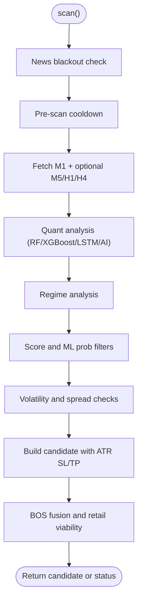

**Diagram sources**
- [strategy/pair_agent.py](file://strategy/pair_agent.py#L71-L295)

**Section sources**
- [strategy/pair_agent.py](file://strategy/pair_agent.py#L71-L295)

### QuantAgent
Responsibilities:
- Load and use ML models (Random Forest, XGBoost)
- Optionally load LSTM and Lag-Llama predictors
- Compute trend signals across M5/H1/H4
- Combine ML and AI signals into a confluence score
- Return direction, score, and details for candidate construction

Extension points:
- Add new ML/XGBoost models and wire loading in _load_models
- Integrate new AI predictors similarly
- Customize confluence scoring logic in _calculate_confluence

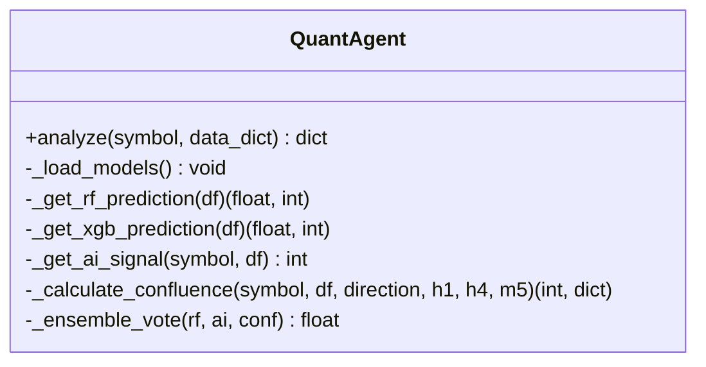

**Diagram sources**
- [analysis/quant_agent.py](file://analysis/quant_agent.py#L34-L294)

**Section sources**
- [analysis/quant_agent.py](file://analysis/quant_agent.py#L34-L294)

### MarketAnalyst
Responsibilities:
- Detect macro regimes and persist state
- Optional AI opinion provider for market sentiment
- News blackout filtering

Extension points:
- Add new regime detectors or sentiment models
- Integrate additional AI providers

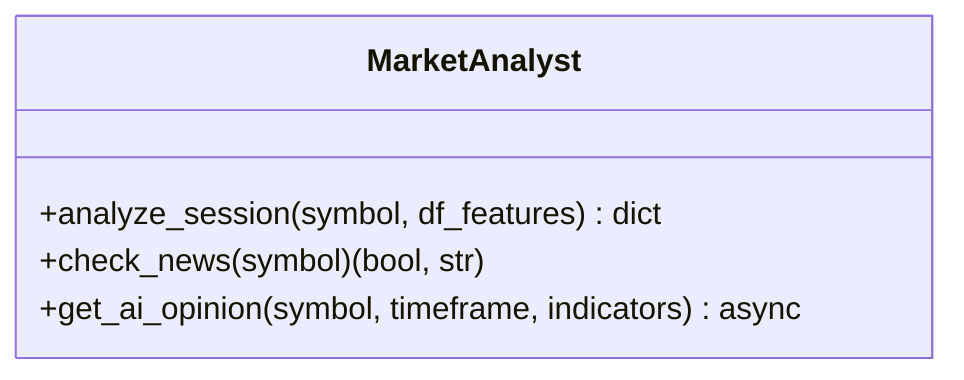

**Diagram sources**
- [analysis/market_analyst.py](file://analysis/market_analyst.py#L7-L81)

**Section sources**
- [analysis/market_analyst.py](file://analysis/market_analyst.py#L7-L81)

### ResearcherAgent
Responsibilities:
- Conduct async Bull/Bear debate using an LLM advisor
- Parse structured output and return action/confidence/reason
- Fallback to technical confidence when LLM is unavailable

Extension points:
- Swap advisor implementations
- Adjust prompt templates and parsing logic

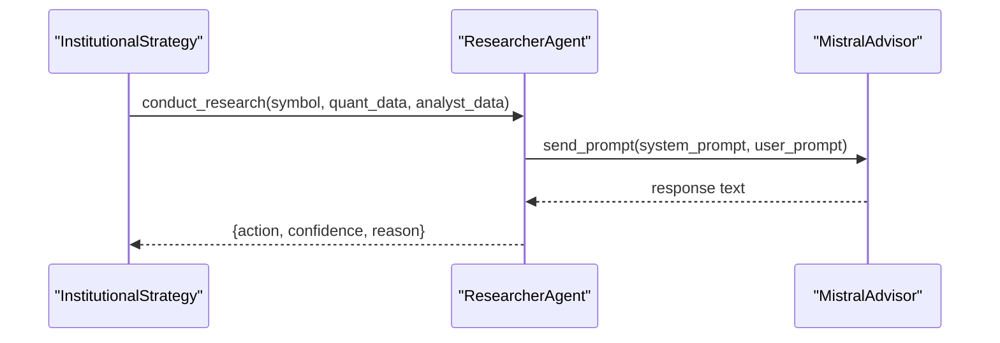

**Diagram sources**
- [analysis/researcher_agent.py](file://analysis/researcher_agent.py#L17-L82)

**Section sources**
- [analysis/researcher_agent.py](file://analysis/researcher_agent.py#L17-L82)

### RiskManager
Responsibilities:
- Pre-scan checks: daily limit, kill switch, payoff mandate, spread, news, session
- Execution checks: correlation conflicts, profitability thresholds
- Position sizing using Kelly criterion or confluence tiers
- Active position monitoring: trailing stops, break-even, partial closes

Extension points:
- Add new pre-scan gates
- Implement custom position sizing rules
- Extend correlation filtering logic

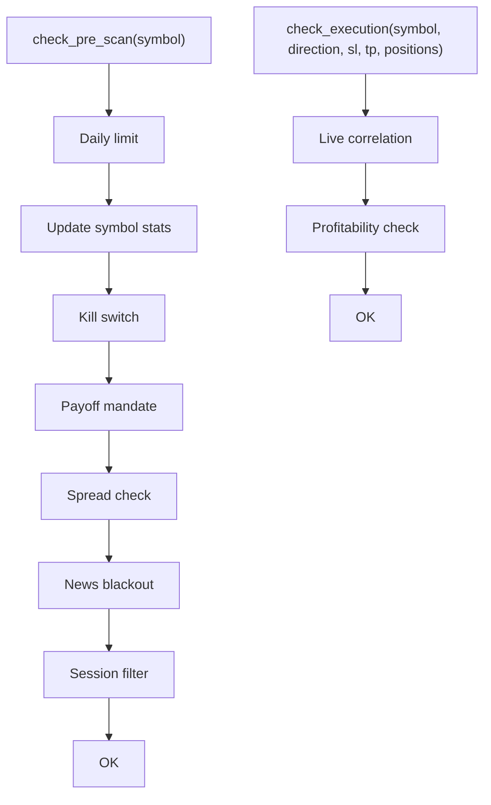

**Diagram sources**
- [utils/risk_manager.py](file://utils/risk_manager.py#L51-L295)

**Section sources**
- [utils/risk_manager.py](file://utils/risk_manager.py#L51-L295)

### MT5Client
Responsibilities:
- Initialize and log in to MT5
- Auto-detect available symbols and categorize them
- Place orders (market or pending), modify SL/TP, partial close, and full close
- Calculate lot sizes based on risk and account parameters

Extension points:
- Add new order types or validations
- Extend symbol detection logic for new brokers

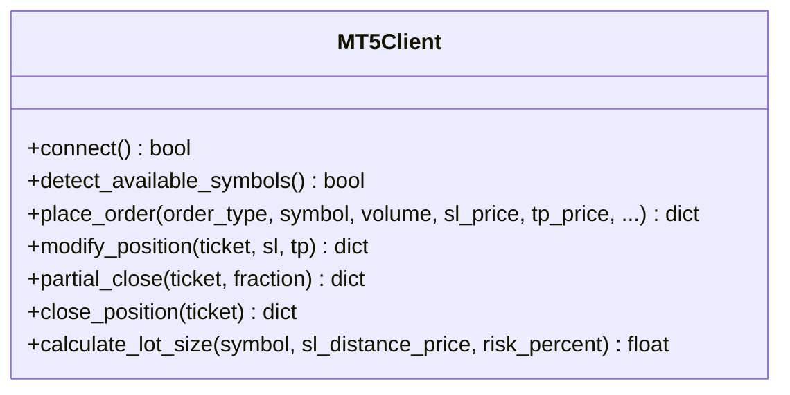

**Diagram sources**
- [execution/mt5_client.py](file://execution/mt5_client.py#L12-L385)

**Section sources**
- [execution/mt5_client.py](file://execution/mt5_client.py#L12-L385)

### Data Loading and Async Utilities
- DataLoader: Fetches OHLCV data for requested timeframes and symbols
- Async utilities: Thread pool executor and rate limiter to avoid blocking the event loop

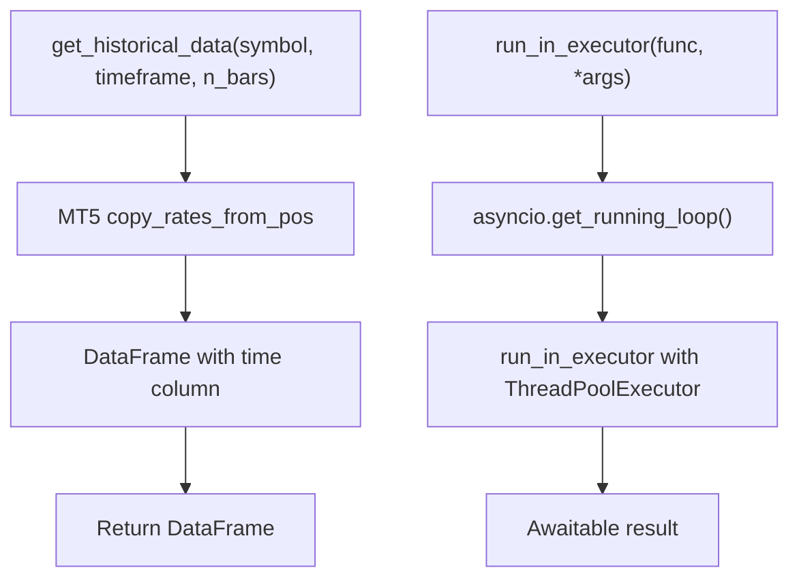

**Diagram sources**
- [market_data/loader.py](file://market_data/loader.py#L40-L83)
- [utils/async_utils.py](file://utils/async_utils.py#L9-L45)

**Section sources**
- [market_data/loader.py](file://market_data/loader.py#L40-L83)
- [utils/async_utils.py](file://utils/async_utils.py#L9-L45)

### API Server and Dashboard
- StreamServer: FastAPI app with WebSocket endpoint and REST endpoints for account, positions, trades, and scan summaries
- Dashboard: React components consuming WebSocket events and REST polling

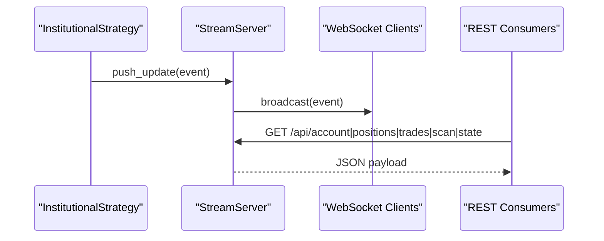

**Diagram sources**
- [api/stream_server.py](file://api/stream_server.py#L68-L212)
- [dashboard/src/App.jsx](file://dashboard/src/App.jsx#L12-L103)

**Section sources**
- [api/stream_server.py](file://api/stream_server.py#L68-L212)
- [dashboard/src/App.jsx](file://dashboard/src/App.jsx#L12-L103)

## Dependency Analysis
External dependencies are declared in requirements.txt. The system integrates:
- MetaTrader5 for market data and order routing
- Pandas/Numpy/scikit-learn for data manipulation and ML
- PyTorch/Transformers/Accelerate/Hugging Face for AI models
- FastAPI/Uvicorn for the streaming API
- aiohttp for async HTTP operations
- React/Vite for the dashboard

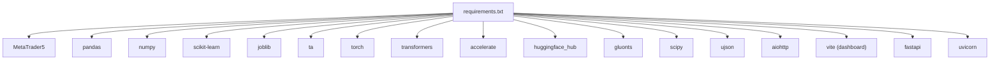

**Diagram sources**
- [requirements.txt](file://requirements.txt#L1-L17)

**Section sources**
- [requirements.txt](file://requirements.txt#L1-L17)

## Performance Considerations
- Asynchronous design: Use run_in_executor for blocking MT5 calls and heavy computations; avoid blocking the event loop
- Parallel scanning: PairAgent scans are executed concurrently; tune sleep intervals and adaptive cycles to balance throughput and latency
- Data caching: Reuse computed features and ATR values to reduce repeated calculations
- Risk checks: Perform fast pre-checks (daily limit, cooldown, spread) before heavy analysis
- Position sizing: Use Kelly criterion with confluence tiers to dynamically adjust risk exposure
- Streaming: Broadcast only essential updates; keep WebSocket message payloads minimal

[No sources needed since this section provides general guidance]

## Troubleshooting Guide
Common issues and resolutions:
- MT5 connection failures: Verify credentials, server, and terminal path; ensure symbol visibility
- No symbols detected: Confirm broker account and Exness suffixes; check trade mode and blocked quote currencies
- High spread or low liquidity: Apply spread-based SL/TP adjustments and session filters
- LLM unavailability: ResearcherAgent falls back to technical confidence; ensure API keys are configured
- WebSocket disconnects: Restart server; confirm CORS settings and client reconnection logic
- Dashboard not updating: Check REST endpoints and WebSocket broadcast; validate event types

**Section sources**
- [execution/mt5_client.py](file://execution/mt5_client.py#L18-L27)
- [execution/mt5_client.py](file://execution/mt5_client.py#L29-L101)
- [utils/risk_manager.py](file://utils/risk_manager.py#L112-L163)
- [analysis/researcher_agent.py](file://analysis/researcher_agent.py#L34-L41)
- [api/stream_server.py](file://api/stream_server.py#L153-L173)
- [dashboard/src/App.jsx](file://dashboard/src/App.jsx#L12-L103)

## Contribution Guidelines
- Code Style Standards
  - Use clear, descriptive variable and function names
  - Keep functions focused and modular; favor composition over deep nesting
  - Prefer async/await for I/O-bound operations; wrap CPU-heavy tasks with run_in_executor
  - Use type hints where helpful for readability
  - Document public APIs and complex logic with concise docstrings

- Architectural Patterns
  - Follow the multi-agent pattern: encapsulate responsibilities in dedicated classes
  - Use shared resources (RiskManager, MarketAnalyst) to centralize cross-cutting concerns
  - Maintain loose coupling via dependency injection and event broadcasting

- Extension Points
  - New agent types: subclass or compose new analyzers; register them in InstitutionalStrategy
  - Machine learning models: add loaders in QuantAgent and integrate predictions into confluence scoring
  - Risk controls: extend RiskManager with new pre-scan or execution gates
  - Market analysis agents: implement analyze_session returning standardized fields
  - Dashboard components: add new panels and subscribe to relevant event types

- Testing Requirements
  - Unit tests for individual components (agents, risk checks, utilities)
  - Integration tests for end-to-end scanning and execution loops
  - Mock MT5 operations for isolated testing
  - Async tests using pytest-asyncio or unittest.IsolatedAsyncioTestCase

- Code Review Processes
  - Peer review for all new agents, risk controls, and ML integrations
  - Performance reviews for async bottlenecks and data pipeline improvements
  - Security review for API keys and external service integrations

[No sources needed since this section provides general guidance]

## Conclusion
These guidelines establish a consistent approach to extending the Institutional SureShot Scanner. By adhering to the multi-agent architecture, asynchronous patterns, and centralized risk management, contributors can safely introduce new capabilities while maintaining system reliability, performance, and team collaboration.

[No sources needed since this section summarizes without analyzing specific files]

## Appendices

### Creating New Agent Types
Steps:
- Define the agent class with a clear responsibility (e.g., sentiment, volatility, correlation)
- Implement async scanning or analysis methods returning standardized outputs
- Register the agent in InstitutionalStrategy and inject dependencies
- Wire event broadcasting for dashboard updates
- Add tests covering normal operation, edge cases, and error scenarios

**Section sources**
- [strategy/institutional_strategy.py](file://strategy/institutional_strategy.py#L54-L86)
- [api/stream_server.py](file://api/stream_server.py#L177-L212)

### Integrating External AI Services
Steps:
- Implement an advisor interface similar to MistralAdvisor
- Add configuration keys in settings and environment variables
- Wrap external calls with async utilities and timeouts
- Parse structured outputs consistently across agents
- Provide fallback logic when services are unavailable

**Section sources**
- [analysis/researcher_agent.py](file://analysis/researcher_agent.py#L13-L41)
- [config/settings.py](file://config/settings.py#L198-L201)

### Extending Trading Strategies
Steps:
- Add new filters or signals in QuantAgent or PairAgent
- Update confluence scoring to incorporate new factors
- Ensure regime alignment and trend filters remain consistent
- Validate with walk-forward optimization and backtesting scripts

**Section sources**
- [analysis/quant_agent.py](file://analysis/quant_agent.py#L231-L294)
- [strategy/pair_agent.py](file://strategy/pair_agent.py#L165-L295)

### Development Environment Setup
- Install prerequisites: Python 3.10+, Windows, MetaTrader 5 terminal, Node.js 18+
- Clone repository and install Python dependencies
- Install dashboard dependencies and launch the React app
- Configure .env with MT5 credentials, trading parameters, and AI keys
- Train ML models and optionally run walk-forward optimization

**Section sources**
- [README.md](file://README.md#L85-L158)
- [requirements.txt](file://requirements.txt#L1-L17)

### Debugging Techniques
- Use dedicated debug scripts for scanning, async loops, AI connectivity, and execution
- Inspect logs and event streams to trace agent decisions
- Validate MT5 operations with small test trades
- Profile performance using timing around async tasks and data fetches

**Section sources**
- [README.md](file://README.md#L176-L184)

### Performance Profiling Methods
- Measure cycle durations and adaptive sleep to balance throughput
- Profile async bottlenecks using asyncio event loop timing
- Monitor MT5 call latencies and optimize data fetch windows
- Track WebSocket broadcast overhead and event payload sizes

**Section sources**
- [main.py](file://main.py#L75-L105)
- [utils/async_utils.py](file://utils/async_utils.py#L9-L45)