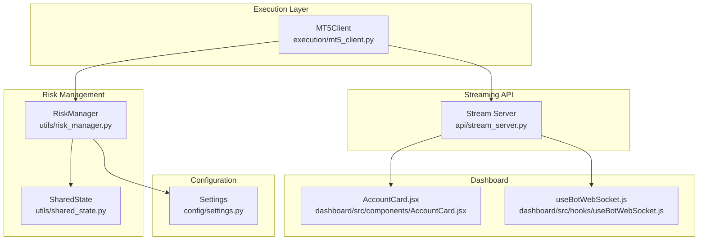
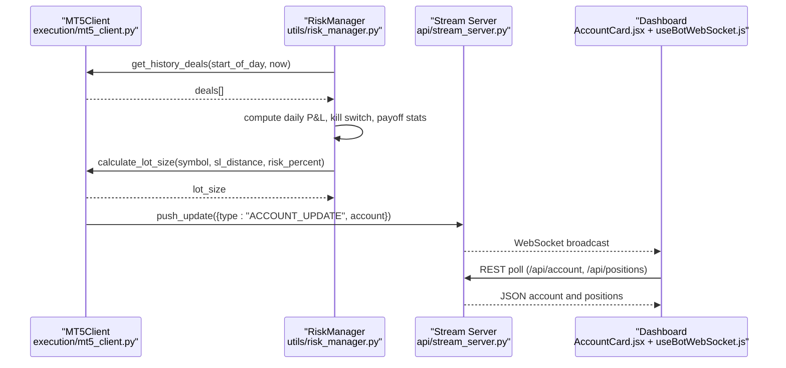
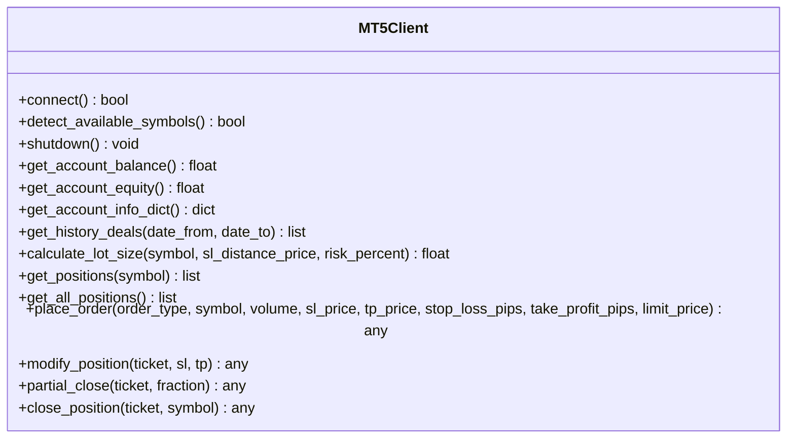
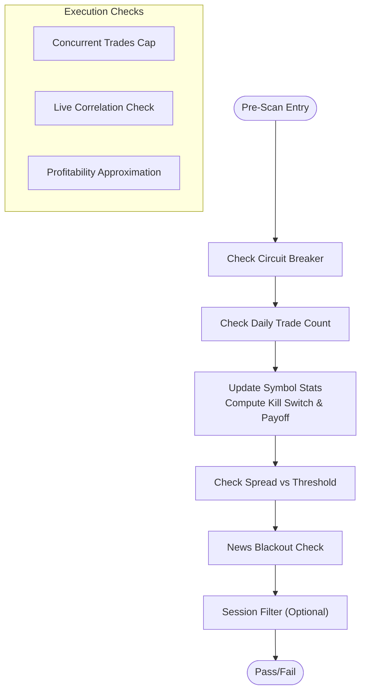
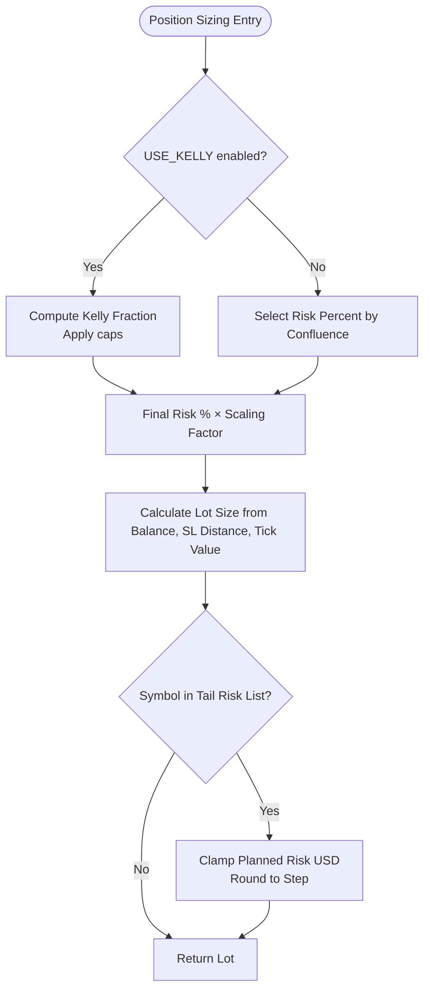
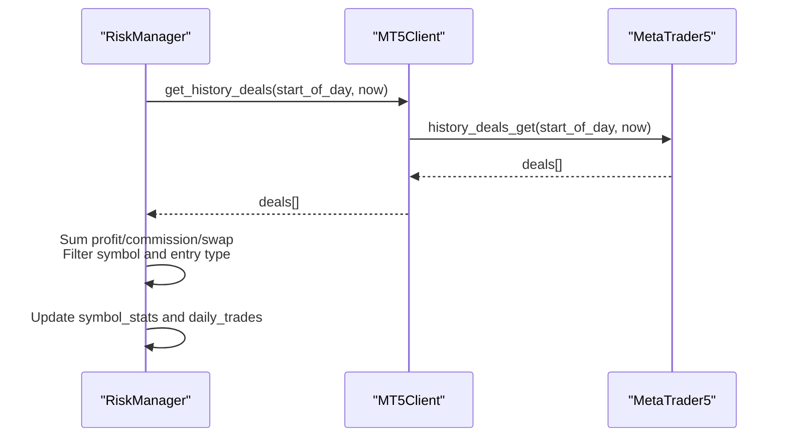
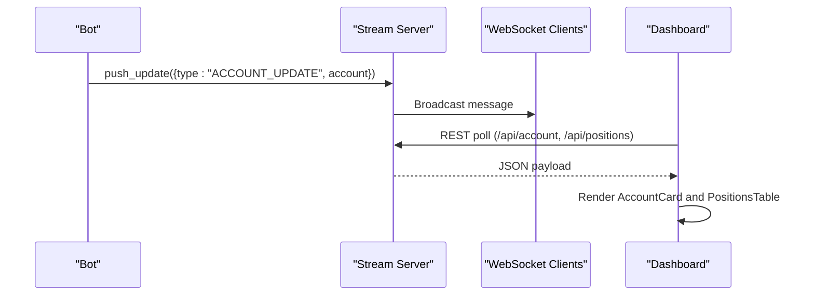
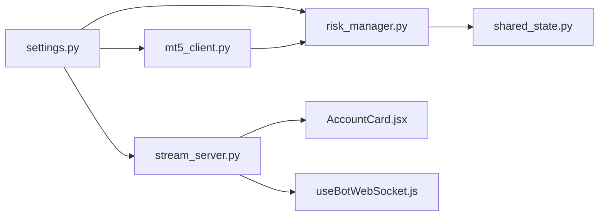

# Account Management

<cite>
**Referenced Files in This Document**
- [mt5_client.py](file://execution/mt5_client.py)
- [risk_manager.py](file://utils/risk_manager.py)
- [settings.py](file://config/settings.py)
- [stream_server.py](file://api/stream_server.py)
- [AccountCard.jsx](file://dashboard/src/components/AccountCard.jsx)
- [useBotWebSocket.js](file://dashboard/src/hooks/useBotWebSocket.js)
- [shared_state.py](file://utils/shared_state.py)
</cite>

## Table of Contents
1. [Introduction](#introduction)
2. [Project Structure](#project-structure)
3. [Core Components](#core-components)
4. [Architecture Overview](#architecture-overview)
5. [Detailed Component Analysis](#detailed-component-analysis)
6. [Dependency Analysis](#dependency-analysis)
7. [Performance Considerations](#performance-considerations)
8. [Troubleshooting Guide](#troubleshooting-guide)
9. [Conclusion](#conclusion)
10. [Appendices](#appendices)

## Introduction
This document provides comprehensive documentation for the account management subsystem, focusing on:
- Retrieval and interpretation of account information (balance, equity, margin, free margin, profit, leverage)
- Real-time monitoring and dashboard integration
- Deal history retrieval and analysis for risk controls and performance tracking
- Position sizing and risk management integration
- Security and configuration considerations

It consolidates the implementation across the MT5 client, risk manager, configuration, streaming API, and dashboard components.

## Project Structure
The account management features span several modules:
- Execution layer: MT5 client for live account queries and order management
- Risk management: Pre-trade checks, position sizing, trailing stops, and kill switches
- Configuration: Centralized risk and trading parameters
- Streaming API: REST and WebSocket endpoints for real-time account and position feeds
- Dashboard: React components and hooks for live monitoring

**Diagram sources**
- [mt5_client.py](file://execution/mt5_client.py#L108-L142)
- [risk_manager.py](file://utils/risk_manager.py#L14-L17)
- [settings.py](file://config/settings.py#L69-L148)
- [stream_server.py](file://api/stream_server.py#L86-L103)
- [AccountCard.jsx](file://dashboard/src/components/AccountCard.jsx#L1-L67)
- [useBotWebSocket.js](file://dashboard/src/hooks/useBotWebSocket.js#L1-L156)

**Section sources**
- [mt5_client.py](file://execution/mt5_client.py#L108-L142)
- [risk_manager.py](file://utils/risk_manager.py#L14-L17)
- [settings.py](file://config/settings.py#L69-L148)
- [stream_server.py](file://api/stream_server.py#L86-L103)
- [AccountCard.jsx](file://dashboard/src/components/AccountCard.jsx#L1-L67)
- [useBotWebSocket.js](file://dashboard/src/hooks/useBotWebSocket.js#L1-L156)

## Core Components
- MT5Client: Provides account information retrieval, deal history access, and position sizing calculations. It also handles order placement and position modification.
- RiskManager: Centralizes pre-trade risk checks, position sizing via Kelly criterion or confluence tiers, and position monitoring (break-even, partial close, trailing stops).
- Settings: Defines risk parameters, thresholds, and behavior toggles used by both MT5Client and RiskManager.
- Stream Server: Exposes REST endpoints and WebSocket for real-time account and position updates consumed by the dashboard.
- Dashboard Components/Hooks: Visualizes account state and maintains a live connection to the stream server.

Key account information methods:
- get_account_balance(): Retrieves current account balance
- get_account_equity(): Retrieves current account equity
- get_account_info_dict(): Returns a dictionary containing balance, equity, margin, free margin, profit, and leverage

Deal history method:
- get_history_deals(date_from, date_to): Returns historical deals within a time range

Integration with risk management:
- RiskManager uses MT5Client to query deals for daily loss limits, kill switches, payoff mandates, and symbol statistics.
- Position sizing integrates account balance and symbol tick values.

**Section sources**
- [mt5_client.py](file://execution/mt5_client.py#L108-L142)
- [risk_manager.py](file://utils/risk_manager.py#L86-L105)
- [risk_manager.py](file://utils/risk_manager.py#L341-L396)
- [settings.py](file://config/settings.py#L69-L148)

## Architecture Overview
The account management architecture connects the MT5 terminal to the risk engine and the dashboard via a streaming API.

**Diagram sources**
- [risk_manager.py](file://utils/risk_manager.py#L86-L105)
- [mt5_client.py](file://execution/mt5_client.py#L146-L195)
- [stream_server.py](file://api/stream_server.py#L177-L212)
- [useBotWebSocket.js](file://dashboard/src/hooks/useBotWebSocket.js#L87-L103)
- [AccountCard.jsx](file://dashboard/src/components/AccountCard.jsx#L1-L67)

## Detailed Component Analysis

### MT5Client Account Information Methods
MT5Client encapsulates account retrieval and position sizing:
- get_account_balance(): Returns the current account balance
- get_account_equity(): Returns the current equity
- get_account_info_dict(): Returns a structured dictionary of account metrics including margin and free margin

Position sizing:
- calculate_lot_size(symbol, sl_distance_price, risk_percent): Computes lot size based on account balance, risk percent, symbol tick value, and SL distance in price. It clamps to broker-defined min/max and step sizes.

Trade history:
- get_history_deals(date_from, date_to): Returns historical deals for the given period

**Diagram sources**
- [mt5_client.py](file://execution/mt5_client.py#L108-L195)

**Section sources**
- [mt5_client.py](file://execution/mt5_client.py#L108-L195)

### RiskManager Integration and Position Sizing
RiskManager orchestrates risk controls and position sizing:
- Pre-scan checks: Daily trade limits, kill switches, payoff mandates, spread checks, news blackout, and session filters
- Execution checks: Concurrent trade caps, correlation conflicts, profitability checks
- Position sizing: Uses Kelly Criterion when sufficient history exists; otherwise falls back to confluence tiers
- Monitoring: Break-even, partial close, and trailing stop logic

Daily loss and symbol stats:
- Queries deals via MT5Client.get_history_deals() to compute realized P&L for the day and rolling stats for kill switch and payoff mandate

**Diagram sources**
- [risk_manager.py](file://utils/risk_manager.py#L51-L163)
- [risk_manager.py](file://utils/risk_manager.py#L237-L295)

**Section sources**
- [risk_manager.py](file://utils/risk_manager.py#L51-L163)
- [risk_manager.py](file://utils/risk_manager.py#L165-L235)
- [risk_manager.py](file://utils/risk_manager.py#L237-L295)

### Position Sizing and Risk Controls
Position sizing combines account balance, risk percent, and symbol characteristics:
- Kelly Criterion: Enabled via settings; computes fraction based on win rate and reward-to-risk ratio, capped by maximum risk percent
- Confluence tiers: When Kelly is inactive, risk percent is selected based on confluence score and scaled by a factor
- Tail risk clamp: For specific symbols, planned risk USD is capped and lot size is rounded to step

**Diagram sources**
- [risk_manager.py](file://utils/risk_manager.py#L341-L396)
- [mt5_client.py](file://execution/mt5_client.py#L146-L195)
- [settings.py](file://config/settings.py#L84-L86)
- [settings.py](file://config/settings.py#L119-L121)

**Section sources**
- [risk_manager.py](file://utils/risk_manager.py#L341-L396)
- [mt5_client.py](file://execution/mt5_client.py#L146-L195)
- [settings.py](file://config/settings.py#L84-L86)
- [settings.py](file://config/settings.py#L119-L121)

### Deal History Retrieval and Analysis
RiskManager uses deal history for:
- Daily realized P&L computation to enforce daily loss limits
- Symbol statistics for kill switch and payoff mandate checks
- Filtering by symbol and entry type to focus on exit deals

**Diagram sources**
- [risk_manager.py](file://utils/risk_manager.py#L86-L105)
- [risk_manager.py](file://utils/risk_manager.py#L165-L205)
- [mt5_client.py](file://execution/mt5_client.py#L137-L142)

**Section sources**
- [risk_manager.py](file://utils/risk_manager.py#L86-L105)
- [risk_manager.py](file://utils/risk_manager.py#L165-L205)
- [mt5_client.py](file://execution/mt5_client.py#L137-L142)

### Real-Time Monitoring and Dashboard Integration
The streaming API exposes:
- REST endpoints for account and positions
- WebSocket for real-time updates

The dashboard:
- Polls REST endpoints periodically
- Subscribes to WebSocket for live updates
- Renders account metrics including balance, equity, floating P&L, and day P&L

**Diagram sources**
- [stream_server.py](file://api/stream_server.py#L177-L212)
- [useBotWebSocket.js](file://dashboard/src/hooks/useBotWebSocket.js#L87-L103)
- [AccountCard.jsx](file://dashboard/src/components/AccountCard.jsx#L1-L67)

**Section sources**
- [stream_server.py](file://api/stream_server.py#L86-L103)
- [stream_server.py](file://api/stream_server.py#L177-L212)
- [useBotWebSocket.js](file://dashboard/src/hooks/useBotWebSocket.js#L87-L103)
- [AccountCard.jsx](file://dashboard/src/components/AccountCard.jsx#L1-L67)

### Account Data Interpretation, Currency Conversion, and Leverage Handling
- Account data interpretation: The system retrieves balance, equity, profit, currency, and leverage from MT5. The dashboard computes day P&L as the difference between equity and balance.
- Currency conversion considerations: Position sizing relies on symbol tick value and tick size to convert risk amount into lot size. The system does not perform cross-currency conversions beyond the account currency reported by MT5.
- Leverage handling: Leverage is part of the account info and influences margin calculations indirectly through equity and free margin.

**Section sources**
- [mt5_client.py](file://execution/mt5_client.py#L123-L135)
- [mt5_client.py](file://execution/mt5_client.py#L146-L195)
- [stream_server.py](file://api/stream_server.py#L86-L103)
- [AccountCard.jsx](file://dashboard/src/components/AccountCard.jsx#L1-L67)

### Account State Validation and Security Considerations
- State validation: RiskManager validates account-related inputs and handles missing data gracefully (fallbacks to defaults).
- Security and privacy: The dashboard communicates with the stream server over localhost; REST polling and WebSocket connections are used. Environment variables store sensitive credentials, loaded via settings.

**Section sources**
- [mt5_client.py](file://execution/mt5_client.py#L108-L142)
- [settings.py](file://config/settings.py#L8-L11)
- [useBotWebSocket.js](file://dashboard/src/hooks/useBotWebSocket.js#L1-L156)

## Dependency Analysis
The following diagram shows key dependencies among components involved in account management:

**Diagram sources**
- [settings.py](file://config/settings.py#L69-L148)
- [risk_manager.py](file://utils/risk_manager.py#L14-L17)
- [mt5_client.py](file://execution/mt5_client.py#L108-L142)
- [shared_state.py](file://utils/shared_state.py#L23-L26)
- [stream_server.py](file://api/stream_server.py#L86-L103)
- [AccountCard.jsx](file://dashboard/src/components/AccountCard.jsx#L1-L67)
- [useBotWebSocket.js](file://dashboard/src/hooks/useBotWebSocket.js#L1-L156)

**Section sources**
- [settings.py](file://config/settings.py#L69-L148)
- [risk_manager.py](file://utils/risk_manager.py#L14-L17)
- [mt5_client.py](file://execution/mt5_client.py#L108-L142)
- [shared_state.py](file://utils/shared_state.py#L23-L26)
- [stream_server.py](file://api/stream_server.py#L86-L103)
- [AccountCard.jsx](file://dashboard/src/components/AccountCard.jsx#L1-L67)
- [useBotWebSocket.js](file://dashboard/src/hooks/useBotWebSocket.js#L1-L156)

## Performance Considerations
- Efficient deal history queries: RiskManager queries only the current day and symbol-specific windows to minimize overhead.
- Batched REST polling: The dashboard polls REST endpoints at intervals to reduce load while maintaining near-real-time updates.
- Position sizing computations: Use approximate calculations when client is unavailable to avoid blocking execution.
- Database-backed shared state: Persistent key-value storage minimizes repeated computations and supports inter-agent coordination.

[No sources needed since this section provides general guidance]

## Troubleshooting Guide
Common issues and resolutions:
- Account info retrieval failures: MT5Client returns defaults when account_info() fails; verify MT5 terminal connectivity and login credentials.
- Missing deal history: Ensure the time range covers the intended period and that MT5 history is accessible.
- Position sizing anomalies: Confirm symbol info availability, tick value, and tick size; verify risk percent settings.
- Dashboard disconnections: The WebSocket hook attempts automatic reconnection; check network and server logs.
- Shared state persistence: Ensure the database path exists and is writable.

**Section sources**
- [mt5_client.py](file://execution/mt5_client.py#L108-L142)
- [risk_manager.py](file://utils/risk_manager.py#L86-L105)
- [useBotWebSocket.js](file://dashboard/src/hooks/useBotWebSocket.js#L118-L142)
- [shared_state.py](file://utils/shared_state.py#L23-L26)

## Conclusion
The account management subsystem integrates MT5 client operations, risk controls, and real-time dashboards to provide a robust framework for trading account oversight. It emphasizes accurate account data retrieval, disciplined position sizing, and continuous monitoring through REST and WebSocket channels. Proper configuration and adherence to risk parameters ensure reliable operation across diverse market conditions.

[No sources needed since this section summarizes without analyzing specific files]

## Appendices

### Account Information Methods Reference
- get_account_balance(): Returns current account balance
- get_account_equity(): Returns current account equity
- get_account_info_dict(): Returns a dictionary with balance, equity, margin, free margin, profit, and leverage

**Section sources**
- [mt5_client.py](file://execution/mt5_client.py#L108-L135)

### Deal History Method Reference
- get_history_deals(date_from, date_to): Returns historical deals within the specified time range

**Section sources**
- [mt5_client.py](file://execution/mt5_client.py#L137-L142)

### Risk Controls and Position Sizing Parameters
- Risk percent and maximum risk percent
- Kelly Criterion activation and fraction
- Confluence tiers and minimum scores
- Tail risk symbols and maximum tail risk loss
- Kill switch lookback trades and loss threshold
- Payoff mandate threshold and override symbols

**Section sources**
- [settings.py](file://config/settings.py#L69-L148)