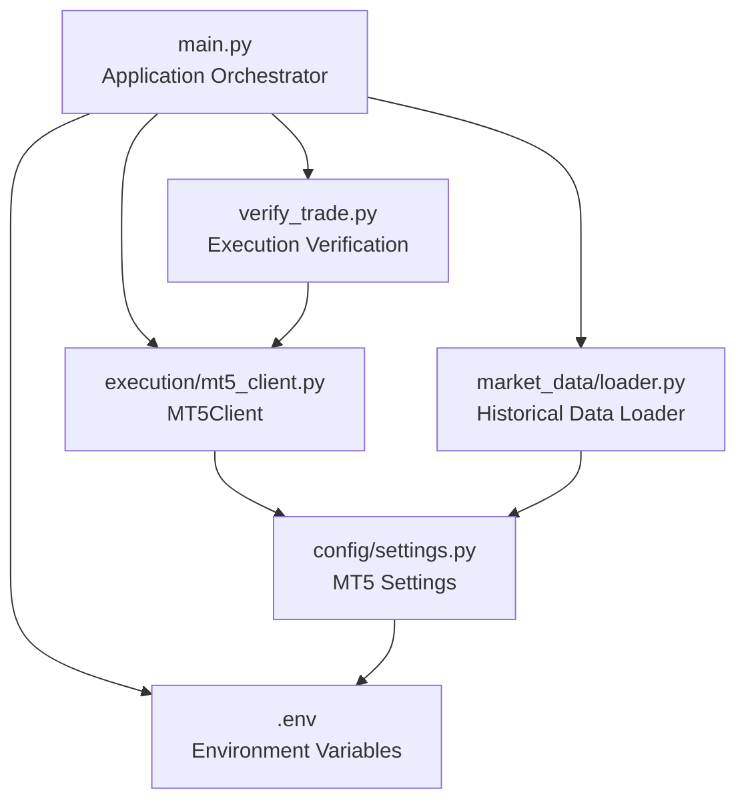
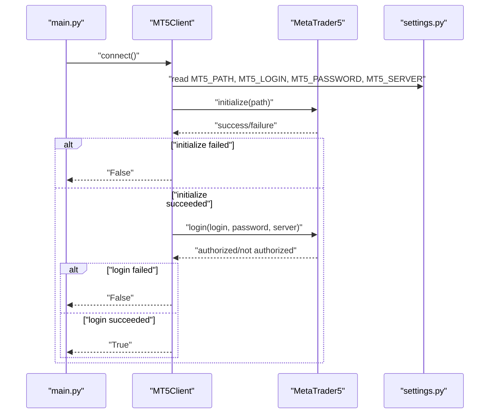
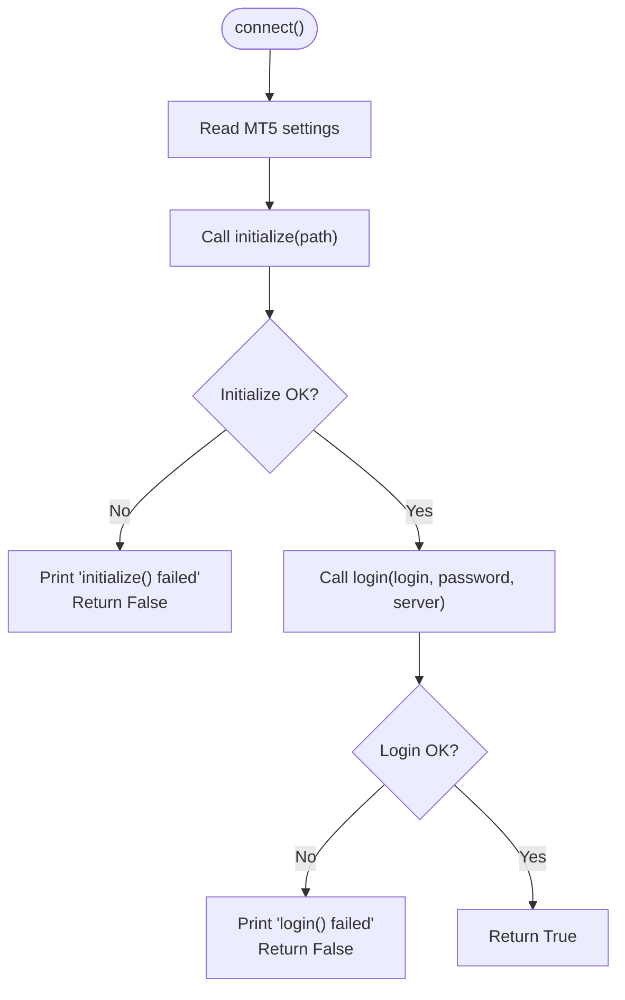
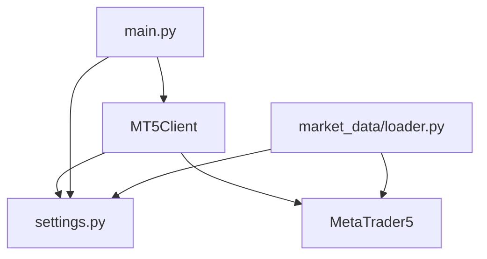

# Connection Management

<cite>
**Referenced Files in This Document**
- [mt5_client.py](file://execution/mt5_client.py)
- [settings.py](file://config/settings.py)
- [main.py](file://main.py)
- [loader.py](file://market_data/loader.py)
- [verify_trade.py](file://verify_trade.py)
- [check_positions.py](file://check_positions.py)
- [.env](file://.env)
- [requirements.txt](file://requirements.txt)
</cite>

## Table of Contents
1. [Introduction](#introduction)
2. [Project Structure](#project-structure)
3. [Core Components](#core-components)
4. [Architecture Overview](#architecture-overview)
5. [Detailed Component Analysis](#detailed-component-analysis)
6. [Dependency Analysis](#dependency-analysis)
7. [Performance Considerations](#performance-considerations)
8. [Troubleshooting Guide](#troubleshooting-guide)
9. [Conclusion](#conclusion)

## Introduction
This document explains how the system connects to the MetaTrader 5 terminal, authenticates, and manages the session lifecycle. It focuses on the MT5Client.connect() method, path configuration, login credentials, error handling, and operational best practices. It also covers how connection state relates to trading operations, monitoring, and reconnection strategies, along with security considerations for credential management.

## Project Structure
The connection management spans several modules:
- MT5 client wrapper that initializes the terminal, logs in, and exposes trading helpers
- Centralized settings that define MT5 credentials, server, and path
- Application entry point that orchestrates connection, detection, and runtime loop
- Market data loader that demonstrates a reusable connection pattern
- Verification utilities that validate connection and execution

**Diagram sources**
- [main.py](file://main.py#L19-L55)
- [mt5_client.py](file://execution/mt5_client.py#L12-L27)
- [settings.py](file://config/settings.py#L7-L11)
- [loader.py](file://market_data/loader.py#L24-L37)
- [verify_trade.py](file://verify_trade.py#L12-L19)
- [.env](file://.env#L1-L5)

**Section sources**
- [main.py](file://main.py#L19-L55)
- [mt5_client.py](file://execution/mt5_client.py#L12-L27)
- [settings.py](file://config/settings.py#L7-L11)
- [loader.py](file://market_data/loader.py#L24-L37)
- [verify_trade.py](file://verify_trade.py#L12-L19)
- [.env](file://.env#L1-L5)

## Core Components
- MT5Client: Provides connection, symbol detection, account info, and order placement helpers
- Settings: Centralizes MT5 credentials, server, and path
- Application entry point: Initializes client, detects symbols, prints account info, and runs the scanning loop
- Market data loader: Demonstrates a robust connection pattern with terminal health checks
- Verification utilities: Validate connection and order placement

Key responsibilities:
- Initialization: initialize terminal with configured path
- Authentication: login with configured credentials and server
- Session validation: confirm account info and symbol availability
- Error handling: return explicit failure signals and print diagnostics
- Lifecycle: provide shutdown to cleanly terminate the session

**Section sources**
- [mt5_client.py](file://execution/mt5_client.py#L12-L27)
- [settings.py](file://config/settings.py#L7-L11)
- [main.py](file://main.py#L19-L55)
- [loader.py](file://market_data/loader.py#L24-L37)
- [verify_trade.py](file://verify_trade.py#L12-L19)

## Architecture Overview
The connection flow is straightforward: the application creates an MT5Client, calls connect(), validates account info, auto-detects symbols, and proceeds with trading operations. Market data loader shows an alternative pattern that checks terminal health before fetching data.

**Diagram sources**
- [main.py](file://main.py#L25-L30)
- [mt5_client.py](file://execution/mt5_client.py#L18-L27)
- [settings.py](file://config/settings.py#L7-L11)

## Detailed Component Analysis

### MT5Client.connect() Implementation
- Reads MT5_PATH, MT5_LOGIN, MT5_PASSWORD, MT5_SERVER from settings
- Calls initialize(path) and login(login, password, server)
- Returns True on success, False on any failure
- Prints diagnostic messages for failures

**Diagram sources**
- [mt5_client.py](file://execution/mt5_client.py#L18-L27)
- [settings.py](file://config/settings.py#L7-L11)

**Section sources**
- [mt5_client.py](file://execution/mt5_client.py#L18-L27)
- [settings.py](file://config/settings.py#L7-L11)

### Path Configuration and Terminal Requirements
- MT5_PATH points to the terminal executable
- On Windows, the default path targets the 64-bit terminal
- The terminal must be installed and accessible for initialize() to succeed

Best practices:
- Verify the path exists and is readable
- Ensure the terminal is not blocked by antivirus or permissions
- Confirm the terminal is not already locked by another process

**Section sources**
- [settings.py](file://config/settings.py#L11)
- [.env](file://.env#L5)

### Authentication and Credentials
- MT5_LOGIN, MT5_PASSWORD, MT5_SERVER are loaded from environment variables
- Credentials are validated during login()
- If login fails, the client reports failure and exits connection

Security considerations:
- Store credentials in .env and protect the file
- Avoid logging sensitive values
- Restrict file permissions on .env
- Consider rotating credentials periodically

**Section sources**
- [settings.py](file://config/settings.py#L8-L11)
- [.env](file://.env#L2-L4)

### Session Validation and Account Info
- After successful login, the application retrieves account info and prints balance/equity/leverage
- The MT5Client exposes helpers to fetch account info and history deals

Operational impact:
- Account info drives risk calculations and position sizing
- History deals support daily loss tracking and stats updates

**Section sources**
- [main.py](file://main.py#L37-L41)
- [mt5_client.py](file://execution/mt5_client.py#L108-L142)

### Connection Establishment Procedures
- Application entry point calls MT5Client.connect() and aborts on failure
- Market data loader demonstrates a pattern: initialize, login, and check terminal_info() before data requests
- Both approaches rely on settings.MT5_PATH and credentials

**Section sources**
- [main.py](file://main.py#L25-L30)
- [loader.py](file://market_data/loader.py#L24-L47)

### Error Handling and Diagnostics
- MT5Client.connect() prints explicit failure messages for initialize() and login()
- Market data loader uses mt5.last_error() to report detailed error codes
- Verification utilities show how to check account info and place orders

Common failure points:
- initialize() failure due to invalid path or missing terminal
- login() failure due to wrong credentials or server mismatch
- No terminal info indicating disconnection or stale session

**Section sources**
- [mt5_client.py](file://execution/mt5_client.py#L18-L27)
- [loader.py](file://market_data/loader.py#L26-L36)
- [verify_trade.py](file://verify_trade.py#L21-L25)

### Relationship Between Connection State and Trading Operations
- Trading operations depend on a valid session (initialized and logged in)
- Risk manager and position monitoring require live tick data and account info
- Market data loader ensures terminal health before requesting historical data

**Section sources**
- [risk_manager.py](file://utils/risk_manager.py#L14-L40)
- [loader.py](file://market_data/loader.py#L44-L47)

### Connection Monitoring and Automatic Reconnection Strategies
- The system does not implement automatic reconnection loops in the analyzed files
- Market data loader checks terminal_info() and reinitializes if needed
- The application shuts down the MT5 session on exit

Recommendations:
- Periodically check terminal_info() in long-running loops
- Implement retry with exponential backoff on login failures
- Gracefully degrade operations when disconnected (pause scans, avoid placing orders)
- Persist state to recover from interruptions

**Section sources**
- [loader.py](file://market_data/loader.py#L44-L47)
- [main.py](file://main.py#L112-L114)

### Security Considerations for Credential Management
- Credentials are stored in .env and loaded via python-dotenv
- Ensure .env is excluded from version control
- Restrict file permissions and avoid embedding secrets in logs
- Use separate environments for development and production

**Section sources**
- [.env](file://.env#L2-L4)
- [requirements.txt](file://requirements.txt#L1)

## Dependency Analysis
The MT5 client depends on settings for configuration and uses MetaTrader5 for terminal operations. The application orchestrator composes the client and settings, while market data loader follows a similar pattern.

**Diagram sources**
- [mt5_client.py](file://execution/mt5_client.py#L1-L9)
- [settings.py](file://config/settings.py#L1-L5)
- [main.py](file://main.py#L12-L16)
- [loader.py](file://market_data/loader.py#L1-L10)

**Section sources**
- [mt5_client.py](file://execution/mt5_client.py#L1-L9)
- [settings.py](file://config/settings.py#L1-L5)
- [main.py](file://main.py#L12-L16)
- [loader.py](file://market_data/loader.py#L1-L10)

## Performance Considerations
- Keep MT5 terminal local to reduce latency
- Avoid frequent reinitialization; reuse a stable session
- Batch operations where possible to minimize repeated login attempts
- Monitor terminal_info() to prevent unnecessary retries

## Troubleshooting Guide

### Path Configuration Errors
Symptoms:
- initialize() fails with “initialize() failed”
- Error code reported by mt5.last_error()

Resolution steps:
- Verify MT5_PATH points to the correct terminal executable
- Ensure the terminal is installed and accessible
- Check for typos or missing drive letters on Windows

**Section sources**
- [mt5_client.py](file://execution/mt5_client.py#L18-L21)
- [loader.py](file://market_data/loader.py#L26-L28)
- [settings.py](file://config/settings.py#L11)
- [.env](file://.env#L5)

### Login Failures
Symptoms:
- login() fails with “login() failed” or error code
- mt5.last_error() indicates authentication issues

Resolution steps:
- Confirm MT5_LOGIN, MT5_PASSWORD, and MT5_SERVER match the target account
- Ensure the account is active and not restricted
- Check server name and port if applicable

**Section sources**
- [mt5_client.py](file://execution/mt5_client.py#L23-L25)
- [loader.py](file://market_data/loader.py#L30-L36)
- [settings.py](file://config/settings.py#L8-L11)
- [.env](file://.env#L2-L4)

### Network Connectivity Problems
Symptoms:
- No terminal info after login
- Market data requests fail intermittently

Resolution steps:
- Confirm the terminal is reachable and not firewalled
- Retry initialization after a short delay
- Validate that the terminal is not locked by another process

**Section sources**
- [loader.py](file://market_data/loader.py#L44-L47)

### Connection Stability and Reconnection
Current behavior:
- No automatic reconnection loop is implemented in the analyzed files
- Market data loader conditionally reinitializes if terminal_info() fails

Recommended enhancements:
- Implement periodic checks of terminal_info()
- Add retry loops with backoff for login failures
- Gracefully pause trading operations when disconnected

**Section sources**
- [loader.py](file://market_data/loader.py#L44-L47)
- [main.py](file://main.py#L112-L114)

### Credential Security
- Store credentials in .env and restrict access
- Avoid printing sensitive values
- Rotate credentials regularly

**Section sources**
- [.env](file://.env#L2-L4)
- [requirements.txt](file://requirements.txt#L1)

## Conclusion
The connection management relies on a clean separation of concerns: MT5Client handles initialization and authentication, settings centralizes configuration, and the application orchestrator coordinates lifecycle events. While the current implementation provides robust diagnostics and basic session validation, extending it with automatic reconnection, periodic health checks, and enhanced error handling would improve resilience and operational safety.