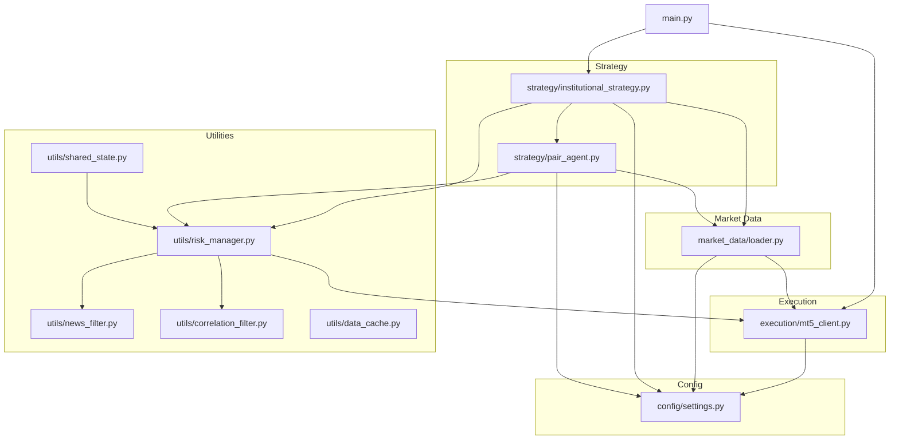
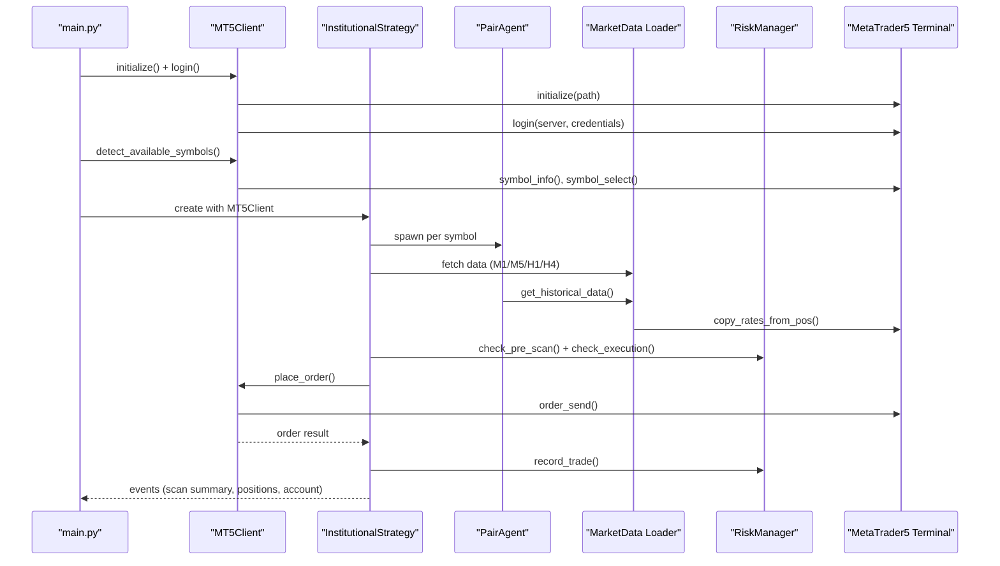
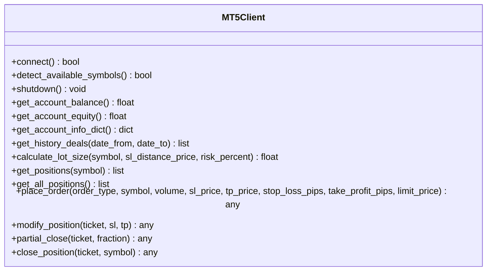
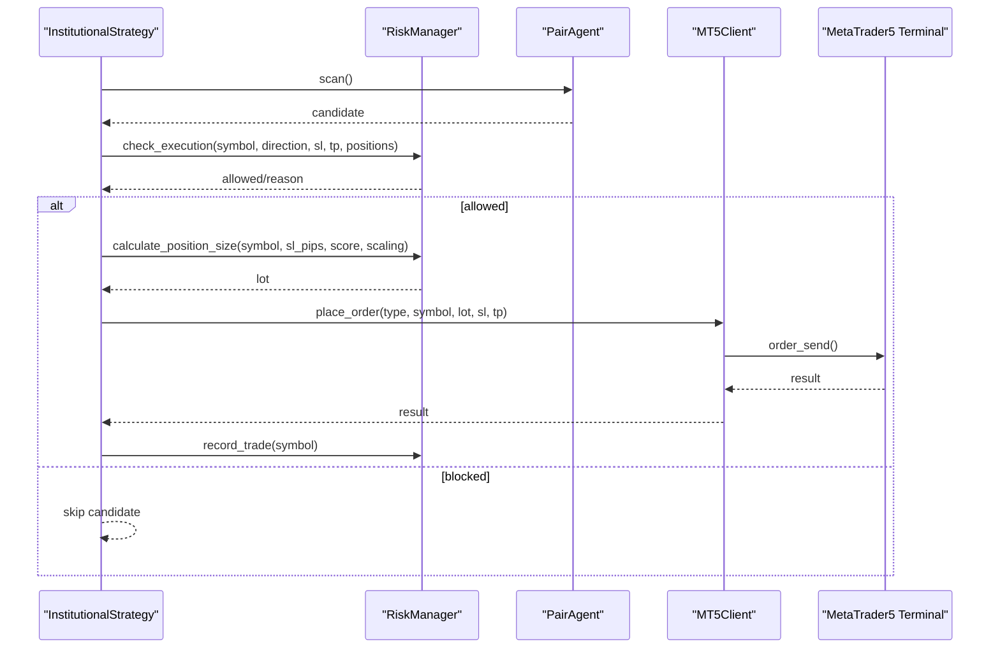
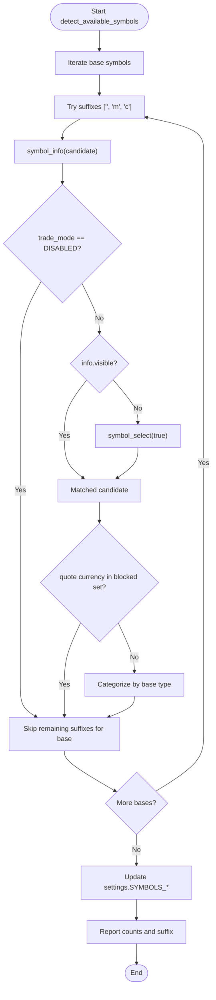
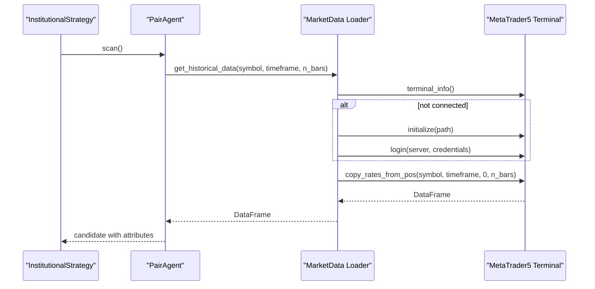
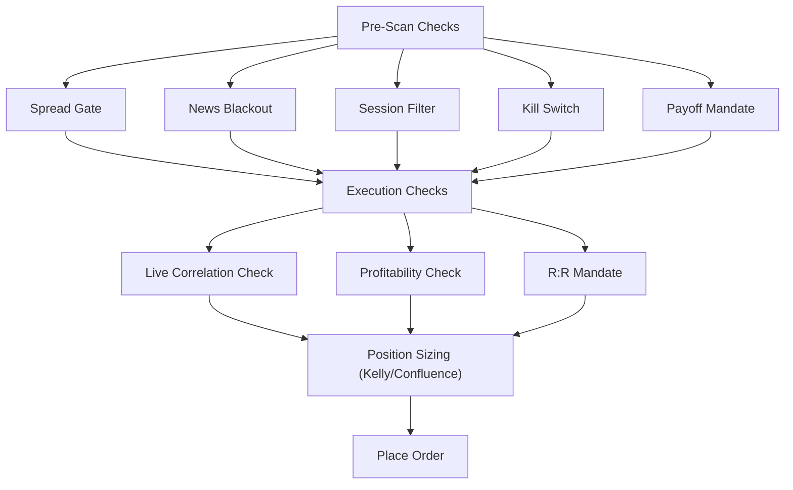
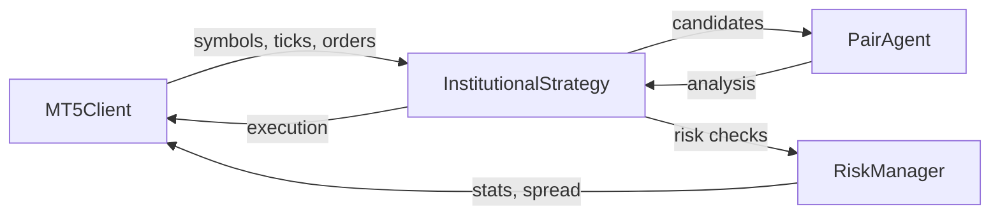
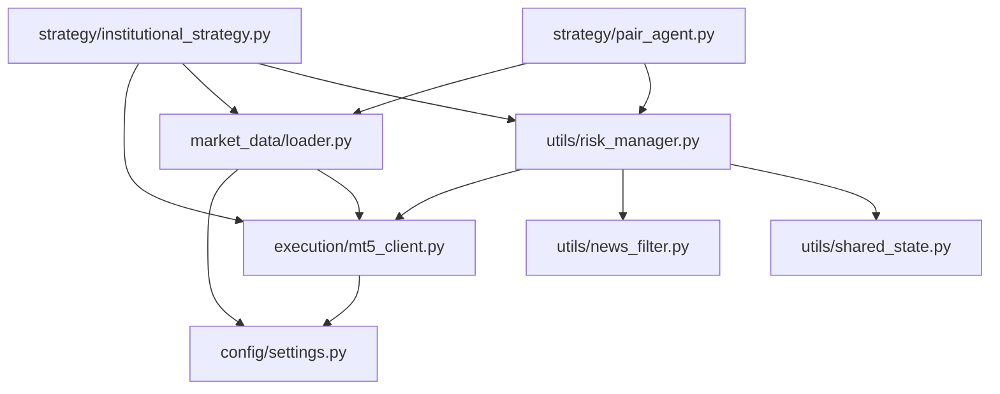

# MT5 Integration

<cite>
**Referenced Files in This Document**
- [execution/mt5_client.py](file://execution/mt5_client.py)
- [market_data/loader.py](file://market_data/loader.py)
- [strategy/institutional_strategy.py](file://strategy/institutional_strategy.py)
- [strategy/pair_agent.py](file://strategy/pair_agent.py)
- [utils/risk_manager.py](file://utils/risk_manager.py)
- [utils/news_filter.py](file://utils/news_filter.py)
- [utils/shared_state.py](file://utils/shared_state.py)
- [config/settings.py](file://config/settings.py)
- [main.py](file://main.py)
- [README.md](file://README.md)
</cite>

## Table of Contents
1. [Introduction](#introduction)
2. [Project Structure](#project-structure)
3. [Core Components](#core-components)
4. [Architecture Overview](#architecture-overview)
5. [Detailed Component Analysis](#detailed-component-analysis)
6. [Dependency Analysis](#dependency-analysis)
7. [Performance Considerations](#performance-considerations)
8. [Troubleshooting Guide](#troubleshooting-guide)
9. [Conclusion](#conclusion)
10. [Appendices](#appendices)

## Introduction
This document explains the MT5 integration used by the institutional trading system. It covers terminal connection management, order execution logic, and symbol detection mechanisms. It documents the MT5 client implementation (connection establishment, authentication, session management), order placement procedures, position management, and account information handling. It details the symbol detection system for auto-discovering available pairs, filtering trade-disabled symbols, and adapting to broker-specific configurations. It also includes technical implementation details for MT5 API integration, error handling for connection issues, and performance optimization for high-frequency trading. Finally, it describes the relationship between MT5 operations and internal trading logic, position synchronization, and real-time market data integration, along with MT5 terminal requirements, connection troubleshooting, and operational considerations.

## Project Structure
The MT5 integration spans several modules:
- Execution layer: MT5 client wrapper for connection, authentication, symbol detection, order placement, position management, and account info.
- Market data layer: Historical data loader and multi-timeframe data fetcher.
- Strategy layer: Institutional orchestrator and per-symbol agents that drive scanning and execution.
- Utilities: Risk manager, news blackout filter, shared state persistence, correlation filter, and data cache.
- Configuration: Centralized settings for MT5 credentials, trading parameters, and risk controls.

**Diagram sources**
- [execution/mt5_client.py](file://execution/mt5_client.py#L1-L385)
- [market_data/loader.py](file://market_data/loader.py#L1-L83)
- [strategy/institutional_strategy.py](file://strategy/institutional_strategy.py#L1-L500)
- [strategy/pair_agent.py](file://strategy/pair_agent.py#L1-L432)
- [utils/risk_manager.py](file://utils/risk_manager.py#L1-L549)
- [utils/news_filter.py](file://utils/news_filter.py#L1-L239)
- [utils/shared_state.py](file://utils/shared_state.py#L1-L110)
- [config/settings.py](file://config/settings.py#L1-L201)
- [main.py](file://main.py#L1-L122)

**Section sources**
- [README.md](file://README.md#L187-L235)
- [main.py](file://main.py#L1-L122)

## Core Components
- MT5Client: Provides connection management, authentication, symbol detection, account info retrieval, dynamic position sizing, order placement, position modification, partial close, and full close.
- MarketData Loader: Initializes MT5 connection, fetches historical OHLCV data across multiple timeframes, and supports multi-timeframe bundles.
- InstitutionalStrategy: Orchestrates scanning across all symbols, manages position monitoring, executes trades, and emits events to the dashboard and Telegram.
- PairAgent: Per-symbol agent that performs data fetching, analysis, candidate construction, and active trade management.
- RiskManager: Centralizes pre-scan risk checks, execution gating, position sizing (including Kelly criterion), and active position monitoring (trailing stops, partial closes, breakeven).
- Utilities: News blackout filter, shared state persistence, correlation filter, and data cache.

**Section sources**
- [execution/mt5_client.py](file://execution/mt5_client.py#L12-L385)
- [market_data/loader.py](file://market_data/loader.py#L24-L83)
- [strategy/institutional_strategy.py](file://strategy/institutional_strategy.py#L49-L500)
- [strategy/pair_agent.py](file://strategy/pair_agent.py#L22-L432)
- [utils/risk_manager.py](file://utils/risk_manager.py#L14-L549)
- [utils/news_filter.py](file://utils/news_filter.py#L1-L239)
- [utils/shared_state.py](file://utils/shared_state.py#L23-L110)

## Architecture Overview
The system initializes MT5, auto-detects available symbols, and builds a per-symbol agent network. The InstitutionalStrategy coordinates scanning and execution, while RiskManager enforces global and per-symbol risk controls. MarketData Loader supplies OHLCV data, optionally cached. Real-time events are broadcast to the dashboard and Telegram.

**Diagram sources**
- [main.py](file://main.py#L19-L115)
- [execution/mt5_client.py](file://execution/mt5_client.py#L18-L292)
- [strategy/institutional_strategy.py](file://strategy/institutional_strategy.py#L99-L436)
- [market_data/loader.py](file://market_data/loader.py#L40-L82)
- [utils/risk_manager.py](file://utils/risk_manager.py#L51-L295)

## Detailed Component Analysis

### MT5 Client Implementation
The MT5Client encapsulates all MT5 interactions:
- Connection and Authentication: Initializes the terminal and logs in using configured credentials and server.
- Session Management: Provides a shutdown routine to cleanly terminate the session.
- Symbol Detection: Iterates base symbols and tries broker-specific suffixes to discover available instruments, filters disabled and non-USD-denominated exotic quotes, and categorizes discovered symbols.
- Account Information: Retrieves balance, equity, margin, free margin, profit, and leverage.
- Dynamic Position Sizing: Computes lot size based on account risk percent, stop-loss distance in price, and symbol tick value and step size.
- Orders: Places market or pending orders with ATR-based or pip-based SL/TP, respects deviation and magic number.
- Positions: Retrieves positions by symbol or all, modifies SL/TP, partially closes, and fully closes positions.

**Diagram sources**
- [execution/mt5_client.py](file://execution/mt5_client.py#L12-L385)

**Section sources**
- [execution/mt5_client.py](file://execution/mt5_client.py#L18-L385)
- [config/settings.py](file://config/settings.py#L7-L11)
- [config/settings.py](file://config/settings.py#L47-L61)

### Order Execution Logic
The execution pipeline integrates MT5Client, InstitutionalStrategy, and RiskManager:
- Pre-Scan Checks: Daily limit, cooldown, spread, news blackout, session filter, and symbol viability.
- Candidate Construction: PairAgent builds candidates with ATR-based SL/TP and volatility filters.
- Execution Checks: InstitutionalStrategy validates R:R, correlation conflicts, and profitability thresholds.
- Position Sizing: RiskManager computes lot size using Kelly criterion or confluence tiers.
- Order Placement: MT5Client sends orders with IOC filling and GTC time-in-force.
- Post-Execution: Telegram alerts, journal logging, and daily trade count updates.

**Diagram sources**
- [strategy/institutional_strategy.py](file://strategy/institutional_strategy.py#L331-L436)
- [utils/risk_manager.py](file://utils/risk_manager.py#L237-L295)
- [execution/mt5_client.py](file://execution/mt5_client.py#L216-L292)

**Section sources**
- [strategy/institutional_strategy.py](file://strategy/institutional_strategy.py#L331-L436)
- [utils/risk_manager.py](file://utils/risk_manager.py#L341-L396)
- [execution/mt5_client.py](file://execution/mt5_client.py#L216-L292)

### Symbol Detection Mechanism
The symbol detection system auto-discovers available instruments on the broker account:
- Iterates base symbols across major, minor, crypto, and commodity categories.
- Attempts suffixes (standard, cent, raw) to match account-specific naming.
- Validates trade mode and visibility; enables symbols in MarketWatch if hidden.
- Filters out disabled and non-USD-denominated exotic quotes.
- Populates categorized lists and reports discovered instruments.

**Diagram sources**
- [execution/mt5_client.py](file://execution/mt5_client.py#L29-L101)
- [config/settings.py](file://config/settings.py#L17-L61)

**Section sources**
- [execution/mt5_client.py](file://execution/mt5_client.py#L29-L101)
- [config/settings.py](file://config/settings.py#L46-L61)

### Market Data Integration
Historical data loading supports multi-timeframe analysis:
- Initializes MT5 connection if needed and logs in.
- Maps timeframe strings to MT5 constants.
- Fetches OHLCV data for a single symbol/timeframe.
- Bundles M15, H1, and H4 data in one call for multi-timeframe analysis.

**Diagram sources**
- [market_data/loader.py](file://market_data/loader.py#L24-L82)
- [strategy/pair_agent.py](file://strategy/pair_agent.py#L107-L144)

**Section sources**
- [market_data/loader.py](file://market_data/loader.py#L24-L82)
- [strategy/pair_agent.py](file://strategy/pair_agent.py#L107-L144)

### Risk Management and Position Monitoring
RiskManager centralizes risk controls:
- Pre-scan checks: Daily limit, cooldown, spread gates, news blackout, session filter, kill switch, payoff mandate.
- Execution checks: Correlation conflicts, profitability thresholds, and R:R mandates.
- Position sizing: Kelly criterion with confluence tiers and tail-risk clamping.
- Active monitoring: Trailing stops (ATR-based or fixed%), partial closes, and breakeven moves.

**Diagram sources**
- [utils/risk_manager.py](file://utils/risk_manager.py#L51-L295)
- [utils/news_filter.py](file://utils/news_filter.py#L159-L205)

**Section sources**
- [utils/risk_manager.py](file://utils/risk_manager.py#L51-L295)
- [utils/news_filter.py](file://utils/news_filter.py#L159-L205)

### Relationship Between MT5 Operations and Internal Trading Logic
- InstitutionalStrategy orchestrates scanning and execution, invoking PairAgent for each symbol and RiskManager for risk checks.
- MT5Client provides the authoritative source for symbols, account info, and order execution.
- RiskManager uses MT5 data for spread checks, symbol info, and history deals to compute stats and enforce controls.
- PairAgent uses MT5 ticks and symbol info for spread-adjusted SL/TP and volatility-aware entry logic.

**Diagram sources**
- [strategy/institutional_strategy.py](file://strategy/institutional_strategy.py#L99-L436)
- [strategy/pair_agent.py](file://strategy/pair_agent.py#L71-L376)
- [utils/risk_manager.py](file://utils/risk_manager.py#L51-L549)
- [execution/mt5_client.py](file://execution/mt5_client.py#L18-L385)

**Section sources**
- [strategy/institutional_strategy.py](file://strategy/institutional_strategy.py#L99-L436)
- [strategy/pair_agent.py](file://strategy/pair_agent.py#L71-L376)
- [utils/risk_manager.py](file://utils/risk_manager.py#L51-L549)
- [execution/mt5_client.py](file://execution/mt5_client.py#L18-L385)

## Dependency Analysis
Key dependencies and relationships:
- MT5Client depends on MetaTrader5 and settings for credentials and defaults.
- MarketData Loader depends on MT5 and settings for timeframe mapping and initialization.
- InstitutionalStrategy depends on MT5Client, MarketData Loader, and RiskManager.
- PairAgent depends on MarketData Loader, RiskManager, and settings for thresholds.
- RiskManager depends on MT5Client for account info and history deals, and on utilities for filters and shared state.

**Diagram sources**
- [execution/mt5_client.py](file://execution/mt5_client.py#L1-L27)
- [market_data/loader.py](file://market_data/loader.py#L1-L37)
- [strategy/institutional_strategy.py](file://strategy/institutional_strategy.py#L23-L35)
- [strategy/pair_agent.py](file://strategy/pair_agent.py#L1-L16)
- [utils/risk_manager.py](file://utils/risk_manager.py#L1-L12)
- [utils/news_filter.py](file://utils/news_filter.py#L1-L16)
- [utils/shared_state.py](file://utils/shared_state.py#L1-L21)

**Section sources**
- [execution/mt5_client.py](file://execution/mt5_client.py#L1-L27)
- [market_data/loader.py](file://market_data/loader.py#L1-L37)
- [strategy/institutional_strategy.py](file://strategy/institutional_strategy.py#L23-L35)
- [strategy/pair_agent.py](file://strategy/pair_agent.py#L1-L16)
- [utils/risk_manager.py](file://utils/risk_manager.py#L1-L12)
- [utils/news_filter.py](file://utils/news_filter.py#L1-L16)
- [utils/shared_state.py](file://utils/shared_state.py#L1-L21)

## Performance Considerations
- Multi-timeframe data fetching: The loader bundles M15, H1, and H4 data in one call to reduce MT5 API overhead.
- Data caching: TTL-based cache reduces repeated API calls across scans.
- Asynchronous scanning: PairAgents run concurrently to maximize throughput.
- Spread and session gates: Early exits prevent wasted computation on illiquid or high-risk periods.
- Position sizing: Dynamic sizing based on account risk percent and symbol characteristics prevents overexposure.

[No sources needed since this section provides general guidance]

## Troubleshooting Guide
Common connection and execution issues:
- Initialization failure: The loader prints the last MT5 error code when initialization fails.
- Login failure: The loader attempts login and prints the last error code on failure.
- No rates returned: The loader prints a warning and returns None when no rates are available for a symbol.
- Order failures: The client prints the MT5 comment and retcode when order sending fails.
- No symbols detected: The client reports zero instruments and suggests checking the Exness account configuration.
- Spread too high: RiskManager blocks trades when spread exceeds configured thresholds per asset class.
- News blackout: RiskManager blocks trades during high-impact event windows.
- Kill switch and payoff mandate: RiskManager disables symbols based on recent performance and payoff ratios.

**Section sources**
- [market_data/loader.py](file://market_data/loader.py#L24-L54)
- [execution/mt5_client.py](file://execution/mt5_client.py#L18-L292)
- [utils/risk_manager.py](file://utils/risk_manager.py#L112-L163)
- [utils/news_filter.py](file://utils/news_filter.py#L159-L205)

## Conclusion
The MT5 integration provides a robust foundation for institutional-grade trading with automated symbol discovery, disciplined risk management, and efficient market data handling. The modular design separates concerns across execution, market data, strategy orchestration, and utilities, enabling high-frequency operation while maintaining reliability and transparency.

[No sources needed since this section summarizes without analyzing specific files]

## Appendices

### MT5 Terminal Requirements and Operational Considerations
- Windows OS is required for MT5 terminal support.
- MetaTrader 5 terminal must be installed and logged in.
- Broker configuration: The system auto-detects Exness suffixes and filters disabled or exotic quotes.
- Environment variables: MT5 credentials, server, terminal path, and trading parameters are loaded from .env.

**Section sources**
- [README.md](file://README.md#L85-L92)
- [config/settings.py](file://config/settings.py#L7-L11)
- [execution/mt5_client.py](file://execution/mt5_client.py#L29-L101)

### Configuration Reference
Key settings impacting MT5 integration:
- MT5 credentials and terminal path
- Symbol universe and suffixes
- Risk parameters (risk percent, ATR multipliers, R:R targets)
- Spread and session filters
- Daily trade limits and trailing stop parameters

**Section sources**
- [config/settings.py](file://config/settings.py#L7-L11)
- [config/settings.py](file://config/settings.py#L17-L61)
- [config/settings.py](file://config/settings.py#L69-L149)