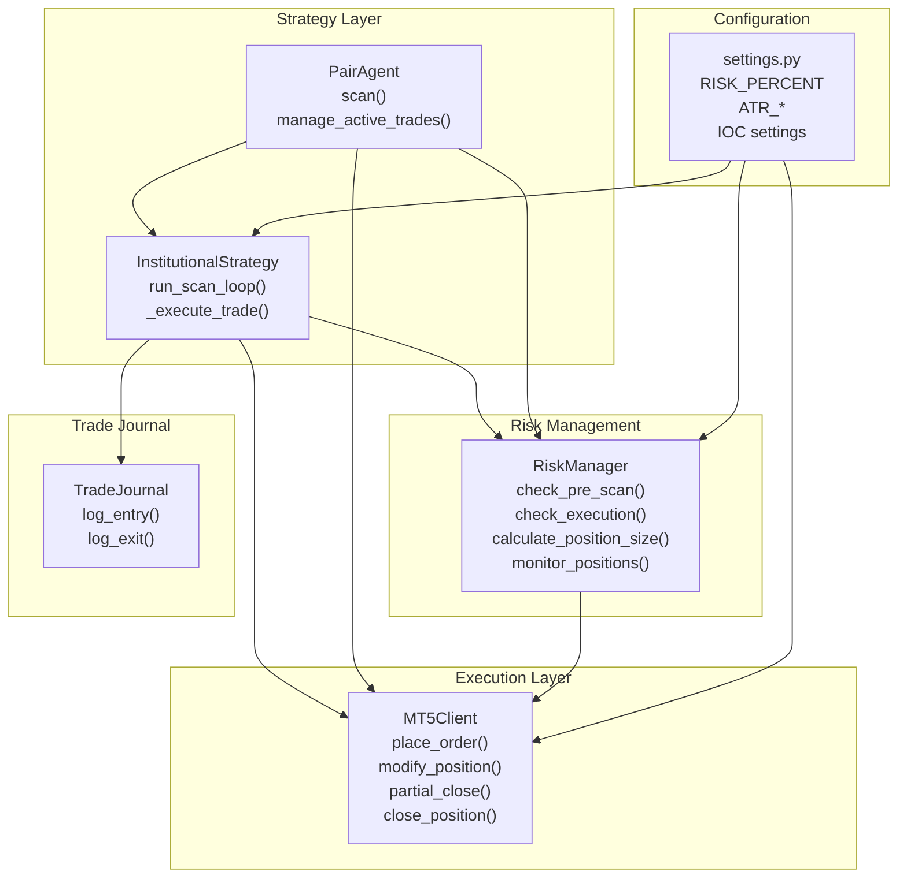
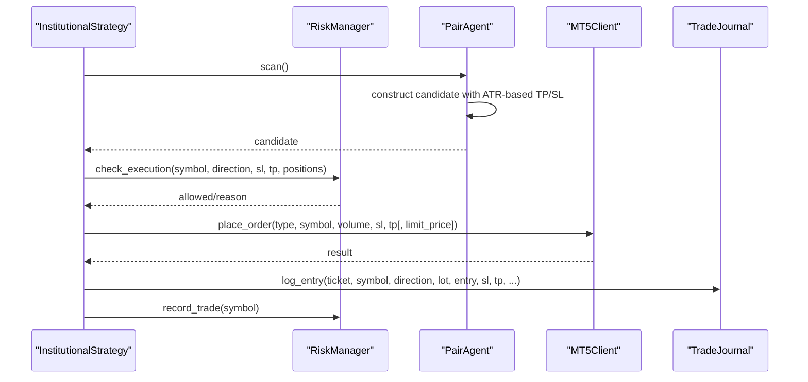
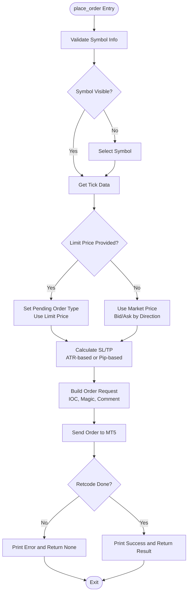
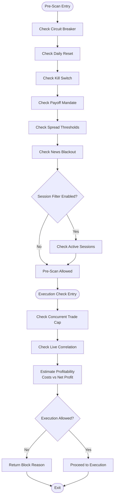
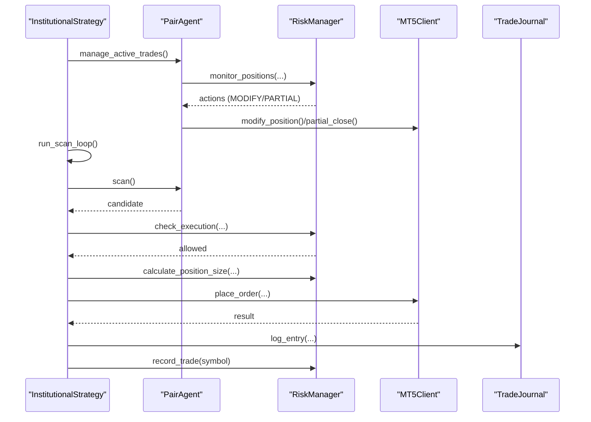
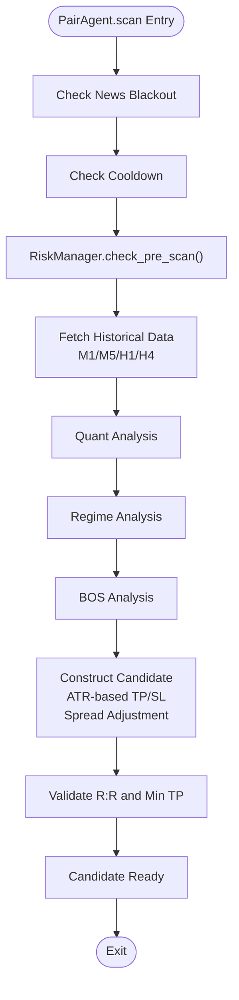
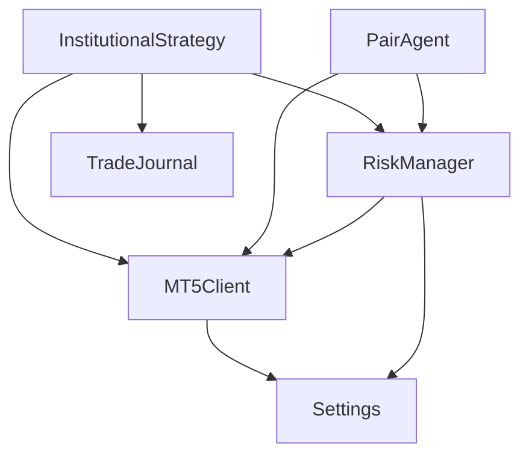

# Order Execution System

<cite>
**Referenced Files in This Document**
- [execution/mt5_client.py](file://execution/mt5_client.py)
- [utils/risk_manager.py](file://utils/risk_manager.py)
- [strategy/institutional_strategy.py](file://strategy/institutional_strategy.py)
- [strategy/pair_agent.py](file://strategy/pair_agent.py)
- [config/settings.py](file://config/settings.py)
- [utils/trade_journal.py](file://utils/trade_journal.py)
- [main.py](file://main.py)
</cite>

## Table of Contents
1. [Introduction](#introduction)
2. [Project Structure](#project-structure)
3. [Core Components](#core-components)
4. [Architecture Overview](#architecture-overview)
5. [Detailed Component Analysis](#detailed-component-analysis)
6. [Dependency Analysis](#dependency-analysis)
7. [Performance Considerations](#performance-considerations)
8. [Troubleshooting Guide](#troubleshooting-guide)
9. [Conclusion](#conclusion)

## Introduction
This document provides comprehensive documentation for the order execution system, covering order placement, modification, and cancellation procedures. It explains the place_order() method implementation, including order types (market, limit, stop), price determination, and SL/TP calculation. It details the dual pricing system supporting both ATR-based and pip-based stop-loss/take-profit calculations, order request construction, validation, and execution confirmation. Position management operations such as modify_position(), partial_close(), and close_position() are documented. The document also covers order filling modes (IOC), magic numbers, and comment fields, along with order validation, error handling, and execution failure scenarios. Finally, it explains the relationship between order execution and risk management, position sizing, and trade journal integration.

## Project Structure
The order execution system spans several modules:
- Execution layer: MT5Client handles direct MetaTrader 5 interactions for order placement and position management.
- Strategy layer: InstitutionalStrategy coordinates scanning and execution decisions, integrating with risk management and trade journal.
- Risk management: RiskManager enforces pre-execution and execution checks, calculates position sizes, and monitors positions for exits.
- Configuration: settings defines system-wide parameters including risk parameters, trailing stops, and IOC behavior.
- Trade journal: TradeJournal logs all trades for performance tracking and post-mortem analysis.

**Diagram sources**
- [execution/mt5_client.py](file://execution/mt5_client.py#L216-L384)
- [utils/risk_manager.py](file://utils/risk_manager.py#L14-L548)
- [strategy/institutional_strategy.py](file://strategy/institutional_strategy.py#L99-L436)
- [strategy/pair_agent.py](file://strategy/pair_agent.py#L297-L376)
- [config/settings.py](file://config/settings.py#L69-L148)
- [utils/trade_journal.py](file://utils/trade_journal.py#L23-L164)

**Section sources**
- [execution/mt5_client.py](file://execution/mt5_client.py#L12-L384)
- [utils/risk_manager.py](file://utils/risk_manager.py#L14-L548)
- [strategy/institutional_strategy.py](file://strategy/institutional_strategy.py#L49-L436)
- [strategy/pair_agent.py](file://strategy/pair_agent.py#L22-L376)
- [config/settings.py](file://config/settings.py#L69-L148)
- [utils/trade_journal.py](file://utils/trade_journal.py#L23-L164)
- [main.py](file://main.py#L19-L122)

## Core Components
- MT5Client: Provides order placement, modification, partial close, and full close operations. Implements dual pricing support (ATR-based vs pip-based) and constructs order requests with IOC filling, magic numbers, and comments.
- RiskManager: Centralizes pre-scan and execution checks, position sizing using dynamic Kelly criterion, and position monitoring for trailing stops, break-even, and partial closes.
- InstitutionalStrategy: Orchestrates scanning loops, validates candidates against risk controls, executes orders, records trades, and integrates with the dashboard and Telegram notifications.
- PairAgent: Manages individual symbol scanning, candidate construction with ATR-based TP/SL, and active trade management including trailing stops and regime exits.
- TradeJournal: Logs trade entries and exits, computes performance metrics, and supports post-mortem analysis.
- settings: Defines system-wide parameters including risk percentages, ATR multipliers, IOC behavior, and trailing stop configurations.

**Section sources**
- [execution/mt5_client.py](file://execution/mt5_client.py#L216-L384)
- [utils/risk_manager.py](file://utils/risk_manager.py#L237-L548)
- [strategy/institutional_strategy.py](file://strategy/institutional_strategy.py#L331-L436)
- [strategy/pair_agent.py](file://strategy/pair_agent.py#L297-L376)
- [utils/trade_journal.py](file://utils/trade_journal.py#L103-L164)
- [config/settings.py](file://config/settings.py#L69-L148)

## Architecture Overview
The order execution system follows a layered architecture:
- Strategy orchestrates scanning and execution decisions.
- RiskManager enforces risk controls and determines position sizes.
- MT5Client handles MetaTrader 5 interactions.
- TradeJournal persists trade events for analytics.
- settings centralizes configuration for risk, trailing stops, and IOC behavior.

**Diagram sources**
- [strategy/institutional_strategy.py](file://strategy/institutional_strategy.py#L99-L436)
- [utils/risk_manager.py](file://utils/risk_manager.py#L237-L295)
- [strategy/pair_agent.py](file://strategy/pair_agent.py#L145-L295)
- [execution/mt5_client.py](file://execution/mt5_client.py#L216-L292)
- [utils/trade_journal.py](file://utils/trade_journal.py#L103-L131)

## Detailed Component Analysis

### MT5Client: Order Placement and Position Management
MT5Client encapsulates all order-related operations:
- place_order(): Supports market and limit orders, determines price, calculates SL/TP using either ATR-based or pip-based methods, constructs the order request with IOC filling, magic number, and comment, and sends the order to MetaTrader 5.
- modify_position(): Adjusts SL/TP of an existing position using TRADE_ACTION_SLTP.
- partial_close(): Closes a fraction of an existing position, locking in profits while letting the remainder run.
- close_position(): Fully closes an existing position by ticket.

Key implementation details:
- Price determination: Uses bid/ask based on order type; supports limit orders by setting pending order types.
- Dual pricing system: If exact sl_price/tp_price are provided, they are used directly (ATR-based); otherwise, pip-based calculations are used.
- Order request construction: Includes action, symbol, volume, type, price, sl, tp, deviation, magic, comment, type_time, and type_filling (IOC).
- Execution confirmation: Validates retcode and prints success/failure messages.

**Diagram sources**
- [execution/mt5_client.py](file://execution/mt5_client.py#L216-L292)

**Section sources**
- [execution/mt5_client.py](file://execution/mt5_client.py#L216-L384)

### RiskManager: Risk Controls and Position Monitoring
RiskManager performs:
- Pre-scan checks: Daily limits, kill switch, payoff mandate, spread thresholds, news blackout, and session filters.
- Execution checks: Concurrent trade caps, live correlation conflicts, and profitability checks using approximate costs.
- Position sizing: Dynamic lot sizing using Kelly criterion with confluence tiers and tail risk clamping.
- Position monitoring: Generates actions for break-even, partial close, and trailing stops using ATR-based or fixed percentage methods.

Key implementation details:
- Daily reset logic ensures daily trade counts reset at UTC midnight.
- Kill switch and payoff mandate prevent trading if recent losses exceed thresholds or average loss exceeds acceptable ratios.
- Profitability check estimates spread and commission costs in pips and compares net profit against a minimum ratio.
- Position monitoring evaluates current price vs entry, calculates risk/profit, and triggers modifications or partial closes based on configured thresholds.

**Diagram sources**
- [utils/risk_manager.py](file://utils/risk_manager.py#L51-L295)

**Section sources**
- [utils/risk_manager.py](file://utils/risk_manager.py#L14-L548)

### InstitutionalStrategy: Execution Orchestration
InstitutionalStrategy coordinates:
- Scanning loop: Manages position management for all agents, global session checks, daily limits, and active news events.
- Candidate evaluation: Constructs approximate SL/TP levels and runs execution checks via RiskManager.
- Order execution: Calculates position size using RiskManager, determines entry price and order type, and places orders via MT5Client.
- Trade logging: Records entries in TradeJournal and updates daily trade counts.

Key implementation details:
- Position management: Calls PairAgent.manage_active_trades() to handle trailing stops, break-even, and partial closes.
- Risk gating: Enforces R:R mandates and symbol tradeability checks before execution.
- Trade journal integration: Logs entries with confluence scores, researcher actions, and AI signals.

**Diagram sources**
- [strategy/institutional_strategy.py](file://strategy/institutional_strategy.py#L99-L436)
- [strategy/pair_agent.py](file://strategy/pair_agent.py#L297-L376)
- [utils/risk_manager.py](file://utils/risk_manager.py#L341-L396)
- [execution/mt5_client.py](file://execution/mt5_client.py#L216-L292)
- [utils/trade_journal.py](file://utils/trade_journal.py#L103-L131)

**Section sources**
- [strategy/institutional_strategy.py](file://strategy/institutional_strategy.py#L99-L436)

### PairAgent: Symbol-Level Execution and Management
PairAgent manages:
- Scanning: Performs pre-scan checks, fetches multi-timeframe data, runs quant and regime analysis, and constructs candidates with ATR-based TP/SL.
- Candidate construction: Computes sl_distance and tp_distance using ATR multipliers, adjusts for spread, enforces minimum TP and R:R thresholds, and supports BOS fusion with liquidity sweep entries.
- Active trade management: Uses RiskManager.monitor_positions() to generate actions for trailing stops, break-even, and partial closes, and applies regime-based exits.

Key implementation details:
- ATR-based TP/SL: Uses settings.ATR_SL_MULTIPLIER and settings.ATR_TP_MULTIPLIER to compute distances adjusted by spread and minimum thresholds.
- BOS integration: When BOS detects valid setups aligned with ML direction, it boosts scores, sets entry_type to LIMIT, and configures limit prices at ATR pullbacks.
- Position management: Caches ATR for efficiency and recalculates when stale, then executes MODIFY or PARTIAL actions via MT5Client.

**Diagram sources**
- [strategy/pair_agent.py](file://strategy/pair_agent.py#L71-L295)

**Section sources**
- [strategy/pair_agent.py](file://strategy/pair_agent.py#L22-L376)

### TradeJournal: Trade Logging and Analytics
TradeJournal provides:
- Initialization: Creates trades and daily_summary tables, adds migration columns for researcher and critic features.
- Entry logging: Inserts new trade entries with ticket, symbol, direction, lot size, entry/SL/TP prices, confluence details, and researcher metadata.
- Exit logging: Updates exits with exit price, profit, RR achieved, duration, and outcome.
- Analytics: Provides daily stats, confluence analysis, and recent trades for performance insights.

Key implementation details:
- Data persistence: Uses SQLite with JSON serialization for confluence details.
- Post-mortem integration: Stores researcher and critic feedback for later analysis.

**Section sources**
- [utils/trade_journal.py](file://utils/trade_journal.py#L23-L274)

## Dependency Analysis
The order execution system exhibits clear separation of concerns:
- MT5Client depends on settings for defaults (lot size, deviation) and interacts directly with MetaTrader 5.
- RiskManager depends on MT5Client for account and history data, and on settings for risk parameters.
- InstitutionalStrategy orchestrates MT5Client, RiskManager, and TradeJournal, coordinating scanning and execution.
- PairAgent depends on RiskManager and MT5Client for position management and uses RiskManager for risk controls.
- settings centralizes all configurable parameters affecting risk, trailing stops, IOC behavior, and position sizing.

**Diagram sources**
- [execution/mt5_client.py](file://execution/mt5_client.py#L12-L384)
- [utils/risk_manager.py](file://utils/risk_manager.py#L14-L548)
- [strategy/institutional_strategy.py](file://strategy/institutional_strategy.py#L49-L436)
- [strategy/pair_agent.py](file://strategy/pair_agent.py#L22-L376)
- [config/settings.py](file://config/settings.py#L69-L148)

**Section sources**
- [execution/mt5_client.py](file://execution/mt5_client.py#L12-L384)
- [utils/risk_manager.py](file://utils/risk_manager.py#L14-L548)
- [strategy/institutional_strategy.py](file://strategy/institutional_strategy.py#L49-L436)
- [strategy/pair_agent.py](file://strategy/pair_agent.py#L22-L376)
- [config/settings.py](file://config/settings.py#L69-L148)

## Performance Considerations
- Asynchronous scanning: InstitutionalStrategy uses asyncio.gather to scan all agents concurrently, reducing latency and improving throughput.
- Data caching: PairAgent caches ATR values and recency to avoid repeated indicator computations.
- IOC filling: Orders use IOC (Immediate or Cancel) to minimize market impact and reduce slippage.
- Position sizing: Dynamic Kelly criterion with confluence tiers optimizes risk-adjusted capital allocation.
- Risk checks: Early blocking of high-risk scenarios prevents unnecessary order attempts and reduces execution failures.

[No sources needed since this section provides general guidance]

## Troubleshooting Guide
Common issues and resolutions:
- Order placement failures: Check retcode and comment from MT5Client.place_order(); ensure symbol visibility, sufficient balance, and valid order parameters.
- Execution blocked: Review RiskManager.check_execution() reasons such as correlation conflicts, concurrent trade caps, or profitability thresholds.
- Position management errors: Verify position existence and ticket validity; ensure minimum lot constraints are met for partial close operations.
- Journal logging errors: Confirm database connectivity and table initialization; handle exceptions during insert/update operations gracefully.

**Section sources**
- [execution/mt5_client.py](file://execution/mt5_client.py#L286-L292)
- [utils/risk_manager.py](file://utils/risk_manager.py#L237-L295)
- [utils/trade_journal.py](file://utils/trade_journal.py#L132-L164)

## Conclusion
The order execution system integrates MetaTrader 5 operations with robust risk controls, dynamic position sizing, and comprehensive trade journaling. MT5Client provides reliable order placement and position management with dual pricing support. RiskManager enforces pre-execution and execution checks, while InstitutionalStrategy coordinates scanning and execution decisions. PairAgent manages symbol-level analysis and active trade management, and TradeJournal persists trade events for performance tracking. Together, these components deliver a scalable, risk-aware execution framework suitable for institutional trading environments.