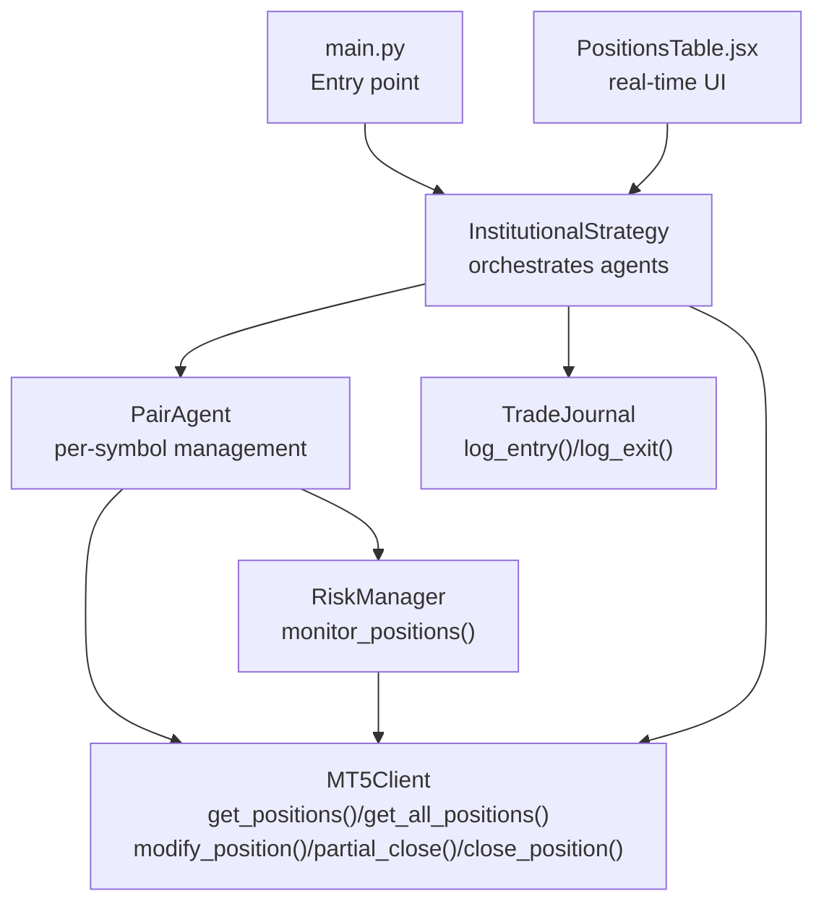
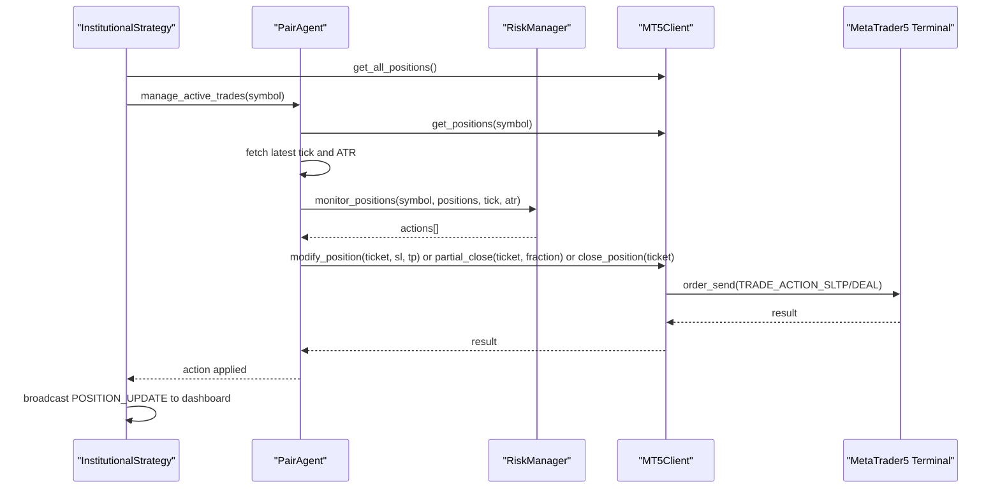
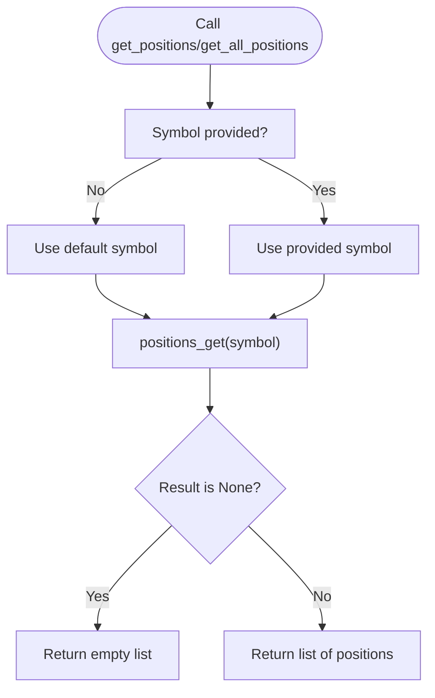
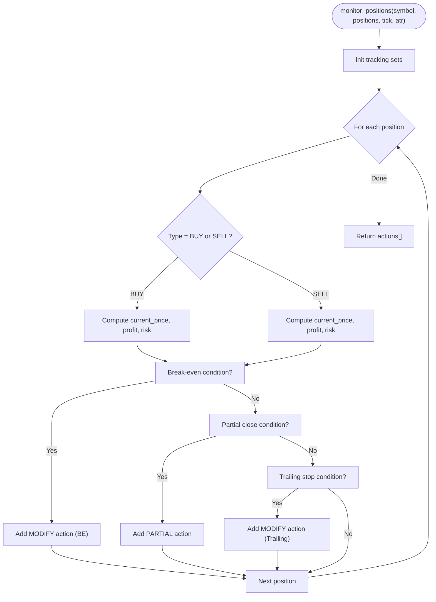
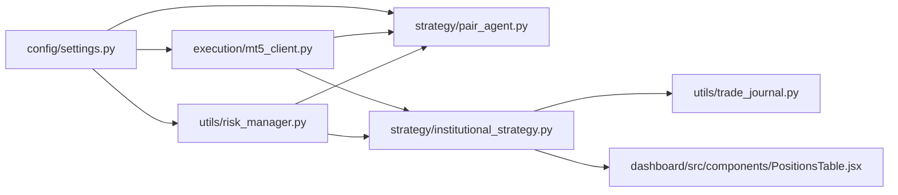

# Position Management

<cite>
**Referenced Files in This Document**
- [main.py](file://main.py)
- [execution/mt5_client.py](file://execution/mt5_client.py)
- [strategy/institutional_strategy.py](file://strategy/institutional_strategy.py)
- [strategy/pair_agent.py](file://strategy/pair_agent.py)
- [utils/risk_manager.py](file://utils/risk_manager.py)
- [utils/trade_journal.py](file://utils/trade_journal.py)
- [config/settings.py](file://config/settings.py)
- [dashboard/src/components/PositionsTable.jsx](file://dashboard/src/components/PositionsTable.jsx)
- [check_positions.py](file://check_positions.py)
- [verify_trade.py](file://verify_trade.py)
</cite>

## Table of Contents
1. [Introduction](#introduction)
2. [Project Structure](#project-structure)
3. [Core Components](#core-components)
4. [Architecture Overview](#architecture-overview)
5. [Detailed Component Analysis](#detailed-component-analysis)
6. [Dependency Analysis](#dependency-analysis)
7. [Performance Considerations](#performance-considerations)
8. [Troubleshooting Guide](#troubleshooting-guide)
9. [Conclusion](#conclusion)

## Introduction
This document explains the position management subsystem used by the institutional trading bot. It covers position retrieval, monitoring, modification, partial closure, and full closure. It documents the get_positions() and get_all_positions() methods, SL/TP adjustment, ticket-based operations, partial profit-taking with fractional exits, validation and synchronization with market data, cross-symbol tracking, aggregation, state management, integration with risk controls, trade journal recording, and real-time monitoring. It also outlines error handling and recovery procedures.

## Project Structure
Position management spans several modules:
- Execution layer: MT5 connectivity and order/position operations
- Strategy layer: orchestration of scans and active trade management
- Risk manager: position monitoring and action generation
- Trade journal: persistent logging of entries/exits
- Configuration: global parameters controlling risk, trailing, partial close, and session filters
- Dashboard: real-time display of open positions

**Diagram sources**
- [main.py](file://main.py#L19-L122)
- [strategy/institutional_strategy.py](file://strategy/institutional_strategy.py#L99-L330)
- [strategy/pair_agent.py](file://strategy/pair_agent.py#L297-L376)
- [utils/risk_manager.py](file://utils/risk_manager.py#L399-L548)
- [execution/mt5_client.py](file://execution/mt5_client.py#L199-L385)
- [utils/trade_journal.py](file://utils/trade_journal.py#L103-L165)
- [dashboard/src/components/PositionsTable.jsx](file://dashboard/src/components/PositionsTable.jsx#L1-L79)

**Section sources**
- [main.py](file://main.py#L19-L122)
- [strategy/institutional_strategy.py](file://strategy/institutional_strategy.py#L99-L330)
- [strategy/pair_agent.py](file://strategy/pair_agent.py#L297-L376)
- [utils/risk_manager.py](file://utils/risk_manager.py#L399-L548)
- [execution/mt5_client.py](file://execution/mt5_client.py#L199-L385)
- [utils/trade_journal.py](file://utils/trade_journal.py#L103-L165)
- [dashboard/src/components/PositionsTable.jsx](file://dashboard/src/components/PositionsTable.jsx#L1-L79)

## Core Components
- MT5Client: Provides position retrieval and modification/closure operations, including partial close and SL/TP adjustments.
- InstitutionalStrategy: Coordinates scanning and active position management across symbols, retrieves all positions, and integrates with the dashboard and trade journal.
- PairAgent: Manages per-symbol positions, computes actions via RiskManager, and executes modifications/closures.
- RiskManager: Monitors positions and generates action plans (modify SL/TP, partial close, full close) based on trailing stops, break-even logic, and regime shifts.
- TradeJournal: Logs trade lifecycle events and performance metrics for reporting and analysis.
- Configuration: Defines thresholds and parameters for trailing stops, partial close fractions, break-even ratios, and session filters.

**Section sources**
- [execution/mt5_client.py](file://execution/mt5_client.py#L199-L385)
- [strategy/institutional_strategy.py](file://strategy/institutional_strategy.py#L113-L116)
- [strategy/pair_agent.py](file://strategy/pair_agent.py#L297-L376)
- [utils/risk_manager.py](file://utils/risk_manager.py#L399-L548)
- [utils/trade_journal.py](file://utils/trade_journal.py#L103-L165)
- [config/settings.py](file://config/settings.py#L139-L148)

## Architecture Overview
The position lifecycle is:
- Retrieve positions via MT5Client
- Monitor positions via RiskManager to compute actions
- Apply actions via MT5Client (modify SL/TP, partial close, full close)
- Record outcomes in TradeJournal
- Publish live updates to the dashboard

**Diagram sources**
- [strategy/institutional_strategy.py](file://strategy/institutional_strategy.py#L113-L116)
- [strategy/pair_agent.py](file://strategy/pair_agent.py#L297-L376)
- [utils/risk_manager.py](file://utils/risk_manager.py#L399-L548)
- [execution/mt5_client.py](file://execution/mt5_client.py#L296-L385)

## Detailed Component Analysis

### Position Retrieval: get_positions() and get_all_positions()
- get_positions(symbol=None): Retrieves all positions for a given symbol. Defaults to the client’s default symbol if none provided.
- get_all_positions(): Retrieves all open positions across all symbols.

Usage patterns:
- InstitutionalStrategy queries all positions to enforce global limits and feed dashboard updates.
- PairAgent queries per-symbol positions to compute action plans.

**Diagram sources**
- [execution/mt5_client.py](file://execution/mt5_client.py#L199-L212)
- [strategy/institutional_strategy.py](file://strategy/institutional_strategy.py#L113-L116)

**Section sources**
- [execution/mt5_client.py](file://execution/mt5_client.py#L199-L212)
- [strategy/institutional_strategy.py](file://strategy/institutional_strategy.py#L113-L116)

### Position Monitoring and Action Generation
RiskManager.monitor_positions evaluates each position and returns a list of actions:
- Modify SL/TP: move to break-even, trail stops using ATR or fixed percentage
- Partial close: lock in profits by closing a fraction of the position
- Full close: exit entire position based on regime shift or other triggers

Key logic:
- Buy/Sell-specific computations for profit/risk vs SL/TP distances
- Threshold checks to avoid unnecessary modifications
- State tracking to prevent repeating actions (e.g., once-only BE, partial close)

**Diagram sources**
- [utils/risk_manager.py](file://utils/risk_manager.py#L399-L548)

**Section sources**
- [utils/risk_manager.py](file://utils/risk_manager.py#L399-L548)

### Position Modification: SL/TP Adjustments
- modify_position(ticket, sl, tp): Sends a TRADE_ACTION_SLTP request to adjust stop-loss and take-profit for an existing position.
- PairAgent applies actions generated by RiskManager to adjust SL/TP accordingly.

Validation and safety:
- Threshold comparisons to avoid trivial adjustments
- Respect symbol tick size and minimum lot constraints indirectly via MT5

**Section sources**
- [execution/mt5_client.py](file://execution/mt5_client.py#L296-L309)
- [strategy/pair_agent.py](file://strategy/pair_agent.py#L343-L348)

### Partial Position Closure: Fractional Exits
- partial_close(ticket, fraction): Closes a fraction of an existing position to lock in profits while letting the remainder run.
- Validates position existence and ensures close volume meets symbol minimum lot.

Institutional strategy:
- Uses a configurable fraction for partial profit-taking
- Tracks tickets already partially closed to avoid repeat actions

**Section sources**
- [execution/mt5_client.py](file://execution/mt5_client.py#L311-L352)
- [utils/risk_manager.py](file://utils/risk_manager.py#L441-L451)
- [config/settings.py](file://config/settings.py#L147-L148)

### Full Position Closure
- close_position(ticket): Fully closes a position by sending a DEAL order with the position’s volume and inverse type.
- Useful for regime exits or emergency stops.

**Section sources**
- [execution/mt5_client.py](file://execution/mt5_client.py#L354-L385)
- [strategy/pair_agent.py](file://strategy/pair_agent.py#L368-L375)

### Position Validation and Ticket-Based Operations
- Ticket-based operations require valid tickets returned from order fills.
- MT5Client validates symbol visibility and selects symbols when needed before placing orders or modifying positions.
- partial_close and close_position fetch the current position by ticket to ensure correct execution.

**Section sources**
- [execution/mt5_client.py](file://execution/mt5_client.py#L316-L319)
- [execution/mt5_client.py](file://execution/mt5_client.py#L356-L359)

### Position Synchronization with Market Data
- PairAgent fetches the latest tick for decision-making and caches ATR estimates to reduce overhead.
- InstitutionalStrategy broadcasts live position updates to the dashboard, including P&L and progress toward TP.

**Section sources**
- [strategy/pair_agent.py](file://strategy/pair_agent.py#L312-L336)
- [strategy/institutional_strategy.py](file://strategy/institutional_strategy.py#L196-L236)
- [dashboard/src/components/PositionsTable.jsx](file://dashboard/src/components/PositionsTable.jsx#L38-L70)

### Position Tracking Across Multiple Symbols and Aggregation
- InstitutionalStrategy aggregates all open positions and enforces global limits (e.g., maximum open positions).
- PairAgent manages per-symbol positions independently, applying regime-aware exits and risk controls.

**Section sources**
- [strategy/institutional_strategy.py](file://strategy/institutional_strategy.py#L113-L116)
- [strategy/pair_agent.py](file://strategy/pair_agent.py#L355-L375)

### Position State Management
- RiskManager tracks stateful flags to avoid repeating actions (e.g., once-only break-even, partial close).
- TradeJournal maintains open/close state per ticket for reporting and analysis.

**Section sources**
- [utils/risk_manager.py](file://utils/risk_manager.py#L412-L413)
- [utils/trade_journal.py](file://utils/trade_journal.py#L103-L165)

### Integration with Risk Controls
- Pre-scan and execution risk checks prevent entering trades when conditions are unfavorable.
- Active position management enforces trailing stops, break-even moves, partial profit-taking, and regime exits.

**Section sources**
- [utils/risk_manager.py](file://utils/risk_manager.py#L51-L163)
- [utils/risk_manager.py](file://utils/risk_manager.py#L237-L295)
- [utils/risk_manager.py](file://utils/risk_manager.py#L399-L548)

### Trade Journal Recording and Real-Time Monitoring
- TradeJournal logs entries and exits, computing realized R:R and durations.
- InstitutionalStrategy publishes live position updates to the dashboard for real-time monitoring.

**Section sources**
- [utils/trade_journal.py](file://utils/trade_journal.py#L103-L165)
- [strategy/institutional_strategy.py](file://strategy/institutional_strategy.py#L196-L236)
- [dashboard/src/components/PositionsTable.jsx](file://dashboard/src/components/PositionsTable.jsx#L1-L79)

## Dependency Analysis

**Diagram sources**
- [config/settings.py](file://config/settings.py#L139-L148)
- [utils/risk_manager.py](file://utils/risk_manager.py#L399-L548)
- [strategy/pair_agent.py](file://strategy/pair_agent.py#L297-L376)
- [execution/mt5_client.py](file://execution/mt5_client.py#L199-L385)
- [strategy/institutional_strategy.py](file://strategy/institutional_strategy.py#L113-L116)
- [utils/trade_journal.py](file://utils/trade_journal.py#L103-L165)
- [dashboard/src/components/PositionsTable.jsx](file://dashboard/src/components/PositionsTable.jsx#L1-L79)

**Section sources**
- [config/settings.py](file://config/settings.py#L139-L148)
- [utils/risk_manager.py](file://utils/risk_manager.py#L399-L548)
- [strategy/pair_agent.py](file://strategy/pair_agent.py#L297-L376)
- [execution/mt5_client.py](file://execution/mt5_client.py#L199-L385)
- [strategy/institutional_strategy.py](file://strategy/institutional_strategy.py#L113-L116)
- [utils/trade_journal.py](file://utils/trade_journal.py#L103-L165)
- [dashboard/src/components/PositionsTable.jsx](file://dashboard/src/components/PositionsTable.jsx#L1-L79)

## Performance Considerations
- Prefer cached ATR values in PairAgent to minimize indicator recomputation.
- Use per-symbol position retrieval to reduce MT5 calls.
- Batch action application to avoid redundant MT5 round trips.
- Respect minimum lot constraints and deviation tolerances to minimize rejections.

## Troubleshooting Guide
Common issues and remedies:
- No positions found: Verify MT5 initialization and login; confirm symbol visibility; use the standalone checker script to validate.
- Partial close rejected: Ensure the close volume meets the symbol’s minimum lot; confirm ticket validity.
- SL/TP modification fails: Check thresholds to avoid trivial changes; verify symbol tick size and point values.
- Execution blocked by risk controls: Review daily limits, spread thresholds, session filters, and correlation conflicts.
- Dashboard not updating: Confirm InstitutionalStrategy broadcasts POSITION_UPDATE events and WebSocket integration.

**Section sources**
- [check_positions.py](file://check_positions.py#L8-L31)
- [verify_trade.py](file://verify_trade.py#L12-L87)
- [execution/mt5_client.py](file://execution/mt5_client.py#L316-L352)
- [utils/risk_manager.py](file://utils/risk_manager.py#L51-L163)
- [strategy/institutional_strategy.py](file://strategy/institutional_strategy.py#L196-L236)

## Conclusion
The position management subsystem integrates MT5 operations with institutional-grade risk controls, per-symbol intelligence, and persistent trade logging. It supports robust position monitoring, precise SL/TP adjustments, fractional profit-taking, and full closures, all synchronized with real-time dashboards and recorded for post-hoc analysis.