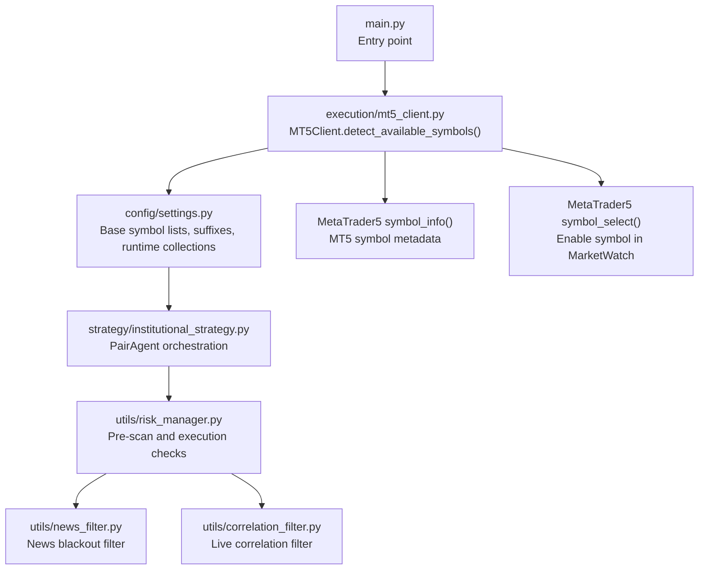
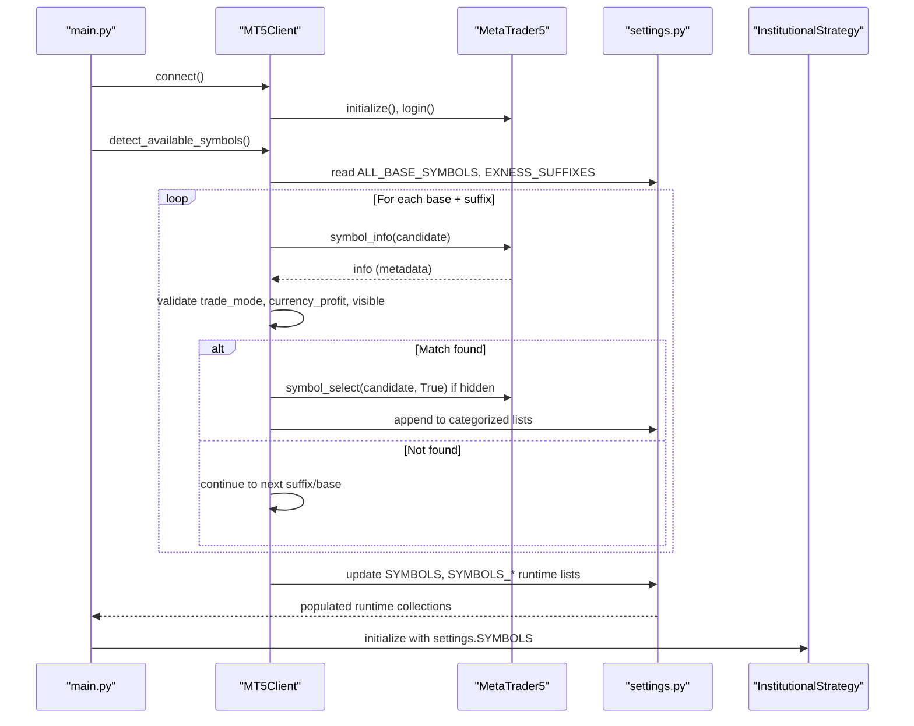
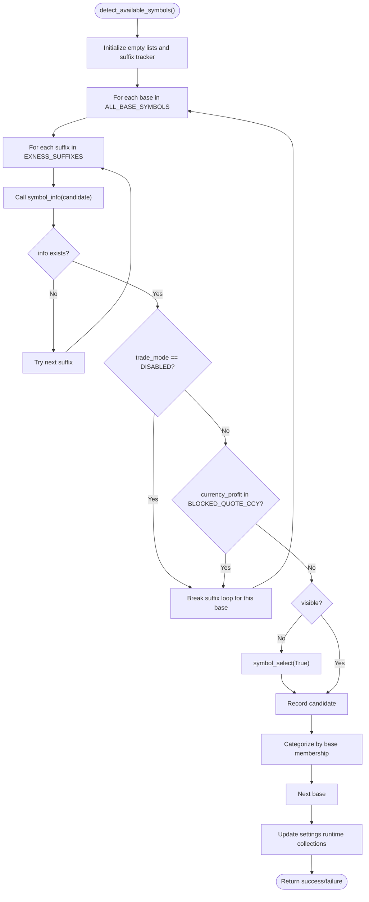
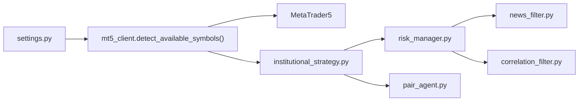

# Symbol Detection and Management

<cite>
**Referenced Files in This Document**
- [main.py](file://main.py)
- [mt5_client.py](file://execution/mt5_client.py)
- [settings.py](file://config/settings.py)
- [institutional_strategy.py](file://strategy/institutional_strategy.py)
- [risk_manager.py](file://utils/risk_manager.py)
- [pair_agent.py](file://strategy/pair_agent.py)
- [news_filter.py](file://utils/news_filter.py)
- [correlation_filter.py](file://utils/correlation_filter.py)
</cite>

## Table of Contents
1. [Introduction](#introduction)
2. [Project Structure](#project-structure)
3. [Core Components](#core-components)
4. [Architecture Overview](#architecture-overview)
5. [Detailed Component Analysis](#detailed-component-analysis)
6. [Dependency Analysis](#dependency-analysis)
7. [Performance Considerations](#performance-considerations)
8. [Troubleshooting Guide](#troubleshooting-guide)
9. [Conclusion](#conclusion)

## Introduction
This document explains the symbol detection and management system used to automatically discover tradable instruments on an Exness MT5 account, adapt to broker-specific suffixes, categorize symbols into asset classes, and maintain a runtime catalog of available symbols. It covers the detect_available_symbols() method, Exness suffix handling, trade-mode filtering, visibility management, symbol categorization, blocked quote currency filtering, trade-disabled detection, symbol_info() queries, dynamic symbol selection, integration with settings, runtime updates, and availability reporting. Broker-specific considerations, suffix variations, and troubleshooting steps are included.

## Project Structure
The symbol detection pipeline spans several modules:
- Entry point initializes the MT5 client and triggers symbol discovery
- MT5 client performs symbol_info() queries, filters by trade mode and visibility, and updates settings
- Settings module defines base symbol lists, suffixes, and runtime symbol collections
- Strategy orchestrators consume the discovered symbols to run scans
- Risk manager and pair agents apply additional filters and validations

**Diagram sources**
- [main.py](file://main.py#L19-L55)
- [mt5_client.py](file://execution/mt5_client.py#L29-L101)
- [settings.py](file://config/settings.py#L17-L60)
- [institutional_strategy.py](file://strategy/institutional_strategy.py#L77-L86)
- [risk_manager.py](file://utils/risk_manager.py#L51-L163)
- [news_filter.py](file://utils/news_filter.py#L159-L205)
- [correlation_filter.py](file://utils/correlation_filter.py#L59-L80)

**Section sources**
- [main.py](file://main.py#L19-L55)
- [mt5_client.py](file://execution/mt5_client.py#L29-L101)
- [settings.py](file://config/settings.py#L17-L60)

## Core Components
- MT5Client.detect_available_symbols(): Auto-detects available symbols on the Exness account by iterating base symbols with Exness suffixes, querying symbol_info(), filtering by trade mode and quote currency, enabling visibility if needed, and updating settings collections.
- Settings: Defines base symbol groups (Forex majors/minors, crypto, commodities), Exness suffixes, and runtime symbol lists populated by detection.
- InstitutionalStrategy: Initializes PairAgents for each discovered symbol and coordinates scanning.
- RiskManager: Applies pre-scan and execution checks including spread thresholds, news blackouts, session filters, kill switch, payoff mandate, and correlation conflicts.
- PairAgent: Performs symbol-specific analysis and candidate generation, incorporating volatility thresholds and spread-adjusted TP/SL logic.
- NewsFilter: Provides blackout detection based on live calendar and scheduled events.
- CorrelationFilter: Offers static and live correlation conflict checks.

**Section sources**
- [mt5_client.py](file://execution/mt5_client.py#L29-L101)
- [settings.py](file://config/settings.py#L17-L60)
- [institutional_strategy.py](file://strategy/institutional_strategy.py#L77-L86)
- [risk_manager.py](file://utils/risk_manager.py#L51-L163)
- [pair_agent.py](file://strategy/pair_agent.py#L145-L295)
- [news_filter.py](file://utils/news_filter.py#L159-L205)
- [correlation_filter.py](file://utils/correlation_filter.py#L59-L80)

## Architecture Overview
The symbol detection system integrates tightly with MT5’s symbol metadata and the application’s configuration. The flow begins at startup, where the MT5 client connects, detects symbols, and updates settings. Subsequent components (strategy, risk manager, agents) rely on these runtime collections to operate.

**Diagram sources**
- [main.py](file://main.py#L25-L55)
- [mt5_client.py](file://execution/mt5_client.py#L29-L101)
- [settings.py](file://config/settings.py#L17-L60)

## Detailed Component Analysis

### Symbol Detection Method: detect_available_symbols()
- Purpose: Discover available instruments on an Exness account by testing base symbols against Exness suffixes and populating settings collections.
- Input: settings.ALL_BASE_SYMBOLS and settings.EXNESS_SUFFIXES.
- Processing:
  - Iterates each base with suffixes in order ['', 'm', 'c'].
  - Calls mt5.symbol_info() for each candidate.
  - Skips candidates where trade_mode indicates disabled or reference instruments.
  - Skips candidates quoting in non-USD-denominated exotic currencies.
  - Enables visibility via mt5.symbol_select() if not visible.
  - Tracks the first suffix that succeeds to infer the account suffix.
  - Categorizes matches into Forex majors/minors, crypto, and commodities based on base membership.
- Output: Populates settings.SYMBOLS, settings.SYMBOLS_FOREX_MAJORS, settings.SYMBOLS_FOREX_MINORS, settings.SYMBOLS_CRYPTO, settings.SYMBOLS_COMMODITIES.
- Reporting: Prints account suffix and counts per category.

**Diagram sources**
- [mt5_client.py](file://execution/mt5_client.py#L29-L101)
- [settings.py](file://config/settings.py#L45-L60)

**Section sources**
- [mt5_client.py](file://execution/mt5_client.py#L29-L101)
- [settings.py](file://config/settings.py#L45-L60)

### Broker-Specific Adaptations and Exness Suffix Handling
- Suffixes tested: '', 'm', 'c'. The method records the first suffix that yields a valid symbol to infer the account suffix used by the client.
- Visibility management: Hidden symbols are enabled via symbol_select() to ensure they appear in MarketWatch.
- Trade mode filtering: Disabled instruments are skipped immediately for a given base.
- Quote currency filtering: Non-USD-denominated exotic quote currencies are excluded to prevent trading instruments incompatible with the system’s assumptions.

**Section sources**
- [mt5_client.py](file://execution/mt5_client.py#L45-L67)
- [settings.py](file://config/settings.py#L47-L49)

### Symbol Categorization System
- Categories:
  - Forex majors: defined by membership in SYMBOLS_FOREX_MAJORS_BASE.
  - Forex minors: defined by membership in SYMBOLS_FOREX_MINORS_BASE.
  - Crypto: defined by membership in SYMBOLS_CRYPTO_BASE.
  - Commodities: defined by membership in SYMBOLS_COMMODITIES_BASE.
- At runtime, discovered symbols are appended to the appropriate categorized list based on their base name.

**Section sources**
- [settings.py](file://config/settings.py#L23-L45)
- [mt5_client.py](file://execution/mt5_client.py#L71-L79)

### Blocked Quote Currency Filtering Mechanism
- The system maintains a set of non-USD-denominated exotic quote currencies and excludes any symbol whose currency_profit belongs to this set.
- This prevents trading instruments that could introduce liquidity or settlement complications.

**Section sources**
- [mt5_client.py](file://execution/mt5_client.py#L46)
- [mt5_client.py](file://execution/mt5_client.py#L59)

### Trade-Disabled Symbol Detection
- The method checks symbol_info().trade_mode. If disabled, the entire base is skipped for all suffixes, ensuring only tradeable instruments are considered.

**Section sources**
- [mt5_client.py](file://execution/mt5_client.py#L54-L57)

### Symbol Information Queries and Trade Mode Validation
- symbol_info() provides metadata used to validate:
  - trade_mode: to exclude disabled/reference instruments
  - currency_profit: to exclude non-USD-denominated exotic quotes
  - visible: to enable MarketWatch visibility if needed

**Section sources**
- [mt5_client.py](file://execution/mt5_client.py#L52-L63)

### Dynamic Symbol Selection
- Hidden symbols are enabled using symbol_select() to ensure downstream components can access them.

**Section sources**
- [mt5_client.py](file://execution/mt5_client.py#L62-L63)

### Integration with Settings Configuration and Runtime Updates
- Base symbol groups and suffixes are defined in settings.
- After detection, runtime lists are updated:
  - settings.SYMBOLS
  - settings.SYMBOLS_FOREX_MAJORS
  - settings.SYMBOLS_FOREX_MINORS
  - settings.SYMBOLS_CRYPTO
  - settings.SYMBOLS_COMMODITIES
- The entry point prints a summary of discovered instruments and categories.

**Section sources**
- [settings.py](file://config/settings.py#L17-L60)
- [mt5_client.py](file://execution/mt5_client.py#L81-L95)
- [main.py](file://main.py#L43-L55)

### Symbol Availability Reporting
- Reports the inferred account suffix and counts per category, printing a concise summary of discovered instruments.

**Section sources**
- [mt5_client.py](file://execution/mt5_client.py#L88-L95)

### Broker-Specific Considerations and Suffix Variations
- Exness accounts may expose instruments with suffixes indicating account type:
  - '' for Raw Spread/Pro
  - 'm' for Standard
  - 'c' for Standard Cent
- The detection method tries suffixes in order and records the first successful suffix to infer the account’s effective suffix.

**Section sources**
- [settings.py](file://config/settings.py#L47-L49)
- [mt5_client.py](file://execution/mt5_client.py#L65-L66)

### Troubleshooting Symbol Detection Issues
Common issues and resolutions:
- No symbols detected:
  - Verify MT5 connection and credentials.
  - Confirm the account has instruments in the configured base lists.
  - Check that symbols are enabled in MarketWatch (the detector enables hidden symbols, but manual checks may be needed).
- Unexpected missing instruments:
  - Ensure trade_mode is not DISABLED for the base.
  - Verify currency_profit is not in the blocked set.
  - Confirm the correct suffix is being used for the account type.
- Incorrect category assignments:
  - Validate base membership in settings groups.
- Exotic quote currency exclusions:
  - Instruments quoting in non-USD-denominated exotic currencies are intentionally filtered out.

**Section sources**
- [mt5_client.py](file://execution/mt5_client.py#L54-L60)
- [mt5_client.py](file://execution/mt5_client.py#L88-L95)
- [settings.py](file://config/settings.py#L45-L60)

## Dependency Analysis
The symbol detection system depends on:
- MT5 symbol metadata (symbol_info) for trade_mode, currency_profit, and visibility
- Settings for base symbol lists, suffixes, and runtime collections
- Strategy and risk components that rely on the runtime symbol catalogs

**Diagram sources**
- [settings.py](file://config/settings.py#L17-L60)
- [mt5_client.py](file://execution/mt5_client.py#L29-L101)
- [institutional_strategy.py](file://strategy/institutional_strategy.py#L77-L86)
- [risk_manager.py](file://utils/risk_manager.py#L51-L163)
- [news_filter.py](file://utils/news_filter.py#L159-L205)
- [correlation_filter.py](file://utils/correlation_filter.py#L59-L80)
- [pair_agent.py](file://strategy/pair_agent.py#L145-L295)

**Section sources**
- [settings.py](file://config/settings.py#L17-L60)
- [mt5_client.py](file://execution/mt5_client.py#L29-L101)
- [institutional_strategy.py](file://strategy/institutional_strategy.py#L77-L86)
- [risk_manager.py](file://utils/risk_manager.py#L51-L163)
- [pair_agent.py](file://strategy/pair_agent.py#L145-L295)
- [news_filter.py](file://utils/news_filter.py#L159-L205)
- [correlation_filter.py](file://utils/correlation_filter.py#L59-L80)

## Performance Considerations
- The detection loop iterates over ALL_BASE_SYMBOLS and up to three suffixes per base, resulting in O(B × S) symbol_info() calls. This is efficient for typical base lists.
- Early termination occurs when trade_mode is disabled or when a match is found for a base; this reduces unnecessary queries.
- Visibility toggling is performed only when needed, minimizing MT5 calls.
- Consider caching symbol_info() results if extending the system to reuse metadata elsewhere.

## Troubleshooting Guide
- Connection failures:
  - Ensure MT5 terminal is running and reachable.
  - Verify MT5_PATH, MT5_LOGIN, MT5_PASSWORD, and MT5_SERVER in environment settings.
- Empty symbol lists:
  - Confirm that base symbol lists include instruments available on the account.
  - Check that the account suffix inferred by detection aligns with the intended account type.
- Excluded instruments:
  - Review the blocked quote currency set and adjust if necessary.
  - Validate that instruments are not marked as disabled in MT5.
- Visibility issues:
  - Hidden symbols are enabled automatically; confirm MarketWatch display if problems persist.

**Section sources**
- [main.py](file://main.py#L25-L35)
- [mt5_client.py](file://execution/mt5_client.py#L18-L27)
- [mt5_client.py](file://execution/mt5_client.py#L59-L63)
- [settings.py](file://config/settings.py#L8-L11)

## Conclusion
The symbol detection system provides robust, broker-aware discovery of tradable instruments on Exness accounts. By combining Exness suffix handling, trade-mode and visibility validation, blocked quote currency filtering, and runtime categorization, it ensures downstream components operate on a curated, validated universe of symbols. The integration with settings and the reporting of availability facilitate reliable operation and easy troubleshooting.