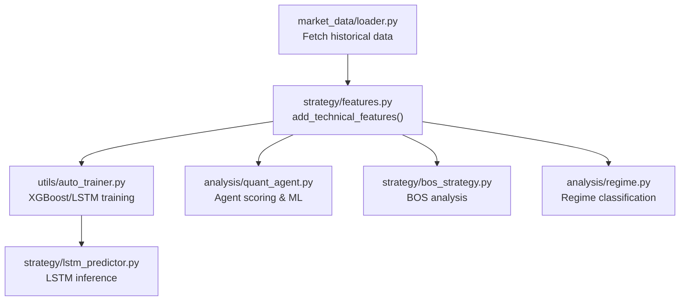
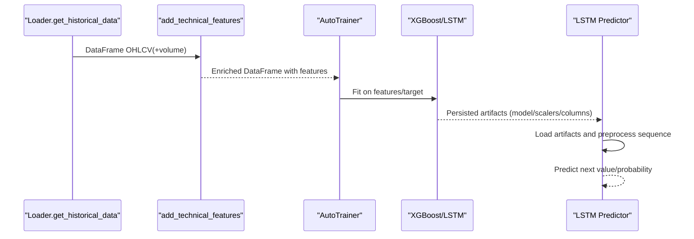
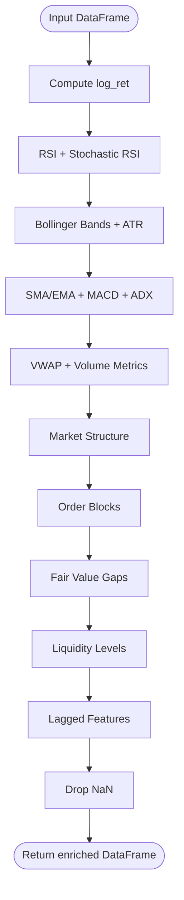
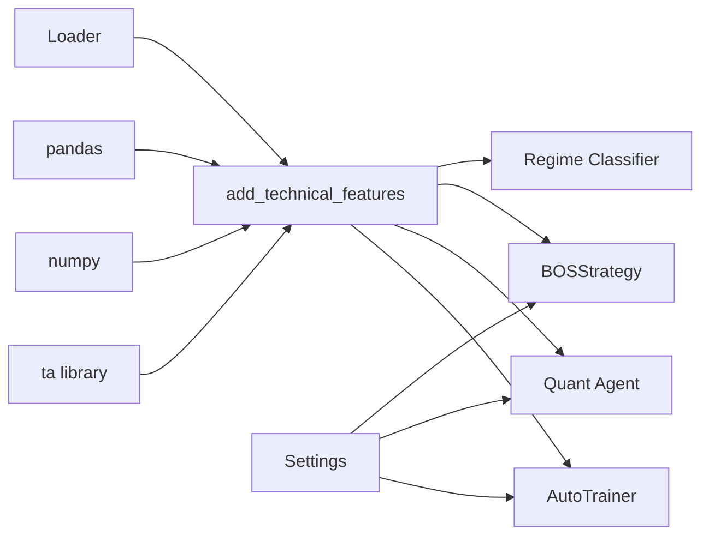

# Feature Engineering Pipeline

<cite>
**Referenced Files in This Document**
- [features.py](file://strategy/features.py)
- [auto_trainer.py](file://utils/auto_trainer.py)
- [loader.py](file://market_data/loader.py)
- [settings.py](file://config/settings.py)
- [quant_agent.py](file://analysis/quant_agent.py)
- [bos_strategy.py](file://strategy/bos_strategy.py)
- [lstm_predictor.py](file://strategy/lstm_predictor.py)
- [regime.py](file://analysis/regime.py)
</cite>

## Table of Contents
1. [Introduction](#introduction)
2. [Project Structure](#project-structure)
3. [Core Components](#core-components)
4. [Architecture Overview](#architecture-overview)
5. [Detailed Component Analysis](#detailed-component-analysis)
6. [Dependency Analysis](#dependency-analysis)
7. [Performance Considerations](#performance-considerations)
8. [Troubleshooting Guide](#troubleshooting-guide)
9. [Conclusion](#conclusion)
10. [Appendices](#appendices)

## Introduction
This document describes the feature engineering system responsible for technical indicator calculation and data preprocessing used to prepare market data for machine learning models. It focuses on the add_technical_features function and its role in generating institutional-grade features, including moving averages, RSI, ADX, and custom constructs such as near_ob_bullish/near_ob_bearish. It also documents feature selection strategies, data normalization, preprocessing steps, missing value handling, data validation, and integration with ML models. Guidance on feature importance considerations, drift detection, and adaptive feature engineering is included.

## Project Structure
The feature engineering pipeline spans several modules:
- strategy/features.py: Implements add_technical_features and helper functions for market structure, order blocks, fair value gaps, and liquidity levels.
- utils/auto_trainer.py: Demonstrates feature ingestion and training pipeline for XGBoost and LSTM, including normalization and sequence preparation.
- market_data/loader.py: Provides historical data fetching from MT5 and multi-timeframe aggregation.
- analysis/quant_agent.py: Applies feature engineering in a research/agent context and integrates ML predictions.
- strategy/bos_strategy.py: Uses derived features for BOS analysis and applies filters.
- strategy/lstm_predictor.py: Loads trained artifacts and performs inference with scaled sequences.
- analysis/regime.py: Uses ADX and volatility bands to classify market regimes.

**Diagram sources**
- [loader.py](file://market_data/loader.py#L40-L82)
- [features.py](file://strategy/features.py#L6-L98)
- [auto_trainer.py](file://utils/auto_trainer.py#L280-L348)
- [quant_agent.py](file://analysis/quant_agent.py#L114-L159)
- [bos_strategy.py](file://strategy/bos_strategy.py#L26-L161)
- [lstm_predictor.py](file://strategy/lstm_predictor.py#L36-L125)
- [regime.py](file://analysis/regime.py#L41-L57)

**Section sources**
- [features.py](file://strategy/features.py#L6-L98)
- [loader.py](file://market_data/loader.py#L40-L82)
- [auto_trainer.py](file://utils/auto_trainer.py#L280-L348)
- [quant_agent.py](file://analysis/quant_agent.py#L114-L159)
- [bos_strategy.py](file://strategy/bos_strategy.py#L26-L161)
- [lstm_predictor.py](file://strategy/lstm_predictor.py#L36-L125)
- [regime.py](file://analysis/regime.py#L41-L57)

## Core Components
- add_technical_features(df): Central function that computes institutional-grade technical features from OHLCV and volume data. It includes price returns, momentum (RSI, Stochastic RSI), volatility (Bollinger Bands, ATR), trend (SMA/EMA, MACD, ADX), volume (VWAP, delta volume), market structure, order blocks, fair value gaps, liquidity levels, and lagged features. It cleans NaN values before returning.
- Helper functions:
  - _add_market_structure(df): Detects swing highs/lows, higher highs/lower lows, break of structure (BOS), and a structure score.
  - _add_order_blocks(df): Identifies bullish/bearish order blocks and near-ob flags.
  - _add_fair_value_gaps(df): Detects bullish/bearish gaps and near-fvg flags.
  - _add_liquidity_levels(df): Identifies liquidity zones and sweep signals.
  - get_session_info(timestamp): Derives trading session from UTC hour for filtering.

Key outputs include:
- Price returns: log_ret
- Momentum: rsi, rsi_slope, stoch_rsi_k, stoch_rsi_d
- Volatility: bb_high, bb_low, bb_width, bb_pos, atr, atr_rel
- Trend: sma_20, sma_50, ema_9, ema_21, dist_sma_20, dist_sma_50, ema_cross, macd, macd_signal, macd_diff, adx, adx_pos, adx_neg
- Volume: vwap, dist_vwap, vol_sma, vol_ratio, delta_vol, delta_vol_cumsum, delta_vol_ratio
- Structure: swing_high, swing_low, is_swing_high, is_swing_low, higher_high, lower_low, bos_bullish, bos_bearish, structure_score
- Order blocks: ob_bullish, ob_bearish, dist_ob_bullish, dist_ob_bearish, near_ob_bullish, near_ob_bearish
- FVG: fvg_bullish, fvg_bearish, near_fvg_bullish, near_fvg_bearish
- Liquidity: liq_high, liq_low, dist_liq_high, dist_liq_low, liq_sweep_high, liq_sweep_low
- Lagged features: log_ret_lag_1..5, rsi_lag_1..5, macd_diff_lag_1..5
- Session info: session_name, is_active

**Section sources**
- [features.py](file://strategy/features.py#L6-L98)
- [features.py](file://strategy/features.py#L101-L128)
- [features.py](file://strategy/features.py#L131-L170)
- [features.py](file://strategy/features.py#L173-L203)
- [features.py](file://strategy/features.py#L206-L224)
- [features.py](file://strategy/features.py#L227-L242)

## Architecture Overview
The feature engineering pipeline integrates with data loading, ML training, and inference as follows:
- Data ingestion via loader.get_historical_data produces OHLCV plus optional tick_volume.
- add_technical_features enriches the DataFrame with standardized technical features.
- Training scripts (auto_trainer.py) apply targets, drop non-feature columns, and fit models.
- Inference scripts (lstm_predictor.py) load scalers and models, preprocess sequences, and predict.

**Diagram sources**
- [loader.py](file://market_data/loader.py#L40-L82)
- [features.py](file://strategy/features.py#L6-L98)
- [auto_trainer.py](file://utils/auto_trainer.py#L280-L348)
- [lstm_predictor.py](file://strategy/lstm_predictor.py#L36-L125)

## Detailed Component Analysis

### add_technical_features Function
Purpose:
- Transform raw OHLCV and optional tick_volume into a comprehensive feature set suitable for ML classification/regression tasks.

Processing logic:
- Price computations: log_ret computed from natural logarithm of consecutive close ratios.
- Momentum: RSI (standard and slope), Stochastic RSI (K/D).
- Volatility: Bollinger Bands (upper, lower, width normalized by close, position normalized by band).
- Trend: SMA/EMA (20/50 and 9/21), distances from SMAs, EMA cross signal, MACD (line, signal, diff), ADX (+DI/-DI).
- Volume: VWAP approximation using tick_volume, distance from VWAP, volume SMA and ratio, signed delta volume and cumulative sum, normalized delta ratio.
- Market structure: swing highs/lows, HH/HL/LH/LL detection, BOS flags, structure score.
- Order blocks: OB identification and near-ob flags.
- Fair value gaps: FVG detection and near-fvg flags.
- Liquidity: rolling highs/lows, distances, sweep detection.
- Lag features: lags 1,2,3,5 for log_ret, rsi, macd_diff.
- Cleaning: drop NaN rows.

**Diagram sources**
- [features.py](file://strategy/features.py#L6-L98)

**Section sources**
- [features.py](file://strategy/features.py#L6-L98)

### Technical Indicator Library
- Moving averages: SMA_20/SMA_50 and EMA_9/EMA_21; distances from SMA_20/50; EMA cross signal.
- RSI and Stochastic RSI: RSI with slope; K/D for overbought/oversold precision.
- ADX: Trend strength with +DI and -DI.
- Bollinger Bands: Upper/lower bands, normalized width, position within band.
- ATR: Average True Range and relative ATR to close.
- MACD: Line, signal, and histogram-like difference.
- VWAP: Volume-weighted average price using tick_volume; distance from VWAP.
- Volume metrics: volume SMA, volume ratio, signed delta volume, cumulative delta, normalized delta ratio.

These indicators are computed using the ta library and standard NumPy/Pandas operations.

**Section sources**
- [features.py](file://strategy/features.py#L18-L63)

### Custom Indicators and Derived Signals
- near_ob_bullish/near_ob_bearish: Flags indicating proximity to detected order block levels within a small percentage threshold.
- near_fvg_bullish/near_fvg_bearish: Flags indicating price proximity to detected fair value gaps.
- liq_sweep_high/liq_sweep_low: Binary flags for liquidity sweep conditions.
- structure_score: Net measure of bullish/bearish structure based on HH/HL/LH/LL and BOS events.

These custom signals bridge chartist constructs with ML-friendly binary/categorical features.

**Section sources**
- [features.py](file://strategy/features.py#L160-L170)
- [features.py](file://strategy/features.py#L195-L202)
- [features.py](file://strategy/features.py#L218-L223)
- [features.py](file://strategy/features.py#L125-L127)

### Feature Selection Strategies
- Drop-list approach: During training, non-feature columns (time, OHLC, volumes, target) are excluded from the feature matrix.
- Column filtering: Feature columns are derived by excluding known non-feature identifiers from the enriched DataFrame.
- LSTM-specific: Feature columns are persisted alongside the model to ensure exact alignment during inference.

Practical guidance:
- Prefer robust features with minimal collinearity (e.g., avoid using both raw close and normalized distances simultaneously).
- Use domain-derived features (structure, order blocks, FVG) to reduce reliance on overlapping technical signals.

**Section sources**
- [auto_trainer.py](file://utils/auto_trainer.py#L293-L305)
- [auto_trainer.py](file://utils/auto_trainer.py#L381-L387)
- [lstm_predictor.py](file://strategy/lstm_predictor.py#L53-L100)

### Data Normalization and Preprocessing
- XGBoost training:
  - Target construction via label_with_atr.
  - Feature matrix built from selected columns; target dropped for training.
- LSTM training:
  - Feature scaling: MinMaxScaler applied to feature matrix.
  - Target scaling: Separate MinMaxScaler for target series.
  - Sequence creation: Sliding windows of fixed length for temporal modeling.
- LSTM inference:
  - Loads feature_scaler, target_scaler, and feature_cols.
  - Scales last sequence_length rows and passes to BiLSTM.

Best practices:
- Persist scalers and feature columns to ensure consistency between training and inference.
- Align sequence length with model expectations and data frequency.

**Section sources**
- [auto_trainer.py](file://utils/auto_trainer.py#L293-L305)
- [auto_trainer.py](file://utils/auto_trainer.py#L391-L404)
- [lstm_predictor.py](file://strategy/lstm_predictor.py#L36-L113)

### Missing Value Handling and Data Validation
- Missing values:
  - add_technical_features drops rows with NaN after computing indicators.
  - Helper functions use rolling windows and forward-fill strategies to propagate structure signals.
- Validation:
  - Auto trainer validates minimum dataset size and model accuracy thresholds before hot-swapping.
  - LSTM predictor checks for sufficient data length and raises errors on missing scalers or columns.

Recommendations:
- Ensure sufficient history bars to compute rolling indicators.
- Verify presence of required columns (e.g., tick_volume for VWAP/delta metrics).

**Section sources**
- [features.py](file://strategy/features.py#L95-L98)
- [auto_trainer.py](file://utils/auto_trainer.py#L289-L291)
- [auto_trainer.py](file://utils/auto_trainer.py#L334-L337)
- [lstm_predictor.py](file://strategy/lstm_predictor.py#L108-L113)

### Integration with Machine Learning Models
- XGBoost:
  - Features are constructed, target is labeled, and model is trained with class balancing.
  - Accuracy threshold determines whether to hot-swap the model.
- LSTM:
  - Features are scaled and sequenced; model is trained with attention and saved with scalers and feature columns.
  - Inference loads artifacts and predicts next close value.

**Section sources**
- [auto_trainer.py](file://utils/auto_trainer.py#L293-L348)
- [auto_trainer.py](file://utils/auto_trainer.py#L381-L479)
- [lstm_predictor.py](file://strategy/lstm_predictor.py#L36-L125)

### Feature Importance Considerations
- ADX and ATR are used in regime classification to filter trending/ranging environments.
- Agents leverage near-ob/fvg and liquidity sweep signals for confluence scoring.
- Momentum and mean-reversion signals (RSI, Stochastic RSI) inform ML predictions.

Guidance:
- Monitor permutation/importance-based metrics during training to prune redundant features.
- Apply correlation filtering to avoid multicollinearity among similar indicators.

**Section sources**
- [regime.py](file://analysis/regime.py#L41-L57)
- [quant_agent.py](file://analysis/quant_agent.py#L277-L293)

### Drift Detection and Adaptive Feature Engineering
- Drift detection:
  - Auto trainer evaluates model accuracy on a held-out split; if below threshold, it keeps the existing model.
- Adaptive feature engineering:
  - add_technical_features is invoked consistently across training and inference.
  - Multi-timeframe loaders supply complementary signals for regime and trend filters.

Recommendations:
- Periodically retrain models and compare accuracy across time splits.
- Introduce periodic feature re-ranking and correlation checks to maintain robustness.

**Section sources**
- [auto_trainer.py](file://utils/auto_trainer.py#L329-L348)
- [loader.py](file://market_data/loader.py#L62-L82)

## Dependency Analysis
The feature engineering module orchestrates indicator computation and feeds downstream components.

**Diagram sources**
- [features.py](file://strategy/features.py#L1-L3)
- [loader.py](file://market_data/loader.py#L40-L82)
- [auto_trainer.py](file://utils/auto_trainer.py#L280-L348)
- [quant_agent.py](file://analysis/quant_agent.py#L114-L159)
- [bos_strategy.py](file://strategy/bos_strategy.py#L26-L161)
- [regime.py](file://analysis/regime.py#L41-L57)
- [settings.py](file://config/settings.py#L169-L177)

**Section sources**
- [features.py](file://strategy/features.py#L1-L3)
- [loader.py](file://market_data/loader.py#L40-L82)
- [auto_trainer.py](file://utils/auto_trainer.py#L280-L348)
- [quant_agent.py](file://analysis/quant_agent.py#L114-L159)
- [bos_strategy.py](file://strategy/bos_strategy.py#L26-L161)
- [regime.py](file://analysis/regime.py#L41-L57)
- [settings.py](file://config/settings.py#L169-L177)

## Performance Considerations
- Rolling windows: SMA/EMA/BBands/ATR introduce computational overhead; tune window sizes for desired sensitivity vs. noise.
- Vectorized operations: Most indicators are vectorized via ta/pandas; avoid repeated rolling operations by caching intermediate results where feasible.
- Memory footprint: Large histories increase memory usage; consider trimming or resampling for training/inference.
- Parallelism: Multi-timeframe loading and feature computation can be parallelized at the symbol level.

## Troubleshooting Guide
Common issues and resolutions:
- Missing tick_volume: VWAP/delta metrics will not be generated; ensure data includes tick_volume.
- Insufficient history: Some rolling indicators require a minimum number of bars; increase HISTORY_BARS.
- Model accuracy too low: Auto trainer keeps the old model; investigate feature drift or data quality.
- LSTM sequence length mismatch: Ensure sequence_length matches training configuration.
- Missing feature columns during inference: Verify feature_cols persistence and alignment.

**Section sources**
- [features.py](file://strategy/features.py#L67-L82)
- [settings.py](file://config/settings.py#L169-L171)
- [auto_trainer.py](file://utils/auto_trainer.py#L334-L337)
- [lstm_predictor.py](file://strategy/lstm_predictor.py#L94-L100)

## Conclusion
The feature engineering pipeline delivers a robust, institutional-grade set of technical indicators and derived signals tailored for ML-driven trading systems. By standardizing preprocessing, normalization, and inference, it enables reliable training and deployment of XGBoost and LSTM models. Integrating domain constructs (structure, order blocks, FVG, liquidity) with classical indicators improves signal quality and adaptability across market regimes.

## Appendices

### Example Workflows
- Training with XGBoost:
  - Fetch historical data → Apply add_technical_features → Construct target → Train model → Validate accuracy → Hot-swap if improved.
- LSTM training and inference:
  - Fetch historical data → Apply add_technical_features → Scale features and target → Build sequences → Train model → Persist artifacts → Load artifacts → Preprocess last sequence → Predict.

**Section sources**
- [loader.py](file://market_data/loader.py#L40-L82)
- [features.py](file://strategy/features.py#L6-L98)
- [auto_trainer.py](file://utils/auto_trainer.py#L293-L348)
- [auto_trainer.py](file://utils/auto_trainer.py#L381-L479)
- [lstm_predictor.py](file://strategy/lstm_predictor.py#L36-L125)