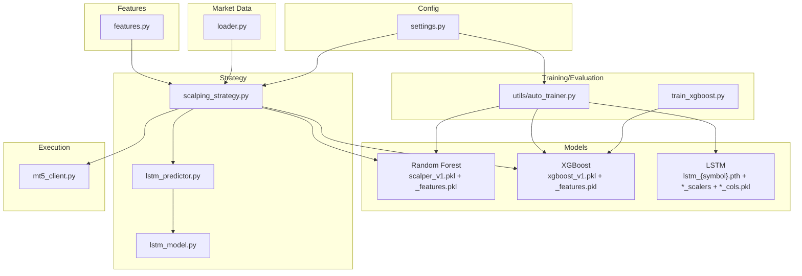
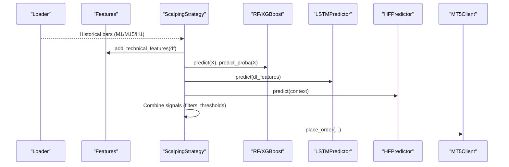
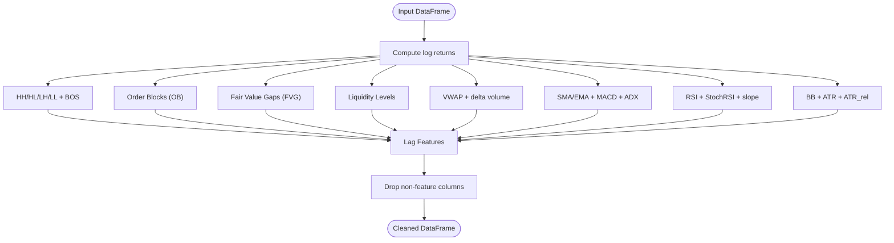
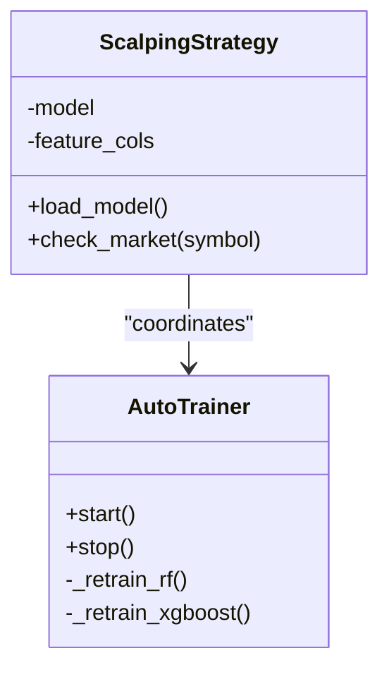
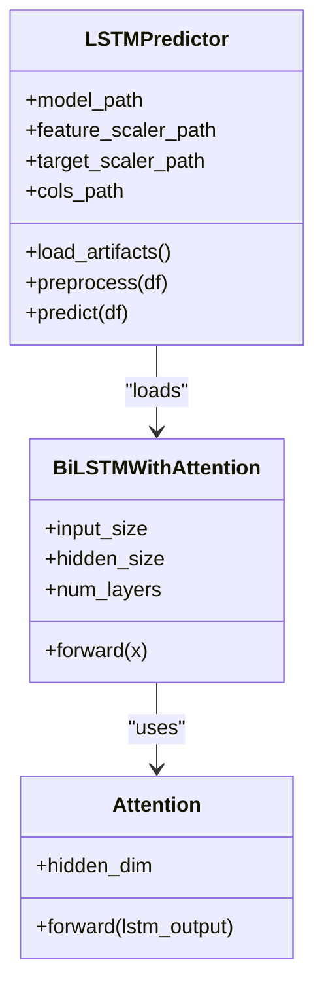
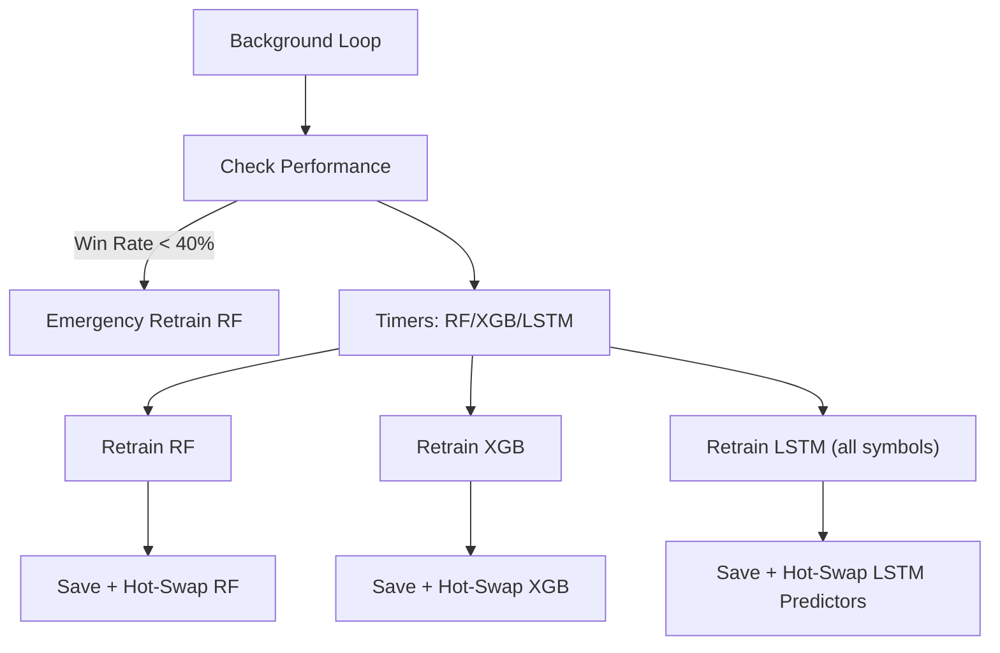
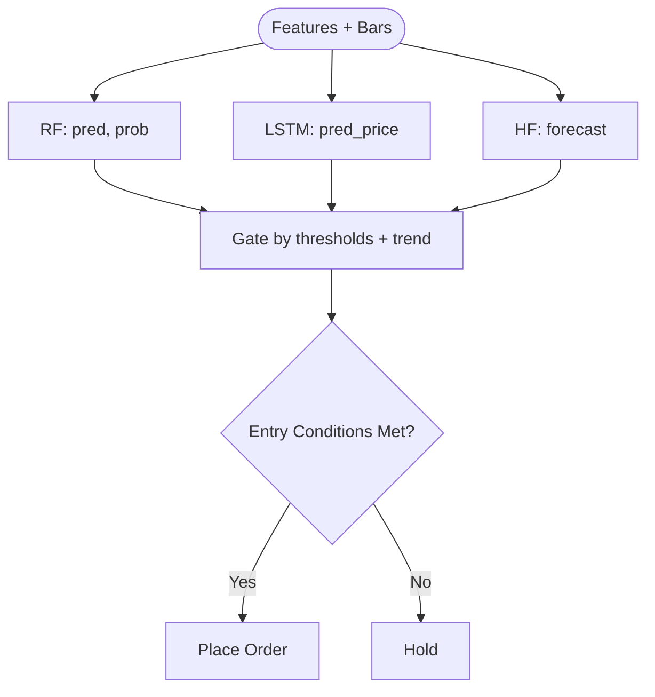
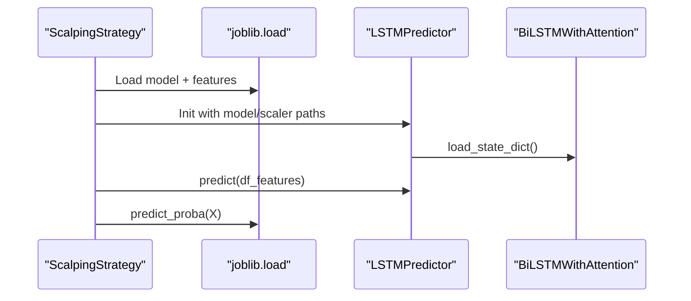
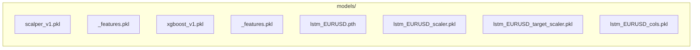
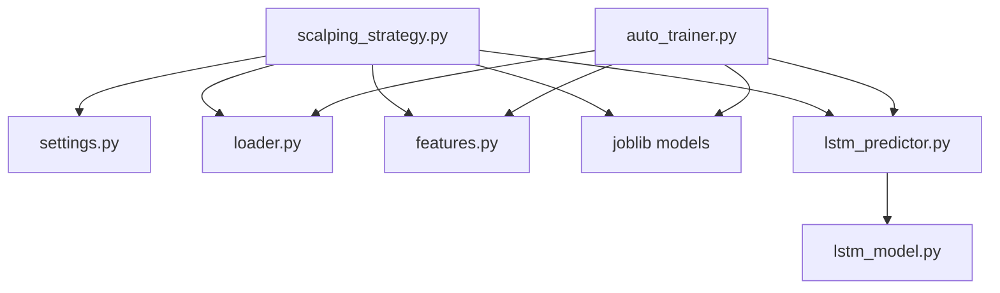

# Machine Learning Integration

<cite>
**Referenced Files in This Document**
- [lstm_model.py](file://strategy/lstm_model.py)
- [lstm_predictor.py](file://strategy/lstm_predictor.py)
- [features.py](file://strategy/features.py)
- [train_xgboost.py](file://train_xgboost.py)
- [auto_trainer.py](file://utils/auto_trainer.py)
- [settings.py](file://config/settings.py)
- [scalping_strategy.py](file://strategy/scalping_strategy.py)
- [loader.py](file://market_data/loader.py)
- [mt5_client.py](file://execution/mt5_client.py)
- [xgboost_evaluation.txt](file://xgboost_evaluation.txt)
</cite>

## Table of Contents
1. [Introduction](#introduction)
2. [Project Structure](#project-structure)
3. [Core Components](#core-components)
4. [Architecture Overview](#architecture-overview)
5. [Detailed Component Analysis](#detailed-component-analysis)
6. [Dependency Analysis](#dependency-analysis)
7. [Performance Considerations](#performance-considerations)
8. [Troubleshooting Guide](#troubleshooting-guide)
9. [Conclusion](#conclusion)
10. [Appendices](#appendices)

## Introduction
This document explains the machine learning integration of the QuantAgent system with a multi-model ensemble combining:
- XGBoost (tree-based classifier)
- Random Forest (ensemble classifier)
- LSTM (sequence-based neural network)

It covers model loading and inference, feature engineering, prediction scoring, trained model management under models/, versioning strategies, and automatic retraining. It also documents input preprocessing, prediction post-processing, ensemble combination strategies, performance metrics, validation procedures, troubleshooting, deployment, inference optimization, and integration with the trading decision pipeline.

## Project Structure
The ML stack spans several modules:
- Feature engineering: technical indicators and structured market constructs
- Training and evaluation: supervised labeling with ATR barriers and model persistence
- Inference: model loaders and predictors for each model type
- Auto-training: background retraining and hot-swapping
- Strategy orchestration: ensemble decision pipeline and order execution

**Diagram sources**
- [settings.py](file://config/settings.py#L173-L196)
- [loader.py](file://market_data/loader.py#L40-L82)
- [features.py](file://strategy/features.py#L6-L98)
- [train_xgboost.py](file://train_xgboost.py#L74-L210)
- [auto_trainer.py](file://utils/auto_trainer.py#L80-L495)
- [scalping_strategy.py](file://strategy/scalping_strategy.py#L49-L291)
- [lstm_predictor.py](file://strategy/lstm_predictor.py#L9-L142)
- [lstm_model.py](file://strategy/lstm_model.py#L27-L70)
- [mt5_client.py](file://execution/mt5_client.py#L12-L385)

**Section sources**
- [settings.py](file://config/settings.py#L173-L196)
- [loader.py](file://market_data/loader.py#L40-L82)
- [features.py](file://strategy/features.py#L6-L98)
- [train_xgboost.py](file://train_xgboost.py#L74-L210)
- [auto_trainer.py](file://utils/auto_trainer.py#L80-L495)
- [scalping_strategy.py](file://strategy/scalping_strategy.py#L49-L291)
- [lstm_predictor.py](file://strategy/lstm_predictor.py#L9-L142)
- [lstm_model.py](file://strategy/lstm_model.py#L27-L70)
- [mt5_client.py](file://execution/mt5_client.py#L12-L385)

## Core Components
- Random Forest (RF) classifier for fast inference and strong baseline classification
- XGBoost classifier for improved generalization with AUCPR objective and early stopping
- LSTM neural network with attention for sequence modeling of time series features
- Feature engineering pipeline adding institutional-grade technical indicators and structured constructs
- Auto-training system for periodic retraining and hot-swapping of models
- Strategy orchestrator integrating predictions into a unified trading decision pipeline

Key implementation references:
- RF/XGBoost model loading and inference in the strategy
- LSTM model loading, preprocessing, and inference
- Feature engineering functions for technical indicators and structured levels
- Auto-training schedules and validation thresholds
- Settings controlling model paths, ATR-based labeling, and ensemble gating

**Section sources**
- [scalping_strategy.py](file://strategy/scalping_strategy.py#L95-L105)
- [lstm_predictor.py](file://strategy/lstm_predictor.py#L37-L78)
- [features.py](file://strategy/features.py#L6-L98)
- [auto_trainer.py](file://utils/auto_trainer.py#L80-L495)
- [settings.py](file://config/settings.py#L173-L196)

## Architecture Overview
The ensemble integrates three ML components into a single decision pipeline:
- Data ingestion via market data loader
- Feature engineering via technical indicators and structured constructs
- Model inference:
  - RF/XGBoost: tabular features → classification probability
  - LSTM: sequence of features → next-close prediction
  - Optional HF predictor (Chronos) for long-horizon forecasting
- Decision gating by trend filters and session-awareness
- Execution via MT5 client

**Diagram sources**
- [loader.py](file://market_data/loader.py#L40-L82)
- [features.py](file://strategy/features.py#L6-L98)
- [scalping_strategy.py](file://strategy/scalping_strategy.py#L170-L291)
- [mt5_client.py](file://execution/mt5_client.py#L214-L292)

## Detailed Component Analysis

### Feature Engineering Pipeline
The feature engineering module adds institutional-grade technical indicators and structured constructs:
- Price returns, momentum (RSI, StochRSI), volatility (BB, ATR), trend (SMA, EMA, MACD, ADX)
- Volume features (VWAP, delta volume)
- Market structure (HH/HL/LH/LL, BOS)
- Order blocks (OB), fair value gaps (FVG), liquidity levels
- Lagged features for temporal dependencies
- Cleans NaN values and returns a ready-to-use DataFrame

**Diagram sources**
- [features.py](file://strategy/features.py#L6-L98)
- [features.py](file://strategy/features.py#L101-L128)
- [features.py](file://strategy/features.py#L131-L170)
- [features.py](file://strategy/features.py#L173-L203)
- [features.py](file://strategy/features.py#L206-L224)

**Section sources**
- [features.py](file://strategy/features.py#L6-L98)

### Random Forest and XGBoost Integration
- Both classifiers are trained on the same institutional features with ATR-based labeling to maximize dynamic TP/SL alignment.
- RF is loaded from a persisted pickle with its feature list.
- XGBoost is optionally used and can be hot-swapped by the auto-trainer.
- Strategy uses predict() for class and predict_proba() for probability thresholding.

**Diagram sources**
- [scalping_strategy.py](file://strategy/scalping_strategy.py#L49-L105)
- [auto_trainer.py](file://utils/auto_trainer.py#L80-L172)

**Section sources**
- [scalping_strategy.py](file://strategy/scalping_strategy.py#L95-L105)
- [train_xgboost.py](file://train_xgboost.py#L74-L210)
- [auto_trainer.py](file://utils/auto_trainer.py#L196-L275)

### LSTM Neural Network
The LSTM uses a bidirectional architecture with attention to aggregate sequence-level representations, followed by a fully connected head predicting a single continuous value (e.g., next close). The predictor loads the model, scalers, and feature columns, preprocesses sequences, and returns inverse-transformed predictions.

**Diagram sources**
- [lstm_model.py](file://strategy/lstm_model.py#L27-L70)
- [lstm_predictor.py](file://strategy/lstm_predictor.py#L9-L142)

**Section sources**
- [lstm_model.py](file://strategy/lstm_model.py#L27-L70)
- [lstm_predictor.py](file://strategy/lstm_predictor.py#L37-L142)

### Auto-Training and Retraining
The auto-trainer runs a background thread and periodically retrains:
- Random Forest every 4 hours on recent M15 bars with time-based splits and accuracy validation
- XGBoost every 6 hours with similar process
- LSTM models for key symbols every 8 hours with patience-based checkpointing and hot-swap
- Performance monitoring triggers emergency retrain if win rate falls below a threshold

**Diagram sources**
- [auto_trainer.py](file://utils/auto_trainer.py#L137-L172)
- [auto_trainer.py](file://utils/auto_trainer.py#L175-L193)
- [auto_trainer.py](file://utils/auto_trainer.py#L196-L275)
- [auto_trainer.py](file://utils/auto_trainer.py#L278-L347)
- [auto_trainer.py](file://utils/auto_trainer.py#L351-L495)

**Section sources**
- [auto_trainer.py](file://utils/auto_trainer.py#L80-L495)

### Ensemble Combination Strategy
The strategy combines:
- RF prediction and probability thresholding
- Optional LSTM signal derived from predicted next close
- Optional HF (Chronos) signal derived from forecasting
- Trend filter (H1 SMA) and session-aware gating

**Diagram sources**
- [scalping_strategy.py](file://strategy/scalping_strategy.py#L170-L291)

**Section sources**
- [scalping_strategy.py](file://strategy/scalping_strategy.py#L170-L291)

### Model Loading and Inference Processes
- RF/XGBoost: load model and feature columns from models/; predict on selected features
- LSTM: load model, feature/target scalers, and feature columns; preprocess last N bars into a sequence; predict; inverse transform
- HF: optional pipeline initialization and median forecast extraction

**Diagram sources**
- [scalping_strategy.py](file://strategy/scalping_strategy.py#L95-L105)
- [lstm_predictor.py](file://strategy/lstm_predictor.py#L37-L78)
- [lstm_model.py](file://strategy/lstm_model.py#L63-L70)

**Section sources**
- [scalping_strategy.py](file://strategy/scalping_strategy.py#L95-L105)
- [lstm_predictor.py](file://strategy/lstm_predictor.py#L37-L142)
- [lstm_model.py](file://strategy/lstm_model.py#L27-L70)

### Trained Model Management and Versioning
- Models are stored under models/ with explicit filenames indicating algorithm and version (e.g., xgboost_v1.pkl, scalper_v1.pkl)
- Feature lists are saved alongside models for reproducible preprocessing
- Auto-trainer saves new checkpoints with the same naming convention and hot-swaps in-memory models
- LSTM artifacts include model weights, feature scaler, target scaler, and feature columns

**Diagram sources**
- [settings.py](file://config/settings.py#L173-L196)
- [auto_trainer.py](file://utils/auto_trainer.py#L460-L471)

**Section sources**
- [settings.py](file://config/settings.py#L173-L196)
- [auto_trainer.py](file://utils/auto_trainer.py#L460-L471)

### Prediction Scoring and Post-Processing
- RF/XGBoost: class prediction plus class probability; thresholds applied for entry gating
- LSTM: raw prediction transformed via target scaler; converted to directional signal
- HF: median forecast used to derive directional signal
- Post-processing includes inverse scaling for LSTM and direction mapping

**Section sources**
- [scalping_strategy.py](file://strategy/scalping_strategy.py#L180-L215)
- [lstm_predictor.py](file://strategy/lstm_predictor.py#L115-L142)

### Validation Procedures and Metrics
- XGBoost training writes evaluation metrics to a dedicated file for review
- Auto-trainer validates RF/XGBoost with accuracy thresholds before hot-swapping
- LSTM uses validation loss with patience-based early stopping and checkpointing

**Section sources**
- [train_xgboost.py](file://train_xgboost.py#L177-L199)
- [auto_trainer.py](file://utils/auto_trainer.py#L249-L257)
- [auto_trainer.py](file://utils/auto_trainer.py#L330-L337)
- [auto_trainer.py](file://utils/auto_trainer.py#L432-L475)

## Dependency Analysis
- Strategy depends on settings for model paths, ATR thresholds, and feature selection
- Strategy depends on loader for data acquisition and features for indicator computation
- Auto-trainer depends on loader and features; it persists models and hot-swaps them into strategy
- LSTM predictor depends on BiLSTMWithAttention and joblib-persisted scalers and columns

**Diagram sources**
- [scalping_strategy.py](file://strategy/scalping_strategy.py#L12-L14)
- [settings.py](file://config/settings.py#L173-L196)
- [loader.py](file://market_data/loader.py#L40-L82)
- [features.py](file://strategy/features.py#L6-L98)
- [lstm_predictor.py](file://strategy/lstm_predictor.py#L9-L142)
- [lstm_model.py](file://strategy/lstm_model.py#L27-L70)
- [auto_trainer.py](file://utils/auto_trainer.py#L80-L495)

**Section sources**
- [scalping_strategy.py](file://strategy/scalping_strategy.py#L12-L14)
- [auto_trainer.py](file://utils/auto_trainer.py#L80-L495)

## Performance Considerations
- Prefer GPU acceleration for LSTM inference when available; predictor and auto-trainer select CUDA if present
- Use patience-based early stopping and validation accuracy thresholds to avoid overfitting
- Persist feature columns to ensure consistent preprocessing across sessions
- Keep ATR-based labeling aligned with live TP/SL logic to maintain realistic supervision signals
- Monitor performance metrics and trigger emergency retrain when win rate degrades

[No sources needed since this section provides general guidance]

## Troubleshooting Guide
Common issues and resolutions:
- Missing feature columns during preprocessing: ensure feature columns are persisted and match the DataFrame columns
- Insufficient data for sequence modeling: LSTM requires at least sequence_length observations
- Model not found: verify model paths in settings and that artifacts exist under models/
- Device errors: confirm CUDA availability and adjust device selection accordingly
- Performance degradation: enable emergency retrain and review evaluation logs

**Section sources**
- [lstm_predictor.py](file://strategy/lstm_predictor.py#L84-L113)
- [lstm_predictor.py](file://strategy/lstm_predictor.py#L76-L78)
- [auto_trainer.py](file://utils/auto_trainer.py#L175-L193)
- [xgboost_evaluation.txt](file://xgboost_evaluation.txt)

## Conclusion
The QuantAgent system integrates a robust multi-model ensemble with careful attention to feature engineering, model persistence, and adaptive retraining. The pipeline combines RF/XGBoost for fast, reliable classification with LSTM and optional HF forecasting for richer temporal understanding. Automated retraining and hot-swapping keep models aligned with evolving market dynamics, while strict validation and performance monitoring ensure reliability in live trading.

[No sources needed since this section summarizes without analyzing specific files]

## Appendices

### Appendix A: Model Paths and Naming
- RF: scalper_v1.pkl and scalper_v1_features.pkl
- XGBoost: xgboost_v1.pkl and xgboost_v1_features.pkl
- LSTM: lstm_{symbol}.pth, lstm_{symbol}_scaler.pkl, lstm_{symbol}_target_scaler.pkl, lstm_{symbol}_cols.pkl

**Section sources**
- [settings.py](file://config/settings.py#L173-L196)
- [auto_trainer.py](file://utils/auto_trainer.py#L460-L471)

### Appendix B: ATR-Based Labeling Logic
- Applies dynamic TP/SL bands using ATR and evaluates outcome over a fixed horizon
- Used consistently in training and evaluation to align supervision with live trading

**Section sources**
- [train_xgboost.py](file://train_xgboost.py#L27-L69)
- [auto_trainer.py](file://utils/auto_trainer.py#L53-L73)