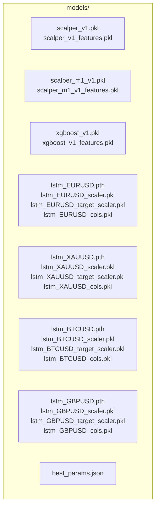
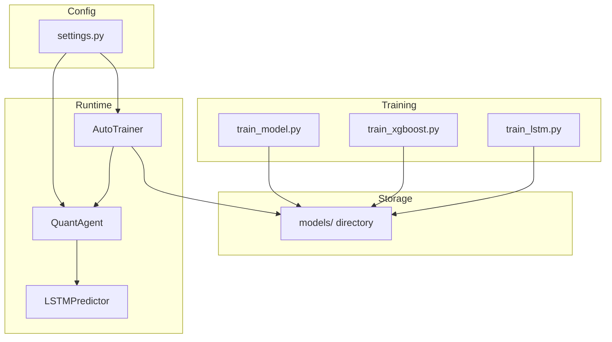
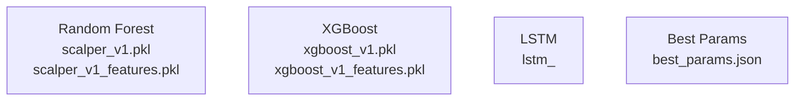
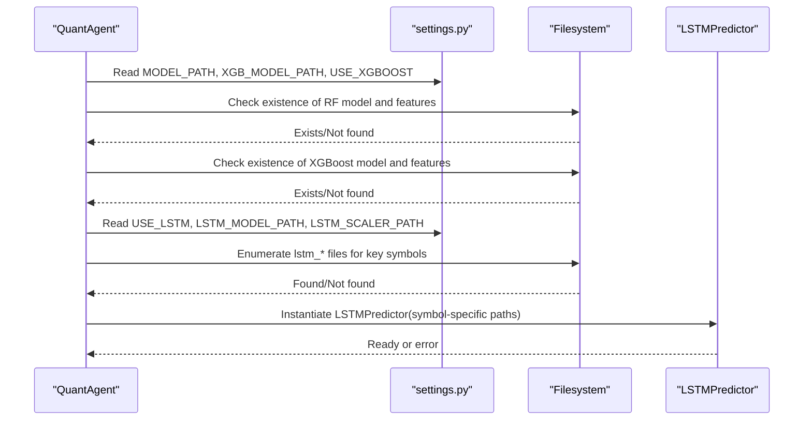
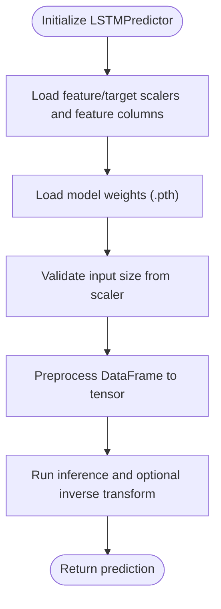
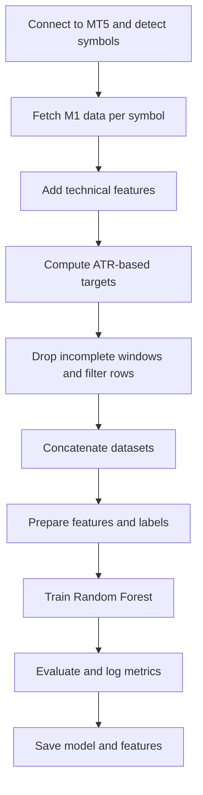
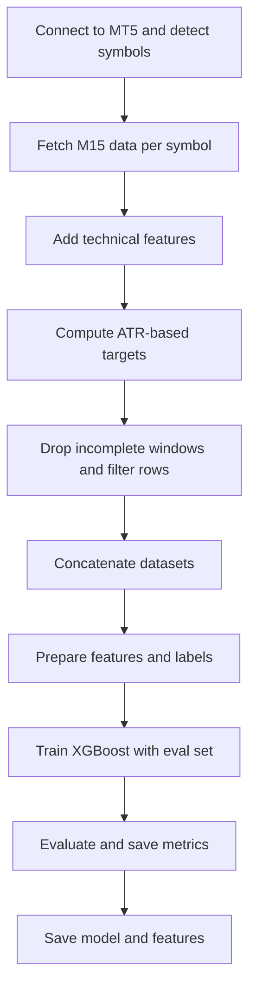
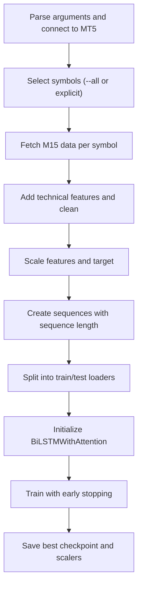
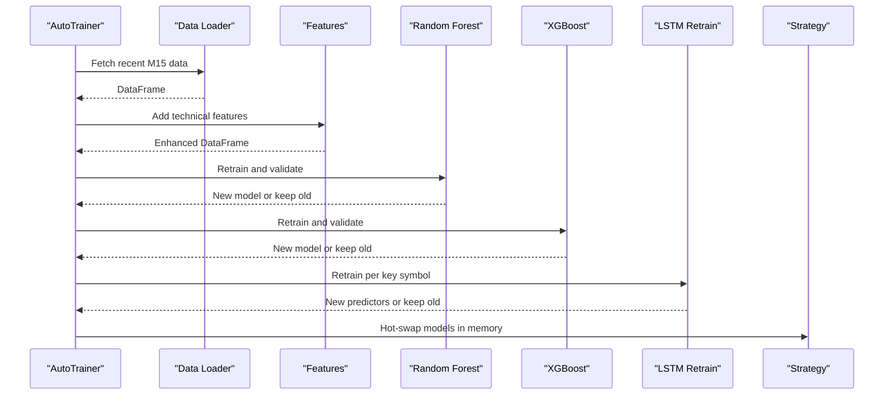
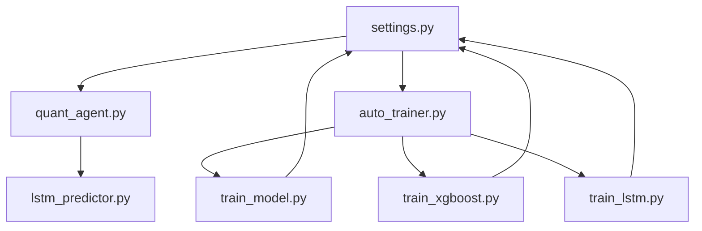

# Model Management and Storage

<cite>
**Referenced Files in This Document**
- [settings.py](file://config/settings.py)
- [quant_agent.py](file://analysis/quant_agent.py)
- [lstm_predictor.py](file://strategy/lstm_predictor.py)
- [lstm_model.py](file://strategy/lstm_model.py)
- [features.py](file://strategy/features.py)
- [train_model.py](file://train_model.py)
- [train_xgboost.py](file://train_xgboost.py)
- [train_lstm.py](file://train_lstm.py)
- [auto_trainer.py](file://utils/auto_trainer.py)
- [best_params.json](file://models/best_params.json)
- [hf_predictor.py](file://strategy/hf_predictor.py)
- [lag_llama_predictor.py](file://strategy/lag_llama_predictor.py)
</cite>

## Table of Contents
1. [Introduction](#introduction)
2. [Project Structure](#project-structure)
3. [Core Components](#core-components)
4. [Architecture Overview](#architecture-overview)
5. [Detailed Component Analysis](#detailed-component-analysis)
6. [Dependency Analysis](#dependency-analysis)
7. [Performance Considerations](#performance-considerations)
8. [Troubleshooting Guide](#troubleshooting-guide)
9. [Conclusion](#conclusion)
10. [Appendices](#appendices)

## Introduction
This document describes the model management and storage system used by the automated trading framework. It covers:
- Trained model storage and directory layout under models/
- Loading mechanisms in QuantAgent, including path resolution, validation, and error handling
- Training pipeline components for Random Forest, XGBoost, and LSTM
- Deployment procedures, automatic retraining triggers, and performance monitoring
- Compatibility, versioning, and migration strategies

## Project Structure
Models are stored under the models/ directory with the following naming conventions:
- Random Forest (scalper) models:
  - scalper_v1.pkl and scalper_m1_v1.pkl (with feature metadata)
  - scalper_v1_features.pkl and scalper_m1_v1_features.pkl
- XGBoost models:
  - xgboost_v1.pkl and xgboost_v1_features.pkl
- LSTM models:
  - lstm_<SYMBOL>.pth (weights)
  - lstm_<SYMBOL>_scaler.pkl (feature scaler)
  - lstm_<SYMBOL>_target_scaler.pkl (target scaler)
  - lstm_<SYMBOL>_cols.pkl (feature column list)
- Best parameters:
  - models/best_params.json

Key configuration constants define model paths and flags controlling model usage.

**Diagram sources**
- [settings.py](file://config/settings.py#L173-L196)
- [best_params.json](file://models/best_params.json#L1-L6)

**Section sources**
- [settings.py](file://config/settings.py#L173-L196)
- [best_params.json](file://models/best_params.json#L1-L6)

## Core Components
- Configuration-driven model paths and flags:
  - Random Forest model path and feature metadata path
  - XGBoost model path and flag to enable/disable
  - LSTM model path and scaler path for a single symbol, plus flags and sequence length
- QuantAgent loads and orchestrates models:
  - Loads Random Forest and optional XGBoost
  - Loads LSTM predictors for key symbols and a default predictor
  - Integrates high-frequency forecasting (Chronos/Lag-Llama) when available
- AutoTrainer performs background retraining and hot-swapping of models

**Section sources**
- [settings.py](file://config/settings.py#L173-L196)
- [quant_agent.py](file://analysis/quant_agent.py#L52-L107)
- [auto_trainer.py](file://utils/auto_trainer.py#L80-L136)

## Architecture Overview
The model lifecycle spans training, storage, loading, inference, and continuous adaptation.

**Diagram sources**
- [train_model.py](file://train_model.py#L223-L230)
- [train_xgboost.py](file://train_xgboost.py#L200-L209)
- [train_lstm.py](file://train_lstm.py#L173-L186)
- [settings.py](file://config/settings.py#L173-L196)
- [quant_agent.py](file://analysis/quant_agent.py#L52-L107)
- [lstm_predictor.py](file://strategy/lstm_predictor.py#L37-L78)
- [auto_trainer.py](file://utils/auto_trainer.py#L196-L275)

## Detailed Component Analysis

### Model Directory Structure and Formats
- Random Forest (joblib .pkl) with feature metadata (.pkl)
- XGBoost (joblib .pkl) with feature metadata (.pkl)
- LSTM (PyTorch state_dict .pth) with feature and target scalers (.pkl) and feature columns (.pkl)
- Best parameters JSON for operational tuning

**Diagram sources**
- [settings.py](file://config/settings.py#L173-L196)
- [best_params.json](file://models/best_params.json#L1-L6)

**Section sources**
- [settings.py](file://config/settings.py#L173-L196)
- [best_params.json](file://models/best_params.json#L1-L6)

### Model Loading in QuantAgent
QuantAgent resolves model paths from configuration, loads models with graceful fallbacks, and initializes LSTM predictors for multiple symbols.

**Diagram sources**
- [quant_agent.py](file://analysis/quant_agent.py#L52-L107)
- [settings.py](file://config/settings.py#L173-L196)
- [lstm_predictor.py](file://strategy/lstm_predictor.py#L37-L78)

**Section sources**
- [quant_agent.py](file://analysis/quant_agent.py#L52-L107)
- [settings.py](file://config/settings.py#L173-L196)
- [lstm_predictor.py](file://strategy/lstm_predictor.py#L37-L78)

### LSTM Artifact Loading and Validation
LSTMPredictor loads model weights and scalers, validates feature columns, and prepares tensors for inference. It logs warnings for missing artifacts and raises errors for critical mismatches.

**Diagram sources**
- [lstm_predictor.py](file://strategy/lstm_predictor.py#L37-L141)
- [lstm_model.py](file://strategy/lstm_model.py#L27-L69)

**Section sources**
- [lstm_predictor.py](file://strategy/lstm_predictor.py#L37-L141)
- [lstm_model.py](file://strategy/lstm_model.py#L27-L69)

### Training Pipeline Components

#### Random Forest Trainer (train_model.py)
- Collects M1 data for configured symbols, computes ATR-based targets, builds features, splits data, trains a Random Forest, evaluates, and saves model and feature metadata.

**Diagram sources**
- [train_model.py](file://train_model.py#L108-L230)
- [features.py](file://strategy/features.py#L6-L98)

**Section sources**
- [train_model.py](file://train_model.py#L108-L230)
- [features.py](file://strategy/features.py#L6-L98)

#### XGBoost Trainer (train_xgboost.py)
- Similar pipeline to RF trainer but trains XGBoost with early stopping and evaluation metrics, saving model and feature metadata.

**Diagram sources**
- [train_xgboost.py](file://train_xgboost.py#L74-L209)
- [features.py](file://strategy/features.py#L6-L98)

**Section sources**
- [train_xgboost.py](file://train_xgboost.py#L74-L209)
- [features.py](file://strategy/features.py#L6-L98)

#### LSTM Trainer (train_lstm.py)
- Supports multi-symbol training with configurable epochs/timeframe. Saves model weights, feature scaler, target scaler, and feature columns.

**Diagram sources**
- [train_lstm.py](file://train_lstm.py#L51-L186)
- [lstm_model.py](file://strategy/lstm_model.py#L27-L69)

**Section sources**
- [train_lstm.py](file://train_lstm.py#L51-L186)
- [lstm_model.py](file://strategy/lstm_model.py#L27-L69)

### Automatic Retraining and Performance Monitoring
AutoTrainer runs in a background thread, periodically:
- Checking performance metrics and triggering emergency retraining if win rate falls below threshold
- Retraining Random Forest and XGBoost on recent M15 data with hot-swapping
- Retraining LSTM models for key symbols with hot-swapping

**Diagram sources**
- [auto_trainer.py](file://utils/auto_trainer.py#L137-L172)
- [auto_trainer.py](file://utils/auto_trainer.py#L196-L275)
- [auto_trainer.py](file://utils/auto_trainer.py#L278-L347)
- [auto_trainer.py](file://utils/auto_trainer.py#L351-L494)

**Section sources**
- [auto_trainer.py](file://utils/auto_trainer.py#L80-L136)
- [auto_trainer.py](file://utils/auto_trainer.py#L175-L193)
- [auto_trainer.py](file://utils/auto_trainer.py#L196-L275)
- [auto_trainer.py](file://utils/auto_trainer.py#L278-L347)
- [auto_trainer.py](file://utils/auto_trainer.py#L351-L494)

### Model Compatibility, Versioning, and Migration
- Versioning strategy:
  - Use distinct filenames to indicate versions (e.g., scalper_v1 vs scalper_m1_v1)
  - Maintain separate feature metadata files per model
- Compatibility:
  - Feature metadata ensures inference uses the same columns used during training
  - LSTM predictors require matching input size from the saved scaler
- Migration:
  - Hot-swapping replaces models atomically under a lock to prevent race conditions
  - When upgrading model types (e.g., switching from RF to M1 variant), update configuration paths accordingly

**Section sources**
- [train_model.py](file://train_model.py#L223-L230)
- [train_xgboost.py](file://train_xgboost.py#L200-L209)
- [lstm_predictor.py](file://strategy/lstm_predictor.py#L60-L71)
- [auto_trainer.py](file://utils/auto_trainer.py#L258-L271)
- [auto_trainer.py](file://utils/auto_trainer.py#L338-L344)
- [auto_trainer.py](file://utils/auto_trainer.py#L476-L491)

## Dependency Analysis
- QuantAgent depends on settings for model paths and flags, and on LSTMPredictor for LSTM inference
- AutoTrainer depends on settings for intervals and model paths, and on data loader and features for retraining
- Training scripts depend on features and market data loader, and save to models/

**Diagram sources**
- [settings.py](file://config/settings.py#L173-L196)
- [quant_agent.py](file://analysis/quant_agent.py#L52-L107)
- [lstm_predictor.py](file://strategy/lstm_predictor.py#L37-L78)
- [auto_trainer.py](file://utils/auto_trainer.py#L196-L275)
- [train_model.py](file://train_model.py#L223-L230)
- [train_xgboost.py](file://train_xgboost.py#L200-L209)
- [train_lstm.py](file://train_lstm.py#L173-L186)

**Section sources**
- [settings.py](file://config/settings.py#L173-L196)
- [quant_agent.py](file://analysis/quant_agent.py#L52-L107)
- [lstm_predictor.py](file://strategy/lstm_predictor.py#L37-L78)
- [auto_trainer.py](file://utils/auto_trainer.py#L196-L275)
- [train_model.py](file://train_model.py#L223-L230)
- [train_xgboost.py](file://train_xgboost.py#L200-L209)
- [train_lstm.py](file://train_lstm.py#L173-L186)

## Performance Considerations
- Prefer hot-swapping models to minimize downtime during retraining
- Use early stopping and patience to avoid overfitting in LSTM training
- Validate new models against a held-out test set before swapping
- Monitor win rate thresholds to trigger emergency retraining proactively

[No sources needed since this section provides general guidance]

## Troubleshooting Guide
Common issues and resolutions:
- Missing model files:
  - QuantAgent logs warnings when model or scaler files are not found; ensure correct paths and filenames
- Feature mismatch:
  - LSTMPredictor raises errors if required feature columns are missing; ensure feature metadata matches training
- Device allocation:
  - LSTM initialization selects CUDA if available; ensure drivers and libraries are installed
- Auto-retraining failures:
  - AutoTrainer catches exceptions and continues; review logs for specific errors and adjust intervals or thresholds

**Section sources**
- [quant_agent.py](file://analysis/quant_agent.py#L68-L70)
- [lstm_predictor.py](file://strategy/lstm_predictor.py#L43-L51)
- [lstm_predictor.py](file://strategy/lstm_predictor.py#L94-L95)
- [auto_trainer.py](file://utils/auto_trainer.py#L169-L171)

## Conclusion
The model management system combines explicit configuration-driven paths, robust loading with validation, and an adaptive auto-training mechanism. By maintaining versioned artifacts, validating feature sets, and hot-swapping models, the system supports reliable deployment and continuous improvement of trading models.

[No sources needed since this section summarizes without analyzing specific files]

## Appendices

### Model Paths and Flags Reference
- Random Forest model path and feature metadata path
- XGBoost model path and flag to enable/disable
- LSTM model path, scaler path, sequence length, and usage flag

**Section sources**
- [settings.py](file://config/settings.py#L173-L196)

### High-Frequency Forecasting Integration
- Optional integration with Chronos and Lag-Llama for long-horizon forecasting signals

**Section sources**
- [quant_agent.py](file://analysis/quant_agent.py#L75-L83)
- [hf_predictor.py](file://strategy/hf_predictor.py#L15-L32)
- [lag_llama_predictor.py](file://strategy/lag_llama_predictor.py#L31-L44)