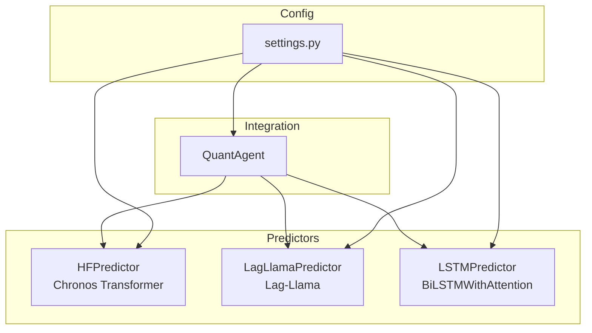
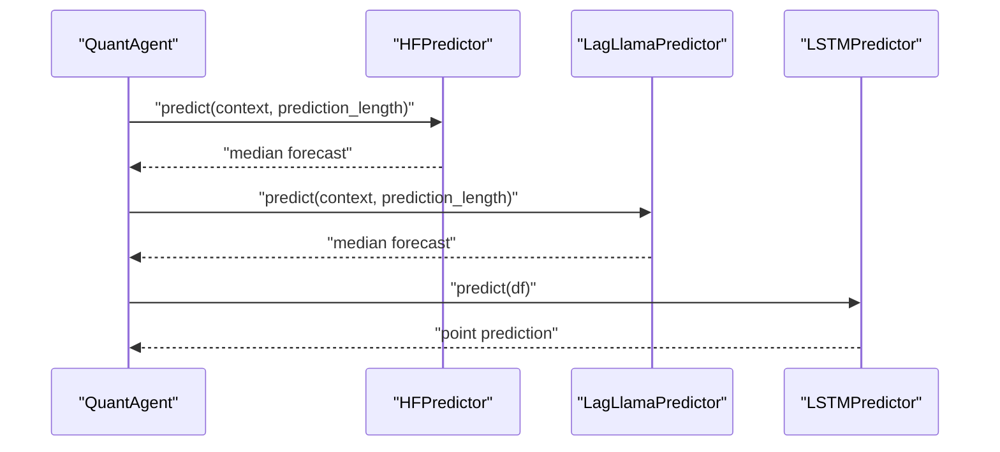
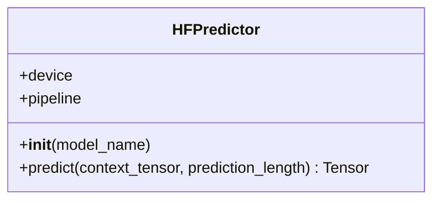
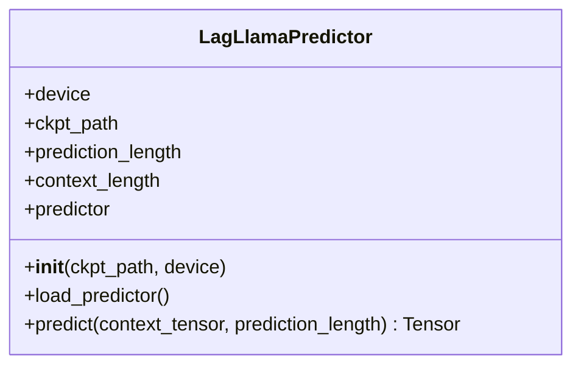
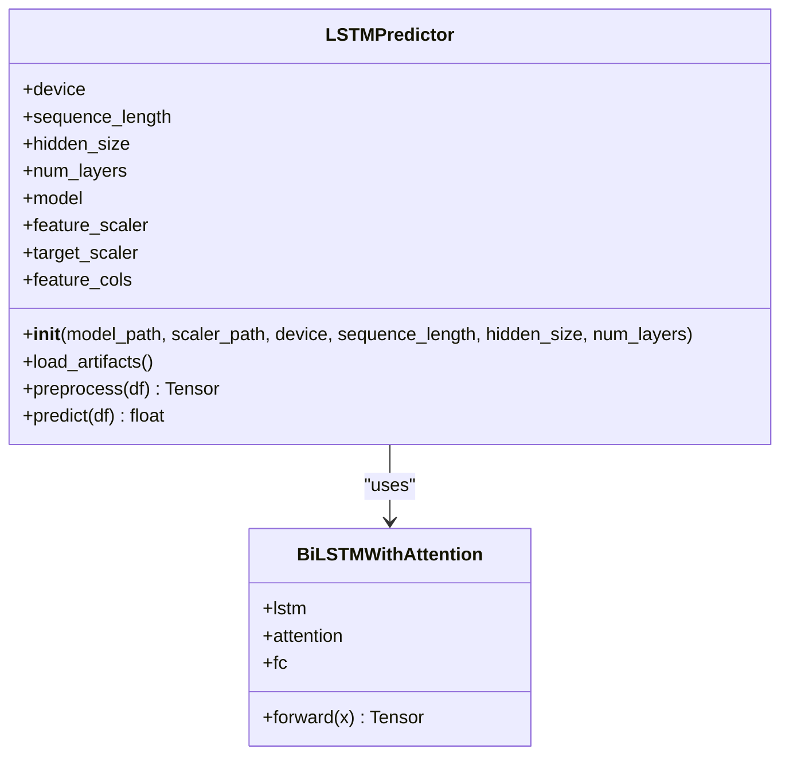
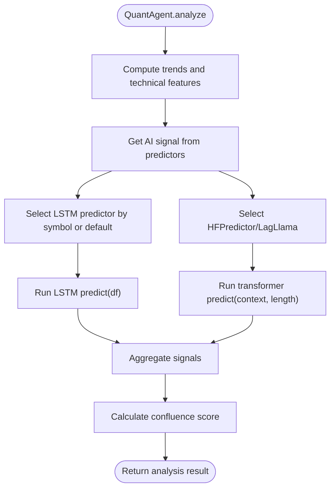
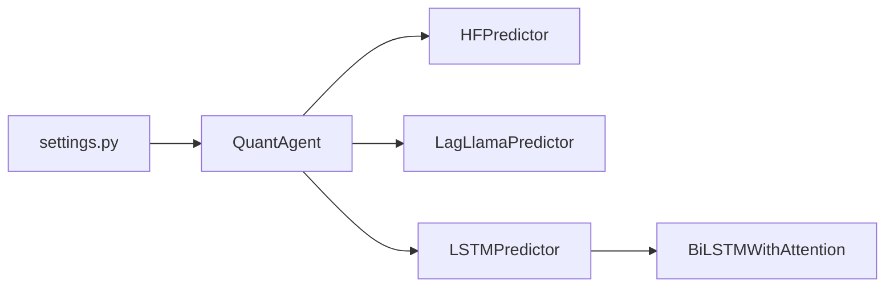

# Predictor Systems

<cite>
**Referenced Files in This Document**
- [hf_predictor.py](file://strategy/hf_predictor.py)
- [lag_llama_predictor.py](file://strategy/lag_llama_predictor.py)
- [lstm_predictor.py](file://strategy/lstm_predictor.py)
- [lstm_model.py](file://strategy/lstm_model.py)
- [quant_agent.py](file://analysis/quant_agent.py)
- [settings.py](file://config/settings.py)
- [main.py](file://main.py)
</cite>

## Table of Contents
1. [Introduction](#introduction)
2. [Project Structure](#project-structure)
3. [Core Components](#core-components)
4. [Architecture Overview](#architecture-overview)
5. [Detailed Component Analysis](#detailed-component-analysis)
6. [Dependency Analysis](#dependency-analysis)
7. [Performance Considerations](#performance-considerations)
8. [Troubleshooting Guide](#troubleshooting-guide)
9. [Conclusion](#conclusion)
10. [Appendices](#appendices)

## Introduction
This document describes the predictor systems used by the QuantAgent for forecasting financial time series. It covers:
- HuggingFace Chronos (Transformer-based) via HFPredictor
- Lag-Llama (Foundation model) via LagLlamaPredictor
- LSTM neural network predictors via LSTMPredictor and BiLSTMWithAttention

It explains initialization, device management, batch processing, prediction methods, result interpretation, availability detection, fallback mechanisms, and integration with the QuantAgent workflow.

## Project Structure
The predictor ecosystem spans several modules:
- Transformers: HFPredictor (Chronos) and LagLlamaPredictor
- Deep learning: LSTMPredictor and BiLSTMWithAttention
- Integration: QuantAgent orchestrates predictors and combines signals
- Configuration: settings.py defines feature flags and model paths

**Diagram sources**
- [quant_agent.py](file://analysis/quant_agent.py#L34-L108)
- [hf_predictor.py](file://strategy/hf_predictor.py#L15-L32)
- [lag_llama_predictor.py](file://strategy/lag_llama_predictor.py#L31-L44)
- [lstm_predictor.py](file://strategy/lstm_predictor.py#L9-L36)
- [lstm_model.py](file://strategy/lstm_model.py#L27-L69)
- [settings.py](file://config/settings.py#L187-L196)

**Section sources**
- [quant_agent.py](file://analysis/quant_agent.py#L34-L108)
- [settings.py](file://config/settings.py#L187-L196)

## Core Components
- HFPredictor: Loads a Chronos pipeline, selects device automatically, and predicts a median forecast given a context tensor and prediction length.
- LagLlamaPredictor: Factory-managed predictor that loads a Lag-Llama checkpoint, deduces configuration from weights, constructs estimator/predictor, and returns median forecasts.
- LSTMPredictor: Loads a trained BiLSTM model with attention, associated scalers and feature columns, performs preprocessing, and returns a point prediction with optional inverse scaling.
- BiLSTMWithAttention: Defines the LSTM backbone with attention and fully connected output head.
- QuantAgent: Detects availability of predictors, initializes them, and integrates their signals into scoring.

**Section sources**
- [hf_predictor.py](file://strategy/hf_predictor.py#L15-L52)
- [lag_llama_predictor.py](file://strategy/lag_llama_predictor.py#L31-L234)
- [lstm_predictor.py](file://strategy/lstm_predictor.py#L9-L142)
- [lstm_model.py](file://strategy/lstm_model.py#L5-L70)
- [quant_agent.py](file://analysis/quant_agent.py#L34-L108)

## Architecture Overview
The predictor architecture centers around the QuantAgent, which:
- Detects predictor availability and instantiates them based on settings
- Builds a context vector (recent close prices) for transformer-based models
- Prepares sequences and scales features for LSTM models
- Aggregates AI signals and combines with technical and ML signals

**Diagram sources**
- [quant_agent.py](file://analysis/quant_agent.py#L194-L226)
- [hf_predictor.py](file://strategy/hf_predictor.py#L34-L52)
- [lag_llama_predictor.py](file://strategy/lag_llama_predictor.py#L181-L228)
- [lstm_predictor.py](file://strategy/lstm_predictor.py#L115-L141)

## Detailed Component Analysis

### HFPredictor (Chronos Transformer)
- Initialization
  - Selects device automatically (CUDA if available)
  - Loads ChronosPipeline with appropriate dtype and device mapping
- Prediction
  - Accepts a context tensor of shape (batch, context_length)
  - Produces samples and returns the median path across samples
- Configuration
  - Model name is configurable
  - Prediction length is configurable
  - Uses bfloat16 on CUDA for speed/precision balance

**Diagram sources**
- [hf_predictor.py](file://strategy/hf_predictor.py#L15-L52)

**Section sources**
- [hf_predictor.py](file://strategy/hf_predictor.py#L15-L52)

### LagLlamaPredictor (Lag-Llama)
- Initialization
  - Supports local path or Hugging Face Hub download
  - Inspects checkpoint to deduce model depth
  - Constructs estimator with configured parameters and device
  - Manually loads weights into the Lightning module with shape checks
  - Creates transformation and predictor
- Prediction
  - Converts context tensor to a GluonTS ListDataset
  - Iterates forecasts and extracts median quantile
- Factory
  - get_lag_llama_predictor creates a predictor respecting device availability

**Diagram sources**
- [lag_llama_predictor.py](file://strategy/lag_llama_predictor.py#L31-L175)

**Section sources**
- [lag_llama_predictor.py](file://strategy/lag_llama_predictor.py#L31-L234)

### LSTMPredictor and BiLSTMWithAttention
- LSTMPredictor
  - Device selection with CUDA fallback
  - Loads artifacts: model weights, feature/target scalers, feature columns
  - Preprocessing pipeline: column filtering, scaling, sequence creation
  - Prediction: runs model in eval mode, optional inverse scaling
- BiLSTMWithAttention
  - Bidirectional LSTM with attention over sequence
  - Fully connected output for single-step prediction

**Diagram sources**
- [lstm_predictor.py](file://strategy/lstm_predictor.py#L9-L142)
- [lstm_model.py](file://strategy/lstm_model.py#L27-L69)

**Section sources**
- [lstm_predictor.py](file://strategy/lstm_predictor.py#L9-L142)
- [lstm_model.py](file://strategy/lstm_model.py#L5-L70)

### QuantAgent Integration and Workflow
- Availability detection
  - Attempts to import HuggingFace Chronos and Lag-Llama predictors
  - Loads LSTM predictors if available and configured
- Initialization
  - Initializes models based on settings flags and environment
- Signal fusion
  - Uses transformer predictions to derive directional signals
  - Uses LSTM predictions to derive directional signals
  - Aggregates signals into a unified AI signal used in confluence scoring

**Diagram sources**
- [quant_agent.py](file://analysis/quant_agent.py#L109-L226)

**Section sources**
- [quant_agent.py](file://analysis/quant_agent.py#L11-L26)
- [quant_agent.py](file://analysis/quant_agent.py#L52-L108)
- [quant_agent.py](file://analysis/quant_agent.py#L194-L226)

## Dependency Analysis
- Predictor availability flags in settings control whether predictors are loaded
- QuantAgent dynamically imports and instantiates predictors based on availability and settings
- Lag-Llama relies on a vendored estimator and custom weight loading logic
- LSTM depends on pre-trained weights and saved scalers/columns

**Diagram sources**
- [settings.py](file://config/settings.py#L187-L196)
- [quant_agent.py](file://analysis/quant_agent.py#L52-L108)
- [lstm_predictor.py](file://strategy/lstm_predictor.py#L9-L36)
- [lstm_model.py](file://strategy/lstm_model.py#L27-L69)

**Section sources**
- [settings.py](file://config/settings.py#L187-L196)
- [quant_agent.py](file://analysis/quant_agent.py#L52-L108)

## Performance Considerations
- Device selection
  - Predictors select CUDA if available; otherwise CPU
  - Transformers use bfloat16 on CUDA for efficiency
- Batch processing
  - Transformers accept batched contexts; ensure input tensors align with expectations
  - LSTM operates on single-row inference; batching is handled externally
- Memory and speed
  - Prefer CUDA for transformers and LSTM when available
  - Keep sequence length reasonable to balance accuracy and latency
- Weight loading
  - Lag-Llama manually loads weights with shape checks; mismatches are logged and skipped

[No sources needed since this section provides general guidance]

## Troubleshooting Guide
- Missing dependencies
  - Chronos import failure raises an explicit error; install the library or disable the feature
  - Lag-Llama requires the vendored estimator; ensure the path exists
- CUDA availability
  - If CUDA is unavailable, predictors fall back to CPU; verify device logs
- Model artifacts
  - LSTM requires model weights, feature scaler, target scaler, and feature columns; missing files produce warnings and may cause errors
- Prediction errors
  - LSTM preprocessing validates sequence length and feature columns; ensure sufficient data and correct column names
- Transformer context shapes
  - Ensure context tensors match expected shapes and devices

**Section sources**
- [hf_predictor.py](file://strategy/hf_predictor.py#L8-L18)
- [lstm_predictor.py](file://strategy/lstm_predictor.py#L37-L78)
- [lstm_predictor.py](file://strategy/lstm_predictor.py#L108-L113)
- [lag_llama_predictor.py](file://strategy/lag_llama_predictor.py#L46-L79)

## Conclusion
The predictor systems integrate transformer-based forecasting (Chronos/Lag-Llama) and deep learning (LSTM) into a unified QuantAgent workflow. Availability detection and factory-style initialization enable robust fallbacks, while careful preprocessing and device management ensure reliable performance across environments.

[No sources needed since this section summarizes without analyzing specific files]

## Appendices

### Predictor Initialization and Configuration
- HFPredictor
  - Model name and prediction length are configurable
  - Device and dtype are selected automatically
- LagLlamaPredictor
  - Checkpoint path supports local or Hugging Face Hub
  - Estimator parameters and device are configured at load time
- LSTMPredictor
  - Loads model and scalers from configured paths
  - Predefined sequence length and model dimensions

**Section sources**
- [hf_predictor.py](file://strategy/hf_predictor.py#L16-L32)
- [lag_llama_predictor.py](file://strategy/lag_llama_predictor.py#L32-L44)
- [lstm_predictor.py](file://strategy/lstm_predictor.py#L10-L36)

### Integration with QuantAgent
- Availability flags in settings control predictor loading
- Factory function ensures device-aware Lag-Llama instantiation
- Signals derived from predictors are aggregated into a unified AI signal

**Section sources**
- [settings.py](file://config/settings.py#L187-L196)
- [quant_agent.py](file://analysis/quant_agent.py#L75-L84)
- [quant_agent.py](file://analysis/quant_agent.py#L92-L107)
- [quant_agent.py](file://analysis/quant_agent.py#L202-L226)