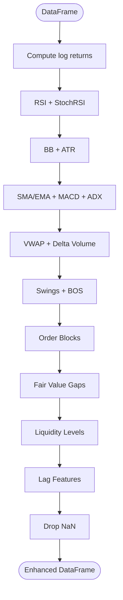

# Quant Agent Core

<cite>
**Referenced Files in This Document**
- [quant_agent.py](file://analysis/quant_agent.py)
- [features.py](file://strategy/features.py)
- [lstm_predictor.py](file://strategy/lstm_predictor.py)
- [lstm_model.py](file://strategy/lstm_model.py)
- [hf_predictor.py](file://strategy/hf_predictor.py)
- [lag_llama_predictor.py](file://strategy/lag_llama_predictor.py)
- [settings.py](file://config/settings.py)
- [best_params.json](file://models/best_params.json)
- [README.md](file://README.md)
- [pair_agent.py](file://strategy/pair_agent.py)
- [main.py](file://main.py)
</cite>

## Table of Contents
1. [Introduction](#introduction)
2. [Project Structure](#project-structure)
3. [Core Components](#core-components)
4. [Architecture Overview](#architecture-overview)
5. [Detailed Component Analysis](#detailed-component-analysis)
6. [Dependency Analysis](#dependency-analysis)
7. [Performance Considerations](#performance-considerations)
8. [Troubleshooting Guide](#troubleshooting-guide)
9. [Conclusion](#conclusion)
10. [Appendices](#appendices)

## Introduction
This document provides comprehensive documentation for the QuantAgent core class, which orchestrates multi-model inference (Random Forest, XGBoost), technical analysis (trend and confluence scoring), and AI forecasting signals (Lag-Llama/Chronos) to produce a unified ensemble score for trading decisions. It explains model loading, feature preparation, prediction scoring, and the confluence calculation system including trend analysis and technical indicator integration. It also covers model availability detection, fallback mechanisms, and performance considerations.

## Project Structure
The QuantAgent resides in the analysis module and integrates with:
- Feature engineering utilities in strategy.features
- LSTM predictor and model in strategy.lstm_predictor and strategy.lstm_model
- Hugging Face forecasting via strategy.hf_predictor or strategy.lag_llama_predictor
- Configuration in config.settings and model metadata in models/best_params.json
- Orchestration in strategy.pair_agent and the main entry point in main.py

**Diagram sources**
- [quant_agent.py](file://analysis/quant_agent.py#L34-L294)
- [features.py](file://strategy/features.py#L6-L98)
- [lstm_predictor.py](file://strategy/lstm_predictor.py#L9-L142)
- [lstm_model.py](file://strategy/lstm_model.py#L27-L70)
- [hf_predictor.py](file://strategy/hf_predictor.py#L15-L53)
- [lag_llama_predictor.py](file://strategy/lag_llama_predictor.py#L31-L235)
- [settings.py](file://config/settings.py#L173-L196)
- [best_params.json](file://models/best_params.json#L1-L6)
- [pair_agent.py](file://strategy/pair_agent.py#L71-L295)
- [main.py](file://main.py#L19-L122)

**Section sources**
- [README.md](file://README.md#L187-L235)
- [quant_agent.py](file://analysis/quant_agent.py#L34-L294)
- [settings.py](file://config/settings.py#L173-L196)

## Core Components
- QuantAgent: Central orchestrator for ML inference, technical analysis, AI forecasting, and confluence scoring.
- Feature Engineering: TA indicators and market structure features (order blocks, fair value gaps, liquidity).
- LSTM Predictor: PyTorch-based multi-symbol predictors with scaling and attention.
- Hugging Face Forecasters: Chronos (HFPredictor) and Lag-Llama (LagLlamaPredictor) for probabilistic forecasts.
- Configuration: Model paths, feature lists, and runtime flags for enabling components.

Key responsibilities:
- Multi-model inference (RF/XGBoost) with feature preparation and probability extraction.
- Trend computation across multiple timeframes.
- AI signal aggregation from LSTM and Hugging Face models.
- Confluence scoring (0–6) integrating ML, AI, trend, and structure filters.
- Ensemble scoring combining ML probability, AI signal, and confluence score.

**Section sources**
- [quant_agent.py](file://analysis/quant_agent.py#L34-L294)
- [features.py](file://strategy/features.py#L6-L98)
- [lstm_predictor.py](file://strategy/lstm_predictor.py#L9-L142)
- [hf_predictor.py](file://strategy/hf_predictor.py#L15-L53)
- [lag_llama_predictor.py](file://strategy/lag_llama_predictor.py#L31-L235)
- [settings.py](file://config/settings.py#L173-L196)

## Architecture Overview
The QuantAgent integrates:
- Model loading from disk with graceful fallbacks.
- Feature engineering pipeline for technical indicators and structure.
- Multi-model inference (RF/XGBoost) and optional AI forecasting.
- Trend analysis across M5/H1/H4.
- Confluence scoring and ensemble weighting.

**Diagram sources**
- [quant_agent.py](file://analysis/quant_agent.py#L109-L159)
- [features.py](file://strategy/features.py#L6-L98)
- [lstm_predictor.py](file://strategy/lstm_predictor.py#L115-L142)
- [hf_predictor.py](file://strategy/hf_predictor.py#L34-L53)
- [lag_llama_predictor.py](file://strategy/lag_llama_predictor.py#L181-L229)

## Detailed Component Analysis

### QuantAgent Class
Responsibilities:
- Load ML models (joblib) and feature columns.
- Load optional LSTM predictors per symbol and default.
- Load optional Hugging Face forecasting models (Chronos or Lag-Llama).
- Compute trends across multiple timeframes.
- Perform ML inference (RF/XGBoost) and prepare features.
- Aggregate AI signals from LSTM and Hugging Face models.
- Calculate confluence score (0–6) and ensemble score.
- Return structured analysis results.

Key methods:
- __init__: Initializes fields and loads models.
- _load_models: Loads RF/XGBoost, LSTM, and AI predictors with guarded imports.
- _load_lstm_models: Loads per-symbol and default LSTM predictors.
- analyze: Orchestrates the full analysis pipeline.
- _compute_trend: Computes trend using SMA comparison.
- _get_rf_prediction/_get_xgb_prediction: Extracts probabilities and predictions.
- _prepare_X: Prepares feature matrix from feature columns or drops non-feature columns.
- _get_ai_signal: Aggregates AI signals from Hugging Face and LSTM.
- _calculate_confluence: Scores trend, ML, AI, structure, and ADX filters.
- _ensemble_vote: Combines ML probability, AI signal, and confluence into ensemble score.

**Diagram sources**
- [quant_agent.py](file://analysis/quant_agent.py#L34-L294)

**Section sources**
- [quant_agent.py](file://analysis/quant_agent.py#L42-L108)
- [quant_agent.py](file://analysis/quant_agent.py#L109-L159)
- [quant_agent.py](file://analysis/quant_agent.py#L163-L294)

### Feature Preparation Pipeline
The feature engineering pipeline adds:
- Price returns and basic returns.
- Momentum indicators (RSI, Stochastic RSI).
- Volatility indicators (Bollinger Bands, ATR).
- Trend indicators (SMA/EMA, MACD, ADX).
- Volume indicators (VWAP, delta volume).
- Market structure (swings, BOS), order blocks, fair value gaps, liquidity.
- Lag features for returns, RSI, MACD difference.
- Drops NaN rows.

**Diagram sources**
- [features.py](file://strategy/features.py#L6-L98)
- [features.py](file://strategy/features.py#L101-L224)

**Section sources**
- [features.py](file://strategy/features.py#L6-L98)
- [features.py](file://strategy/features.py#L101-L224)

### LSTM Predictor and Model
The LSTM predictor:
- Loads feature scaler, target scaler, and feature column list.
- Builds a BiLSTM with attention model and evaluates it.
- Preprocesses sequences by scaling and slicing the last sequence_length rows.
- Predicts next value and inverse transforms if a target scaler exists.

**Diagram sources**
- [lstm_predictor.py](file://strategy/lstm_predictor.py#L9-L142)
- [lstm_model.py](file://strategy/lstm_model.py#L27-L70)

**Section sources**
- [lstm_predictor.py](file://strategy/lstm_predictor.py#L37-L142)
- [lstm_model.py](file://strategy/lstm_model.py#L27-L70)

### Hugging Face Forecasters
Two forecasting options are supported:
- HFPredictor: Chronos pipeline with quantile median forecast.
- LagLlamaPredictor: Downloads and reconstructs Lag-Llama weights, creates predictor, and returns median forecast.

**Diagram sources**
- [hf_predictor.py](file://strategy/hf_predictor.py#L15-L53)
- [lag_llama_predictor.py](file://strategy/lag_llama_predictor.py#L31-L235)

**Section sources**
- [hf_predictor.py](file://strategy/hf_predictor.py#L15-L53)
- [lag_llama_predictor.py](file://strategy/lag_llama_predictor.py#L31-L235)

### Confluence Calculation System
The confluence scoring aggregates:
- Trend filters (M5/H1/H4) aligned with direction.
- ML probability thresholds (RF probability) with directional checks.
- AI signal alignment (averaged from Hugging Face and LSTM).
- Structure filters (near order blocks/FVG and liquidity sweeps).
- ADX strength filter.

**Diagram sources**
- [quant_agent.py](file://analysis/quant_agent.py#L231-L293)

**Section sources**
- [quant_agent.py](file://analysis/quant_agent.py#L231-L293)

### Ensemble Voting Methodology
The ensemble combines:
- ML probability (RF/XGBoost) normalized to 0–1.
- AI signal normalized to 0–1 scale.
- Confluence score normalized to 0–1.

Weights: 0.3 (ML), 0.25 (AI), 0.45 (Confluence).

**Diagram sources**
- [quant_agent.py](file://analysis/quant_agent.py#L228-L229)

**Section sources**
- [quant_agent.py](file://analysis/quant_agent.py#L228-L229)

## Dependency Analysis
- QuantAgent depends on:
  - settings for model paths, feature lists, and runtime flags.
  - features for technical indicators.
  - LSTM predictor for symbol-specific and default forecasts.
  - Hugging Face predictors for probabilistic forecasts.
- PairAgent orchestrates QuantAgent usage and applies additional risk and regime filters.

**Diagram sources**
- [settings.py](file://config/settings.py#L173-L196)
- [quant_agent.py](file://analysis/quant_agent.py#L52-L84)
- [pair_agent.py](file://strategy/pair_agent.py#L145-L161)
- [main.py](file://main.py#L57-L63)

**Section sources**
- [settings.py](file://config/settings.py#L173-L196)
- [quant_agent.py](file://analysis/quant_agent.py#L52-L84)
- [pair_agent.py](file://strategy/pair_agent.py#L145-L161)
- [main.py](file://main.py#L57-L63)

## Performance Considerations
- Model loading optimization:
  - XGBoost single-row inference optimization sets device to CPU to avoid warnings.
  - LSTM devices selected automatically (GPU if available).
- Feature preparation:
  - Uses pre-saved feature columns when available to minimize drift.
  - Drops non-feature columns to reduce overhead.
- Inference:
  - RF/XGBoost predict_proba calls operate on a single-row slice.
  - LSTM and Hugging Face predictions are guarded with try/except to prevent failures from blocking.
- Memory and I/O:
  - Feature scalers and model artifacts are loaded once per predictor.
  - Per-symbol LSTM predictors are cached in a dictionary keyed by base symbol.

[No sources needed since this section provides general guidance]

## Troubleshooting Guide
Common issues and remedies:
- Model load errors:
  - RF/XGBoost model path not found or unreadable.
  - Feature columns file missing; ensure _features.pkl exists alongside the model.
  - XGBoost device parameter setting may fail on some environments; code attempts to set device and continues on failure.
- LSTM predictor errors:
  - Missing scaler or column files cause warnings; ensure scaler and column files exist for the symbol.
  - Not enough data for sequence length raises an error; ensure sufficient historical bars.
  - Target scaler not found; inverse transform falls back to raw prediction.
- Hugging Face predictor errors:
  - Chronos not installed leads to ImportError; install via documented command.
  - Lag-Llama checkpoint download or weight reconstruction may fail; verify network access and repository path.
- Confluence scoring:
  - If insufficient data or missing indicators, the analysis returns None; ensure adequate bars and indicator availability.
- Ensemble scoring:
  - If no AI signals are available, AI component defaults to neutral; ensemble remains valid.

**Section sources**
- [quant_agent.py](file://analysis/quant_agent.py#L68-L84)
- [lstm_predictor.py](file://strategy/lstm_predictor.py#L37-L78)
- [lstm_predictor.py](file://strategy/lstm_predictor.py#L108-L113)
- [lstm_predictor.py](file://strategy/lstm_predictor.py#L139-L141)
- [hf_predictor.py](file://strategy/hf_predictor.py#L17-L18)
- [lag_llama_predictor.py](file://strategy/lag_llama_predictor.py#L46-L79)

## Conclusion
The QuantAgent provides a robust, modular framework for multi-model inference and confluence scoring. It integrates classical ML (RF/XGBoost), deep learning (LSTM), and modern forecasting (Chronos/Lag-Llama) with technical analysis and trend filters. Its design emphasizes resilience through guarded imports and fallbacks, efficient feature preparation, and a clear scoring methodology that balances ML confidence, AI signals, and structural/market context.

[No sources needed since this section summarizes without analyzing specific files]

## Appendices

### Model Loading and Availability Detection
- RF/XGBoost:
  - Load model and feature columns from configured paths.
  - Optionally set XGBoost device to CPU for single-row inference.
- LSTM:
  - Attempt to load per-symbol predictors for EURUSD, XAUUSD, BTCUSD, GBPUSD.
  - Fall back to a default model if per-symbol models are unavailable.
- Hugging Face:
  - Try Lag-Llama predictor factory; otherwise fall back to Chronos HFPredictor if available.

**Section sources**
- [quant_agent.py](file://analysis/quant_agent.py#L52-L84)
- [settings.py](file://config/settings.py#L173-L196)

### Prediction Execution and Scoring Examples
- Model loading:
  - See QuantAgent initialization and model loading routines.
- Prediction execution:
  - RF/XGBoost: call _get_rf_prediction or _get_xgb_prediction with a single-row DataFrame slice prepared by _prepare_X.
  - LSTM: call _get_ai_signal to compute symbol-specific or default LSTM prediction.
  - Hugging Face: call _get_ai_signal to compute median forecast and derive signal.
- Scoring:
  - Confluence score computed via _calculate_confluence.
  - Ensemble score computed via _ensemble_vote.

**Section sources**
- [quant_agent.py](file://analysis/quant_agent.py#L171-L186)
- [quant_agent.py](file://analysis/quant_agent.py#L202-L227)
- [quant_agent.py](file://analysis/quant_agent.py#L231-L293)
- [quant_agent.py](file://analysis/quant_agent.py#L228-L229)

### Best Practices and Configuration
- Use best_params.json to align thresholds with walk-forward optimization.
- Ensure feature columns match the model’s expectations.
- Monitor trend filters and session gating to avoid counter-trend entries.
- Validate spread and volatility thresholds before entering trades.

**Section sources**
- [best_params.json](file://models/best_params.json#L1-L6)
- [settings.py](file://config/settings.py#L77-L108)
- [pair_agent.py](file://strategy/pair_agent.py#L171-L234)