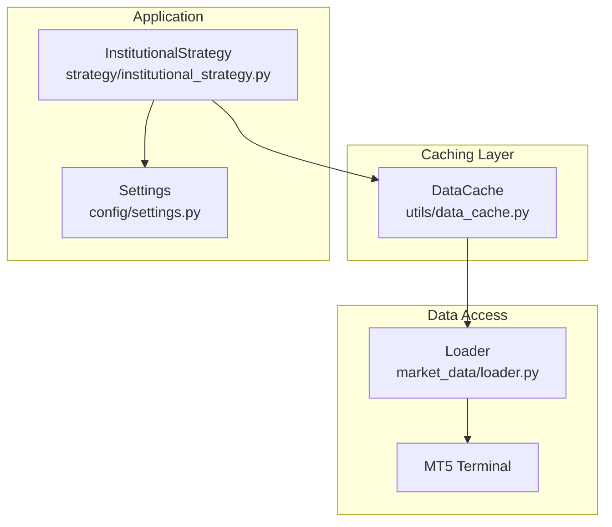
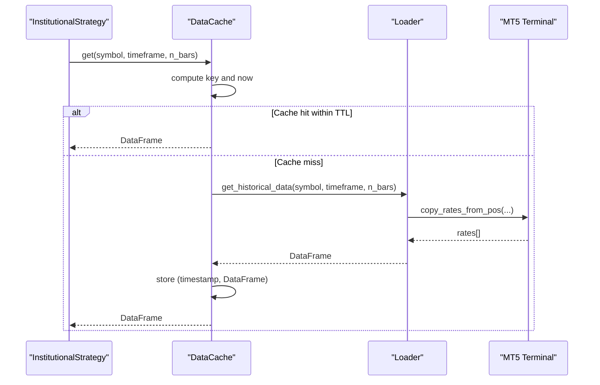
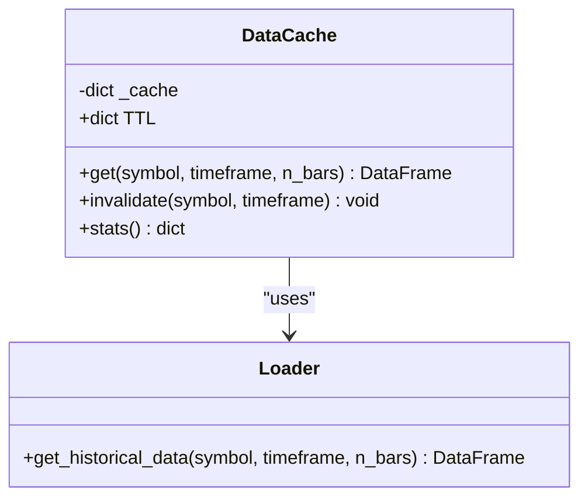
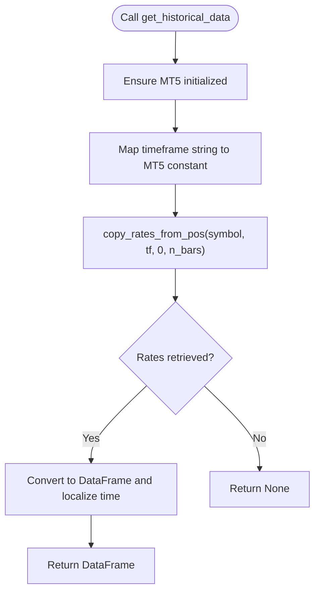
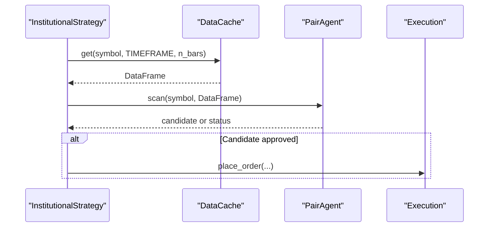
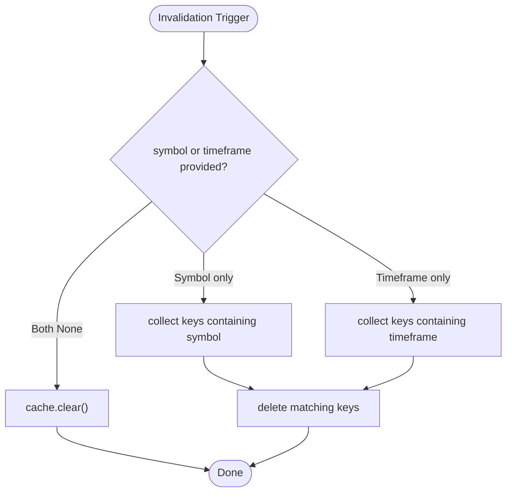
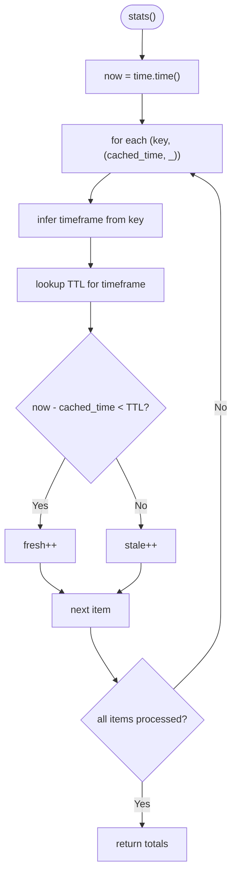
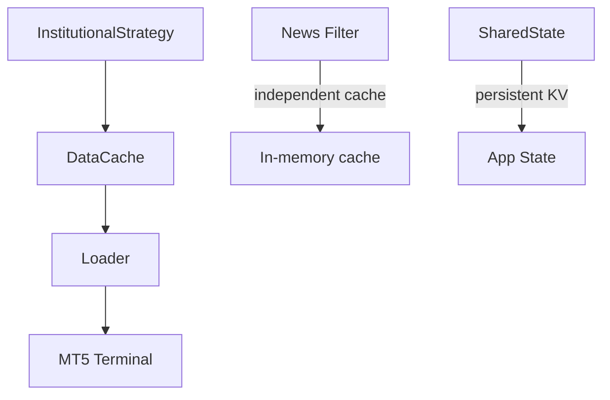

# Data Caching System

<cite>
**Referenced Files in This Document**
- [data_cache.py](file://utils/data_cache.py)
- [loader.py](file://market_data/loader.py)
- [settings.py](file://config/settings.py)
- [institutional_strategy.py](file://strategy/institutional_strategy.py)
- [async_utils.py](file://utils/async_utils.py)
- [news_filter.py](file://utils/news_filter.py)
- [shared_state.py](file://utils/shared_state.py)
</cite>

## Table of Contents
1. [Introduction](#introduction)
2. [Project Structure](#project-structure)
3. [Core Components](#core-components)
4. [Architecture Overview](#architecture-overview)
5. [Detailed Component Analysis](#detailed-component-analysis)
6. [Dependency Analysis](#dependency-analysis)
7. [Performance Considerations](#performance-considerations)
8. [Troubleshooting Guide](#troubleshooting-guide)
9. [Conclusion](#conclusion)
10. [Appendices](#appendices)

## Introduction
This document describes the data caching system designed to reduce redundant MetaTrader 5 (MT5) API calls and improve performance. It explains the caching strategy, storage mechanisms, expiration policies, memory management, invalidation strategies, cache statistics, warming procedures, thread safety, synchronization, persistence, and configuration options. It also provides troubleshooting guidance and optimization techniques tailored to the scanning and trading pipeline.

## Project Structure
The caching system is centered around a lightweight in-memory cache with time-to-live (TTL) expiration. It integrates with the market data loader to fetch historical bars from MT5 and is consumed by the orchestrating strategy that runs scanning loops in parallel.

**Diagram sources**
- [data_cache.py](file://utils/data_cache.py#L16-L76)
- [loader.py](file://market_data/loader.py#L40-L59)
- [institutional_strategy.py](file://strategy/institutional_strategy.py#L74-L74)

**Section sources**
- [data_cache.py](file://utils/data_cache.py#L1-L76)
- [loader.py](file://market_data/loader.py#L1-L83)
- [settings.py](file://config/settings.py#L1-L201)
- [institutional_strategy.py](file://strategy/institutional_strategy.py#L1-L500)

## Core Components
- DataCache: Thread-safe in-memory cache keyed by symbol and timeframe with TTL-based freshness checks. It stores tuples of (timestamp, DataFrame) and exposes get, invalidate, and stats methods.
- Loader: Provides historical data retrieval from MT5, including initialization and multi-timeframe fetching helpers.
- InstitutionalStrategy: Uses DataCache to supply multi-timeframe data to agents and scanners, and coordinates global checks and trade execution.
- Settings: Supplies configuration such as timeframe, history bar counts, and cache-related parameters.
- Async Utilities: Provides async execution helpers and a rate limiter with locks for concurrency control.
- News Filter: Demonstrates a separate in-memory cache pattern with TTL and global cache variable.
- Shared State: Persistent key-value store using SQLite for cross-process/state recovery.

**Section sources**
- [data_cache.py](file://utils/data_cache.py#L16-L76)
- [loader.py](file://market_data/loader.py#L40-L83)
- [institutional_strategy.py](file://strategy/institutional_strategy.py#L74-L74)
- [settings.py](file://config/settings.py#L63-L64)
- [async_utils.py](file://utils/async_utils.py#L1-L45)
- [news_filter.py](file://utils/news_filter.py#L109-L156)
- [shared_state.py](file://utils/shared_state.py#L23-L110)

## Architecture Overview
The caching architecture is a thin wrapper around in-memory storage with TTL. On cache hit, the cached DataFrame is returned immediately. On miss, the loader fetches from MT5, updates the cache, and returns the data. The strategy coordinates scanning and uses the cache to avoid repeated MT5 calls across agents and timeframes.

**Diagram sources**
- [institutional_strategy.py](file://strategy/institutional_strategy.py#L439-L447)
- [data_cache.py](file://utils/data_cache.py#L30-L48)
- [loader.py](file://market_data/loader.py#L40-L59)

## Detailed Component Analysis

### DataCache: TTL-based In-Memory Cache
- Purpose: Reduce MT5 API calls by caching historical bars per symbol/timeframe with TTL.
- Storage: Dictionary mapping composite key "symbol_timeframe" to (timestamp, DataFrame).
- TTL Policy: Configurable per timeframe; defaults include M15 (5 min), H1 (15 min), H4 (60 min), D1 (2 hours).
- Freshness Check: Compares current time minus cached timestamp against TTL.
- Invalidation: Clear entire cache or selectively remove entries by symbol or timeframe.
- Statistics: Reports total entries, fresh, and stale counts.

**Diagram sources**
- [data_cache.py](file://utils/data_cache.py#L16-L76)
- [loader.py](file://market_data/loader.py#L40-L59)

**Section sources**
- [data_cache.py](file://utils/data_cache.py#L16-L76)

### Loader: MT5 Historical Data Access
- Initializes MT5 terminal and logs in if needed.
- Converts timeframe strings to MT5 constants.
- Fetches historical bars and converts timestamps to pandas datetime.
- Provides multi-timeframe aggregation helper for scanning.

**Diagram sources**
- [loader.py](file://market_data/loader.py#L24-L59)

**Section sources**
- [loader.py](file://market_data/loader.py#L24-L83)

### InstitutionalStrategy: Cache Usage and Coordination
- Creates a single DataCache instance and uses it to fetch data for scanning.
- Uses cache.get to retrieve recent bars for the configured timeframe and for candle detection.
- Coordinates parallel scanning and trade execution, relying on cached data to minimize MT5 calls.

**Diagram sources**
- [institutional_strategy.py](file://strategy/institutional_strategy.py#L439-L447)
- [institutional_strategy.py](file://strategy/institutional_strategy.py#L132-L140)

**Section sources**
- [institutional_strategy.py](file://strategy/institutional_strategy.py#L74-L74)
- [institutional_strategy.py](file://strategy/institutional_strategy.py#L439-L447)
- [institutional_strategy.py](file://strategy/institutional_strategy.py#L132-L140)

### Cache Invalidation Strategies
- Selective Invalidation: Remove entries matching a symbol or timeframe to force reloads.
- Full Clear: Invalidate entire cache to recover from corrupted state or after major regime changes.
- Time-based: TTL naturally expires stale entries; manual invalidation accelerates refresh under volatility spikes or timeframe transitions.

**Diagram sources**
- [data_cache.py](file://utils/data_cache.py#L50-L64)

**Section sources**
- [data_cache.py](file://utils/data_cache.py#L50-L64)

### Cache Statistics and Metrics
- Stats Method: Computes total entries, fresh (within TTL), and stale counts.
- Use Cases: Monitor cache effectiveness, tune TTLs, and detect memory pressure.

**Diagram sources**
- [data_cache.py](file://utils/data_cache.py#L66-L76)

**Section sources**
- [data_cache.py](file://utils/data_cache.py#L66-L76)

### Cache Warming Procedures
- Warm-up on Startup: Pre-fetch essential timeframes for detected symbols to reduce latency during first scans.
- Multi-Timeframe Batch: Use loader’s multi-timeframe helper to fetch M15/H1/H4 in one pass for scanning.
- Periodic Refresh: Invoke selective invalidation or rely on TTL to refresh periodically.

**Section sources**
- [loader.py](file://market_data/loader.py#L62-L82)
- [institutional_strategy.py](file://strategy/institutional_strategy.py#L79-L86)

### Thread Safety and Concurrency
- Current Implementation: DataCache uses a plain dictionary and performs lookups and updates without explicit locks. It does not expose a public lock and relies on Python’s GIL for basic atomicity of small operations.
- Concurrency Risks: Concurrent reads/writes across threads could lead to race conditions (e.g., simultaneous cache misses triggering duplicate fetches).
- Mitigation Strategies:
  - Use a lock around cache access if accessed from multiple threads.
  - Prefer a single-threaded access pattern or ensure cache operations are serialized.
  - Consider replacing the plain dict with a thread-safe container if contention arises.
- Async Context: The strategy runs in an asyncio loop; ensure cache access remains non-blocking and consider wrapping blocking operations if needed.

**Section sources**
- [data_cache.py](file://utils/data_cache.py#L19-L20)
- [data_cache.py](file://utils/data_cache.py#L37-L41)
- [async_utils.py](file://utils/async_utils.py#L9-L16)

### Cache Persistence and Recovery
- In-Memory Only: DataCache persists only in RAM; no disk persistence is implemented.
- Recovery Mechanisms:
  - Rebuild cache on demand by invalidating and refetching.
  - Use SharedState for persistent state (e.g., daily trade counts) that can inform cache invalidation decisions.
- Disk-Based Alternatives: For long-term persistence, consider extending DataCache to serialize to disk or integrate with a dedicated caching library supporting persistence.

**Section sources**
- [data_cache.py](file://utils/data_cache.py#L19-L20)
- [shared_state.py](file://utils/shared_state.py#L23-L110)

### Configuration Options
- Timeframe and Bars:
  - Primary timeframe is set via settings.TIMEFRAME.
  - History bar counts influence cache size and memory footprint.
- TTL Tuning:
  - Adjust TTL values per timeframe in DataCache.TTL to balance freshness vs. API cost.
- Invalidation Hooks:
  - Use invalidate(symbol, timeframe) to react to regime changes, news events, or timeframe switches.

**Section sources**
- [settings.py](file://config/settings.py#L63-L64)
- [settings.py](file://config/settings.py#L169-L171)
- [data_cache.py](file://utils/data_cache.py#L23-L28)
- [data_cache.py](file://utils/data_cache.py#L50-L64)

## Dependency Analysis
The caching system depends on the loader for MT5 access and is consumed by the strategy. Auxiliary modules demonstrate complementary caching patterns (news filter) and persistence (shared state).

**Diagram sources**
- [data_cache.py](file://utils/data_cache.py#L13-L13)
- [loader.py](file://market_data/loader.py#L1-L10)
- [institutional_strategy.py](file://strategy/institutional_strategy.py#L26-L27)
- [news_filter.py](file://utils/news_filter.py#L109-L156)
- [shared_state.py](file://utils/shared_state.py#L21-L21)

**Section sources**
- [data_cache.py](file://utils/data_cache.py#L13-L13)
- [loader.py](file://market_data/loader.py#L1-L10)
- [institutional_strategy.py](file://strategy/institutional_strategy.py#L26-L27)
- [news_filter.py](file://utils/news_filter.py#L109-L156)
- [shared_state.py](file://utils/shared_state.py#L21-L21)

## Performance Considerations
- Cache Hit Ratio: Improve by aligning TTLs with scanning cadence and ensuring warm cache on startup.
- Memory Footprint: Control by limiting n_bars and number of concurrent symbols/timeframes cached.
- API Call Reduction: The cache aims to cut hundreds of MT5 calls per scan cycle by avoiding redundant retrievals.
- Concurrency: If multiple threads access the cache, introduce locks or serialize access to prevent duplicate fetches and inconsistent states.
- Rate Limiting: While not directly part of the cache, consider integrating a rate limiter to smooth MT5 API usage.

[No sources needed since this section provides general guidance]

## Troubleshooting Guide
- Symptoms: Frequent cache misses, slow scans, or stale data.
  - Actions:
    - Inspect cache stats to confirm freshness ratios.
    - Increase TTL for less volatile timeframes or decrease for fast-moving assets.
    - Invalidate selectively by symbol/timeframe after major events.
- Symptoms: Memory growth or high RAM usage.
  - Actions:
    - Reduce n_bars or prune unused symbols/timeframes.
    - Periodically clear the cache to free memory.
- Symptoms: Inconsistent data across agents.
  - Actions:
    - Ensure single DataCache instance is shared across agents.
    - Add locks around cache access if accessed from multiple threads.
- Symptoms: MT5 errors or timeouts.
  - Actions:
    - Verify loader initialization and connectivity.
    - Introduce retry/backoff and consider rate limiting.

**Section sources**
- [data_cache.py](file://utils/data_cache.py#L66-L76)
- [data_cache.py](file://utils/data_cache.py#L50-L64)
- [loader.py](file://market_data/loader.py#L24-L37)
- [async_utils.py](file://utils/async_utils.py#L18-L44)

## Conclusion
The DataCache provides a pragmatic, TTL-driven in-memory cache that significantly reduces MT5 API calls during scanning. Its simplicity enables quick wins in performance, but production deployments should consider thread safety, TTL tuning, and selective invalidation strategies. For extended resilience, combine the in-memory cache with persistent state and consider persistence for the cache itself if needed.

[No sources needed since this section summarizes without analyzing specific files]

## Appendices

### Configuration Reference
- Timeframe: Primary scanning timeframe.
- History Bars: Controls cache data size.
- TTL Values: Tune per timeframe for optimal balance of freshness and cost.

**Section sources**
- [settings.py](file://config/settings.py#L63-L64)
- [settings.py](file://config/settings.py#L169-L171)
- [data_cache.py](file://utils/data_cache.py#L23-L28)