# Data Loader Architecture

<cite>
**Referenced Files in This Document**
- [loader.py](file://market_data/loader.py)
- [mt5_client.py](file://execution/mt5_client.py)
- [settings.py](file://config/settings.py)
- [data_cache.py](file://utils/data_cache.py)
- [async_utils.py](file://utils/async_utils.py)
- [main.py](file://main.py)
- [institutional_strategy.py](file://strategy/institutional_strategy.py)
- [risk_manager.py](file://utils/risk_manager.py)
- [news_filter.py](file://utils/news_filter.py)
</cite>

## Table of Contents
1. [Introduction](#introduction)
2. [Project Structure](#project-structure)
3. [Core Components](#core-components)
4. [Architecture Overview](#architecture-overview)
5. [Detailed Component Analysis](#detailed-component-analysis)
6. [Dependency Analysis](#dependency-analysis)
7. [Performance Considerations](#performance-considerations)
8. [Troubleshooting Guide](#troubleshooting-guide)
9. [Conclusion](#conclusion)

## Introduction
This document describes the MarketDataLoader architecture responsible for connecting to the MetaTrader 5 terminal, authenticating, managing connections, and fetching historical market data. It covers the timeframe mapping system, historical data retrieval functions, error handling strategies, connection management, symbol availability checks, market hours validation, and performance optimizations such as caching and asynchronous execution.

## Project Structure
The MarketDataLoader sits within the market_data package and integrates with configuration, execution, and utility modules. The primary entry points for MT5 connectivity are centralized in the execution layer, while data fetching is encapsulated in the loader module. Utilities provide caching and async execution helpers.

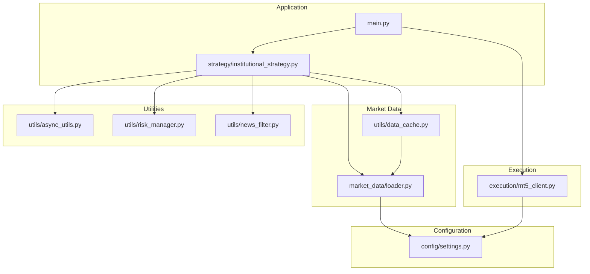

**Diagram sources**
- [loader.py](file://market_data/loader.py#L1-L83)
- [mt5_client.py](file://execution/mt5_client.py#L1-L385)
- [settings.py](file://config/settings.py#L1-L201)
- [data_cache.py](file://utils/data_cache.py#L1-L77)
- [async_utils.py](file://utils/async_utils.py#L1-L45)
- [main.py](file://main.py#L1-L122)
- [institutional_strategy.py](file://strategy/institutional_strategy.py#L1-L200)
- [risk_manager.py](file://utils/risk_manager.py#L117-L176)
- [news_filter.py](file://utils/news_filter.py#L176-L204)

**Section sources**
- [loader.py](file://market_data/loader.py#L1-L83)
- [mt5_client.py](file://execution/mt5_client.py#L1-L385)
- [settings.py](file://config/settings.py#L1-L201)
- [data_cache.py](file://utils/data_cache.py#L1-L77)
- [async_utils.py](file://utils/async_utils.py#L1-L45)
- [main.py](file://main.py#L1-L122)
- [institutional_strategy.py](file://strategy/institutional_strategy.py#L1-L200)

## Core Components
- MarketDataLoader: Provides MT5 connection initialization, authentication, and historical data retrieval functions.
- MT5Client: Encapsulates MT5 connection lifecycle and symbol availability detection.
- DataCache: TTL-based caching layer to reduce redundant MT5 API calls.
- Async utilities: Thread pool executor and rate limiter for non-blocking operations.
- Configuration: Centralized settings for MT5 credentials, server path, and trading parameters.

Key responsibilities:
- Initialize MT5 terminal and authenticate with credentials from environment variables.
- Convert string timeframes to MT5 constants and fetch historical bars.
- Provide multi-timeframe data aggregation for analysis.
- Manage cache TTLs per timeframe to optimize performance.
- Integrate with risk and news filters for session-aware trading decisions.

**Section sources**
- [loader.py](file://market_data/loader.py#L12-L83)
- [mt5_client.py](file://execution/mt5_client.py#L12-L105)
- [data_cache.py](file://utils/data_cache.py#L16-L77)
- [settings.py](file://config/settings.py#L7-L11)

## Architecture Overview
The system follows a layered architecture:
- Application layer orchestrates scanning and trading.
- Execution layer manages MT5 connectivity and symbol detection.
- Market data layer handles historical data retrieval and caching.
- Utilities provide async execution and risk/session validation.

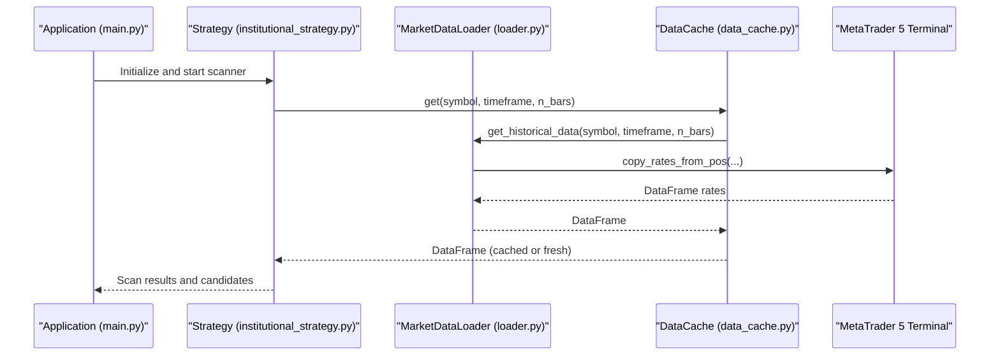

**Diagram sources**
- [main.py](file://main.py#L75-L105)
- [institutional_strategy.py](file://strategy/institutional_strategy.py#L99-L184)
- [data_cache.py](file://utils/data_cache.py#L30-L48)
- [loader.py](file://market_data/loader.py#L40-L59)

## Detailed Component Analysis

### MT5 Connection Initialization and Authentication
The connection process is handled by the execution layer and the loader module:
- MT5Client.connect initializes the terminal and logs in using credentials from settings.
- MarketDataLoader.initial_connect performs a secondary initialization and login if needed.
- Settings are loaded from environment variables for login, server, and terminal path.

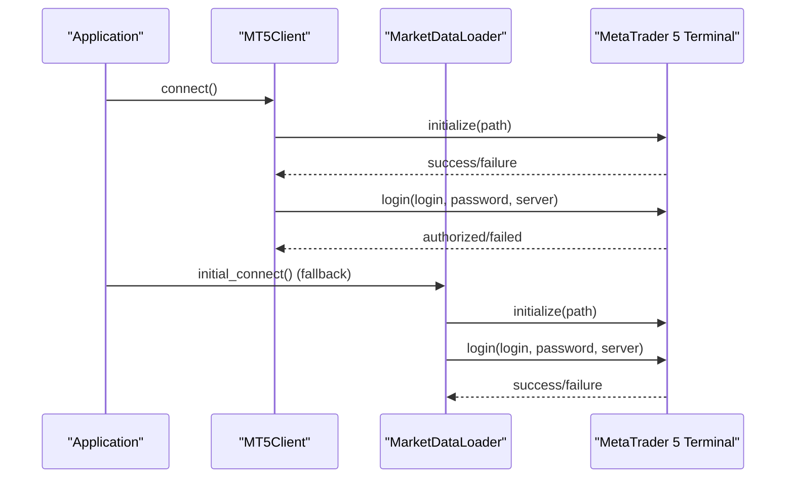

**Diagram sources**
- [mt5_client.py](file://execution/mt5_client.py#L18-L27)
- [loader.py](file://market_data/loader.py#L24-L37)
- [settings.py](file://config/settings.py#L8-L11)

**Section sources**
- [mt5_client.py](file://execution/mt5_client.py#L18-L27)
- [loader.py](file://market_data/loader.py#L24-L37)
- [settings.py](file://config/settings.py#L8-L11)

### Timeframe Mapping System
The loader defines a mapping from string timeframes to MT5 constants. This ensures consistent conversion across data retrieval functions.

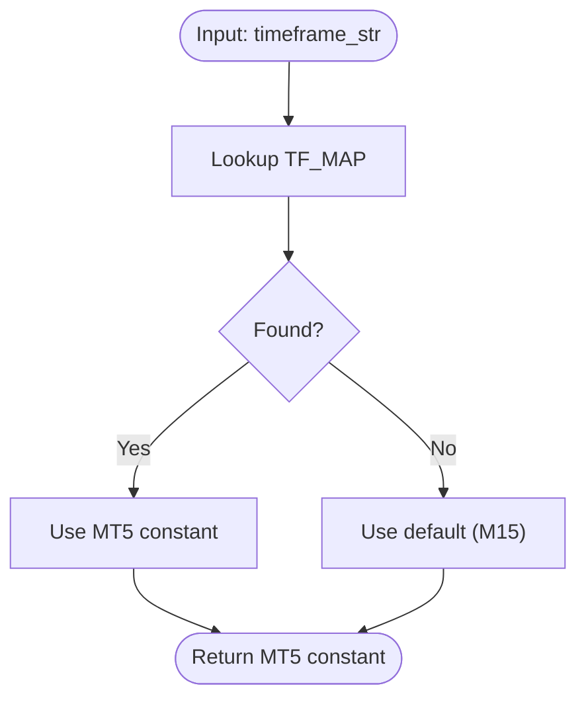

**Diagram sources**
- [loader.py](file://market_data/loader.py#L13-L21)

**Section sources**
- [loader.py](file://market_data/loader.py#L13-L21)

### Historical Data Retrieval Functions
- get_historical_data: Validates terminal connection, converts timeframe, fetches rates, and returns a DataFrame with timestamps converted.
- get_multi_timeframe_data: Aggregates M15, H1, and H4 data for a given symbol, scaling bar counts per timeframe.

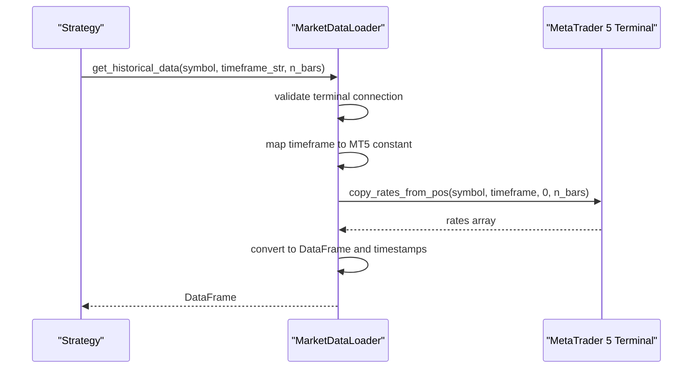

**Diagram sources**
- [loader.py](file://market_data/loader.py#L40-L59)

**Section sources**
- [loader.py](file://market_data/loader.py#L40-L82)

### Multi-Timeframe Data Aggregation
The multi-timeframe function computes bar counts per timeframe and aggregates results into a dictionary keyed by timeframe strings.

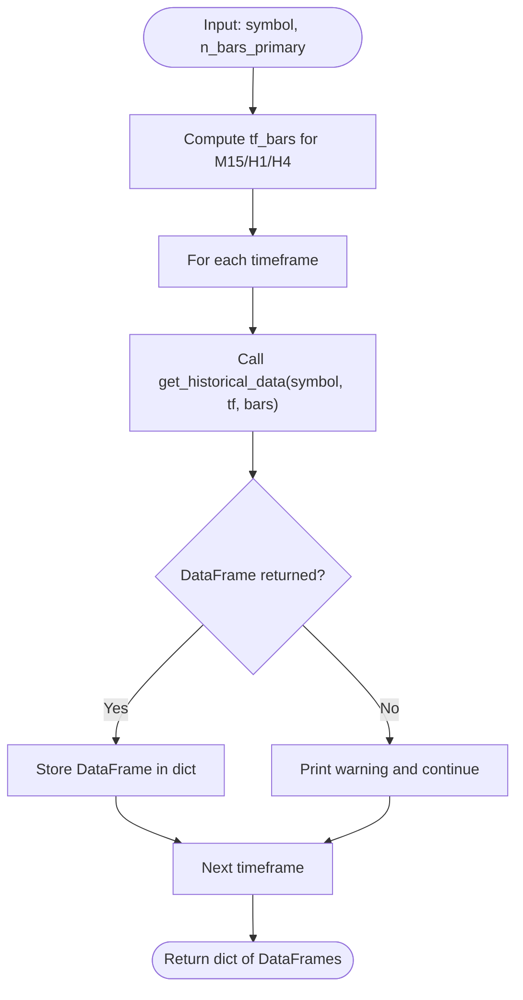

**Diagram sources**
- [loader.py](file://market_data/loader.py#L62-L82)

**Section sources**
- [loader.py](file://market_data/loader.py#L62-L82)

### Connection Management and Symbol Availability
- MT5Client.detect_available_symbols auto-detects available instruments on the account by testing base symbols with Exness suffixes and categorizes them by asset class.
- Settings are updated at runtime with discovered symbols and categories.

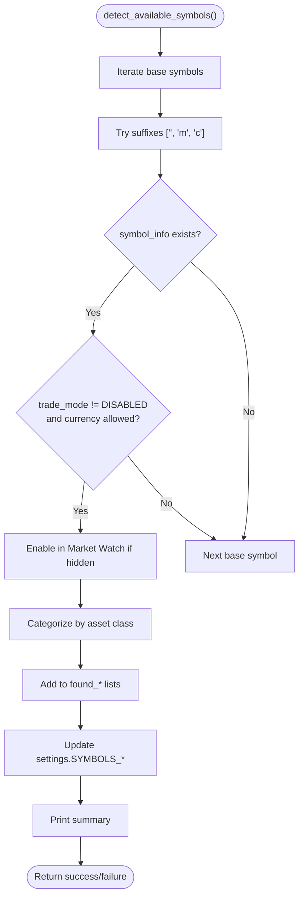

**Diagram sources**
- [mt5_client.py](file://execution/mt5_client.py#L29-L101)
- [settings.py](file://config/settings.py#L17-L60)

**Section sources**
- [mt5_client.py](file://execution/mt5_client.py#L29-L101)
- [settings.py](file://config/settings.py#L17-L60)

### Market Hours Validation and Session Awareness
Risk manager enforces session gating for non-crypto symbols based on configured sessions. News blackout detection prevents trading during high-impact events.

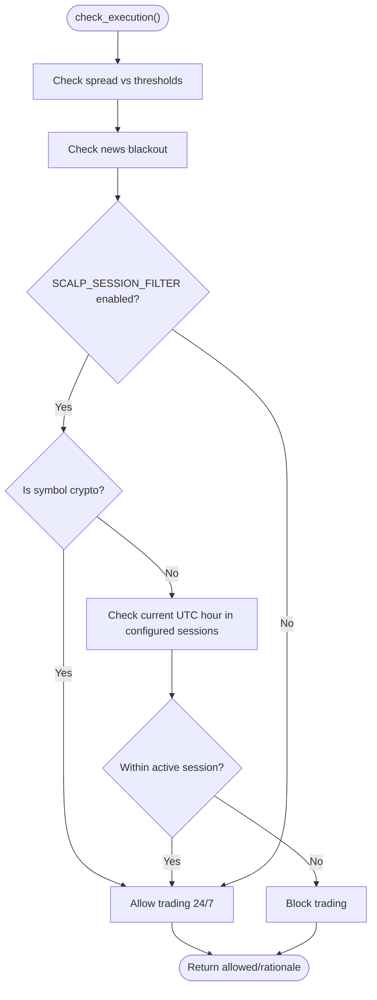

**Diagram sources**
- [risk_manager.py](file://utils/risk_manager.py#L117-L163)
- [settings.py](file://config/settings.py#L110-L116)
- [news_filter.py](file://utils/news_filter.py#L176-L204)

**Section sources**
- [risk_manager.py](file://utils/risk_manager.py#L117-L163)
- [settings.py](file://config/settings.py#L110-L116)
- [news_filter.py](file://utils/news_filter.py#L176-L204)

### Data Caching and Performance Optimization
DataCache reduces redundant MT5 API calls by caching DataFrames with TTL per timeframe. It invalidates entries selectively and reports cache statistics.

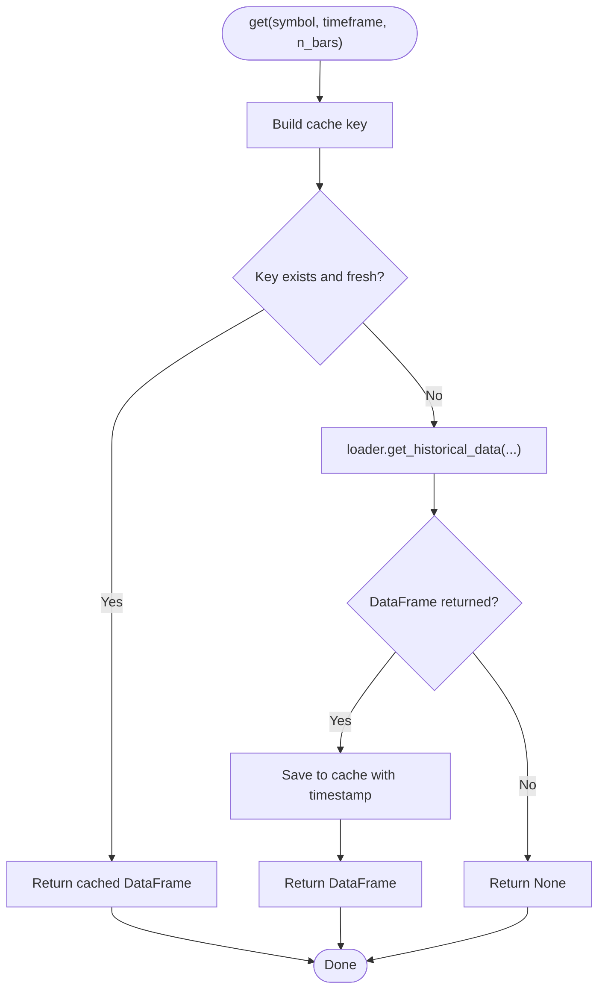

**Diagram sources**
- [data_cache.py](file://utils/data_cache.py#L30-L48)
- [loader.py](file://market_data/loader.py#L40-L59)

**Section sources**
- [data_cache.py](file://utils/data_cache.py#L16-L77)
- [loader.py](file://market_data/loader.py#L40-L59)

### Asynchronous Execution and Rate Limiting
Async utilities provide a thread pool executor to run blocking MT5 calls without blocking the asyncio event loop. A simple token bucket rate limiter can throttle requests.

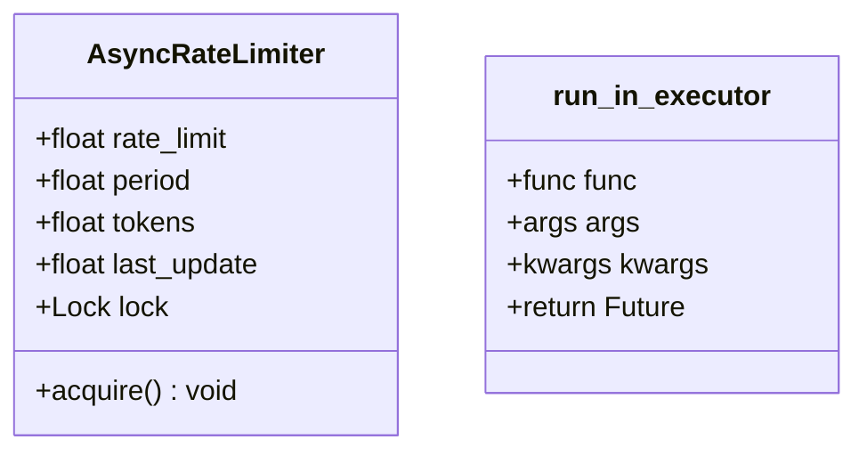

**Diagram sources**
- [async_utils.py](file://utils/async_utils.py#L18-L45)

**Section sources**
- [async_utils.py](file://utils/async_utils.py#L6-L16)
- [async_utils.py](file://utils/async_utils.py#L18-L45)

## Dependency Analysis
The MarketDataLoader depends on:
- MT5 constants and functions for data retrieval.
- Settings for credentials and terminal path.
- DataCache for performance optimization.
- Risk and news utilities for session-aware trading decisions.

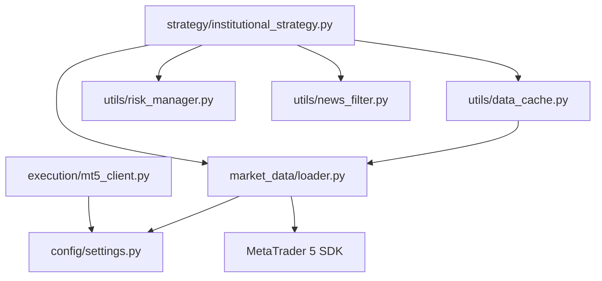

**Diagram sources**
- [loader.py](file://market_data/loader.py#L1-L10)
- [data_cache.py](file://utils/data_cache.py#L12-L13)
- [institutional_strategy.py](file://strategy/institutional_strategy.py#L23-L35)
- [risk_manager.py](file://utils/risk_manager.py#L117-L163)
- [news_filter.py](file://utils/news_filter.py#L176-L204)
- [mt5_client.py](file://execution/mt5_client.py#L1-L9)

**Section sources**
- [loader.py](file://market_data/loader.py#L1-L10)
- [data_cache.py](file://utils/data_cache.py#L12-L13)
- [institutional_strategy.py](file://strategy/institutional_strategy.py#L23-L35)

## Performance Considerations
- Caching: DataCache reduces MT5 API calls by caching per timeframe with TTLs tailored to data volatility.
- Batched multi-timeframe retrieval: get_multi_timeframe_data consolidates multiple requests into a single scan cycle.
- Asynchronous execution: run_in_executor allows non-blocking MT5 calls in an asyncio loop.
- Rate limiting: AsyncRateLimiter can smooth request bursts to avoid throttling.
- Session-aware filtering: Risk manager and news filter prevent unnecessary data fetches during off-hours or blackout periods.

[No sources needed since this section provides general guidance]

## Troubleshooting Guide
Common connection problems and resolutions:
- Initialization failure: Verify MT5 terminal path in settings and ensure the executable exists.
- Login failure: Confirm login credentials and server name in environment variables.
- No terminal info: The loader attempts a fallback initialization; ensure the terminal is running and accessible.
- No rates returned: Check symbol availability and visibility; use MT5Client.detect_available_symbols to auto-detect instruments.
- Spread too high: Adjust thresholds in settings or avoid trading during high-spread periods.
- Off-session trading: Enable session filters and align trading windows with London/NY opens.
- News blackout: Avoid trading during scheduled high-impact events.

Practical steps:
- Validate environment variables for MT5 credentials and terminal path.
- Use MT5Client.detect_available_symbols to confirm instrument availability.
- Monitor cache hit ratio via DataCache.stats to assess effectiveness.
- Review logs for MT5 error codes printed during initialization and login.

**Section sources**
- [loader.py](file://market_data/loader.py#L24-L37)
- [mt5_client.py](file://execution/mt5_client.py#L29-L101)
- [data_cache.py](file://utils/data_cache.py#L66-L77)
- [risk_manager.py](file://utils/risk_manager.py#L117-L163)
- [news_filter.py](file://utils/news_filter.py#L176-L204)

## Conclusion
The MarketDataLoader architecture provides a robust foundation for MT5 data retrieval with clear separation of concerns. It integrates connection management, timeframe mapping, caching, and session-aware risk controls to support efficient and reliable trading workflows. By leveraging caching and async execution, the system minimizes API overhead and improves responsiveness, while built-in validation ensures data quality and compliance with trading policies.