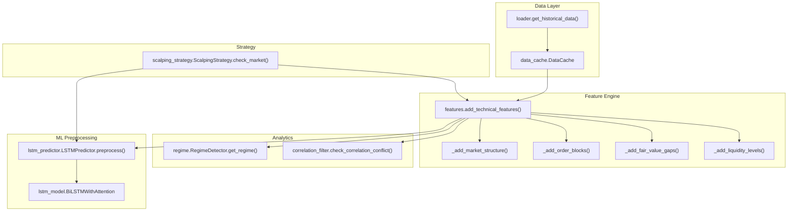
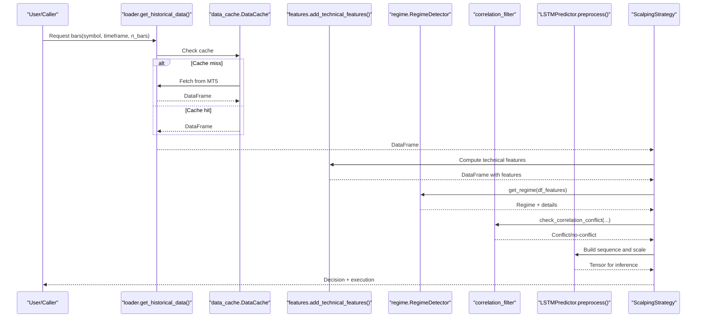
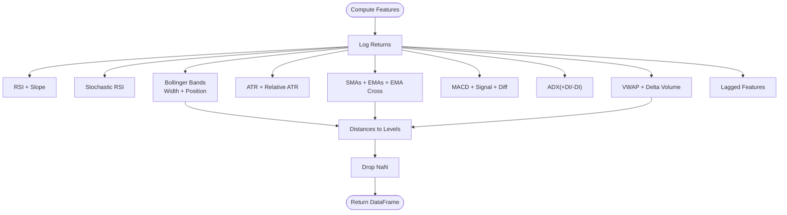
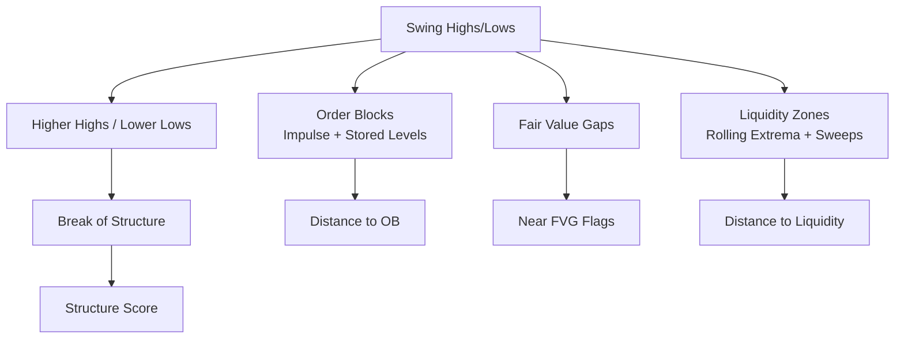
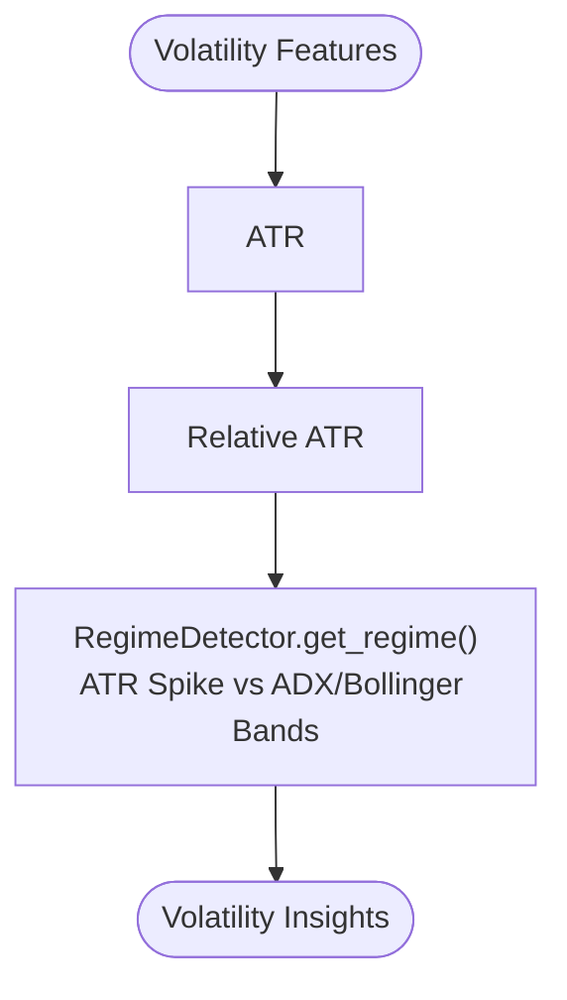
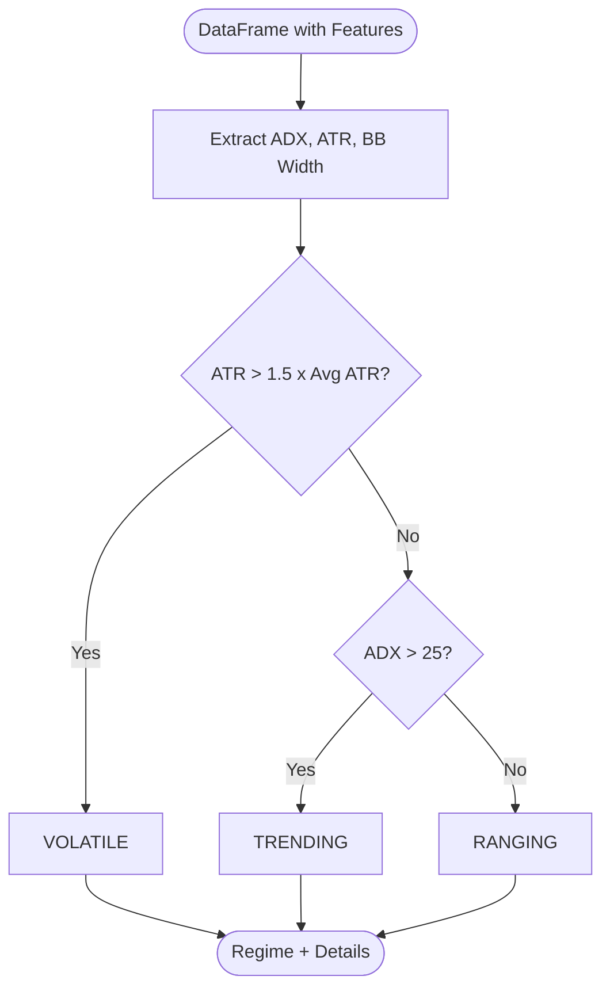
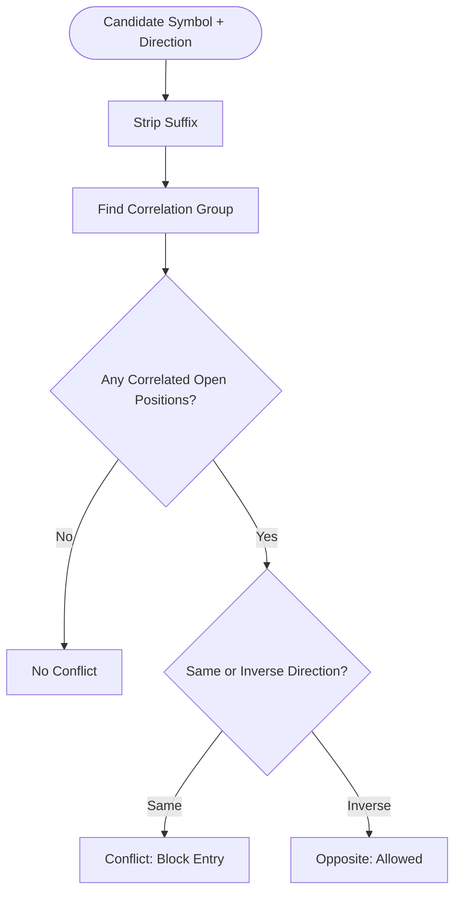
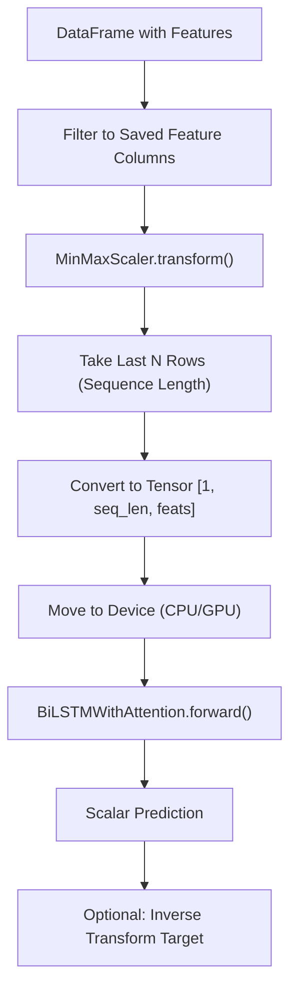
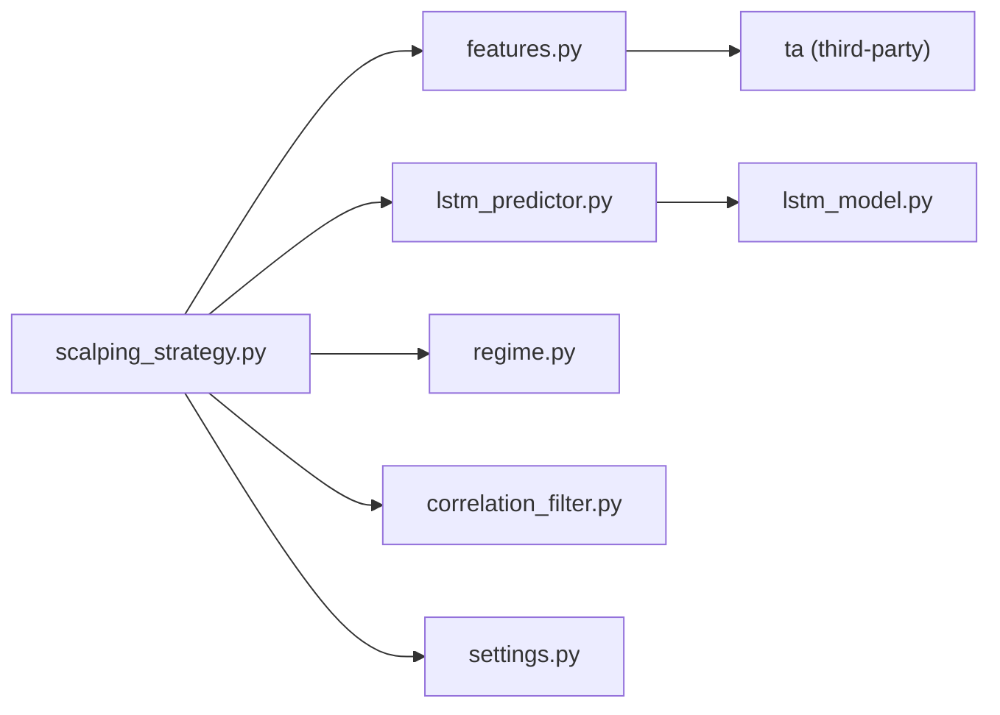

# Feature Engineering Pipeline

<cite>
**Referenced Files in This Document**
- [features.py](file://strategy/features.py)
- [loader.py](file://market_data/loader.py)
- [regime.py](file://analysis/regime.py)
- [correlation_filter.py](file://utils/correlation_filter.py)
- [data_cache.py](file://utils/data_cache.py)
- [scalping_strategy.py](file://strategy/scalping_strategy.py)
- [lstm_predictor.py](file://strategy/lstm_predictor.py)
- [lstm_model.py](file://strategy/lstm_model.py)
- [settings.py](file://config/settings.py)
- [auto_trainer.py](file://utils/auto_trainer.py)
</cite>

## Table of Contents
1. [Introduction](#introduction)
2. [Project Structure](#project-structure)
3. [Core Components](#core-components)
4. [Architecture Overview](#architecture-overview)
5. [Detailed Component Analysis](#detailed-component-analysis)
6. [Dependency Analysis](#dependency-analysis)
7. [Performance Considerations](#performance-considerations)
8. [Troubleshooting Guide](#troubleshooting-guide)
9. [Conclusion](#conclusion)
10. [Appendices](#appendices)

## Introduction
This document describes the feature engineering pipeline used to construct robust technical features for automated trading. It covers indicator calculations (moving averages, RSI, Bollinger Bands, MACD, ADX), advanced market structure features (order blocks, fair value gaps, liquidity), volatility measures (ATR), regime classification, correlation filtering, and preprocessing for machine learning models. It also documents scaling and normalization, feature selection, and practical guidance for parameter tuning, lookback selection, and combining indicators.

## Project Structure
The feature engineering pipeline spans several modules:
- Data ingestion and caching for multi-timeframe bars
- Indicator and feature generation
- Market regime detection
- Correlation-based filters
- Preprocessing for ML models (including LSTM)
- Live strategy integration and model usage

**Diagram sources**
- [loader.py](file://market_data/loader.py#L40-L82)
- [data_cache.py](file://utils/data_cache.py#L30-L48)
- [features.py](file://strategy/features.py#L6-L98)
- [regime.py](file://analysis/regime.py#L12-L57)
- [correlation_filter.py](file://utils/correlation_filter.py#L77-L116)
- [lstm_predictor.py](file://strategy/lstm_predictor.py#L79-L113)
- [lstm_model.py](file://strategy/lstm_model.py#L27-L69)
- [scalping_strategy.py](file://strategy/scalping_strategy.py#L160-L181)

**Section sources**
- [loader.py](file://market_data/loader.py#L1-L83)
- [data_cache.py](file://utils/data_cache.py#L1-L77)
- [features.py](file://strategy/features.py#L1-L242)
- [regime.py](file://analysis/regime.py#L1-L58)
- [correlation_filter.py](file://utils/correlation_filter.py#L1-L117)
- [lstm_predictor.py](file://strategy/lstm_predictor.py#L1-L142)
- [lstm_model.py](file://strategy/lstm_model.py#L1-L70)
- [scalping_strategy.py](file://strategy/scalping_strategy.py#L1-L291)

## Core Components
- Technical indicators and derived features: log returns, RSI, stochastic RSI, Bollinger Bands, ATR, moving averages, MACD, ADX, plus lagged features.
- Market structure features: swing highs/lows, higher-highs/lower-lows, break-of-structure, order blocks, fair value gaps, liquidity zones.
- Volatility and regime detection: ATR-based volatility filter and regime classification (trending, ranging, volatile).
- Correlation filtering: prevents entering correlated symbols in the same direction.
- Preprocessing for ML: scaling, sequence construction, and inference pipeline for LSTM.
- Strategy integration: live feature computation and model scoring within a scalping strategy.

**Section sources**
- [features.py](file://strategy/features.py#L6-L98)
- [regime.py](file://analysis/regime.py#L12-L57)
- [correlation_filter.py](file://utils/correlation_filter.py#L77-L116)
- [lstm_predictor.py](file://strategy/lstm_predictor.py#L79-L113)
- [scalping_strategy.py](file://strategy/scalping_strategy.py#L160-L181)

## Architecture Overview
The pipeline follows a data-first approach:
- Historical bars are fetched via MT5 and optionally cached.
- Features are computed in a single pass over the DataFrame.
- Optional analytics (regime, correlation) inform gating decisions.
- Preprocessing transforms features into model-ready tensors for LSTM.
- The strategy consumes the final feature vector to compute predictions and decide entries.

**Diagram sources**
- [loader.py](file://market_data/loader.py#L40-L82)
- [data_cache.py](file://utils/data_cache.py#L30-L48)
- [features.py](file://strategy/features.py#L6-L98)
- [regime.py](file://analysis/regime.py#L12-L57)
- [correlation_filter.py](file://utils/correlation_filter.py#L77-L116)
- [lstm_predictor.py](file://strategy/lstm_predictor.py#L79-L113)
- [scalping_strategy.py](file://strategy/scalping_strategy.py#L160-L181)

## Detailed Component Analysis

### Technical Indicators and Derived Features
- Price returns: log returns computed from close prices.
- Momentum: RSI and stochastic RSI.
- Volatility: Bollinger Bands (width and position), ATR and relative ATR.
- Trend: SMAs, EMAs, EMA cross signal.
- Trend strength: ADX (+DI, -DI).
- Volume: VWAP approximation, delta volume, signed delta, volume anomalies.
- Lag features: lagged log returns, RSI, MACD difference.

Implementation highlights:
- Uses a third-party TA library for canonical indicator computations.
- Adds slopes and ratios to improve signal discrimination.
- Normalizes distances to central tendencies (e.g., BB position, distances from MAs).
- Computes lagged features to capture persistence and mean-reversion signals.

**Diagram sources**
- [features.py](file://strategy/features.py#L14-L98)

**Section sources**
- [features.py](file://strategy/features.py#L6-L98)

### Market Structure Features
- Swing detection: rolling windows around highs/lows.
- Higher-highs/lower-lows: trend continuation signals.
- Break-of-Structure: price closes beyond prior swing extremes.
- Order Blocks: identified via candle impulsive moves and stored levels.
- Fair Value Gaps: detected across three-candle spans and tracked.
- Liquidity Zones: rolling highs/lows and sweeps.

**Diagram sources**
- [features.py](file://strategy/features.py#L101-L224)

**Section sources**
- [features.py](file://strategy/features.py#L101-L224)

### Volatility Calculation Methods
- ATR: standard window-based Average True Range.
- Relative ATR: normalized by price to compare across assets.
- Volatility regime detection: compares current ATR to moving average to label “volatile”.

**Diagram sources**
- [features.py](file://strategy/features.py#L27-L37)
- [regime.py](file://analysis/regime.py#L12-L57)

**Section sources**
- [features.py](file://strategy/features.py#L27-L37)
- [regime.py](file://analysis/regime.py#L12-L57)

### Market Regime Detection
- Classifies regimes using ADX, ATR, and Bollinger Band width.
- Provides diagnostic details for transparency.

**Diagram sources**
- [regime.py](file://analysis/regime.py#L12-L57)

**Section sources**
- [regime.py](file://analysis/regime.py#L12-L57)

### Correlation Analysis and Filtering
- Groups symbols by correlation clusters (e.g., EUR group, USD index, risk-on, metals).
- Strips account-specific suffixes to match base symbols.
- Confirms conflicts across direct and inverse correlations.

**Diagram sources**
- [correlation_filter.py](file://utils/correlation_filter.py#L59-L116)

**Section sources**
- [correlation_filter.py](file://utils/correlation_filter.py#L1-L117)

### Feature Scaling, Normalization, and Preprocessing
- Min-Max scaling is used in training contexts for feature and target variables.
- LSTM preprocessing:
  - Loads feature and target scalers and feature column list.
  - Drops non-feature columns and scales features.
  - Builds a fixed-length sequence from the most recent rows.
  - Moves data to device (CPU/GPU) and returns a tensor for inference.

**Diagram sources**
- [lstm_predictor.py](file://strategy/lstm_predictor.py#L79-L113)
- [lstm_model.py](file://strategy/lstm_model.py#L27-L69)

**Section sources**
- [lstm_predictor.py](file://strategy/lstm_predictor.py#L79-L113)
- [lstm_model.py](file://strategy/lstm_model.py#L1-L70)

### Feature Selection Criteria and Dimensionality Reduction
- During inference, the strategy either uses a pre-saved feature column list or drops known non-feature columns.
- Training-time feature selection occurs in the auto-trainer and model trainers, which save the selected columns alongside the model.

Practical guidance:
- Prefer explicit feature lists for reproducibility.
- Use domain knowledge to keep only relevant features (e.g., remove OHLC if modeling returns).
- Consider PCA or feature importance from tree-based models for dimensionality reduction in training.

**Section sources**
- [scalping_strategy.py](file://strategy/scalping_strategy.py#L174-L178)
- [lstm_predictor.py](file://strategy/lstm_predictor.py#L87-L100)

### Feature Importance Analysis
- Tree-based models (Random Forest, XGBoost) provide built-in importance metrics.
- The auto-trainer saves feature lists with trained models for consistent inference.

Recommendations:
- Track permutation importance or SHAP values during training.
- Periodically re-compute importances on recent data to adapt to regime shifts.

**Section sources**
- [auto_trainer.py](file://utils/auto_trainer.py#L196-L200)

### Technical Indicator Parameter Optimization and Lookback Selection
- Window sizes are chosen to balance responsiveness and reliability (e.g., 14-day RSI/ATR/ADX, 20-day BB, 20-day SMA/EMA).
- Lookback periods for structure features are tuned to reduce whipsaws while capturing meaningful swings.
- Lag features help capture persistence; choose lags based on expected holding horizons.

Guidelines:
- Backtest multiple windows and select those maximizing Sharpe or expectancy on out-of-sample data.
- Use regime-aware windows (e.g., shorter windows in trending regimes).

**Section sources**
- [features.py](file://strategy/features.py#L18-L63)
- [features.py](file://strategy/features.py#L101-L128)

### Indicator Combination Strategies
- Combine trend filters (ADX, EMA cross) with momentum (RSI, MACD) and volatility (ATR).
- Use structure features (BOS, order blocks) to confirm confluence.
- Gate entries with regime and correlation filters.

**Section sources**
- [features.py](file://strategy/features.py#L39-L87)
- [regime.py](file://analysis/regime.py#L12-L57)
- [correlation_filter.py](file://utils/correlation_filter.py#L77-L116)

### Feature Validation, Outlier Detection, and Data Quality Checks
- Drop NaN values after feature computation to avoid model errors.
- Use ATR thresholds to gate entries and avoid low-vol environments.
- Validate feature shapes and column presence before inference.
- Monitor sequence length to ensure sufficient history for LSTM.

**Section sources**
- [features.py](file://strategy/features.py#L95-L98)
- [lstm_predictor.py](file://strategy/lstm_predictor.py#L107-L109)
- [settings.py](file://config/settings.py#L104-L108)

### Examples of Custom Feature Creation
- Ratio features: volume SMA ratio, relative ATR.
- Distance features: normalized distance to MAs, BB position, liquidity levels.
- Interaction terms: product of price and volume, or slope of RSI.
- Higher-order features: squared returns, exponential smoothing of returns.

These can be added by extending the feature function similarly to existing patterns.

**Section sources**
- [features.py](file://strategy/features.py#L67-L82)
- [features.py](file://strategy/features.py#L46-L49)
- [features.py](file://strategy/features.py#L32-L33)

### Performance Optimization for Feature Computation and Batch Processing
- Caching: TTL-based caching reduces redundant MT5 API calls.
- Vectorized operations: leverage pandas/numpy for fast indicator computations.
- Batch fetching: multi-timeframe data retrieval minimizes repeated calls.
- Device placement: move tensors to GPU when available for LSTM inference.

**Section sources**
- [data_cache.py](file://utils/data_cache.py#L16-L48)
- [loader.py](file://market_data/loader.py#L62-L82)
- [lstm_predictor.py](file://strategy/lstm_predictor.py#L11-L19)

## Dependency Analysis
Key dependencies and coupling:
- Strategy depends on feature computation and ML predictors.
- Features depend on TA library for indicators.
- Regime and correlation filters are standalone analytics.
- LSTM predictor depends on saved scalers and model artifacts.

**Diagram sources**
- [scalping_strategy.py](file://strategy/scalping_strategy.py#L14-L16)
- [features.py](file://strategy/features.py#L3)
- [regime.py](file://analysis/regime.py#L5-L6)
- [correlation_filter.py](file://utils/correlation_filter.py#L1-L2)
- [lstm_predictor.py](file://strategy/lstm_predictor.py#L6-L7)
- [lstm_model.py](file://strategy/lstm_model.py#L1-L3)
- [settings.py](file://config/settings.py#L1-L6)

**Section sources**
- [scalping_strategy.py](file://strategy/scalping_strategy.py#L14-L16)
- [features.py](file://strategy/features.py#L3)
- [regime.py](file://analysis/regime.py#L5-L6)
- [correlation_filter.py](file://utils/correlation_filter.py#L1-L2)
- [lstm_predictor.py](file://strategy/lstm_predictor.py#L6-L7)
- [lstm_model.py](file://strategy/lstm_model.py#L1-L3)
- [settings.py](file://config/settings.py#L1-L6)

## Performance Considerations
- Prefer vectorized computations over loops for indicator windows.
- Cache frequently accessed multi-timeframe datasets with appropriate TTLs.
- Use GPU acceleration for LSTM inference when available.
- Keep feature sets minimal and aligned with model capabilities.
- Validate sequence lengths and device memory limits before inference.

[No sources needed since this section provides general guidance]

## Troubleshooting Guide
- Missing feature columns during LSTM inference: ensure the saved feature list matches the DataFrame columns.
- Insufficient sequence length: increase history or reduce sequence length.
- No bars returned from MT5: verify credentials, connectivity, and symbol availability.
- Regime misclassification: adjust thresholds or incorporate additional filters.
- Correlation conflicts: review correlation groups and open positions.

**Section sources**
- [lstm_predictor.py](file://strategy/lstm_predictor.py#L87-L100)
- [lstm_predictor.py](file://strategy/lstm_predictor.py#L107-L109)
- [loader.py](file://market_data/loader.py#L24-L37)
- [regime.py](file://analysis/regime.py#L23-L24)
- [correlation_filter.py](file://utils/correlation_filter.py#L84-L116)

## Conclusion
The feature engineering pipeline integrates canonical technical indicators, advanced market structure features, volatility and regime analytics, and robust preprocessing for ML models. It emphasizes reproducibility, performance, and adaptability to changing market conditions through caching, regime-aware logic, and correlation filtering.

[No sources needed since this section summarizes without analyzing specific files]

## Appendices

### Appendix A: Feature List Reference
- Price returns: log_ret
- Momentum: rsi, rsi_slope, stoch_rsi_k, stoch_rsi_d
- Volatility: bb_high, bb_low, bb_width, bb_pos, atr, atr_rel
- Trend: sma_20, sma_50, ema_9, ema_21, dist_sma_20, dist_sma_50, ema_cross
- Trend strength: adx, adx_pos, adx_neg
- MACD: macd, macd_signal, macd_diff
- Volume: vwap, dist_vwap, vol_sma, vol_ratio, delta_vol, delta_vol_cumsum, delta_vol_ratio
- Structure: swing_high, swing_low, is_swing_high, is_swing_low, higher_high, lower_low, bos_bullish, bos_bearish, structure_score
- Order blocks: ob_bullish, ob_bearish, dist_ob_bullish, dist_ob_bearish, near_ob_bullish, near_ob_bearish
- Fair value gaps: fvg_bullish, fvg_bearish, near_fvg_bullish, near_fvg_bearish
- Liquidity: liq_high, liq_low, dist_liq_high, dist_liq_low, liq_sweep_high, liq_sweep_low
- Lag features: log_ret_lag_1..5, rsi_lag_1..5, macd_diff_lag_1..5

**Section sources**
- [features.py](file://strategy/features.py#L14-L98)