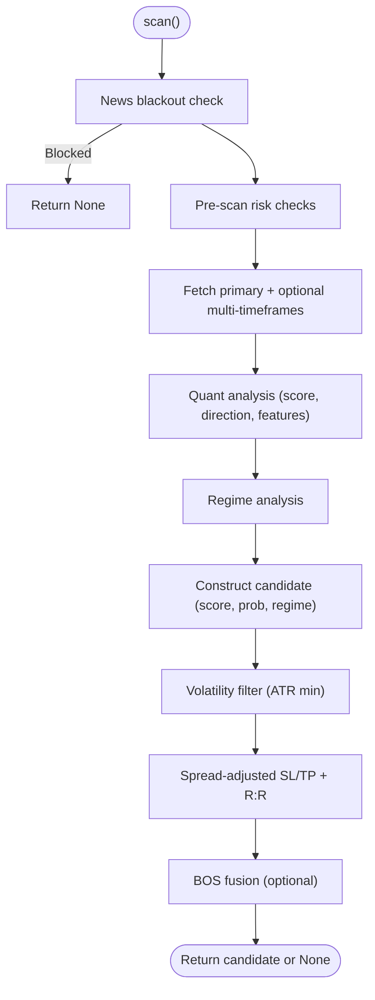

# Market Data Processing

<cite>
**Referenced Files in This Document**
- [loader.py](file://market_data/loader.py)
- [features.py](file://strategy/features.py)
- [data_cache.py](file://utils/data_cache.py)
- [regime.py](file://analysis/regime.py)
- [institutional_strategy.py](file://strategy/institutional_strategy.py)
- [settings.py](file://config/settings.py)
- [pair_agent.py](file://strategy/pair_agent.py)
- [news_filter.py](file://utils/news_filter.py)
- [risk_manager.py](file://utils/risk_manager.py)
- [mt5_client.py](file://execution/mt5_client.py)
- [shared_state.py](file://utils/shared_state.py)
- [market_analyst.py](file://analysis/market_analyst.py)
- [async_utils.py](file://utils/async_utils.py)
- [main.py](file://main.py)
</cite>

## Table of Contents
1. [Introduction](#introduction)
2. [Project Structure](#project-structure)
3. [Core Components](#core-components)
4. [Architecture Overview](#architecture-overview)
5. [Detailed Component Analysis](#detailed-component-analysis)
6. [Dependency Analysis](#dependency-analysis)
7. [Performance Considerations](#performance-considerations)
8. [Troubleshooting Guide](#troubleshooting-guide)
9. [Conclusion](#conclusion)
10. [Appendices](#appendices)

## Introduction
This document explains the market data processing architecture powering the Institutional SureShot Scanner. It covers OHLCV data fetching, multi-timeframe analysis, technical indicator library, caching and memory strategies, feature engineering, market regime detection, data validation, error handling, performance optimization, and the relationship between processed data and trading signals. It also addresses latency, market hours filtering, and real-time streaming integration.

## Project Structure
The system is organized into cohesive layers:
- Market Data Access: MT5 connectivity and OHLCV retrieval
- Feature Engineering: Technical indicators and derived features
- Multi-Timeframe Analysis: Combined datasets across M15/H1/H4
- Risk and Market Regime: Pre-execution gating and regime classification
- Execution: Order placement and position management
- Utilities: Caching, async helpers, shared state, news filters
- Orchestration: InstitutionalStrategy coordinates agents and loops


**Diagram sources**
- [loader.py](file://market_data/loader.py#L1-L83)
- [data_cache.py](file://utils/data_cache.py#L1-L77)
- [features.py](file://strategy/features.py#L1-L242)
- [regime.py](file://analysis/regime.py#L1-L58)
- [institutional_strategy.py](file://strategy/institutional_strategy.py#L1-L500)
- [pair_agent.py](file://strategy/pair_agent.py#L1-L432)
- [market_analyst.py](file://analysis/market_analyst.py#L1-L81)
- [mt5_client.py](file://execution/mt5_client.py#L1-L385)
- [risk_manager.py](file://utils/risk_manager.py#L1-L549)
- [news_filter.py](file://utils/news_filter.py#L1-L239)
- [shared_state.py](file://utils/shared_state.py#L1-L110)
- [async_utils.py](file://utils/async_utils.py#L1-L45)
- [settings.py](file://config/settings.py#L1-L201)
- [main.py](file://main.py#L1-L122)

**Section sources**
- [main.py](file://main.py#L1-L122)
- [settings.py](file://config/settings.py#L1-L201)

## Core Components
- MarketDataLoader: Initializes MT5, connects, logs in, and retrieves OHLCV bars for a symbol/timeframe. Provides multi-timeframe retrieval for M15/H1/H4.
- DataCache: TTL-based caching to reduce redundant MT5 API calls and improve throughput.
- FeatureEngine: Adds institutional-grade technical indicators (RSI, Stochastic RSI, BB, ATR, EMAs, MACD, ADX, VWAP, order flow delta, market structure, order blocks, fair value gaps, liquidity).
- RegimeDetector: Classifies market into TRENDING, RANGING, VOLATILE, or NORMAL based on ADX, ATR, and BB width.
- InstitutionalStrategy: Orchestrates PairAgents, manages sessions, daily limits, and broadcasts events. Integrates DataCache and risk controls.
- PairAgent: Per-symbol agent that fetches data, runs quant analysis, applies regime filters, constructs candidates, and enforces volatility and spread constraints.
- RiskManager: Pre-scan checks (daily limit, kill switch, payoff mandate, spread, news blackout, session), live correlation filter, position sizing, trailing/BE/partial management.
- MT5Client: Broker connectivity, symbol detection, account info, order placement, position management, and lot sizing.
- MarketAnalyst: Composes news blackout, regime detection, and optional AI sentiment; persists regime to shared state.
- Utilities: Async helpers, shared state persistence, news calendar integration.

**Section sources**
- [loader.py](file://market_data/loader.py#L24-L83)
- [data_cache.py](file://utils/data_cache.py#L16-L77)
- [features.py](file://strategy/features.py#L6-L242)
- [regime.py](file://analysis/regime.py#L8-L58)
- [institutional_strategy.py](file://strategy/institutional_strategy.py#L49-L500)
- [pair_agent.py](file://strategy/pair_agent.py#L22-L432)
- [risk_manager.py](file://utils/risk_manager.py#L14-L549)
- [mt5_client.py](file://execution/mt5_client.py#L12-L385)
- [market_analyst.py](file://analysis/market_analyst.py#L7-L81)
- [async_utils.py](file://utils/async_utils.py#L9-L45)
- [shared_state.py](file://utils/shared_state.py#L23-L110)
- [news_filter.py](file://utils/news_filter.py#L159-L239)

## Architecture Overview
The scanner operates in cycles:
- InstitutionalStrategy orchestrates a scan loop, managing global constraints and session filters.
- Each PairAgent asynchronously fetches data (primary timeframe plus optional multi-timeframes), computes features, applies regime and volatility filters, and builds a candidate with score/probability and dynamic SL/TP distances.
- RiskManager validates pre-execution constraints and calculates position size.
- MarketAnalyst provides regime insights and persists them to shared state.
- MT5Client executes orders and manages positions.


**Diagram sources**
- [main.py](file://main.py#L75-L106)
- [institutional_strategy.py](file://strategy/institutional_strategy.py#L99-L330)
- [pair_agent.py](file://strategy/pair_agent.py#L71-L295)
- [data_cache.py](file://utils/data_cache.py#L30-L48)
- [loader.py](file://market_data/loader.py#L40-L59)
- [features.py](file://strategy/features.py#L6-L98)
- [regime.py](file://analysis/regime.py#L12-L57)
- [risk_manager.py](file://utils/risk_manager.py#L237-L295)
- [mt5_client.py](file://execution/mt5_client.py#L216-L292)

## Detailed Component Analysis

### MarketDataLoader
Responsibilities:
- Initialize MT5 terminal and login
- Retrieve OHLCV bars for a symbol/timeframe
- Multi-timeframe retrieval for M15/H1/H4 with tailored bar counts
- Convert timestamps to datetime

Key behaviors:
- Uses a timeframe map to translate string timeframes to MT5 constants
- Returns DataFrame with time column normalized to datetime
- Handles missing data by returning None and printing a warning


**Diagram sources**
- [loader.py](file://market_data/loader.py#L24-L59)

**Section sources**
- [loader.py](file://market_data/loader.py#L24-L83)

### DataCache
Responsibilities:
- Thread-safe caching with TTL per timeframe
- Reduces repeated MT5 calls by serving fresh cached DataFrames
- Provides invalidation and statistics

TTL policy:
- M15: 5 minutes
- H1: 15 minutes
- H4: 60 minutes
- D1: 2 hours

```mermaid
classDiagram
class DataCache {
-dict _cache
+dict TTL
+get(symbol, timeframe, n_bars) DataFrame
+invalidate(symbol, timeframe) void
+stats() dict
}
DataCache : "TTL per timeframe"
DataCache : "cache key : symbol_timeframe"
```

**Diagram sources**
- [data_cache.py](file://utils/data_cache.py#L16-L77)

**Section sources**
- [data_cache.py](file://utils/data_cache.py#L16-L77)

### Feature Engine (Technical Indicators)
Responsibilities:
- Compute institutional-grade features from OHLCV
- Include price returns, momentum (RSI, StochRSI), volatility (BB, ATR), trend (SMAs, EMAs, MACD, ADX), volume (VWAP, delta volume), and advanced structure features (market structure, order blocks, FVGs, liquidity)

Processing highlights:
- Adds log returns, RSI and slope, Stochastic RSI
- Computes Bollinger Bands and derived metrics (width, position)
- Calculates ATR and relative ATR
- Trend features: SMAs/EMAs, crossovers, MACD, ADX (+DI/-DI)
- Volume features: VWAP, volume SMA, delta volume, signed flow
- Market structure: swing highs/lows, HH/HL/LH/LL, BOS
- Order blocks: impulse candles, OB zones, near-OB flags
- Fair value gaps: gap detection and near-gap flags
- Liquidity pools: rolling highs/lows, sweeps
- Lag features: log returns, RSI, MACD diff at lags 1..5
- Drops NaN rows


**Diagram sources**
- [features.py](file://strategy/features.py#L6-L98)
- [features.py](file://strategy/features.py#L101-L128)
- [features.py](file://strategy/features.py#L131-L170)
- [features.py](file://strategy/features.py#L173-L203)
- [features.py](file://strategy/features.py#L206-L224)

**Section sources**
- [features.py](file://strategy/features.py#L6-L242)

### RegimeDetector
Responsibilities:
- Classify market into regimes using technical signals
- Uses ADX for trend strength, ATR spike for volatility, and BB width for ranging

Rules:
- VOLATILE: current ATR > 1.5x average ATR
- TRENDING: ADX > 25
- RANGING: ADX < 20 and narrow bands
- DEFAULT: NORMAL


**Diagram sources**
- [regime.py](file://analysis/regime.py#L12-L57)

**Section sources**
- [regime.py](file://analysis/regime.py#L8-L58)

### InstitutionalStrategy
Responsibilities:
- Coordinates scanning across all symbols via PairAgents
- Applies global session filters and daily trade limits
- Manages execution gating and broadcast of events
- Integrates DataCache and risk controls

Key flows:
- Parallel scanning of agents
- Candidate selection with execution checks (R:R, spread, volatility thresholds)
- Optional Researcher debate and Sureshot overrides
- Periodic self-reflection via Critic


**Diagram sources**
- [institutional_strategy.py](file://strategy/institutional_strategy.py#L99-L330)
- [risk_manager.py](file://utils/risk_manager.py#L237-L295)
- [mt5_client.py](file://execution/mt5_client.py#L216-L292)

**Section sources**
- [institutional_strategy.py](file://strategy/institutional_strategy.py#L49-L500)

### PairAgent
Responsibilities:
- Per-symbol scanning and candidate construction
- Optional multi-timeframe filters (M5/H1/H4)
- Volatility-adaptive entry (ATR-based SL/TP)
- Spread-adjusted TP/SL and R:R enforcement
- BOS fusion with ML signals
- Active trade management (trailing, BE, partial closes)



**Diagram sources**
- [pair_agent.py](file://strategy/pair_agent.py#L71-L295)

**Section sources**
- [pair_agent.py](file://strategy/pair_agent.py#L22-L432)

### RiskManager
Responsibilities:
- Pre-scan checks: daily limit, kill switch, payoff mandate, spread, news blackout, session filter
- Live correlation filter to avoid same-direction exposure
- Position sizing using Kelly Criterion with fallback tiers
- Position management: trailing stops, break-even, partial closes


**Diagram sources**
- [risk_manager.py](file://utils/risk_manager.py#L51-L163)

**Section sources**
- [risk_manager.py](file://utils/risk_manager.py#L14-L549)

### MarketAnalyst and RegimeDetector Integration
- MarketAnalyst composes news blackout, regime detection, and optional AI sentiment
- RegimeDetector consumes features to classify market state
- Results persisted to shared state for cross-agent awareness

**Section sources**
- [market_analyst.py](file://analysis/market_analyst.py#L7-L81)
- [regime.py](file://analysis/regime.py#L8-L58)
- [shared_state.py](file://utils/shared_state.py#L23-L110)

### Data Validation and Error Handling
- Loader returns None on missing data; callers handle gracefully
- PairAgent validates DataFrame length and returns descriptive errors
- RiskManager guards against missing ticks and symbol info
- InstitutionalStrategy aggregates per-symbol reasons and prints summaries
- Async helpers prevent blocking the event loop

**Section sources**
- [loader.py](file://market_data/loader.py#L40-L59)
- [pair_agent.py](file://strategy/pair_agent.py#L107-L144)
- [risk_manager.py](file://utils/risk_manager.py#L112-L143)
- [institutional_strategy.py](file://strategy/institutional_strategy.py#L140-L183)
- [async_utils.py](file://utils/async_utils.py#L9-L16)

### Real-Time Streaming Integration
- Stream server is started at process launch
- Events broadcast include scan summaries, positions, account updates, research results, and trade executions
- Dashboard subscribes via WebSocket hook

**Section sources**
- [main.py](file://main.py#L66-L73)
- [institutional_strategy.py](file://strategy/institutional_strategy.py#L185-L236)

## Dependency Analysis
Inter-module dependencies:
- PairAgent depends on MarketDataLoader, FeatureEngine, RiskManager, MarketAnalyst
- InstitutionalStrategy depends on PairAgents, DataCache, RiskManager, MarketAnalyst, MT5Client
- MarketAnalyst depends on RegimeDetector, NewsFilter, SharedState
- RiskManager depends on MT5Client, NewsFilter, SharedState
- DataCache depends on MarketDataLoader
- Async utilities enable non-blocking IO


**Diagram sources**
- [pair_agent.py](file://strategy/pair_agent.py#L1-L16)
- [institutional_strategy.py](file://strategy/institutional_strategy.py#L23-L35)
- [market_analyst.py](file://analysis/market_analyst.py#L1-L6)
- [risk_manager.py](file://utils/risk_manager.py#L9-L12)
- [data_cache.py](file://utils/data_cache.py#L13-L13)
- [async_utils.py](file://utils/async_utils.py#L1-L4)

**Section sources**
- [pair_agent.py](file://strategy/pair_agent.py#L1-L16)
- [institutional_strategy.py](file://strategy/institutional_strategy.py#L23-L35)
- [market_analyst.py](file://analysis/market_analyst.py#L1-L6)
- [risk_manager.py](file://utils/risk_manager.py#L9-L12)
- [data_cache.py](file://utils/data_cache.py#L13-L13)
- [async_utils.py](file://utils/async_utils.py#L1-L4)

## Performance Considerations
- Parallelism: InstitutionalStrategy scans agents concurrently; PairAgent fetches multi-timeframes asynchronously
- Caching: DataCache reduces MT5 calls with TTL per timeframe; cache stats help monitor effectiveness
- Indicator computation: Features computed once per scan; avoid recomputation by reusing DataFrames
- Async IO: run_in_executor prevents blocking the event loop for MT5 calls
- Session-aware filtering: Avoids trading during low-liquidity windows and high-impact news windows
- Position sizing: Kelly Criterion adapts to symbol performance; fallback tiers ensure stability
- Partial closes: Lock in profits early to reduce tail risk

[No sources needed since this section provides general guidance]

## Troubleshooting Guide
Common issues and resolutions:
- MT5 connection failures: Verify credentials and terminal path; re-initialize and re-login
- Missing data: Confirm symbol visibility and trade mode; ensure sufficient bars requested
- Cache misses: Increase TTL or reduce frequency; confirm cache keys match symbol/timeframe
- Excessive R:R blocks: Adjust ATR multipliers or relax thresholds; verify spread costs
- News blackouts: Use active events list to identify upcoming events; pause scans during blackout windows
- Session filters: Ensure UTC hour aligns with configured sessions; adjust settings for crypto or exotic schedules
- Daily limits: Reset date boundary logic; review daily trade count and reset behavior
- Correlation conflicts: Monitor live correlation checks; diversify exposures or reduce same-direction positions

**Section sources**
- [loader.py](file://market_data/loader.py#L24-L37)
- [pair_agent.py](file://strategy/pair_agent.py#L107-L144)
- [data_cache.py](file://utils/data_cache.py#L30-L48)
- [risk_manager.py](file://utils/risk_manager.py#L51-L163)
- [news_filter.py](file://utils/news_filter.py#L159-L205)
- [institutional_strategy.py](file://strategy/institutional_strategy.py#L455-L468)

## Conclusion
The Institutional SureShot Scanner’s market data processing stack combines efficient caching, robust feature engineering, and disciplined risk controls to produce reliable trading signals. The architecture emphasizes parallelism, session-awareness, and real-time streaming, enabling adaptive, high-throughput scanning across multiple symbols and timeframes.

[No sources needed since this section summarizes without analyzing specific files]

## Appendices

### Data Quality Assurance
- Validate OHLCV completeness and monotonic time ordering
- Drop NaN rows after feature computation
- Confirm symbol trade mode and visibility before trading
- Monitor spread and volatility thresholds to avoid dead zones

**Section sources**
- [features.py](file://strategy/features.py#L95-L98)
- [mt5_client.py](file://execution/mt5_client.py#L48-L101)
- [risk_manager.py](file://utils/risk_manager.py#L112-L143)

### Latency Considerations
- Use DataCache to minimize MT5 round trips
- Prefer async execution for blocking calls
- Tune scan intervals based on cycle duration and available resources
- Filter by session windows to reduce unnecessary polling

**Section sources**
- [data_cache.py](file://utils/data_cache.py#L30-L48)
- [async_utils.py](file://utils/async_utils.py#L9-L16)
- [main.py](file://main.py#L103-L105)