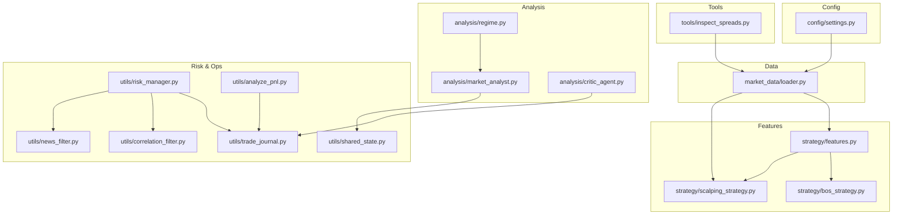
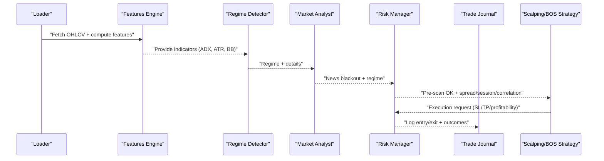
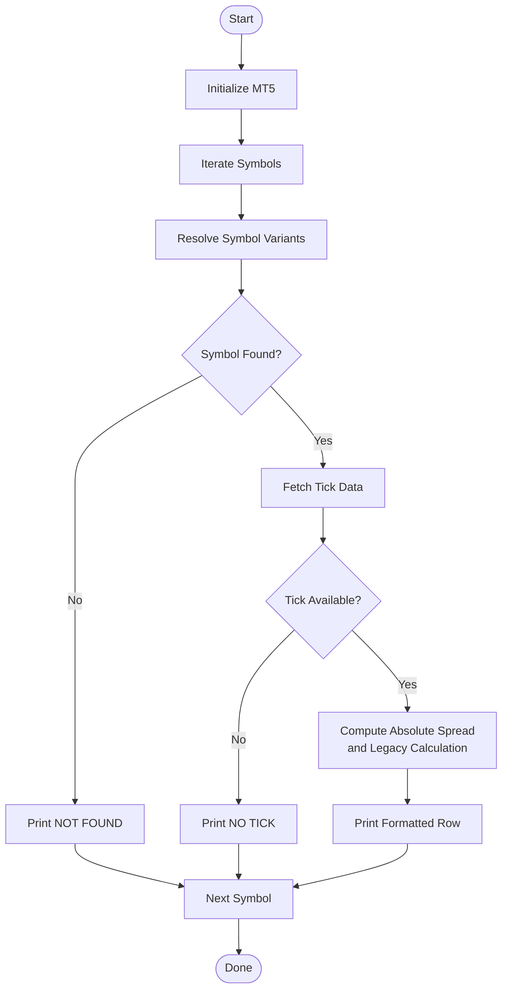
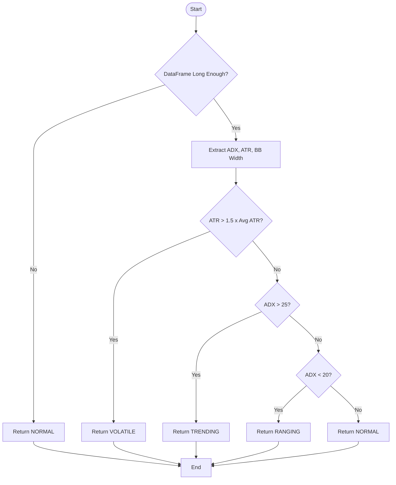
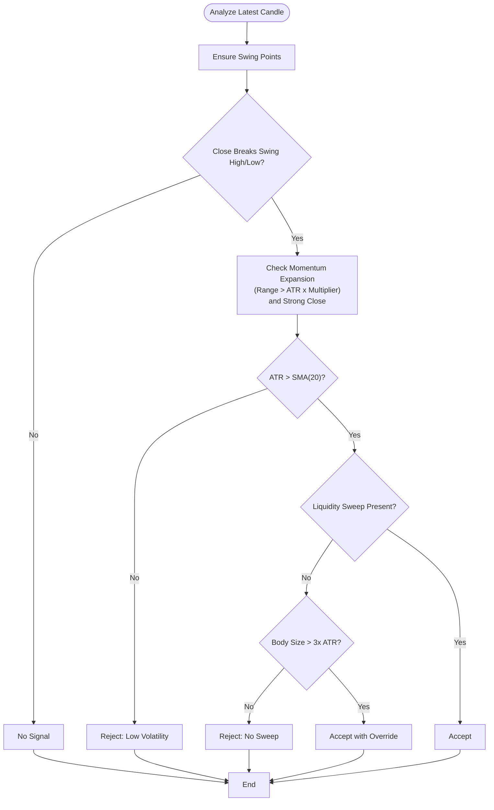
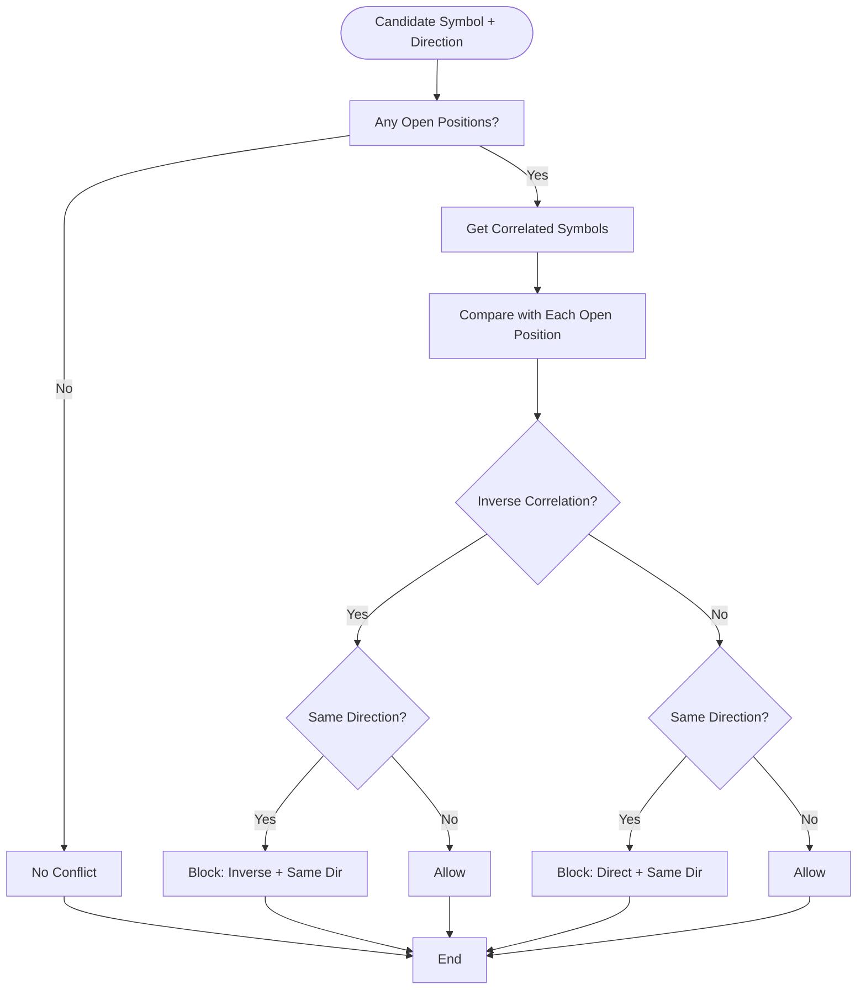
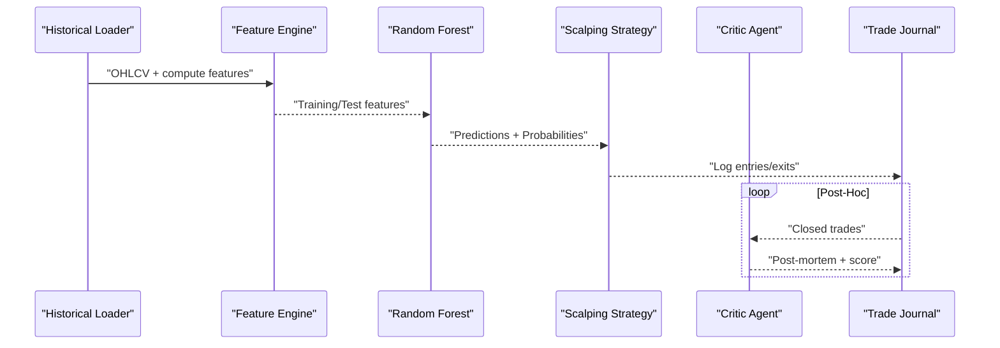
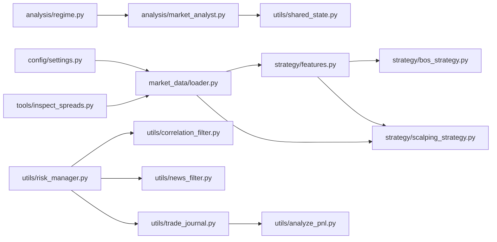

# Technical Analysis Tools

<cite>
**Referenced Files in This Document**
- [README.md](file://README.md)
- [config/settings.py](file://config/settings.py)
- [market_data/loader.py](file://market_data/loader.py)
- [strategy/features.py](file://strategy/features.py)
- [strategy/bos_strategy.py](file://strategy/bos_strategy.py)
- [strategy/scalping_strategy.py](file://strategy/scalping_strategy.py)
- [analysis/regime.py](file://analysis/regime.py)
- [analysis/market_analyst.py](file://analysis/market_analyst.py)
- [analysis/critic_agent.py](file://analysis/critic_agent.py)
- [utils/news_filter.py](file://utils/news_filter.py)
- [utils/correlation_filter.py](file://utils/correlation_filter.py)
- [utils/shared_state.py](file://utils/shared_state.py)
- [utils/risk_manager.py](file://utils/risk_manager.py)
- [utils/trade_journal.py](file://utils/trade_journal.py)
- [utils/analyze_pnl.py](file://utils/analyze_pnl.py)
- [tools/inspect_spreads.py](file://tools/inspect_spreads.py)
</cite>

## Table of Contents
1. [Introduction](#introduction)
2. [Project Structure](#project-structure)
3. [Core Components](#core-components)
4. [Architecture Overview](#architecture-overview)
5. [Detailed Component Analysis](#detailed-component-analysis)
6. [Dependency Analysis](#dependency-analysis)
7. [Performance Considerations](#performance-considerations)
8. [Troubleshooting Guide](#troubleshooting-guide)
9. [Conclusion](#conclusion)
10. [Appendices](#appendices)

## Introduction
This document presents a comprehensive technical analysis toolkit built around institutional-grade indicators, multi-timeframe feature engineering, market regime classification, and integrated risk controls. It covers:
- Spread inspection and liquidity diagnostics
- Volatility measurement and market regime classification
- Trend detection and breakout systems
- Support/resistance and liquidity level identification
- Correlation filtering and sector rotation awareness
- Market sentiment synthesis and post-trade critique
- Backtesting and walk-forward validation foundations
- Visualization-ready analytics and performance reporting
- Debugging utilities for indicator validation

## Project Structure
The repository organizes technical analysis capabilities across modular packages:
- config: centralized settings and environment-driven tuning
- market_data: MT5 connectivity and multi-timeframe data retrieval
- strategy: feature engineering, signal generation, and strategy orchestration
- analysis: regime detection, market sentiment, and post-trade critique
- utils: risk management, correlation filtering, news blackout, shared state, trade journaling, and PnL analysis
- tools: auxiliary utilities such as spread inspection
- dashboard: optional visualization frontend assets

**Diagram sources**
- [config/settings.py](file://config/settings.py#L1-L201)
- [market_data/loader.py](file://market_data/loader.py#L1-L83)
- [strategy/features.py](file://strategy/features.py#L1-L242)
- [strategy/bos_strategy.py](file://strategy/bos_strategy.py#L1-L178)
- [strategy/scalping_strategy.py](file://strategy/scalping_strategy.py#L1-L291)
- [analysis/regime.py](file://analysis/regime.py#L1-L58)
- [analysis/market_analyst.py](file://analysis/market_analyst.py#L1-L81)
- [analysis/critic_agent.py](file://analysis/critic_agent.py#L1-L141)
- [utils/news_filter.py](file://utils/news_filter.py#L1-L239)
- [utils/correlation_filter.py](file://utils/correlation_filter.py#L1-L117)
- [utils/shared_state.py](file://utils/shared_state.py#L1-L110)
- [utils/risk_manager.py](file://utils/risk_manager.py#L1-L549)
- [utils/trade_journal.py](file://utils/trade_journal.py#L1-L274)
- [utils/analyze_pnl.py](file://utils/analyze_pnl.py#L1-L81)
- [tools/inspect_spreads.py](file://tools/inspect_spreads.py#L1-L49)

**Section sources**
- [README.md](file://README.md)
- [config/settings.py](file://config/settings.py#L1-L201)

## Core Components
- Multi-timeframe loader: initializes MT5, logs in, and retrieves historical bars across M15/H1/H4 for multi-timeframe analysis.
- Feature engine: computes institutional-grade indicators (RSI, Stochastic RSI, BB, ATR, SMA/EMA, MACD, ADX, VWAP, delta volume, order blocks, fair value gaps, liquidity levels, market structure).
- Regime detector: classifies market into TRENDING, RANGING, VOLATILE, or NORMAL using ADX, ATR, and BB width.
- Market Analyst: orchestrates news blackout checks, regime detection, and optional AI sentiment synthesis.
- BOSStrategy: strict BOS detection with momentum and liquidity sweep filters.
- ScalpingStrategy: combines random forest predictions, optional HF/LSTM forecasts, and multi-timeframe trend filters to generate entries.
- Risk Manager: enforces daily limits, spread thresholds, session gating, correlation conflicts, profitability checks, and dynamic position sizing.
- Trade Journal: records entries/exits, outcomes, durations, and confluence factors; supports post-mortem analysis.
- Utilities: news filter, correlation groups, shared state persistence, PnL analyzer, and spread inspector.

**Section sources**
- [market_data/loader.py](file://market_data/loader.py#L1-L83)
- [strategy/features.py](file://strategy/features.py#L1-L242)
- [analysis/regime.py](file://analysis/regime.py#L1-L58)
- [analysis/market_analyst.py](file://analysis/market_analyst.py#L1-L81)
- [strategy/bos_strategy.py](file://strategy/bos_strategy.py#L1-L178)
- [strategy/scalping_strategy.py](file://strategy/scalping_strategy.py#L1-L291)
- [utils/risk_manager.py](file://utils/risk_manager.py#L1-L549)
- [utils/trade_journal.py](file://utils/trade_journal.py#L1-L274)
- [utils/news_filter.py](file://utils/news_filter.py#L1-L239)
- [utils/correlation_filter.py](file://utils/correlation_filter.py#L1-L117)
- [utils/shared_state.py](file://utils/shared_state.py#L1-L110)
- [utils/analyze_pnl.py](file://utils/analyze_pnl.py#L1-L81)
- [tools/inspect_spreads.py](file://tools/inspect_spreads.py#L1-L49)

## Architecture Overview
The system integrates data ingestion, feature computation, regime-aware analysis, and risk-controlled execution. Shared state enables cross-agent coordination (e.g., regime persistence). Trade journaling and PnL analysis support post-hoc validation and walk-forward testing.

**Diagram sources**
- [market_data/loader.py](file://market_data/loader.py#L40-L83)
- [strategy/features.py](file://strategy/features.py#L6-L98)
- [analysis/regime.py](file://analysis/regime.py#L12-L57)
- [analysis/market_analyst.py](file://analysis/market_analyst.py#L25-L71)
- [utils/risk_manager.py](file://utils/risk_manager.py#L51-L163)
- [utils/trade_journal.py](file://utils/trade_journal.py#L103-L164)
- [strategy/scalping_strategy.py](file://strategy/scalping_strategy.py#L151-L291)

## Detailed Component Analysis

### Spread Inspection and Liquidity Diagnostics
- Purpose: Inspect current bid/ask spreads and related metrics across a curated symbol list.
- Key capabilities:
  - Iterates over symbols, resolves symbol variants, fetches tick data, and prints formatted spread metrics.
  - Computes absolute spread and recalculates spread using legacy point/digit conversions for comparison.
- Use cases:
  - Validate broker pricing consistency.
  - Confirm spread thresholds before entering trades.
  - Monitor liquidity changes across assets.

**Diagram sources**
- [tools/inspect_spreads.py](file://tools/inspect_spreads.py#L8-L45)

**Section sources**
- [tools/inspect_spreads.py](file://tools/inspect_spreads.py#L1-L49)

### Market Regime Classification
- Purpose: Classify current market condition to inform strategy selection and risk posture.
- Methodology:
  - Uses ADX to detect trending vs. ranging regimes.
  - Flags volatility spikes via ATR vs. 20-period average.
  - Incorporates Bollinger Band width for range tightness.
- Outputs: Regime label and diagnostic details (ADX, BB width, vol ratio).

**Diagram sources**
- [analysis/regime.py](file://analysis/regime.py#L12-L57)

**Section sources**
- [analysis/regime.py](file://analysis/regime.py#L1-L58)

### Volatility Measurement Tools
- Core indicators:
  - ATR: Average True Range for dynamic stops and position sizing.
  - BB width: Normalized band width to assess relative volatility.
  - ADX: Trend strength; +DI/-DI for directional bias.
- Feature engine adds:
  - ATR and normalized ATR.
  - BB high/low/width/position.
  - ADX (+DI/-DI), MACD, RSI, Stochastic RSI, and moving averages.

**Section sources**
- [strategy/features.py](file://strategy/features.py#L27-L64)

### Trend Detection and Market Structure
- Market structure:
  - Swing highs/lows detection and higher-highs/lower-lows classification.
  - Break of Structure (BOS) triggers when close breaks prior swing extremes.
- Trend filters:
  - Scalping strategy uses H1 SMA(50) to gate entries against counter-trend plays.
- BOSStrategy:
  - Validates BOS with momentum expansion (candle range > ATR threshold) and strong close.
  - Incorporates liquidity sweep logic to confirm rejection-based setups.

**Diagram sources**
- [strategy/bos_strategy.py](file://strategy/bos_strategy.py#L26-L161)
- [strategy/features.py](file://strategy/features.py#L101-L128)

**Section sources**
- [strategy/bos_strategy.py](file://strategy/bos_strategy.py#L1-L178)
- [strategy/features.py](file://strategy/features.py#L101-L128)

### Support/Resistance and Liquidity Levels
- Liquidity identification:
  - Rolling highs/lows over a lookback window.
  - Distance to liquidity and sweep detection flags.
- Order blocks:
  - Detects impulsive candles following prior bearish/bullish candles to mark potential reversal zones.
- Fair value gaps:
  - Identifies gaps where price did not fill, marking potential retracement targets.

**Section sources**
- [strategy/features.py](file://strategy/features.py#L206-L224)
- [strategy/features.py](file://strategy/features.py#L131-L170)
- [strategy/features.py](file://strategy/features.py#L173-L203)

### Correlation Analysis and Sector Rotation
- Static correlation groups:
  - EUR, GBP, risk-on, JPY safe haven, metals, crypto, energy sectors.
- Live correlation filter:
  - Computes recent M1 return correlations to prevent correlated exposures.
  - Falls back to static groups when live data is unavailable.

**Diagram sources**
- [utils/correlation_filter.py](file://utils/correlation_filter.py#L77-L116)

**Section sources**
- [utils/correlation_filter.py](file://utils/correlation_filter.py#L1-L117)

### Market Sentiment and AI Integration
- Market Analyst:
  - Performs news blackout checks and regime detection.
  - Optionally synthesizes AI sentiment and confidence for a given symbol/timeframe/indicators.
- Shared state:
  - Persists regime metadata for downstream agents.

**Section sources**
- [analysis/market_analyst.py](file://analysis/market_analyst.py#L1-L81)
- [utils/shared_state.py](file://utils/shared_state.py#L1-L110)

### Technical Indicator Backtesting and Walk-Forward Validation
- Data foundation:
  - Historical loader supports multi-timeframe retrieval for robust walk-forward windows.
- Strategy scaffolding:
  - Feature engine produces lagged returns and indicator arrays suitable for classifier training.
  - Random forest model and optional HF/LSTM predictors enable hybrid walk-forward evaluation.
- Post-trade critique:
  - Critic agent reviews closed trades and persists lessons and scores for continuous improvement.

**Diagram sources**
- [market_data/loader.py](file://market_data/loader.py#L40-L83)
- [strategy/features.py](file://strategy/features.py#L6-L98)
- [strategy/scalping_strategy.py](file://strategy/scalping_strategy.py#L95-L106)
- [analysis/critic_agent.py](file://analysis/critic_agent.py#L17-L52)
- [utils/trade_journal.py](file://utils/trade_journal.py#L103-L164)

**Section sources**
- [market_data/loader.py](file://market_data/loader.py#L1-L83)
- [strategy/features.py](file://strategy/features.py#L1-L242)
- [strategy/scalping_strategy.py](file://strategy/scalping_strategy.py#L1-L291)
- [analysis/critic_agent.py](file://analysis/critic_agent.py#L1-L141)
- [utils/trade_journal.py](file://utils/trade_journal.py#L1-L274)

### Visualization Tools and Statistical Reporting
- Trade journaling:
  - Structured SQL schema for PnL, durations, and confluence factors.
  - Daily summary table for aggregated stats.
- PnL analyzer:
  - Summarizes overall performance and per-symbol statistics (win rate, profit factor).
- Shared state:
  - Persistent key-value store enabling cross-agent dashboards and regime overlays.

**Section sources**
- [utils/trade_journal.py](file://utils/trade_journal.py#L23-L101)
- [utils/trade_journal.py](file://utils/trade_journal.py#L166-L195)
- [utils/analyze_pnl.py](file://utils/analyze_pnl.py#L12-L79)
- [utils/shared_state.py](file://utils/shared_state.py#L23-L93)

### Custom Implementations and Integration Patterns
- Adding new indicators:
  - Extend feature engine with TA-Lib equivalents and custom logic; ensure lagged features and NaN handling.
- Strategy composition:
  - Combine regime filters, correlation checks, and volatility gates before invoking ML predictors.
- Execution integration:
  - Use risk manager’s pre-scan and execution checks to validate spread, session, correlation, and profitability before placing orders.

**Section sources**
- [strategy/features.py](file://strategy/features.py#L6-L98)
- [utils/risk_manager.py](file://utils/risk_manager.py#L51-L163)
- [strategy/scalping_strategy.py](file://strategy/scalping_strategy.py#L216-L291)

## Dependency Analysis
The system exhibits layered dependencies:
- Data ingestion depends on MT5 and environment settings.
- Feature engine depends on TA-Lib and pandas/numpy.
- Strategies depend on features and optional ML modules.
- Risk manager coordinates with MT5, news filter, and correlation filter.
- Journal and PnL analyzer depend on SQLite and pandas.

**Diagram sources**
- [config/settings.py](file://config/settings.py#L1-L201)
- [market_data/loader.py](file://market_data/loader.py#L1-L83)
- [strategy/features.py](file://strategy/features.py#L1-L242)
- [strategy/bos_strategy.py](file://strategy/bos_strategy.py#L1-L178)
- [strategy/scalping_strategy.py](file://strategy/scalping_strategy.py#L1-L291)
- [analysis/regime.py](file://analysis/regime.py#L1-L58)
- [analysis/market_analyst.py](file://analysis/market_analyst.py#L1-L81)
- [utils/shared_state.py](file://utils/shared_state.py#L1-L110)
- [utils/risk_manager.py](file://utils/risk_manager.py#L1-L549)
- [utils/correlation_filter.py](file://utils/correlation_filter.py#L1-L117)
- [utils/news_filter.py](file://utils/news_filter.py#L1-L239)
- [utils/trade_journal.py](file://utils/trade_journal.py#L1-L274)
- [utils/analyze_pnl.py](file://utils/analyze_pnl.py#L1-L81)
- [tools/inspect_spreads.py](file://tools/inspect_spreads.py#L1-L49)

**Section sources**
- [config/settings.py](file://config/settings.py#L1-L201)
- [market_data/loader.py](file://market_data/loader.py#L1-L83)
- [strategy/features.py](file://strategy/features.py#L1-L242)
- [strategy/bos_strategy.py](file://strategy/bos_strategy.py#L1-L178)
- [strategy/scalping_strategy.py](file://strategy/scalping_strategy.py#L1-L291)
- [analysis/regime.py](file://analysis/regime.py#L1-L58)
- [analysis/market_analyst.py](file://analysis/market_analyst.py#L1-L81)
- [utils/shared_state.py](file://utils/shared_state.py#L1-L110)
- [utils/risk_manager.py](file://utils/risk_manager.py#L1-L549)
- [utils/correlation_filter.py](file://utils/correlation_filter.py#L1-L117)
- [utils/news_filter.py](file://utils/news_filter.py#L1-L239)
- [utils/trade_journal.py](file://utils/trade_journal.py#L1-L274)
- [utils/analyze_pnl.py](file://utils/analyze_pnl.py#L1-L81)
- [tools/inspect_spreads.py](file://tools/inspect_spreads.py#L1-L49)

## Performance Considerations
- Data efficiency:
  - Multi-timeframe retrieval consolidates H1/H4 alongside M15 for reduced MT5 calls.
  - Feature computation uses vectorized pandas/numpy operations.
- Risk control overhead:
  - Pre-scan checks short-circuit expensive operations when blocked by circuit breaker, daily limits, or spread thresholds.
- Predictive pipeline:
  - Optional HF/LSTM predictors add latency; gating by availability and confidence thresholds prevents unnecessary delays.
- Persistence:
  - SQLite-backed shared state and journals minimize external dependencies while enabling cross-process coordination.

[No sources needed since this section provides general guidance]

## Troubleshooting Guide
- MT5 connectivity:
  - Verify initialization and login credentials; ensure terminal path and server settings are correct.
- Spread and liquidity:
  - Use spread inspector to confirm broker pricing and symbol availability.
- News blackout:
  - Confirm event schedules and live calendar feed; adjust buffers for pre/post impact windows.
- Correlation conflicts:
  - Review static groups and live correlation logic; ensure symbol suffix normalization.
- Risk gating:
  - Check daily trade counts, kill switch thresholds, payoff mandates, and spread caps.
- Journal and PnL:
  - Validate database paths and table schemas; ensure numeric conversions for profit aggregation.

**Section sources**
- [market_data/loader.py](file://market_data/loader.py#L24-L37)
- [tools/inspect_spreads.py](file://tools/inspect_spreads.py#L8-L45)
- [utils/news_filter.py](file://utils/news_filter.py#L159-L205)
- [utils/correlation_filter.py](file://utils/correlation_filter.py#L77-L116)
- [utils/risk_manager.py](file://utils/risk_manager.py#L51-L163)
- [utils/trade_journal.py](file://utils/trade_journal.py#L32-L101)
- [utils/analyze_pnl.py](file://utils/analyze_pnl.py#L12-L28)

## Conclusion
This toolkit integrates robust technical analysis primitives with disciplined risk controls and operational feedback loops. By combining multi-timeframe features, regime-aware filters, correlation safeguards, and post-trade critique, it supports reliable backtesting, walk-forward validation, and production-grade execution. Visualization-ready outputs and shared-state persistence enable scalable monitoring and dashboarding.

[No sources needed since this section summarizes without analyzing specific files]

## Appendices

### Configuration Reference Highlights
- Trading and risk:
  - Lot sizing, ATR-based SL/TP multipliers, daily caps, spread thresholds, trailing stops, partial profit taking, and Kelly-based sizing.
- Strategy filters:
  - Multi-timeframe trend filters, session gating, volatility minimums, and BOS-specific parameters.
- Data and models:
  - Model paths, feature lists, and optional HF/LSTM usage toggles.

**Section sources**
- [config/settings.py](file://config/settings.py#L69-L149)
- [config/settings.py](file://config/settings.py#L150-L201)