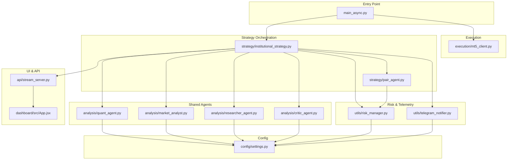
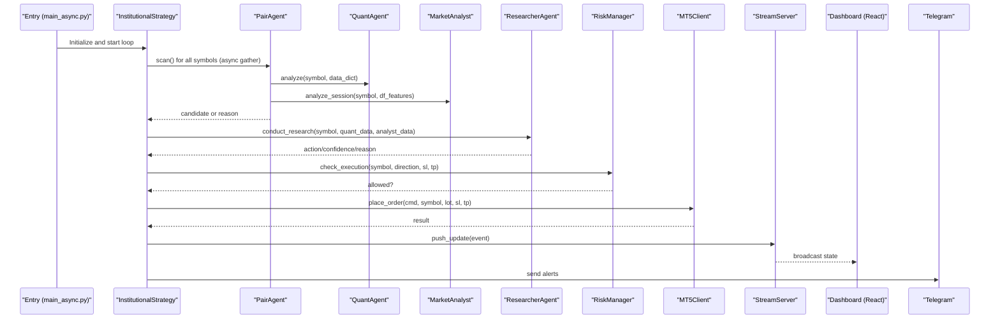
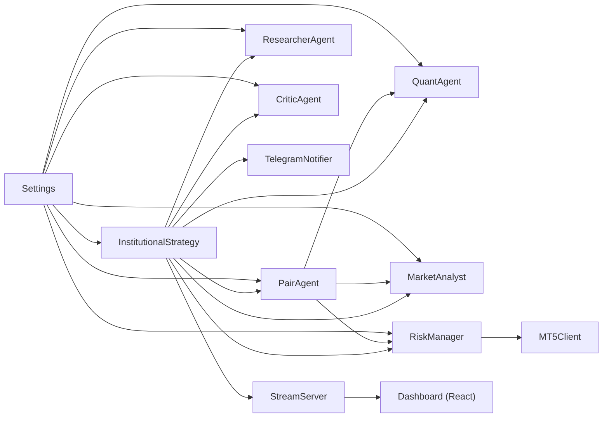

# Introduction and Purpose

<cite>
**Referenced Files in This Document**
- [README.md](file://README.md)
- [main_async.py](file://main_async.py)
- [strategy/institutional_strategy.py](file://strategy/institutional_strategy.py)
- [strategy/pair_agent.py](file://strategy/pair_agent.py)
- [analysis/quant_agent.py](file://analysis/quant_agent.py)
- [analysis/market_analyst.py](file://analysis/market_analyst.py)
- [analysis/researcher_agent.py](file://analysis/researcher_agent.py)
- [analysis/critic_agent.py](file://analysis/critic_agent.py)
- [utils/risk_manager.py](file://utils/risk_manager.py)
- [execution/mt5_client.py](file://execution/mt5_client.py)
- [api/stream_server.py](file://api/stream_server.py)
- [utils/telegram_notifier.py](file://utils/telegram_notifier.py)
- [config/settings.py](file://config/settings.py)
- [dashboard/src/App.jsx](file://dashboard/src/App.jsx)
</cite>

## Table of Contents
1. [Introduction](#introduction)
2. [Project Structure](#project-structure)
3. [Core Components](#core-components)
4. [Architecture Overview](#architecture-overview)
5. [Detailed Component Analysis](#detailed-component-analysis)
6. [Dependency Analysis](#dependency-analysis)
7. [Performance Considerations](#performance-considerations)
8. [Troubleshooting Guide](#troubleshooting-guide)
9. [Conclusion](#conclusion)

## Introduction
Institutional SureShot Scanner is a multi-agent asynchronous scalping system designed for MetaTrader 5. It operates as a fully autonomous trading swarm that continuously scans all available tradable instruments, debates each trade decision among specialized AI agents, enforces institutional-grade risk controls, and streams real-time insights to a React dashboard and Telegram. Unlike traditional trading bots that often rely on rigid rule engines or single-model predictors, this system composes multiple agents with distinct roles: a PairAgent per symbol, a shared QuantAgent for technical analysis, a MarketAnalyst for macro regime classification, a ResearcherAgent that conducts a structured Bull vs Bear debate, and a CriticAgent that performs asynchronous post-trade reviews. Together, they form a robust agentic architecture capable of adaptive, high-frequency scalping with strong risk discipline and transparent observability.

Key value propositions:
- Autonomous multi-agent debate: Every trade is vetted by a structured research process that weighs technical signals against macro regime and market sentiment, reducing blind spots and improving conviction.
- Institutional-grade risk management: Kill switches, payoff mandates, ATR-based sizing, trailing stops, partial profit taking, session gating, and spread controls guard capital across diverse market regimes.
- Real-time observability: A React dashboard auto-launches and displays live account stats, scanner grid, open positions, trade feed, and event logs, while Telegram pushes instant notifications for trades and alerts.

## Project Structure
The system is organized around a central orchestrator (InstitutionalStrategy) that coordinates per-symbol PairAgents and shared agents, backed by MT5 execution, risk management, telemetry, and a FastAPI WebSocket server feeding the React dashboard.

**Diagram sources**
- [main_async.py](file://main_async.py#L20-L96)
- [strategy/institutional_strategy.py](file://strategy/institutional_strategy.py#L49-L86)
- [strategy/pair_agent.py](file://strategy/pair_agent.py#L22-L54)
- [analysis/quant_agent.py](file://analysis/quant_agent.py#L34-L50)
- [analysis/market_analyst.py](file://analysis/market_analyst.py#L7-L19)
- [analysis/researcher_agent.py](file://analysis/researcher_agent.py#L5-L15)
- [analysis/critic_agent.py](file://analysis/critic_agent.py#L10-L15)
- [utils/risk_manager.py](file://utils/risk_manager.py#L14-L36)
- [utils/telegram_notifier.py](file://utils/telegram_notifier.py#L30-L39)
- [api/stream_server.py](file://api/stream_server.py#L17-L25)
- [dashboard/src/App.jsx](file://dashboard/src/App.jsx#L12-L103)
- [config/settings.py](file://config/settings.py#L1-L201)

**Section sources**
- [README.md](file://README.md#L187-L235)
- [main_async.py](file://main_async.py#L20-L96)
- [config/settings.py](file://config/settings.py#L1-L201)

## Core Components
- InstitutionalStrategy: Orchestrates scanning, execution, and telemetry. It initializes shared agents, manages global risk gates, and emits events consumed by the dashboard and Telegram.
- PairAgent: A per-symbol agent responsible for data fetching, multi-timeframe analysis, regime awareness, and active trade management (trailing, breakeven, partial closes).
- QuantAgent: Performs technical analysis combining ML models (Random Forest/XGBoost), trend filters, and AI signals (Lag-Llama/LSTM) to produce a confluence score and direction.
- MarketAnalyst: Provides macro regime classification and news blackout checks, persisting state for downstream agents.
- ResearcherAgent: Conducts a structured Bull vs Bear debate using an LLM advisor to synthesize quantitative and macro inputs into a final action with confidence.
- CriticAgent: Reviews closed trades asynchronously, assigning a score and extracting lessons, broadcasting events to the system.
- RiskManager: Centralizes pre-scan and pre-execution risk checks, position sizing, trailing stops, and daily limits.
- MT5Client: Handles MT5 connection, symbol detection, order placement, position modification, and account queries.
- StreamServer: FastAPI WebSocket + REST endpoints powering the React dashboard with live state.
- TelegramNotifier: Non-blocking Telegram alerts for trades, kill switches, and generic events.
- Settings: Central configuration for trading parameters, risk controls, and feature toggles.

**Section sources**
- [strategy/institutional_strategy.py](file://strategy/institutional_strategy.py#L49-L86)
- [strategy/pair_agent.py](file://strategy/pair_agent.py#L22-L54)
- [analysis/quant_agent.py](file://analysis/quant_agent.py#L34-L50)
- [analysis/market_analyst.py](file://analysis/market_analyst.py#L7-L19)
- [analysis/researcher_agent.py](file://analysis/researcher_agent.py#L5-L15)
- [analysis/critic_agent.py](file://analysis/critic_agent.py#L10-L15)
- [utils/risk_manager.py](file://utils/risk_manager.py#L14-L36)
- [execution/mt5_client.py](file://execution/mt5_client.py#L12-L27)
- [api/stream_server.py](file://api/stream_server.py#L17-L25)
- [utils/telegram_notifier.py](file://utils/telegram_notifier.py#L30-L39)
- [config/settings.py](file://config/settings.py#L1-L201)

## Architecture Overview
The system follows an asynchronous, event-driven architecture:
- Entry point initializes MT5, detects symbols, starts the FastAPI server, launches the React dashboard, and spins up InstitutionalStrategy.
- InstitutionalStrategy periodically runs a scan loop that concurrently invokes PairAgent.scan for all symbols.
- Each PairAgent fetches historical data across M1 and multi-timeframes, computes a technical candidate, consults MarketAnalyst for regime, and applies active trade management.
- Candidates are passed to ResearcherAgent for a structured debate; only aligned, high-conviction setups proceed to execution.
- RiskManager validates execution feasibility and calculates position size; orders are placed via MT5Client.
- Events are emitted and pushed to the WebSocket server, updating the React dashboard and Telegram notifications.
- Periodically, CriticAgent reviews closed trades and emits post-mortem events.

**Diagram sources**
- [main_async.py](file://main_async.py#L64-L96)
- [strategy/institutional_strategy.py](file://strategy/institutional_strategy.py#L99-L330)
- [strategy/pair_agent.py](file://strategy/pair_agent.py#L71-L105)
- [analysis/quant_agent.py](file://analysis/quant_agent.py#L109-L159)
- [analysis/market_analyst.py](file://analysis/market_analyst.py#L25-L71)
- [analysis/researcher_agent.py](file://analysis/researcher_agent.py#L17-L82)
- [utils/risk_manager.py](file://utils/risk_manager.py#L237-L295)
- [execution/mt5_client.py](file://execution/mt5_client.py#L216-L292)
- [api/stream_server.py](file://api/stream_server.py#L177-L212)
- [utils/telegram_notifier.py](file://utils/telegram_notifier.py#L66-L136)

## Detailed Component Analysis

### InstitutionalStrategy: Orchestrator and Event Hub
Responsibilities:
- Initialize shared agents and PairAgents per symbol.
- Run the asynchronous scan loop, concurrently invoking PairAgent.scan for all symbols.
- Apply global risk checks and session gating.
- Execute validated trades via MT5Client and emit events for dashboard and Telegram.
- Periodically trigger CriticAgent analysis on closed trades.

Operational highlights:
- Asynchronous orchestration ensures responsiveness across hundreds of symbols.
- Emits structured events (SCAN_SUMMARY, POSITION_UPDATE, ACCOUNT_UPDATE, TRADE_EXECUTION, RESEARCH_RESULT, CRITIC_REVIEW) for real-time dashboards and logs.
- Integrates Telegram notifications for immediate visibility.

Practical example:
- On each cycle, InstitutionalStrategy gathers scan results from all PairAgents, sorts candidates by score and ML probability, and passes the top candidate to ResearcherAgent for debate. If alignment exceeds thresholds, it executes the trade with RiskManager’s final approval and broadcasts updates.

**Section sources**
- [strategy/institutional_strategy.py](file://strategy/institutional_strategy.py#L99-L330)
- [utils/telegram_notifier.py](file://utils/telegram_notifier.py#L66-L136)
- [api/stream_server.py](file://api/stream_server.py#L177-L212)

### PairAgent: Per-Symbol Intelligence
Responsibilities:
- Fetch historical data across M1 and multi-timeframes (M5/H1/H4) when enabled.
- Compute technical candidate using QuantAgent outputs and MarketAnalyst regime.
- Enforce volatility-adaptive entry, spread-adjusted SL/TP, and retail viability filters.
- Manage active positions: trailing stops, breakeven moves, and partial profit-taking.
- Circuit breaker logic to pause a symbol after consecutive losses.

Operational highlights:
- Uses ATR-based SL/TP and enforces minimum R:R ratios and spread costs.
- Supports BOS (Break of Structure) fusion to enhance setups with liquidity sweep entries.
- Maintains per-symbol state for performance and regime tracking.

Practical example:
- A PairAgent for EURUSD detects a bullish setup with high confluence score and trending regime, constructs a candidate with ATR-derived SL/TP, and passes it to InstitutionalStrategy for ResearcherAgent debate.

**Section sources**
- [strategy/pair_agent.py](file://strategy/pair_agent.py#L71-L295)
- [strategy/pair_agent.py](file://strategy/pair_agent.py#L297-L376)

### QuantAgent: Technical Signal Generator
Responsibilities:
- Load and run ML models (Random Forest/XGBoost) and optional AI models (Lag-Llama/LSTM).
- Compute trend signals across M5/H1/H4 and combine with ML probabilities and AI signals.
- Produce a confluence score (0–6) and direction, plus ensemble vote and feature details.

Operational highlights:
- Feature engineering and trend computation performed inline for each symbol.
- Ensemble voting blends ML and AI signals with trend alignment.

Practical example:
- For a given symbol, QuantAgent returns a buy score of 5 with strong ML probability and bullish trend alignment, forming the basis for a candidate.

**Section sources**
- [analysis/quant_agent.py](file://analysis/quant_agent.py#L109-L159)
- [analysis/quant_agent.py](file://analysis/quant_agent.py#L228-L293)

### MarketAnalyst: Macro Regime and News Filter
Responsibilities:
- Detect macro regimes and persist state for downstream agents.
- Fast news blackout checks to avoid high-impact event periods.

Operational highlights:
- Persists regime state to shared memory for cross-symbol awareness.
- Provides async AI opinion capability for deeper market sentiment synthesis.

Practical example:
- MarketAnalyst classifies the current regime as neutral with trending characteristics, enabling stricter filters for counter-trend entries.

**Section sources**
- [analysis/market_analyst.py](file://analysis/market_analyst.py#L25-L71)

### ResearcherAgent: Structured Debate and Conviction
Responsibilities:
- Construct a structured Bull vs Bear debate prompt incorporating technical and macro inputs.
- Parse LLM responses into a final action (BUY/SELL/HOLD), confidence, and reasoning.
- Fallback to technical-only mode when LLM is unavailable.

Operational highlights:
- Outputs strictly formatted results to integrate seamlessly with execution logic.
- Enables human-in-the-loop governance by requiring explicit alignment before execution.

Practical example:
- ResearcherAgent evaluates a setup with mixed technical signals and bearish macro sentiment, concluding HOLD with moderate confidence, preventing execution.

**Section sources**
- [analysis/researcher_agent.py](file://analysis/researcher_agent.py#L17-L82)
- [analysis/researcher_agent.py](file://analysis/researcher_agent.py#L84-L131)

### CriticAgent: Post-Trade Reflection
Responsibilities:
- Asynchronously review closed trades without post-mortem, assigning a score and lessons.
- Emit CRITIC_REVIEW events for dashboard and logging.

Operational highlights:
- Non-blocking operation with rate limiting to preserve system throughput.
- Encourages continuous learning and behavioral refinement.

Practical example:
- After a trade closure, CriticAgent grades the execution and posts a concise lesson for future reference.

**Section sources**
- [analysis/critic_agent.py](file://analysis/critic_agent.py#L17-L52)
- [analysis/critic_agent.py](file://analysis/critic_agent.py#L71-L127)

### RiskManager: Institutional Risk Controls
Responsibilities:
- Pre-scan checks: daily limits, cooldowns, spread gates, news blackouts, and session filters.
- Payoff mandate and kill switch enforcement based on rolling statistics.
- Position sizing using Kelly Criterion or confluence tiers.
- Active trade management: trailing stops, breakeven moves, and partial profit taking.

Operational highlights:
- Daily loss limits and correlation filtering prevent systemic risk.
- Tail risk caps protect high-volatility symbols.

Practical example:
- RiskManager blocks an otherwise attractive setup due to a recent kill switch triggered by sustained losses, preserving capital.

**Section sources**
- [utils/risk_manager.py](file://utils/risk_manager.py#L51-L163)
- [utils/risk_manager.py](file://utils/risk_manager.py#L237-L295)
- [utils/risk_manager.py](file://utils/risk_manager.py#L341-L396)
- [utils/risk_manager.py](file://utils/risk_manager.py#L399-L548)

### MT5Client: Execution and Account Access
Responsibilities:
- Connect to MT5, auto-detect available symbols, and populate settings dynamically.
- Place orders (market or pending), modify SL/TP, partial close, and fully close positions.
- Calculate lot sizes based on account risk and SL distance.

Operational highlights:
- Robust fallbacks and rounding to broker constraints.
- Supports both ATR-based and legacy pip-based SL/TP.

Practical example:
- MT5Client receives a validated setup, calculates lot size using RiskManager’s guidance, and places a market order with precise SL/TP.

**Section sources**
- [execution/mt5_client.py](file://execution/mt5_client.py#L29-L101)
- [execution/mt5_client.py](file://execution/mt5_client.py#L146-L195)
- [execution/mt5_client.py](file://execution/mt5_client.py#L216-L292)
- [execution/mt5_client.py](file://execution/mt5_client.py#L296-L384)

### StreamServer and Dashboard
Responsibilities:
- FastAPI WebSocket server and REST endpoints for real-time state.
- React dashboard auto-launches and displays live account stats, scanner grid, positions, trade feed, and event logs.

Operational highlights:
- Thread-safe push_update broadcasts events to all WebSocket clients.
- REST endpoints poll live MT5 data for accuracy.

Practical example:
- On each scan cycle, InstitutionalStrategy pushes SCAN_SUMMARY and POSITION_UPDATE events; the dashboard reflects live P&L and candidate counts.

**Section sources**
- [api/stream_server.py](file://api/stream_server.py#L177-L212)
- [dashboard/src/App.jsx](file://dashboard/src/App.jsx#L12-L103)

### Telegram Alerts
Responsibilities:
- Non-blocking Telegram notifications for trade executions, kill switches, scan signals, and generic alerts.

Operational highlights:
- Background threads prevent blocking the trading loop.
- Rich HTML-formatted messages with emojis for clarity.

Practical example:
- Upon a successful trade execution, TelegramNotifier sends a formatted message with symbol, direction, lot size, price, SL, and TP.

**Section sources**
- [utils/telegram_notifier.py](file://utils/telegram_notifier.py#L66-L136)

## Dependency Analysis
The system exhibits clear separation of concerns:
- InstitutionalStrategy depends on shared agents and utilities but delegates per-symbol work to PairAgent.
- PairAgent depends on QuantAgent, MarketAnalyst, and RiskManager, encapsulating symbol-specific logic.
- RiskManager integrates with MT5Client for account and history queries.
- StreamServer consumes events from InstitutionalStrategy and serves the React dashboard.
- TelegramNotifier is decoupled and invoked by InstitutionalStrategy and MT5Client.

**Diagram sources**
- [strategy/institutional_strategy.py](file://strategy/institutional_strategy.py#L49-L86)
- [strategy/pair_agent.py](file://strategy/pair_agent.py#L27-L32)
- [utils/risk_manager.py](file://utils/risk_manager.py#L14-L17)
- [execution/mt5_client.py](file://execution/mt5_client.py#L12-L17)
- [api/stream_server.py](file://api/stream_server.py#L17-L25)
- [dashboard/src/App.jsx](file://dashboard/src/App.jsx#L12-L103)
- [config/settings.py](file://config/settings.py#L1-L201)

**Section sources**
- [strategy/institutional_strategy.py](file://strategy/institutional_strategy.py#L49-L86)
- [strategy/pair_agent.py](file://strategy/pair_agent.py#L27-L32)
- [utils/risk_manager.py](file://utils/risk_manager.py#L14-L17)
- [execution/mt5_client.py](file://execution/mt5_client.py#L12-L17)
- [api/stream_server.py](file://api/stream_server.py#L17-L25)
- [dashboard/src/App.jsx](file://dashboard/src/App.jsx#L12-L103)
- [config/settings.py](file://config/settings.py#L1-L201)

## Performance Considerations
- Asynchronous orchestration: PairAgent.scan is awaited concurrently, minimizing idle time and maximizing throughput across symbols.
- Lightweight caching: PairAgent caches recent ATR estimates to avoid redundant computations.
- Efficient risk checks: Pre-scan filters (cooldown, spread, session, news) prune candidates early, reducing compute load.
- Position sizing: Kelly Criterion with confluence fallbacks balances aggressiveness with safety.
- Real-time streaming: WebSocket broadcasting is non-blocking and resilient to transient failures.

## Troubleshooting Guide
Common issues and remedies:
- MT5 connection failures: Verify credentials, server, and terminal path in settings; ensure MT5 is running and logged in.
- No symbols detected: Confirm broker account has tradable instruments and that symbol detection completes successfully.
- Dashboard not launching: Ensure Node.js is installed and dependencies are installed; the entry point attempts to launch the Vite dev server.
- Telegram alerts not received: Validate bot token and chat ID; use the helper script to retrieve chat ID.
- High R:R rejection: Review ATR values and spread costs; adjust multipliers or enable higher-risk setups cautiously.
- Kill switch activation: Investigate recent losses and reduce exposure or pause the symbol manually.

**Section sources**
- [execution/mt5_client.py](file://execution/mt5_client.py#L18-L27)
- [execution/mt5_client.py](file://execution/mt5_client.py#L29-L101)
- [main_async.py](file://main_async.py#L42-L61)
- [utils/telegram_notifier.py](file://utils/telegram_notifier.py#L154-L173)
- [utils/risk_manager.py](file://utils/risk_manager.py#L207-L216)

## Conclusion
Institutional SureShot Scanner transforms high-frequency scalping into a disciplined, transparent, and autonomous process. By composing specialized agents—each with distinct expertise—and enforcing rigorous risk controls, it reduces reliance on intuition alone. The multi-agent debate ensures every trade is vetted, while institutional-grade risk management and real-time observability provide the backbone for consistent performance. Whether you are new to algorithmic trading or a seasoned developer building multi-agent systems, this architecture offers a practical blueprint for scalable, adaptive, and auditable automated trading.