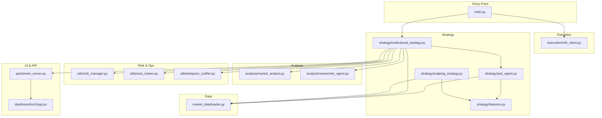
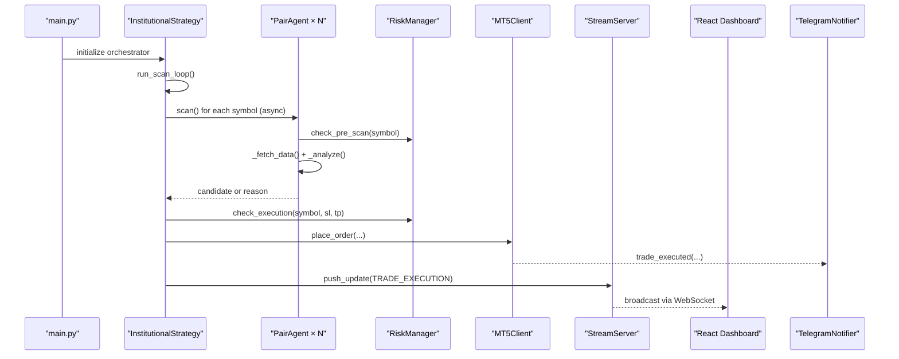
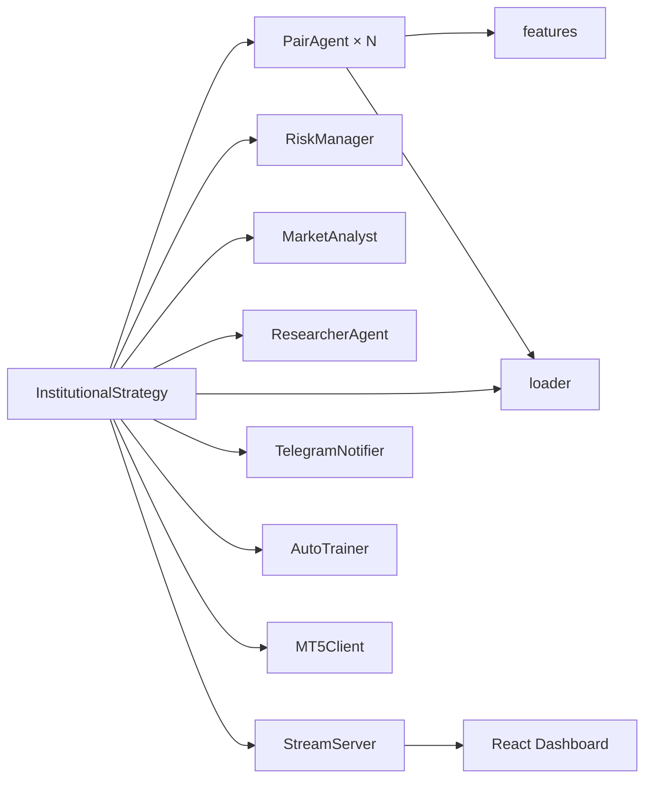

# Key Features Overview

<cite>
**Referenced Files in This Document**
- [main.py](file://main.py)
- [README.md](file://README.md)
- [config/settings.py](file://config/settings.py)
- [strategy/institutional_strategy.py](file://strategy/institutional_strategy.py)
- [strategy/scalping_strategy.py](file://strategy/scalping_strategy.py)
- [strategy/pair_agent.py](file://strategy/pair_agent.py)
- [strategy/features.py](file://strategy/features.py)
- [market_data/loader.py](file://market_data/loader.py)
- [utils/risk_manager.py](file://utils/risk_manager.py)
- [utils/auto_trainer.py](file://utils/auto_trainer.py)
- [utils/telegram_notifier.py](file://utils/telegram_notifier.py)
- [api/stream_server.py](file://api/stream_server.py)
- [dashboard/src/App.jsx](file://dashboard/src/App.jsx)
- [execution/mt5_client.py](file://execution/mt5_client.py)
- [optimize_walkforward.py](file://optimize_walkforward.py)
</cite>

## Table of Contents
1. [Introduction](#introduction)
2. [Project Structure](#project-structure)
3. [Core Components](#core-components)
4. [Architecture Overview](#architecture-overview)
5. [Detailed Component Analysis](#detailed-component-analysis)
6. [Dependency Analysis](#dependency-analysis)
7. [Performance Considerations](#performance-considerations)
8. [Troubleshooting Guide](#troubleshooting-guide)
9. [Conclusion](#conclusion)
10. [Appendices](#appendices)

## Introduction
This document explains the Institutional SureShot Scanner’s key features and how they integrate into a cohesive, real-time trading system. It covers:
- All-symbol scanning with automatic broker symbol detection
- Scalping engine with multi-timeframe confirmation
- Institutional risk management (kill switches, payoff mandates, trailing stops, partial closes)
- Real-time React dashboard and WebSocket/REST streaming
- Telegram alerts for trade events
- Walk-forward optimization and self-learning model retraining
- Practical examples of how features work together

The goal is to help both beginners and experienced developers understand purpose, configuration, and integration patterns.

## Project Structure
The system is organized around a central orchestrator, per-symbol agents, shared analysis modules, and infrastructure for execution, risk, and observability.

**Diagram sources**
- [main.py](file://main.py#L1-L122)
- [execution/mt5_client.py](file://execution/mt5_client.py#L1-L385)
- [strategy/institutional_strategy.py](file://strategy/institutional_strategy.py#L1-L500)
- [strategy/pair_agent.py](file://strategy/pair_agent.py#L1-L432)
- [strategy/features.py](file://strategy/features.py#L1-L242)
- [strategy/scalping_strategy.py](file://strategy/scalping_strategy.py#L1-L291)
- [analysis/market_analyst.py](file://analysis/market_analyst.py#L1-L81)
- [analysis/researcher_agent.py](file://analysis/researcher_agent.py#L1-L132)
- [utils/risk_manager.py](file://utils/risk_manager.py#L1-L549)
- [utils/auto_trainer.py](file://utils/auto_trainer.py#L1-L518)
- [utils/telegram_notifier.py](file://utils/telegram_notifier.py#L1-L174)
- [market_data/loader.py](file://market_data/loader.py#L1-L83)
- [api/stream_server.py](file://api/stream_server.py#L1-L212)
- [dashboard/src/App.jsx](file://dashboard/src/App.jsx#L1-L104)

**Section sources**
- [README.md](file://README.md#L187-L235)
- [main.py](file://main.py#L1-L122)

## Core Components
- InstitutionalStrategy orchestrates scanning, research synthesis, and execution across all detected symbols.
- PairAgent encapsulates per-symbol intelligence: data fetching, quant analysis, regime awareness, and candidate construction.
- RiskManager enforces pre-scan and execution gating, position sizing, trailing/BE/partial close, and kill switches.
- AutoTrainer performs background retraining of ML models and triggers emergency relearnings.
- TelegramNotifier sends non-blocking real-time alerts.
- StreamServer powers the WebSocket and REST endpoints for the React dashboard.
- MT5Client manages broker connectivity, symbol detection, order placement, and position management.

**Section sources**
- [strategy/institutional_strategy.py](file://strategy/institutional_strategy.py#L49-L104)
- [strategy/pair_agent.py](file://strategy/pair_agent.py#L22-L71)
- [utils/risk_manager.py](file://utils/risk_manager.py#L14-L40)
- [utils/auto_trainer.py](file://utils/auto_trainer.py#L80-L136)
- [utils/telegram_notifier.py](file://utils/telegram_notifier.py#L30-L51)
- [api/stream_server.py](file://api/stream_server.py#L17-L84)
- [execution/mt5_client.py](file://execution/mt5_client.py#L12-L38)

## Architecture Overview
The system runs an asynchronous scanning loop that:
- Detects available symbols on the broker
- Spawns per-symbol PairAgents to analyze M1 with optional M5/H1/H4 confirmations
- Applies regime-aware filters and quant scores
- Synthesizes a final recommendation via ResearcherAgent
- Executes only when RiskManager approvals are met
- Streams state to the dashboard and sends Telegram alerts

**Diagram sources**
- [main.py](file://main.py#L75-L106)
- [strategy/institutional_strategy.py](file://strategy/institutional_strategy.py#L99-L330)
- [strategy/pair_agent.py](file://strategy/pair_agent.py#L71-L106)
- [utils/risk_manager.py](file://utils/risk_manager.py#L237-L295)
- [execution/mt5_client.py](file://execution/mt5_client.py#L216-L292)
- [api/stream_server.py](file://api/stream_server.py#L177-L212)
- [utils/telegram_notifier.py](file://utils/telegram_notifier.py#L66-L81)
- [dashboard/src/App.jsx](file://dashboard/src/App.jsx#L12-L104)

## Detailed Component Analysis

### All-Symbol Scanning and Auto-Detection
- Auto-detection: The system connects to MT5 and enumerates available instruments, filtering out disabled or exotic quote currencies, then categorizes into Forex majors/minors, crypto, and commodities.
- No hardcoded symbol lists: the entire universe adapts to the broker account.
- Configuration: Broker credentials and path are loaded from environment variables; base symbol lists are pruned for expectancy.

Practical example:
- On startup, the orchestrator initializes MT5, detects symbols, and prints counts and categories.

**Section sources**
- [execution/mt5_client.py](file://execution/mt5_client.py#L29-L101)
- [config/settings.py](file://config/settings.py#L17-L61)
- [main.py](file://main.py#L25-L55)

### Scalping Engine and Multi-Timeframe Analysis
- Timeframes: Primary M1 scanning with optional M5/H1/H4 trend filters.
- Volatility gating: ATR thresholds prevent entries in low-volatility environments.
- Position sizing: ATR-based SL/TP with dynamic sizing; optional Kelly fraction for higher histories.
- Trend filters: Only allow entries aligned with higher timeframe trends.

Practical example:
- PairAgent fetches M1 data and optionally M5/H1/H4; constructs candidate with ATR-derived SL/TP distances and applies regime and volatility filters.

**Section sources**
- [strategy/pair_agent.py](file://strategy/pair_agent.py#L107-L144)
- [strategy/pair_agent.py](file://strategy/pair_agent.py#L145-L295)
- [strategy/features.py](file://strategy/features.py#L6-L98)
- [market_data/loader.py](file://market_data/loader.py#L62-L83)
- [config/settings.py](file://config/settings.py#L150-L154)
- [config/settings.py](file://config/settings.py#L104-L109)

### Institutional Risk Management
- Kill Switch: Disables a symbol after sustained recent losses.
- Payoff Mandate: Blocks symbols where average loss exceeds a configured multiple of average win.
- Overrides: Whitelist key symbols to bypass checks.
- Position sizing: ATR/Kelly-adjusted lot sizing with tail-risk clamping for volatile symbols.
- Partial profit taking and trailing stops: Dynamic ATR-based trailing with breakeven moves.
- Daily caps: Max trades, max daily drawdown, and concurrent trade limits.
- Spread gates and session filters: Tight spreads and London/NY session windows for scalps.

Practical example:
- RiskManager evaluates pre-scan conditions (daily limit, cooldown, spread, news blackout, session), then checks execution feasibility (correlation conflicts, profitability, and R:R).

**Section sources**
- [utils/risk_manager.py](file://utils/risk_manager.py#L51-L163)
- [utils/risk_manager.py](file://utils/risk_manager.py#L237-L295)
- [utils/risk_manager.py](file://utils/risk_manager.py#L341-L396)
- [utils/risk_manager.py](file://utils/risk_manager.py#L399-L548)
- [config/settings.py](file://config/settings.py#L123-L138)
- [config/settings.py](file://config/settings.py#L139-L149)
- [config/settings.py](file://config/settings.py#L93-L103)

### React Dashboard and Real-Time Streaming
- WebSocket + REST: The server exposes endpoints for account, positions, recent trades, and scan summaries; broadcasts state snapshots to connected clients.
- Dashboard layout: Account overview, scanner grid, positions table, trade feed, and event log.
- Live polling: The React app polls REST endpoints; WebSocket pushes updates for live positions and scan summaries.

Practical example:
- The orchestrator emits ACCOUNT_UPDATE, POSITION_UPDATE, SCAN_SUMMARY, and TRADE_EXECUTION events; StreamServer maintains in-memory state and broadcasts.

**Section sources**
- [api/stream_server.py](file://api/stream_server.py#L17-L84)
- [api/stream_server.py](file://api/stream_server.py#L177-L212)
- [dashboard/src/App.jsx](file://dashboard/src/App.jsx#L12-L104)
- [strategy/institutional_strategy.py](file://strategy/institutional_strategy.py#L185-L237)

### Telegram Alerts
- Non-blocking notifications: All alerts are sent asynchronously to avoid slowing the trading loop.
- Coverage: Bot startup, scan candidates, trade executions, kill switch activations, and generic alerts.
- Configuration: Bot token and chat ID from environment variables.

Practical example:
- On trade execution, the orchestrator triggers TelegramNotifier.trade_executed; on scan candidates, TelegramNotifier.scan_candidates.

**Section sources**
- [utils/telegram_notifier.py](file://utils/telegram_notifier.py#L30-L64)
- [utils/telegram_notifier.py](file://utils/telegram_notifier.py#L66-L107)
- [utils/telegram_notifier.py](file://utils/telegram_notifier.py#L121-L128)
- [strategy/institutional_strategy.py](file://strategy/institutional_strategy.py#L264-L266)
- [strategy/institutional_strategy.py](file://strategy/institutional_strategy.py#L399-L401)

### Walk-Forward Optimization
- Purpose: Robust hyperparameter selection across all detected symbols using in-sample/out-of-sample windows.
- Approach: Aggregates M1 data from all symbols, computes ATR-based barriers, and evaluates Sharpe-like proxies across rolling windows.
- Outputs: Best parameters saved to models/best_params.json and can be loaded into settings.

Practical example:
- The script collects M1 data for all symbols, builds feature sets, simulates strategies over rolling windows, and selects the combination with the highest average OOS Sharpe.

**Section sources**
- [optimize_walkforward.py](file://optimize_walkforward.py#L1-L241)
- [optimize_walkforward.py](file://optimize_walkforward.py#L100-L237)

### Self-Learning Model Retraining
- Background thread continuously monitors performance and retrains models:
  - Random Forest/XGBoost: every 4–6 hours on M15 features labeled with ATR barriers
  - LSTM: every 8 hours for key symbols
- Emergency retrain: triggered if win rate falls below a threshold.
- Hot-swapping: validated models are atomically swapped into the running strategy.

Practical example:
- AutoTrainer periodically checks daily stats, retrains models, and updates predictors used by PairAgent and InstitutionalStrategy.

**Section sources**
- [utils/auto_trainer.py](file://utils/auto_trainer.py#L80-L136)
- [utils/auto_trainer.py](file://utils/auto_trainer.py#L175-L194)
- [utils/auto_trainer.py](file://utils/auto_trainer.py#L196-L275)
- [utils/auto_trainer.py](file://utils/auto_trainer.py#L278-L347)
- [utils/auto_trainer.py](file://utils/auto_trainer.py#L351-L495)

### Researcher Agent and Debate Synthesis
- Provides a final recommendation by synthesizing quant signals and market regime.
- Uses an LLM advisor when configured; otherwise falls back to technical confidence.
- Output: action (BUY/SELL/HOLD), confidence percentage, and reason.

Practical example:
- After collecting candidates, InstitutionalStrategy calls ResearcherAgent to review the best candidate and decide whether to execute.

**Section sources**
- [analysis/researcher_agent.py](file://analysis/researcher_agent.py#L17-L83)
- [strategy/institutional_strategy.py](file://strategy/institutional_strategy.py#L267-L324)

### Execution and Position Management
- Order placement supports both ATR-based and legacy pip-based SL/TP.
- Position management includes partial closes, trailing stops, and breakeven moves.
- MT5Client also calculates lot sizes based on account risk and SL distance.

Practical example:
- On execution, InstitutionalStrategy computes SL/TP, asks RiskManager for approval, places order via MT5Client, and logs the trade.

**Section sources**
- [execution/mt5_client.py](file://execution/mt5_client.py#L216-L292)
- [execution/mt5_client.py](file://execution/mt5_client.py#L146-L196)
- [utils/risk_manager.py](file://utils/risk_manager.py#L399-L548)
- [strategy/institutional_strategy.py](file://strategy/institutional_strategy.py#L331-L435)

## Dependency Analysis
The system exhibits clear separation of concerns:
- Central orchestration in InstitutionalStrategy coordinates agents and risk.
- PairAgent encapsulates symbol-specific logic and integrates with shared analysis.
- RiskManager is a cross-cutting concern for all execution paths.
- AutoTrainer operates independently to maintain model quality.
- StreamServer decouples UI from trading logic via events.

**Diagram sources**
- [strategy/institutional_strategy.py](file://strategy/institutional_strategy.py#L54-L87)
- [strategy/pair_agent.py](file://strategy/pair_agent.py#L27-L54)
- [utils/risk_manager.py](file://utils/risk_manager.py#L14-L18)
- [utils/auto_trainer.py](file://utils/auto_trainer.py#L80-L100)
- [api/stream_server.py](file://api/stream_server.py#L17-L35)
- [execution/mt5_client.py](file://execution/mt5_client.py#L12-L28)

**Section sources**
- [strategy/institutional_strategy.py](file://strategy/institutional_strategy.py#L49-L104)
- [strategy/pair_agent.py](file://strategy/pair_agent.py#L22-L54)
- [utils/risk_manager.py](file://utils/risk_manager.py#L14-L40)
- [utils/auto_trainer.py](file://utils/auto_trainer.py#L80-L136)
- [api/stream_server.py](file://api/stream_server.py#L17-L84)
- [execution/mt5_client.py](file://execution/mt5_client.py#L12-L38)

## Performance Considerations
- Asynchronous scanning: PairAgents run concurrently to minimize scan latency.
- Adaptive sleep: The loop adjusts sleep based on cycle duration and session overlap.
- Efficient data fetching: Multi-timeframe data is requested only when enabled.
- Lightweight trailing logic: Uses cached ATR and thresholded modifications to reduce unnecessary re-quotes.
- Background retraining: Keeps models fresh without impacting live scans.

[No sources needed since this section provides general guidance]

## Troubleshooting Guide
Common issues and remedies:
- No symbols detected: Verify broker credentials and that symbols are visible in Market Watch.
- Orders failing: Check deviation tolerance, spread gates, and session filters.
- Dashboard not updating: Confirm StreamServer is running and WebSocket endpoint is reachable.
- Telegram alerts not sending: Validate bot token and chat ID; use the helper script to retrieve chat ID.
- Poor performance: Use walk-forward optimization to tune parameters; enable AutoTrainer to retrain models.

**Section sources**
- [execution/mt5_client.py](file://execution/mt5_client.py#L103-L105)
- [utils/telegram_notifier.py](file://utils/telegram_notifier.py#L154-L174)
- [api/stream_server.py](file://api/stream_server.py#L153-L173)
- [optimize_walkforward.py](file://optimize_walkforward.py#L100-L117)

## Conclusion
The Institutional SureShot Scanner combines robust multi-symbol scanning, disciplined risk controls, real-time observability, and adaptive learning to form a cohesive trading system. Its modular design enables easy configuration, reliable execution, and continuous improvement.

[No sources needed since this section summarizes without analyzing specific files]

## Appendices

### Configuration Reference (selected highlights)
- Trading and risk:
  - RISK_PERCENT, MAX_RISK_PERCENT, ATR_SL_MULTIPLIER, ATR_TP_MULTIPLIER
  - MIN_CONFLUENCE_SCORE, SURESHOT_MIN_SCORE, RF_PROB_THRESHOLD
  - MAX_DAILY_TRADES, MAX_DAILY_LOSS_USD, MAX_OPEN_POSITIONS, MAX_CONCURRENT_TRADES
  - VOLATILITY_ATR_MIN*, MAX_SPREAD_PIPS*
  - KILL_SWITCH_* and AVG_LOSS_RATIO_THRESHOLD
  - TRAILING_STOP_ATR_ACTIVATE/STEP, PARTIAL_CLOSE_FRACTION, BREAKEVEN_RR
- Timeframes and trend filters:
  - TIMEFRAME, M5_TREND_FILTER, H1_TREND_FILTER, H4_TREND_FILTER
- AI and news:
  - NEWS_CALENDAR_URL, NEWS_PRE_MINUTES, NEWS_POST_MINUTES
  - SESSION_FILTER and TRADE_SESSIONS
- Telegram:
  - TELEGRAM_BOT_TOKEN, TELEGRAM_CHAT_ID

**Section sources**
- [config/settings.py](file://config/settings.py#L69-L167)
- [config/settings.py](file://config/settings.py#L169-L201)