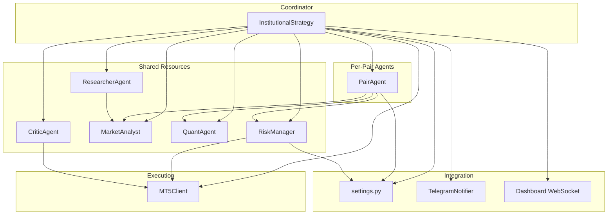
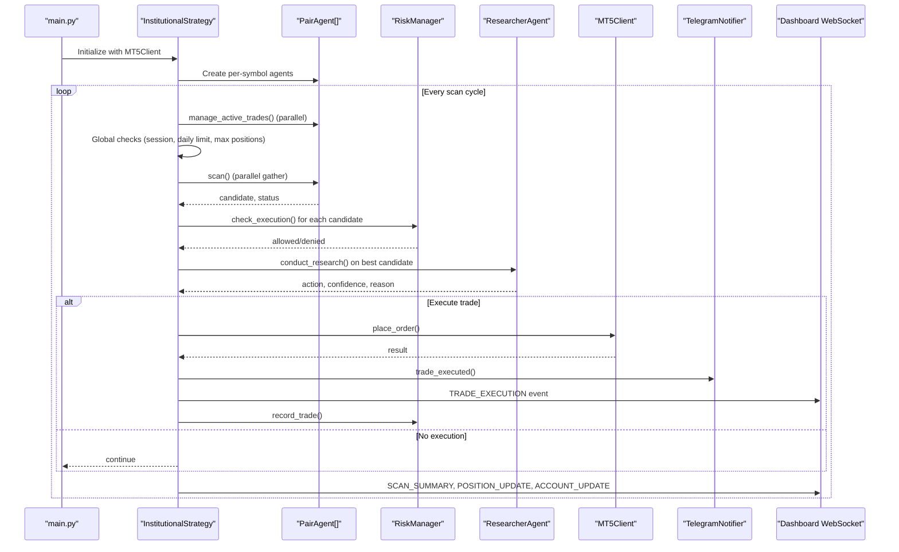
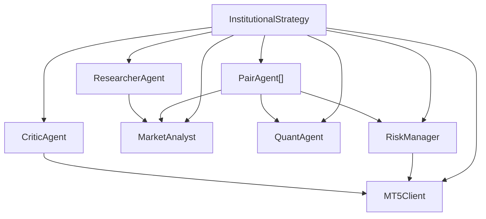

# InstitutionalStrategy Coordinator

<cite>
**Referenced Files in This Document**
- [institutional_strategy.py](file://strategy/institutional_strategy.py)
- [pair_agent.py](file://strategy/pair_agent.py)
- [risk_manager.py](file://utils/risk_manager.py)
- [market_analyst.py](file://analysis/market_analyst.py)
- [quant_agent.py](file://analysis/quant_agent.py)
- [researcher_agent.py](file://analysis/researcher_agent.py)
- [critic_agent.py](file://analysis/critic_agent.py)
- [telegram_notifier.py](file://utils/telegram_notifier.py)
- [settings.py](file://config/settings.py)
- [mt5_client.py](file://execution/mt5_client.py)
- [main.py](file://main.py)
- [useBotWebSocket.js](file://dashboard/src/hooks/useBotWebSocket.js)
</cite>

## Table of Contents
1. [Introduction](#introduction)
2. [Project Structure](#project-structure)
3. [Core Components](#core-components)
4. [Architecture Overview](#architecture-overview)
5. [Detailed Component Analysis](#detailed-component-analysis)
6. [Dependency Analysis](#dependency-analysis)
7. [Performance Considerations](#performance-considerations)
8. [Troubleshooting Guide](#troubleshooting-guide)
9. [Conclusion](#conclusion)

## Introduction
This document explains the InstitutionalStrategy coordinator agent, the central orchestrator of the Institutional Trading System. It manages all PairAgent instances, coordinates scanning loops, enforces global risk controls, and integrates with shared resources (RiskManager, MarketAnalyst, QuantAgent, ResearcherAgent, CriticAgent). It documents the initialization process, shared resource management, the main run_scan_loop method, parallel execution patterns, candidate evaluation logic, execution decision making, scanning workflow, trade execution process, event broadcasting to the dashboard, session management, daily limits, position tracking, state management, performance monitoring, and Telegram integration.

## Project Structure
The InstitutionalStrategy is part of a modular, multi-agent architecture:
- Coordinator: InstitutionalStrategy orchestrates scanning and execution
- Per-Pair Agents: PairAgent performs symbol-specific scanning and active trade management
- Shared Resources: RiskManager, MarketAnalyst, QuantAgent, ResearcherAgent, CriticAgent
- Execution: MT5Client handles MT5 connectivity and order placement
- Configuration: settings.py defines trading parameters and thresholds
- Dashboard: WebSocket and REST endpoints broadcast live events and state snapshots
- Notifications: TelegramNotifier sends real-time alerts

**Diagram sources**
- [institutional_strategy.py](file://strategy/institutional_strategy.py#L49-L94)
- [pair_agent.py](file://strategy/pair_agent.py#L22-L54)
- [risk_manager.py](file://utils/risk_manager.py#L14-L36)
- [market_analyst.py](file://analysis/market_analyst.py#L7-L20)
- [quant_agent.py](file://analysis/quant_agent.py#L34-L50)
- [researcher_agent.py](file://analysis/researcher_agent.py#L5-L15)
- [critic_agent.py](file://analysis/critic_agent.py#L10-L15)
- [mt5_client.py](file://execution/mt5_client.py#L12-L27)
- [settings.py](file://config/settings.py#L1-L201)
- [telegram_notifier.py](file://utils/telegram_notifier.py#L30-L40)
- [useBotWebSocket.js](file://dashboard/src/hooks/useBotWebSocket.js#L1-L156)

**Section sources**
- [institutional_strategy.py](file://strategy/institutional_strategy.py#L49-L94)
- [pair_agent.py](file://strategy/pair_agent.py#L22-L54)
- [risk_manager.py](file://utils/risk_manager.py#L14-L36)
- [market_analyst.py](file://analysis/market_analyst.py#L7-L20)
- [quant_agent.py](file://analysis/quant_agent.py#L34-L50)
- [researcher_agent.py](file://analysis/researcher_agent.py#L5-L15)
- [critic_agent.py](file://analysis/critic_agent.py#L10-L15)
- [mt5_client.py](file://execution/mt5_client.py#L12-L27)
- [settings.py](file://config/settings.py#L1-L201)
- [telegram_notifier.py](file://utils/telegram_notifier.py#L30-L40)
- [useBotWebSocket.js](file://dashboard/src/hooks/useBotWebSocket.js#L1-L156)

## Core Components
- InstitutionalStrategy: Central coordinator that initializes shared resources, creates PairAgent instances per symbol, runs the scanning loop, evaluates candidates, executes trades, and broadcasts events.
- PairAgent: Symbol-specific agent performing data fetching, quant analysis, regime analysis, BOS fusion, candidate construction, and active trade management.
- RiskManager: Global risk control layer enforcing daily limits, correlation conflicts, spread checks, payoff mandates, and position sizing.
- MarketAnalyst: Regime detector and AI advisor integration for market sentiment and session analysis.
- QuantAgent: Technical analysis and ML inference engine generating confluence scores and ensemble signals.
- ResearcherAgent: Async debate synthesis combining quant and analyst outputs to produce a final conviction decision.
- CriticAgent: Post-mortem analysis of closed trades to improve future decisions.
- MT5Client: MT5 connectivity, symbol detection, order placement, position management, and account queries.
- TelegramNotifier: Real-time Telegram alerts for trades, scans, and system events.
- settings.py: Central configuration for trading parameters, risk controls, and operational modes.
- Dashboard WebSocket: Live event streaming to the frontend for monitoring.

**Section sources**
- [institutional_strategy.py](file://strategy/institutional_strategy.py#L49-L94)
- [pair_agent.py](file://strategy/pair_agent.py#L22-L54)
- [risk_manager.py](file://utils/risk_manager.py#L14-L36)
- [market_analyst.py](file://analysis/market_analyst.py#L7-L20)
- [quant_agent.py](file://analysis/quant_agent.py#L34-L50)
- [researcher_agent.py](file://analysis/researcher_agent.py#L5-L15)
- [critic_agent.py](file://analysis/critic_agent.py#L10-L15)
- [mt5_client.py](file://execution/mt5_client.py#L12-L27)
- [telegram_notifier.py](file://utils/telegram_notifier.py#L30-L40)
- [settings.py](file://config/settings.py#L1-L201)

## Architecture Overview
The InstitutionalStrategy operates as a central orchestrator:
- Initialization: Creates shared resources and PairAgent instances for each symbol in settings.SYMBOLS.
- Scanning Loop: Runs periodically, manages active trades, performs global checks, scans all PairAgents in parallel, filters candidates via RiskManager, sorts candidates, consults ResearcherAgent, and executes trades when conditions are met.
- Execution: Validates direction and symbol tradeability, enforces R:R mandate, calculates position size, places orders, records trades, and notifies agents and dashboard.
- Monitoring: Periodically triggers CriticAgent reviews, maintains daily counts, and tracks session-awareness.
- Integration: Emits structured events to the dashboard WebSocket and Telegram notifier.

**Diagram sources**
- [main.py](file://main.py#L57-L85)
- [institutional_strategy.py](file://strategy/institutional_strategy.py#L99-L330)
- [pair_agent.py](file://strategy/pair_agent.py#L71-L105)
- [risk_manager.py](file://utils/risk_manager.py#L237-L295)
- [researcher_agent.py](file://analysis/researcher_agent.py#L17-L82)
- [mt5_client.py](file://execution/mt5_client.py#L216-L292)
- [telegram_notifier.py](file://utils/telegram_notifier.py#L66-L81)
- [useBotWebSocket.js](file://dashboard/src/hooks/useBotWebSocket.js#L46-L80)

**Section sources**
- [main.py](file://main.py#L57-L85)
- [institutional_strategy.py](file://strategy/institutional_strategy.py#L99-L330)
- [pair_agent.py](file://strategy/pair_agent.py#L71-L105)
- [risk_manager.py](file://utils/risk_manager.py#L237-L295)
- [researcher_agent.py](file://analysis/researcher_agent.py#L17-L82)
- [mt5_client.py](file://execution/mt5_client.py#L216-L292)
- [telegram_notifier.py](file://utils/telegram_notifier.py#L66-L81)
- [useBotWebSocket.js](file://dashboard/src/hooks/useBotWebSocket.js#L46-L80)

## Detailed Component Analysis

### InstitutionalStrategy Coordinator
Responsibilities:
- Initializes shared resources (RiskManager, MarketAnalyst, QuantAgent, ResearcherAgent, CriticAgent).
- Creates PairAgent instances for each symbol and stores them in a dictionary keyed by symbol.
- Runs the scanning loop with parallel execution across all PairAgents.
- Performs global checks (session, daily limit, max positions).
- Evaluates candidates, applies execution checks, sorts candidates, consults ResearcherAgent, and executes trades.
- Broadcasts events to the dashboard and Telegram notifier.
- Manages daily trade counts, last trade timestamps, and last candle times per symbol.
- Periodically triggers CriticAgent reviews.

Key methods and logic:
- run_scan_loop(): Orchestrates the scanning loop, manages active trades, performs global checks, scans agents in parallel, filters candidates, sorts, consults ResearcherAgent, and executes trades.
- _execute_trade(): Validates direction and symbol tradeability, enforces R:R mandate, calculates position size, places orders, records trades, and notifies agents and dashboard.
- Helper methods: _is_trading_session(), _check_daily_limit(), _get_current_session(), _is_new_candle(), _print_scan_summary().

Parallel execution pattern:
- Uses asyncio.gather to run manage_active_trades() and scan() across all PairAgents concurrently.

Candidate evaluation and execution decision:
- Candidates are filtered by RiskManager.check_execution() using approximate SL/TP derived from the latest close and configured ATR multipliers.
- Sorting is performed by score and ML probability.
- ResearcherAgent provides a final decision with confidence; execution occurs if direction aligns with researcher action and confidence meets thresholds, or if the score exceeds sureshot threshold, or if aggressive mode allows HOLD with minimal confluence.

Event broadcasting:
- Emits SCAN_START, SCAN_SUMMARY, POSITION_UPDATE, ACCOUNT_UPDATE, RESEARCH_START, RESEARCH_RESULT, and TRADE_EXECUTION events to the dashboard via on_event callback.

Session management and daily limits:
- Session awareness uses settings.TRADE_SESSIONS and settings.SESSION_FILTER.
- Daily trade count resets daily and enforces MAX_DAILY_TRADES.

Position tracking:
- Maintains last_trade_time per symbol and last_candle_time per symbol.
- Retrieves positions via MT5Client and updates state accordingly.

Performance monitoring:
- Tracks last_critic_run and schedules CriticAgent reviews every 5 minutes.
- Prints cycle statistics and adaptive sleep between cycles.

Integration with external systems:
- TelegramNotifier is used for scan summaries and trade execution alerts.
- Dashboard WebSocket receives structured events for live monitoring.

**Section sources**
- [institutional_strategy.py](file://strategy/institutional_strategy.py#L49-L94)
- [institutional_strategy.py](file://strategy/institutional_strategy.py#L99-L330)
- [institutional_strategy.py](file://strategy/institutional_strategy.py#L331-L436)
- [institutional_strategy.py](file://strategy/institutional_strategy.py#L438-L497)

### PairAgent (Per-Pair Agent)
Responsibilities:
- Performs data fetching (primary and multi-timeframe).
- Executes QuantAgent analysis and MarketAnalyst regime detection.
- Applies BOS fusion logic and constructs candidates with volatility-adjusted SL/TP.
- Enforces pre-scan risk checks and filters (news blackout, cooldown, spread, session).
- Manages active trades with RiskManager monitoring and regime exits.
- Updates performance state and circuit breaker logic.

Key methods and logic:
- scan(): Orchestrates news filter, cooldown, pre-scan risk check, data fetch, quant analysis, regime analysis, BOS fusion, candidate construction, and returns (candidate, status).
- manage_active_trades(): Monitors positions, executes trailing stops, partial closes, and regime exits.
- _fetch_data(): Loads historical data for primary and optional M5/H1/H4 timeframes.
- _analyze(): Computes quant signals, regime, BOS, and constructs candidate with ATR-based SL/TP and scaling factor.

Filtering and gating:
- Minimum confluence score, ML probability threshold, regime conflict checks, volatility-adaptive entry gating, and R:R enforcement.

Retail viability checks:
- Spread ratio and hunting hours filtering for BOS-only candidates.

**Section sources**
- [pair_agent.py](file://strategy/pair_agent.py#L22-L54)
- [pair_agent.py](file://strategy/pair_agent.py#L71-L105)
- [pair_agent.py](file://strategy/pair_agent.py#L107-L144)
- [pair_agent.py](file://strategy/pair_agent.py#L145-L295)
- [pair_agent.py](file://strategy/pair_agent.py#L297-L376)
- [pair_agent.py](file://strategy/pair_agent.py#L400-L428)

### RiskManager (Global Risk Control)
Responsibilities:
- Daily trade count and reset logic using SharedState.
- Pre-scan checks: circuit breaker, daily limit, kill switch, payoff mandate, daily loss limit, cooldown, spread, news blackout, and session filter.
- Execution checks: concurrent trade caps, live correlation conflict, profitability check.
- Position sizing: Kelly criterion fallback and confluence-tier sizing with tail risk clamping.
- Active trade monitoring: trailing stops, break-even, partial closes.

Key methods and logic:
- check_pre_scan(): Comprehensive pre-execution checks.
- check_execution(): Final execution gate with correlation and profitability checks.
- calculate_position_size(): Dynamic lot sizing with Kelly and confluence tiers.
- monitor_positions(): Generates MODIFY/PARTIAL actions for trailing and partial exits.

**Section sources**
- [risk_manager.py](file://utils/risk_manager.py#L14-L36)
- [risk_manager.py](file://utils/risk_manager.py#L51-L163)
- [risk_manager.py](file://utils/risk_manager.py#L237-L295)
- [risk_manager.py](file://utils/risk_manager.py#L341-L396)
- [risk_manager.py](file://utils/risk_manager.py#L399-L548)

### MarketAnalyst (Regime and AI Advisor)
Responsibilities:
- Regime detection and session analysis.
- AI opinion retrieval via MistralAdvisor.
- News blackout checks and state persistence.

**Section sources**
- [market_analyst.py](file://analysis/market_analyst.py#L7-L20)
- [market_analyst.py](file://analysis/market_analyst.py#L25-L71)
- [market_analyst.py](file://analysis/market_analyst.py#L73-L81)

### QuantAgent (Technical and ML Analysis)
Responsibilities:
- Loads ML models (RF/XGBoost, LSTM, Lag-Llama).
- Computes trends across M5/H1/H4.
- Generates ML probabilities and AI signals.
- Calculates confluence score and ensemble vote.

**Section sources**
- [quant_agent.py](file://analysis/quant_agent.py#L34-L50)
- [quant_agent.py](file://analysis/quant_agent.py#L109-L159)
- [quant_agent.py](file://analysis/quant_agent.py#L228-L293)

### ResearcherAgent (Debate and Synthesis)
Responsibilities:
- Conducts async debate synthesis combining quant and analyst outputs.
- Parses structured LLM responses to produce action, confidence, and reason.
- Falls back to technical confidence when API key is missing.

**Section sources**
- [researcher_agent.py](file://analysis/researcher_agent.py#L5-L15)
- [researcher_agent.py](file://analysis/researcher_agent.py#L17-L82)
- [researcher_agent.py](file://analysis/researcher_agent.py#L84-L132)

### CriticAgent (Post-Mortem Analysis)
Responsibilities:
- Reviews closed trades without post-mortem.
- Asks Mistral for brutal honesty assessment.
- Updates trade records and emits CRITIC_REVIEW events.

**Section sources**
- [critic_agent.py](file://analysis/critic_agent.py#L10-L15)
- [critic_agent.py](file://analysis/critic_agent.py#L17-L52)
- [critic_agent.py](file://analysis/critic_agent.py#L71-L127)

### MT5Client (Execution and Position Management)
Responsibilities:
- Connects to MT5, detects available symbols, and selects them.
- Provides account info and history deals.
- Calculates lot sizes and places orders with ATR-based or pip-based SL/TP.
- Manages partial closes and position modifications.

**Section sources**
- [mt5_client.py](file://execution/mt5_client.py#L12-L27)
- [mt5_client.py](file://execution/mt5_client.py#L29-L101)
- [mt5_client.py](file://execution/mt5_client.py#L108-L142)
- [mt5_client.py](file://execution/mt5_client.py#L146-L195)
- [mt5_client.py](file://execution/mt5_client.py#L216-L292)
- [mt5_client.py](file://execution/mt5_client.py#L296-L385)

### TelegramNotifier (Notifications)
Responsibilities:
- Sends formatted Telegram messages for trade executions, scan summaries, daily summaries, and alerts.
- Non-blocking threaded sender with singleton pattern.

**Section sources**
- [telegram_notifier.py](file://utils/telegram_notifier.py#L30-L40)
- [telegram_notifier.py](file://utils/telegram_notifier.py#L66-L120)
- [telegram_notifier.py](file://utils/telegram_notifier.py#L142-L150)

### Settings (Configuration)
Responsibilities:
- Defines trading parameters, risk controls, thresholds, and operational modes.
- Includes symbol universes, timeframes, risk percentages, ATR multipliers, session windows, and notification settings.

**Section sources**
- [settings.py](file://config/settings.py#L1-L201)

### Dashboard WebSocket Integration
Responsibilities:
- Receives structured events from the coordinator and updates the React state.
- Polls REST endpoints for positions, account, and recent trades.
- Maintains event history and snapshot state.

**Section sources**
- [useBotWebSocket.js](file://dashboard/src/hooks/useBotWebSocket.js#L1-L156)

## Dependency Analysis
The InstitutionalStrategy coordinates tightly coupled components:
- InstitutionalStrategy depends on MT5Client for execution and account queries.
- InstitutionalStrategy composes shared agents: RiskManager, MarketAnalyst, QuantAgent, ResearcherAgent, CriticAgent.
- InstitutionalStrategy creates PairAgent instances per symbol and delegates scanning and active trade management.
- PairAgent depends on RiskManager for pre-scan checks and position monitoring.
- RiskManager depends on MT5Client for account and symbol info, and on SharedState for persistent counters.
- ResearcherAgent depends on MarketAnalyst for regime context.
- TelegramNotifier and Dashboard WebSocket integrate externally for observability.

**Diagram sources**
- [institutional_strategy.py](file://strategy/institutional_strategy.py#L54-L86)
- [pair_agent.py](file://strategy/pair_agent.py#L27-L32)
- [risk_manager.py](file://utils/risk_manager.py#L15-L17)
- [researcher_agent.py](file://analysis/researcher_agent.py#L13-L14)
- [critic_agent.py](file://analysis/critic_agent.py#L11-L14)

**Section sources**
- [institutional_strategy.py](file://strategy/institutional_strategy.py#L54-L86)
- [pair_agent.py](file://strategy/pair_agent.py#L27-L32)
- [risk_manager.py](file://utils/risk_manager.py#L15-L17)
- [researcher_agent.py](file://analysis/researcher_agent.py#L13-L14)
- [critic_agent.py](file://analysis/critic_agent.py#L11-L14)

## Performance Considerations
- Parallelism: asyncio.gather maximizes throughput by scanning all PairAgents concurrently and managing active trades in parallel.
- Data caching: DataCache and per-agent ATR caching reduce redundant computations.
- Adaptive sleep: The main loop adapts sleep time based on cycle duration to maintain steady cadence.
- Position sizing: Kelly criterion and confluence tiers balance risk and reward dynamically.
- Correlation filtering: Live correlation checks prevent over-concentration and reduce drawdown risk.
- Session gating: Trading sessions minimize slippage and improve expectancy.

[No sources needed since this section provides general guidance]

## Troubleshooting Guide
Common issues and resolutions:
- No candidates found: Verify settings thresholds (MIN_CONFLUENCE_SCORE, RF_PROB_THRESHOLD) and session filters. Check PairAgent logs for low volatility or regime conflicts.
- Execution blocked: Review RiskManager reasons (daily limit, correlation conflict, spread too high, payoff mandate). Confirm symbol tradeability and R:R compliance.
- Telegram alerts not received: Ensure TELEGRAM_BOT_TOKEN and TELEGRAM_CHAT_ID are set in .env and the notifier is enabled.
- Dashboard not updating: Confirm WebSocket server is running on port 8000 and the React app connects to ws://localhost:8000/ws.
- MT5 connection failures: Validate credentials and server path in settings; ensure MT5 terminal is running and symbols are selectable.
- Daily reset anomalies: RiskManager persists daily counts in SharedState; confirm date transitions and UTC timezone handling.

**Section sources**
- [institutional_strategy.py](file://strategy/institutional_strategy.py#L105-L117)
- [risk_manager.py](file://utils/risk_manager.py#L51-L163)
- [risk_manager.py](file://utils/risk_manager.py#L237-L295)
- [telegram_notifier.py](file://utils/telegram_notifier.py#L33-L39)
- [useBotWebSocket.js](file://dashboard/src/hooks/useBotWebSocket.js#L118-L142)
- [mt5_client.py](file://execution/mt5_client.py#L18-L27)
- [risk_manager.py](file://utils/risk_manager.py#L19-L36)

## Conclusion
The InstitutionalStrategy coordinator agent serves as the central nervous system of the Institutional Trading System. By orchestrating per-symbol PairAgents, enforcing rigorous global risk controls, and integrating with shared intelligence and execution layers, it enables scalable, adaptive, and transparent automated trading. Its parallel execution model, robust decision-making pipeline, and comprehensive event broadcasting provide both performance and observability for institutional-grade operations.