# Multi-Agent Architecture

<cite>
**Referenced Files in This Document**
- [main.py](file://main.py)
- [institutional_strategy.py](file://strategy/institutional_strategy.py)
- [pair_agent.py](file://strategy/pair_agent.py)
- [quant_agent.py](file://analysis/quant_agent.py)
- [market_analyst.py](file://analysis/market_analyst.py)
- [researcher_agent.py](file://analysis/researcher_agent.py)
- [critic_agent.py](file://analysis/critic_agent.py)
- [risk_manager.py](file://utils/risk_manager.py)
- [shared_state.py](file://utils/shared_state.py)
- [async_utils.py](file://utils/async_utils.py)
- [settings.py](file://config/settings.py)
- [news_filter.py](file://utils/news_filter.py)
- [regime.py](file://analysis/regime.py)
</cite>

## Table of Contents
1. [Introduction](#introduction)
2. [Project Structure](#project-structure)
3. [Core Components](#core-components)
4. [Architecture Overview](#architecture-overview)
5. [Detailed Component Analysis](#detailed-component-analysis)
6. [Dependency Analysis](#dependency-analysis)
7. [Performance Considerations](#performance-considerations)
8. [Troubleshooting Guide](#troubleshooting-guide)
9. [Conclusion](#conclusion)

## Introduction
This document explains the multi-agent architecture of the Institutional SureShot Scanner. The system is organized around a central orchestrator, InstitutionalStrategy, which coordinates per-symbol PairAgent instances alongside shared agents: QuantAgent, MarketAnalyst, ResearcherAgent, and CriticAgent. Specialized agents encapsulate distinct expertise—technical analysis, market regime detection, AI-driven synthesis, and post-mortem critique—while a shared RiskManager and SharedState enable scalable, decoupled coordination across thousands of trading cycles.

The architecture emphasizes:
- Distributed specialization: each agent focuses on a single responsibility
- Asynchronous orchestration: parallel scanning and execution
- Shared state: persistent whiteboard for cross-agent collaboration
- Fault tolerance: circuit breakers, kill switches, and adaptive gating
- Scalability: per-symbol agents with shared resources

## Project Structure
The repository is organized by functional layers:
- strategy/: orchestrators and per-symbol agents
- analysis/: specialized analytical agents and advisors
- utils/: shared infrastructure (risk, async, state, filters)
- config/: global settings and environment variables
- execution/, market_data/, models/, api/: integration points and data

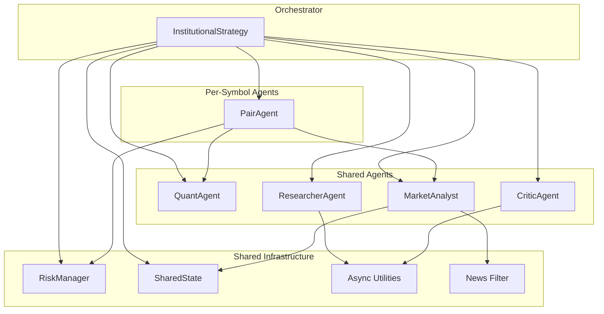

**Diagram sources**
- [institutional_strategy.py](file://strategy/institutional_strategy.py#L49-L94)
- [pair_agent.py](file://strategy/pair_agent.py#L22-L54)
- [quant_agent.py](file://analysis/quant_agent.py#L34-L50)
- [market_analyst.py](file://analysis/market_analyst.py#L7-L19)
- [researcher_agent.py](file://analysis/researcher_agent.py#L5-L15)
- [critic_agent.py](file://analysis/critic_agent.py#L10-L15)
- [risk_manager.py](file://utils/risk_manager.py#L14-L36)
- [shared_state.py](file://utils/shared_state.py#L23-L26)
- [async_utils.py](file://utils/async_utils.py#L9-L16)
- [news_filter.py](file://utils/news_filter.py#L159-L205)

**Section sources**
- [main.py](file://main.py#L19-L75)
- [settings.py](file://config/settings.py#L17-L60)

## Core Components
- InstitutionalStrategy: Central orchestrator that initializes shared agents, manages global state, runs the scanning loop, and executes trades. It coordinates per-symbol PairAgent instances and applies global risk controls.
- PairAgent: Per-symbol agent responsible for fetching data, performing quant analysis, regime checks, constructing candidates, and managing active positions.
- QuantAgent: Shared ML/technical analyzer that computes confluence scores, ML probabilities, and AI signals.
- MarketAnalyst: Shared regime detector and AI opinion provider, persisting regime state to SharedState.
- ResearcherAgent: Shared AI synthesizer that debates bullish/bearish arguments and produces a final action/confidence.
- CriticAgent: Shared post-mortem reviewer that grades closed trades and persists lessons learned.
- RiskManager: Centralized risk engine enforcing pre-scan checks, correlation filters, position sizing, and trailing/BE logic.
- SharedState: Persistent key-value store enabling cross-agent collaboration without tight coupling.
- Async Utilities: Thread pool-based executor and rate limiter to avoid blocking the event loop.
- News Filter: High-impact event avoidance logic integrated into scanning and risk checks.

**Section sources**
- [institutional_strategy.py](file://strategy/institutional_strategy.py#L49-L94)
- [pair_agent.py](file://strategy/pair_agent.py#L22-L54)
- [quant_agent.py](file://analysis/quant_agent.py#L34-L50)
- [market_analyst.py](file://analysis/market_analyst.py#L7-L19)
- [researcher_agent.py](file://analysis/researcher_agent.py#L5-L15)
- [critic_agent.py](file://analysis/critic_agent.py#L10-L15)
- [risk_manager.py](file://utils/risk_manager.py#L14-L36)
- [shared_state.py](file://utils/shared_state.py#L23-L26)
- [async_utils.py](file://utils/async_utils.py#L9-L16)
- [news_filter.py](file://utils/news_filter.py#L159-L205)

## Architecture Overview
The system operates as a continuous loop:
- InstitutionalStrategy initializes shared agents and per-symbol PairAgents.
- During each cycle, InstitutionalStrategy asynchronously invokes PairAgent.scan() for all symbols.
- PairAgent performs data fetching, quant analysis, regime checks, and constructs candidates.
- InstitutionalStrategy aggregates candidates, applies global risk checks, and selects the best candidate.
- InstitutionalStrategy delegates to ResearcherAgent for a final debate and confidence assessment.
- If approved, InstitutionalStrategy executes the trade via RiskManager and MT5Client, then notifies PairAgent.
- Periodically, InstitutionalStrategy triggers CriticAgent to analyze closed trades and improve future decisions.

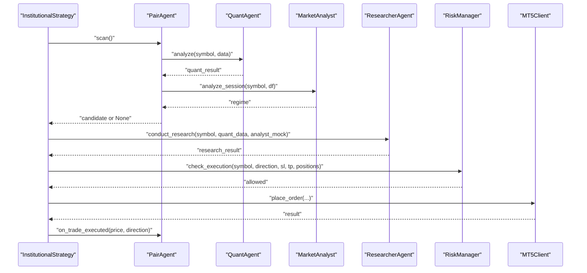

**Diagram sources**
- [institutional_strategy.py](file://strategy/institutional_strategy.py#L99-L336)
- [pair_agent.py](file://strategy/pair_agent.py#L71-L295)
- [quant_agent.py](file://analysis/quant_agent.py#L109-L159)
- [market_analyst.py](file://analysis/market_analyst.py#L25-L71)
- [researcher_agent.py](file://analysis/researcher_agent.py#L17-L82)
- [risk_manager.py](file://utils/risk_manager.py#L237-L295)

## Detailed Component Analysis

### InstitutionalStrategy
- Responsibilities:
  - Initialize shared agents (QuantAgent, MarketAnalyst, ResearcherAgent, CriticAgent) and RiskManager.
  - Create per-symbol PairAgent instances and maintain a registry.
  - Run the scanning loop: parallel PairAgent scans, global risk checks, candidate selection, Researcher debate, and execution.
  - Broadcast events to the dashboard and Telegram.
  - Periodically trigger CriticAgent for post-mortem reviews.
- Key orchestration patterns:
  - Parallelism: asyncio.gather() to run all PairAgent.scan() concurrently.
  - Global gating: session filters, daily limits, and position caps.
  - Decision fusion: ResearcherAgent’s action/confidence and Sureshot thresholds.
  - Execution: RiskManager.check_execution(), position sizing, and MT5Client order placement.

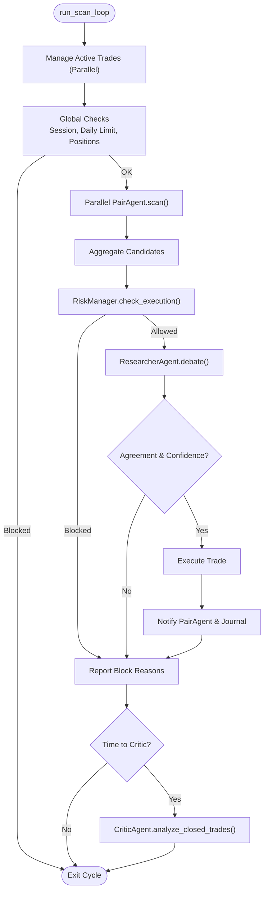

**Diagram sources**
- [institutional_strategy.py](file://strategy/institutional_strategy.py#L99-L336)

**Section sources**
- [institutional_strategy.py](file://strategy/institutional_strategy.py#L49-L94)
- [institutional_strategy.py](file://strategy/institutional_strategy.py#L99-L336)

### PairAgent
- Responsibilities:
  - Fetch multi-timeframe historical data asynchronously.
  - Delegate quant analysis to QuantAgent and regime analysis to MarketAnalyst.
  - Apply filters: minimum confluence, ML probability, regime compatibility, volatility thresholds, spread-adjusted TP/SL, and R:R gates.
  - Construct candidates with attributes for downstream use.
  - Manage active positions: trailing stops, break-even, partial closes, and regime exits.
  - Circuit breaker and performance tracking.
- Communication patterns:
  - Uses run_in_executor() to call blocking functions (data loading, quant analysis).
  - Interacts with MarketAnalyst for regime and SharedState for persistence.
  - Notifies InstitutionalStrategy upon execution.

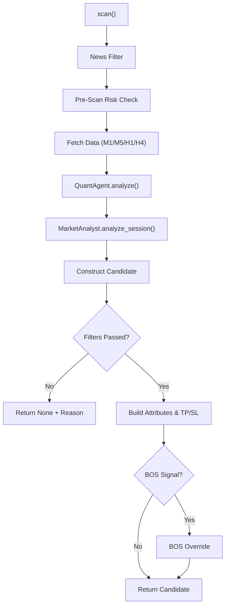

**Diagram sources**
- [pair_agent.py](file://strategy/pair_agent.py#L71-L295)

**Section sources**
- [pair_agent.py](file://strategy/pair_agent.py#L22-L54)
- [pair_agent.py](file://strategy/pair_agent.py#L71-L295)

### QuantAgent
- Responsibilities:
  - Load ML models (Random Forest, XGBoost, LSTM, Lag-Llama).
  - Compute technical features and trends across multiple timeframes.
  - Generate ML probabilities and AI signals.
  - Calculate confluence score and ensemble vote.
- Integration:
  - Used by PairAgent for quant analysis and by MarketAnalyst for regime context.

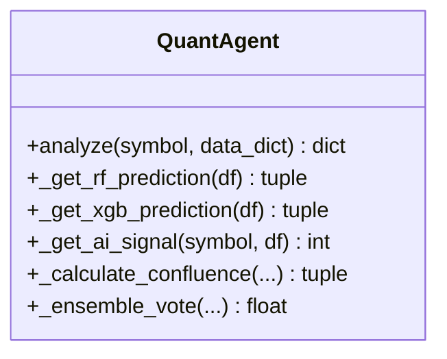

**Diagram sources**
- [quant_agent.py](file://analysis/quant_agent.py#L34-L159)

**Section sources**
- [quant_agent.py](file://analysis/quant_agent.py#L34-L159)

### MarketAnalyst
- Responsibilities:
  - Detect market regimes (TRENDING, RANGING, VOLATILE, NORMAL).
  - Provide AI market opinion (async).
  - Persist regime state to SharedState for cross-agent access.
- Integration:
  - Called by PairAgent and used by ResearcherAgent for context.

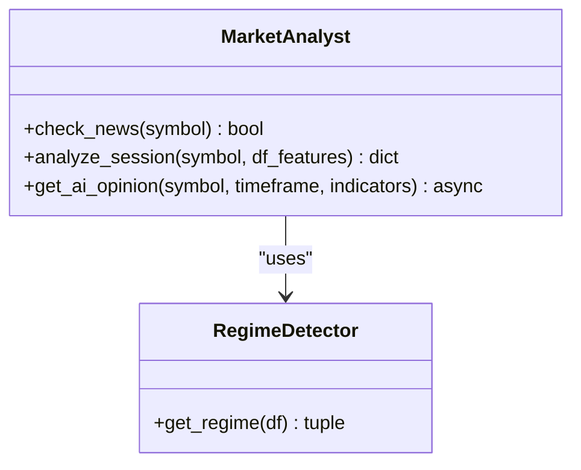

**Diagram sources**
- [market_analyst.py](file://analysis/market_analyst.py#L7-L71)
- [regime.py](file://analysis/regime.py#L8-L57)

**Section sources**
- [market_analyst.py](file://analysis/market_analyst.py#L7-L71)
- [regime.py](file://analysis/regime.py#L8-L57)

### ResearcherAgent
- Responsibilities:
  - Conduct a structured debate (bull/bear) using quant and analyst inputs.
  - Produce a final action (BUY/SELL/HOLD) and confidence score.
  - Fallback behavior when LLM is unavailable.
- Integration:
  - Called by InstitutionalStrategy after candidate aggregation.

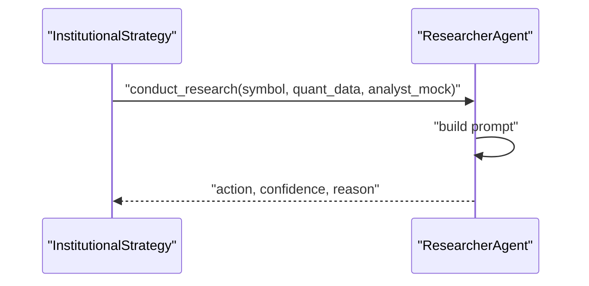

**Diagram sources**
- [researcher_agent.py](file://analysis/researcher_agent.py#L17-L82)
- [institutional_strategy.py](file://strategy/institutional_strategy.py#L280-L296)

**Section sources**
- [researcher_agent.py](file://analysis/researcher_agent.py#L5-L15)
- [researcher_agent.py](file://analysis/researcher_agent.py#L17-L82)

### CriticAgent
- Responsibilities:
  - Periodically review closed trades without post-mortem.
  - Ask advisor to grade trades and extract lessons.
  - Persist analysis and lessons to TradeJournal database.
- Integration:
  - Triggered by InstitutionalStrategy on a schedule.

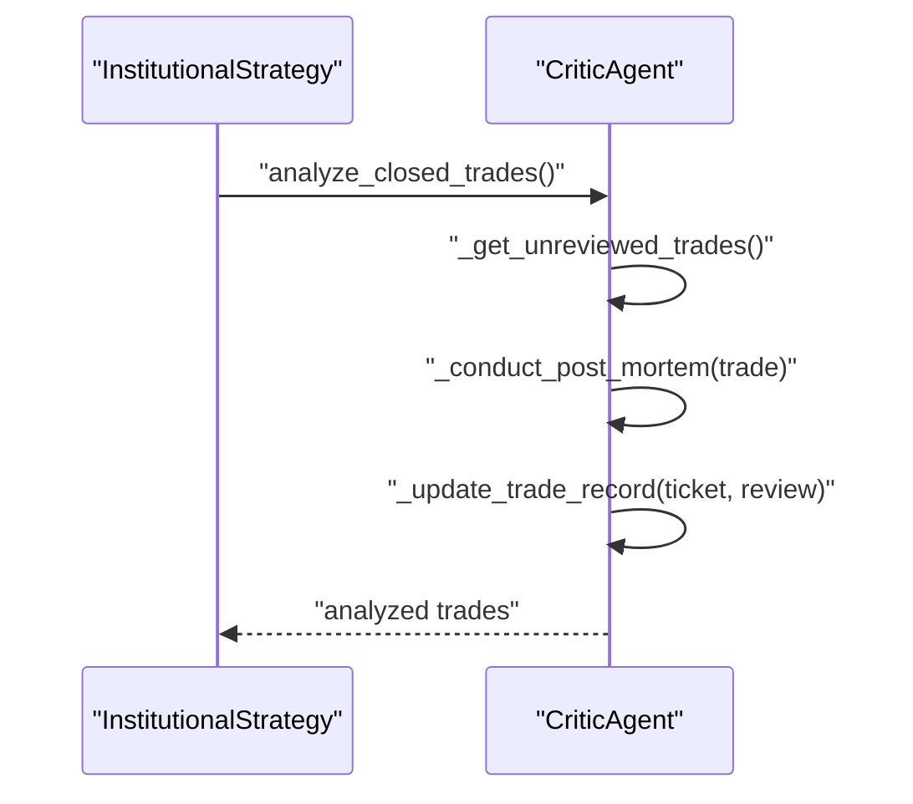

**Diagram sources**
- [critic_agent.py](file://analysis/critic_agent.py#L17-L52)
- [institutional_strategy.py](file://strategy/institutional_strategy.py#L326-L329)

**Section sources**
- [critic_agent.py](file://analysis/critic_agent.py#L10-L15)
- [critic_agent.py](file://analysis/critic_agent.py#L17-L52)

### RiskManager
- Responsibilities:
  - Pre-scan checks: daily limits, kill switch, payoff mandate, spread, news blackout, session gating.
  - Execution checks: concurrent caps, correlation conflicts, profitability thresholds.
  - Position sizing: Kelly criterion fallback to confluence tiers.
  - Active trade management: trailing stops, break-even, partial closes.
- Integration:
  - Used by InstitutionalStrategy for execution gating and by PairAgent for active management.

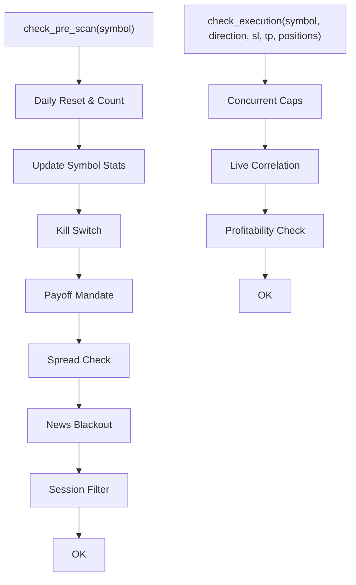

**Diagram sources**
- [risk_manager.py](file://utils/risk_manager.py#L51-L163)
- [risk_manager.py](file://utils/risk_manager.py#L237-L295)

**Section sources**
- [risk_manager.py](file://utils/risk_manager.py#L14-L36)
- [risk_manager.py](file://utils/risk_manager.py#L51-L163)
- [risk_manager.py](file://utils/risk_manager.py#L237-L295)

### SharedState
- Responsibilities:
  - Persistent key-value store for cross-agent collaboration.
  - Used by MarketAnalyst to persist regime and by RiskManager to track daily counts and circuit breaker state.
- Integration:
  - Accessed by MarketAnalyst and RiskManager.

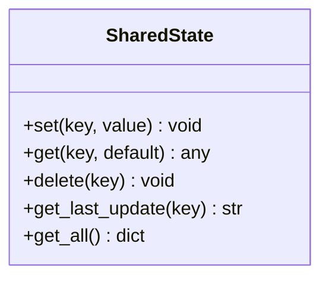

**Diagram sources**
- [shared_state.py](file://utils/shared_state.py#L23-L109)

**Section sources**
- [shared_state.py](file://utils/shared_state.py#L23-L109)

### Async Utilities
- Responsibilities:
  - run_in_executor(): offloads blocking calls to a thread pool to keep the event loop responsive.
  - AsyncRateLimiter: token-bucket rate limiting for async operations.
- Integration:
  - Used by PairAgent for data fetching and quant analysis.

**Section sources**
- [async_utils.py](file://utils/async_utils.py#L9-L16)
- [async_utils.py](file://utils/async_utils.py#L18-L45)

### News Filter
- Responsibilities:
  - Detect high-impact news events and compute blackout windows.
  - Integrate with MarketAnalyst and PairAgent for pre-scan gating.
- Integration:
  - Called by MarketAnalyst and PairAgent.

**Section sources**
- [news_filter.py](file://utils/news_filter.py#L159-L205)

## Dependency Analysis
- Coupling:
  - InstitutionalStrategy couples to shared agents and PairAgents; coupling is loose via dependency injection and shared state.
  - PairAgent depends on QuantAgent, MarketAnalyst, and RiskManager; it remains cohesive around per-symbol scanning.
  - Shared agents are stateless or minimally stateful, reducing cross-agent coupling.
- Cohesion:
  - Each agent encapsulates a single responsibility, improving maintainability.
- External dependencies:
  - MT5Client for execution and market data.
  - LLM advisor for ResearcherAgent and CriticAgent.
  - SQLite-backed SharedState and TradeJournal database.

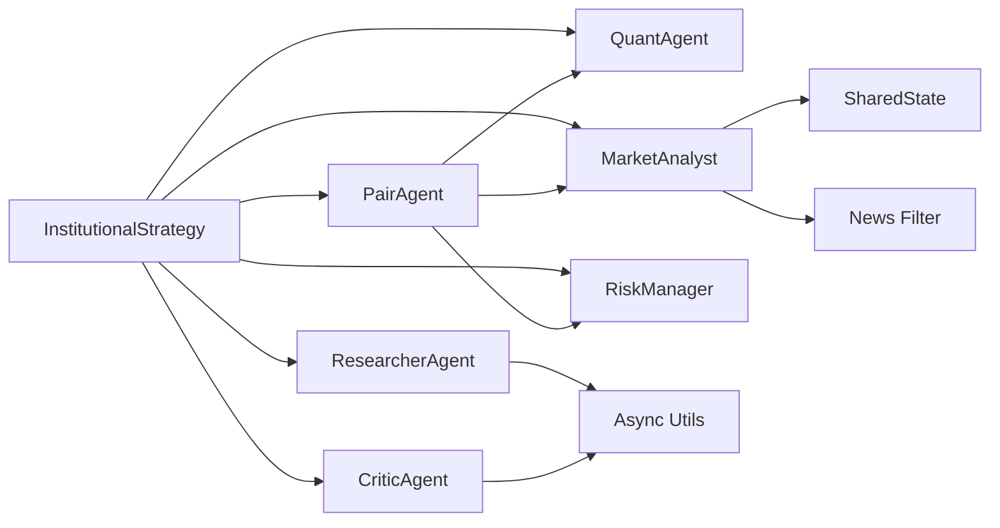

**Diagram sources**
- [institutional_strategy.py](file://strategy/institutional_strategy.py#L59-L86)
- [pair_agent.py](file://strategy/pair_agent.py#L27-L32)
- [market_analyst.py](file://analysis/market_analyst.py#L15-L18)
- [researcher_agent.py](file://analysis/researcher_agent.py#L13-L14)
- [critic_agent.py](file://analysis/critic_agent.py#L11-L12)
- [risk_manager.py](file://utils/risk_manager.py#L15-L17)
- [shared_state.py](file://utils/shared_state.py#L21)
- [async_utils.py](file://utils/async_utils.py#L7)
- [news_filter.py](file://utils/news_filter.py#L159-L205)

**Section sources**
- [institutional_strategy.py](file://strategy/institutional_strategy.py#L59-L86)
- [pair_agent.py](file://strategy/pair_agent.py#L27-L32)
- [market_analyst.py](file://analysis/market_analyst.py#L15-L18)
- [researcher_agent.py](file://analysis/researcher_agent.py#L13-L14)
- [critic_agent.py](file://analysis/critic_agent.py#L11-L12)
- [risk_manager.py](file://utils/risk_manager.py#L15-L17)
- [shared_state.py](file://utils/shared_state.py#L21)
- [async_utils.py](file://utils/async_utils.py#L7)
- [news_filter.py](file://utils/news_filter.py#L159-L205)

## Performance Considerations
- Asynchronous orchestration:
  - InstitutionalStrategy uses asyncio.gather() to scan all PairAgents concurrently, minimizing cycle latency.
  - PairAgent uses run_in_executor() to avoid blocking the event loop during data fetching and analysis.
- Adaptive sleep:
  - The main loop adapts sleep time based on cycle duration to maintain throughput.
- Position sizing:
  - RiskManager supports Kelly criterion with a quarter-Kelly fraction to reduce drawdown risk.
- Parallelism:
  - PairAgent scans across multiple timeframes (M1/M5/H1/H4) with targeted data loads to balance accuracy and speed.
- Circuit breakers and kill switches:
  - PairAgent’s circuit breaker pauses an agent after consecutive losses; RiskManager’s kill switch disables symbols exceeding loss thresholds.

[No sources needed since this section provides general guidance]

## Troubleshooting Guide
- No candidates found:
  - Verify minimum confluence score, ML probability thresholds, and regime compatibility.
  - Check news blackout and session filters.
- Execution blocked:
  - Review daily trade limits, concurrent caps, correlation conflicts, and spread thresholds.
  - Confirm R:R ratios meet minimum requirements.
- ResearcherAgent fallback:
  - If LLM API key is missing, the agent falls back to technical confidence derived from confluence score.
- Regime mismatch:
  - Ensure MarketAnalyst detects a compatible regime; adjust filters or increase confluence thresholds.
- Post-mortem not updating:
  - Confirm TradeJournal database connectivity and that closed trades lack post-mortem records.

**Section sources**
- [institutional_strategy.py](file://strategy/institutional_strategy.py#L170-L181)
- [institutional_strategy.py](file://strategy/institutional_strategy.py#L331-L436)
- [researcher_agent.py](file://analysis/researcher_agent.py#L34-L41)
- [risk_manager.py](file://utils/risk_manager.py#L237-L295)

## Conclusion
The Institutional SureShot Scanner’s multi-agent architecture achieves scalability and resilience by distributing responsibilities across specialized agents, coordinating through a central orchestrator, and sharing state and risk controls. Asynchrony and parallelism accelerate scanning, while shared agents and persistent state enable cross-agent collaboration without tight coupling. The system’s modular design supports incremental improvements, fault tolerance, and adaptive risk management, making it suitable for high-frequency, multi-asset environments.