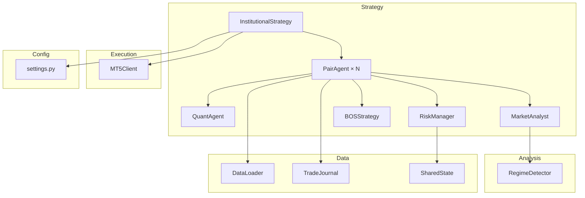
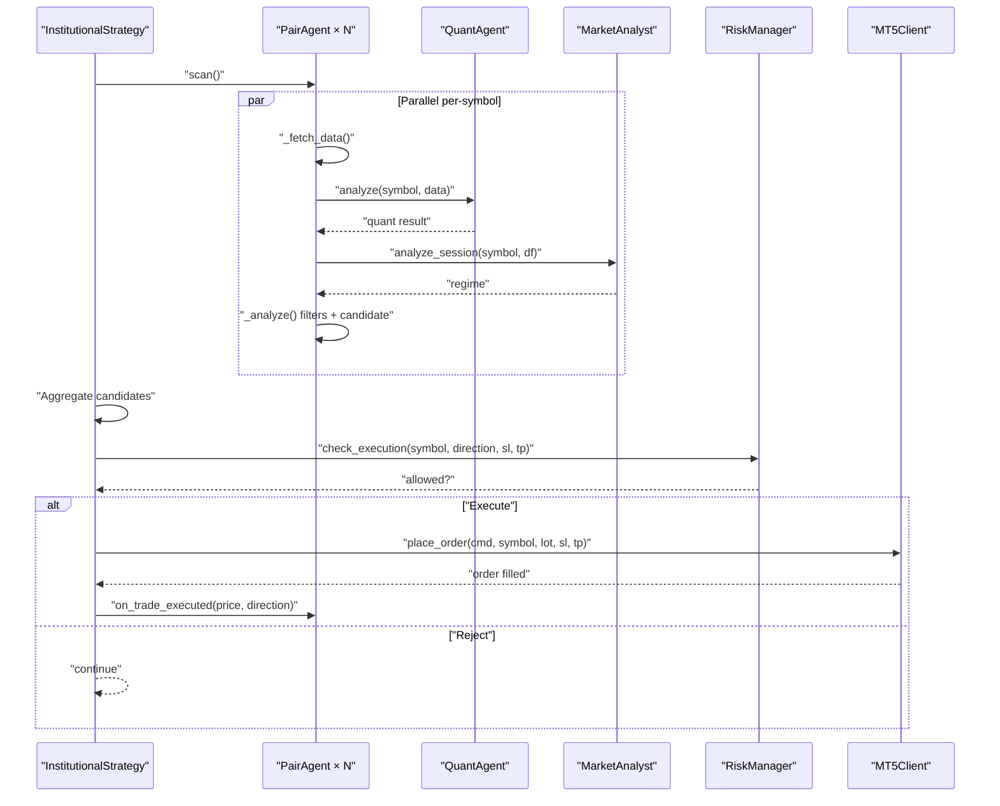
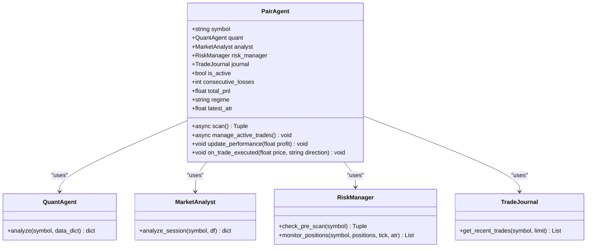
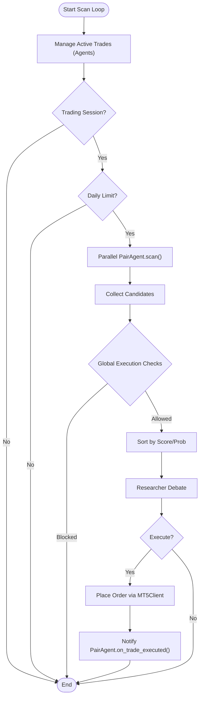
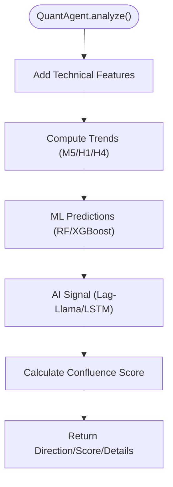
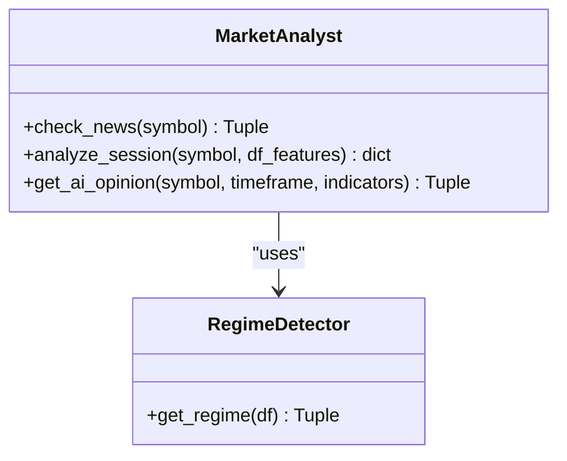
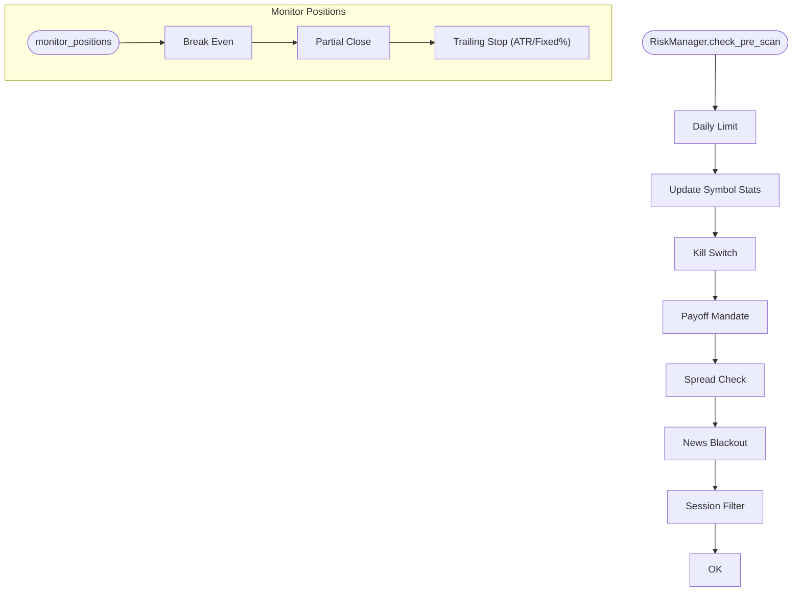
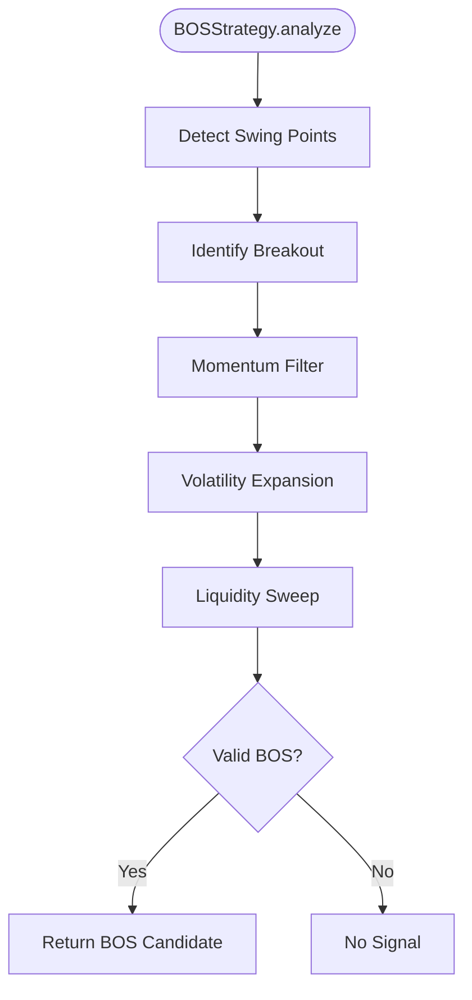
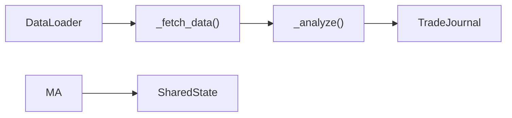
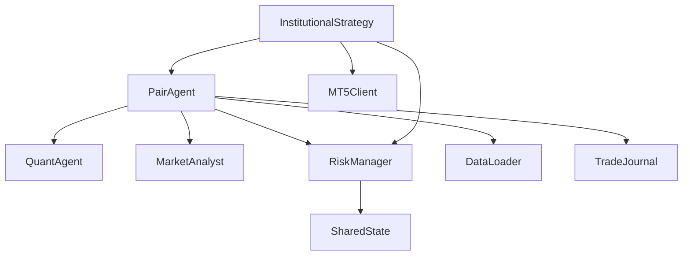

# PairAgent Swarm Intelligence

<cite>
**Referenced Files in This Document**
- [pair_agent.py](file://strategy/pair_agent.py)
- [institutional_strategy.py](file://strategy/institutional_strategy.py)
- [risk_manager.py](file://utils/risk_manager.py)
- [market_analyst.py](file://analysis/market_analyst.py)
- [quant_agent.py](file://analysis/quant_agent.py)
- [bos_strategy.py](file://strategy/bos_strategy.py)
- [trade_journal.py](file://utils/trade_journal.py)
- [loader.py](file://market_data/loader.py)
- [shared_state.py](file://utils/shared_state.py)
- [settings.py](file://config/settings.py)
- [main.py](file://main.py)
</cite>

## Table of Contents
1. [Introduction](#introduction)
2. [Project Structure](#project-structure)
3. [Core Components](#core-components)
4. [Architecture Overview](#architecture-overview)
5. [Detailed Component Analysis](#detailed-component-analysis)
6. [Dependency Analysis](#dependency-analysis)
7. [Performance Considerations](#performance-considerations)
8. [Troubleshooting Guide](#troubleshooting-guide)
9. [Conclusion](#conclusion)
10. [Appendices](#appendices)

## Introduction
This document explains the PairAgent swarm intelligence that powers independent, per-symbol trading agents within the InstitutionalStrategy. Each PairAgent is responsible for:
- Autonomous scanning and candidate generation
- Individual risk assessment and regime-aware filtering
- Active trade management including trailing stops, partial exits, and regime exits
- Internal state management and performance tracking
- Coordination with shared resources (QuantAgent, MarketAnalyst, RiskManager)

The swarm architecture ensures isolation: failures in one symbol do not cascade to others. The InstitutionalStrategy orchestrates scans in parallel, aggregates candidates, and executes trades with global risk controls.

## Project Structure
The swarm spans several modules:
- Strategy orchestration and per-symbol agents
- Shared analysis and risk management
- Market data loading and persistence
- Configuration and runtime settings

**Diagram sources**
- [institutional_strategy.py](file://strategy/institutional_strategy.py#L49-L94)
- [pair_agent.py](file://strategy/pair_agent.py#L22-L54)
- [quant_agent.py](file://analysis/quant_agent.py#L34-L50)
- [market_analyst.py](file://analysis/market_analyst.py#L7-L20)
- [risk_manager.py](file://utils/risk_manager.py#L14-L18)
- [bos_strategy.py](file://strategy/bos_strategy.py#L20-L25)
- [loader.py](file://market_data/loader.py#L40-L59)
- [trade_journal.py](file://utils/trade_journal.py#L23-L26)
- [shared_state.py](file://utils/shared_state.py#L23-L26)
- [settings.py](file://config/settings.py#L63-L64)

**Section sources**
- [main.py](file://main.py#L19-L63)
- [institutional_strategy.py](file://strategy/institutional_strategy.py#L49-L94)

## Core Components
- PairAgent: per-symbol autonomous agent performing scanning, analysis, candidate construction, and active trade management.
- InstitutionalStrategy: orchestrates parallel scans, validates candidates globally, and executes trades.
- QuantAgent: shared ML and technical analysis engine.
- MarketAnalyst: shared regime detector and AI opinion provider.
- RiskManager: shared risk control and position sizing.
- BOSStrategy: optional institutional BOS setup fusion.
- DataLoader: MT5 historical data fetcher.
- TradeJournal: persistent trade logging and analytics.
- SharedState: persistent whiteboard for cross-agent sharing.

**Section sources**
- [pair_agent.py](file://strategy/pair_agent.py#L22-L54)
- [institutional_strategy.py](file://strategy/institutional_strategy.py#L49-L94)
- [quant_agent.py](file://analysis/quant_agent.py#L34-L50)
- [market_analyst.py](file://analysis/market_analyst.py#L7-L20)
- [risk_manager.py](file://utils/risk_manager.py#L14-L18)
- [bos_strategy.py](file://strategy/bos_strategy.py#L20-L25)
- [loader.py](file://market_data/loader.py#L40-L59)
- [trade_journal.py](file://utils/trade_journal.py#L23-L26)
- [shared_state.py](file://utils/shared_state.py#L23-L26)

## Architecture Overview
The swarm operates in cycles:
- InstitutionalStrategy initializes shared resources and creates a PairAgent per symbol.
- Each PairAgent independently scans its symbol, performs analysis, and builds a candidate with risk-adjusted SL/TP.
- InstitutionalStrategy collects all candidates, applies global execution checks, and selects the best candidate.
- Optional ResearcherAgent debates the best candidate; InstitutionalStrategy decides whether to execute.
- On execution, InstitutionalStrategy calculates position size and places orders via MT5Client, then notifies the PairAgent.

**Diagram sources**
- [institutional_strategy.py](file://strategy/institutional_strategy.py#L99-L330)
- [pair_agent.py](file://strategy/pair_agent.py#L71-L105)
- [quant_agent.py](file://analysis/quant_agent.py#L109-L159)
- [market_analyst.py](file://analysis/market_analyst.py#L25-L71)
- [risk_manager.py](file://utils/risk_manager.py#L237-L295)

## Detailed Component Analysis

### PairAgent: Per-Symbol Intelligence
Responsibilities:
- Autonomous scanning and candidate generation
- Individual risk assessment and regime-aware filtering
- Active trade management (trailing stops, partial exits, regime exits)
- Internal state and performance tracking
- Integration with shared analysis resources

Key behaviors:
- Initialization loads recent trade history to restore circuit breaker state and sets internal flags.
- scan() enforces news blackout, cooldown, and pre-scan risk checks, then fetches multi-timeframe data and runs analysis.
- _analyze() composes quant signals, regime alignment, optional BOS fusion, and volatility-adaptive SL/TP.
- manage_active_trades() monitors positions, triggers RiskManager actions, and applies agent-specific regime exits.
- update_performance() maintains consecutive losses and triggers circuit breaker.

**Diagram sources**
- [pair_agent.py](file://strategy/pair_agent.py#L22-L54)
- [quant_agent.py](file://analysis/quant_agent.py#L109-L159)
- [market_analyst.py](file://analysis/market_analyst.py#L25-L71)
- [risk_manager.py](file://utils/risk_manager.py#L51-L163)
- [trade_journal.py](file://utils/trade_journal.py#L248-L264)

**Section sources**
- [pair_agent.py](file://strategy/pair_agent.py#L22-L54)
- [pair_agent.py](file://strategy/pair_agent.py#L71-L105)
- [pair_agent.py](file://strategy/pair_agent.py#L145-L295)
- [pair_agent.py](file://strategy/pair_agent.py#L297-L376)
- [pair_agent.py](file://strategy/pair_agent.py#L382-L398)

### InstitutionalStrategy: Swarm Orchestration
Responsibilities:
- Initialize shared resources (QuantAgent, MarketAnalyst, RiskManager, TradeJournal, DataCache)
- Create PairAgent instances per symbol
- Run parallel scan loop, collect and rank candidates, apply global execution checks
- Execute trades via MT5Client and notify PairAgent
- Broadcast live events to dashboard and Telegram

Key behaviors:
- run_scan_loop() manages active trades (agents), validates trading sessions and daily limits, and orchestrates parallel scans.
- Validates candidates against global risk constraints and sorts by score/probability.
- Executes best candidate after optional ResearcherAgent debate and Sureshot thresholds.
- Tracks daily trade counts, session windows, and last candle time.

**Diagram sources**
- [institutional_strategy.py](file://strategy/institutional_strategy.py#L99-L330)

**Section sources**
- [institutional_strategy.py](file://strategy/institutional_strategy.py#L49-L94)
- [institutional_strategy.py](file://strategy/institutional_strategy.py#L99-L330)

### QuantAgent: Shared ML and Technical Analysis
Responsibilities:
- Feature engineering and technical indicators
- Ensemble ML predictions (Random Forest, XGBoost)
- AI signal fusion (Lag-Llama, LSTM)
- Confluence scoring across multiple timeframes

Key behaviors:
- analyze() computes trends across M5/H1/H4, generates ML probabilities, and scores confluence for buy/sell.
- _calculate_confluence() applies trend filters and ML/AI/SMA/ADX confirmations.
- _get_ai_signal() integrates external predictors when available.

**Diagram sources**
- [quant_agent.py](file://analysis/quant_agent.py#L109-L159)

**Section sources**
- [quant_agent.py](file://analysis/quant_agent.py#L109-L159)

### MarketAnalyst: Regime and AI Opinions
Responsibilities:
- Regime classification (TRENDING/RANGING/VOLATILE/NORMAL)
- AI opinion provider (async)
- Shared state persistence for regime

Key behaviors:
- analyze_session() returns regime and details, persists to SharedState.
- get_ai_opinion() requests AI sentiment asynchronously.

**Diagram sources**
- [market_analyst.py](file://analysis/market_analyst.py#L7-L20)
- [market_analyst.py](file://analysis/market_analyst.py#L25-L71)
- [regime.py](file://analysis/regime.py#L8-L57)

**Section sources**
- [market_analyst.py](file://analysis/market_analyst.py#L25-L71)
- [regime.py](file://analysis/regime.py#L12-L57)

### RiskManager: Global and Per-Pair Risk Control
Responsibilities:
- Pre-scan checks (daily limit, kill switch, payoff mandate, spread, news, session)
- Execution checks (correlation, profitability)
- Position sizing (Kelly or confluence tiers)
- Active trade monitoring (BE, partial, trailing stop)

Key behaviors:
- check_pre_scan() enforces shared and per-symbol constraints.
- monitor_positions() returns action list (modify/partials) based on ATR or fixed percent.
- calculate_position_size() balances Kelly and confluence tiers.

**Diagram sources**
- [risk_manager.py](file://utils/risk_manager.py#L51-L163)
- [risk_manager.py](file://utils/risk_manager.py#L399-L548)

**Section sources**
- [risk_manager.py](file://utils/risk_manager.py#L51-L163)
- [risk_manager.py](file://utils/risk_manager.py#L399-L548)

### BOSStrategy: Institutional BOS Fusion
Responsibilities:
- Detect BOS setups with momentum and liquidity sweep filters
- Fuse BOS signals with ML when aligned

Key behaviors:
- analyze() identifies swing points, validates break candles, momentum, volatility expansion, and liquidity sweep.
- Returns high-confidence candidate when BOS aligns with ML direction.

**Diagram sources**
- [bos_strategy.py](file://strategy/bos_strategy.py#L26-L161)

**Section sources**
- [bos_strategy.py](file://strategy/bos_strategy.py#L26-L161)

### Data Loading and Persistence
- DataLoader: fetches historical bars from MT5 for M1/M5/H1/H4 and multi-timeframe bundles.
- TradeJournal: logs entries/exits, outcomes, and performance metrics.
- SharedState: persistent key-value store for cross-agent sharing (e.g., regime).

**Diagram sources**
- [loader.py](file://market_data/loader.py#L40-L59)
- [pair_agent.py](file://strategy/pair_agent.py#L107-L139)
- [pair_agent.py](file://strategy/pair_agent.py#L145-L295)
- [trade_journal.py](file://utils/trade_journal.py#L103-L164)
- [shared_state.py](file://utils/shared_state.py#L42-L75)

**Section sources**
- [loader.py](file://market_data/loader.py#L40-L59)
- [trade_journal.py](file://utils/trade_journal.py#L103-L164)
- [shared_state.py](file://utils/shared_state.py#L42-L75)

## Dependency Analysis
Coupling and cohesion:
- PairAgent is cohesive around per-symbol responsibilities and uses shared agents minimally.
- InstitutionalStrategy coordinates agents and centralizes execution checks, maintaining loose coupling via shared resources.
- RiskManager encapsulates global risk policies and interacts with SharedState for persistence.
- DataLoader is a thin wrapper around MT5; PairAgent isolates data fetching concerns.

Potential circular dependencies:
- None observed among core modules; shared resources are passed into constructors.

External dependencies:
- MetaTrader5 for market data and order execution.
- Pandas/Numpy for technical analysis.
- Joblib/torch/xgboost for ML models.

**Diagram sources**
- [pair_agent.py](file://strategy/pair_agent.py#L27-L32)
- [institutional_strategy.py](file://strategy/institutional_strategy.py#L54-L86)
- [risk_manager.py](file://utils/risk_manager.py#L14-L18)
- [shared_state.py](file://utils/shared_state.py#L23-L26)

**Section sources**
- [pair_agent.py](file://strategy/pair_agent.py#L27-L32)
- [institutional_strategy.py](file://strategy/institutional_strategy.py#L54-L86)
- [risk_manager.py](file://utils/risk_manager.py#L14-L18)

## Performance Considerations
- Parallelism: InstitutionalStrategy runs scans concurrently to maximize throughput.
- Lightweight caching: PairAgent caches recent ATR to reduce indicator recomputation.
- Configurable thresholds: Settings enable aggressive or conservative modes; tune MIN_CONFLUENCE_SCORE, RF_PROB_THRESHOLD, and MIN_RISK_REWARD_RATIO.
- Position sizing: Kelly criterion can increase risk when statistics are reliable; otherwise confluence tiers provide safety.
- Data efficiency: Multi-timeframe fetching is optional and controlled by settings to balance accuracy and latency.

[No sources needed since this section provides general guidance]

## Troubleshooting Guide
Common issues and remedies:
- No candidates found:
  - Verify pre-scan blocks (daily limit, kill switch, payoff mandate, spread, news, session).
  - Check multi-timeframe data availability and symbol trade mode.
- Execution blocked:
  - Confirm global execution checks (max concurrent trades, correlation conflicts, profitability).
  - Validate R:R mandate and symbol tradeability.
- Active trade management not triggering:
  - Ensure RiskManager.monitor_positions returns actions and PairAgent executes them.
  - Confirm ATR caching and threshold checks.
- Circuit breaker activation:
  - Review consecutive losses and total P&L; reset manually if appropriate.

**Section sources**
- [risk_manager.py](file://utils/risk_manager.py#L51-L163)
- [risk_manager.py](file://utils/risk_manager.py#L237-L295)
- [pair_agent.py](file://strategy/pair_agent.py#L395-L398)

## Conclusion
The PairAgent swarm provides a robust, isolated, and autonomous framework for per-symbol trading. Each agent performs independent analysis and risk management while coordinating through shared resources. InstitutionalStrategy orchestrates parallel scans, enforces global risk, and executes trades. The system’s design emphasizes resilience, adaptability, and transparency via persistent journals and shared state.

[No sources needed since this section summarizes without analyzing specific files]

## Appendices

### Agent Lifecycle and State Management
- Initialization: PairAgent loads recent trades to restore circuit breaker state and sets internal flags.
- Scanning: Pre-scan risk checks, data fetch, quant analysis, regime alignment, BOS fusion, and candidate construction.
- Active Management: RiskManager actions (BE, partial, trailing) and agent-specific regime exits.
- Performance Tracking: TradeJournal records outcomes; PairAgent updates cumulative P&L and consecutive losses.

**Section sources**
- [pair_agent.py](file://strategy/pair_agent.py#L56-L70)
- [pair_agent.py](file://strategy/pair_agent.py#L71-L105)
- [pair_agent.py](file://strategy/pair_agent.py#L297-L376)
- [trade_journal.py](file://utils/trade_journal.py#L103-L164)

### Example Exit Scenarios
- Trailing Stop: Dynamic ATR-based trailing activated when profit exceeds threshold; adjusts SL upward for buys and downward for sells.
- Partial Exit: Closes a fraction when profit reaches a defined percentage of TP distance.
- Break-Even: Moves SL to entry plus a small buffer once profit covers fees.
- Regime Exit: Closes positions when regime shifts against current holdings.

**Section sources**
- [risk_manager.py](file://utils/risk_manager.py#L399-L548)
- [pair_agent.py](file://strategy/pair_agent.py#L352-L376)

### Configuration Highlights
- Timeframe: M1 for scalping; multi-timeframe filters configurable.
- Risk: ATR-based SL/TP, R:R targets, daily caps, and spread thresholds.
- Confluence: Adjustable thresholds for ML probability and minimum confluence score.
- BOS: Institutional BOS fusion with momentum and liquidity sweep filters.

**Section sources**
- [settings.py](file://config/settings.py#L63-L64)
- [settings.py](file://config/settings.py#L77-L81)
- [settings.py](file://config/settings.py#L104-L108)
- [settings.py](file://config/settings.py#L178-L185)