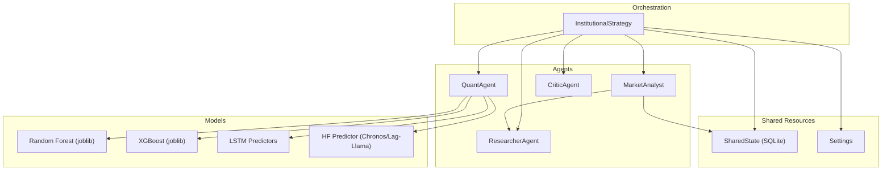
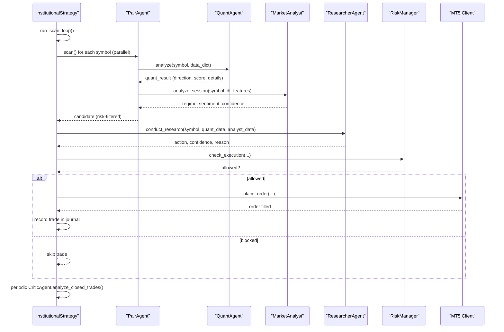
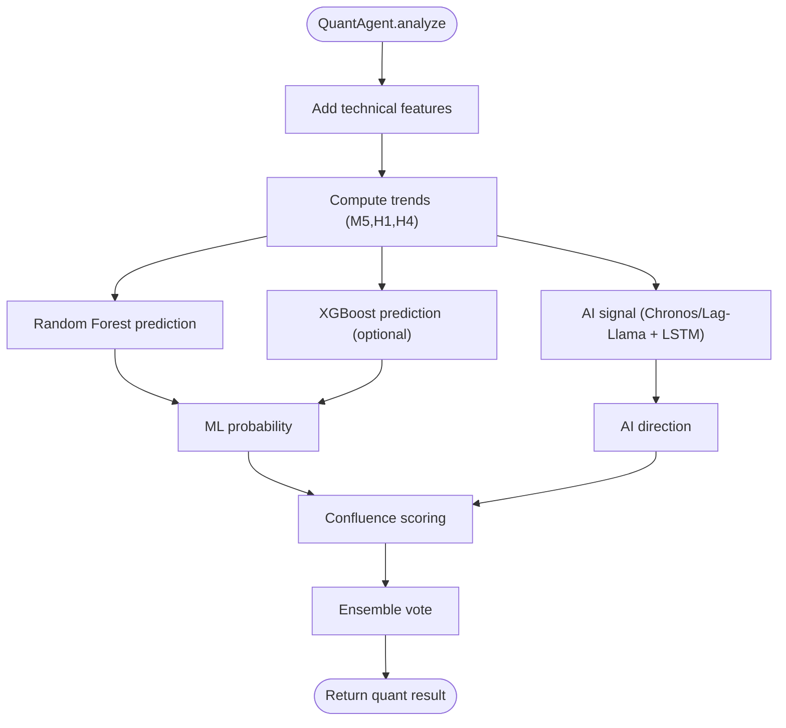
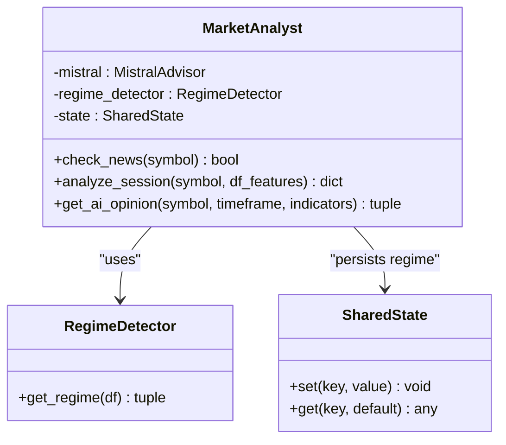
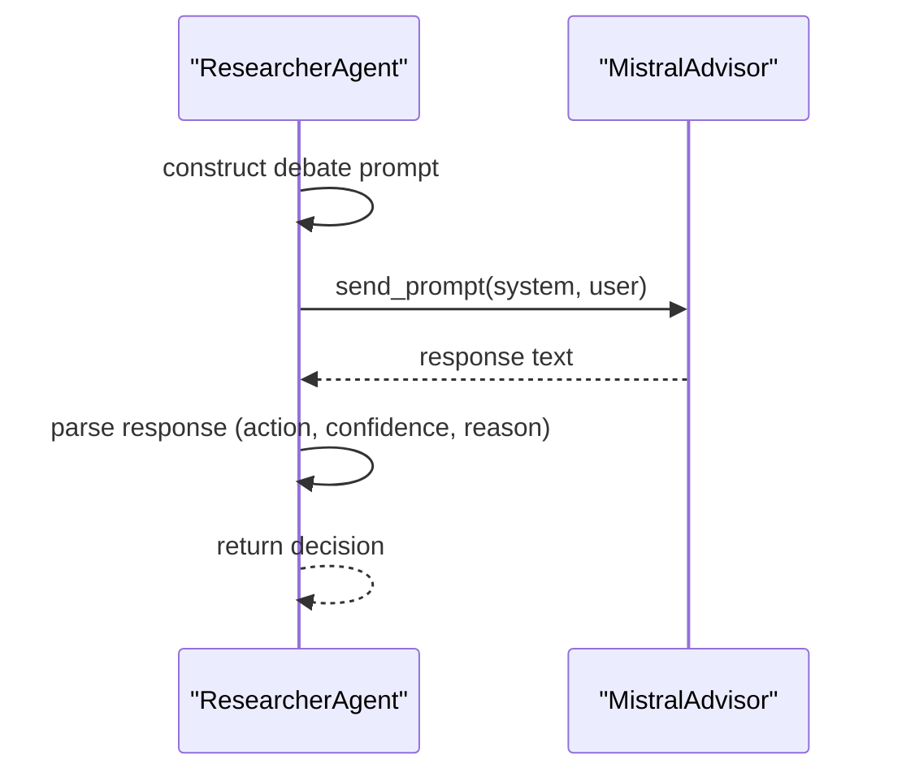
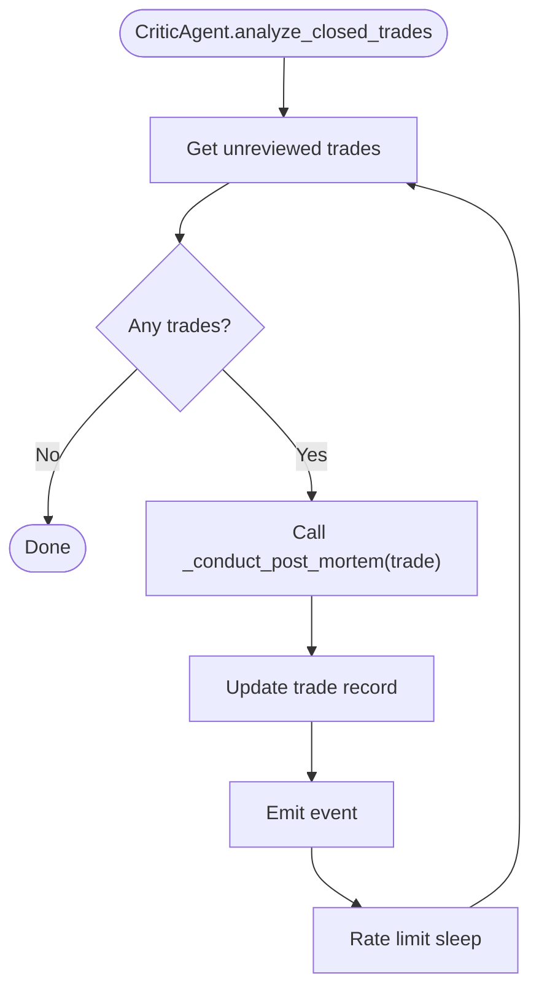
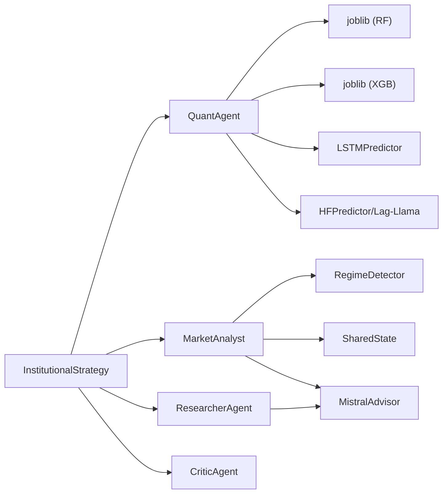

# Specialized Analysis Agents

<cite>
**Referenced Files in This Document**
- [quant_agent.py](file://analysis/quant_agent.py)
- [market_analyst.py](file://analysis/market_analyst.py)
- [researcher_agent.py](file://analysis/researcher_agent.py)
- [critic_agent.py](file://analysis/critic_agent.py)
- [regime.py](file://analysis/regime.py)
- [mistral_advisor.py](file://analysis/mistral_advisor.py)
- [gemini_advisor.py](file://analysis/gemini_advisor.py)
- [institutional_strategy.py](file://strategy/institutional_strategy.py)
- [pair_agent.py](file://strategy/pair_agent.py)
- [shared_state.py](file://utils/shared_state.py)
- [settings.py](file://config/settings.py)
</cite>

## Table of Contents
1. [Introduction](#introduction)
2. [Project Structure](#project-structure)
3. [Core Components](#core-components)
4. [Architecture Overview](#architecture-overview)
5. [Detailed Component Analysis](#detailed-component-analysis)
6. [Dependency Analysis](#dependency-analysis)
7. [Performance Considerations](#performance-considerations)
8. [Troubleshooting Guide](#troubleshooting-guide)
9. [Conclusion](#conclusion)

## Introduction
This document provides a deep, code-sourced analysis of the four specialized analysis agents that power the InstitutionalStrategy trading system:
- QuantAgent: Machine learning ensemble integration, model loading, and prediction scoring
- MarketAnalyst: Regime detection and market condition assessment
- ResearcherAgent: Debate-style analysis and confidence-based decision making
- CriticAgent: Post-mortem analysis and performance evaluation

It explains each agent’s algorithms, data processing pipelines, and integration patterns with InstitutionalStrategy, along with examples of agent collaboration, shared resource utilization, and independent operation modes.

## Project Structure
The agents live under the analysis/ directory and are orchestrated by the InstitutionalStrategy, which coordinates per-symbol PairAgents. Shared state is persisted via a lightweight SQLite-backed store.

**Diagram sources**
- [institutional_strategy.py](file://strategy/institutional_strategy.py#L49-L94)
- [quant_agent.py](file://analysis/quant_agent.py#L34-L50)
- [market_analyst.py](file://analysis/market_analyst.py#L7-L20)
- [researcher_agent.py](file://analysis/researcher_agent.py#L5-L16)
- [critic_agent.py](file://analysis/critic_agent.py#L10-L16)
- [shared_state.py](file://utils/shared_state.py#L23-L41)
- [settings.py](file://config/settings.py#L173-L197)

**Section sources**
- [institutional_strategy.py](file://strategy/institutional_strategy.py#L49-L94)
- [settings.py](file://config/settings.py#L173-L197)

## Core Components
- QuantAgent orchestrates ML inference (Random Forest, XGBoost), technical analysis, and signal scoring. It integrates optional AI forecasting via Lag-Llama/Chronos and per-symbol LSTM predictors.
- MarketAnalyst performs regime classification (TRENDING, RANGING, VOLATILE, NORMAL) and persists results to SharedState for cross-agent visibility.
- ResearcherAgent synthesizes QuantAgent and MarketAnalyst outputs into a structured debate and produces a final action with confidence.
- CriticAgent reviews closed trades asynchronously, generates post-mortems, and updates the trade journal.

**Section sources**
- [quant_agent.py](file://analysis/quant_agent.py#L34-L50)
- [market_analyst.py](file://analysis/market_analyst.py#L7-L20)
- [researcher_agent.py](file://analysis/researcher_agent.py#L5-L16)
- [critic_agent.py](file://analysis/critic_agent.py#L10-L16)

## Architecture Overview
The InstitutionalStrategy initializes shared agents and PairAgents per symbol. Each PairAgent independently fetches multi-timeframe data, runs QuantAgent and MarketAnalyst, constructs candidates, and applies risk filters. The InstitutionalStrategy then delegates the final decision to ResearcherAgent and executes trades accordingly. CriticAgent periodically reviews closed trades and emits events.

**Diagram sources**
- [institutional_strategy.py](file://strategy/institutional_strategy.py#L99-L330)
- [pair_agent.py](file://strategy/pair_agent.py#L71-L295)
- [quant_agent.py](file://analysis/quant_agent.py#L109-L159)
- [market_analyst.py](file://analysis/market_analyst.py#L25-L71)
- [researcher_agent.py](file://analysis/researcher_agent.py#L17-L83)

## Detailed Component Analysis

### QuantAgent
Responsibilities:
- ML inference using Random Forest and optional XGBoost
- Technical trend computation across multiple timeframes
- Ensemble AI signal from Lag-Llama/Chronos and LSTM predictors
- Confluence scoring across ML, AI, SMC, and ADX filters
- Final ensemble score combining ML probability, AI signal, and confluence

Key implementation details:
- Model loading prioritizes Random Forest, then optionally loads XGBoost and feature columns. LSTM predictors are loaded per symbol and a default fallback is supported.
- Feature preparation ensures only relevant columns are passed to models, dropping raw OHLC and derived fields not part of the trained feature set.
- AI signal aggregation averages multiple forecasts (Chronos/Lag-Llama and LSTM) into a single direction signal.
- Confluence scoring enforces trend filters (M5/H1/H4) and ML thresholds, plus SMC and ADX checks.
- Ensemble voting blends ML probability, AI signal, and confluence score into a normalized ensemble score.

**Diagram sources**
- [quant_agent.py](file://analysis/quant_agent.py#L109-L159)
- [quant_agent.py](file://analysis/quant_agent.py#L163-L293)

**Section sources**
- [quant_agent.py](file://analysis/quant_agent.py#L34-L50)
- [quant_agent.py](file://analysis/quant_agent.py#L52-L108)
- [quant_agent.py](file://analysis/quant_agent.py#L109-L159)
- [quant_agent.py](file://analysis/quant_agent.py#L163-L293)

### MarketAnalyst
Responsibilities:
- AI market analysis via MistralAdvisor
- Regime detection using RegimeDetector
- News blackout filtering
- Persisting regime state to SharedState for downstream agents

Key implementation details:
- News blackout check short-circuits analysis when events are active.
- RegimeDetector classifies market conditions using ADX, ATR, and Bollinger Band width.
- Results are persisted to SharedState keyed by symbol for cross-agent access.
- AI opinion is fetched asynchronously when regime permits.

**Diagram sources**
- [market_analyst.py](file://analysis/market_analyst.py#L7-L20)
- [regime.py](file://analysis/regime.py#L8-L58)
- [shared_state.py](file://utils/shared_state.py#L23-L76)

**Section sources**
- [market_analyst.py](file://analysis/market_analyst.py#L7-L20)
- [market_analyst.py](file://analysis/market_analyst.py#L25-L71)
- [regime.py](file://analysis/regime.py#L12-L58)
- [shared_state.py](file://utils/shared_state.py#L42-L76)

### ResearcherAgent
Responsibilities:
- Conducts a structured debate between bullish and bearish arguments
- Synthesizes QuantAgent and MarketAnalyst insights
- Produces a final action (BUY/SELL/HOLD) with confidence and reason

Key implementation details:
- Uses MistralAdvisor to generate a structured response with action, confidence, and reason.
- Parses responses robustly, including markdown and legacy formats.
- Falls back to technical confidence when no LLM key is present.

**Diagram sources**
- [researcher_agent.py](file://analysis/researcher_agent.py#L17-L83)
- [mistral_advisor.py](file://analysis/mistral_advisor.py#L65-L81)

**Section sources**
- [researcher_agent.py](file://analysis/researcher_agent.py#L5-L16)
- [researcher_agent.py](file://analysis/researcher_agent.py#L17-L83)
- [mistral_advisor.py](file://analysis/mistral_advisor.py#L12-L26)

### CriticAgent
Responsibilities:
- Periodically scans closed trades without post-mortem
- Asks MistralAdvisor to grade trades and extract lessons
- Updates the trade journal with scores and lessons
- Emits events for external listeners

Key implementation details:
- Queries the trade journal database for closed trades missing post-mortem.
- Builds a concise prompt and parses a standardized pipe-separated output.
- Updates records and emits events with symbol, score, lesson, and analysis.

**Diagram sources**
- [critic_agent.py](file://analysis/critic_agent.py#L17-L53)
- [critic_agent.py](file://analysis/critic_agent.py#L71-L128)

**Section sources**
- [critic_agent.py](file://analysis/critic_agent.py#L10-L16)
- [critic_agent.py](file://analysis/critic_agent.py#L17-L53)
- [critic_agent.py](file://analysis/critic_agent.py#L71-L128)

## Dependency Analysis
- QuantAgent depends on:
  - Random Forest and XGBoost models (joblib)
  - Optional LSTM predictors and Lag-Llama/Chronos predictor
  - Technical feature engineering module
- MarketAnalyst depends on:
  - RegimeDetector and SharedState
  - MistralAdvisor for AI analysis
- ResearcherAgent depends on:
  - MistralAdvisor for debate synthesis
- InstitutionalStrategy composes all agents and coordinates execution and risk management.

**Diagram sources**
- [quant_agent.py](file://analysis/quant_agent.py#L52-L84)
- [market_analyst.py](file://analysis/market_analyst.py#L15-L19)
- [researcher_agent.py](file://analysis/researcher_agent.py#L13-L15)
- [institutional_strategy.py](file://strategy/institutional_strategy.py#L54-L64)

**Section sources**
- [quant_agent.py](file://analysis/quant_agent.py#L1-L26)
- [market_analyst.py](file://analysis/market_analyst.py#L1-L6)
- [researcher_agent.py](file://analysis/researcher_agent.py#L1-L4)
- [institutional_strategy.py](file://strategy/institutional_strategy.py#L31-L34)

## Performance Considerations
- QuantAgent:
  - Single-row inference optimization for XGBoost avoids warnings and improves speed.
  - Feature column alignment prevents dimension mismatches and reduces inference overhead.
  - Optional AI forecasting (Lag-Llama/Chronos and LSTM) adds latency; enable only when beneficial.
- MarketAnalyst:
  - Regime detection is lightweight and uses rolling windows; SharedState persistence is minimal.
- ResearcherAgent:
  - Async LLM calls introduce network latency; ensure rate limits and timeouts are respected.
- InstitutionalStrategy:
  - Parallel PairAgent scanning maximizes throughput; ensure adequate CPU/GPU resources for ML inference.

[No sources needed since this section provides general guidance]

## Troubleshooting Guide
- QuantAgent model loading failures:
  - Verify model paths and feature files exist; check environment variables for model locations.
  - Confirm device availability for LSTM predictors (CUDA vs CPU).
- MarketAnalyst regime misclassification:
  - Ensure sufficient historical bars for indicators; confirm feature engineering is applied before regime detection.
- ResearcherAgent parsing errors:
  - LLM output format variations; the parser supports markdown and legacy formats.
- CriticAgent database issues:
  - Confirm trade journal database path and permissions; ensure required columns exist.

**Section sources**
- [quant_agent.py](file://analysis/quant_agent.py#L52-L70)
- [regime.py](file://analysis/regime.py#L23-L24)
- [researcher_agent.py](file://analysis/researcher_agent.py#L84-L132)
- [critic_agent.py](file://analysis/critic_agent.py#L54-L69)

## Conclusion
The four agents form a cohesive, modular decision-making pipeline:
- QuantAgent provides robust ML-driven signals with technical confluence.
- MarketAnalyst supplies macro context via regime detection and AI sentiment.
- ResearcherAgent synthesizes micro and macro signals into a final decision with confidence.
- CriticAgent continuously improves the system by reviewing outcomes and extracting lessons.

They collaborate through shared resources (SharedState, Settings) and asynchronous communication, enabling both coordinated orchestration and independent operation where appropriate.