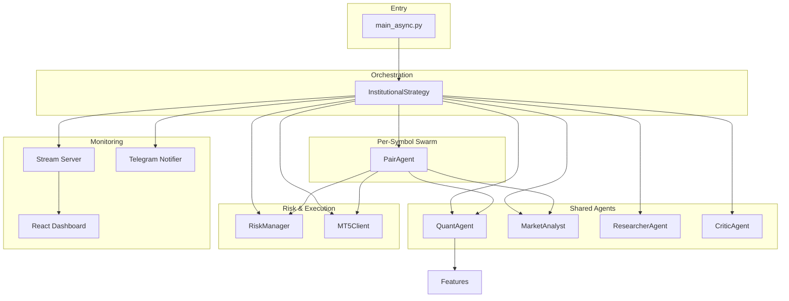
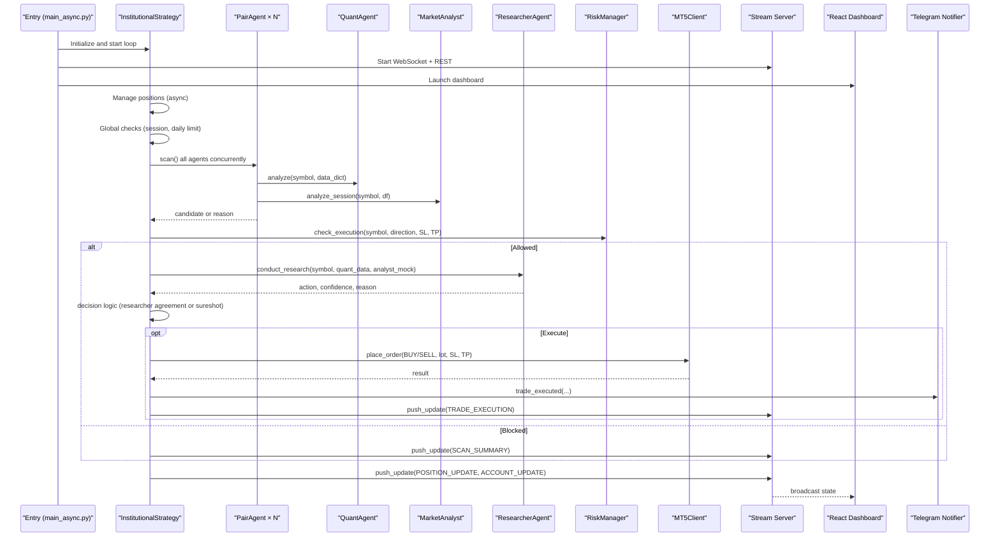
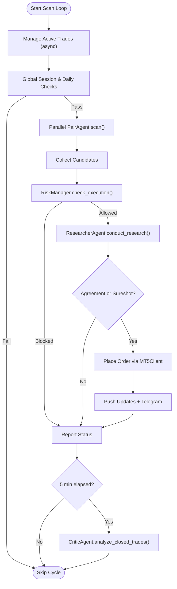
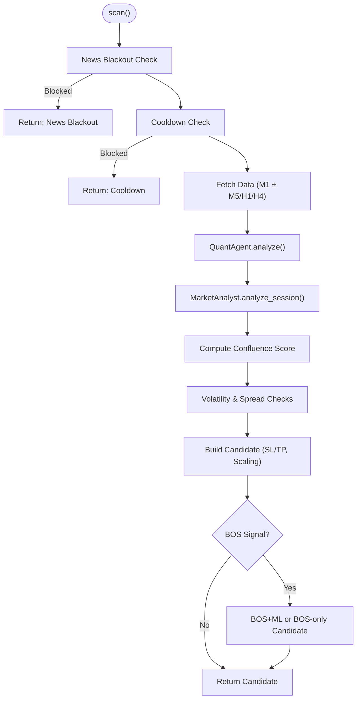
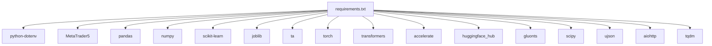

# Project Overview

<cite>
**Referenced Files in This Document**
- [README.md](file://README.md)
- [main_async.py](file://main_async.py)
- [strategy/institutional_strategy.py](file://strategy/institutional_strategy.py)
- [strategy/pair_agent.py](file://strategy/pair_agent.py)
- [analysis/quant_agent.py](file://analysis/quant_agent.py)
- [analysis/market_analyst.py](file://analysis/market_analyst.py)
- [analysis/researcher_agent.py](file://analysis/researcher_agent.py)
- [analysis/critic_agent.py](file://analysis/critic_agent.py)
- [utils/risk_manager.py](file://utils/risk_manager.py)
- [execution/mt5_client.py](file://execution/mt5_client.py)
- [api/stream_server.py](file://api/stream_server.py)
- [dashboard/src/App.jsx](file://dashboard/src/App.jsx)
- [utils/telegram_notifier.py](file://utils/telegram_notifier.py)
- [config/settings.py](file://config/settings.py)
- [strategy/features.py](file://strategy/features.py)
- [requirements.txt](file://requirements.txt)
</cite>

## Table of Contents
1. [Introduction](#introduction)
2. [Project Structure](#project-structure)
3. [Core Components](#core-components)
4. [Architecture Overview](#architecture-overview)
5. [Detailed Component Analysis](#detailed-component-analysis)
6. [Dependency Analysis](#dependency-analysis)
7. [Performance Considerations](#performance-considerations)
8. [Troubleshooting Guide](#troubleshooting-guide)
9. [Conclusion](#conclusion)
10. [Appendices](#appendices)

## Introduction
Institutional SureShot Scanner is a multi-agent asynchronous scalping system for MetaTrader 5 designed to operate autonomously. It scans all available tradable instruments in parallel, applies a multi-timeframe technical and macro regime analysis, debates each setup through a structured Bull vs Bear synthesis, and executes disciplined, risk-managed trades. Real-time monitoring is provided via a React dashboard and Telegram alerts, while institutional-grade risk controls govern position sizing, session gating, and automatic kill switches.

The system’s purpose is to deliver a robust, adaptive, and transparent autonomous trading platform that balances technical confluence, macro regime awareness, and post-trade reflection to improve expectancy over time.

## Project Structure
High-level layout of the project and how modules relate to each other:
- Entry point initializes MT5, detects symbols, starts the streaming API and React dashboard, and runs the async scanning loop.
- The InstitutionalStrategy orchestrates the swarm of PairAgent instances and coordinates shared agents (QuantAgent, MarketAnalyst, ResearcherAgent, CriticAgent).
- RiskManager centralizes pre- and post-trade checks and position management.
- Execution layer interacts with MT5 for order placement and position management.
- API and dashboard provide real-time telemetry and event streaming.
- Utilities include Telegram notifications, news filtering, and shared state.

**Diagram sources**
- [main_async.py](file://main_async.py#L20-L96)
- [strategy/institutional_strategy.py](file://strategy/institutional_strategy.py#L99-L330)
- [strategy/pair_agent.py](file://strategy/pair_agent.py#L71-L295)
- [analysis/quant_agent.py](file://analysis/quant_agent.py#L109-L159)
- [analysis/market_analyst.py](file://analysis/market_analyst.py#L25-L71)
- [analysis/researcher_agent.py](file://analysis/researcher_agent.py#L17-L82)
- [analysis/critic_agent.py](file://analysis/critic_agent.py#L17-L52)
- [utils/risk_manager.py](file://utils/risk_manager.py#L51-L163)
- [execution/mt5_client.py](file://execution/mt5_client.py#L29-L101)
- [api/stream_server.py](file://api/stream_server.py#L153-L173)
- [dashboard/src/App.jsx](file://dashboard/src/App.jsx#L12-L100)
- [utils/telegram_notifier.py](file://utils/telegram_notifier.py#L30-L146)
- [strategy/features.py](file://strategy/features.py#L6-L98)

**Section sources**
- [README.md](file://README.md#L187-L235)
- [main_async.py](file://main_async.py#L20-L96)
- [config/settings.py](file://config/settings.py#L1-L201)

## Core Components
- InstitutionalStrategy: Orchestrator coordinating the swarm, managing scan cycles, global risk gates, and event broadcasting.
- PairAgent: Per-symbol agent performing data fetching, multi-timeframe analysis, candidate construction, and active trade management.
- QuantAgent: Technical analyzer combining ML models (Random Forest, XGBoost), ensemble voting, AI signals, and confluence scoring.
- MarketAnalyst: Macro regime detector and AI opinion provider, with news blackout integration.
- ResearcherAgent: Async Bull vs Bear debate synthesizer producing a final action with confidence and reasoning.
- CriticAgent: Post-trade review agent that grades closed trades asynchronously.
- RiskManager: Centralized pre- and post-trade risk checks, position sizing, trailing/BE/partial close, correlation filter, and kill switch.
- MT5Client: Broker connectivity, symbol detection, order placement, and position management.
- Stream Server + React Dashboard: Real-time WebSocket + REST endpoints feeding live account, positions, scan summary, and events.
- Telegram Notifier: Non-blocking push notifications for startup, scan signals, executions, and kill switch events.

**Section sources**
- [README.md](file://README.md#L12-L82)
- [strategy/institutional_strategy.py](file://strategy/institutional_strategy.py#L49-L86)
- [strategy/pair_agent.py](file://strategy/pair_agent.py#L22-L54)
- [analysis/quant_agent.py](file://analysis/quant_agent.py#L34-L50)
- [analysis/market_analyst.py](file://analysis/market_analyst.py#L7-L19)
- [analysis/researcher_agent.py](file://analysis/researcher_agent.py#L5-L15)
- [analysis/critic_agent.py](file://analysis/critic_agent.py#L10-L15)
- [utils/risk_manager.py](file://utils/risk_manager.py#L14-L39)
- [execution/mt5_client.py](file://execution/mt5_client.py#L12-L27)
- [api/stream_server.py](file://api/stream_server.py#L17-L34)
- [utils/telegram_notifier.py](file://utils/telegram_notifier.py#L30-L38)

## Architecture Overview
The system operates as an asynchronous multi-agent ecosystem:
- Entry point initializes MT5, detects symbols, starts the API server and dashboard, then runs an async loop.
- InstitutionalStrategy manages:
  - Parallel scanning of all PairAgent instances.
  - Global session and daily trade limits.
  - Execution gating via RiskManager.
  - ResearcherAgent debate and decision fusion.
  - Event broadcasting to WebSocket and REST endpoints.
  - Periodic CriticAgent post-mortem analysis.
- PairAgent performs:
  - Multi-timeframe data fetch (M1 primary, plus optional M5/H1/H4).
  - Quantitative analysis (technical features, ML/XGBoost/LSTM/LLM).
  - Market regime integration.
  - Candidate construction with volatility-aware SL/TP and scaling factor.
  - Active trade management (trailing stops, breakeven, partial closes).
- Shared agents collaborate:
  - QuantAgent scores setups and provides ensemble signals.
  - MarketAnalyst classifies regime and filters news blackouts.
  - ResearcherAgent synthesizes qualitative arguments and yields a final action.
  - CriticAgent asynchronously reviews closed trades.
- RiskManager enforces:
  - Kill switch, payoff mandate, spread gates, session filters, correlation conflicts.
  - Position sizing via Kelly-adjusted fractional stakes and confluence tiers.
  - Dynamic trailing stops and partial profit taking.

**Diagram sources**
- [main_async.py](file://main_async.py#L65-L96)
- [strategy/institutional_strategy.py](file://strategy/institutional_strategy.py#L99-L330)
- [strategy/pair_agent.py](file://strategy/pair_agent.py#L71-L295)
- [analysis/quant_agent.py](file://analysis/quant_agent.py#L109-L159)
- [analysis/market_analyst.py](file://analysis/market_analyst.py#L25-L71)
- [analysis/researcher_agent.py](file://analysis/researcher_agent.py#L17-L82)
- [utils/risk_manager.py](file://utils/risk_manager.py#L237-L295)
- [execution/mt5_client.py](file://execution/mt5_client.py#L216-L292)
- [api/stream_server.py](file://api/stream_server.py#L177-L212)
- [utils/telegram_notifier.py](file://utils/telegram_notifier.py#L66-L81)

## Detailed Component Analysis

### InstitutionalStrategy (Orchestrator)
Responsibilities:
- Initialize shared agents and PairAgent swarm.
- Run periodic scan loops with parallelism.
- Apply global risk and session filters.
- Coordinate Researcher debate and execution gating.
- Broadcast events to WebSocket and REST endpoints.
- Schedule periodic CriticAgent reviews.

Key behaviors:
- Parallel scan via asyncio.gather.
- Decision fusion: researcher agreement or sureshot threshold.
- Event-driven telemetry for dashboard and Telegram.

**Diagram sources**
- [strategy/institutional_strategy.py](file://strategy/institutional_strategy.py#L99-L330)
- [utils/risk_manager.py](file://utils/risk_manager.py#L237-L295)
- [analysis/researcher_agent.py](file://analysis/researcher_agent.py#L17-L82)
- [execution/mt5_client.py](file://execution/mt5_client.py#L216-L292)
- [api/stream_server.py](file://api/stream_server.py#L177-L212)
- [utils/telegram_notifier.py](file://utils/telegram_notifier.py#L66-L81)

**Section sources**
- [strategy/institutional_strategy.py](file://strategy/institutional_strategy.py#L49-L330)

### PairAgent (Per-Symbol Swarm)
Responsibilities:
- Fetch historical data across M1 and optional higher timeframes.
- Compute technical features and multi-timeframe trends.
- Combine QuantAgent scoring with MarketAnalyst regime.
- Construct candidates with volatility-aware SL/TP and scaling factor.
- Enforce pre-scan risk checks and manage active positions.

Key logic highlights:
- Multi-timeframe trend filters (M5/H1/H4).
- Volatility-adaptive thresholds (ATR minimums per asset class).
- Spread-adjusted TP/SL and minimum R:R enforcement.
- Optional BOS-only candidate generation with retail viability checks.

**Diagram sources**
- [strategy/pair_agent.py](file://strategy/pair_agent.py#L71-L295)
- [analysis/quant_agent.py](file://analysis/quant_agent.py#L109-L159)
- [analysis/market_analyst.py](file://analysis/market_analyst.py#L25-L71)
- [strategy/features.py](file://strategy/features.py#L6-L98)

**Section sources**
- [strategy/pair_agent.py](file://strategy/pair_agent.py#L22-L295)

### QuantAgent (Technical Signals)
Responsibilities:
- Load ML models (Random Forest, XGBoost) and optional LSTM/Lag-Llama.
- Engineer technical features and compute trend signals across timeframes.
- Produce directional score, ML probability, and ensemble vote.
- Integrate AI signals from forecasting models.

Implementation notes:
- Uses strategy.features for institutional-grade indicators (RSI, BB, ATR, ADX, MACD, OB/FVG/Liquidity).
- Computes multi-timeframe trend alignment for confluence.
- Ensemble combines ML/XGBoost probabilities, AI signals, and technical score.

**Section sources**
- [analysis/quant_agent.py](file://analysis/quant_agent.py#L34-L294)
- [strategy/features.py](file://strategy/features.py#L6-L98)

### MarketAnalyst (Macro Regime)
Responsibilities:
- Detect market regime and persist to shared state.
- Provide AI opinion when configured.
- Fast news blackout checks.

**Section sources**
- [analysis/market_analyst.py](file://analysis/market_analyst.py#L7-L81)

### ResearcherAgent (Debate & Synthesis)
Responsibilities:
- Conduct structured Bull vs Bear debate using facts from QuantAgent and MarketAnalyst.
- Return final action (BUY/SELL/HOLD), confidence, and reasoning.
- Fallback to technical confidence when LLM unavailable.

**Section sources**
- [analysis/researcher_agent.py](file://analysis/researcher_agent.py#L5-L132)

### CriticAgent (Post-Trade Reflection)
Responsibilities:
- Asynchronously review closed trades and produce a concise assessment.
- Emit events for dashboard consumption.

**Section sources**
- [analysis/critic_agent.py](file://analysis/critic_agent.py#L10-L141)

### RiskManager (Institutional Risk Controls)
Responsibilities:
- Pre-scan checks: daily limit, kill switch, payoff mandate, spread, news, session.
- Execution checks: correlation conflict, profitability buffer.
- Position sizing: Kelly-adjusted fractional stakes and confluence tiers.
- Active management: trailing stops, breakeven, partial closes.

**Section sources**
- [utils/risk_manager.py](file://utils/risk_manager.py#L14-L549)

### MT5Client (Execution Layer)
Responsibilities:
- Connect to MT5, detect available symbols, and populate settings universes.
- Place orders (market or pending), modify SL/TP, partial close, and full close.
- Dynamic lot sizing based on account risk and SL distance.

**Section sources**
- [execution/mt5_client.py](file://execution/mt5_client.py#L12-L385)

### Stream Server + React Dashboard + Telegram
- Stream Server: WebSocket endpoint and REST endpoints for live telemetry.
- React Dashboard: Real-time panels for account, scanner grid, positions, trade feed, and event log.
- Telegram Notifier: Non-blocking push notifications for key events.

**Section sources**
- [api/stream_server.py](file://api/stream_server.py#L17-L212)
- [dashboard/src/App.jsx](file://dashboard/src/App.jsx#L12-L104)
- [utils/telegram_notifier.py](file://utils/telegram_notifier.py#L30-L174)

## Dependency Analysis
External libraries and their roles:
- python-dotenv: Environment variable loading.
- MetaTrader5: Broker connectivity and order routing.
- pandas/numpy: Data structures and computations.
- scikit-learn/joblib: ML model persistence and inference.
- ta: Technical indicators library.
- torch/transformers/accelerate/huggingface_hub/gluonts: Optional deep learning and forecasting models.
- aiohttp: Async HTTP support.
- ujson/tqdm: Serialization and progress utilities.

**Diagram sources**
- [requirements.txt](file://requirements.txt#L1-L17)

**Section sources**
- [requirements.txt](file://requirements.txt#L1-L17)

## Performance Considerations
- Asynchronous orchestration: Parallel PairAgent scans reduce cycle time and enable responsive monitoring.
- Lightweight feature engineering: Institutional-grade indicators computed once per scan to minimize overhead.
- Dynamic throttling: Sleep adjusted by elapsed time to maintain target intervals.
- Efficient caching: PairAgent caches recent ATR estimates; SharedState persists regime and stats.
- Risk-aware sizing: Kelly-adjusted fractional stakes prevent ruin and align with expectancy.
- Real-time streaming: WebSocket broadcast minimizes polling overhead; REST endpoints poll periodically.

[No sources needed since this section provides general guidance]

## Troubleshooting Guide
Common issues and remedies:
- MT5 connection failures: Verify credentials, server, and terminal path in environment variables; ensure MT5 is running and logged in.
- No symbols detected: Confirm broker account has tradable instruments and that reference/non-USD-denominated symbols are filtered out.
- Dashboard not launching: Install Node.js and run npm install in the dashboard directory; ensure port 5173 is free.
- API server binding errors: Port 8000–8009 auto-selection prevents conflicts; check firewall if startup fails.
- Telegram notifications not received: Obtain Chat ID using the helper script and confirm token/chat ID in environment.
- High spreads or session off-hours blocking entries: Adjust spread thresholds or trade windows according to asset class and session filters.
- Kill switch activation: Review recent performance and adjust thresholds or disable for whitelisted symbols if appropriate.

**Section sources**
- [execution/mt5_client.py](file://execution/mt5_client.py#L18-L27)
- [execution/mt5_client.py](file://execution/mt5_client.py#L29-L101)
- [main_async.py](file://main_async.py#L42-L61)
- [api/stream_server.py](file://api/stream_server.py#L153-L173)
- [utils/telegram_notifier.py](file://utils/telegram_notifier.py#L154-L174)
- [utils/risk_manager.py](file://utils/risk_manager.py#L140-L163)

## Conclusion
Institutional SureShot Scanner delivers a production-ready, multi-agent asynchronous scalping system tailored for MetaTrader 5. Its agentic architecture enables parallel exploration across all tradable instruments, rigorous risk controls, and continuous self-reflection. The combination of technical confluence, macro regime awareness, and structured debate yields disciplined execution, while real-time dashboards and Telegram alerts provide transparency and responsiveness. The system’s modular design supports easy extension and deployment in live environments.

[No sources needed since this section summarizes without analyzing specific files]

## Appendices

### Practical Examples
- Autonomous operation: The async loop continuously scans, debates, and executes trades within institutional risk bounds, with no manual intervention required.
- Real-time monitoring: The React dashboard auto-launches and displays live positions, account stats, and recent trades via WebSocket and REST endpoints.
- Telegram alerts: Trade executions and kill switch activations are pushed immediately to Telegram without impacting the trading loop.

**Section sources**
- [main_async.py](file://main_async.py#L65-L96)
- [api/stream_server.py](file://api/stream_server.py#L177-L212)
- [utils/telegram_notifier.py](file://utils/telegram_notifier.py#L66-L128)
- [dashboard/src/App.jsx](file://dashboard/src/App.jsx#L12-L104)

### Multi-Timeframe Approach
- Primary timeframe: M1 for scalping.
- Confirmation filters: Optional M5/H1/H4 trend alignment to reduce counter-trend entries.
- Active management: Uses cached ATR for dynamic trailing stops and breakeven logic.

**Section sources**
- [strategy/pair_agent.py](file://strategy/pair_agent.py#L123-L137)
- [analysis/quant_agent.py](file://analysis/quant_agent.py#L125-L129)
- [utils/risk_manager.py](file://utils/risk_manager.py#L399-L548)

### Institutional Risk Management
- Kill Switch: Auto-disable symbol after sustained losses.
- Payoff Mandate: Blocks symbols with poor historical payoff.
- Risk Overrides: Whitelist key pairs to bypass certain checks.
- Position Sizing: Kelly-adjusted fractional stakes and confluence tiers.
- Session Gates: Forex sessions (London/NY) with crypto exemptions.
- Partial Close & Breakeven: Lock in profits early; trail stops dynamically.
- News Blackout: Avoids high-impact events.
- Spread Gates: Enforces maximum spread per asset class.

**Section sources**
- [utils/risk_manager.py](file://utils/risk_manager.py#L14-L39)
- [utils/risk_manager.py](file://utils/risk_manager.py#L207-L235)
- [utils/risk_manager.py](file://utils/risk_manager.py#L341-L396)
- [utils/risk_manager.py](file://utils/risk_manager.py#L399-L548)
- [config/settings.py](file://config/settings.py#L69-L167)